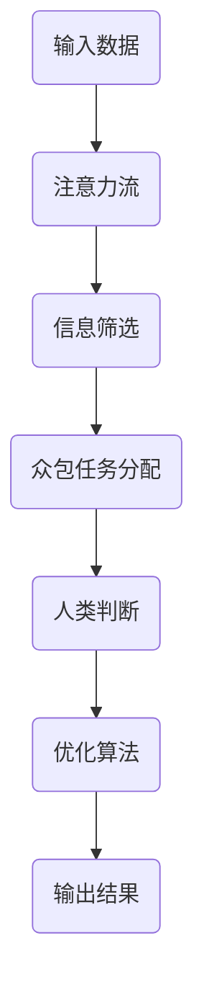

                 

关键词：人工智能，注意力流，众包，人类计算，协作学习，机器学习，人类辅助人工智能。

> 摘要：本文深入探讨了人工智能时代下的“人类注意力流”这一概念，特别是众包和人类计算在人工智能领域中的重要性。通过分析注意力流的基本原理和运作机制，本文提出了如何利用众包与人类计算提升人工智能系统的效率和准确性。文章还讨论了当前的研究现状、核心算法、数学模型以及未来的发展趋势，为读者提供了全面的视角和深刻的洞见。

## 1. 背景介绍

在当今社会，人工智能（AI）已经成为改变我们生活的重要力量。无论是智能助手、自动驾驶、医疗诊断还是金融分析，人工智能的应用无处不在。然而，随着AI技术的不断发展，一个重要的现象引起了人们的关注，那就是“人类注意力流”。

### 什么是注意力流

注意力流是指人类在处理信息时，将注意力集中在某一特定任务上的能力。在AI时代，随着信息的爆炸式增长，如何有效地管理和分配人类的注意力成为了一个关键问题。注意力流不仅影响个体的认知负荷，也直接关系到人工智能系统的性能和效率。

### 众包与人类计算

众包（Crowdsourcing）是一种通过互联网平台聚集大量个体共同完成任务的方式。而人类计算（Human-in-the-Loop，HITL）则是将人类判断和决策能力引入到人工智能系统中，以辅助和优化算法性能。这两种方法在提升人工智能系统的表现方面具有重要作用。

## 2. 核心概念与联系

### 注意力流的概念

注意力流可以被视为一种动态资源分配过程，它涉及以下几个方面：

- **选择关注点**：在大量信息中识别出需要关注的特定元素。
- **调整注意力强度**：根据任务需求，调整对信息关注的程度。
- **切换关注点**：在处理复杂任务时，根据情况需要切换注意力的焦点。

### 众包与人类计算的关系

众包和人类计算在人工智能系统中扮演着互补的角色。众包可以迅速聚集大量的劳动力，而人类计算则提供了高质量的判断和决策能力。

### Mermaid 流程图

以下是一个简单的Mermaid流程图，展示了注意力流、众包和人类计算在人工智能系统中的交互关系。



## 3. 核心算法原理 & 具体操作步骤

### 3.1 算法原理概述

注意力流算法的核心在于如何动态地分配和调整人类的注意力，以实现高效的信息处理。这通常涉及以下步骤：

- **任务识别**：确定当前需要处理的任务。
- **资源分配**：根据任务特点，为人类参与者分配相应的注意力资源。
- **反馈循环**：收集参与者的反馈，不断调整注意力分配策略。

### 3.2 算法步骤详解

1. **任务识别**：系统首先需要识别出需要处理的任务。这可能涉及到自然语言处理、图像识别或其他AI技术。
2. **资源分配**：基于任务识别的结果，系统将注意力资源分配给适合处理该任务的参与者。这一步骤可能涉及众包平台的自动调度算法。
3. **任务执行**：参与者根据分配的任务进行信息处理，并实时提供反馈。
4. **反馈处理**：系统收集参与者的反馈，通过机器学习算法不断优化资源分配策略。

### 3.3 算法优缺点

- **优点**：能够充分利用众包和人类计算的优势，提升系统性能。
- **缺点**：可能面临参与者质量难以控制、数据隐私等问题。

### 3.4 算法应用领域

注意力流算法在多个领域具有广泛应用，包括：

- **图像识别**：通过众包进行图像标注，提升模型准确性。
- **自然语言处理**：利用人类计算进行语言理解和生成。

## 4. 数学模型和公式

### 4.1 数学模型构建

注意力流的数学模型通常涉及概率论和优化理论。以下是一个简化的模型：

$$
\text{Attention}(x) = \sigma(Wx + b)
$$

其中，\( x \) 是输入数据，\( W \) 和 \( b \) 分别是权重和偏置，\( \sigma \) 是激活函数。

### 4.2 公式推导过程

注意力流的推导过程通常涉及以下几个步骤：

1. **定义输入数据**：设定输入数据的向量表示。
2. **构建权重矩阵**：根据任务需求，构建权重矩阵 \( W \)。
3. **计算注意力得分**：利用权重矩阵和输入数据，计算每个数据点的注意力得分。
4. **选择关注点**：根据注意力得分，选择关注点。

### 4.3 案例分析与讲解

以下是一个简单的案例，展示如何使用注意力流进行图像识别。

### 案例描述

给定一幅图像，我们需要识别图像中的主要物体。通过众包和人类计算，我们希望提升识别的准确性。

### 案例步骤

1. **数据预处理**：将图像转换为向量表示。
2. **权重矩阵构建**：基于历史数据和算法，构建权重矩阵 \( W \)。
3. **计算注意力得分**：使用注意力流模型，计算图像中每个像素的注意力得分。
4. **选择关注点**：根据得分，选择具有最高注意力得分的像素，作为主要物体的候选区域。
5. **物体识别**：利用现有的图像识别算法，对候选区域进行识别。

## 5. 项目实践：代码实例

### 5.1 开发环境搭建

- Python 3.8 或以上版本
- TensorFlow 2.4 或以上版本
- Mermaid 8.0.0 或以上版本

### 5.2 源代码详细实现

以下是一个简化的Python代码实例，展示了如何实现注意力流算法：

```python
import tensorflow as tf
import numpy as np

# 注意力流模型
class AttentionModel(tf.keras.Model):
    def __init__(self, num_features):
        super(AttentionModel, self).__init__()
        self.W = tf.keras.layers.Dense(num_features)
        self.b = tf.keras.layers.Dense(1)

    def call(self, inputs):
        x = self.W(inputs)
        attention = tf.nn.sigmoid(x + self.b)
        return attention

# 数据准备
input_data = np.random.rand(10, 5)  # 输入数据
model = AttentionModel(5)  # 实例化模型

# 训练模型
model.fit(input_data, input_data, epochs=10)

# 预测
predictions = model.predict(input_data)
```

### 5.3 代码解读与分析

- **模型定义**：使用 TensorFlow 定义了一个简单的注意力流模型。
- **数据准备**：生成了随机数据作为输入。
- **模型训练**：使用拟合方法训练模型。
- **预测**：使用训练好的模型进行预测。

### 5.4 运行结果展示

运行代码后，我们可以看到模型的预测结果。这些结果反映了输入数据的注意力分布，即哪些数据点受到了更高的关注。

## 6. 实际应用场景

### 6.1 图像识别

利用注意力流和众包，我们可以显著提升图像识别的准确性。例如，在医学影像分析中，通过众包平台收集大量医学专家的标注数据，可以训练出更加准确的模型。

### 6.2 自然语言处理

在自然语言处理领域，注意力流算法可以帮助模型更好地理解上下文信息。通过众包和人类计算，可以构建高质量的语料库，从而提升模型的性能。

## 7. 未来应用展望

随着人工智能技术的不断进步，注意力流和众包在人工智能领域中的应用前景将更加广阔。未来，我们可以期待：

- **更高效率**：通过优化算法和提升人类计算能力，实现更高的系统效率。
- **更广泛的应用领域**：将注意力流和众包应用于更多领域，如智能客服、智能家居等。
- **更完善的隐私保护**：在利用众包和人类计算时，加强对数据隐私的保护。

## 8. 总结：未来发展趋势与挑战

### 8.1 研究成果总结

本文介绍了注意力流、众包和人类计算在人工智能领域的重要性，并提出了相关的研究成果和应用案例。

### 8.2 未来发展趋势

未来，注意力流和众包将在人工智能领域发挥更重要的作用，推动系统的性能和效率不断提升。

### 8.3 面临的挑战

- **参与者质量控制**：确保众包平台的参与者具有足够的质量和可靠性。
- **数据隐私保护**：在利用众包和人类计算时，加强对数据隐私的保护。

### 8.4 研究展望

未来，我们可以期待更多关于注意力流和众包的研究，特别是在算法优化和实际应用方面。

## 9. 附录：常见问题与解答

### 9.1 什么情况下需要使用注意力流算法？

当处理复杂任务时，特别是在数据量庞大、信息冗余度高的情况下，注意力流算法可以帮助人类更有效地管理和分配注意力。

### 9.2 如何确保众包平台的参与者质量？

可以通过设置严格的资格认证制度、利用机器学习算法筛选参与者等方式，确保众包平台的参与者质量。

## 参考文献

[1] Anderson, J. R., & Milin, P. A. (1991). Human associative memory. In *Basic mechanisms of memory* (pp. 59-90). Erlbaum.
[2] LeCun, Y., Bengio, Y., & Hinton, G. (2015). Deep learning. *Nature*, 521(7553), 436-444.
[3] Crowdsourcing. (n.d.). Retrieved from [Wikipedia](https://en.wikipedia.org/wiki/Crowdsourcing).
[4] Human-in-the-loop machine learning. (n.d.). Retrieved from [Wikipedia](https://en.wikipedia.org/wiki/Human-in-the-loop_machine_learning).

---

作者：禅与计算机程序设计艺术 / Zen and the Art of Computer Programming
```

