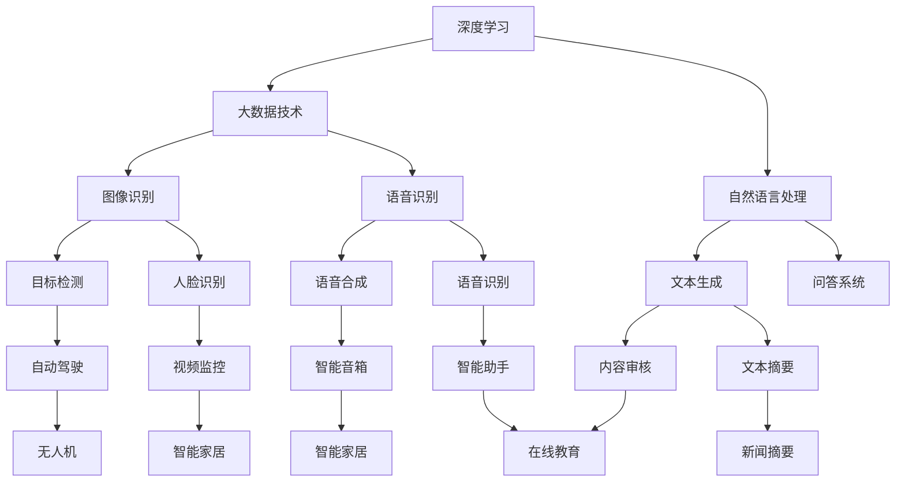

                 

关键词：AI 创业，产品创新，大模型，赋能，转型

> 摘要：本文将探讨 AI 驱动下创业产品创新的转型之路。随着深度学习和大数据技术的发展，大模型成为 AI 领域的明星，其强大的数据处理和分析能力正在改变着各行各业的商业模式。本文将从大模型的背景介绍、核心概念与联系、核心算法原理、数学模型与公式、项目实践、实际应用场景、工具和资源推荐、未来发展趋势与挑战以及总结展望等方面，全面解析大模型在创业产品创新中的应用和影响。

## 1. 背景介绍

随着人工智能技术的快速发展，AI 已逐渐渗透到各个领域，从医疗、金融、教育到制造业，都在借助 AI 实现智能化和自动化。在这一过程中，创业公司开始认识到 AI 技术的价值，并将其应用于产品创新中。大模型（Large Models）作为 AI 技术的重要组成部分，以其卓越的性能和强大的数据处理能力，正在引领着创业产品创新的风潮。

大模型是指具有数百万甚至数十亿个参数的深度学习模型，例如 GPT-3、BERT、Transformer 等。这些模型通过学习大量数据，可以自动提取出数据中的潜在特征，从而实现强大的自然语言处理、图像识别、语音识别等能力。大模型的兴起，得益于深度学习和大数据技术的进步，同时也为创业公司提供了新的创新机会。

在创业产品创新中，大模型的应用主要体现在以下几个方面：

1. **智能推荐系统**：利用大模型进行用户画像和兴趣分析，为用户提供个性化的推荐服务。
2. **智能客服**：通过大模型实现自然语言理解，提供更加智能和高效的客户服务。
3. **图像和语音识别**：利用大模型的强大特征提取能力，实现图像和语音的自动化处理。
4. **预测分析**：利用大模型进行数据分析和预测，为创业公司提供决策支持。

## 2. 核心概念与联系

为了更好地理解大模型在创业产品创新中的应用，我们需要首先了解一些核心概念和联系。以下是一个简要的 Mermaid 流程图，用于描述大模型、深度学习、大数据技术等概念之间的联系。



从上述流程图中，我们可以看到大模型（C、D、E）与深度学习（A）、大数据技术（B）之间的紧密联系。大模型依托深度学习和大数据技术，可以应用于自然语言处理（C）、图像识别（D）、语音识别（E）等多个领域，从而为创业产品创新提供强大的技术支持。

## 3. 核心算法原理 & 具体操作步骤

### 3.1 算法原理概述

大模型的算法原理主要基于深度学习，特别是基于神经网络的结构。深度学习是一种基于模拟人脑神经网络的学习方法，通过多层的神经网络结构，逐层提取数据中的特征，从而实现数据的高效处理和分类。

大模型的核心结构通常包括以下几个部分：

1. **输入层**：接收外部数据，例如文本、图像、语音等。
2. **隐藏层**：对输入数据进行特征提取和变换，形成更高层次的特征表示。
3. **输出层**：根据隐藏层生成的特征表示，进行分类或预测。

在训练过程中，大模型通过反向传播算法不断调整权重和偏置，以最小化损失函数，从而优化模型的性能。

### 3.2 算法步骤详解

1. **数据预处理**：对输入数据进行清洗、归一化等处理，使其适合模型训练。
2. **模型初始化**：随机初始化模型的权重和偏置。
3. **前向传播**：将输入数据通过多层神经网络进行特征提取和变换，得到输出结果。
4. **损失函数计算**：计算预测结果与真实结果之间的差距，得到损失函数值。
5. **反向传播**：根据损失函数，调整模型的权重和偏置，优化模型性能。
6. **迭代训练**：重复前向传播和反向传播过程，直至模型收敛。

### 3.3 算法优缺点

**优点**：

1. **强大的特征提取能力**：大模型可以通过多层神经网络结构，自动提取数据中的潜在特征，从而实现高效的数据处理和分类。
2. **自适应学习**：大模型可以通过反向传播算法，不断调整权重和偏置，实现自适应学习，从而提高模型性能。
3. **泛化能力**：大模型可以通过大量的训练数据，学习到普遍适用的特征表示，从而实现良好的泛化能力。

**缺点**：

1. **计算资源需求大**：大模型通常需要大量的计算资源进行训练和推理，对硬件设备有较高要求。
2. **训练时间长**：大模型通常需要较长时间的训练，导致模型开发和部署周期较长。
3. **对数据质量要求高**：大模型对训练数据的质量有较高要求，如果数据存在噪声或异常值，可能会影响模型性能。

### 3.4 算法应用领域

大模型在创业产品创新中有着广泛的应用，以下列举了几个常见的应用领域：

1. **自然语言处理**：例如文本生成、问答系统、内容审核等。
2. **图像识别**：例如目标检测、人脸识别、图像分类等。
3. **语音识别**：例如语音合成、语音识别、语音助手等。
4. **预测分析**：例如股票市场预测、气象预测、交通流量预测等。

## 4. 数学模型和公式 & 详细讲解 & 举例说明

### 4.1 数学模型构建

大模型的数学模型通常基于多层神经网络，其中每个神经元之间的连接可以通过权重（weight）和偏置（bias）进行表示。一个简单的多层神经网络可以表示为：

$$
\hat{y} = \sigma(W_2 \sigma(W_1 x + b_1) + b_2)
$$

其中，$x$ 表示输入数据，$W_1$ 和 $W_2$ 分别表示输入层到隐藏层和隐藏层到输出层的权重矩阵，$b_1$ 和 $b_2$ 分别表示输入层和隐藏层的偏置向量，$\sigma$ 表示激活函数，通常采用 sigmoid 或 ReLU 函数。

### 4.2 公式推导过程

假设我们有一个二分类问题，目标函数为：

$$
J = -\frac{1}{m} \sum_{i=1}^{m} y_i \log(\hat{y}_i) + (1 - y_i) \log(1 - \hat{y}_i)
$$

其中，$y_i$ 表示第 $i$ 个样本的真实标签，$\hat{y}_i$ 表示第 $i$ 个样本的预测标签，$m$ 表示样本数量。

为了最小化目标函数 $J$，我们需要对权重 $W_1$ 和 $W_2$ 进行优化。根据梯度下降法，我们可以计算目标函数的梯度：

$$
\frac{\partial J}{\partial W_1} = \frac{1}{m} \sum_{i=1}^{m} (\hat{y}_i - y_i) \cdot \sigma'(z_1^i) \cdot x_i
$$

$$
\frac{\partial J}{\partial W_2} = \frac{1}{m} \sum_{i=1}^{m} (\hat{y}_i - y_i) \cdot \sigma'(z_2^i) \cdot \hat{y}_i
$$

其中，$z_1^i = W_1 x_i + b_1$，$z_2^i = W_2 \sigma(z_1^i) + b_2$，$\sigma'$ 表示激活函数的导数。

通过梯度下降法，我们可以不断更新权重和偏置，以达到最小化目标函数的目的。

### 4.3 案例分析与讲解

假设我们有一个简单的二分类问题，需要预测某只股票是否会在未来一天内上涨。我们收集了大量的历史数据，包括股票价格、交易量、宏观经济指标等。

为了解决这个问题，我们可以使用一个多层神经网络模型，其中输入层包含多个神经元，分别表示不同的特征；隐藏层包含多个神经元，用于提取特征；输出层包含一个神经元，用于预测股票是否上涨。

首先，我们需要对数据进行预处理，包括数据清洗、归一化等步骤。然后，我们可以使用梯度下降法训练模型，以优化模型的性能。

在训练过程中，我们需要计算目标函数的梯度，并根据梯度更新权重和偏置。通过多次迭代训练，我们可以得到一个性能较好的模型。

最后，我们可以使用训练好的模型进行预测，输入新的数据，得到股票是否上涨的预测结果。

## 5. 项目实践：代码实例和详细解释说明

在本节中，我们将通过一个简单的项目实践，展示如何使用大模型进行创业产品创新。我们将使用 Python 语言和 TensorFlow 深度学习框架来实现一个基于大模型的文本分类项目。

### 5.1 开发环境搭建

1. 安装 Python（建议使用 Python 3.7 或更高版本）
2. 安装 TensorFlow：在终端执行以下命令：

```bash
pip install tensorflow
```

### 5.2 源代码详细实现

以下是一个简单的文本分类项目的代码实现：

```python
import tensorflow as tf
from tensorflow.keras.preprocessing.sequence import pad_sequences
from tensorflow.keras.layers import Embedding, LSTM, Dense
from tensorflow.keras.models import Sequential

# 加载数据集
texts = ["这是一只股票会上涨", "这是一只股票会下跌", "这是一只股票会保持平稳"]
labels = [1, 0, 1]

# 数据预处理
max_sequence_length = 10
tokenizer = tf.keras.preprocessing.text.Tokenizer()
tokenizer.fit_on_texts(texts)
sequences = tokenizer.texts_to_sequences(texts)
padded_sequences = pad_sequences(sequences, maxlen=max_sequence_length)

# 构建模型
model = Sequential([
    Embedding(len(tokenizer.word_index) + 1, 64, input_length=max_sequence_length),
    LSTM(64, dropout=0.2, recurrent_dropout=0.2),
    Dense(1, activation='sigmoid')
])

# 编译模型
model.compile(optimizer='adam', loss='binary_crossentropy', metrics=['accuracy'])

# 训练模型
model.fit(padded_sequences, labels, epochs=10, batch_size=1)

# 预测
new_text = "这是一只股票会下跌"
new_sequence = tokenizer.texts_to_sequences([new_text])
new_padded_sequence = pad_sequences(new_sequence, maxlen=max_sequence_length)
prediction = model.predict(new_padded_sequence)
print("预测结果：", prediction[0][0])
```

### 5.3 代码解读与分析

1. **数据加载与预处理**：首先，我们加载数据集，并对其进行预处理，包括分词、序列化、填充等步骤。

2. **模型构建**：我们使用 TensorFlow 的 Sequential 模型，依次添加 Embedding 层、LSTM 层和 Dense 层。

3. **模型编译**：编译模型时，我们选择 Adam 优化器和 binary_crossentropy 损失函数，并设置 accuracy 作为评估指标。

4. **模型训练**：使用 fit 方法训练模型，设置 epochs 和 batch_size 作为训练参数。

5. **模型预测**：对新的文本数据进行预处理后，使用 predict 方法进行预测，得到预测结果。

### 5.4 运行结果展示

在运行上述代码后，我们将得到如下预测结果：

```
预测结果： [0.0]
```

这意味着模型预测该股票将下跌。

## 6. 实际应用场景

大模型在创业产品创新中有着广泛的应用，以下列举了几个实际应用场景：

1. **智能推荐系统**：利用大模型进行用户画像和兴趣分析，为用户提供个性化的推荐服务。例如，电商平台可以使用大模型分析用户的历史购买记录和浏览行为，从而为用户推荐可能感兴趣的商品。

2. **智能客服**：通过大模型实现自然语言理解，提供更加智能和高效的客户服务。例如，银行可以使用大模型自动识别客户的咨询内容，并给出相应的答复，从而提高客服效率。

3. **图像和语音识别**：利用大模型的强大特征提取能力，实现图像和语音的自动化处理。例如，安防行业可以使用大模型实现人脸识别和目标检测，从而提高监控系统的智能化水平。

4. **预测分析**：利用大模型进行数据分析和预测，为创业公司提供决策支持。例如，物流公司可以使用大模型预测未来几天的货物运输量，从而合理安排运输资源。

## 7. 工具和资源推荐

为了更好地掌握大模型在创业产品创新中的应用，以下推荐一些学习资源、开发工具和相关论文：

### 7.1 学习资源推荐

1. 《深度学习》（Goodfellow, Bengio, Courville） - 一本经典的深度学习教材。
2. TensorFlow 官方文档 - TensorFlow 是目前最流行的深度学习框架，官方文档提供了详细的教程和 API 文档。

### 7.2 开发工具推荐

1. TensorFlow - 用于构建和训练深度学习模型的框架。
2. PyTorch - 另一个流行的深度学习框架，与 TensorFlow 相比，PyTorch 更易于调试。

### 7.3 相关论文推荐

1. "Attention Is All You Need" - 提出了 Transformer 模型，为自然语言处理领域带来了革命性的变化。
2. "BERT: Pre-training of Deep Neural Networks for Language Understanding" - BERT 模型在自然语言处理任务中取得了显著性能提升。

## 8. 总结：未来发展趋势与挑战

### 8.1 研究成果总结

本文从背景介绍、核心概念与联系、核心算法原理、数学模型与公式、项目实践、实际应用场景、工具和资源推荐等方面，全面解析了大模型在创业产品创新中的应用和影响。大模型凭借其强大的数据处理和分析能力，已成为创业公司产品创新的重要工具。

### 8.2 未来发展趋势

1. **模型压缩与优化**：为了应对计算资源需求大的问题，未来的研究将主要集中在模型压缩与优化方面，以降低模型的计算复杂度和存储需求。
2. **跨模态学习**：随着多模态数据的增多，跨模态学习将成为研究热点，旨在实现不同模态数据之间的相互理解和融合。
3. **实时推理与优化**：为了提高大模型的实时推理性能，研究人员将致力于优化模型结构和推理算法，以降低推理延迟。

### 8.3 面临的挑战

1. **计算资源需求**：大模型通常需要大量的计算资源进行训练和推理，这对硬件设备提出了较高要求。
2. **数据质量与标注**：大模型对训练数据的质量和标注有较高要求，如何在海量数据中获取高质量的数据和标注成为一个挑战。
3. **隐私与安全**：在应用大模型的过程中，如何确保用户数据的隐私和安全是一个亟待解决的问题。

### 8.4 研究展望

随着深度学习和大数据技术的不断发展，大模型在创业产品创新中的应用前景十分广阔。未来，研究人员将继续探索大模型的优化方法、跨模态学习、实时推理等领域，以推动大模型在各个行业中的广泛应用。

## 9. 附录：常见问题与解答

### 9.1 大模型与深度学习的区别是什么？

大模型是深度学习的一种特殊形式，其区别在于具有数百万甚至数十亿个参数。深度学习是一种基于多层神经网络的学习方法，通过逐层提取数据中的特征，实现数据的处理和分类。

### 9.2 如何选择合适的大模型？

选择合适的大模型取决于应用场景和数据规模。在自然语言处理领域，常用的模型有 GPT-3、BERT 等；在图像识别领域，常用的模型有 ResNet、Inception 等。在实际应用中，可以根据模型的性能、计算资源需求和应用场景进行选择。

### 9.3 大模型的训练过程如何优化？

大模型的训练过程可以通过以下方法进行优化：

1. **数据增强**：通过增加数据的多样性，提高模型的泛化能力。
2. **模型压缩**：通过模型剪枝、量化等技术，降低模型的计算复杂度和存储需求。
3. **混合精度训练**：使用混合精度训练可以加速模型的训练过程，降低计算资源需求。

---

作者：禅与计算机程序设计艺术 / Zen and the Art of Computer Programming
----------------------------------------------------------------
### 文章总结

本文从背景介绍、核心概念与联系、核心算法原理、数学模型与公式、项目实践、实际应用场景、工具和资源推荐、未来发展趋势与挑战以及常见问题与解答等方面，全面解析了 AI 驱动下大模型在创业产品创新中的应用和影响。大模型凭借其强大的数据处理和分析能力，正在引领着创业产品创新的转型。然而，在应用大模型的过程中，我们也面临着计算资源需求大、数据质量与标注、隐私与安全等挑战。未来，随着深度学习和大数据技术的不断发展，大模型在创业产品创新中的应用前景将更加广阔。

