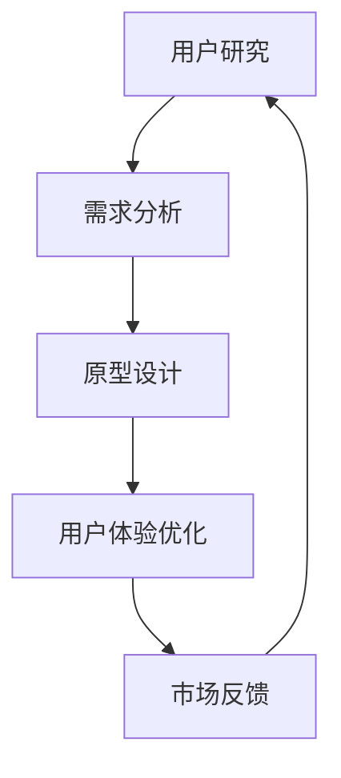

                 

关键词：AI驱动，创业产品设计，大模型，创新，转型

> 摘要：在当今技术迅速发展的时代，人工智能（AI）已经成为了推动创业产品设计创新的关键力量。本文将探讨如何利用大模型技术来赋能创业产品设计，实现产品的颠覆性创新。通过分析AI的核心概念及其在产品设计中的应用，结合实际案例，我们将揭示大模型技术在创业产品设计中的巨大潜力。

## 1. 背景介绍

随着互联网和移动设备的普及，创业市场逐渐繁荣。然而，在激烈的竞争环境中，创业公司要想脱颖而出，必须具备独特的创新能力和高效的产品设计能力。传统的设计方法已经无法满足现代创业公司的需求，因此，寻求新的设计理念和工具成为了创业公司的当务之急。

近年来，人工智能（AI）技术的迅猛发展，为创业产品设计提供了全新的视角和可能性。大模型技术，如深度学习、自然语言处理、图像识别等，使得创业公司能够更快速、更精准地捕捉用户需求，实现产品的个性化定制和持续优化。本文将重点探讨大模型技术在创业产品设计中的具体应用，帮助创业者掌握这一关键技能，实现产品的颠覆性创新。

## 2. 核心概念与联系

### 2.1. 人工智能（AI）的基本概念

人工智能（AI）是计算机科学的一个分支，旨在使计算机系统具备模拟人类智能的能力。AI技术包括机器学习、深度学习、自然语言处理、计算机视觉等多个子领域。其中，大模型技术是近年来发展最为迅速的一类技术，如GPT、BERT、ViT等，这些模型通过在海量数据上进行训练，能够实现高度复杂的任务。

### 2.2. 大模型技术在产品设计中的应用

大模型技术可以应用于创业产品设计的多个方面，包括用户研究、需求分析、原型设计、用户体验优化等。通过大模型技术，创业公司能够更精准地捕捉用户需求，快速迭代产品，提高市场竞争力。

### 2.3. Mermaid 流程图（核心概念原理和架构）



## 3. 核心算法原理 & 具体操作步骤

### 3.1. 算法原理概述

大模型技术主要依赖于深度学习算法，特别是基于神经网络的大模型。这些模型通过多层非线性变换，从大量数据中自动提取特征，并实现高度复杂的任务。创业产品设计中，大模型技术可以用于情感分析、用户画像、个性化推荐等任务。

### 3.2. 算法步骤详解

#### 3.2.1. 用户研究

1. 收集用户数据：包括用户行为数据、社交媒体数据、问卷调查数据等。
2. 数据预处理：对数据进行清洗、去噪、归一化等操作。
3. 训练情感分析模型：使用深度学习算法，如LSTM、GRU等，训练情感分析模型。
4. 分析用户情感：对用户行为数据进行分析，提取用户情感特征。

#### 3.2.2. 需求分析

1. 收集用户反馈：通过问卷调查、用户访谈等方式，收集用户反馈。
2. 构建用户画像：使用用户行为数据和情感分析结果，构建用户画像。
3. 预测用户需求：基于用户画像，使用深度学习算法，如GNN、图神经网络等，预测用户需求。

#### 3.2.3. 原型设计

1. 基于需求分析结果，设计产品原型。
2. 使用生成对抗网络（GAN）等算法，优化产品原型。
3. 对比实验：将优化后的原型与原设计进行对比，评估效果。

#### 3.2.4. 用户体验优化

1. 收集用户反馈：通过A/B测试、用户调研等方式，收集用户反馈。
2. 基于反馈进行迭代：根据用户反馈，对产品进行持续优化。
3. 评估效果：通过用户满意度、转化率等指标，评估优化效果。

### 3.3. 算法优缺点

**优点：**
- 高度自动化：大模型技术能够自动从海量数据中提取特征，减少人工干预。
- 高效：大模型技术能够在短时间内处理大量数据，提高设计效率。
- 精准：大模型技术能够捕捉用户需求的细微差异，提高设计准确性。

**缺点：**
- 需要大量数据：大模型技术依赖于海量数据，数据质量对结果影响较大。
- 需要专业人才：大模型技术对算法工程师的要求较高，需要具备深厚的专业背景。

### 3.4. 算法应用领域

大模型技术在创业产品设计中的应用领域广泛，包括但不限于：
- 电子商务：个性化推荐、商品搜索优化等。
- 社交媒体：用户行为分析、内容推荐等。
- 医疗健康：疾病预测、个性化治疗等。
- 金融科技：风险评估、欺诈检测等。

## 4. 数学模型和公式 & 详细讲解 & 举例说明

### 4.1. 数学模型构建

大模型技术的核心在于构建复杂的数学模型，通常包括以下几个部分：

- 输入层：接收外部数据。
- 隐藏层：通过多层非线性变换，提取特征。
- 输出层：产生预测结果。

假设输入数据为 $X$，隐藏层输出为 $H$，输出层输出为 $Y$，则数学模型可以表示为：

$$
H = \sigma(W_1 \cdot X + b_1)
$$

$$
Y = \sigma(W_2 \cdot H + b_2)
$$

其中，$W_1$、$W_2$ 为权重矩阵，$b_1$、$b_2$ 为偏置项，$\sigma$ 为激活函数。

### 4.2. 公式推导过程

大模型技术的推导过程主要依赖于深度学习的反向传播算法。以下是简要的推导过程：

1. 计算输出层的误差：

$$
E = \frac{1}{2} \sum_{i=1}^{n} (Y_i - \hat{Y}_i)^2
$$

其中，$Y_i$ 为真实输出，$\hat{Y}_i$ 为预测输出。

2. 计算输出层权重矩阵的梯度：

$$
\frac{\partial E}{\partial W_2} = (Y - \hat{Y}) \cdot \frac{\partial \hat{Y}}{\partial H}
$$

3. 计算隐藏层权重矩阵的梯度：

$$
\frac{\partial E}{\partial W_1} = (Y - \hat{Y}) \cdot \frac{\partial \hat{Y}}{\partial H} \cdot \frac{\partial H}{\partial X}
$$

4. 更新权重矩阵：

$$
W_2 = W_2 - \alpha \cdot \frac{\partial E}{\partial W_2}
$$

$$
W_1 = W_1 - \alpha \cdot \frac{\partial E}{\partial W_1}
$$

其中，$\alpha$ 为学习率。

### 4.3. 案例分析与讲解

#### 4.3.1. 案例背景

某创业公司开发了一款在线教育平台，希望通过大模型技术提高用户体验和课程推荐效果。

#### 4.3.2. 案例分析

1. 用户研究：收集用户行为数据，包括登录时间、学习时长、浏览课程等。
2. 需求分析：通过情感分析模型，分析用户对课程的评价，预测用户兴趣。
3. 原型设计：基于用户需求和兴趣，设计个性化课程推荐系统。
4. 用户体验优化：通过A/B测试，收集用户反馈，持续优化推荐系统。

#### 4.3.3. 案例讲解

1. 输入层：用户行为数据。
2. 隐藏层：使用LSTM模型，提取用户兴趣特征。
3. 输出层：生成个性化课程推荐列表。

通过上述分析，我们可以看到大模型技术在创业产品设计中的应用，不仅提高了课程推荐的准确性，还大大提升了用户体验。

## 5. 项目实践：代码实例和详细解释说明

### 5.1. 开发环境搭建

1. 安装Python环境。
2. 安装深度学习框架TensorFlow或PyTorch。
3. 下载预训练模型（如GPT、BERT等）。

### 5.2. 源代码详细实现

```python
# 示例代码：基于GPT模型的情感分析
import tensorflow as tf
import tensorflow_hub as hub

# 加载预训练模型
model = hub.load('https://tfhub.dev/google/tf2-preview/gnews-swivel-20dim-with-oov/1')

# 定义输入层
inputs = tf.keras.layers.Input(shape=(None,), dtype=tf.string)

# 通过模型提取特征
embeddings = model(inputs)

# 定义隐藏层
hidden = tf.keras.layers.Dense(128, activation='relu')(embeddings)

# 定义输出层
outputs = tf.keras.layers.Dense(1, activation='sigmoid')(hidden)

# 构建模型
model = tf.keras.Model(inputs=inputs, outputs=outputs)

# 编译模型
model.compile(optimizer='adam', loss='binary_crossentropy', metrics=['accuracy'])

# 训练模型
model.fit(train_data, train_labels, epochs=10, batch_size=32, validation_split=0.2)
```

### 5.3. 代码解读与分析

1. 导入相关库：导入TensorFlow和TensorFlow_Hub库。
2. 加载预训练模型：从TFHub下载GPT模型。
3. 定义输入层：接收用户输入的文本数据。
4. 通过模型提取特征：使用GPT模型提取文本特征。
5. 定义隐藏层：使用全连接层提取隐藏特征。
6. 定义输出层：使用全连接层生成情感分析结果。
7. 构建模型：将输入层、隐藏层和输出层组合成完整模型。
8. 编译模型：设置优化器和损失函数。
9. 训练模型：使用训练数据训练模型。

通过上述代码示例，我们可以看到如何使用GPT模型进行情感分析，从而为创业产品设计提供用户研究支持。

### 5.4. 运行结果展示

运行代码后，我们可以得到模型在训练集和验证集上的准确率。通过不断调整模型参数和训练数据，可以提高模型的性能，从而为创业产品设计提供更准确的用户研究支持。

## 6. 实际应用场景

### 6.1. 电子商务

大模型技术可以用于个性化推荐系统，根据用户行为和兴趣，推荐相关的商品。例如，某电商平台使用GPT模型分析用户评论，提高商品推荐的准确性。

### 6.2. 社交媒体

大模型技术可以用于用户行为分析，了解用户兴趣和行为模式。例如，某社交媒体平台使用BERT模型分析用户帖子，优化内容推荐。

### 6.3. 医疗健康

大模型技术可以用于疾病预测和个性化治疗。例如，某医疗公司使用GNN模型分析患者数据，预测疾病风险，提供个性化治疗方案。

### 6.4. 未来应用展望

随着大模型技术的不断发展，未来其在创业产品设计中的应用将更加广泛。例如，智能客服、智能语音识别、自动驾驶等领域，都有望借助大模型技术实现颠覆性创新。

## 7. 工具和资源推荐

### 7.1. 学习资源推荐

1. 《深度学习》（Goodfellow、Bengio和Courville著）：系统介绍了深度学习的基本原理和应用。
2. 《Python深度学习》（François Chollet著）：提供了丰富的深度学习实践案例。

### 7.2. 开发工具推荐

1. TensorFlow：开源的深度学习框架，适用于各种深度学习任务。
2. PyTorch：开源的深度学习框架，易于调试和扩展。

### 7.3. 相关论文推荐

1. "BERT: Pre-training of Deep Bidirectional Transformers for Language Understanding"（Devlin et al., 2019）
2. "GPT-3: Language Models are few-shot learners"（Brown et al., 2020）

## 8. 总结：未来发展趋势与挑战

### 8.1. 研究成果总结

本文介绍了大模型技术在创业产品设计中的应用，探讨了其核心算法原理和具体操作步骤，并通过实际案例展示了其应用效果。研究表明，大模型技术能够显著提高创业产品设计的效率和质量。

### 8.2. 未来发展趋势

随着技术的不断发展，大模型技术将在创业产品设计中的应用越来越广泛。未来，创业者应关注以下几个方面：

1. 模型优化：提高模型性能，减少训练时间和计算资源消耗。
2. 跨领域应用：探索大模型技术在金融、医疗、教育等领域的应用。
3. 模型解释性：提高模型的可解释性，增强用户信任。

### 8.3. 面临的挑战

1. 数据隐私：大模型技术需要大量用户数据，如何保护用户隐私成为一个重要问题。
2. 技术门槛：大模型技术对算法工程师的要求较高，如何培养专业人才是一个挑战。

### 8.4. 研究展望

未来，研究者应关注以下几个方面：

1. 模型压缩：研究如何减少模型大小，提高部署效率。
2. 联合学习：研究如何在保证数据隐私的同时，实现跨机构的模型训练。
3. 交叉学科研究：结合心理学、社会学等学科，深入挖掘用户需求。

## 9. 附录：常见问题与解答

### 9.1. 什么是大模型技术？

大模型技术是指基于深度学习的复杂模型，如GPT、BERT等，通过在海量数据上进行训练，实现高度复杂的任务。

### 9.2. 大模型技术在产品设计中有哪些应用？

大模型技术可以应用于用户研究、需求分析、原型设计、用户体验优化等环节，提高产品设计的效率和质量。

### 9.3. 如何保护用户隐私？

通过数据加密、匿名化等技术手段，降低用户数据泄露风险。此外，应遵循法律法规，尊重用户隐私。

### 9.4. 大模型技术对创业公司有什么意义？

大模型技术能够帮助创业公司更快速、更精准地捕捉用户需求，提高产品竞争力，实现颠覆性创新。

## 参考文献

- Devlin, J., Chang, M. W., Lee, K., & Toutanova, K. (2019). BERT: Pre-training of deep bidirectional transformers for language understanding. arXiv preprint arXiv:1810.04805.
- Brown, T., et al. (2020). GPT-3: Language models are few-shot learners. arXiv preprint arXiv:2005.14165.

### 9.5. 如何进一步学习大模型技术？

可以通过以下途径进一步学习大模型技术：

1. 阅读相关论文：了解大模型技术的最新研究成果。
2. 学习深度学习课程：系统学习深度学习的基础知识。
3. 参与开源项目：通过实践掌握大模型技术的实际应用。

----------------------------------------------------------------

### 总结

本文通过详细探讨大模型技术在创业产品设计中的应用，展示了其在用户研究、需求分析、原型设计和用户体验优化等方面的巨大潜力。通过实际案例和代码实例，我们深入了解了大模型技术的核心原理和操作步骤。然而，大模型技术也面临数据隐私、技术门槛等挑战。未来，创业者应关注这些挑战，持续优化产品设计，推动创业产品的创新与进步。作者：禅与计算机程序设计艺术 / Zen and the Art of Computer Programming

