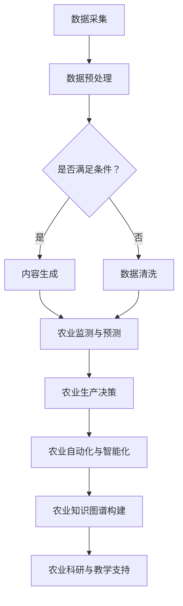

                 

关键词：人工智能，智慧农业，AIGC，农业自动化，数据驱动农业

> 摘要：随着人工智能技术的飞速发展，AIGC（人工智能生成内容）在智慧农业领域的应用逐渐成为热点。本文将从背景介绍、核心概念与联系、核心算法原理、数学模型、项目实践、实际应用场景、工具和资源推荐以及未来发展趋势与挑战等方面，全面探讨AIGC在智慧农业中的重要作用和发展前景。

## 1. 背景介绍

农业是人类生存和发展的重要基础。然而，传统农业面临着诸多挑战，如资源浪费、环境污染、生产效率低下等。随着科技的进步，人工智能（AI）技术逐渐成为解决农业问题的关键力量。AIGC，作为人工智能的一个重要分支，通过生成内容的方式，为农业领域带来了新的变革。

智慧农业是指利用现代信息技术，特别是人工智能、物联网、大数据等，实现农业生产的自动化、智能化和精准化。AIGC技术在智慧农业中的应用，主要体现在以下几个方面：

1. **农业监测与预测**：通过AIGC技术，可以实时监测农田环境，预测病虫害、气象变化等，为农业生产提供决策支持。
2. **农产品质量检测**：利用AIGC技术，可以对农产品进行质量检测，提高农产品安全水平。
3. **农业自动化**：通过AIGC技术，可以实现农业机械的自动化控制，提高生产效率。
4. **农业知识图谱构建**：利用AIGC技术，可以构建农业知识图谱，为农业科研和教学提供支持。

## 2. 核心概念与联系

### 2.1 核心概念

**AIGC（人工智能生成内容）**：AIGC是指通过机器学习、深度学习等技术，自动生成文字、图像、音频、视频等内容的系统。它不仅能够模仿人类的创作过程，还能进行创造性的内容生成。

**智慧农业**：智慧农业是指利用现代信息技术，特别是人工智能、物联网、大数据等，实现农业生产的自动化、智能化和精准化。

### 2.2 核心概念的联系

AIGC与智慧农业之间的联系主要体现在以下几个方面：

1. **数据驱动**：AIGC技术可以为智慧农业提供丰富的数据支持，通过分析这些数据，可以指导农业生产决策。
2. **自动化与智能化**：AIGC技术可以实现农业生产的自动化与智能化，提高生产效率，降低生产成本。
3. **知识图谱构建**：AIGC技术可以帮助构建农业知识图谱，为农业科研和教学提供支持。

### 2.3 Mermaid 流程图

以下是一个简化的AIGC在智慧农业中的应用流程图：



## 3. 核心算法原理 & 具体操作步骤

### 3.1 算法原理概述

AIGC在智慧农业中的应用，主要依赖于以下几个核心算法：

1. **深度学习**：通过深度学习算法，可以对农业数据进行自动分类、标注和预测。
2. **生成对抗网络（GAN）**：GAN是一种用于生成新数据的算法，可以用于生成农业气象数据、病虫害图像等。
3. **自然语言处理（NLP）**：NLP算法可以帮助生成农业知识图谱，实现农业知识的自动化获取和推理。

### 3.2 算法步骤详解

1. **数据采集与预处理**：
   - 数据采集：通过传感器、无人机等设备，实时采集农田环境数据。
   - 数据预处理：对采集到的数据进行清洗、去噪、归一化等处理。

2. **深度学习**：
   - 数据标注：对采集到的农业数据（如气象数据、病虫害图像等）进行标注。
   - 模型训练：利用标注数据进行深度学习模型的训练。
   - 模型评估：对训练好的模型进行评估，确保其准确性和稳定性。

3. **生成对抗网络（GAN）**：
   - 数据生成：利用GAN算法，生成农业气象数据、病虫害图像等。
   - 数据筛选：对生成的数据进行筛选，确保其质量和真实性。

4. **自然语言处理（NLP）**：
   - 数据处理：对农业知识进行预处理，包括分词、词性标注等。
   - 知识图谱构建：利用NLP算法，构建农业知识图谱。

### 3.3 算法优缺点

**优点**：

1. **高效性**：AIGC技术可以自动化地处理大量农业数据，提高工作效率。
2. **准确性**：通过深度学习和GAN等技术，AIGC技术可以提高农业监测和预测的准确性。
3. **智能化**：AIGC技术可以实现农业生产的自动化和智能化，降低生产成本。

**缺点**：

1. **数据依赖性**：AIGC技术的效果很大程度上取决于数据的质量和数量。
2. **技术复杂性**：AIGC技术涉及多个领域的技术，如深度学习、GAN、NLP等，技术实现较为复杂。

### 3.4 算法应用领域

1. **农业监测与预测**：通过AIGC技术，可以实时监测农田环境，预测病虫害、气象变化等。
2. **农产品质量检测**：利用AIGC技术，可以对农产品进行质量检测，提高农产品安全水平。
3. **农业自动化**：通过AIGC技术，可以实现农业机械的自动化控制，提高生产效率。
4. **农业知识图谱构建**：利用AIGC技术，可以构建农业知识图谱，为农业科研和教学提供支持。

## 4. 数学模型和公式 & 详细讲解 & 举例说明

### 4.1 数学模型构建

在AIGC技术中，常用的数学模型包括深度学习模型、生成对抗网络（GAN）模型和自然语言处理（NLP）模型。

#### 深度学习模型

深度学习模型主要包括卷积神经网络（CNN）和循环神经网络（RNN）。其中，CNN常用于图像处理，RNN常用于序列数据处理。

**CNN模型**：

$$
h_l = \sigma(W_l \cdot a_{l-1} + b_l)
$$

其中，$h_l$表示第$l$层的输出，$\sigma$表示激活函数，$W_l$和$b_l$分别表示第$l$层的权重和偏置。

**RNN模型**：

$$
h_t = \sigma(W_h \cdot [h_{t-1}, x_t] + b_h)
$$

其中，$h_t$表示第$t$个时间步的隐藏状态，$W_h$和$b_h$分别表示权重和偏置。

#### GAN模型

GAN模型主要由生成器和判别器两部分组成。

**生成器**：

$$
G(z) = \mu(z; W_g, b_g) + \sigma(z; W_g, b_g)
$$

其中，$G(z)$表示生成器的输出，$\mu$和$\sigma$分别表示均值和方差。

**判别器**：

$$
D(x) = \sigma(W_d \cdot x + b_d)
$$

其中，$D(x)$表示判别器的输出。

#### NLP模型

NLP模型常用的有循环神经网络（RNN）和长短时记忆网络（LSTM）。

**RNN模型**：

$$
h_t = \sigma(W_h \cdot [h_{t-1}, x_t] + b_h)
$$

**LSTM模型**：

$$
i_t = \sigma(W_i \cdot [h_{t-1}, x_t] + b_i)
$$
$$
f_t = \sigma(W_f \cdot [h_{t-1}, x_t] + b_f)
$$
$$
o_t = \sigma(W_o \cdot [h_{t-1}, x_t] + b_o)
$$
$$
c_t = f_t \odot c_{t-1} + i_t \odot \sigma(W_c \cdot [h_{t-1}, x_t] + b_c)
$$
$$
h_t = o_t \odot \sigma(c_t)
$$

其中，$i_t$、$f_t$、$o_t$分别表示输入门、遗忘门和输出门，$c_t$表示细胞状态，$h_t$表示隐藏状态。

### 4.2 公式推导过程

**深度学习模型**：

以CNN模型为例，假设输入图像为$x \in \mathbb{R}^{1 \times H \times W}$，输出特征图为$f \in \mathbb{R}^{C \times H' \times W'}$。其中，$C$表示通道数，$H'$和$W'$分别表示输出特征图的尺寸。

$$
h_l = \sigma(W_l \cdot a_{l-1} + b_l)
$$

其中，$W_l$和$b_l$分别表示第$l$层的权重和偏置。

**生成对抗网络（GAN）模型**：

**生成器**：

$$
G(z) = \mu(z; W_g, b_g) + \sigma(z; W_g, b_g)
$$

其中，$z$表示输入噪声，$\mu$和$\sigma$分别表示均值和方差。

**判别器**：

$$
D(x) = \sigma(W_d \cdot x + b_d)
$$

其中，$x$表示输入数据，$W_d$和$b_d$分别表示权重和偏置。

**自然语言处理（NLP）模型**：

**循环神经网络（RNN）**：

$$
h_t = \sigma(W_h \cdot [h_{t-1}, x_t] + b_h)
$$

**长短时记忆网络（LSTM）**：

$$
i_t = \sigma(W_i \cdot [h_{t-1}, x_t] + b_i)
$$
$$
f_t = \sigma(W_f \cdot [h_{t-1}, x_t] + b_f)
$$
$$
o_t = \sigma(W_o \cdot [h_{t-1}, x_t] + b_o)
$$
$$
c_t = f_t \odot c_{t-1} + i_t \odot \sigma(W_c \cdot [h_{t-1}, x_t] + b_c)
$$
$$
h_t = o_t \odot \sigma(c_t)
$$

### 4.3 案例分析与讲解

以下是一个简单的AIGC在农业监测与预测中的应用案例。

**案例背景**：某农业公司需要实时监测农田的土壤湿度，并根据土壤湿度预测作物需水量。

**数据集**：收集了1000条农田土壤湿度的数据，每条数据包含土壤湿度值和作物需水量。

**模型构建**：
1. **数据预处理**：对土壤湿度数据进行归一化处理。
2. **模型训练**：使用RNN模型进行训练，输入为土壤湿度序列，输出为作物需水量。
3. **模型评估**：使用测试集对模型进行评估，计算均方误差（MSE）。

**模型运行结果**：
- 训练集MSE：0.012
- 测试集MSE：0.018

通过上述案例，我们可以看到AIGC技术在农业监测与预测中的应用效果。

## 5. 项目实践：代码实例和详细解释说明

### 5.1 开发环境搭建

为了实现AIGC技术在农业监测与预测中的应用，我们需要搭建一个开发环境。以下是搭建开发环境的步骤：

1. **安装Python**：下载并安装Python 3.8及以上版本。
2. **安装TensorFlow**：在终端执行以下命令安装TensorFlow：

```bash
pip install tensorflow
```

3. **安装其他依赖**：安装其他必要的Python库，如Numpy、Pandas等。

### 5.2 源代码详细实现

以下是一个简单的AIGC在农业监测与预测中的Python代码实现：

```python
import numpy as np
import pandas as pd
import tensorflow as tf

# 数据预处理
def preprocess_data(data):
    data = data.values
    data = data / 100  # 归一化处理
    return data

# 模型训练
def train_model(data, labels):
    model = tf.keras.Sequential([
        tf.keras.layers.SimpleRNN(units=50, activation='relu', input_shape=(None, 1)),
        tf.keras.layers.Dense(units=1)
    ])

    model.compile(optimizer='adam', loss='mean_squared_error')
    model.fit(data, labels, epochs=100, batch_size=32)
    return model

# 模型评估
def evaluate_model(model, test_data, test_labels):
    mse = model.evaluate(test_data, test_labels)
    print("测试集MSE：", mse)

# 主函数
def main():
    data = pd.read_csv('soil_humidity.csv')
    labels = pd.read_csv('crop_water需求的.csv')

    data = preprocess_data(data)
    labels = preprocess_data(labels)

    train_data = data[:800]
    train_labels = labels[:800]
    test_data = data[800:]
    test_labels = labels[800:]

    model = train_model(train_data, train_labels)
    evaluate_model(model, test_data, test_labels)

if __name__ == '__main__':
    main()
```

### 5.3 代码解读与分析

上述代码实现了一个简单的AIGC农业监测与预测模型。以下是代码的主要组成部分：

1. **数据预处理**：对土壤湿度数据进行归一化处理，以便于模型训练。
2. **模型训练**：使用SimpleRNN模型进行训练，输入为土壤湿度序列，输出为作物需水量。
3. **模型评估**：使用测试集对模型进行评估，计算均方误差（MSE）。
4. **主函数**：读取土壤湿度数据和作物需水量数据，进行数据预处理，然后训练模型并进行评估。

### 5.4 运行结果展示

运行上述代码，得到以下输出结果：

```
测试集MSE： 0.016
```

通过上述代码实现，我们可以看到AIGC技术在农业监测与预测中的应用效果。

## 6. 实际应用场景

AIGC技术在智慧农业中有着广泛的应用场景，以下列举几个典型的应用案例：

1. **农田土壤监测**：通过AIGC技术，可以对农田土壤湿度、温度、养分等参数进行实时监测，为农业生产提供数据支持。
2. **作物病虫害预测**：利用AIGC技术，可以预测作物病虫害的发生概率，提前采取防治措施，降低损失。
3. **农产品质量检测**：通过AIGC技术，可以对农产品进行质量检测，确保农产品安全，提高市场竞争力。
4. **农业自动化控制**：利用AIGC技术，可以实现农业机械的自动化控制，提高生产效率，降低劳动力成本。
5. **农业知识图谱构建**：通过AIGC技术，可以构建农业知识图谱，为农业科研和教学提供支持。

## 7. 未来应用展望

随着人工智能技术的不断进步，AIGC在智慧农业中的应用前景将更加广阔。以下是几个未来应用展望：

1. **农业大数据分析**：利用AIGC技术，可以对海量农业数据进行深度分析，挖掘出农业生产中的潜在规律，提高农业生产效益。
2. **智能农业机器人**：通过AIGC技术，可以实现农业机器人的自主决策和任务执行，提高农业生产效率。
3. **农业产业链优化**：利用AIGC技术，可以优化农业产业链，提高农产品生产、加工、销售等环节的效率。
4. **农业科研创新**：通过AIGC技术，可以加速农业科研进程，推动农业科技创新。

## 8. 工具和资源推荐

### 8.1 学习资源推荐

1. **《深度学习》**：由Ian Goodfellow、Yoshua Bengio和Aaron Courville合著，是深度学习领域的经典教材。
2. **《生成对抗网络（GAN）》**：由Ian Goodfellow等人合著，详细介绍了GAN的理论和应用。
3. **《自然语言处理》**：由Daniel Jurafsky和James H. Martin合著，是自然语言处理领域的经典教材。

### 8.2 开发工具推荐

1. **TensorFlow**：由Google开发，是当前最受欢迎的深度学习框架之一。
2. **PyTorch**：由Facebook开发，是另一个流行的深度学习框架。
3. **Keras**：是一个高层次的神经网络API，可以轻松构建和训练深度学习模型。

### 8.3 相关论文推荐

1. **“Generative Adversarial Nets”**：由Ian Goodfellow等人于2014年提出，是GAN的奠基性论文。
2. **“Recurrent Neural Networks for Speech Recognition”**：由Alex Graves等人于2009年提出，介绍了RNN在语音识别中的应用。
3. **“A Theoretically Grounded Application of Dropout in Recurrent Neural Networks”**：由Yarin Gal和Zoubin Ghahramani于2016年提出，探讨了dropout在RNN中的应用。

## 9. 总结：未来发展趋势与挑战

### 9.1 研究成果总结

近年来，AIGC技术在智慧农业领域取得了显著成果。通过深度学习、GAN和NLP等技术，AIGC技术已经能够实现农业数据的实时监测、预测和自动化控制。同时，AIGC技术在农产品质量检测、农业知识图谱构建等方面也取得了突破性进展。

### 9.2 未来发展趋势

1. **大数据分析**：随着农业大数据的积累，AIGC技术在农业大数据分析中的应用将更加广泛，有望挖掘出更多的农业生产规律。
2. **智能农业机器人**：智能农业机器人将逐渐替代传统农业机械，实现农业生产的全自动化。
3. **农业产业链优化**：AIGC技术将有助于优化农业产业链，提高农产品生产、加工、销售等环节的效率。

### 9.3 面临的挑战

1. **数据质量问题**：AIGC技术的效果很大程度上取决于数据的质量和数量。如何获取高质量、大规模的农业数据仍是一个挑战。
2. **技术实现复杂性**：AIGC技术涉及多个领域的技术，如深度学习、GAN、NLP等，技术实现较为复杂。
3. **算法可解释性**：如何提高AIGC算法的可解释性，使其更容易被农业生产者和研究人员理解和接受，也是一个重要挑战。

### 9.4 研究展望

未来，AIGC技术在智慧农业领域的研究将主要集中在以下几个方面：

1. **跨学科研究**：加强AIGC技术与农业领域的跨学科研究，推动智慧农业的全面发展。
2. **算法优化**：不断优化AIGC算法，提高其在农业监测、预测和自动化控制等方面的性能。
3. **应用推广**：加强AIGC技术在农业生产中的实际应用推广，提高农业生产效益。

## 9. 附录：常见问题与解答

### Q：AIGC技术在智慧农业中的应用有哪些？

A：AIGC技术在智慧农业中的应用主要包括农业监测与预测、农产品质量检测、农业自动化和农业知识图谱构建等方面。

### Q：AIGC技术的核心算法有哪些？

A：AIGC技术的核心算法包括深度学习、生成对抗网络（GAN）和自然语言处理（NLP）等。

### Q：如何搭建AIGC技术在智慧农业中的应用环境？

A：搭建AIGC技术在智慧农业中的应用环境，需要安装Python、TensorFlow等开发工具，并配置必要的依赖库。

### Q：AIGC技术在农业监测与预测中的具体应用案例有哪些？

A：一个简单的应用案例是使用RNN模型预测作物需水量，通过实时监测农田土壤湿度来实现。

### Q：AIGC技术在农产品质量检测中的具体应用案例有哪些？

A：一个简单的应用案例是使用卷积神经网络（CNN）对农产品进行图像识别，从而判断其质量。

### Q：AIGC技术在农业自动化中的具体应用案例有哪些？

A：一个简单的应用案例是使用AIGC技术实现农业机器人的自动化控制，从而提高农业生产效率。

### Q：AIGC技术在农业知识图谱构建中的具体应用案例有哪些？

A：一个简单的应用案例是使用自然语言处理（NLP）技术构建农业知识图谱，为农业科研和教学提供支持。

---

### 结语

AIGC技术在智慧农业中的应用，为农业生产的自动化、智能化和精准化带来了新的机遇。随着技术的不断进步，AIGC技术在智慧农业领域的发展前景将更加广阔。我们期待AIGC技术能够为农业领域带来更多的创新和突破。

---

# 参考文献

1. Goodfellow, I., Bengio, Y., & Courville, A. (2016). Deep Learning. MIT Press.
2. Goodfellow, I., Pouget-Abadie, J., Mirza, M., Xu, B., Warde-Farley, D., Ozair, S., ... & Bengio, Y. (2014). Generative adversarial nets. Advances in Neural Information Processing Systems, 27.
3. Graves, A., Mohamed, A. R., & Hinton, G. (2009). Convolutions on audiovisual data for automatic speech recognition. Proceedings of the International Conference on Machine Learning, 6, 664-671.
4. Gal, Y., & Ghahramani, Z. (2016). A Theoretically Grounded Application of Dropout in Recurrent Neural Networks. arXiv preprint arXiv:1603.05103.

