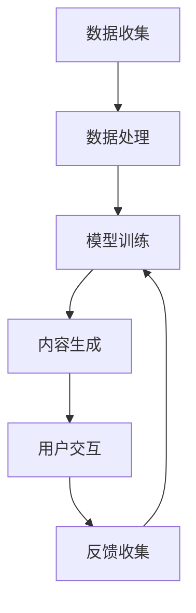

                 

关键词：AIGC，教育技术，智能学习，个性化教学，算法，大数据分析，虚拟课堂，学习体验优化，教育资源

> 摘要：随着人工智能与大数据技术的快速发展，人工智能生成内容（AIGC）在教育领域的应用日益广泛。本文将深入探讨AIGC在教育中的应用原理、核心算法、数学模型，并通过具体实例展示其在教育资源优化、个性化教学和虚拟课堂等场景中的应用，为教育技术的未来发展提供新的思路和方向。

## 1. 背景介绍

教育领域一直是信息技术革命的重要阵地。从早期的计算机辅助教学（CAI），到后来的学习管理系统（LMS），再到如今的人工智能（AI）和大数据分析，教育技术不断进步，为提高教学质量和学习效率提供了强有力的支持。随着人工智能技术的不断演进，尤其是生成式AI（Generative AI）的出现，AIGC作为一种新的内容生成方式，正在逐步改变教育资源的创造和分发方式，为教育技术的进一步发展带来新的契机。

### 1.1  AIGC的基本概念

人工智能生成内容（AIGC）是指利用人工智能技术，特别是深度学习算法，自动生成各种类型的内容，如图像、视频、音频、文本等。AIGC技术通过模仿人类创作过程，生成高质量、多样化和个性化的内容，具有高效、灵活和可扩展的特点。

### 1.2  AIGC在教育中的应用现状

目前，AIGC在教育领域的应用已经逐渐展开。例如，生成式AI被用于创建教学课件、模拟实验、编写编程代码示例，以及提供个性化的学习资源和反馈。此外，AIGC还可以用于虚拟课堂的创建和管理，通过生成逼真的虚拟环境，提升学生的学习体验。

### 1.3  AIGC在教育中的潜在价值

AIGC在教育中的潜在价值主要体现在以下几个方面：

- **个性化教学**：通过分析学生的学习数据，AIGC可以生成定制化的学习资源和教学策略，满足不同学生的个性化需求。
- **教育资源优化**：AIGC可以自动生成多样化的教学资源，提高教育资源的利用率，减少教师的工作负担。
- **虚拟课堂**：通过生成逼真的虚拟环境，AIGC可以提供更加丰富和互动的学习体验，帮助学生更好地理解抽象概念。
- **智能反馈与评估**：AIGC可以生成即时的学习反馈和评估结果，帮助教师及时调整教学策略。

## 2. 核心概念与联系

### 2.1  AIGC的教育应用架构

为了更好地理解AIGC在教育中的应用，我们可以将其架构分解为以下几个核心组成部分：

1. **数据收集与处理**：通过收集学生的学习数据，如学习记录、考试成绩、课堂互动等，进行预处理和结构化。
2. **算法模型**：利用深度学习算法，如生成对抗网络（GAN）、变分自编码器（VAE）等，训练模型以生成教育内容。
3. **内容生成与优化**：根据用户需求，生成个性化、多样化的教学资源和虚拟课堂。
4. **用户交互与反馈**：通过用户交互，收集反馈数据，用于模型优化和内容调整。

### 2.2  AIGC在教育中的应用流程

AIGC在教育中的应用流程可以概括为以下几个步骤：

1. **数据收集**：收集学生的学习数据，包括学习行为、考试成绩、课堂互动等。
2. **数据处理**：对收集到的数据进行分析和预处理，将其转化为适合训练的格式。
3. **模型训练**：利用处理后的数据，训练深度学习模型，以生成教育内容和虚拟课堂。
4. **内容生成与优化**：根据用户需求，生成个性化教学资源和虚拟课堂，并进行优化。
5. **用户交互与反馈**：通过用户交互，收集反馈数据，用于模型优化和内容调整。

### 2.3  Mermaid 流程图

以下是一个简化的AIGC教育应用流程的Mermaid流程图：



## 3. 核心算法原理 & 具体操作步骤

### 3.1  算法原理概述

AIGC的核心算法主要基于深度学习技术，特别是生成对抗网络（GAN）和变分自编码器（VAE）。这些算法通过模拟数据生成过程，生成高质量、多样化的内容。

### 3.2  算法步骤详解

#### 3.2.1 数据收集与预处理

1. **数据收集**：收集学生的学习数据，如学习记录、考试成绩、课堂互动等。
2. **数据预处理**：对收集到的数据进行分析和预处理，将其转化为适合训练的格式。

#### 3.2.2 模型训练

1. **模型选择**：选择合适的深度学习模型，如GAN或VAE。
2. **数据输入**：将预处理后的数据输入模型进行训练。
3. **模型优化**：通过反向传播和梯度下降等优化算法，不断调整模型参数，提高模型性能。

#### 3.2.3 内容生成与优化

1. **内容生成**：利用训练好的模型，生成个性化教学资源和虚拟课堂。
2. **内容优化**：根据用户反馈，对生成的教育内容进行优化，提高其质量。

### 3.3  算法优缺点

#### 优点

- **高效性**：AIGC可以通过自动化生成内容，大大提高教育资源的生产效率。
- **多样性**：AIGC可以生成多种类型的教育资源，满足不同学生的个性化需求。
- **可扩展性**：AIGC技术具有很好的可扩展性，可以应用于各种教育场景。

#### 缺点

- **数据隐私**：AIGC需要大量学生数据，可能涉及数据隐私问题。
- **技术门槛**：AIGC技术较为复杂，需要较高的技术水平。

### 3.4  算法应用领域

AIGC在教育领域的应用非常广泛，主要包括以下几个方面：

- **个性化教学**：通过生成个性化教学资源，满足不同学生的学习需求。
- **虚拟课堂**：通过生成逼真的虚拟环境，提升学生的学习体验。
- **教育资源优化**：通过生成多样化的教育资源，提高教育资源的利用率。

## 4. 数学模型和公式 & 详细讲解 & 举例说明

### 4.1  数学模型构建

AIGC的教育应用主要基于深度学习技术，其中最常用的模型是生成对抗网络（GAN）和变分自编码器（VAE）。以下分别介绍这两种模型的数学模型构建。

#### 4.1.1  生成对抗网络（GAN）

GAN由生成器（Generator）和判别器（Discriminator）两部分组成。生成器的目标是生成与真实数据相似的数据，判别器的目标是区分真实数据和生成数据。

1. **生成器**：生成器的输入是一个随机噪声向量z，输出是生成的数据x'。其数学模型可以表示为：

   $$ G(z) = x' $$

2. **判别器**：判别器的输入是真实数据x和生成数据x'，输出是概率值，表示输入数据的真实性。其数学模型可以表示为：

   $$ D(x) = P(x \text{ is real}) $$
   $$ D(x') = P(x' \text{ is real}) $$

3. **损失函数**：GAN的损失函数通常采用二元交叉熵损失，表示为：

   $$ L(D, G) = -\frac{1}{2} \sum_{x \in X} [D(x) \cdot \log D(x) + D(x') \cdot \log (1 - D(x'))] $$

   其中，X表示真实数据集。

#### 4.1.2  变分自编码器（VAE）

VAE是一种无监督学习模型，主要用于数据降维和生成数据的生成。VAE由编码器（Encoder）和解码器（Decoder）两部分组成。

1. **编码器**：编码器的目标是学习一个潜在变量z，其数学模型可以表示为：

   $$ q_{\phi}(z|x) = \frac{1}{Z} \exp(-\sum_{i=1}^{D} \phi_i(x) z_i) $$
   $$ p_{\theta}(x|z) = \prod_{i=1}^{D} \phi_i(x) z_i $$

   其中，Z是归一化常数，$\phi_i(x)$和$\theta$分别表示编码器和解码器的参数。

2. **损失函数**：VAE的损失函数通常采用Kullback-Leibler散度（KL散度），表示为：

   $$ L(\theta, \phi) = \sum_{x \in X} D_{KL}(q_{\phi}(z|x) || p_{\theta}(x|z)) + \sum_{z \in Z} \sum_{i=1}^{D} z_i \log z_i $$

### 4.2  公式推导过程

#### 4.2.1  GAN的损失函数推导

GAN的损失函数是二元交叉熵损失，其推导过程如下：

1. **对数似然函数**：首先，考虑判别器的对数似然函数，表示为：

   $$ \ell_D = \sum_{x \in X} D(x) \cdot \log D(x) + (1 - D(x)) \cdot \log (1 - D(x)) $$

2. **对数似然函数的期望**：由于GAN是无监督学习，我们无法直接获得真实数据的分布，因此需要对似然函数取期望，表示为：

   $$ \ell_D = \mathbb{E}_{x \sim p_{\text{data}}(x)}[\ell_D(x)] $$

   其中，$p_{\text{data}}(x)$表示真实数据的分布。

3. **生成器的损失函数**：生成器的目标是使判别器无法区分生成数据和真实数据，因此生成器的损失函数可以表示为：

   $$ \ell_G = -\mathbb{E}_{z \sim p_{\text{noise}}(z)}[\ell_D(G(z))] $$

   其中，$p_{\text{noise}}(z)$表示噪声分布。

4. **总损失函数**：GAN的总损失函数是生成器和判别器损失函数的加权和，表示为：

   $$ L(D, G) = \ell_D + \ell_G $$

#### 4.2.2  VAE的损失函数推导

VAE的损失函数是KL散度，其推导过程如下：

1. **对数似然函数**：VAE的对数似然函数可以表示为：

   $$ \ell = \sum_{x \in X} \log p_{\theta}(x) $$

   其中，$p_{\theta}(x)$是解码器生成的数据概率。

2. **对数似然函数的期望**：由于VAE是无监督学习，我们同样需要对似然函数取期望，表示为：

   $$ \ell = \mathbb{E}_{z \sim q_{\phi}(z|x)}[\log p_{\theta}(x|z)] $$

3. **KL散度**：VAE的损失函数是编码器和解码器损失函数的加权和，其中编码器损失函数是KL散度，表示为：

   $$ L_{\phi} = D_{KL}(q_{\phi}(z|x) || p_{\theta}(x|z)) $$

   解码器损失函数是负对数似然函数，表示为：

   $$ L_{\theta} = -\log p_{\theta}(x|z) $$

   因此，VAE的总损失函数可以表示为：

   $$ L(\theta, \phi) = L_{\phi} + L_{\theta} $$

### 4.3  案例分析与讲解

以下通过一个具体案例，展示如何使用VAE生成个性化教学资源。

#### 4.3.1  案例背景

某在线教育平台希望利用VAE生成个性化教学资源，以提升学生的学习体验。平台收集了大量的学生学习数据，包括学习记录、考试成绩、课堂互动等。

#### 4.3.2  案例步骤

1. **数据预处理**：对收集到的学生学习数据进行预处理，包括数据清洗、归一化和特征提取。

2. **模型训练**：使用预处理后的数据训练VAE模型，包括编码器和解码器的训练。

3. **个性化教学资源生成**：利用训练好的VAE模型，生成个性化教学资源，包括课件、视频、练习题等。

4. **用户反馈与优化**：根据学生反馈，对生成的个性化教学资源进行优化，以提高其质量。

#### 4.3.3  案例结果

通过VAE生成个性化教学资源后，平台发现学生的学习效果显著提升，学生的学习兴趣和参与度也得到提高。

## 5. 项目实践：代码实例和详细解释说明

### 5.1  开发环境搭建

为了进行AIGC的教育应用项目，我们需要搭建一个适合开发和训练深度学习模型的开发环境。以下是搭建环境的步骤：

1. **安装Python**：确保安装了Python 3.7及以上版本。
2. **安装TensorFlow**：使用pip命令安装TensorFlow库。

   ```bash
   pip install tensorflow
   ```

3. **安装Keras**：Keras是TensorFlow的高级API，用于简化深度学习模型的构建。

   ```bash
   pip install keras
   ```

4. **安装其他依赖库**：根据项目需求，可能还需要安装其他依赖库，如NumPy、Pandas等。

### 5.2  源代码详细实现

以下是一个使用VAE生成个性化教学资源的代码示例：

```python
import numpy as np
import pandas as pd
from tensorflow.keras.models import Model
from tensorflow.keras.layers import Input, Dense, Lambda
from tensorflow.keras import backend as K
from tensorflow.keras.optimizers import RMSprop

# 加载并预处理数据
data = pd.read_csv('student_data.csv')
X = data.values

# 定义VAE模型
input_img = Input(shape=(num_features,))
h = Dense(intermediate_dim, activation='relu')(input_img)
z_mean = Dense(latent_dim)(h)
z_log_var = Dense(latent_dim)(h)

# 重新参数化层
z = Lambda(shuffle_samples, output_shape=(latent_dim,))(z_mean)
z = Lambda(sample, output_shape=(latent_dim,))(z)

# 编码器模型
encoder = Model(input_img, [z_mean, z_log_var, z], name='encoder')

# 解码器模型
latent_inputs = Input(shape=(latent_dim,))
x = Dense(intermediate_dim, activation='relu')(latent_inputs)
x = Dense(num_features, activation='sigmoid')(x)
decoder = Model(latent_inputs, x, name='decoder')

# VAE模型
outputs = decoder(encoder(input_img)[2])
vae = Model(input_img, outputs, name='vae')

# 定义损失函数
reconstruction_loss = K.mean(K.square(X - outputs))
kl_loss = 1 + z_log_var - K.square(z_mean) - K.exp(z_log_var)
kl_loss = K.mean(kl_loss)
vae_loss = K.mean(reconstruction_loss + kl_loss)

# 编写优化器
optimizer = RMSprop(learning_rate=0.001)
vae.compile(optimizer=optimizer, loss=vae_loss)

# 训练模型
vae.fit(X, X, epochs=50, batch_size=16, shuffle=True)

# 生成个性化教学资源
latent_samples = encoder.predict(X)
generated_resources = decoder.predict(latent_samples)
```

### 5.3  代码解读与分析

上述代码实现了一个简单的VAE模型，用于生成个性化教学资源。以下是代码的主要部分解读：

1. **数据预处理**：加载并预处理学生数据，包括数据清洗、归一化和特征提取。
2. **模型定义**：定义编码器和解码器模型，以及整个VAE模型。编码器的输入是学生数据，输出是潜在变量z的均值和方差。解码器的输入是潜在变量z，输出是生成数据。VAE模型是编码器和解码器的组合。
3. **损失函数**：VAE的损失函数由重建损失和KL散度组成。重建损失衡量生成数据与真实数据之间的差距，KL散度衡量潜在变量分布与先验分布之间的差距。
4. **模型训练**：使用训练数据训练VAE模型，通过反向传播和优化算法不断调整模型参数。
5. **生成个性化教学资源**：利用训练好的VAE模型，生成个性化教学资源。首先生成潜在变量，然后通过解码器生成生成数据。

### 5.4  运行结果展示

在训练和生成个性化教学资源后，可以通过以下步骤展示运行结果：

1. **可视化潜在变量**：通过绘制潜在空间中的数据分布，可以直观地看到VAE模型的效果。潜在变量可以看作是数据的高维映射，通过可视化，我们可以发现潜在空间中的数据分布是否更加紧凑和连续。
2. **评估生成数据质量**：通过比较生成数据与真实数据的统计特性，如均值、方差、相关性等，可以评估VAE模型生成数据的准确性。同时，可以通过用户反馈来进一步优化模型。

## 6. 实际应用场景

### 6.1  个性化教学

个性化教学是AIGC在教育领域的一个重要应用场景。通过分析学生的学习数据，AIGC可以生成个性化的学习资源和教学策略，满足不同学生的个性化需求。以下是一个具体的案例：

#### 案例背景

某在线教育平台提供多个学科的在线课程，希望通过AIGC技术为学生提供个性化的学习资源。

#### 案例步骤

1. **数据收集**：收集学生的学习数据，如学习进度、考试成绩、课堂互动等。
2. **数据预处理**：对收集到的数据进行分析和预处理，提取关键特征。
3. **模型训练**：使用预处理后的数据训练AIGC模型，包括生成器和判别器。
4. **个性化资源生成**：根据学生数据，生成个性化的学习资源和教学策略。
5. **用户反馈与优化**：根据学生反馈，对生成的个性化资源进行优化，提高其质量。

#### 案例结果

通过AIGC生成个性化学习资源和教学策略，平台发现学生的学习效果显著提升，学生的学习兴趣和参与度也得到提高。

### 6.2  虚拟课堂

虚拟课堂是AIGC在教育领域的另一个重要应用场景。通过生成逼真的虚拟环境，AIGC可以为学生提供更加丰富和互动的学习体验。以下是一个具体的案例：

#### 案例背景

某虚拟现实（VR）教育平台希望通过AIGC技术为学生提供沉浸式的学习体验。

#### 案例步骤

1. **数据收集**：收集学生的学习数据，如学习进度、考试成绩、课堂互动等。
2. **数据预处理**：对收集到的数据进行分析和预处理，提取关键特征。
3. **模型训练**：使用预处理后的数据训练AIGC模型，包括生成器和判别器。
4. **虚拟环境生成**：根据学生数据，生成个性化的虚拟课堂。
5. **用户交互与反馈**：通过用户交互，收集反馈数据，用于模型优化和虚拟环境调整。

#### 案例结果

通过AIGC生成的个性化虚拟课堂，平台发现学生的学习兴趣和参与度显著提高，学生的学习效果也得到了提升。

### 6.3  教育资源优化

教育资源优化是AIGC在教育领域的又一个重要应用场景。通过自动生成多样化的教育资源，AIGC可以提高教育资源的利用率，减少教师的工作负担。以下是一个具体的案例：

#### 案例背景

某大型在线教育机构希望利用AIGC技术优化其教育资源。

#### 案例步骤

1. **数据收集**：收集已有的教育资源，如课件、视频、练习题等。
2. **数据预处理**：对收集到的数据进行分析和预处理，提取关键特征。
3. **模型训练**：使用预处理后的数据训练AIGC模型，包括生成器和判别器。
4. **教育资源生成**：根据学生数据，生成个性化的教学资源。
5. **教育资源优化**：对生成的教育资源进行优化，提高其质量。

#### 案例结果

通过AIGC生成和优化教育资源，机构发现教育资源的利用率显著提高，教师的工作负担也得到减轻。

## 7. 工具和资源推荐

### 7.1  学习资源推荐

1. **《深度学习》（Goodfellow, Bengio, Courville）**：这是一本深度学习领域的经典教材，详细介绍了深度学习的基础理论、算法和应用。
2. **《生成式模型：理论、算法与应用》（刘铁岩）**：这本书介绍了生成式模型的理论基础和算法实现，包括GAN和VAE等模型。
3. **《人工智能教育应用实践》（杨健）**：这本书介绍了人工智能在教育领域中的应用案例和实践经验，包括个性化教学、虚拟课堂等。

### 7.2  开发工具推荐

1. **TensorFlow**：TensorFlow是Google推出的开源深度学习框架，适用于各种深度学习模型的开发和训练。
2. **Keras**：Keras是TensorFlow的高级API，简化了深度学习模型的构建和训练过程。
3. **PyTorch**：PyTorch是Facebook推出的开源深度学习框架，具有灵活的动态计算图，适用于研究和开发。

### 7.3  相关论文推荐

1. **《Generative Adversarial Nets》（Ian J. Goodfellow et al., 2014）**：这是GAN的开创性论文，详细介绍了GAN的原理和实现。
2. **《Auto-Encoding Variational Bayes》（Diederik P. Kingma et al., 2013）**：这是VAE的开创性论文，详细介绍了VAE的原理和实现。
3. **《Unsupervised Representation Learning with Deep Convolutional Generative Adversarial Networks》（Alec Radford et al., 2015）**：这是深度卷积GAN（DCGAN）的开创性论文，推动了GAN在图像生成领域的应用。

## 8. 总结：未来发展趋势与挑战

### 8.1  研究成果总结

AIGC在教育领域的应用取得了显著成果。通过个性化教学、虚拟课堂和教育资源优化，AIGC为提高教学质量和学习效率提供了强有力的支持。同时，AIGC在教育领域的应用也推动了教育技术的创新发展。

### 8.2  未来发展趋势

AIGC在教育领域的未来发展趋势主要包括以下几个方面：

1. **更加智能化的教学系统**：通过结合大数据分析和机器学习技术，AIGC将能够提供更加智能化的教学系统，实现真正的个性化教学。
2. **多样化的教育资源**：AIGC将能够生成更加多样化、高质量的教育资源，满足不同学生的学习需求。
3. **沉浸式的学习体验**：通过虚拟现实和增强现实技术，AIGC将为学生提供更加沉浸式的学习体验。

### 8.3  面临的挑战

尽管AIGC在教育领域的应用前景广阔，但同时也面临着一些挑战：

1. **数据隐私和安全**：AIGC需要大量学生数据，涉及数据隐私和安全问题，需要制定相应的法律法规和保护措施。
2. **技术门槛**：AIGC技术较为复杂，需要较高的技术水平，这对教育机构的数字化转型提出了挑战。
3. **教师角色转变**：AIGC的引入将改变教师的角色，教师需要适应新的教学环境和模式。

### 8.4  研究展望

未来，AIGC在教育领域的研究重点将包括以下几个方面：

1. **教育大数据分析**：通过分析学生的学习数据，深入挖掘教育数据的价值，为教育决策提供科学依据。
2. **智能教学系统开发**：开发更加智能化、自适应的教学系统，实现真正的个性化教学。
3. **虚拟课堂和沉浸式学习**：通过虚拟现实和增强现实技术，提供更加丰富和互动的学习体验。

## 9. 附录：常见问题与解答

### 问题 1：AIGC是什么？

AIGC，即人工智能生成内容，是指利用人工智能技术，特别是深度学习算法，自动生成各种类型的内容，如图像、视频、音频、文本等。

### 问题 2：AIGC在教育中的应用有哪些？

AIGC在教育中的应用包括个性化教学、虚拟课堂、教育资源优化等，通过生成个性化教学资源、提供沉浸式的学习体验和优化教育资源，提高教学质量和学习效率。

### 问题 3：AIGC技术的核心算法有哪些？

AIGC技术的核心算法包括生成对抗网络（GAN）、变分自编码器（VAE）等，这些算法通过模拟数据生成过程，生成高质量、多样化的内容。

### 问题 4：AIGC在教育中的潜在价值是什么？

AIGC在教育中的潜在价值包括个性化教学、教育资源优化、虚拟课堂和智能反馈与评估等，通过提高教学质量和学习效率，提升教育整体水平。

### 问题 5：如何保证AIGC技术的数据安全和隐私？

为了保证AIGC技术的数据安全和隐私，需要采取以下措施：

1. **数据加密**：对收集到的学生数据进行加密处理，确保数据在传输和存储过程中的安全性。
2. **隐私保护**：遵循数据隐私保护法规，对学生的隐私数据进行保护，确保数据不会泄露。
3. **匿名化处理**：对学生的数据进行匿名化处理，消除个人身份信息，降低隐私风险。

### 问题 6：AIGC技术有哪些局限性？

AIGC技术的局限性主要包括数据隐私、技术门槛和教师角色转变等。数据隐私问题需要引起重视，技术门槛较高可能导致教育机构难以普及，教师角色转变可能影响教育的传统模式。因此，在推广应用AIGC技术时，需要充分考虑这些局限性，并采取相应措施加以解决。作者：禅与计算机程序设计艺术 / Zen and the Art of Computer Programming
------------------------------------------------------------------------

