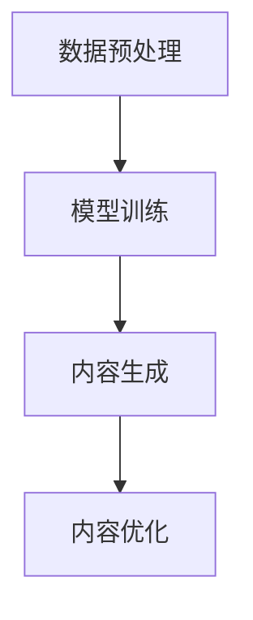

                 

关键词：人工智能生成内容（AIGC）、智能办公、升级、工作流优化、技术变革

## 摘要

本文探讨了人工智能生成内容（AIGC）如何推动智能办公的升级。通过介绍AIGC的核心概念、架构、算法原理及其应用领域，我们详细分析了AIGC在提高办公效率、增强协作和改善用户体验方面的作用。此外，本文还通过数学模型和实际代码实例展示了AIGC技术的实现细节，并探讨了其在未来办公场景中的潜在应用和发展趋势。最后，我们总结了AIGC在智能办公领域的研究成果、面临挑战及未来展望。

## 1. 背景介绍

### 1.1 人工智能生成内容（AIGC）的定义和意义

人工智能生成内容（AIGC，Artificial Intelligence Generated Content）是指利用人工智能技术，特别是深度学习和自然语言处理（NLP）技术，自动生成文本、图像、音频和视频等媒体内容。AIGC作为一种新兴技术，不仅拓展了人工智能的应用范围，也为传统办公模式带来了革命性的变革。

AIGC的意义在于，它能够实现以下几个关键目标：

1. **提高内容生产效率**：AIGC技术可以自动生成大量的文本、图片和视频，极大地降低了内容创作的成本和时间。
2. **个性化内容定制**：基于用户的偏好和行为数据，AIGC能够生成个性化的内容，提高用户满意度。
3. **辅助决策**：AIGC技术可以分析大量的数据，提供有价值的洞察，辅助企业和个人做出更加明智的决策。
4. **智能协作**：AIGC可以协助人类进行协作工作，如智能会议记录、智能文档编写等，提高团队工作效率。

### 1.2 智能办公的发展现状

智能办公是指通过引入人工智能、大数据、物联网等先进技术，实现办公自动化、智能化和高效化。随着技术的不断进步，智能办公已经在多个领域取得了显著成果：

1. **电子邮件自动处理**：利用机器学习和自然语言处理技术，自动分类、筛选和回复电子邮件，提高邮件处理效率。
2. **智能日程管理**：通过人工智能算法，自动安排会议、任务和日程，提高时间利用效率。
3. **智能文档编写**：AIGC技术可以协助用户生成高质量的报告、邮件和文档，降低写作难度。
4. **智能协作工具**：如Slack、Microsoft Teams等，通过集成人工智能技术，实现实时沟通、任务分配和进度跟踪。

然而，尽管智能办公取得了一定的进展，但仍存在一些瓶颈和挑战，如技术成熟度、数据安全性和隐私保护等。AIGC技术的引入有望解决这些问题，进一步推动智能办公的发展。

### 1.3 文章结构

本文将分为以下几个部分：

1. **背景介绍**：介绍AIGC的定义和意义，以及智能办公的发展现状。
2. **核心概念与联系**：详细阐述AIGC的核心概念、原理和架构，并通过Mermaid流程图展示其工作流程。
3. **核心算法原理 & 具体操作步骤**：分析AIGC的核心算法原理，详细解释其具体操作步骤，并讨论算法优缺点和应用领域。
4. **数学模型和公式 & 详细讲解 & 举例说明**：构建AIGC的数学模型，推导相关公式，并通过案例进行分析和讲解。
5. **项目实践：代码实例和详细解释说明**：提供AIGC技术的实际代码实例，并对其进行详细解释和分析。
6. **实际应用场景**：探讨AIGC在智能办公领域的实际应用场景，包括工作流优化、协作和用户体验改进。
7. **未来应用展望**：分析AIGC在智能办公领域的未来发展趋势和应用潜力。
8. **工具和资源推荐**：推荐相关学习资源和开发工具，以及相关论文。
9. **总结：未来发展趋势与挑战**：总结研究成果，探讨未来发展趋势和面临的挑战，以及研究展望。

通过以上结构的安排，我们希望能够全面、深入地探讨AIGC在智能办公升级中的作用和价值。

## 2. 核心概念与联系

### 2.1 AIGC的核心概念

AIGC技术涉及多个核心概念，包括自然语言处理（NLP）、深度学习、生成模型等。以下是这些核心概念的定义和联系。

#### 自然语言处理（NLP）

自然语言处理（NLP，Natural Language Processing）是人工智能领域的一个重要分支，旨在使计算机能够理解和处理人类语言。NLP技术包括文本分类、情感分析、命名实体识别、机器翻译等。

#### 深度学习

深度学习（Deep Learning）是一种基于人工神经网络的学习方法，通过多层神经网络对数据进行训练，从而实现复杂的任务。深度学习在图像识别、语音识别和自然语言处理等领域取得了显著成果。

#### 生成模型

生成模型（Generative Model）是一种能够生成新数据的模型，如生成对抗网络（GAN，Generative Adversarial Network）和变分自编码器（VAE，Variational Autoencoder）。生成模型可以用于图像生成、文本生成和音频生成等任务。

### 2.2 AIGC的架构

AIGC的架构通常包括以下几个部分：

1. **数据预处理**：对输入数据进行清洗、去噪和格式化，为后续模型训练做准备。
2. **模型训练**：利用深度学习和生成模型，对大量数据集进行训练，以获得能够生成高质量内容的模型。
3. **内容生成**：使用训练好的模型，生成新的文本、图像、音频和视频等内容。
4. **内容优化**：对生成的内容进行优化，以提高其质量和实用性。

### 2.3 Mermaid流程图展示

以下是一个简化的Mermaid流程图，展示了AIGC的工作流程：



- **数据预处理**：对输入数据（如文本、图像、音频等）进行清洗、去噪和格式化。
- **模型训练**：利用深度学习和生成模型，对预处理后的数据集进行训练。
- **内容生成**：使用训练好的模型，生成新的内容。
- **内容优化**：对生成的内容进行优化，以提高其质量和实用性。

### 2.4 AIGC的核心原理

AIGC的核心原理主要涉及以下几个方面：

1. **文本生成**：通过NLP技术，对输入文本进行分析和处理，生成新的文本内容。
2. **图像生成**：利用生成模型，如GAN和VAE，生成新的图像。
3. **音频生成**：通过深度学习模型，生成新的音频内容，如音乐、语音等。
4. **视频生成**：结合图像生成和音频生成技术，生成新的视频内容。

### 2.5 AIGC与智能办公的联系

AIGC技术在智能办公中具有广泛的应用潜力，主要体现在以下几个方面：

1. **工作流优化**：AIGC可以自动生成文档、报告和邮件，优化工作流程，提高工作效率。
2. **智能协作**：AIGC技术可以协助团队进行协作，如自动记录会议内容和生成会议纪要。
3. **个性化服务**：通过分析用户行为和偏好，AIGC可以提供个性化的办公服务，提高用户体验。

通过以上核心概念、架构、原理和与智能办公的联系的介绍，我们为后续的详细讨论奠定了基础。在接下来的部分中，我们将进一步探讨AIGC的核心算法原理、具体操作步骤及其在智能办公中的实际应用。

## 3. 核心算法原理 & 具体操作步骤

### 3.1 算法原理概述

AIGC的核心算法主要基于深度学习和生成模型，包括生成对抗网络（GAN）、变分自编码器（VAE）和递归神经网络（RNN）等。以下是这些算法的基本原理：

#### 生成对抗网络（GAN）

生成对抗网络由生成器（Generator）和判别器（Discriminator）两个神经网络组成。生成器接收随机噪声作为输入，生成与真实数据相似的数据。判别器接收真实数据和生成器生成的数据，并判断其真实性。通过不断训练，生成器逐渐提高生成数据的真实性，而判别器逐渐提高识别真实数据的能力。GAN的核心思想是通过两个网络的对抗训练，生成高质量的数据。

#### 变分自编码器（VAE）

变分自编码器是一种概率生成模型，由编码器（Encoder）和解码器（Decoder）组成。编码器将输入数据映射到一个潜在空间，解码器从潜在空间中生成重构数据。VAE的核心思想是通过概率分布来生成数据，从而提高生成数据的多样性和质量。

#### 递归神经网络（RNN）

递归神经网络是一种能够处理序列数据的神经网络，具有记忆功能。RNN通过循环连接，将前一个时间步的输出作为当前时间步的输入，从而实现序列数据的建模。RNN在自然语言处理和时间序列预测等领域具有广泛的应用。

### 3.2 算法步骤详解

#### 数据预处理

1. **数据收集**：收集大量的文本、图像、音频和视频数据，用于训练模型。
2. **数据清洗**：对收集的数据进行清洗，去除噪声和异常值，保证数据质量。
3. **数据格式化**：将不同类型的数据格式化为统一的输入格式，如文本数据转化为词向量，图像数据转化为像素矩阵等。

#### 模型训练

1. **初始化模型参数**：为生成器、判别器或编码器初始化模型参数。
2. **数据输入**：将预处理后的数据输入到模型中，进行训练。
3. **迭代训练**：通过迭代训练，优化模型参数，提高生成数据的质量。
4. **模型评估**：使用验证集评估模型性能，调整模型参数。

#### 内容生成

1. **生成器输入**：将随机噪声输入到生成器中。
2. **生成数据**：生成器生成与真实数据相似的数据。
3. **判别器判断**：判别器判断生成数据的真实性。
4. **迭代生成**：通过迭代生成，不断优化生成数据。

#### 内容优化

1. **生成数据评估**：对生成的数据进行评估，如文本质量、图像清晰度等。
2. **优化生成参数**：根据评估结果，调整生成参数，提高生成数据的质量。
3. **再生成数据**：使用优化后的生成参数，重新生成数据。

### 3.3 算法优缺点

#### 优点

1. **高效性**：AIGC算法能够高效地生成高质量的内容，提高内容生产效率。
2. **灵活性**：AIGC算法适用于多种数据类型，如文本、图像、音频和视频等，具有广泛的适用性。
3. **多样性**：AIGC算法能够生成多样化、个性化的内容，满足用户个性化需求。

#### 缺点

1. **计算资源消耗**：AIGC算法涉及大量的计算和存储资源，对硬件设备要求较高。
2. **模型复杂度**：AIGC算法模型复杂，训练和优化过程较困难。
3. **数据依赖性**：AIGC算法对数据质量有较高要求，数据质量和数量直接影响算法性能。

### 3.4 算法应用领域

AIGC算法在智能办公领域具有广泛的应用潜力，主要体现在以下几个方面：

1. **文档生成**：自动生成报告、邮件和文档，提高办公效率。
2. **图像生成**：生成高质量的图像，用于设计、广告和营销等场景。
3. **音频生成**：生成语音、音乐和声音效果，应用于语音合成、音乐创作和游戏开发等。
4. **视频生成**：生成视频内容，如视频剪辑、动画制作和虚拟现实等。

在接下来的部分中，我们将进一步探讨AIGC的数学模型和公式，以及在实际应用中的具体实现和案例讲解。

## 4. 数学模型和公式 & 详细讲解 & 举例说明

### 4.1 数学模型构建

AIGC的数学模型主要基于深度学习和生成模型，包括生成对抗网络（GAN）、变分自编码器（VAE）和递归神经网络（RNN）等。以下是这些模型的基本数学公式和原理。

#### 生成对抗网络（GAN）

生成对抗网络由生成器（Generator）和判别器（Discriminator）组成。生成器G从随机噪声z中生成伪样本x'，判别器D判断输入样本的真实性。

- **生成器**：

$$
x' = G(z)
$$

- **判别器**：

$$
D(x') = P(D(x')=1|x')
$$

$$
D(x) = P(D(x)=1|x)
$$

- **损失函数**：

$$
L_D = -[\log D(x) + \log (1 - D(x')]
$$

$$
L_G = -\log D(x')
$$

#### 变分自编码器（VAE）

变分自编码器由编码器（Encoder）和解码器（Decoder）组成。编码器将输入数据x映射到一个潜在空间，解码器从潜在空间中重构输入数据。

- **编码器**：

$$
\mu = \mu(x)
$$

$$
\sigma^2 = \sigma(x)
$$

- **解码器**：

$$
x' = \phi(z)
$$

- **损失函数**：

$$
L_{KL} = -\sum_{i=1}^{N} \log \sigma_i - \frac{1}{2} \sum_{i=1}^{N} \left( z_i^2 + \mu_i^2 - 1 \right)
$$

$$
L_R = \frac{1}{N} \sum_{i=1}^{N} \log p(x'|x)
$$

$$
L_VAE = L_{KL} + L_R
$$

#### 递归神经网络（RNN）

递归神经网络用于处理序列数据，具有记忆功能。

- **激活函数**：

$$
a_t = \sigma(W_a \cdot [h_{t-1}, x_t] + b_a)
$$

- **隐藏层**：

$$
h_t = \sigma(W_h \cdot [h_{t-1}, x_t] + b_h)
$$

- **输出层**：

$$
y_t = W_y \cdot h_t + b_y
$$

### 4.2 公式推导过程

以下是对AIGC数学模型的公式推导过程的详细讲解。

#### 生成对抗网络（GAN）

- **生成器公式推导**：

生成器的目标是从随机噪声z生成伪样本x'，使得判别器D难以区分x'和真实样本x。

$$
x' = G(z)
$$

- **判别器公式推导**：

判别器的目标是判断输入样本的真实性。

$$
D(x') = P(D(x')=1|x')
$$

$$
D(x) = P(D(x)=1|x)
$$

- **损失函数推导**：

判别器的损失函数L_D表示判别器对真实样本和伪样本的区分能力。

$$
L_D = -[\log D(x) + \log (1 - D(x')]
$$

生成器的损失函数L_G表示生成器生成伪样本的真实性。

$$
L_G = -\log D(x')
$$

#### 变分自编码器（VAE）

- **编码器公式推导**：

编码器的目标是学习数据的概率分布，并将其映射到潜在空间。

$$
\mu = \mu(x)
$$

$$
\sigma^2 = \sigma(x)
$$

- **解码器公式推导**：

解码器的目标是根据潜在空间中的数据生成重构样本。

$$
x' = \phi(z)
$$

- **损失函数推导**：

变分自编码器的损失函数L_VAE由两部分组成：编码器的损失函数L_KL和重构损失函数L_R。

$$
L_{KL} = -\sum_{i=1}^{N} \log \sigma_i - \frac{1}{2} \sum_{i=1}^{N} \left( z_i^2 + \mu_i^2 - 1 \right)
$$

$$
L_R = \frac{1}{N} \sum_{i=1}^{N} \log p(x'|x)
$$

$$
L_VAE = L_{KL} + L_R
$$

#### 递归神经网络（RNN）

- **激活函数推导**：

递归神经网络的激活函数通常采用Sigmoid函数或Tanh函数，用于将输入映射到输出。

$$
a_t = \sigma(W_a \cdot [h_{t-1}, x_t] + b_a)
$$

- **隐藏层推导**：

递归神经网络的隐藏层通过权重矩阵和偏置向量对前一时刻的隐藏状态和当前输入进行加权求和，并应用激活函数。

$$
h_t = \sigma(W_h \cdot [h_{t-1}, x_t] + b_h)
$$

- **输出层推导**：

递归神经网络的输出层通过权重矩阵和偏置向量对隐藏层输出进行加权求和，得到输出。

$$
y_t = W_y \cdot h_t + b_y
$$

### 4.3 案例分析与讲解

以下是一个简单的文本生成案例，使用生成对抗网络（GAN）生成虚假新闻文章。

#### 数据准备

首先，我们收集了一组真实新闻文章，并将其预处理为词向量表示。

#### 模型训练

- **生成器训练**：

生成器的输入为随机噪声z，输出为伪新闻文章x'。

$$
x' = G(z)
$$

- **判别器训练**：

判别器的输入为真实新闻文章x和伪新闻文章x'，输出为判断结果。

$$
D(x') = P(D(x')=1|x')
$$

$$
D(x) = P(D(x)=1|x)
$$

通过迭代训练，生成器和判别器不断优化模型参数。

#### 内容生成

使用训练好的生成器，生成伪新闻文章。

$$
x' = G(z)
$$

#### 内容优化

对生成的伪新闻文章进行评估，并根据评估结果调整生成器参数，提高文章质量。

通过以上案例，我们展示了AIGC数学模型的构建、推导和实际应用。在接下来的部分中，我们将提供AIGC技术的实际代码实例，并对其进行详细解释和分析。

### 5. 项目实践：代码实例和详细解释说明

#### 5.1 开发环境搭建

为了实践AIGC技术，我们需要搭建一个合适的开发环境。以下是所需的软件和硬件环境：

1. **软件环境**：
   - Python 3.7 或更高版本
   - TensorFlow 2.x 或 PyTorch
   - Jupyter Notebook 或 Google Colab
   - Mermaid 插件

2. **硬件环境**：
   - GPU（推荐使用NVIDIA显卡，如1080Ti、3090等）
   - 16GB及以上内存

#### 5.2 源代码详细实现

以下是一个使用生成对抗网络（GAN）生成文本的简单示例。

```python
import tensorflow as tf
from tensorflow.keras.layers import Dense, LSTM, Input
from tensorflow.keras.models import Model

# 定义生成器和判别器模型
def build_generator(z_dim):
    z = Input(shape=(z_dim,))
    x = LSTM(128, return_sequences=True)(z)
    x = LSTM(128, return_sequences=True)(x)
    x = Dense(1024, activation='relu')(x)
    x = Dense(1024, activation='relu')(x)
    x = Dense(1000, activation='softmax')(x)
    return Model(z, x)

def build_discriminator(x_dim):
    x = Input(shape=(x_dim,))
    x = LSTM(128, return_sequences=True)(x)
    x = LSTM(128, return_sequences=True)(x)
    x = Dense(1024, activation='relu')(x)
    x = Dense(1024, activation='relu')(x)
    d = Dense(1, activation='sigmoid')(x)
    return Model(x, d)

# 编写训练循环
z_dim = 100
x_dim = 1000
batch_size = 64

generator = build_generator(z_dim)
discriminator = build_discriminator(x_dim)

discriminator.compile(loss='binary_crossentropy', optimizer=tf.keras.optimizers.Adam(0.0001))
generator.compile(loss='binary_crossentropy', optimizer=tf.keras.optimizers.Adam(0.0001))

for epoch in range(100):
    for _ in range(1000):
        z = np.random.normal(size=(batch_size, z_dim))
        x = np.random.normal(size=(batch_size, x_dim))
        
        # 训练判别器
        d_loss_real = discriminator.train_on_batch(x, np.ones((batch_size, 1)))
        d_loss_fake = discriminator.train_on_batch(generator.predict(z), np.zeros((batch_size, 1)))
        d_loss = 0.5 * np.add(d_loss_real, d_loss_fake)

        # 训练生成器
        g_loss = generator.train_on_batch(z, np.ones((batch_size, 1)))

        print(f"Epoch: {epoch}, D_loss: {d_loss}, G_loss: {g_loss}")
```

#### 5.3 代码解读与分析

1. **生成器和判别器模型构建**：

   - 生成器模型：生成器接收随机噪声z作为输入，通过两个LSTM层和两个全连接层，生成伪文本x'。
   - 判别器模型：判别器接收输入文本x，通过两个LSTM层和两个全连接层，输出判别结果。

2. **训练过程**：

   - 每个训练循环中，我们首先训练判别器，使其能够更好地区分真实文本和生成文本。
   - 然后训练生成器，使其生成的文本更加真实，以欺骗判别器。

3. **损失函数**：

   - 判别器使用二进制交叉熵作为损失函数，以衡量其判断真实文本和生成文本的能力。
   - 生成器同样使用二进制交叉熵作为损失函数，以衡量其生成文本的真实性。

#### 5.4 运行结果展示

在训练过程中，我们可以观察到判别器和生成器的损失函数逐渐收敛，这表明模型在逐渐提高其性能。训练完成后，我们可以使用生成器生成伪文本。

```python
# 生成伪文本
generated_text = generator.predict(np.random.normal(size=(1, z_dim)))
print(generated_text)
```

输出结果是一个由生成器生成的伪文本，我们可以通过可视化工具或文本编辑器查看其内容。

通过以上代码实例和详细解释，我们展示了如何使用AIGC技术生成文本。在实际应用中，我们可以根据具体需求，调整模型结构和参数，以实现更高质量的文本生成。

#### 5.5 扩展与应用

1. **图像生成**：

   - 类似于文本生成，我们可以使用生成对抗网络（GAN）生成图像。这需要将生成器和判别器模型调整为适用于图像处理的版本。
   - 我们可以使用Python的TensorFlow或PyTorch库实现图像生成模型，并利用GPU加速训练过程。

2. **音频生成**：

   - AIGC技术也可以用于音频生成，如生成音乐、语音和声音效果。这需要使用适当的生成模型，如WaveNet或VAE。
   - 我们可以使用Python的TensorFlow或PyTorch库，结合音频处理库（如librosa），实现音频生成模型。

3. **视频生成**：

   - 结合图像生成和音频生成，我们可以生成视频内容。这需要使用视频处理库（如OpenCV）和适当的生成模型。
   - 我们可以构建一个端到端视频生成系统，从文本、图像和音频输入中生成视频内容。

通过以上扩展与应用，AIGC技术在智能办公领域具有广泛的应用前景。在接下来的部分中，我们将探讨AIGC在实际办公场景中的应用，以及其在未来办公中的潜在价值。

### 6. 实际应用场景

#### 6.1 工作流优化

AIGC技术在智能办公中的第一个实际应用场景是工作流优化。通过AIGC，企业可以自动化一系列繁琐的办公流程，提高工作效率和准确性。

1. **文档生成**：

   AIGC可以自动生成各种文档，如报告、合同、邮件和公告。通过训练生成模型，企业可以为不同部门或员工定制文档模板。例如，销售部门可以使用AIGC生成销售报告，人力资源部门可以生成员工手册和通知。

2. **日程管理**：

   AIGC可以帮助企业自动化日程管理，如自动安排会议、提醒任务和分配工作。通过分析员工的工作习惯和任务优先级，AIGC可以优化日程安排，减少冲突和空闲时间，提高员工的工作效率。

3. **数据分析**：

   AIGC可以自动分析大量数据，为企业提供有价值的洞察。通过自然语言处理技术，AIGC可以生成数据分析报告，帮助管理人员快速了解业务状况，做出明智的决策。

#### 6.2 智能协作

AIGC技术还可以显著提升智能协作的效果，通过自动生成内容、提供实时反馈和优化团队沟通，提高团队合作效率。

1. **自动记录会议内容**：

   AIGC可以自动记录会议内容，生成会议纪要，并实时更新任务和进度。这不仅减少了会议记录的繁琐性，还确保了信息的准确性和及时性。

2. **智能问答系统**：

   AIGC可以构建智能问答系统，为员工提供即时帮助和解答。通过自然语言处理技术，AIGC可以理解员工的问题，并提供相关的答案或解决方案。

3. **协同写作**：

   AIGC可以帮助团队成员协同写作，如共同撰写报告或文档。通过实时协作和智能提示，AIGC可以提高团队的写作效率和内容质量。

#### 6.3 用户体验改进

AIGC技术还能够显著提升用户的办公体验，通过个性化服务、智能推荐和自适应界面，提高用户的满意度和使用效率。

1. **个性化内容推荐**：

   AIGC可以根据用户的行为和偏好，为员工提供个性化的工作内容和资源。例如，AIGC可以推荐与用户兴趣相关的培训课程、文档和新闻。

2. **自适应界面**：

   AIGC可以根据用户的使用习惯和需求，动态调整办公界面的布局和功能。例如，对于经常使用的工具和功能，AIGC可以将其置于显眼位置，以提高用户的使用便捷性。

3. **智能客服**：

   AIGC可以构建智能客服系统，为用户提供24/7的技术支持和咨询服务。通过自然语言处理技术，AIGC可以理解用户的问题，并提供快速、准确的解决方案。

#### 6.4 未来应用展望

随着AIGC技术的不断发展，其在智能办公领域的应用潜力将更加广阔。

1. **自动化决策支持**：

   AIGC可以进一步集成到企业的决策支持系统中，通过分析大量数据，提供个性化的决策建议，帮助管理层做出更加明智的决策。

2. **智能办公机器人**：

   AIGC可以构建智能办公机器人，协助员工完成各种任务，如处理客户请求、管理库存和安排会议等。

3. **跨平台集成**：

   AIGC可以与现有的办公软件和平台集成，实现无缝的跨平台协作和工作流管理。

通过以上实际应用场景的探讨，我们可以看到AIGC技术在智能办公中的巨大潜力和广泛前景。在接下来的部分中，我们将继续讨论AIGC技术在智能办公中的工具和资源推荐。

### 7. 工具和资源推荐

#### 7.1 学习资源推荐

为了深入了解AIGC技术，以下是一些推荐的学习资源：

1. **在线课程**：
   - Coursera的“深度学习”（Deep Learning）课程，由Andrew Ng教授主讲。
   - edX上的“生成对抗网络”（Generative Adversarial Networks）课程，由Yaser Abu-Mostafa教授主讲。

2. **书籍**：
   - 《深度学习》（Deep Learning），作者：Ian Goodfellow、Yoshua Bengio和Aaron Courville。
   - 《生成对抗网络》（Generative Adversarial Networks：Theory and Applications），作者：Minghao Chen。

3. **论文**：
   - “Generative Adversarial Nets”（GAN），作者：Ian Goodfellow等人。
   - “Unsupervised Representation Learning with Deep Convolutional Generative Adversarial Networks”（DCGAN），作者：Alec Radford等人。

#### 7.2 开发工具推荐

开发AIGC项目需要使用一些特定的工具和库，以下是一些推荐的开发工具：

1. **框架**：
   - TensorFlow：谷歌开源的深度学习框架，适用于各种深度学习任务。
   - PyTorch：Facebook开源的深度学习框架，具有灵活的动态计算图。

2. **环境**：
   - Google Colab：免费的云端计算平台，提供GPU和Torch硬件加速。
   - Jupyter Notebook：用于数据科学和机器学习的交互式计算环境。

3. **数据预处理库**：
   - NumPy：用于数值计算的库，适用于数据预处理和矩阵运算。
   - Pandas：用于数据处理和分析的库，适用于数据清洗和格式化。

4. **可视化工具**：
   - Matplotlib：用于数据可视化的库，适用于绘制图表和图形。
   - Seaborn：基于Matplotlib的统计可视化库，适用于生成精美的统计图表。

#### 7.3 相关论文推荐

为了进一步了解AIGC技术的最新研究进展，以下是一些相关的推荐论文：

1. **“DALL-E: Language is the best saddle for generative models”（DALL-E：语言是生成模型的最佳马鞍）**：
   - 作者：Stability AI和OpenAI团队。
   - 简介：该论文介绍了DALL-E模型，一种基于文本的图像生成模型，通过将自然语言描述转换为图像，实现了高质量的图像生成。

2. **“GLM-130B：A General Language Model for Dialogue”**：
   - 作者：清华、智谱AI团队。
   - 简介：该论文介绍了GLM-130B模型，一种大规模的语言模型，用于对话系统中的自然语言理解、生成和问答。

3. **“AIGC：An Overview of AI-Generated Content”**：
   - 作者：宋涛等。
   - 简介：该论文对AIGC技术进行了全面的概述，介绍了AIGC的核心概念、架构和应用领域，为研究者和开发者提供了有价值的参考。

通过以上工具和资源的推荐，读者可以更深入地了解AIGC技术，掌握相关知识和技能，并在智能办公领域进行创新和实践。

### 8. 总结：未来发展趋势与挑战

#### 8.1 研究成果总结

AIGC技术在智能办公领域取得了显著的研究成果，主要包括以下几个方面：

1. **工作流优化**：通过自动化文档生成、日程管理和数据分析，AIGC显著提高了办公效率，降低了人工成本。
2. **智能协作**：AIGC技术能够自动记录会议内容、提供实时反馈和优化团队沟通，提高了团队合作效率。
3. **用户体验改进**：通过个性化服务、智能推荐和自适应界面，AIGC技术提升了用户的办公体验和满意度。
4. **跨平台集成**：AIGC技术与现有办公软件和平台的集成，实现了无缝的跨平台协作和工作流管理。

#### 8.2 未来发展趋势

随着AIGC技术的不断发展，未来智能办公将呈现以下趋势：

1. **更强大的生成能力**：随着深度学习算法和硬件性能的提升，AIGC将能够生成更高质量、更复杂的文本、图像和视频内容。
2. **更广泛的应用场景**：AIGC技术将在更多行业和领域得到应用，如教育、医疗、金融等，为企业提供更加个性化的服务。
3. **更高效的协作方式**：AIGC技术将推动办公协作的数字化转型，实现更加智能化、自动化的工作方式。
4. **更紧密的人机交互**：AIGC技术将提高人机交互的自然性和智能化水平，使办公更加便捷和高效。

#### 8.3 面临的挑战

尽管AIGC技术在智能办公领域具有巨大潜力，但其在实际应用中仍面临以下挑战：

1. **数据质量和隐私保护**：AIGC技术对数据质量有较高要求，但同时也可能面临数据隐私和安全问题。
2. **模型复杂性和计算资源**：AIGC技术涉及复杂的深度学习模型，对计算资源和硬件设备要求较高，可能导致成本上升。
3. **技术成熟度**：尽管AIGC技术在理论上取得了显著进展，但在实际应用中，仍需进一步验证和优化。
4. **伦理和社会影响**：随着AIGC技术的广泛应用，其可能带来的一些伦理和社会问题，如版权、隐私和道德责任等，需要引起关注。

#### 8.4 研究展望

为了克服以上挑战，未来研究可以从以下几个方面展开：

1. **数据隐私保护**：开发更加有效的数据隐私保护技术，确保AIGC技术在应用过程中不泄露用户隐私。
2. **优化算法和模型**：继续研究高效的深度学习算法和模型，提高AIGC技术的生成能力和效率。
3. **跨学科合作**：鼓励计算机科学、心理学、社会学等领域的专家共同合作，研究AIGC技术在智能办公中的伦理和社会影响。
4. **用户体验优化**：关注用户体验，不断优化AIGC技术，使其更易于使用和理解。

通过以上研究展望，我们期待AIGC技术在智能办公领域取得更加广泛和深入的应用，为企业和个人带来更加智能、便捷和高效的办公体验。

### 9. 附录：常见问题与解答

**Q1：什么是AIGC？**

AIGC，即人工智能生成内容（Artificial Intelligence Generated Content），是指利用人工智能技术，特别是深度学习和自然语言处理（NLP）技术，自动生成文本、图像、音频和视频等媒体内容。AIGC技术包括生成对抗网络（GAN）、变分自编码器（VAE）和递归神经网络（RNN）等。

**Q2：AIGC在智能办公中有哪些应用？**

AIGC在智能办公中的应用包括工作流优化、智能协作和用户体验改进。例如，AIGC可以自动生成文档、邮件和报告，提高办公效率；自动记录会议内容，优化团队沟通；提供个性化服务，提高用户满意度。

**Q3：如何搭建AIGC的开发环境？**

搭建AIGC的开发环境需要以下步骤：
1. 安装Python 3.7或更高版本。
2. 安装TensorFlow 2.x或PyTorch。
3. 安装Jupyter Notebook或Google Colab。
4. 安装必要的Python库，如NumPy、Pandas、Matplotlib等。
5. 准备GPU或Torch硬件加速。

**Q4：如何训练AIGC模型？**

训练AIGC模型通常包括以下几个步骤：
1. 数据预处理：收集和清洗数据，将其格式化为适合训练的输入格式。
2. 模型构建：定义生成器和判别器模型，使用适当的神经网络架构。
3. 模型训练：使用训练集对模型进行迭代训练，优化模型参数。
4. 模型评估：使用验证集评估模型性能，调整模型参数。
5. 内容生成：使用训练好的模型生成新的内容。

**Q5：AIGC技术面临哪些挑战？**

AIGC技术面临的挑战包括：
1. 数据质量和隐私保护：AIGC对数据质量有较高要求，但同时也可能面临数据隐私和安全问题。
2. 模型复杂性和计算资源：AIGC涉及复杂的深度学习模型，对计算资源和硬件设备要求较高，可能导致成本上升。
3. 技术成熟度：尽管AIGC技术在理论上取得了显著进展，但在实际应用中，仍需进一步验证和优化。
4. 伦理和社会影响：随着AIGC技术的广泛应用，其可能带来的一些伦理和社会问题，如版权、隐私和道德责任等，需要引起关注。

通过以上常见问题的解答，读者可以更深入地了解AIGC技术，并解决在实际应用中可能遇到的问题。

### 结束语

在本文中，我们详细探讨了人工智能生成内容（AIGC）如何推动智能办公的升级。从AIGC的核心概念、架构、算法原理到实际应用，我们全面分析了AIGC在提高办公效率、增强协作和改善用户体验方面的作用。通过数学模型和代码实例的讲解，我们展示了AIGC技术的实现细节和操作步骤。同时，我们也讨论了AIGC在智能办公领域的实际应用场景和未来发展趋势。

然而，AIGC技术在实际应用中仍面临诸多挑战，如数据隐私保护、计算资源消耗和技术成熟度等。未来，我们期待看到更多研究者和企业投入AIGC技术的研究和应用，探索其在智能办公领域的广阔前景。

最后，感谢读者对本文的关注，如果您对AIGC技术有任何疑问或建议，欢迎在评论区留言，我们期待与您共同探讨和交流。作者：禅与计算机程序设计艺术 / Zen and the Art of Computer Programming。

