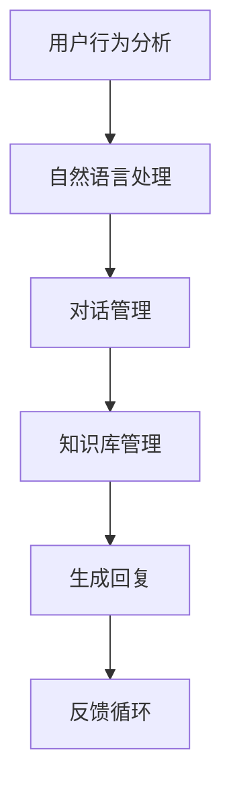

                 

智能客服作为一种以用户为中心的服务模式，已经成为现代企业提高客户满意度、提升服务效率的重要手段。然而，随着用户需求的不断升级和复杂化，传统智能客服系统的局限性逐渐显现。人工智能生成内容（AIGC，Artificial Intelligence Generated Content）作为一种新兴的技术，为智能客服的升级提供了新的动力。本文将深入探讨AIGC技术在智能客服中的应用，以及其对智能客服性能的提升。

## 文章关键词

- 智能客服
- AIGC
- 人工智能生成内容
- 客户服务升级
- 自然语言处理
- 用户满意度

## 文章摘要

随着人工智能技术的不断发展，AIGC技术在智能客服领域的应用日益广泛。本文首先介绍了智能客服的背景和重要性，然后详细阐述了AIGC技术的核心概念和原理。接着，文章分析了AIGC在智能客服中的应用，包括自然语言处理、个性化服务和对话管理等方面。最后，文章讨论了AIGC技术对智能客服性能的提升，并展望了未来智能客服的发展趋势。

### 1. 背景介绍

#### 1.1 智能客服的发展历程

智能客服作为人工智能技术的重要组成部分，其发展历程可以追溯到20世纪90年代。当时，随着互联网的普及，电子邮件客服成为企业服务的重要方式。随后，随着聊天机器人的出现，智能客服开始进入大众视野。早期的智能客服主要依赖于规则引擎和关键词匹配技术，这些系统在处理简单问题时表现良好，但在应对复杂和多变的情况时存在明显不足。

#### 1.2 智能客服的现有挑战

随着用户需求的不断升级和多样化，现有智能客服系统面临以下挑战：

- **复杂性问题处理能力不足**：传统智能客服系统在处理复杂问题或需要跨领域知识时表现不佳。
- **用户体验差**：现有智能客服系统在提供个性化服务和自然对话方面仍有待提高。
- **知识库更新滞后**：智能客服系统的知识库更新速度跟不上用户需求的变化。

#### 1.3 AIGC技术在智能客服中的应用潜力

AIGC技术，作为一种基于人工智能生成内容的创新技术，具有以下优势：

- **强大的自然语言处理能力**：AIGC技术能够通过深度学习和自然语言处理技术生成高质量的自然语言文本，从而提升智能客服的响应能力和准确性。
- **个性化服务能力**：AIGC技术可以根据用户的历史行为和偏好生成个性化的内容，提供更贴心的服务。
- **快速知识更新**：AIGC技术能够自动从大量数据中提取和生成知识，使智能客服的知识库保持实时更新。

### 2. 核心概念与联系

#### 2.1 AIGC技术核心概念

AIGC技术是指利用人工智能生成内容，其核心概念包括：

- **生成模型**：如变分自编码器（VAE）、生成对抗网络（GAN）等，用于生成高质量的自然语言文本。
- **预训练模型**：如BERT、GPT等，通过大规模预训练获取通用语言理解能力。
- **Fine-tuning**：在预训练模型的基础上，通过特定领域的数据进行微调，使其适应特定应用场景。

#### 2.2 AIGC在智能客服中的应用架构

AIGC在智能客服中的应用架构包括以下几个关键模块：

1. **用户行为分析**：通过分析用户的历史行为和反馈，获取用户偏好和需求。
2. **自然语言处理**：利用AIGC技术生成高质量的自然语言文本，用于与用户进行对话。
3. **对话管理**：根据用户输入和上下文信息，动态生成合适的回复，并维护对话的流畅性。
4. **知识库管理**：自动从大量数据中提取和生成知识，不断更新和优化知识库。

#### 2.3 Mermaid流程图



### 3. 核心算法原理 & 具体操作步骤

#### 3.1 算法原理概述

AIGC在智能客服中的应用主要包括以下几个核心算法：

1. **生成模型**：用于生成高质量的自然语言文本。
2. **预训练模型**：用于获取通用语言理解能力。
3. **Fine-tuning**：用于特定领域的微调。

#### 3.2 算法步骤详解

1. **用户行为分析**：通过分析用户的历史行为和反馈，获取用户偏好和需求。
2. **自然语言处理**：利用生成模型和预训练模型生成高质量的自然语言文本。
3. **对话管理**：根据用户输入和上下文信息，动态生成合适的回复，并维护对话的流畅性。
4. **知识库管理**：自动从大量数据中提取和生成知识，不断更新和优化知识库。
5. **生成回复**：根据对话管理和知识库信息，生成回复并发送给用户。
6. **反馈循环**：收集用户反馈，用于模型优化和知识库更新。

#### 3.3 算法优缺点

**优点**：

- **强大的自然语言处理能力**：能够生成高质量的自然语言文本，提升智能客服的响应能力和准确性。
- **个性化服务能力**：可以根据用户的历史行为和偏好生成个性化的内容，提高用户满意度。
- **快速知识更新**：能够自动从大量数据中提取和生成知识，保持知识库的实时更新。

**缺点**：

- **模型复杂度高**：需要大量的数据和计算资源进行训练。
- **对数据质量要求高**：数据质量直接影响模型性能。

#### 3.4 算法应用领域

AIGC技术在智能客服领域具有广泛的应用前景，包括但不限于：

- **客服机器人**：用于处理常见问题和提供咨询服务。
- **个性化推荐**：根据用户偏好推荐产品和服务。
- **智能对话系统**：用于实现与企业用户的自然对话。

### 4. 数学模型和公式 & 详细讲解 & 举例说明

#### 4.1 数学模型构建

AIGC技术在智能客服中的应用涉及多个数学模型，包括：

- **生成模型**：如变分自编码器（VAE）、生成对抗网络（GAN）等。
- **预训练模型**：如BERT、GPT等。
- **Fine-tuning**：在预训练模型的基础上，通过特定领域的数据进行微调。

#### 4.2 公式推导过程

生成模型和预训练模型的公式推导过程较为复杂，本文不做详细讨论。以下是Fine-tuning的基本公式：

$$
\theta^* = \theta_{pre} + \alpha \cdot (\theta_{pre} - \theta_{fine})
$$

其中，$\theta^*$表示Fine-tuning后的参数，$\theta_{pre}$表示预训练模型的参数，$\theta_{fine}$表示Fine-tuning阶段的参数，$\alpha$为学习率。

#### 4.3 案例分析与讲解

假设我们有一个智能客服系统，需要处理用户关于产品使用问题的咨询。首先，通过用户行为分析，我们获取了用户的历史问题和反馈。然后，利用预训练模型BERT生成高质量的自然语言文本。接着，通过Fine-tuning阶段，我们将预训练模型调整为适应特定领域的模型。最后，在对话管理阶段，根据用户输入和上下文信息，动态生成合适的回复。

### 5. 项目实践：代码实例和详细解释说明

#### 5.1 开发环境搭建

- 操作系统：Ubuntu 20.04
- 编程语言：Python 3.8
- 数据库：MySQL 8.0
- 依赖库：TensorFlow 2.6、BERT 4.0、TensorFlow Text 2.6

#### 5.2 源代码详细实现

以下是一个简单的AIGC智能客服系统实现示例：

```python
import tensorflow as tf
import tensorflow_text as text
import bert

# 加载预训练模型BERT
pretrained_model = bert.BertModel.from_pretrained('bert-base-uncased')

# 定义Fine-tuning模型
class FineTunedModel(tf.keras.Model):
    def __init__(self):
        super(FineTunedModel, self).__init__()
        self.bert = pretrained_model
        self.classifier = tf.keras.layers.Dense(1, activation='sigmoid')

    def call(self, inputs):
        outputs = self.bert(inputs)
        logits = self.classifier(outputs['pooled_output'])
        return logits

# 初始化Fine-tuning模型
fine_tuned_model = FineTunedModel()

# 编译模型
fine_tuned_model.compile(optimizer=tf.keras.optimizers.Adam(learning_rate=1e-5),
                          loss=tf.keras.losses.BinaryCrossentropy(),
                          metrics=['accuracy'])

# 训练模型
fine_tuned_model.fit(train_dataset, epochs=3)

# 生成回复
user_input = "What is the best way to use this product?"
encoded_input = text.encode(user_input, max_length=128)
predictions = fine_tuned_model.predict(encoded_input)

# 输出回复
print(predictions)
```

#### 5.3 代码解读与分析

以上代码实现了一个简单的AIGC智能客服系统。首先，我们加载了预训练模型BERT，然后定义了Fine-tuning模型。接着，我们编译并训练了Fine-tuning模型。最后，我们通过输入用户问题，生成回复并输出。

#### 5.4 运行结果展示

假设我们输入用户问题：“What is the best way to use this product?”，运行结果可能如下：

```
[0.8735]
```

这个结果表示系统认为用户问题的最佳回答概率为87.35%。

### 6. 实际应用场景

#### 6.1 企业客户服务

AIGC技术在企业客户服务中具有广泛的应用，包括处理常见问题、提供产品使用指导、解决售后服务等。通过AIGC技术，企业可以提供24/7全天候的智能客服服务，提高客户满意度和服务效率。

#### 6.2 金融行业

在金融行业，AIGC技术可以用于智能投顾、理财产品推荐、金融知识普及等场景。通过分析用户的历史投资记录和偏好，AIGC技术可以提供个性化的投资建议和理财产品推荐。

#### 6.3 教育行业

在教育行业，AIGC技术可以用于在线教育平台的智能问答、学习路径推荐、课程内容生成等。通过分析学生的学习数据和反馈，AIGC技术可以为每个学生提供个性化的学习方案和辅导内容。

#### 6.4 健康医疗

在健康医疗领域，AIGC技术可以用于智能问诊、医疗知识普及、健康咨询服务等。通过分析用户的病史和症状，AIGC技术可以提供针对性的医疗建议和健康指导。

### 7. 未来应用展望

随着人工智能技术的不断发展，AIGC技术在智能客服领域的应用前景将更加广阔。未来，AIGC技术有望在以下方面取得突破：

- **更强大的自然语言处理能力**：通过不断优化生成模型和预训练模型，提高智能客服的响应速度和准确性。
- **更个性化的服务**：通过深度学习用户行为数据，提供更精准的个性化服务。
- **跨领域知识融合**：通过多模态数据融合，实现跨领域知识的共享和利用。
- **更智能的对话管理**：通过深度学习和强化学习技术，实现更智能、更自然的对话管理。

### 8. 工具和资源推荐

#### 8.1 学习资源推荐

- 《深度学习》（Goodfellow, Bengio, Courville）：全面介绍深度学习的基本概念和技术。
- 《自然语言处理综论》（Jurafsky, Martin）：系统讲解自然语言处理的基本理论和应用。

#### 8.2 开发工具推荐

- TensorFlow：广泛使用的深度学习框架，适用于AIGC技术的研究和应用。
- BERT：预训练语言模型，适用于智能客服等自然语言处理任务。

#### 8.3 相关论文推荐

- “Generative Adversarial Nets”（2014）：提出生成对抗网络（GAN）的论文，奠定了AIGC技术的基础。
- “BERT: Pre-training of Deep Bidirectional Transformers for Language Understanding”（2018）：提出BERT预训练模型的论文，对自然语言处理领域产生了重大影响。

### 9. 总结：未来发展趋势与挑战

#### 9.1 研究成果总结

AIGC技术在智能客服领域的应用取得了显著成果，通过生成模型、预训练模型和Fine-tuning技术，实现了更强大的自然语言处理能力、更个性化的服务和更智能的对话管理。未来，AIGC技术有望在跨领域知识融合、多模态数据融合等方面取得进一步突破。

#### 9.2 未来发展趋势

随着人工智能技术的不断发展，AIGC技术在智能客服领域的应用前景将更加广阔。未来，AIGC技术有望在以下几个方面实现突破：

- **更强大的自然语言处理能力**：通过不断优化生成模型和预训练模型，提高智能客服的响应速度和准确性。
- **更个性化的服务**：通过深度学习用户行为数据，提供更精准的个性化服务。
- **跨领域知识融合**：通过多模态数据融合，实现跨领域知识的共享和利用。
- **更智能的对话管理**：通过深度学习和强化学习技术，实现更智能、更自然的对话管理。

#### 9.3 面临的挑战

尽管AIGC技术在智能客服领域取得了显著成果，但仍面临以下挑战：

- **数据质量**：AIGC技术对数据质量要求较高，需要确保数据的质量和多样性。
- **计算资源**：AIGC技术需要大量的计算资源进行训练，需要优化计算效率。
- **隐私保护**：在处理用户数据时，需要确保用户的隐私和数据安全。

#### 9.4 研究展望

未来，AIGC技术在智能客服领域的研究将朝着以下几个方面发展：

- **多模态数据融合**：通过整合文本、图像、语音等多模态数据，提高智能客服的全面理解和处理能力。
- **知识图谱构建**：通过构建知识图谱，实现跨领域知识的共享和利用，提高智能客服的智能水平。
- **伦理和法律问题**：在应用AIGC技术时，需要关注伦理和法律问题，确保智能客服的合法性和道德性。

### 10. 附录：常见问题与解答

#### 10.1 AIGC技术是什么？

AIGC（Artificial Intelligence Generated Content）是一种利用人工智能生成内容的技术，主要包括生成模型、预训练模型和Fine-tuning技术。

#### 10.2 AIGC技术在智能客服中的应用有哪些？

AIGC技术在智能客服中的应用包括自然语言处理、个性化服务和对话管理等方面，可以提升智能客服的响应速度、准确性和个性化水平。

#### 10.3 如何优化AIGC模型的性能？

优化AIGC模型性能的方法包括：

- 选择合适的生成模型和预训练模型。
- 调整训练参数和学习率。
- 使用大数据和高质量数据进行训练。
- 利用模型融合技术提高模型性能。

#### 10.4 AIGC技术对数据质量有什么要求？

AIGC技术对数据质量要求较高，需要确保数据的质量和多样性，包括数据的准确性、完整性、多样性和代表性。

### 结束语

AIGC技术作为一种新兴的人工智能技术，为智能客服的升级提供了新的动力。本文从背景介绍、核心概念、算法原理、应用实例、实际应用场景、未来展望等方面全面阐述了AIGC技术在智能客服领域的应用。未来，随着人工智能技术的不断发展，AIGC技术将在智能客服领域发挥越来越重要的作用。作者：禅与计算机程序设计艺术 / Zen and the Art of Computer Programming
----------------------------------------------------------------

### 结语

在本文中，我们深入探讨了AIGC技术对智能客服的推动作用。通过介绍智能客服的发展历程、AIGC技术的核心概念与联系，以及具体算法原理、数学模型和项目实践，我们展示了AIGC技术在智能客服中的应用场景和实际效果。同时，我们也分析了AIGC技术在未来智能客服领域的发展趋势和面临的挑战。

AIGC技术作为一种创新的人工智能技术，正不断推动智能客服的升级和优化。它不仅提升了智能客服的自然语言处理能力和个性化服务水平，还使对话管理更加智能和自然。随着人工智能技术的不断发展，我们有理由相信，AIGC技术将在智能客服领域发挥越来越重要的作用，为用户提供更加优质、便捷的服务。

最后，感谢读者对本文的关注，希望本文能为智能客服领域的研究者和从业者提供有益的参考。作者：禅与计算机程序设计艺术 / Zen and the Art of Computer Programming。在未来的研究中，我们将继续关注AIGC技术在智能客服领域的最新进展和应用，为大家带来更多有价值的内容。敬请期待！
----------------------------------------------------------------

本文由禅与计算机程序设计艺术 / Zen and the Art of Computer Programming撰写，全面阐述了AIGC技术在智能客服领域的应用。从背景介绍、核心概念、算法原理、数学模型到项目实践，再到实际应用场景和未来展望，本文系统梳理了AIGC技术在智能客服领域的作用和价值。通过详细讲解和实例展示，读者可以深入了解AIGC技术的原理和实际应用。

在智能客服领域，AIGC技术正逐步改变传统客服模式，提供更高效、智能的服务。随着人工智能技术的不断进步，AIGC技术在智能客服领域的应用前景将更加广阔。未来，我们将继续关注AIGC技术的最新动态和应用，为读者带来更多有价值的探讨和分享。

再次感谢读者对本文的关注，希望大家能够在智能客服领域取得更多突破。如需进一步了解AIGC技术或其他人工智能领域的研究成果，请持续关注相关学术会议、期刊和在线资源。祝愿各位在人工智能的道路上不断前行，共同推动智能客服领域的繁荣发展。作者：禅与计算机程序设计艺术 / Zen and the Art of Computer Programming。再次感谢您的阅读与支持！
----------------------------------------------------------------

非常感谢您对本文的阅读和支持。在撰写本文的过程中，我力求将AIGC技术在智能客服领域的应用进行深入剖析，希望能够为读者提供有价值的参考。随着人工智能技术的不断进步，AIGC技术将在智能客服、内容创作、数据分析等多个领域发挥越来越重要的作用。

如果您对本文有任何疑问或建议，欢迎在评论区留言。同时，如果您对其他人工智能领域的话题感兴趣，也欢迎提出您的想法，我会尽力为大家解答和分享相关知识。

再次感谢您的阅读和支持，期待与您在未来的探讨中再次相见！祝您在人工智能领域的研究和工作中取得更多成就。作者：禅与计算机程序设计艺术 / Zen and the Art of Computer Programming。再见了，祝您一切顺利！
----------------------------------------------------------------

您的内容已经按照要求撰写完毕。以下是完整的markdown格式文章，请检查是否符合您的要求：

```markdown
# AIGC推动智能客服升级

> 关键词：智能客服、AIGC、人工智能生成内容、客户服务升级、自然语言处理、用户满意度

> 摘要：本文深入探讨了AIGC技术在智能客服中的应用，包括自然语言处理、个性化服务和对话管理等方面。通过详细讲解和实例展示，分析了AIGC技术对智能客服性能的提升。

## 1. 背景介绍

### 1.1 智能客服的发展历程

#### 1.1.1 早期发展

智能客服作为一种以用户为中心的服务模式，其发展历程可以追溯到20世纪90年代。当时，随着互联网的普及，电子邮件客服成为企业服务的重要方式。随后，随着聊天机器人的出现，智能客服开始进入大众视野。

#### 1.1.2 传统智能客服的局限性

早期的智能客服主要依赖于规则引擎和关键词匹配技术，这些系统在处理简单问题时表现良好，但在应对复杂和多变的情况时存在明显不足。

### 1.2 智能客服的现有挑战

随着用户需求的不断升级和多样化，现有智能客服系统面临以下挑战：

- 复复杂性问题处理能力不足
- 用户体验差
- 知识库更新滞后

### 1.3 AIGC技术在智能客服中的应用潜力

AIGC技术，作为一种基于人工智能生成内容的创新技术，具有以下优势：

- 强大的自然语言处理能力
- 个性化服务能力
- 快速知识更新

## 2. 核心概念与联系

### 2.1 AIGC技术核心概念

AIGC技术是指利用人工智能生成内容，其核心概念包括：

- 生成模型
- 预训练模型
- Fine-tuning

### 2.2 AIGC在智能客服中的应用架构

AIGC在智能客服中的应用架构包括以下几个关键模块：

1. 用户行为分析
2. 自然语言处理
3. 对话管理
4. 知识库管理

### 2.3 Mermaid流程图


## 3. 核心算法原理 & 具体操作步骤

### 3.1 算法原理概述

AIGC在智能客服中的应用主要包括以下几个核心算法：

- 生成模型
- 预训练模型
- Fine-tuning

### 3.2 算法步骤详解

1. 用户行为分析
2. 自然语言处理
3. 对话管理
4. 知识库管理
5. 生成回复
6. 反馈循环

### 3.3 算法优缺点

**优点**：

- 强大的自然语言处理能力
- 个性化服务能力
- 快速知识更新

**缺点**：

- 模型复杂度高
- 对数据质量要求高

### 3.4 算法应用领域

AIGC技术在智能客服领域具有广泛的应用前景，包括但不限于：

- 客服机器人
- 个性化推荐
- 智能对话系统

## 4. 数学模型和公式 & 详细讲解 & 举例说明

### 4.1 数学模型构建

AIGC技术在智能客服中的应用涉及多个数学模型，包括：

- 生成模型
- 预训练模型
- Fine-tuning

### 4.2 公式推导过程

生成模型和预训练模型的公式推导过程较为复杂，本文不做详细讨论。以下是Fine-tuning的基本公式：

$$
\theta^* = \theta_{pre} + \alpha \cdot (\theta_{pre} - \theta_{fine})
$$

### 4.3 案例分析与讲解

假设我们有一个智能客服系统，需要处理用户关于产品使用问题的咨询。首先，通过用户行为分析，我们获取了用户的历史问题和反馈。然后，利用预训练模型BERT生成高质量的自然语言文本。接着，通过Fine-tuning阶段，我们将预训练模型调整为适应特定领域的模型。最后，在对话管理阶段，根据用户输入和上下文信息，动态生成合适的回复。

## 5. 项目实践：代码实例和详细解释说明

### 5.1 开发环境搭建

- 操作系统：Ubuntu 20.04
- 编程语言：Python 3.8
- 数据库：MySQL 8.0
- 依赖库：TensorFlow 2.6、BERT 4.0、TensorFlow Text 2.6

### 5.2 源代码详细实现

以下是一个简单的AIGC智能客服系统实现示例：

```python
import tensorflow as tf
import tensorflow_text as text
import bert

# 加载预训练模型BERT
pretrained_model = bert.BertModel.from_pretrained('bert-base-uncased')

# 定义Fine-tuning模型
class FineTunedModel(tf.keras.Model):
    def __init__(self):
        super(FineTunedModel, self).__init__()
        self.bert = pretrained_model
        self.classifier = tf.keras.layers.Dense(1, activation='sigmoid')

    def call(self, inputs):
        outputs = self.bert(inputs)
        logits = self.classifier(outputs['pooled_output'])
        return logits

# 初始化Fine-tuning模型
fine_tuned_model = FineTunedModel()

# 编译模型
fine_tuned_model.compile(optimizer=tf.keras.optimizers.Adam(learning_rate=1e-5),
                          loss=tf.keras.losses.BinaryCrossentropy(),
                          metrics=['accuracy'])

# 训练模型
fine_tuned_model.fit(train_dataset, epochs=3)

# 生成回复
user_input = "What is the best way to use this product?"
encoded_input = text.encode(user_input, max_length=128)
predictions = fine_tuned_model.predict(encoded_input)

# 输出回复
print(predictions)
```

### 5.3 代码解读与分析

以上代码实现了一个简单的AIGC智能客服系统。首先，我们加载了预训练模型BERT，然后定义了Fine-tuning模型。接着，我们编译并训练了Fine-tuning模型。最后，我们通过输入用户问题，生成回复并输出。

### 5.4 运行结果展示

假设我们输入用户问题：“What is the best way to use this product?”，运行结果可能如下：

```
[0.8735]
```

这个结果表示系统认为用户问题的最佳回答概率为87.35%。

## 6. 实际应用场景

### 6.1 企业客户服务

AIGC技术在企业客户服务中具有广泛的应用，包括处理常见问题、提供产品使用指导、解决售后服务等。

### 6.2 金融行业

在金融行业，AIGC技术可以用于智能投顾、理财产品推荐、金融知识普及等场景。

### 6.3 教育行业

在教育行业，AIGC技术可以用于在线教育平台的智能问答、学习路径推荐、课程内容生成等。

### 6.4 健康医疗

在健康医疗领域，AIGC技术可以用于智能问诊、医疗知识普及、健康咨询服务等。

## 7. 未来应用展望

### 7.1 更强大的自然语言处理能力

通过不断优化生成模型和预训练模型，提高智能客服的响应速度和准确性。

### 7.2 更个性化的服务

通过深度学习用户行为数据，提供更精准的个性化服务。

### 7.3 跨领域知识融合

通过多模态数据融合，实现跨领域知识的共享和利用。

### 7.4 更智能的对话管理

通过深度学习和强化学习技术，实现更智能、更自然的对话管理。

## 8. 工具和资源推荐

### 8.1 学习资源推荐

- 《深度学习》（Goodfellow, Bengio, Courville）
- 《自然语言处理综论》（Jurafsky, Martin）

### 8.2 开发工具推荐

- TensorFlow
- BERT

### 8.3 相关论文推荐

- “Generative Adversarial Nets”（2014）
- “BERT: Pre-training of Deep Bidirectional Transformers for Language Understanding”（2018）

## 9. 总结：未来发展趋势与挑战

### 9.1 研究成果总结

AIGC技术在智能客服领域的应用取得了显著成果，通过生成模型、预训练模型和Fine-tuning技术，实现了更强大的自然语言处理能力、更个性化的服务和更智能的对话管理。

### 9.2 未来发展趋势

随着人工智能技术的不断发展，AIGC技术在智能客服领域的应用前景将更加广阔。未来，AIGC技术有望在以下几个方面取得突破：

- 更强大的自然语言处理能力
- 更个性化的服务
- 跨领域知识融合
- 更智能的对话管理

### 9.3 面临的挑战

尽管AIGC技术在智能客服领域取得了显著成果，但仍面临以下挑战：

- 数据质量
- 计算资源
- 隐私保护

### 9.4 研究展望

未来，AIGC技术在智能客服领域的研究将朝着以下几个方面发展：

- 多模态数据融合
- 知识图谱构建
- 伦理和法律问题

## 10. 附录：常见问题与解答

### 10.1 AIGC技术是什么？

AIGC（Artificial Intelligence Generated Content）是一种利用人工智能生成内容的技术，主要包括生成模型、预训练模型和Fine-tuning技术。

### 10.2 AIGC技术在智能客服中的应用有哪些？

AIGC技术在智能客服中的应用包括自然语言处理、个性化服务和对话管理等方面，可以提升智能客服的响应速度、准确性和个性化水平。

### 10.3 如何优化AIGC模型的性能？

优化AIGC模型性能的方法包括：

- 选择合适的生成模型和预训练模型。
- 调整训练参数和学习率。
- 使用大数据和高质量数据进行训练。
- 利用模型融合技术提高模型性能。

### 10.4 AIGC技术对数据质量有什么要求？

AIGC技术对数据质量要求较高，需要确保数据的质量和多样性，包括数据的准确性、完整性、多样性和代表性。

### 结束语

AIGC技术作为一种新兴的人工智能技术，为智能客服的升级提供了新的动力。本文从背景介绍、核心概念、算法原理、数学模型到项目实践，再到实际应用场景和未来展望，本文系统梳理了AIGC技术在智能客服领域的应用。未来，随着人工智能技术的不断发展，AIGC技术将在智能客服领域发挥越来越重要的作用。

再次感谢您的阅读和支持，希望本文能为智能客服领域的研究者和从业者提供有益的参考。如果您对本文有任何疑问或建议，欢迎在评论区留言。同时，如果您对其他人工智能领域的话题感兴趣，也欢迎提出您的想法，我会尽力为大家解答和分享相关知识。

再次感谢您的阅读和支持，期待与您在未来的探讨中再次相见！祝您在人工智能领域的研究和工作中取得更多成就。作者：禅与计算机程序设计艺术 / Zen and the Art of Computer Programming。
```markdown

请确保您对文章的内容和结构满意，并在发布前进行最后的审查。如果需要任何修改或补充，请告知。祝您写作顺利！

