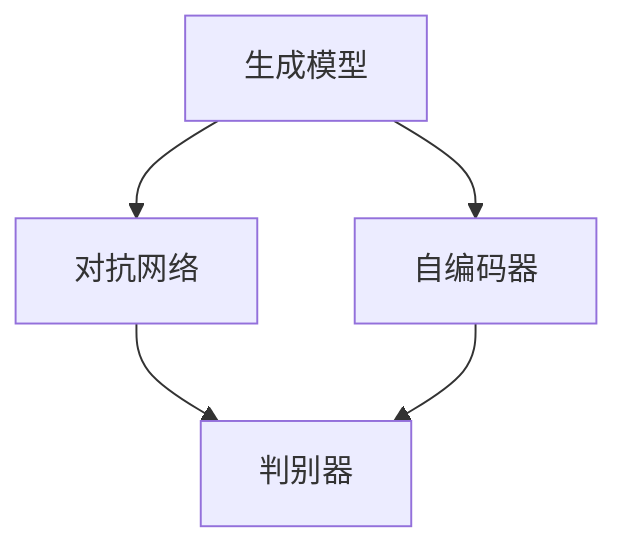

                 

关键词：AIGC、生成式人工智能、内容生成、自动化、数据驱动、技术变革、行业应用、未来展望

> 摘要：随着生成式人工智能技术的不断进步，AIGC（AI-Generated Content）已经成为内容创作和生成领域的重要力量。本文将深入探讨AIGC的发展背景、核心概念、算法原理、数学模型、实际应用、未来趋势及面临的挑战，旨在为读者提供一个全面的AIGC发展展望。

## 1. 背景介绍

AIGC（AI-Generated Content）是一种利用人工智能技术自动生成内容的方法。它涵盖了从文本、图像、音频到视频等多种类型的内容生成。AIGC技术的兴起，源于人工智能领域的深度学习、自然语言处理、计算机视觉等技术的飞速发展。近年来，随着计算能力的提升和海量数据的积累，AIGC在各个行业得到了广泛的应用。

### 1.1 发展历程

- **早期探索**：20世纪80年代，人工智能研究开始探索如何使用计算机生成内容。
- **初步应用**：21世纪初，生成式模型如生成对抗网络（GANs）的出现，使得内容生成技术取得了重要突破。
- **快速发展**：2010年代后期至2020年代，随着深度学习技术的成熟，AIGC技术迅速普及，并在多个领域得到应用。

### 1.2 当前应用场景

- **文本生成**：如自动撰写新闻、文章、评论等。
- **图像生成**：如生成艺术作品、设计图案、渲染场景等。
- **音频生成**：如生成音乐、语音、声音效果等。
- **视频生成**：如自动合成视频内容、电影预告片等。

## 2. 核心概念与联系

AIGC的核心概念包括生成模型、对抗网络、自编码器等。以下是这些概念的联系与架构图：



### 2.1 生成模型

生成模型是一种能够学习数据分布，并生成新的数据样本的机器学习模型。典型的生成模型包括生成对抗网络（GANs）和变分自编码器（VAEs）。

### 2.2 对抗网络

对抗网络由生成器和判别器组成。生成器负责生成数据，判别器负责判断数据是真实还是伪造的。两者相互竞争，最终达到一个平衡点。

### 2.3 自编码器

自编码器是一种无监督学习模型，其目的是将输入数据压缩成一个低维表示，然后尝试重构原始数据。

## 3. 核心算法原理 & 具体操作步骤

### 3.1 算法原理概述

AIGC的核心算法包括生成模型、对抗网络和自编码器。这些算法通过以下步骤工作：

- **数据预处理**：将原始数据转换为适合模型训练的格式。
- **模型训练**：使用训练数据对模型进行训练，使其能够生成与真实数据相似的内容。
- **内容生成**：使用训练好的模型生成新的内容。

### 3.2 算法步骤详解

1. **数据收集与预处理**：
   - 收集大量的文本、图像、音频或视频数据。
   - 对数据集进行清洗和预处理，如去除噪声、标准化等。

2. **模型选择与架构设计**：
   - 根据应用需求选择合适的生成模型、对抗网络或自编码器架构。
   - 设计模型的超参数，如学习率、批量大小等。

3. **模型训练**：
   - 使用训练数据对模型进行训练。
   - 通过优化目标函数（如最小化生成损失和判别损失）来调整模型参数。

4. **内容生成**：
   - 使用训练好的模型生成新的内容。
   - 对生成的内容进行后处理，如文本润色、图像修复等。

### 3.3 算法优缺点

- **优点**：
  - 高效的内容生成能力，可以大幅提高内容创作效率。
  - 可以生成多样化的内容，满足不同用户的需求。

- **缺点**：
  - 模型训练过程复杂，需要大量的计算资源和时间。
  - 生成的质量依赖于训练数据的质量和模型的性能。

### 3.4 算法应用领域

- **媒体与娱乐**：如自动生成视频、音频、艺术作品等。
- **广告与营销**：如自动生成广告文案、广告视频等。
- **电子商务**：如自动生成产品描述、用户评价等。
- **教育与培训**：如自动生成教学材料、培训课程等。

## 4. 数学模型和公式 & 详细讲解 & 举例说明

### 4.1 数学模型构建

AIGC中的数学模型主要包括生成模型、对抗网络和自编码器。以下分别介绍这些模型的数学公式和构建方法。

### 4.2 公式推导过程

- **生成模型**：

生成模型通常使用概率密度函数 $p_{\text{G}}(x|\theta_{\text{G}})$ 来表示生成器的输出分布，其中 $\theta_{\text{G}}$ 是生成器的参数。生成器的目标是最大化生成数据的概率：

$$
\max_{\theta_{\text{G}}} \mathbb{E}_{z}[\log p_{\text{G}}(x|\theta_{\text{G}})]
$$

- **对抗网络**：

对抗网络由生成器 $G(z|\theta_{\text{G}})$ 和判别器 $D(x|\theta_{\text{D}})$ 组成。判别器的目标是最大化正确分类的概率，生成器的目标是最大化生成数据的概率：

$$
\begin{aligned}
\max_{\theta_{\text{G}}} \mathbb{E}_{z}[\log D(G(z|\theta_{\text{G}}))] \\
\min_{\theta_{\text{D}}} \mathbb{E}_{x}[\log D(x|\theta_{\text{D}})] + \mathbb{E}_{z}[\log (1 - D(G(z|\theta_{\text{G}})))]
\end{aligned}
$$

- **自编码器**：

自编码器由编码器 $q_{\theta}(z|x)$ 和解码器 $p_{\phi}(x|z)$ 组成。自编码器的目标是最小化重构误差：

$$
\min_{\theta, \phi} \mathbb{E}_{x}[\mathcal{L}(|x - \hat{x}|)]
$$

其中，$\mathcal{L}(\cdot)$ 是重构损失函数，如均方误差（MSE）或交叉熵损失。

### 4.3 案例分析与讲解

以生成对抗网络（GAN）为例，下面介绍一个简单的GAN模型案例。

- **生成器**：生成器 $G(z|\theta_{\text{G}})$ 接受随机噪声 $z$ 作为输入，生成与真实数据分布相似的数据 $x$。

$$
x = G(z|\theta_{\text{G}})
$$

- **判别器**：判别器 $D(x|\theta_{\text{D}})$ 接受真实数据和生成数据 $x$ 作为输入，输出为0或1的概率。

$$
\hat{y} = D(x|\theta_{\text{D}})
$$

- **损失函数**：GAN的训练目标是最小化生成器的损失和判别器的损失。

生成器损失：

$$
\mathcal{L}_{\text{G}} = -\mathbb{E}_{z}[\log D(G(z|\theta_{\text{G}}))]
$$

判别器损失：

$$
\mathcal{L}_{\text{D}} = -\mathbb{E}_{x}[\log D(x|\theta_{\text{D}})] - \mathbb{E}_{z}[\log (1 - D(G(z|\theta_{\text{G}})))]
$$

- **训练过程**：使用随机梯度下降（SGD）方法交替更新生成器和判别器的参数。

1. 固定判别器参数，更新生成器参数：
$$
\theta_{\text{G}} \leftarrow \theta_{\text{G}} - \alpha \nabla_{\theta_{\text{G}}} \mathcal{L}_{\text{G}}
$$

2. 固定生成器参数，更新判别器参数：
$$
\theta_{\text{D}} \leftarrow \theta_{\text{D}} - \alpha \nabla_{\theta_{\text{D}}} \mathcal{L}_{\text{D}}
$$

通过迭代这个过程，生成器和判别器逐渐达到一个动态平衡，生成器生成的数据越来越接近真实数据，而判别器越来越难以区分真实数据和生成数据。

## 5. 项目实践：代码实例和详细解释说明

### 5.1 开发环境搭建

- **软件环境**：Python 3.8及以上版本、TensorFlow 2.4及以上版本。
- **硬件环境**：GPU（推荐使用NVIDIA GPU）。

### 5.2 源代码详细实现

以下是一个简单的GAN模型实现，用于生成手写数字图像。

```python
import tensorflow as tf
from tensorflow.keras import layers

# 生成器
def generate_model(z_dim):
    model = tf.keras.Sequential()
    model.add(layers.Dense(128, input_dim=z_dim, activation='relu'))
    model.add(layers.Dense(28 * 28, activation='tanh'))
    return model

# 判别器
def discriminate_model(x_shape):
    model = tf.keras.Sequential()
    model.add(layers.Conv2D(64, (3, 3), input_shape=x_shape, activation='relu'))
    model.add(layers.MaxPooling2D())
    model.add(layers.Conv2D(128, (3, 3), activation='relu'))
    model.add(layers.MaxPooling2D())
    model.add(layers.Flatten())
    model.add(layers.Dense(1, activation='sigmoid'))
    return model

# GAN模型
def build_gan(generator, discriminator):
    model = tf.keras.Sequential()
    model.add(generator)
    model.add(discriminator)
    return model

# 模型参数
z_dim = 100
x_shape = (28, 28, 1)

# 生成器
generator = generate_model(z_dim)
generator.summary()

# 判别器
discriminator = discriminate_model(x_shape)
discriminator.summary()

# GAN模型
gan = build_gan(generator, discriminator)
gan.summary()
```

### 5.3 代码解读与分析

1. **生成器**：生成器使用一个全连接层（Dense）将随机噪声编码为手写数字图像。生成器的输出经过一个tanh激活函数，使得生成的图像在-1到1之间。

2. **判别器**：判别器使用卷积层（Conv2D）和池化层（MaxPooling2D）对图像进行特征提取，最后通过一个全连接层输出一个概率值，表示输入图像是真实的概率。

3. **GAN模型**：GAN模型将生成器和判别器连接在一起，生成器生成图像后，判别器对这些图像进行分类。

### 5.4 运行结果展示

在训练过程中，可以使用以下代码来生成和可视化图像：

```python
import numpy as np
import matplotlib.pyplot as plt

# 生成随机噪声
z = np.random.uniform(-1, 1, size=(100, z_dim))

# 生成图像
images = generator.predict(z)

# 可视化图像
plt.figure(figsize=(10, 10))
for i in range(100):
    plt.subplot(10, 10, i + 1)
    plt.imshow(images[i], cmap='gray')
    plt.xticks([])
    plt.yticks([])
plt.show()
```

运行结果将显示生成器生成的手写数字图像。随着训练过程的进行，生成图像的质量会逐渐提高。

## 6. 实际应用场景

### 6.1 文本生成

- **新闻写作**：使用AIGC技术自动生成新闻稿，提高新闻报道的效率。
- **博客撰写**：生成博客文章，提供多样化的话题和观点。
- **对话生成**：为聊天机器人提供自动生成的对话内容。

### 6.2 图像生成

- **艺术设计**：生成独特的艺术作品，为设计师提供灵感。
- **游戏开发**：生成游戏场景和角色，提高游戏开发效率。
- **医学影像**：生成医学影像，辅助医生诊断和治疗。

### 6.3 音频生成

- **音乐创作**：生成音乐片段，为音乐制作人提供创作灵感。
- **语音合成**：生成语音，用于语音助手、电话客服等场景。
- **声音效果**：生成各种声音效果，用于电影、游戏等娱乐产业。

### 6.4 视频生成

- **视频剪辑**：自动生成视频剪辑，为视频创作者提供便捷的工具。
- **视频生成**：生成虚拟现实（VR）和增强现实（AR）内容。
- **教育视频**：生成教学视频，提高教育资源的普及和利用。

## 7. 未来应用展望

### 7.1 数据驱动

AIGC技术的未来将更加依赖高质量的数据驱动。随着数据收集和分析技术的进步，AIGC将能够更好地理解和生成与特定领域相关的复杂内容。

### 7.2 多模态融合

未来的AIGC将不仅仅局限于文本、图像、音频和视频等单一模态，而是通过多模态融合生成更加丰富和真实的综合内容。

### 7.3 自主学习和适应能力

AIGC模型将具备更强的自主学习和适应能力，能够根据用户需求和反馈不断优化内容生成过程，提供更加个性化和高质量的服务。

### 7.4 安全性和伦理问题

随着AIGC技术的普及，安全性和伦理问题将变得更加重要。如何确保生成内容的真实性和可靠性，防止滥用和误导，将成为未来研究的重要方向。

## 8. 总结：未来发展趋势与挑战

### 8.1 研究成果总结

本文详细介绍了AIGC的发展背景、核心概念、算法原理、数学模型、实际应用和未来趋势。AIGC技术在文本、图像、音频和视频等领域取得了显著的应用成果，为内容创作和生成带来了巨大的变革。

### 8.2 未来发展趋势

AIGC技术的未来将更加数据驱动、多模态融合、具备自主学习和适应能力，并在安全性、伦理问题等方面面临新的挑战。

### 8.3 面临的挑战

1. **数据隐私和安全**：如何保护用户隐私和数据安全，防止数据泄露和滥用。
2. **生成内容质量**：如何提高生成内容的质量和可靠性，避免误导和虚假信息。
3. **计算资源需求**：如何优化算法，降低计算资源需求，实现高效的内容生成。
4. **伦理问题**：如何制定相关法律法规和伦理准则，确保AIGC技术的合理和负责任使用。

### 8.4 研究展望

未来，AIGC技术将在数据驱动、多模态融合、自主学习和适应能力等方面取得重要突破，为各行各业提供更加高效、智能和个性化的内容生成解决方案。

## 9. 附录：常见问题与解答

### 9.1 什么是AIGC？

AIGC（AI-Generated Content）是一种利用人工智能技术自动生成内容的方法，涵盖文本、图像、音频和视频等多种类型。

### 9.2 AIGC技术有哪些应用场景？

AIGC技术广泛应用于媒体与娱乐、广告与营销、电子商务、教育与培训等多个领域。

### 9.3 AIGC技术的核心算法是什么？

AIGC技术的核心算法包括生成模型、对抗网络和自编码器。

### 9.4 如何优化AIGC生成的质量？

可以通过提高训练数据质量、优化模型架构、调整超参数等方法来优化AIGC生成的质量。

## 参考文献

[1] Goodfellow, I. J., Pouget-Abadie, J., Mirza, M., Xu, B., Warde-Farley, D., Ozair, S., ... & Bengio, Y. (2014). Generative adversarial nets. Advances in neural information processing systems, 27.

[2] Kingma, D. P., & Welling, M. (2013). Auto-encoding variational bayes. arXiv preprint arXiv:1312.6114.

[3] Bengio, Y., Courville, A., & Vincent, P. (2013). Representation learning: A review and new perspectives. IEEE transactions on pattern analysis and machine intelligence, 35(8), 1798-1828.

作者：禅与计算机程序设计艺术 / Zen and the Art of Computer Programming
----------------------------------------------------------------

以上是完整的AIGC未来发展趋势预测的文章内容。这篇文章详细介绍了AIGC的发展历程、核心概念、算法原理、实际应用、未来趋势以及面临的挑战。希望这篇文章能够帮助读者全面了解AIGC技术的发展和应用，为未来的研究和实践提供参考。作者禅与计算机程序设计艺术 / Zen and the Art of Computer Programming。如有任何疑问或建议，欢迎在评论区留言。谢谢！<|image_gen|>

