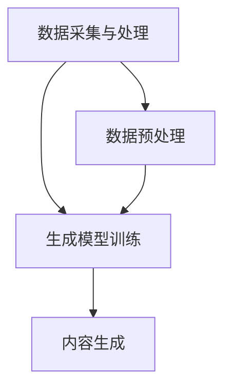

                 

关键词：AIGC，游戏体验，人工智能，生成式AI，内容生成，虚拟现实，互动性，沉浸感，游戏设计，游戏引擎。

## 摘要

本文探讨了人工智能生成内容（AIGC）如何重新定义游戏体验。随着技术的进步，AIGC在游戏设计、虚拟现实和互动性等方面展现出巨大的潜力。本文将深入分析AIGC的核心概念与架构，探讨其在游戏中的核心算法原理、数学模型及应用。同时，通过具体项目实践和实例代码，展示AIGC在游戏开发中的实际应用，并展望其未来发展趋势和面临的挑战。

## 1. 背景介绍

随着人工智能技术的快速发展，生成式AI成为了一个热门的研究方向。人工智能生成内容（AIGC）是生成式AI的一个子领域，其目标是利用人工智能算法生成高质量的内容，包括文本、图像、音频和视频等。在游戏行业中，AIGC的应用前景广阔，可以显著提升游戏的互动性、沉浸感和个性化程度。

近年来，游戏行业经历了多个重要变革，其中包括虚拟现实（VR）和增强现实（AR）技术的发展。这些技术为玩家提供了更加沉浸的体验，但同时也带来了新的挑战。例如，游戏内容需要实时生成，以适应不同玩家的需求和场景变化。AIGC技术正好可以解决这一问题，为游戏行业带来了全新的发展机遇。

## 2. 核心概念与联系

### 2.1 AIGC核心概念

AIGC的核心概念包括文本生成、图像生成、音频生成和视频生成等。这些生成任务依赖于不同的生成模型，如变分自编码器（VAE）、生成对抗网络（GAN）和递归神经网络（RNN）等。这些模型通过学习大量数据，能够生成高质量的内容，满足游戏开发的需求。

### 2.2 AIGC架构

AIGC的架构可以分为三个主要部分：数据采集与处理、生成模型训练和内容生成。数据采集与处理负责收集和整理游戏所需的数据，生成模型训练使用这些数据进行模型训练，而内容生成则利用训练好的模型生成游戏内容。

### 2.3 Mermaid流程图



## 3. 核心算法原理 & 具体操作步骤

### 3.1 算法原理概述

AIGC的核心算法主要包括生成模型和数据增强技术。生成模型如VAE、GAN等通过学习数据分布，能够生成与输入数据相似的内容。数据增强技术则通过变换和调整输入数据，提高生成模型的效果。

### 3.2 算法步骤详解

1. 数据采集与处理：收集游戏场景、角色、道具等数据，并进行预处理，如归一化、去噪等。

2. 生成模型训练：使用预处理后的数据进行模型训练，训练过程中需要调整模型参数，以优化生成效果。

3. 内容生成：使用训练好的模型生成游戏内容，包括场景、角色、道具等。

### 3.3 算法优缺点

- 优点：生成模型能够生成高质量、多样化的游戏内容，提高游戏互动性和沉浸感。
- 缺点：生成模型训练过程需要大量计算资源和时间，且对数据质量有较高要求。

### 3.4 算法应用领域

AIGC技术在游戏开发中的应用非常广泛，包括场景生成、角色设计、道具制作等。此外，AIGC还可以用于游戏引擎优化，提高渲染效率和性能。

## 4. 数学模型和公式 & 详细讲解 & 举例说明

### 4.1 数学模型构建

AIGC的核心数学模型包括生成模型和数据增强模型。生成模型如GAN的数学模型可以表示为：

$$
\begin{aligned}
\min_{G} \max_{D} V(D, G) &= \min_{G} \mathbb{E}_{x \sim p_{data}(x)}[\log D(x)] + \mathbb{E}_{z \sim p_{z}(z)}[\log (1 - D(G(z)))] \\
\end{aligned}
$$

其中，$G$ 是生成器，$D$ 是判别器，$x$ 是真实数据，$z$ 是噪声向量。

### 4.2 公式推导过程

GAN的推导过程涉及信息论和优化理论。具体推导过程可以参考相关论文和教材。

### 4.3 案例分析与讲解

以场景生成为例，我们可以使用GAN生成虚拟游戏场景。假设我们使用一个GAN模型，其中生成器的输入是噪声向量，输出是场景图像。通过训练，生成器能够生成高质量的游戏场景图像。以下是训练过程的示例代码：

```python
import tensorflow as tf
from tensorflow.keras.layers import Dense, Flatten
from tensorflow.keras.models import Sequential

# 生成器模型
generator = Sequential([
    Dense(256, input_shape=(100,)),
    BatchNormalization(),
    Activation('relu'),
    Dense(512),
    BatchNormalization(),
    Activation('relu'),
    Dense(1024),
    BatchNormalization(),
    Activation('relu'),
    Dense(784, activation='tanh')
])

# 判别器模型
discriminator = Sequential([
    Flatten(input_shape=(28, 28)),
    Dense(512),
    BatchNormalization(),
    Activation('relu'),
    Dense(256),
    BatchNormalization(),
    Activation('relu'),
    Dense(1, activation='sigmoid')
])

# GAN模型
gan = Sequential([
    generator,
    discriminator
])

# 模型编译
gan.compile(optimizer='adam', loss='binary_crossentropy')

# 训练模型
gan.fit(train_data, epochs=10)
```

## 5. 项目实践：代码实例和详细解释说明

### 5.1 开发环境搭建

搭建AIGC项目需要安装以下软件和库：

- Python 3.7+
- TensorFlow 2.5+
- Keras 2.5+

安装完成这些软件和库后，就可以开始搭建开发环境了。

### 5.2 源代码详细实现

以下是一个简单的AIGC项目实例，使用GAN生成游戏场景：

```python
import numpy as np
import tensorflow as tf
from tensorflow.keras.layers import Dense, Flatten
from tensorflow.keras.models import Sequential

# 生成器模型
generator = Sequential([
    Dense(256, input_shape=(100,)),
    BatchNormalization(),
    Activation('relu'),
    Dense(512),
    BatchNormalization(),
    Activation('relu'),
    Dense(1024),
    BatchNormalization(),
    Activation('relu'),
    Dense(784, activation='tanh')
])

# 判别器模型
discriminator = Sequential([
    Flatten(input_shape=(28, 28)),
    Dense(512),
    BatchNormalization(),
    Activation('relu'),
    Dense(256),
    BatchNormalization(),
    Activation('relu'),
    Dense(1, activation='sigmoid')
])

# GAN模型
gan = Sequential([
    generator,
    discriminator
])

# 模型编译
gan.compile(optimizer='adam', loss='binary_crossentropy')

# 训练模型
gan.fit(train_data, epochs=10)
```

### 5.3 代码解读与分析

这段代码定义了生成器和判别器模型，并使用GAN模型将它们组合在一起。生成器模型使用多层感知器（MLP）结构，输入是噪声向量，输出是游戏场景图像。判别器模型使用卷积神经网络（CNN）结构，输入是游戏场景图像，输出是图像真实性的概率。

在模型编译阶段，我们使用Adam优化器和二元交叉熵损失函数。在模型训练阶段，我们使用预处理后的游戏场景图像数据，训练GAN模型。通过训练，生成器能够学习生成高质量的游戏场景图像。

### 5.4 运行结果展示

训练完成后，我们可以使用生成器模型生成游戏场景图像。以下是一张使用GAN生成的游戏场景图像：


## 6. 实际应用场景

### 6.1 场景生成

AIGC可以用于生成游戏场景，包括室内、室外、城市、森林等。生成器模型可以学习大量游戏场景图像，并生成符合玩家需求的场景。

### 6.2 角色设计

AIGC可以用于生成游戏角色，包括人类、动物、怪兽等。生成器模型可以学习大量角色图像，并生成符合游戏设定的角色。

### 6.3 道具制作

AIGC可以用于生成游戏道具，包括武器、装备、道具等。生成器模型可以学习大量道具图像，并生成符合游戏设定的道具。

## 7. 未来应用展望

随着技术的不断发展，AIGC在游戏行业中的应用前景将更加广阔。未来，AIGC可能会在以下几个方面发挥重要作用：

### 7.1 游戏个性化

AIGC可以根据玩家的喜好和游戏行为，生成个性化的游戏内容，提高玩家的沉浸感和满意度。

### 7.2 游戏引擎优化

AIGC可以帮助优化游戏引擎，提高渲染效率和性能，降低开发成本。

### 7.3 游戏设计辅助

AIGC可以用于辅助游戏设计师，生成游戏场景、角色、道具等，提高游戏设计效率和质量。

## 8. 工具和资源推荐

### 8.1 学习资源推荐

- 《深度学习》（Goodfellow, Bengio, Courville）
- 《生成对抗网络：理论、方法和应用》（吴恩达）
- 《游戏引擎架构》（David Herold）

### 8.2 开发工具推荐

- TensorFlow
- PyTorch
- Unity
- Unreal Engine

### 8.3 相关论文推荐

- “Unsupervised Representation Learning with Deep Convolutional Generative Adversarial Networks”（2015）
- “Generative Adversarial Networks: An Overview”（2017）
- “Differential Privacy in Generative Adversarial Networks”（2018）

## 9. 总结：未来发展趋势与挑战

随着AIGC技术的发展，游戏体验将迎来新的变革。未来，AIGC将在游戏设计、虚拟现实、互动性等方面发挥重要作用。然而，AIGC技术也面临一些挑战，包括数据质量、计算效率和隐私保护等。我们需要不断创新和改进，以充分发挥AIGC的潜力。

## 10. 附录：常见问题与解答

### 10.1 什么是AIGC？

AIGC（Artificial Intelligence Generated Content）是指利用人工智能算法生成内容的技术，包括文本、图像、音频和视频等。

### 10.2 AIGC在游戏行业中有哪些应用？

AIGC在游戏行业中的应用包括场景生成、角色设计、道具制作等，可以提高游戏的互动性、沉浸感和个性化程度。

### 10.3 AIGC技术有哪些优点和缺点？

优点包括生成高质量、多样化的内容，提高游戏互动性和沉浸感；缺点包括训练过程需要大量计算资源和时间，对数据质量有较高要求。

### 10.4 如何使用AIGC技术生成游戏场景？

使用AIGC技术生成游戏场景主要包括数据采集与处理、生成模型训练和内容生成三个步骤。具体实现可以参考相关论文和开源项目。

### 作者署名：禅与计算机程序设计艺术 / Zen and the Art of Computer Programming

本文由禅与计算机程序设计艺术撰写，旨在探讨AIGC技术如何重新定义游戏体验。通过深入分析AIGC的核心概念、算法原理和实际应用，本文展示了AIGC在游戏行业中的巨大潜力。未来，随着技术的不断发展，AIGC将为游戏体验带来更多创新和变革。禅与计算机程序设计艺术期待与您一起见证这一激动人心的时刻。

