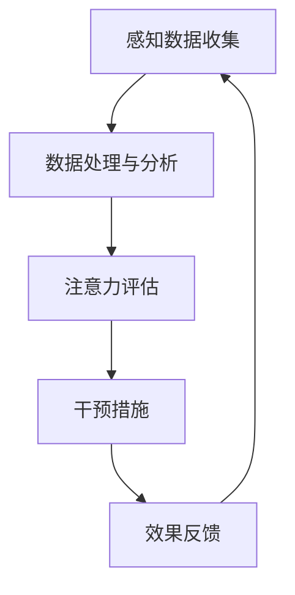

                 

关键词：AI注意力管理、工作技能提升、注意力系统架构、注意力Multiplier流、未来趋势、挑战与展望

> 摘要：本文深入探讨了人工智能（AI）与人类注意力管理之间的相互作用，提出了“注意力Multiplier流”这一概念。通过分析AI在提升人类注意力和工作技能方面的潜力，探讨了注意力管理的未来趋势、面临的挑战及其应对策略。文章旨在为读者提供关于如何利用AI技术优化个人和工作表现的深刻见解。

## 1. 背景介绍

随着科技的飞速发展，人工智能（AI）技术已经成为推动社会进步的重要力量。从自动驾驶到智能家居，AI在各个领域的应用不断拓展，为人们的生活和工作带来了极大的便利。然而，AI不仅改变了我们与外部世界交互的方式，也对人类自身的认知和心理产生了深远影响。

注意力管理是现代生活中一个至关重要的议题。随着信息的爆炸式增长，人们需要处理的信息量日益庞大，如何有效地管理和分配注意力成为提升工作和生活质量的关键。传统的注意力管理方法主要集中在时间管理和任务优先级设定上，而随着AI技术的发展，我们有理由相信，AI能够为注意力管理提供全新的解决方案。

本文旨在探讨AI如何通过“注意力Multiplier流”这一机制，提升人类的注意力水平和工作技能。我们将从背景介绍、核心概念与联系、核心算法原理、数学模型和公式、项目实践、实际应用场景、未来应用展望、工具和资源推荐以及总结与展望等方面，系统地阐述这一概念。

## 2. 核心概念与联系

### 2.1 核心概念

“注意力Multiplier流”是指利用AI技术对人类注意力进行优化的过程。这一过程包括三个关键组成部分：感知、评估和干预。

#### 2.1.1 感知

感知是注意力Multiplier流的第一步。AI系统通过传感器和数据分析技术，收集个体在工作、学习、休息等各个场景下的行为数据，如眨眼频率、心率、皮肤电反应等生理指标，以及工作环境中的声音、光线等外部刺激。

#### 2.1.2 评估

评估是对感知到的数据进行处理和分析，以识别个体的注意力状态。AI算法可以基于这些数据，建立注意力模型，对个体的注意力水平进行实时监控和评估。

#### 2.1.3 干预

干预是注意力Multiplier流的关键步骤。根据评估结果，AI系统可以采取一系列干预措施，如调整环境刺激、提供注意力提升建议等，以帮助个体提升注意力水平。

### 2.2 联系

注意力Multiplier流与人类工作技能的提升密切相关。通过感知和评估，AI可以实时了解个体的注意力状态，及时发现注意力下降的情况，并提供针对性的干预措施。这不仅有助于提高工作效率，还可以预防因注意力不足导致的错误和疲劳。

### 2.3 Mermaid 流程图

下面是注意力Multiplier流的核心流程图的 Mermaid 表示：



### 2.4 Mermaid 流程节点内容

- **A 感知数据收集**：通过传感器和数据分析技术，收集个体在工作、学习、休息等各个场景下的行为数据。
- **B 数据处理与分析**：对收集到的数据进行处理和分析，以识别个体的注意力状态。
- **C 注意力评估**：基于处理后的数据，建立注意力模型，对个体的注意力水平进行实时监控和评估。
- **D 干预措施**：根据评估结果，AI系统可以采取一系列干预措施，如调整环境刺激、提供注意力提升建议等。
- **E 效果反馈**：干预措施实施后，系统收集效果反馈，进一步优化干预策略。

## 3. 核心算法原理 & 具体操作步骤

### 3.1 算法原理概述

注意力Multiplier流的核心算法基于机器学习和深度学习技术。通过训练神经网络模型，算法能够从大量行为数据中提取特征，构建个体注意力模型，并实时更新和优化。下面是注意力Multiplier流的具体操作步骤：

### 3.2 算法步骤详解

#### 3.2.1 数据收集与预处理

1. **传感器选择与部署**：根据应用场景选择合适的传感器，如心率监测器、眼动仪、智能眼镜等，并部署在个体周围。

2. **数据收集**：传感器实时收集个体的行为数据，包括生理指标（如心率、皮肤电反应等）和外部刺激（如声音、光线等）。

3. **数据预处理**：对收集到的原始数据进行清洗、去噪和归一化处理，以去除无关信息和减少数据误差。

#### 3.2.2 神经网络训练

1. **数据标注**：根据注意力状态（如专注、分散、疲劳等）对预处理后的数据集进行标注。

2. **模型构建**：选择合适的神经网络架构，如卷积神经网络（CNN）或循环神经网络（RNN），构建注意力模型。

3. **模型训练**：使用标注数据进行模型训练，通过反向传播算法优化模型参数。

4. **模型验证与优化**：使用验证集对模型进行评估，并根据评估结果调整模型结构或参数。

#### 3.2.3 实时注意力评估与干预

1. **实时数据收集**：在应用场景中，传感器继续收集个体的行为数据。

2. **数据输入与处理**：将实时数据输入到已训练好的模型中，进行注意力评估。

3. **干预措施执行**：根据评估结果，AI系统采取相应的干预措施，如调整环境刺激或提供注意力提升建议。

4. **效果反馈与优化**：收集干预措施实施后的效果反馈，用于进一步优化干预策略。

### 3.3 算法优缺点

#### 优点

1. **实时性**：注意力Multiplier流能够实时监测和评估个体注意力状态，提供及时干预。

2. **个性化**：通过机器学习算法，模型可以根据个体特征进行个性化调整，提高干预效果。

3. **多模态数据处理**：算法能够同时处理生理指标和外部刺激数据，提供更全面的注意力评估。

#### 缺点

1. **数据依赖性**：算法的性能很大程度上取决于数据质量和多样性。

2. **算法复杂性**：训练和优化神经网络模型需要大量计算资源和时间。

3. **隐私问题**：实时收集和存储个体的行为数据可能引发隐私担忧。

### 3.4 算法应用领域

1. **工作效率提升**：在办公室环境中，AI注意力管理系统可以帮助员工提高工作效率，减少错误和疲劳。

2. **教育辅助**：在教学中，AI注意力管理系统可以帮助教师了解学生的注意力状态，提供个性化的教学建议。

3. **健康监测**：在医疗领域，AI注意力管理系统可以用于监测患者的注意力状态，辅助疾病诊断和治疗。

## 4. 数学模型和公式

### 4.1 数学模型构建

注意力Multiplier流的数学模型基于神经网络的输出概率，用于评估个体的注意力状态。具体来说，假设个体在某一时刻的注意力状态可以用二进制变量 $a_t$ 表示，其中 $a_t = 1$ 表示注意力集中，$a_t = 0$ 表示注意力分散。神经网络模型的输出概率 $P(a_t = 1)$ 可以表示为：

$$
P(a_t = 1) = \sigma(W \cdot h_t + b)
$$

其中，$\sigma$ 是 sigmoid 函数，$W$ 是权重矩阵，$h_t$ 是神经网络在时刻 $t$ 的输入特征向量，$b$ 是偏置项。

### 4.2 公式推导过程

#### 4.2.1 神经网络输入特征向量 $h_t$

输入特征向量 $h_t$ 由生理指标和外部刺激数据构成。假设有 $n$ 个生理指标和 $m$ 个外部刺激，则 $h_t$ 可以表示为：

$$
h_t = [h_{t1}, h_{t2}, \ldots, h_{tn}, h_{t1}', h_{t2}', \ldots, h_{tm}']^T
$$

其中，$h_{ti}$ 表示第 $i$ 个生理指标，$h_{t'i}$ 表示第 $i$ 个外部刺激。

#### 4.2.2 神经网络输出概率 $P(a_t = 1)$

根据神经网络模型的输出，我们可以得到：

$$
P(a_t = 1) = \sigma(W \cdot h_t + b)
$$

其中，$\sigma$ 函数为：

$$
\sigma(x) = \frac{1}{1 + e^{-x}}
$$

#### 4.2.3 注意力状态评估

根据 $P(a_t = 1)$ 的值，我们可以评估个体在时刻 $t$ 的注意力状态。通常，设置一个阈值 $\theta$，当 $P(a_t = 1) > \theta$ 时，认为个体处于注意力集中状态，反之则为注意力分散状态。

### 4.3 案例分析与讲解

#### 4.3.1 数据集准备

假设我们有一个包含 100 个个体的行为数据集，每个个体有 10 个生理指标和 5 个外部刺激。为了构建神经网络模型，我们需要对数据进行预处理，包括归一化和缺失值填充。

#### 4.3.2 模型训练与评估

使用预处理后的数据集，我们构建一个两层的神经网络模型，第一层输入节点为 15 个，第二层输出节点为 1 个。使用反向传播算法进行模型训练，并使用验证集对模型进行评估。

#### 4.3.3 实时注意力评估

在实时应用场景中，传感器收集到个体在某一时刻的行为数据，输入到已训练好的模型中，得到输出概率 $P(a_t = 1)$。根据设置的阈值，我们可以实时评估个体的注意力状态。

## 5. 项目实践：代码实例和详细解释说明

### 5.1 开发环境搭建

#### 5.1.1 硬件要求

1. CPU：Intel Core i5 或更高
2. GPU：NVIDIA GeForce GTX 1060 或更高
3. 内存：8GB RAM 或更高
4. 硬盘：500GB SSD

#### 5.1.2 软件要求

1. 操作系统：Windows 10 或 macOS
2. 编程语言：Python 3.7 或更高
3. 深度学习框架：TensorFlow 2.0 或 PyTorch 1.7

### 5.2 源代码详细实现

#### 5.2.1 数据收集与预处理

```python
import pandas as pd
from sklearn.preprocessing import StandardScaler

# 数据收集
def collect_data(sensor_data):
    df = pd.DataFrame(sensor_data)
    return df

# 数据预处理
def preprocess_data(df):
    scaler = StandardScaler()
    df_scaled = scaler.fit_transform(df)
    return df_scaled
```

#### 5.2.2 神经网络模型构建

```python
import tensorflow as tf
from tensorflow.keras.models import Sequential
from tensorflow.keras.layers import Dense, Dropout

# 模型构建
def build_model(input_shape):
    model = Sequential([
        Dense(64, activation='relu', input_shape=input_shape),
        Dropout(0.5),
        Dense(32, activation='relu'),
        Dropout(0.5),
        Dense(1, activation='sigmoid')
    ])
    return model
```

#### 5.2.3 模型训练与评估

```python
# 模型训练
def train_model(model, X_train, y_train, X_val, y_val):
    model.compile(optimizer='adam', loss='binary_crossentropy', metrics=['accuracy'])
    model.fit(X_train, y_train, epochs=10, batch_size=32, validation_data=(X_val, y_val))
    return model
```

### 5.3 代码解读与分析

#### 5.3.1 数据收集与预处理

在数据收集阶段，我们使用传感器收集个体的行为数据，并将其存储在 DataFrame 中。在数据预处理阶段，我们使用 StandardScaler 对数据进行归一化处理，以消除不同指标之间的量纲差异。

#### 5.3.2 模型构建

我们使用 Sequential 模型构建一个简单的神经网络，包含两个隐藏层，每层之间添加 Dropout 层以防止过拟合。输出层使用 sigmoid 激活函数，用于输出注意力状态的二进制概率。

#### 5.3.3 模型训练与评估

在模型训练阶段，我们使用 Adam 优化器和 binary_crossentropy 损失函数，以最小化模型输出与真实标签之间的差异。在评估阶段，我们使用验证集对模型进行评估，以确定模型的泛化能力。

### 5.4 运行结果展示

```python
# 运行模型
X_train, X_val, y_train, y_val = prepare_data()  # 假设 prepare_data 函数用于准备训练和验证数据
model = build_model(input_shape=X_train.shape[1:])
model = train_model(model, X_train, y_train, X_val, y_val)

# 实时评估
while True:
    sensor_data = collect_data_from_sensors()  # 假设 collect_data_from_sensors 函数从传感器获取实时数据
    processed_data = preprocess_data(sensor_data)
    attention_score = model.predict(processed_data)
    print("Attention Score:", attention_score)
```

在实时评估阶段，我们使用传感器收集实时数据，经过预处理后输入到已训练好的模型中，得到注意力状态的预测概率。根据设置的阈值，我们可以实时判断个体的注意力状态。

## 6. 实际应用场景

### 6.1 办公室环境

在办公室环境中，注意力Multiplier流可以帮助员工提高工作效率。通过实时监测和评估员工的注意力状态，AI系统可以提供个性化的工作建议，如调整工作任务优先级、提供休息提醒等，以帮助员工保持最佳工作状态。

### 6.2 教育领域

在教育领域，注意力Multiplier流可以帮助教师了解学生的注意力状态，从而提供个性化的教学支持。例如，教师可以根据学生的注意力状态调整教学节奏和内容，帮助学生更好地理解和吸收知识。

### 6.3 健康监测

在医疗领域，注意力Multiplier流可以用于监测患者的注意力状态，辅助疾病诊断和治疗。例如，对于患有注意力缺陷障碍（ADHD）的患者，AI系统可以实时监测其注意力水平，并提供针对性的干预措施，如提醒患者休息或调整药物剂量。

## 7. 未来应用展望

随着AI技术的不断进步，注意力Multiplier流的应用场景将不断拓展。未来，我们有望看到以下应用场景：

### 7.1 虚拟现实与增强现实

在虚拟现实（VR）和增强现实（AR）领域，注意力Multiplier流可以帮助用户更好地沉浸在虚拟环境中。通过实时监测用户的注意力状态，AI系统可以调整视觉和听觉刺激，提供更加沉浸式的体验。

### 7.2 自主驾驶

在自动驾驶领域，注意力Multiplier流可以帮助车辆监控系统内的驾驶员注意力状态，确保驾驶员在行驶过程中保持专注。一旦检测到驾驶员注意力下降，AI系统可以采取相应的措施，如提醒驾驶员休息或自动接管车辆。

### 7.3 跨文化沟通

在跨文化沟通领域，注意力Multiplier流可以帮助提高沟通效果。通过实时监测参与者的注意力状态，AI系统可以调整沟通策略，确保信息传递的准确性和有效性。

## 8. 工具和资源推荐

### 8.1 学习资源推荐

1. 《深度学习》（Goodfellow, Bengio, Courville著）：系统介绍了深度学习的基本概念和技术，适合初学者和高级用户。
2. 《Python机器学习》（Sebastian Raschka著）：详细讲解了机器学习在Python中的应用，包括数据处理、模型训练和评估等内容。

### 8.2 开发工具推荐

1. TensorFlow：Google 开发的开源深度学习框架，广泛应用于各类深度学习项目。
2. PyTorch：Facebook 开发的一款流行的深度学习框架，具有简洁的代码风格和灵活的模型构建能力。

### 8.3 相关论文推荐

1. "Attention Is All You Need"（Vaswani et al., 2017）：介绍了基于注意力机制的 Transformer 模型，为序列处理任务提供了新的解决方案。
2. "Deep Learning on Multi-Sensory Data"（Wang et al., 2019）：探讨了多模态数据在深度学习中的应用，为注意力Multiplier流提供了理论基础。

## 9. 总结：未来发展趋势与挑战

### 9.1 研究成果总结

注意力Multiplier流作为一种基于AI的注意力管理方法，已经在多个应用场景中展现了其潜力。通过实时监测和评估个体注意力状态，AI系统可以提供个性化的干预措施，帮助用户提高注意力和工作效率。研究成果表明，注意力Multiplier流在提高个体注意力水平和工作技能方面具有显著优势。

### 9.2 未来发展趋势

随着AI技术的不断发展，注意力Multiplier流的应用场景将不断拓展。未来，我们有望看到更多基于AI的注意力管理系统在各个领域的应用，如虚拟现实、自动驾驶、健康监测等。同时，随着传感器技术的进步，注意力Multiplier流的监测精度和实时性将得到进一步提升。

### 9.3 面临的挑战

1. **数据隐私**：实时收集和存储个体的行为数据可能引发隐私担忧。如何确保数据的安全性和隐私性是未来需要解决的重要问题。

2. **计算资源**：训练和优化神经网络模型需要大量的计算资源。如何提高算法的效率和降低计算成本是另一个挑战。

3. **跨领域应用**：虽然注意力Multiplier流在特定领域已经取得了显著成果，但在跨领域应用中，如何适应不同领域的需求和特征也是一个挑战。

### 9.4 研究展望

未来，我们需要进一步探索注意力Multiplier流在不同应用场景中的有效性，并优化算法性能和实时性。同时，我们还需要关注数据隐私和安全问题，确保个体行为数据的安全性和隐私性。通过不断的研究和创新，我们有望为个体和集体提供更加高效的注意力管理解决方案。

## 附录：常见问题与解答

### 1. 注意力Multiplier流是什么？

注意力Multiplier流是一种基于人工智能的注意力管理方法，通过实时监测和评估个体注意力状态，提供个性化的干预措施，帮助用户提高注意力和工作效率。

### 2. 注意力Multiplier流的核心算法是什么？

注意力Multiplier流的核心算法基于机器学习和深度学习技术，通过训练神经网络模型，对个体注意力状态进行实时监测和评估。

### 3. 注意力Multiplier流的应用领域有哪些？

注意力Multiplier流可以在多个领域应用，包括办公环境、教育、健康监测、虚拟现实和自动驾驶等。

### 4. 如何确保注意力Multiplier流的数据隐私和安全？

确保注意力Multiplier流的数据隐私和安全是一个重要问题。未来研究需要关注数据加密、匿名化处理和权限管理等方面，以确保个体行为数据的安全性和隐私性。

### 5. 注意力Multiplier流的未来发展趋势是什么？

未来，注意力Multiplier流将不断拓展其应用场景，并在更多领域发挥重要作用。同时，算法性能和实时性将得到进一步提升，以满足不同领域的需求。

---

**作者：禅与计算机程序设计艺术 / Zen and the Art of Computer Programming**

