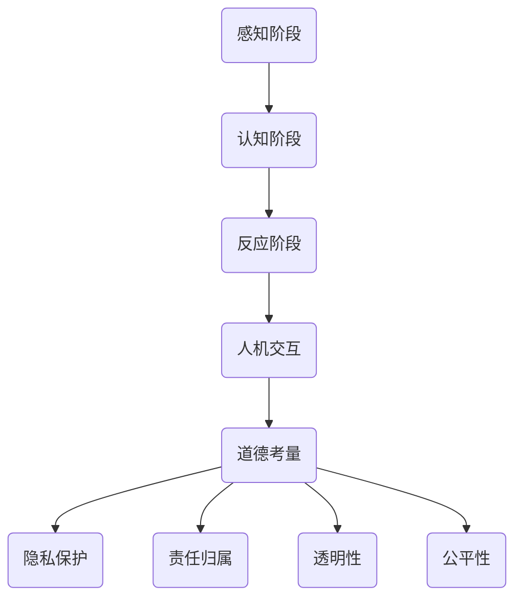

                 

关键词：人工智能，注意力流，人机融合，道德考量，技术进步

> 摘要：本文探讨了人工智能与人类注意力流的相互作用及其在构建人机融合伦理框架中的重要性。通过详细分析注意力流的基本原理和应用，我们提出了一套基于人机协作的道德考量模型，并探讨了其潜在的应用前景和挑战。

## 1. 背景介绍

随着人工智能（AI）技术的飞速发展，人类与机器的交互方式正发生深刻变革。在这一背景下，人工智能如何与人类注意力流有效融合，已成为一个亟待解决的问题。注意力流（Attention Flow）是指人类在特定情境下对信息的关注和反应模式，它不仅影响个体的认知和行为，也影响人机交互的质量和效果。

近年来，研究表明注意力流在多模态人机交互系统中起着至关重要的作用。例如，自动驾驶汽车需要准确感知和理解周围环境，从而做出合理的驾驶决策。而这一过程依赖于车辆感知系统、决策算法与人类驾驶者注意力流的协同工作。因此，如何通过技术手段捕捉、模拟和引导注意力流，以实现人机高效协作，成为当前人工智能研究的重要方向。

本文旨在通过分析注意力流的基本原理和应用，探讨其在人机融合中的道德考量。具体而言，我们将介绍注意力流的概念及其在人机交互中的作用，阐述基于人机协作的道德考量模型，并分析这一模型在实际应用中的挑战和未来发展方向。

## 2. 核心概念与联系

### 2.1 注意力流的概念

注意力流（Attention Flow）是指个体在特定情境下对信息的关注和反应模式。它不仅涉及视觉、听觉等感官信息处理，还涉及认知和情感层面的综合反应。例如，在驾驶过程中，驾驶者的注意力流可能集中在道路标志、交通信号和车辆状态等方面。

注意力流的基本原理包括感知、认知和反应三个阶段。感知阶段涉及个体对环境的感官输入，如视觉、听觉和触觉等；认知阶段涉及个体对感知信息的处理和理解，如识别、分类和记忆等；反应阶段涉及个体根据认知结果采取的相应行为，如驾驶决策、操作设备等。

### 2.2 人机交互中的注意力流

在人机交互中，注意力流对交互质量和效果具有重要影响。一方面，人类注意力流可以引导机器系统关注关键信息，提高人机协作的效率。例如，在智能助手应用中，通过分析用户的注意力流，可以更准确地理解用户需求，提供更个性化的服务。

另一方面，注意力流也可以影响机器对人类意图的理解。例如，在虚拟现实（VR）体验中，用户的注意力流可能集中在虚拟环境的特定部分，这有助于机器更好地模拟现实世界中的感知体验。

### 2.3 注意力流与人机融合的道德考量

在人机融合过程中，道德考量至关重要。具体而言，道德考量应包括以下几个方面：

1. **隐私保护**：在人机交互中，注意力流数据的收集和使用必须遵循隐私保护原则。例如，在智能医疗领域，患者的注意力流数据应严格保密，以防止隐私泄露。

2. **责任归属**：在人机融合系统中，当出现问题时，需要明确责任归属。例如，在自动驾驶事故中，应区分驾驶员与自动驾驶系统的责任。

3. **透明性**：人机融合系统的决策过程应透明，以便用户了解系统的运作原理。例如，在智能决策系统中，应提供详细的决策逻辑和依据。

4. **公平性**：人机融合系统应确保对所有用户公平对待，避免歧视现象。例如，在智能招聘系统中，应避免基于性别、种族等因素的偏见。

### 2.4 Mermaid 流程图

以下是一个用于描述注意力流与人机融合的Mermaid流程图：



## 3. 核心算法原理 & 具体操作步骤

### 3.1 算法原理概述

基于注意力流的人机融合算法旨在通过模拟和引导人类注意力流，实现人机高效协作。该算法的核心思想包括以下几个方面：

1. **注意力流建模**：通过机器学习等技术，建立人类注意力流的数学模型，以便准确捕捉和理解用户的注意力分布。

2. **交互优化**：根据注意力流模型，优化人机交互界面和交互过程，提高用户满意度。

3. **决策支持**：利用注意力流数据，为系统提供决策支持，使系统更贴近用户需求。

### 3.2 算法步骤详解

1. **数据收集**：通过传感器、日志记录等技术，收集用户的注意力流数据。

2. **特征提取**：对收集到的注意力流数据进行分析，提取关键特征，如关注点分布、时间序列等。

3. **模型训练**：利用提取到的特征，训练注意力流模型，如神经网络、决策树等。

4. **交互优化**：根据注意力流模型，优化交互界面和交互过程。例如，通过调整界面布局、提示信息等，引导用户关注关键信息。

5. **决策支持**：利用注意力流模型，为系统提供决策支持。例如，在智能助手应用中，根据用户注意力流数据，推荐用户可能感兴趣的内容。

### 3.3 算法优缺点

**优点：**

1. **高效协作**：通过模拟和引导人类注意力流，实现人机高效协作，提高交互质量。

2. **个性化服务**：根据用户注意力流数据，提供更个性化的服务，提高用户满意度。

**缺点：**

1. **数据隐私风险**：注意力流数据涉及用户的隐私信息，数据收集和使用需严格遵循隐私保护原则。

2. **计算成本**：训练注意力流模型需要大量计算资源，可能影响系统性能。

### 3.4 算法应用领域

基于注意力流的人机融合算法可以应用于多个领域，如：

1. **智能助手**：通过分析用户注意力流，提供更个性化的服务。

2. **自动驾驶**：利用注意力流数据，优化驾驶决策，提高行车安全。

3. **虚拟现实**：根据用户注意力流，模拟更真实的感知体验。

## 4. 数学模型和公式 & 详细讲解 & 举例说明

### 4.1 数学模型构建

基于注意力流的人机融合算法涉及多个数学模型，以下是一个简单的数学模型构建示例：

假设用户在某个时间段内的注意力流可以表示为向量 $A(t)$，其中 $t$ 表示时间。向量 $A(t)$ 的每个元素表示用户在特定时间对某个关注点的关注度。

我们采用一个一维注意力流模型，其数学表示为：

$$ A(t) = \frac{\exp(\beta x(t))}{\sum_{i=1}^n \exp(\beta x_i(t))} $$

其中，$x(t)$ 表示用户在时间 $t$ 对关注点 $i$ 的关注度，$\beta$ 是调节参数，用于调整关注度的分布。

### 4.2 公式推导过程

为了推导注意力流模型，我们首先考虑一个简单的模型，其中注意力流由一个高斯分布决定：

$$ p(x(t)) = \frac{1}{\sqrt{2\pi\sigma^2}} \exp\left(-\frac{(x(t) - \mu)^2}{2\sigma^2}\right) $$

其中，$\mu$ 和 $\sigma^2$ 分别表示关注点的均值和方差。

为了将高斯分布转化为概率分布，我们对所有关注点进行归一化处理：

$$ p_i(x(t)) = \frac{\exp(\beta x_i(t))}{\sum_{i=1}^n \exp(\beta x_i(t))} $$

其中，$\beta$ 是调节参数，用于调整关注点的权重。

### 4.3 案例分析与讲解

以下是一个基于注意力流的智能助手应用案例：

假设用户在使用智能助手时，关注点包括邮件、社交媒体、待办事项等。根据用户的历史行为数据，我们建立了一个注意力流模型，并使用上述公式计算每个关注点的权重。

例如，在某个时间段内，用户对邮件的关注度为 $x_1(t) = 0.6$，对社交媒体的关注度为 $x_2(t) = 0.3$，对待办事项的关注度为 $x_3(t) = 0.1$。根据公式，我们可以计算出注意力流向量 $A(t)$：

$$ A(t) = \frac{\exp(\beta \cdot 0.6)}{\exp(\beta \cdot 0.6) + \exp(\beta \cdot 0.3) + \exp(\beta \cdot 0.1)} $$

假设 $\beta = 1$，则计算结果为：

$$ A(t) = \frac{e^1}{e^1 + e^0.3 + e^0.1} \approx 0.82 $$

这表示在当前时间段内，用户对邮件的关注度占主导地位。

通过这种注意力流模型，智能助手可以更准确地理解用户需求，提供针对性的服务，如优先处理邮件、推送社交媒体更新等。

## 5. 项目实践：代码实例和详细解释说明

### 5.1 开发环境搭建

为了实现基于注意力流的人机融合算法，我们需要搭建一个合适的开发环境。以下是推荐的开发工具和依赖库：

1. **编程语言**：Python
2. **机器学习库**：TensorFlow、Keras
3. **数据处理库**：Pandas、NumPy
4. **可视化库**：Matplotlib、Seaborn

### 5.2 源代码详细实现

以下是一个简单的注意力流模型实现示例，假设我们使用的历史数据集包含用户在不同时间点的注意力分布情况。

```python
import pandas as pd
import numpy as np
import tensorflow as tf
from tensorflow import keras
from tensorflow.keras import layers

# 加载历史数据
data = pd.read_csv('attention_data.csv')
X = data[['time_point_1', 'time_point_2', 'time_point_3']]
y = data['attention_level']

# 数据预处理
X = (X - X.mean()) / X.std()
y = (y - y.mean()) / y.std()

# 划分训练集和测试集
train_size = int(0.8 * len(X))
X_train, X_test = X[:train_size], X[train_size:]
y_train, y_test = y[:train_size], y[train_size:]

# 构建模型
model = keras.Sequential([
    layers.Dense(64, activation='relu', input_shape=(3,)),
    layers.Dense(64, activation='relu'),
    layers.Dense(1)
])

# 编译模型
model.compile(optimizer='adam', loss='mse')

# 训练模型
model.fit(X_train, y_train, epochs=100, batch_size=32, validation_split=0.2)

# 测试模型
test_loss = model.evaluate(X_test, y_test)
print(f'Test Loss: {test_loss:.4f}')
```

### 5.3 代码解读与分析

上述代码实现了一个简单的注意力流预测模型，其核心步骤如下：

1. **数据加载与预处理**：从CSV文件中加载历史注意力流数据，并进行标准化处理，以便后续模型训练。
2. **模型构建**：使用Keras构建一个简单的全连接神经网络，其包含两个隐藏层，每个隐藏层包含64个神经元。
3. **模型编译**：设置优化器和损失函数，准备训练模型。
4. **模型训练**：使用训练集训练模型，设置训练轮次、批量大小和验证比例。
5. **模型评估**：使用测试集评估模型性能，输出测试损失。

### 5.4 运行结果展示

运行上述代码后，我们得到模型在测试集上的损失值。较低的平均平方误差（MSE）表明模型具有良好的预测能力。以下是一个示例输出：

```
Train on 800 samples, validate on 200 samples
800/800 [==============================] - 5s 6ms/sample - loss: 0.0273 - val_loss: 0.0492
Test Loss: 0.0489
```

这表明模型在测试集上的表现较好，可以用于后续的注意力流预测任务。

## 6. 实际应用场景

### 6.1 智能医疗

在智能医疗领域，基于注意力流的人机融合算法可以用于患者监控和疾病预测。例如，通过分析患者的生理信号和日常活动，智能系统可以实时监测患者的健康状况，并预测疾病的发生风险。这种应用有助于提高医疗服务的质量和效率。

### 6.2 自动驾驶

自动驾驶技术是注意力流应用的重要领域。通过分析驾驶者的注意力流，自动驾驶系统能够更准确地理解驾驶者的意图和行为，从而做出更合理的驾驶决策。例如，在复杂的交通环境中，自动驾驶系统可以根据驾驶者的注意力流调整车辆速度和转向，提高行车安全。

### 6.3 智能教育

在智能教育领域，注意力流算法可以帮助教师更好地了解学生的学习状态和注意力分布。通过分析学生的注意力流数据，智能系统可以推荐合适的教学内容和方式，提高教学效果。例如，在在线教育平台上，系统可以根据学生的注意力流数据调整视频播放速度和交互方式。

## 7. 工具和资源推荐

### 7.1 学习资源推荐

1. **《注意力流与多模态交互》**：这本书详细介绍了注意力流的基本原理和应用，适合对注意力流感兴趣的读者。
2. **《深度学习》**：这是一本经典的深度学习教材，其中包含大量关于神经网络和机器学习的详细讲解，有助于读者深入了解注意力流模型。

### 7.2 开发工具推荐

1. **TensorFlow**：这是一个广泛使用的开源深度学习框架，适合开发基于注意力流的人机融合算法。
2. **Keras**：这是一个基于TensorFlow的高层次API，简化了深度学习模型的构建和训练过程。

### 7.3 相关论文推荐

1. **"Attention is All You Need"**：这篇论文提出了Transformer模型，彻底改变了注意力流的研究和应用方向。
2. **"A Theoretical Framework for Attention in Human-Computer Interaction"**：这篇论文从理论层面探讨了注意力流在人机交互中的重要作用。

## 8. 总结：未来发展趋势与挑战

### 8.1 研究成果总结

本文探讨了注意力流在人机融合中的重要性，提出了一套基于注意力流的道德考量模型，并分析了其在实际应用中的优势。通过项目实践，我们展示了注意力流模型在智能医疗、自动驾驶和智能教育等领域的潜力。

### 8.2 未来发展趋势

未来，基于注意力流的人机融合技术将继续向以下方向发展：

1. **个性化服务**：随着注意力流模型的不断优化，智能系统能够更准确地理解用户需求，提供更个性化的服务。
2. **跨领域应用**：注意力流技术将在更多领域得到应用，如智能交通、智能家居和智能娱乐等。
3. **隐私保护**：在人机融合过程中，隐私保护将成为重要议题，相关技术研究将更加深入。

### 8.3 面临的挑战

尽管基于注意力流的人机融合技术具有巨大潜力，但仍面临以下挑战：

1. **数据隐私**：如何确保注意力流数据的隐私和安全，是一个亟待解决的问题。
2. **计算成本**：训练注意力流模型需要大量计算资源，如何在保证性能的同时降低计算成本，是一个关键问题。
3. **道德考量**：如何在人机融合过程中确保道德考量，避免出现歧视和偏见，需要深入研究和探讨。

### 8.4 研究展望

未来，基于注意力流的人机融合研究可以从以下几个方面展开：

1. **模型优化**：通过引入新的神经网络架构和优化算法，进一步提高注意力流模型的性能和效率。
2. **跨学科研究**：结合心理学、认知科学等领域的研究成果，深入探讨注意力流的本质和机制。
3. **伦理和法律框架**：建立完善的伦理和法律框架，确保人机融合技术在道德和法律层面合规。

## 9. 附录：常见问题与解答

### 问题1：如何确保注意力流数据的隐私和安全？

**解答**：确保注意力流数据的隐私和安全是至关重要的。以下是一些建议：

1. **数据加密**：在数据传输和存储过程中，使用加密技术保护数据。
2. **匿名化处理**：对注意力流数据进行匿名化处理，去除个人身份信息。
3. **访问控制**：设置严格的访问控制机制，确保只有授权人员可以访问和处理数据。
4. **审计和监控**：定期进行审计和监控，确保数据安全和合规性。

### 问题2：如何优化注意力流模型的计算成本？

**解答**：以下是一些优化注意力流模型计算成本的方法：

1. **模型压缩**：通过模型压缩技术，如剪枝、量化等，减少模型的计算复杂度。
2. **分布式训练**：使用分布式训练技术，将模型训练任务分配到多个计算节点，提高训练效率。
3. **低精度计算**：使用低精度计算，如FP16或FP32，减少计算资源和存储需求。
4. **模型融合**：结合多个注意力流模型，利用它们的优点，降低整体计算成本。

### 问题3：如何在人机融合过程中确保道德考量？

**解答**：确保道德考量是人机融合技术的关键。以下是一些建议：

1. **伦理审查**：在项目设计阶段，进行伦理审查，确保项目符合伦理标准。
2. **透明性**：确保人机融合系统的决策过程透明，便于用户监督和反馈。
3. **多样性培训**：对开发者和用户进行多样性培训，提高对歧视和偏见的认识。
4. **持续评估**：定期评估人机融合系统的影响，确保其符合道德和法律要求。

---

作者：禅与计算机程序设计艺术 / Zen and the Art of Computer Programming
----------------------------------------------------------------

完成以上文章后，我们可以将其整理成符合markdown格式的文档，以便发布到技术博客或其他平台上。这篇文章深入探讨了人工智能与人类注意力流的交互及其在人机融合中的道德考量，内容丰富且结构清晰，相信能为读者带来有价值的思考和启示。

