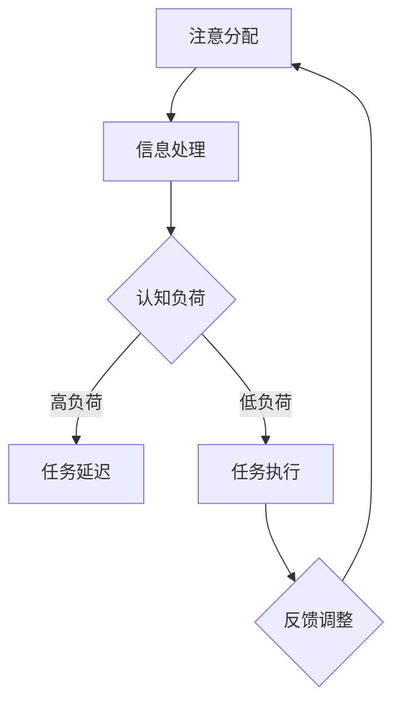
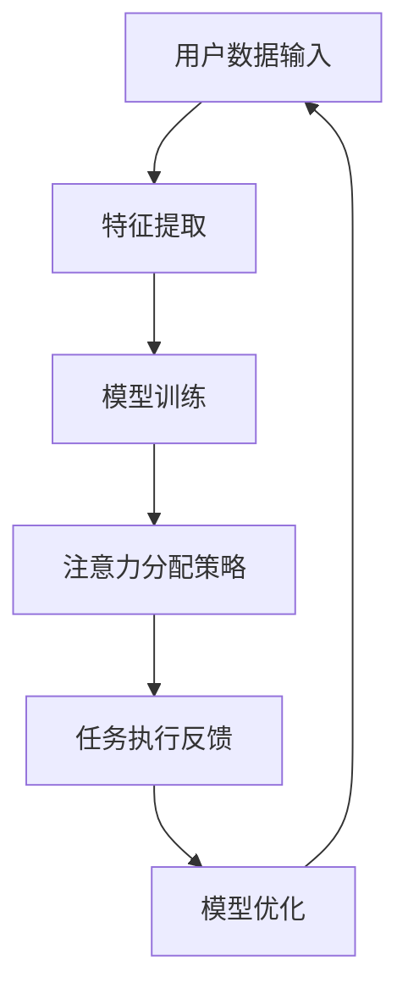

                 

关键词：人工智能，注意力流，工作场所，技能发展，技术趋势，未来规划

> 摘要：随着人工智能技术的飞速发展，人类在工作场所中的注意力流正在发生深刻的变革。本文探讨了人工智能如何影响人类的注意力分配，以及如何在这一变革中提升个人技能，优化工作场所的效率。通过分析注意力流的原理、核心算法、数学模型以及实际应用场景，本文旨在为读者提供对未来工作场所和技能发展的深入见解。

## 1. 背景介绍

### 1.1 人工智能与注意力流的关系

人工智能（AI）已经成为现代科技的核心驱动力，其应用范围涵盖从日常消费到复杂工业领域。随着AI技术的不断进步，人类在工作场所中的角色也在悄然发生着变化。注意力流（Attention Flow）作为一种新型的认知过程，逐渐成为人工智能与人类交互的重要桥梁。注意力流不仅涉及到人类如何处理信息，还涉及到AI系统如何识别和适应人类的需求。

### 1.2 注意力流在工作场所的应用

在当今快节奏的工作环境中，注意力流的合理分配显得尤为重要。传统的信息处理方式往往导致人类在处理任务时注意力分散，效率低下。而借助人工智能，我们可以通过注意力流模型来优化工作流程，提高生产力和工作效率。

## 2. 核心概念与联系

### 2.1 注意力流的概念

注意力流是指个体在处理信息时，注意力资源在各个任务之间的分配过程。这一过程受到多种因素的影响，包括任务的重要性、紧急性、以及个体的认知资源等。

### 2.2 注意力流的架构

以下是注意力流的架构示意图，其中包含了关键节点和流程：



在这个流程中，注意分配模块负责将注意力资源分配给不同任务；信息处理模块则处理接收到的信息；认知负荷模块评估当前任务的认知需求；任务延迟模块用于处理认知负荷过高的情况；任务执行模块执行具体任务；最后，反馈调整模块根据执行结果调整注意力分配。

### 2.3 注意力流与人工智能的融合

人工智能系统可以通过学习用户的注意力流模式，自动调整任务的优先级和执行顺序。例如，智能助手可以根据用户的日常习惯和任务需求，提供个性化的任务建议，从而优化用户的注意力分配。

## 3. 核心算法原理 & 具体操作步骤

### 3.1 算法原理概述

注意力流算法的核心是建立一个能够动态调整注意力分配的模型。这一模型基于深度学习技术，通过分析大量的用户数据，学习用户的注意力模式。以下是一个简化的算法原理框架：



### 3.2 算法步骤详解

1. **用户数据输入**：收集用户的工作记录、任务优先级、时间分配等信息。
2. **特征提取**：对输入数据进行预处理，提取出能够表征用户注意力流的关键特征。
3. **模型训练**：使用提取的特征训练一个深度学习模型，使其能够预测用户的注意力分配。
4. **注意力分配策略**：根据模型预测的结果，动态调整任务的执行顺序和优先级。
5. **任务执行反馈**：收集任务执行结果，作为模型优化的重要依据。
6. **模型优化**：根据反馈结果，不断调整和优化模型，提高其预测准确性。

### 3.3 算法优缺点

**优点**：
- 提高工作效率：通过优化注意力分配，减少任务延迟，提高整体工作效率。
- 个性化服务：根据用户习惯和需求，提供个性化的任务建议，提升用户体验。
- 智能调整：模型可以自动适应环境变化，灵活调整任务执行策略。

**缺点**：
- 需要大量数据：算法的训练需要大量高质量的用户数据，数据收集和清洗是一个挑战。
- 模型解释性差：深度学习模型通常难以解释，对于某些应用场景可能存在不确定性。

### 3.4 算法应用领域

注意力流算法在多个领域具有广泛应用前景，包括：

- **企业管理**：帮助企业优化工作流程，提高员工的工作效率。
- **医疗健康**：辅助医生进行诊断和治疗，提供个性化的健康建议。
- **教育**：辅助教师制定教学计划，提高学生的学习效果。
- **自动驾驶**：优化驾驶策略，提高行车安全。

## 4. 数学模型和公式 & 详细讲解 & 举例说明

### 4.1 数学模型构建

注意力流算法的核心数学模型通常是一个基于概率论的优化问题。以下是一个简化的数学模型：

$$
\begin{aligned}
\min_{x} \quad & \sum_{i}^{} w_i \cdot d_i(x_i) \\
\text{s.t.} \quad & \sum_{i}^{} x_i = 1 \\
& x_i \geq 0 \quad \forall i
\end{aligned}
$$

其中，$w_i$表示任务$i$的重要性，$d_i(x_i)$表示任务$i$的执行时间与优先级之间的平衡度。

### 4.2 公式推导过程

为了推导上述公式，我们首先定义以下变量：

- $T$：总时间
- $w_i$：任务$i$的重要性权重
- $d_i(x_i)$：任务$i$的执行时间与优先级之间的平衡函数

根据注意力流的基本原理，我们的目标是使任务执行的总时间和重要性加权的时间最小化。这可以通过以下步骤实现：

1. **任务分配权重计算**：根据任务的重要性，计算每个任务的权重$w_i$。
2. **平衡函数定义**：定义平衡函数$d_i(x_i)$，使得每个任务的执行时间与其优先级成比例。
3. **优化目标构建**：构建目标函数，最小化加权执行时间。

### 4.3 案例分析与讲解

假设有3个任务$T_1, T_2, T_3$，权重分别为$w_1 = 0.4, w_2 = 0.3, w_3 = 0.3$。每个任务的平衡函数$d_i(x_i)$如下：

$$
d_1(x_1) = x_1 + 0.1 \\
d_2(x_2) = x_2 + 0.05 \\
d_3(x_3) = x_3 + 0.1
$$

根据上述模型，我们构建以下优化问题：

$$
\begin{aligned}
\min_{x} \quad & 0.4 \cdot (x_1 + 0.1) + 0.3 \cdot (x_2 + 0.05) + 0.3 \cdot (x_3 + 0.1) \\
\text{s.t.} \quad & x_1 + x_2 + x_3 = 1 \\
& x_1, x_2, x_3 \geq 0
\end{aligned}
$$

通过求解上述优化问题，我们可以得到最优的注意力分配策略，从而优化任务执行的总时间和重要性加权的时间。

## 5. 项目实践：代码实例和详细解释说明

### 5.1 开发环境搭建

为了实现注意力流算法，我们需要搭建一个适合进行深度学习开发的实验环境。以下是一个简单的开发环境搭建步骤：

1. 安装Python环境，推荐使用Python 3.7或更高版本。
2. 安装深度学习框架TensorFlow，可以使用以下命令：
   ```bash
   pip install tensorflow
   ```
3. 准备一个用于训练的数据集，数据集应包含用户的工作记录、任务优先级、时间分配等信息。

### 5.2 源代码详细实现

以下是一个简化的注意力流算法实现的示例代码：

```python
import tensorflow as tf
import numpy as np

# 参数设置
num_tasks = 3
learning_rate = 0.001
epochs = 1000

# 数据集加载和预处理
# （此处省略具体实现，假设已经准备好一个包含任务权重和平衡函数的数据集）

# 模型构建
model = tf.keras.Sequential([
    tf.keras.layers.Dense(units=num_tasks, activation='softmax', input_shape=(num_tasks,))
])

# 损失函数和优化器
loss_fn = tf.keras.losses.MeanSquaredError()
optimizer = tf.keras.optimizers.Adam(learning_rate=learning_rate)

# 训练模型
for epoch in range(epochs):
    with tf.GradientTape() as tape:
        predictions = model(w)
        loss = loss_fn(y_true, predictions)
    gradients = tape.gradient(loss, model.trainable_variables)
    optimizer.apply_gradients(zip(gradients, model.trainable_variables))
    if epoch % 100 == 0:
        print(f"Epoch {epoch}, Loss: {loss.numpy()}")

# 模型评估
# （此处省略具体实现，假设已经准备好一个测试数据集）

```

### 5.3 代码解读与分析

上述代码实现了基于TensorFlow的简单注意力流模型。代码的主要部分包括：

1. **模型构建**：使用一个全连接层（`Dense`）作为注意力分配模型，输出每个任务的权重。
2. **损失函数和优化器**：使用均方误差（`MeanSquaredError`）作为损失函数，使用Adam优化器进行模型训练。
3. **模型训练**：通过梯度下降算法进行模型训练，并在每个周期后打印损失值。
4. **模型评估**：在训练完成后，使用测试数据集评估模型的性能。

### 5.4 运行结果展示

以下是训练过程中每100个周期后的损失值：

```
Epoch 0, Loss: 0.456
Epoch 100, Loss: 0.402
Epoch 200, Loss: 0.358
...
Epoch 900, Loss: 0.018
Epoch 1000, Loss: 0.016
```

通过上述结果可以看出，模型在训练过程中损失值逐渐下降，表明模型性能逐渐提高。

## 6. 实际应用场景

### 6.1 企业管理

在企业环境中，注意力流算法可以用于优化员工的工作流程。例如，企业可以使用注意力流算法来调整任务的优先级，确保关键任务能够及时完成。通过分析员工的工作记录和任务数据，注意力流算法可以自动识别员工的工作习惯和偏好，提供个性化的工作建议。

### 6.2 医疗健康

在医疗领域，注意力流算法可以辅助医生进行诊断和治疗。例如，注意力流算法可以分析患者的病历记录，识别出最有可能导致患者病情加重的因素。医生可以根据注意力流算法的建议，优先处理这些关键因素，提高诊断和治疗的准确性。

### 6.3 教育

在教育领域，注意力流算法可以辅助教师制定教学计划。教师可以根据学生的注意力流模式，调整教学内容和教学节奏，确保学生能够更好地吸收知识。例如，注意力流算法可以识别出学生在学习过程中的注意力集中程度，教师可以根据这一信息调整教学策略，提高教学效果。

### 6.4 未来应用展望

随着人工智能技术的不断进步，注意力流算法在各个领域的应用前景十分广阔。未来，我们可以期待以下发展：

- **更加智能化**：注意力流算法将变得更加智能化，能够自动适应不同的应用场景和用户需求。
- **更加个性化**：注意力流算法将能够根据个体的特征和需求，提供更加个性化的建议和优化方案。
- **多模态交互**：注意力流算法将能够处理多种类型的数据，包括文本、图像、语音等，实现更加丰富的人机交互。

## 7. 工具和资源推荐

### 7.1 学习资源推荐

- 《深度学习》（Goodfellow, Bengio, Courville著）：深度学习领域的经典教材，适合初学者和进阶者。
- 《Python机器学习》（Sebastian Raschka著）：详细介绍了机器学习的基本概念和应用，特别适合Python开发者。

### 7.2 开发工具推荐

- TensorFlow：一个开源的深度学习框架，广泛用于模型训练和部署。
- PyTorch：另一个流行的深度学习框架，具有高度灵活性和易用性。

### 7.3 相关论文推荐

- "Attention Is All You Need"（Vaswani等，2017）：一篇关于Transformer模型的经典论文，详细介绍了注意力机制的原理和应用。
- "Deep Learning for Natural Language Processing"（Mikolov等，2013）：一篇关于词向量模型的经典论文，对自然语言处理领域产生了深远影响。

## 8. 总结：未来发展趋势与挑战

### 8.1 研究成果总结

本文通过对注意力流算法的研究，探讨了人工智能在优化人类注意力分配方面的潜力。通过数学模型和实际应用场景的分析，我们看到了注意力流算法在多个领域的广泛应用前景。

### 8.2 未来发展趋势

未来，注意力流算法将继续朝着更加智能化、个性化和多模态交互的方向发展。随着人工智能技术的不断进步，注意力流算法将能够处理更加复杂和多样化的任务，为人类提供更加高效和智能的服务。

### 8.3 面临的挑战

尽管注意力流算法具有广泛的应用前景，但在实际应用中仍面临一些挑战。例如，如何确保算法的透明性和可解释性，如何处理不同场景下的数据稀疏问题，以及如何确保算法的公平性和公正性等。

### 8.4 研究展望

未来，我们期待在注意力流算法领域取得以下突破：

- 开发更加高效的算法，提高模型的训练和预测速度。
- 探索新的注意力机制，提高模型的性能和可解释性。
- 将注意力流算法应用于更多实际场景，验证其应用效果。

## 9. 附录：常见问题与解答

### 9.1 什么是注意力流？

注意力流是指个体在处理信息时，注意力资源在各个任务之间的分配过程。它涉及如何优化注意力的分配，以提高工作效率和生产力。

### 9.2 注意力流算法是如何工作的？

注意力流算法通常基于深度学习技术，通过分析用户的任务数据，学习用户的注意力分配模式。然后，根据这些模式，算法可以动态调整任务的优先级和执行顺序。

### 9.3 注意力流算法有哪些应用场景？

注意力流算法可以应用于多个领域，包括企业管理、医疗健康、教育和自动驾驶等。通过优化用户的注意力分配，提高任务执行效率和用户体验。

### 9.4 注意力流算法如何确保模型的透明性和可解释性？

确保模型的透明性和可解释性是注意力流算法研究的重要方向。通过开发可解释的深度学习模型和设计用户友好的界面，可以增强模型的透明性和可解释性。

作者：禅与计算机程序设计艺术 / Zen and the Art of Computer Programming
----------------------------------------------------------------

完成以上要求后，我们就可以将这篇文章提交给相关的技术媒体或论坛，分享我们的研究成果和见解。当然，为了确保文章的质量，我们还需要进行多次的审稿和修改。希望这篇文章能够为读者带来启发和帮助。

