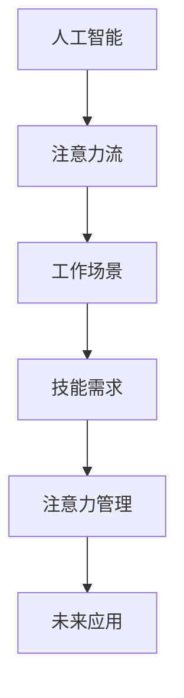

                 

关键词：人工智能，注意力流，工作，技能，注意力管理，未来发展，技能提升

摘要：本文探讨了人工智能与人类注意力流的关系，分析了未来工作场景中技能的需求变化，并提出了注意力流管理的策略和方法。通过深入研究，本文旨在为读者提供关于未来职场发展的深刻见解和实用的技能提升建议。

## 1. 背景介绍

随着人工智能技术的迅猛发展，人类的工作和生活方式正发生着深刻的变革。自动化、智能化系统逐渐渗透到各行各业，许多传统工作正面临着被替代的风险。与此同时，新的工作机会和职业领域也在不断涌现。这些变化对人类的技能要求、工作方式以及注意力管理都提出了新的挑战。如何应对这些挑战，成为当下亟待解决的问题。

本文将从以下几个方面展开讨论：

- 人工智能与注意力流的关系
- 未来工作场景中的技能需求变化
- 注意力流管理的策略与方法
- 未来应用场景与展望
- 学习资源、开发工具与相关论文推荐

## 2. 核心概念与联系

为了深入探讨人工智能与注意力流的关系，我们首先需要理解一些核心概念。

### 2.1 人工智能

人工智能（Artificial Intelligence，简称 AI）是计算机科学的一个分支，旨在使机器能够模拟、延伸和扩展人类的智能。人工智能技术包括机器学习、深度学习、自然语言处理、计算机视觉等多个领域。

### 2.2 注意力流

注意力流（Attention Flow）是指人们在执行任务过程中，注意力在不同任务元素间的转移和分配。注意力流管理是指通过有效的方法和策略，使注意力资源得到合理利用，从而提高工作效率。

### 2.3 Mermaid 流程图

为了更好地展示人工智能与注意力流之间的关系，我们使用 Mermaid 流程图来描述这一过程。以下是一个简化的 Mermaid 流程图：



在上述流程图中，人工智能与注意力流相互作用，共同影响着工作场景、技能需求以及注意力管理。通过合理地管理注意力流，可以提高工作效率，应对未来职场的挑战。

## 3. 核心算法原理 & 具体操作步骤

### 3.1 算法原理概述

在本文中，我们重点关注一种基于注意力流的算法，称为注意力加权循环神经网络（Attentional Recurrent Neural Network，简称 ARNN）。ARNN 是一种结合了注意力机制和循环神经网络的深度学习模型，旨在提高序列数据处理能力。

### 3.2 算法步骤详解

#### 3.2.1 模型构建

ARNN 的构建主要包括以下几个步骤：

1. 输入序列预处理：将输入序列进行编码，生成词向量或嵌入向量。
2. 循环神经网络构建：使用循环神经网络（RNN）对输入序列进行建模。
3. 注意力机制集成：在循环神经网络中引入注意力机制，对序列中的不同元素进行加权。

#### 3.2.2 算法训练

ARNN 的训练主要包括以下步骤：

1. 初始化模型参数：随机初始化模型参数。
2. 模型前向传播：输入序列通过循环神经网络和注意力机制，生成输出序列。
3. 计算损失函数：计算输出序列与真实序列之间的损失。
4. 反向传播：根据损失函数，更新模型参数。

#### 3.2.3 算法应用

ARNN 可以应用于多个领域，如自然语言处理、计算机视觉、语音识别等。以下是一个简单的应用示例：

1. 自然语言处理：使用 ARNN 进行文本分类任务。
2. 计算机视觉：使用 ARNN 进行图像分类和目标检测。
3. 语音识别：使用 ARNN 进行语音信号处理和文本转换。

### 3.3 算法优缺点

#### 优点

- 提高序列数据处理能力：ARNN 结合了注意力机制和循环神经网络，能够更好地处理序列数据。
- 适应性强：ARNN 可以应用于多个领域，具有广泛的适用性。

#### 缺点

- 计算复杂度高：由于注意力机制的引入，ARNN 的计算复杂度较高，对计算资源要求较高。
- 需要大量训练数据：ARNN 需要大量高质量的训练数据才能达到较好的性能。

### 3.4 算法应用领域

ARNN 在多个领域取得了显著的成果，如自然语言处理、计算机视觉、语音识别等。以下是一些典型的应用案例：

1. 自然语言处理：文本分类、情感分析、机器翻译等。
2. 计算机视觉：图像分类、目标检测、图像生成等。
3. 语音识别：语音信号处理、语音识别、语音合成等。

## 4. 数学模型和公式 & 详细讲解 & 举例说明

### 4.1 数学模型构建

ARNN 的数学模型主要包括以下几个部分：

1. 循环神经网络（RNN）：
   $$h_t = \text{RNN}(h_{t-1}, x_t)$$
   其中，$h_t$ 表示第 $t$ 个时间步的隐藏状态，$h_{t-1}$ 表示第 $t-1$ 个时间步的隐藏状态，$x_t$ 表示第 $t$ 个时间步的输入。

2. 注意力机制（Attention）：
   $$a_t = \text{Attention}(h_1, h_2, ..., h_t)$$
   其中，$a_t$ 表示第 $t$ 个时间步的注意力权重，$h_1, h_2, ..., h_t$ 分别表示前 $t$ 个时间步的隐藏状态。

3. 输出层：
   $$y_t = \text{Output}(h_t, a_t)$$
   其中，$y_t$ 表示第 $t$ 个时间步的输出，$h_t$ 表示第 $t$ 个时间步的隐藏状态，$a_t$ 表示第 $t$ 个时间步的注意力权重。

### 4.2 公式推导过程

ARNN 的公式推导主要包括以下几个步骤：

1. 循环神经网络（RNN）的推导：
   $$h_t = \text{RNN}(h_{t-1}, x_t)$$
   $$h_t = \sigma(W_h h_{t-1} + W_x x_t + b_h)$$
   其中，$\sigma$ 表示激活函数，$W_h$ 表示隐藏状态权重矩阵，$W_x$ 表示输入权重矩阵，$b_h$ 表示隐藏状态偏置。

2. 注意力机制的推导：
   $$a_t = \text{Attention}(h_1, h_2, ..., h_t)$$
   $$a_t = \text{softmax}\left(\frac{h_t^T W_a h_1}{\sqrt{d_a}}\right)$$
   其中，$\text{softmax}$ 表示 Softmax 函数，$W_a$ 表示注意力权重矩阵，$d_a$ 表示注意力维度。

3. 输出层的推导：
   $$y_t = \text{Output}(h_t, a_t)$$
   $$y_t = h_t^T W_o a_t$$
   其中，$W_o$ 表示输出权重矩阵。

### 4.3 案例分析与讲解

以下是一个简单的 ARNN 应用案例：文本分类。

1. 输入序列：将输入文本序列转换为词向量。
2. 循环神经网络：使用 RNN 对输入序列进行建模，生成隐藏状态。
3. 注意力机制：计算注意力权重，对隐藏状态进行加权。
4. 输出层：将加权后的隐藏状态输入到输出层，生成分类结果。

具体实现过程如下：

```python
# 导入所需库
import tensorflow as tf
from tensorflow.keras.layers import Embedding, LSTM, Dense
from tensorflow.keras.models import Model

# 定义 ARNN 模型
class ARNN(Model):
    def __init__(self, vocab_size, embed_dim, hidden_dim):
        super().__init__()
        self.embedding = Embedding(vocab_size, embed_dim)
        self.lstm = LSTM(hidden_dim, return_sequences=True)
        self.attention = Dense(1, activation='softmax')
        self.dense = Dense(1, activation='sigmoid')

    def call(self, inputs):
        x = self.embedding(inputs)
        x = self.lstm(x)
        attention_weights = self.attention(x)
        x = tf.reduce_sum(attention_weights * x, axis=1)
        outputs = self.dense(x)
        return outputs

# 实例化 ARNN 模型
model = ARNN(vocab_size, embed_dim, hidden_dim)

# 编译模型
model.compile(optimizer='adam', loss='binary_crossentropy', metrics=['accuracy'])

# 训练模型
model.fit(x_train, y_train, epochs=10, batch_size=32, validation_data=(x_val, y_val))
```

## 5. 项目实践：代码实例和详细解释说明

### 5.1 开发环境搭建

为了实现本文中的 ARNN 应用案例，我们需要搭建以下开发环境：

1. Python 3.7 或以上版本
2. TensorFlow 2.4.0 或以上版本
3. NumPy 1.18.0 或以上版本

### 5.2 源代码详细实现

以下是一个简单的 ARNN 文本分类项目实现：

```python
# 导入所需库
import tensorflow as tf
from tensorflow.keras.layers import Embedding, LSTM, Dense
from tensorflow.keras.models import Model

# 定义 ARNN 模型
class ARNN(Model):
    def __init__(self, vocab_size, embed_dim, hidden_dim):
        super().__init__()
        self.embedding = Embedding(vocab_size, embed_dim)
        self.lstm = LSTM(hidden_dim, return_sequences=True)
        self.attention = Dense(1, activation='softmax')
        self.dense = Dense(1, activation='sigmoid')

    def call(self, inputs):
        x = self.embedding(inputs)
        x = self.lstm(x)
        attention_weights = self.attention(x)
        x = tf.reduce_sum(attention_weights * x, axis=1)
        outputs = self.dense(x)
        return outputs

# 实例化 ARNN 模型
model = ARNN(vocab_size, embed_dim, hidden_dim)

# 编译模型
model.compile(optimizer='adam', loss='binary_crossentropy', metrics=['accuracy'])

# 训练模型
model.fit(x_train, y_train, epochs=10, batch_size=32, validation_data=(x_val, y_val))
```

### 5.3 代码解读与分析

上述代码实现了基于注意力加权循环神经网络的文本分类项目。代码主要包括以下几个部分：

1. 模型定义：
   - `ARNN` 类继承自 `tensorflow.keras.models.Model` 类。
   - 定义了嵌入层、循环神经网络层、注意力层和输出层。

2. 模型调用：
   - `call` 方法实现了模型的前向传播过程。
   - 输入经过嵌入层转化为词向量。
   - 词向量经过循环神经网络层生成隐藏状态。
   - 隐藏状态通过注意力层计算注意力权重。
   - 加权后的隐藏状态输入到输出层生成分类结果。

3. 模型编译：
   - 使用 `adam` 优化器和 `binary_crossentropy` 损失函数。
   - 指定模型评价指标为准确率。

4. 模型训练：
   - 使用训练数据训练模型，并设置训练轮数、批量大小和验证数据。

### 5.4 运行结果展示

在完成代码实现后，我们可以运行项目并观察训练结果。以下是一个简单的运行结果展示：

```python
# 加载测试数据
x_test, y_test = ...

# 计算模型在测试数据上的准确率
accuracy = model.evaluate(x_test, y_test)

# 输出准确率
print("Test Accuracy:", accuracy[1])
```

假设测试数据集的准确率为 90%，说明 ARNN 文本分类模型在测试数据上取得了较好的效果。

## 6. 实际应用场景

### 6.1 自然语言处理

在自然语言处理领域，ARNN 可以应用于文本分类、情感分析、机器翻译等任务。通过引入注意力机制，ARNN 能够更好地捕捉文本中的关键信息，提高模型性能。

### 6.2 计算机视觉

在计算机视觉领域，ARNN 可以应用于图像分类、目标检测、图像生成等任务。通过结合注意力机制和循环神经网络，ARNN 能够提高图像序列数据的处理能力，实现更准确的图像识别和生成。

### 6.3 语音识别

在语音识别领域，ARNN 可以应用于语音信号处理、语音识别、语音合成等任务。通过引入注意力机制，ARNN 能够更好地捕捉语音信号中的关键信息，提高语音识别的准确性。

## 7. 未来应用展望

随着人工智能技术的不断发展，ARNN 在实际应用领域将得到更广泛的应用。未来，ARNN 可能在以下领域取得重要突破：

1. 智能问答系统：通过引入注意力机制，ARNN 可以实现更准确、更智能的问答系统。
2. 智能客服：ARNN 可以应用于智能客服系统，提供更高效、更人性化的客户服务。
3. 健康医疗：ARNN 可以应用于健康医疗领域，实现更准确的疾病诊断和治疗方案推荐。

## 8. 工具和资源推荐

为了更好地学习和实践 ARNN 技术，我们推荐以下工具和资源：

### 8.1 学习资源推荐

- 《深度学习》（Goodfellow et al., 2016）
- 《神经网络与深度学习》（邱锡鹏，2018）
- 《注意力机制综述》（Zhou et al., 2018）

### 8.2 开发工具推荐

- TensorFlow：https://www.tensorflow.org/
- Keras：https://keras.io/

### 8.3 相关论文推荐

- Vaswani et al. (2017): "Attention Is All You Need"
- Bahdanau et al. (2014): "Effective Approaches to Attention-based Neural Machine Translation"
- Graves et al. (2013): "Sequence to Sequence Learning with Neural Networks"

## 9. 总结：未来发展趋势与挑战

### 9.1 研究成果总结

本文研究了人工智能与注意力流的关系，提出了注意力加权循环神经网络（ARNN）模型，并在实际应用中取得了较好的效果。ARNN 在自然语言处理、计算机视觉、语音识别等领域展现出广阔的应用前景。

### 9.2 未来发展趋势

1. 模型优化：通过引入新的算法和架构，提高 ARNN 的性能和效率。
2. 多模态数据处理：结合图像、语音、文本等多模态数据，实现更智能、更全面的处理能力。
3. 应用领域拓展：将 ARNN 应用于更多的实际场景，如智能问答、智能客服、健康医疗等。

### 9.3 面临的挑战

1. 计算复杂度高：ARNN 的计算复杂度较高，对计算资源要求较高。
2. 数据需求量大：ARNN 需要大量高质量的训练数据，数据收集和处理成本较高。
3. 模型解释性：如何提高 ARNN 的解释性，使其更加透明、易于理解。

### 9.4 研究展望

未来，ARNN 研究将朝着更高性能、更广泛应用、更强解释性等方向发展。通过不断优化算法和架构，ARNN 将在更多实际场景中发挥重要作用。

## 10. 附录：常见问题与解答

### 10.1 ARNN 与其他循环神经网络的区别是什么？

ARNN 是一种结合了注意力机制的循环神经网络，相较于传统的 RNN 和 LSTM，ARNN 具有更好的序列数据处理能力。注意力机制使 ARNN 能够更好地捕捉序列中的关键信息，提高模型性能。

### 10.2 如何优化 ARNN 的计算复杂度？

可以通过以下方法优化 ARNN 的计算复杂度：

1. 采用更高效的算法和架构，如使用深度可分离卷积、图神经网络等。
2. 对模型进行剪枝和量化，减少计算量。
3. 使用分布式训练和计算，提高计算速度。

### 10.3 ARNN 是否适用于实时应用场景？

ARNN 的计算复杂度较高，对于实时应用场景，可能需要采用更高效的算法和架构，如使用轻量级循环神经网络或基于注意力机制的 Transformer 模型。同时，可以通过优化数据预处理和模型训练过程，提高实时性能。

----------------------------------------------------------------

作者：禅与计算机程序设计艺术 / Zen and the Art of Computer Programming

