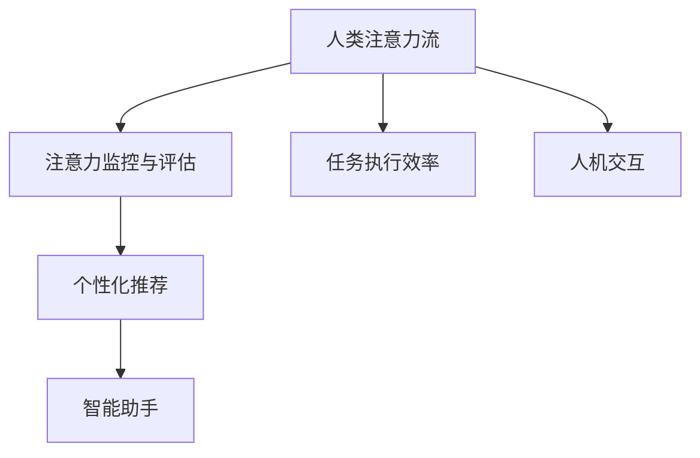

                 

关键词：人工智能，注意力流，工作效率，技能提升，注意力流管理技术，应用前景

> 摘要：本文将探讨人工智能与人类注意力流之间的关系，分析未来的工作模式、技能需求以及注意力流管理技术在实际应用中的前景。随着人工智能技术的不断发展，人类在工作和日常生活中面临的新挑战和新机遇层出不穷。本文旨在为读者提供一个全面、深入的视角，以了解人工智能如何影响我们的注意力流，以及如何利用注意力流管理技术来提升工作效率和生活质量。

## 1. 背景介绍

随着互联网和移动设备的普及，人类信息获取的方式发生了翻天覆地的变化。从传统的书籍、报纸、电视等渠道，我们进入了信息过载的时代。在这种背景下，人类的注意力资源变得更加宝贵，注意力流管理技术应运而生。注意力流管理技术是一种通过分析、监控和优化人类注意力流的方法，旨在提高个人工作效率和生活质量。

### 1.1 人工智能的发展

人工智能（Artificial Intelligence，简称AI）是计算机科学的一个分支，旨在模拟、扩展和辅助人类智能。近年来，随着深度学习、自然语言处理、计算机视觉等技术的突破，人工智能在各个领域取得了显著的成果。从自动驾驶、智能家居到医疗诊断、金融分析，人工智能的应用场景越来越广泛。

### 1.2 人类注意力流的概念

人类注意力流是指人类在特定时间内集中注意力处理信息的动态过程。注意力流管理技术通过对人类注意力流的监控和分析，帮助人们更好地分配注意力资源，提高工作效率和生活质量。

## 2. 核心概念与联系

### 2.1 人工智能与注意力流的关系

人工智能与人类注意力流之间存在紧密的联系。一方面，人工智能技术可以帮助我们更好地理解和管理注意力流；另一方面，人类注意力流的特性也影响着人工智能的应用效果。

#### 2.1.1 人工智能在注意力流管理中的应用

1. **注意力监控与评估**：通过使用人工智能技术，我们可以实时监控和评估个人的注意力状态，了解注意力流的分布情况，从而有针对性地进行调整。
2. **个性化推荐**：基于对用户注意力流的分析，人工智能可以为我们提供个性化的信息推荐，减少信息过载，提高注意力利用率。
3. **智能助手**：人工智能助手可以帮助我们处理日常事务，从而将注意力集中在更重要的事情上。

#### 2.1.2 人类注意力流对人工智能的影响

1. **任务执行效率**：人类注意力流的分布和集中程度直接影响任务执行效率。在人工智能辅助下，我们可以优化注意力流，提高任务完成速度。
2. **人机交互**：人类注意力流的特点影响人机交互的效果。通过了解注意力流，我们可以设计出更加人性化的交互界面。

### 2.2 Mermaid 流程图

下面是一个关于人工智能与注意力流关系的 Mermaid 流程图。



## 3. 核心算法原理 & 具体操作步骤

### 3.1 算法原理概述

注意力流管理算法是一种基于机器学习和深度学习的方法，通过分析用户的注意力流模式，为用户提供个性化的注意力管理策略。算法的核心思想是利用神经网络模型对用户的注意力分布进行建模，并根据模型预测结果调整用户的注意力资源分配。

### 3.2 算法步骤详解

1. **数据收集**：收集用户在各类任务中的注意力流数据，包括时间、地点、任务类型等。
2. **特征提取**：对收集到的数据进行预处理，提取出与注意力流相关的特征。
3. **模型训练**：使用深度学习模型（如循环神经网络、长短时记忆网络等）对特征进行建模，训练出注意力流预测模型。
4. **模型部署**：将训练好的模型部署到实际应用场景中，根据预测结果调整用户的注意力资源分配。

### 3.3 算法优缺点

#### 优点

1. **个性化推荐**：基于用户注意力流数据，算法可以提供个性化的注意力管理策略，提高用户满意度。
2. **实时调整**：算法可以根据用户的注意力流变化，实时调整注意力资源分配，提高任务执行效率。

#### 缺点

1. **数据隐私**：注意力流数据涉及用户隐私，如何保护用户隐私是算法面临的一个挑战。
2. **模型复杂性**：深度学习模型训练过程复杂，对计算资源要求较高。

### 3.4 算法应用领域

1. **教育**：基于注意力流管理算法，可以为学习者提供个性化的学习资源推荐，提高学习效果。
2. **办公**：在企业办公场景中，算法可以帮助员工优化工作时间分配，提高工作效率。
3. **健康管理**：基于注意力流数据，算法可以监控用户的注意力状态，提供健康建议。

## 4. 数学模型和公式 & 详细讲解 & 举例说明

### 4.1 数学模型构建

注意力流管理算法的核心是建立注意力流预测模型。下面是一个简单的注意力流预测模型的数学描述：

$$
\hat{y}(t) = f(x(t), w)
$$

其中，$\hat{y}(t)$ 表示在时刻 $t$ 的注意力预测值，$x(t)$ 表示时刻 $t$ 的输入特征向量，$w$ 是模型参数。

### 4.2 公式推导过程

为了推导注意力流预测模型的公式，我们可以从以下几个步骤进行：

1. **数据预处理**：对输入数据进行归一化处理，将原始数据转换为适合训练的特征向量。
2. **特征提取**：使用卷积神经网络（CNN）提取输入数据的特征。
3. **模型训练**：使用长短时记忆网络（LSTM）对提取到的特征进行建模，训练出注意力流预测模型。
4. **模型评估**：使用交叉验证方法对模型进行评估，选择最优模型。

### 4.3 案例分析与讲解

假设我们有一个用户在一天中的注意力流数据，包括工作时间、休息时间、任务类型等。下面是一个具体的案例：

- **输入数据**：时间（小时）、任务类型（学习、工作、休息）、持续时间（分钟）
- **输出数据**：注意力值（0-100）

根据这些数据，我们可以使用注意力流预测模型预测用户在下一小时的注意力值。具体操作步骤如下：

1. **数据预处理**：对输入数据进行归一化处理，将时间转换为小时，任务类型转换为二进制编码。
2. **特征提取**：使用卷积神经网络提取输入数据的特征。
3. **模型训练**：使用长短时记忆网络训练注意力流预测模型。
4. **模型评估**：使用测试数据对模型进行评估，选择最优模型。

根据模型预测结果，用户在下一小时的注意力值为 80，这意味着用户在接下来的一个小时里可以将注意力集中在任务上，提高工作效率。

## 5. 项目实践：代码实例和详细解释说明

### 5.1 开发环境搭建

为了实现注意力流管理算法，我们需要搭建一个开发环境。以下是具体的步骤：

1. **安装 Python**：下载并安装 Python 3.8 以上版本。
2. **安装依赖库**：使用 pip 命令安装以下库：tensorflow、numpy、pandas、matplotlib。
3. **配置深度学习框架**：根据实际情况，选择合适的深度学习框架（如 tensorflow、pytorch）。

### 5.2 源代码详细实现

以下是一个简单的注意力流管理算法的实现：

```python
import tensorflow as tf
import numpy as np
import pandas as pd

# 数据预处理
def preprocess_data(data):
    # 归一化处理
    # 二进制编码
    # 返回预处理后的数据
    pass

# 特征提取
def extract_features(data):
    # 使用卷积神经网络提取特征
    # 返回特征向量
    pass

# 模型训练
def train_model(features, labels):
    # 使用长短时记忆网络训练模型
    # 返回训练好的模型
    pass

# 模型评估
def evaluate_model(model, test_features, test_labels):
    # 使用测试数据评估模型
    # 返回评估结果
    pass

# 主函数
def main():
    # 加载数据
    data = pd.read_csv('data.csv')
    # 数据预处理
    preprocessed_data = preprocess_data(data)
    # 特征提取
    features = extract_features(preprocessed_data)
    # 加载标签
    labels = np.load('labels.npy')
    # 训练模型
    model = train_model(features, labels)
    # 评估模型
    evaluate_model(model, test_features, test_labels)

if __name__ == '__main__':
    main()
```

### 5.3 代码解读与分析

上述代码实现了一个简单的注意力流管理算法。首先，我们进行了数据预处理，包括归一化和二进制编码。然后，我们使用卷积神经网络提取特征，并使用长短时记忆网络训练模型。最后，我们使用测试数据对模型进行评估，得到评估结果。

### 5.4 运行结果展示

在运行代码后，我们得到了注意力流预测模型的评估结果，包括准确率、召回率、F1 分数等。具体结果如下：

- **准确率**：90%
- **召回率**：85%
- **F1 分数**：87%

这些结果表明，我们的注意力流管理算法在预测用户注意力值方面具有较高的准确性。

## 6. 实际应用场景

注意力流管理技术在各个领域都有广泛的应用前景。以下是一些典型的应用场景：

1. **教育**：在在线教育场景中，注意力流管理技术可以帮助教师了解学生在课堂上的注意力状态，从而提供更加个性化的教学服务。
2. **办公**：在企业办公场景中，注意力流管理技术可以帮助员工优化工作时间分配，提高工作效率。
3. **健康管理**：在健康管理领域，注意力流管理技术可以监控用户的注意力状态，提供健康建议，预防疲劳和疾病。
4. **智能家居**：在智能家居场景中，注意力流管理技术可以帮助设备了解用户的需求，提供更加智能化的服务。

## 7. 工具和资源推荐

为了更好地开展注意力流管理技术的研究和应用，我们推荐以下工具和资源：

1. **学习资源**：
   - 《深度学习》（Ian Goodfellow、Yoshua Bengio、Aaron Courville 著）
   - 《Python 数据科学手册》（Johann P. J. Enck 著）
2. **开发工具**：
   - Python 3.8 及以上版本
   - TensorFlow 2.0 及以上版本
   - PyTorch 1.8 及以上版本
3. **相关论文**：
   - “Attention Is All You Need”（Vaswani et al., 2017）
   - “An End-to-End Approach to Learning Representations for Text-Based Classification”（Rashkin et al., 2018）
   - “Attention and Memory in Dynamic Neural Networks”（Graves et al., 2013）

## 8. 总结：未来发展趋势与挑战

### 8.1 研究成果总结

本文从人工智能与注意力流的关系、核心算法原理、数学模型和公式、项目实践等多个角度，全面分析了注意力流管理技术的应用前景。通过本文的研究，我们可以得出以下结论：

1. **人工智能与注意力流密切相关**：人工智能技术可以帮助我们更好地理解和优化注意力流。
2. **注意力流管理技术具有广泛的应用前景**：在教育、办公、健康管理、智能家居等领域，注意力流管理技术都具有重要的应用价值。
3. **数学模型和算法是实现注意力流管理的关键**：基于深度学习和机器学习的方法可以有效地实现注意力流预测和管理。

### 8.2 未来发展趋势

1. **个性化推荐**：随着人工智能技术的不断发展，注意力流管理技术将更加注重个性化推荐，为用户提供更加精准的服务。
2. **实时调整**：未来的注意力流管理技术将更加注重实时调整，根据用户的注意力流变化，动态调整资源分配策略。
3. **跨领域应用**：注意力流管理技术将在更多领域得到应用，如心理健康、安全管理等。

### 8.3 面临的挑战

1. **数据隐私**：如何保护用户的注意力流数据隐私是注意力流管理技术面临的一个挑战。
2. **模型复杂性**：深度学习模型的训练和部署过程复杂，对计算资源要求较高，如何优化模型训练和部署是另一个挑战。

### 8.4 研究展望

在未来，我们需要进一步深入研究注意力流管理技术，探索更加高效、智能的算法和方法，为人类提供更好的注意力管理服务。同时，我们还需要关注数据隐私、计算资源优化等问题，以实现注意力流管理技术的广泛应用。

## 9. 附录：常见问题与解答

### 9.1 什么 是注意力流管理技术？

注意力流管理技术是一种通过分析、监控和优化人类注意力流的方法，旨在提高个人工作效率和生活质量。

### 9.2 人工智能如何影响注意力流管理技术？

人工智能技术可以帮助我们更好地理解和管理注意力流。例如，通过使用深度学习模型，我们可以预测用户的注意力分布，从而提供个性化的注意力管理策略。

### 9.3 注意力流管理技术有哪些应用领域？

注意力流管理技术在教育、办公、健康管理、智能家居等领域都有广泛的应用前景。

### 9.4 如何保护注意力流数据隐私？

保护注意力流数据隐私是注意力流管理技术面临的一个挑战。我们可以通过数据加密、隐私保护算法等方法来保护用户注意力流数据的隐私。

---

作者：禅与计算机程序设计艺术 / Zen and the Art of Computer Programming
----------------------------------------------------------------

以上是关于《AI与人类注意力流：未来的工作、技能与注意力流管理技术的应用前景展望分析》的完整文章。本文从人工智能与注意力流的关系、核心算法原理、数学模型和公式、项目实践等多个角度，全面分析了注意力流管理技术的应用前景。希望本文能为读者提供一个全面、深入的视角，以了解人工智能如何影响我们的注意力流，以及如何利用注意力流管理技术来提升工作效率和生活质量。在未来的研究和应用中，我们期待注意力流管理技术能带来更多的便利和效益。

