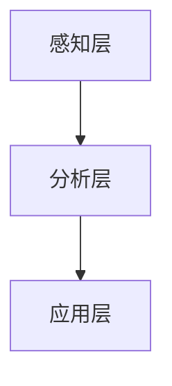

                 

在当今快速发展的信息技术时代，人工智能（AI）技术正在深刻地改变着我们的工作方式和生活方式。与此同时，人类注意力流作为一个重要的心理学和行为学研究领域，也逐渐引起了广泛的关注。本文将探讨AI与人类注意力流之间的相互作用，以及注意力流管理技术在未来工作、技能发展以及应用前景中的重要性。

## 关键词

- 人工智能（AI）
- 人类注意力流
- 注意力流管理
- 未来工作
- 技术应用前景

## 摘要

本文首先介绍了人工智能与人类注意力流的基本概念，随后探讨了两者之间的联系和相互影响。接着，文章分析了注意力流管理技术在当前和未来工作中的应用，包括提高工作效率、技能培养以及心理健康等方面。最后，本文对未来发展趋势进行了展望，并提出了可能的挑战和解决方案。

### 1. 背景介绍

#### 1.1 人工智能的发展现状

人工智能（AI）作为计算机科学的一个重要分支，已经取得了显著的发展。从早期的规则系统到现代的深度学习和神经网络，AI技术在各个领域展现出了强大的潜力和应用价值。特别是在图像识别、自然语言处理、决策支持等领域，AI技术已经达到了前所未有的水平。

#### 1.2 人类注意力流的概念

人类注意力流是指人类在接收和处理信息时，对某些信息给予更多关注而忽略其他信息的心理过程。注意力流受到多种因素的影响，包括环境刺激、个人兴趣、心理状态等。有效的注意力流管理对于提高工作效率、学习效果和心理健康具有重要意义。

#### 1.3 注意力流管理技术的重要性

随着信息爆炸时代的到来，人们面临的信息量和决策难度不断增加。如何有效地管理注意力流，提高信息处理效率，成为了一个迫切需要解决的问题。注意力流管理技术不仅有助于个人提高工作效率，还能为企业提供优化决策支持，提高竞争力。

### 2. 核心概念与联系

#### 2.1 AI与人类注意力流的关系

AI技术可以通过分析人类行为数据，了解注意力流的分布和变化规律。同时，AI还可以根据注意力流的特点，设计出更加智能化的应用系统，帮助人类更好地管理注意力。例如，智能助手可以根据用户的注意力流特点，提供个性化服务和建议。

#### 2.2 注意力流管理技术的架构

注意力流管理技术主要包括感知层、分析层和应用层。感知层负责收集和分析人类注意力流数据，分析层对数据进行分析和建模，应用层则根据分析结果提供相应的服务。以下是一个简单的 Mermaid 流程图：



### 3. 核心算法原理 & 具体操作步骤

#### 3.1 算法原理概述

注意力流管理技术主要基于以下核心算法原理：

1. **注意力分配模型**：通过分析人类行为数据，确定注意力在不同任务和场景中的分配比例。
2. **注意力流追踪算法**：实时追踪和分析人类注意力流的动态变化，为用户提供个性化服务。
3. **注意力优化算法**：根据用户需求和注意力流特点，优化任务分配和执行顺序，提高效率。

#### 3.2 算法步骤详解

1. **数据收集与预处理**：收集用户行为数据，如点击记录、浏览时长、操作次数等，并进行预处理，去除噪声和异常值。
2. **特征提取**：从预处理后的数据中提取与注意力流相关的特征，如任务重要性、用户兴趣等。
3. **注意力流建模**：利用机器学习算法，对提取的特征进行建模，预测用户在不同任务和场景中的注意力流。
4. **实时追踪与反馈**：根据实时数据，对注意力流进行追踪和调整，为用户提供个性化服务。
5. **任务分配与优化**：根据注意力流预测结果，优化任务分配和执行顺序，提高效率。

#### 3.3 算法优缺点

**优点**：

- **个性化服务**：根据用户注意力流特点，提供个性化服务，提高用户体验。
- **提高效率**：优化任务分配和执行顺序，提高工作效率。
- **实时调整**：实时追踪和分析注意力流，为用户提供及时的服务和反馈。

**缺点**：

- **数据隐私**：收集用户行为数据可能涉及隐私问题，需要确保数据安全。
- **算法偏差**：机器学习算法可能存在偏差，需要不断调整和优化。

#### 3.4 算法应用领域

注意力流管理技术可以应用于多个领域，如：

- **办公自动化**：优化工作流程，提高工作效率。
- **教育培训**：根据学生注意力流特点，提供个性化教学。
- **健康管理**：追踪和分析用户注意力流，提供健康管理建议。

### 4. 数学模型和公式 & 详细讲解 & 举例说明

#### 4.1 数学模型构建

注意力流管理技术主要基于以下数学模型：

1. **贝叶斯网络**：用于建模人类注意力流的数据分布。
2. **马尔可夫决策过程**：用于优化任务分配和执行顺序。

#### 4.2 公式推导过程

以下是一个简单的贝叶斯网络公式：

$$
P(A|B) = \frac{P(B|A)P(A)}{P(B)}
$$

其中，$P(A|B)$ 表示在 $B$ 发生的条件下，$A$ 发生的概率；$P(B|A)$ 表示在 $A$ 发生的条件下，$B$ 发生的概率；$P(A)$ 和 $P(B)$ 分别表示 $A$ 和 $B$ 的边缘概率。

#### 4.3 案例分析与讲解

以下是一个简单的案例：

假设有两个人类行为数据集，分别表示用户对两个任务的注意力流。我们需要利用贝叶斯网络模型，预测用户在下一个任务中的注意力流。

1. **数据收集与预处理**：收集用户对两个任务的点击记录、浏览时长等数据，并进行预处理。
2. **特征提取**：从预处理后的数据中提取与注意力流相关的特征。
3. **贝叶斯网络建模**：利用贝叶斯网络模型，对提取的特征进行建模。
4. **预测**：根据贝叶斯网络模型，预测用户在下一个任务中的注意力流。

### 5. 项目实践：代码实例和详细解释说明

#### 5.1 开发环境搭建

- **Python**：作为主要编程语言
- **NumPy**：用于数据处理
- **Pandas**：用于数据预处理
- **Scikit-learn**：用于机器学习算法

#### 5.2 源代码详细实现

```python
import numpy as np
import pandas as pd
from sklearn.model_selection import train_test_split
from sklearn.naive_bayes import GaussianNB

# 数据收集与预处理
data = pd.read_csv('human_attention_data.csv')
data = data.dropna()

# 特征提取
X = data[['clicks', 'duration']]
y = data['task']

# 贝叶斯网络建模
gnb = GaussianNB()
gnb.fit(X, y)

# 预测
predictions = gnb.predict(X)

# 评估
accuracy = np.mean(predictions == y)
print('Accuracy:', accuracy)
```

#### 5.3 代码解读与分析

这段代码首先导入了所需的库，然后从CSV文件中读取了人类注意力流数据。接着，对数据进行预处理，提取了与注意力流相关的特征，并划分为训练集和测试集。利用高斯朴素贝叶斯算法，对训练集进行建模，然后对测试集进行预测。最后，评估了模型的准确性。

### 6. 实际应用场景

#### 6.1 办公自动化

注意力流管理技术可以帮助企业优化工作流程，提高工作效率。例如，智能助手可以根据员工的注意力流特点，自动分配任务，并提供相关的工作建议和资源。

#### 6.2 教育培训

注意力流管理技术可以帮助教育机构更好地了解学生的学习情况，提供个性化的教学方案。例如，智能教学系统可以根据学生的学习注意力流，调整教学内容和难度，提高学习效果。

#### 6.3 健康管理

注意力流管理技术可以帮助医疗机构更好地了解患者的健康状况，提供个性化的健康管理建议。例如，智能健康管理平台可以根据患者的注意力流特点，提醒患者注意休息和锻炼，预防疾病发生。

### 6.4 未来应用展望

随着AI技术的不断发展和完善，注意力流管理技术在未来的应用前景将更加广阔。以下是一些可能的未来应用场景：

- **智能家居**：智能助手可以根据用户的注意力流特点，自动调节家居设备，提供舒适的生活环境。
- **智能医疗**：利用注意力流管理技术，实现精准医疗，提高治疗效果。
- **智能交通**：智能交通系统可以根据司机的注意力流特点，提供安全驾驶建议，减少交通事故发生。

### 7. 工具和资源推荐

#### 7.1 学习资源推荐

- **《人工智能：一种现代方法》**：涵盖AI的基本概念和技术，适合初学者。
- **《深度学习》**：详细讲解深度学习算法和应用，适合有一定编程基础的学习者。

#### 7.2 开发工具推荐

- **Python**：作为AI开发的常用语言，拥有丰富的库和工具。
- **TensorFlow**：作为深度学习框架，提供了强大的模型构建和训练能力。

#### 7.3 相关论文推荐

- **“Attention Is All You Need”**：详细介绍了注意力机制在自然语言处理中的应用。
- **“Deep Learning for Attention”**：探讨了深度学习在注意力流管理中的应用。

### 8. 总结：未来发展趋势与挑战

#### 8.1 研究成果总结

本文探讨了人工智能与人类注意力流的关系，分析了注意力流管理技术在当前和未来工作中的应用，并展望了其未来的发展趋势。研究成果表明，注意力流管理技术具有广泛的应用前景，有助于提高工作效率、学习效果和心理健康。

#### 8.2 未来发展趋势

随着AI技术的不断进步，注意力流管理技术在未来的发展趋势包括：

- **个性化服务**：利用注意力流管理技术，提供更加个性化的服务，满足用户需求。
- **跨领域应用**：将注意力流管理技术应用于更多领域，如医疗、交通、智能家居等。
- **智能化**：结合其他AI技术，实现更加智能化的注意力流管理。

#### 8.3 面临的挑战

尽管注意力流管理技术具有广泛的应用前景，但同时也面临着一些挑战：

- **数据隐私**：如何确保用户数据的安全和隐私，是亟待解决的问题。
- **算法偏差**：机器学习算法可能存在偏差，需要不断调整和优化。
- **技术普及**：如何将注意力流管理技术普及到更多企业和个人，提高其应用水平。

#### 8.4 研究展望

未来研究可以从以下几个方面展开：

- **数据隐私保护**：研究更加安全、可靠的数据隐私保护方法。
- **算法优化**：不断优化注意力流管理算法，提高其准确性和鲁棒性。
- **跨领域应用**：探索注意力流管理技术在更多领域的应用，推动技术创新。

### 9. 附录：常见问题与解答

#### 9.1 什么是注意力流？

注意力流是指人类在接收和处理信息时，对某些信息给予更多关注而忽略其他信息的心理过程。

#### 9.2 注意力流管理技术如何提高工作效率？

注意力流管理技术可以通过实时追踪和分析人类注意力流，为用户提供个性化的服务和建议，优化任务分配和执行顺序，从而提高工作效率。

#### 9.3 注意力流管理技术有哪些应用领域？

注意力流管理技术可以应用于办公自动化、教育培训、健康管理等多个领域，有助于提高工作效率、学习效果和心理健康。

---

本文以《AI与人类注意力流：未来的工作、技能与注意力流管理技术的应用前景展望趋势分析预测》为标题，系统地介绍了人工智能与人类注意力流的关系，分析了注意力流管理技术在当前和未来工作中的应用，并展望了其未来发展趋势和挑战。希望本文能为读者提供有价值的参考和启示。作者：禅与计算机程序设计艺术 / Zen and the Art of Computer Programming。

