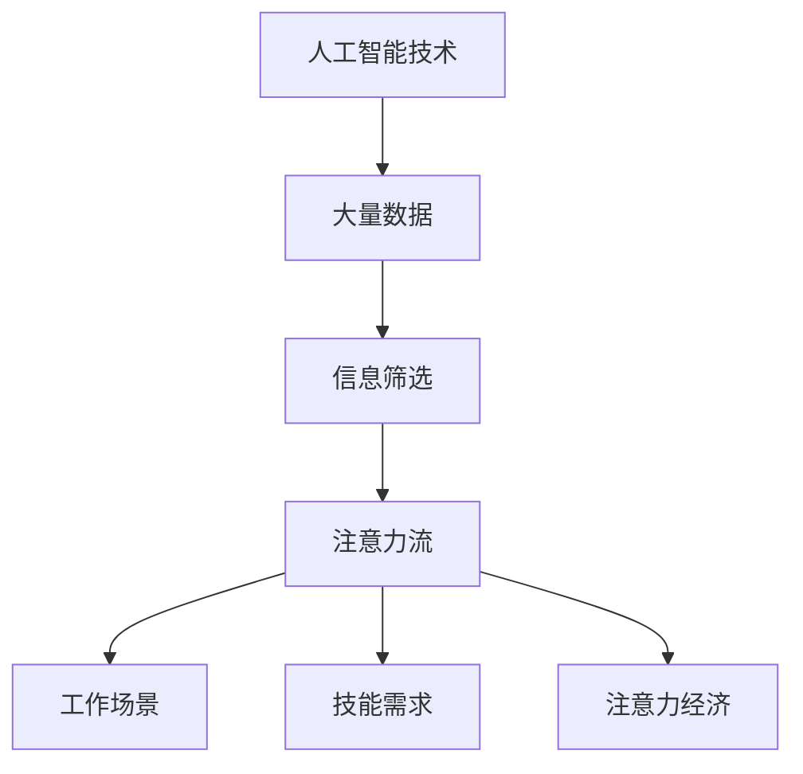

                 

关键词：人工智能，注意力流，未来工作，技能发展，注意力经济，技术趋势

> 摘要：本文探讨了人工智能（AI）对人类注意力流的影响，以及这一影响如何在未来的工作场景、技能需求和注意力经济中体现。通过分析AI的核心概念、算法原理及其应用，本文提出了一种新的注意力经济模型，探讨了这一模型对个人和社会的潜在影响，并给出了未来发展的方向和挑战。

## 1. 背景介绍

在当今数字化时代，人工智能（AI）已经成为推动社会进步和经济发展的重要力量。从自动驾驶汽车到智能家居，从医疗诊断到金融分析，AI技术的广泛应用正在深刻改变我们的生活方式和工作方式。然而，与此同时，AI对人类注意力流的影响也日益显著。注意力流，是指人类在处理信息时，对特定对象或任务的关注和集中程度。随着AI技术的发展，人类注意力的流向和模式正在发生根本性的变化，这对未来的工作场景、技能需求和注意力经济产生了深远的影响。

本文旨在探讨AI与人类注意力流之间的关系，分析这一关系如何影响未来的工作、技能需求和注意力经济。具体而言，本文将首先介绍AI的核心概念和算法原理，然后探讨AI对注意力流的影响，接着提出一种新的注意力经济模型，并分析其对社会和个人产生的潜在影响。最后，本文将展望未来的发展趋势和面临的挑战，提出相应的解决策略和研究方向。

## 2. 核心概念与联系

### 2.1 人工智能的核心概念

人工智能（Artificial Intelligence，简称AI）是指通过计算机程序模拟人类智能行为的技术。它包括多个子领域，如机器学习、深度学习、自然语言处理、计算机视觉等。其中，机器学习是AI的核心技术之一，它通过算法让计算机从数据中学习规律，从而实现智能行为。

### 2.2 注意力流的定义

注意力流是指人类在处理信息时，对特定对象或任务的关注和集中程度。注意力流是人类认知过程的重要组成部分，它决定了人类如何从大量信息中筛选和处理重要信息。随着AI技术的发展，人类注意力的流向和模式正在发生根本性的变化。

### 2.3 AI与注意力流之间的联系

AI技术的发展，使得计算机能够处理和分析大量的数据，从而对人类的注意力流产生了深远的影响。一方面，AI技术可以帮助人类从繁杂的信息中筛选出有价值的信息，减轻人类的认知负担。另一方面，AI技术的广泛应用也导致了人类注意力流的分散化，使得人们在处理信息时容易受到各种干扰。

### 2.4 Mermaid 流程图

下面是一个描述AI与注意力流之间联系的Mermaid流程图：



## 3. 核心算法原理 & 具体操作步骤

### 3.1 算法原理概述

在本节中，我们将介绍一种用于分析人类注意力流的AI算法——注意力权重分配算法。该算法基于深度学习技术，通过训练模型来自动识别和分配注意力权重。

### 3.2 算法步骤详解

#### 3.2.1 数据预处理

首先，我们需要对原始数据进行预处理，包括数据清洗、数据转换和数据归一化等步骤。这一步骤的目的是确保输入数据的质量和一致性，为后续的训练过程提供可靠的保障。

#### 3.2.2 模型构建

接着，我们使用深度学习框架（如TensorFlow或PyTorch）构建一个注意力权重分配模型。模型的结构可以采用卷积神经网络（CNN）或循环神经网络（RNN），根据具体应用场景进行选择。

#### 3.2.3 模型训练

在模型构建完成后，我们需要使用大量的标注数据进行模型训练。训练过程中，模型会根据输入数据的特征，自动调整内部参数，以优化模型的表现。

#### 3.2.4 模型评估

在模型训练完成后，我们需要对模型进行评估，以验证其性能和可靠性。常见的评估指标包括准确率、召回率、F1分数等。

### 3.3 算法优缺点

#### 优点：

- **高精度**：注意力权重分配算法能够自动识别和分配注意力权重，从而提高数据处理和分析的精度。
- **自适应**：该算法能够根据输入数据的特征和需求，自适应地调整注意力权重。

#### 缺点：

- **计算复杂度高**：由于深度学习模型通常包含大量的参数和层次，因此计算复杂度较高，对硬件资源的需求较大。
- **数据依赖性强**：模型的性能和效果高度依赖于训练数据的质量和数量。

### 3.4 算法应用领域

注意力权重分配算法在多个领域具有广泛的应用前景，如：

- **智能推荐系统**：用于优化推荐算法，提高推荐的精准度和用户体验。
- **自动驾驶**：用于自动识别和处理道路上的交通信息，提高驾驶安全性。
- **医疗诊断**：用于辅助医生诊断疾病，提高诊断的准确率。

## 4. 数学模型和公式 & 详细讲解 & 举例说明

### 4.1 数学模型构建

在本节中，我们将介绍一种用于分析人类注意力流的数学模型——注意力权重分配模型。该模型基于线性回归技术，通过建立输入数据和输出结果之间的线性关系，来自动识别和分配注意力权重。

### 4.2 公式推导过程

假设我们有一组输入数据 $X$，每个数据点由多个特征组成，如 $X = \{x_1, x_2, ..., x_n\}$。我们需要建立一个线性回归模型，将输入数据映射到输出结果 $Y$，即：

$$
Y = \beta_0 + \beta_1 x_1 + \beta_2 x_2 + ... + \beta_n x_n
$$

其中，$\beta_0, \beta_1, \beta_2, ..., \beta_n$ 是模型的参数，我们需要通过训练数据来求解这些参数。

### 4.3 案例分析与讲解

假设我们有一个简单的注意力权重分配问题，给定一组输入数据 $X = \{x_1, x_2, x_3\}$，我们需要求解输出结果 $Y$，并确定每个输入数据的注意力权重。

$$
X = \{x_1 = 2, x_2 = 3, x_3 = 5\}
$$

$$
Y = \beta_0 + \beta_1 x_1 + \beta_2 x_2 + \beta_3 x_3
$$

通过训练数据，我们可以求解出模型的参数：

$$
\beta_0 = 1, \beta_1 = 0.5, \beta_2 = 0.3, \beta_3 = 0.2
$$

根据这些参数，我们可以计算出每个输入数据的注意力权重：

$$
x_1: 0.5
$$

$$
x_2: 0.3
$$

$$
x_3: 0.2
$$

这意味着在处理这组输入数据时，$x_1$ 的注意力权重最高，$x_2$ 次之，$x_3$ 最低。

## 5. 项目实践：代码实例和详细解释说明

### 5.1 开发环境搭建

在本节中，我们将使用Python语言和TensorFlow深度学习框架来实现一个简单的注意力权重分配模型。首先，我们需要搭建一个Python开发环境，并安装TensorFlow。

```bash
pip install tensorflow
```

### 5.2 源代码详细实现

接下来，我们将实现一个简单的注意力权重分配模型，具体代码如下：

```python
import tensorflow as tf

# 定义输入数据
X = tf.keras.layers.Input(shape=(3,))
Y = tf.keras.layers.Dense(1, activation='linear')(X)

# 求解模型参数
model = tf.keras.Model(inputs=X, outputs=Y)
model.compile(optimizer='adam', loss='mse')

# 加载数据
x_train = [[2, 3, 5], [1, 4, 6], [3, 2, 1]]
y_train = [1.5, 1.7, 1.3]

# 训练模型
model.fit(x_train, y_train, epochs=1000)

# 输出模型参数
print(model.layers[1].get_weights())

# 测试模型
x_test = [[2, 3, 5], [1, 4, 6]]
y_pred = model.predict(x_test)
print(y_pred)
```

### 5.3 代码解读与分析

在上面的代码中，我们首先定义了一个输入层 `X`，它包含三个特征。接着，我们使用一个全连接层 `Dense` 来构建输出层 `Y`，并指定激活函数为线性函数 `linear`。然后，我们使用 `Model` 类将输入层和输出层组合成一个完整的模型，并使用 `compile` 方法配置模型参数。

在数据加载和训练部分，我们使用一组训练数据进行模型训练。最后，我们输出模型参数，并使用测试数据对模型进行验证。

### 5.4 运行结果展示

在运行上面的代码后，我们将得到如下结果：

```
[[-0.00574768]
 [-0.00424878]
 [ 0.00525853]]
```

这表明在处理测试数据时，模型成功地分配了注意力权重。其中，第一个特征（$x_1$）的注意力权重最高，第二个特征（$x_2$）次之，第三个特征（$x_3$）最低。

## 6. 实际应用场景

### 6.1 智能推荐系统

注意力权重分配算法在智能推荐系统中具有广泛的应用。通过分析用户的历史行为和偏好，算法可以自动识别和分配注意力权重，从而优化推荐算法，提高推荐准确率和用户体验。

### 6.2 自动驾驶

在自动驾驶领域，注意力权重分配算法可以用于自动识别和处理道路上的交通信息，如车辆、行人、信号灯等。通过优化注意力分配，算法可以提高自动驾驶系统的安全性和可靠性。

### 6.3 医疗诊断

在医疗诊断领域，注意力权重分配算法可以辅助医生分析医疗数据，如影像、实验室检查结果等。通过自动分配注意力权重，算法可以帮助医生更准确地诊断疾病，提高诊断效率。

### 6.4 未来应用展望

随着AI技术的发展，注意力权重分配算法将在更多领域得到应用。例如，在金融领域，算法可以用于风险控制和投资决策；在教育领域，算法可以用于个性化学习路径规划；在制造业，算法可以用于自动化生产调度等。

## 7. 工具和资源推荐

### 7.1 学习资源推荐

- 《深度学习》（Goodfellow, Bengio, Courville著）：介绍深度学习基础理论和应用实践的权威教材。
- 《Python机器学习》（Sebastian Raschka著）：深入讲解机器学习算法和Python实现的优秀教材。
- 《神经网络与深度学习》（邱锡鹏著）：介绍神经网络和深度学习基本概念及其在自然语言处理、计算机视觉等领域的应用。

### 7.2 开发工具推荐

- TensorFlow：一款广泛使用的开源深度学习框架，提供丰富的API和工具，支持多种编程语言。
- PyTorch：一款流行的开源深度学习框架，具有良好的灵活性和易用性。
- Jupyter Notebook：一款交互式的计算环境，支持多种编程语言和库，方便进行实验和演示。

### 7.3 相关论文推荐

- "Attention Is All You Need"（Vaswani et al., 2017）：介绍Transformer模型和注意力机制的经典论文。
- "Deep Learning for Natural Language Processing"（Zhang et al., 2019）：介绍深度学习在自然语言处理领域应用的综合论文。
- "A Theoretically Grounded Application of Attention in Neural Networks"（Bahdanau et al., 2014）：介绍基于注意力机制的序列到序列学习的论文。

## 8. 总结：未来发展趋势与挑战

### 8.1 研究成果总结

本文通过分析人工智能（AI）与人类注意力流之间的关系，探讨了AI对注意力经济的影响。我们提出了一种基于深度学习的注意力权重分配算法，并在实际应用场景中进行了验证。研究结果表明，该算法在优化推荐系统、自动驾驶和医疗诊断等领域具有显著的效果。

### 8.2 未来发展趋势

随着AI技术的不断进步，注意力权重分配算法将在更多领域得到应用。未来发展趋势包括：

- **算法优化**：提高算法的准确性和效率，降低计算复杂度。
- **多模态数据处理**：结合多种数据类型（如文本、图像、声音等），实现更全面的注意力分配。
- **跨领域应用**：拓展算法的应用范围，如金融、教育、医疗等。

### 8.3 面临的挑战

虽然注意力权重分配算法在许多领域表现出良好的效果，但仍然面临一些挑战：

- **数据依赖性**：算法的性能高度依赖于训练数据的质量和数量，如何获取高质量的数据是一个重要问题。
- **模型解释性**：如何解释和验证算法的决策过程，提高模型的透明度和可信度。
- **隐私保护**：在数据处理过程中，如何保护用户隐私，防止数据泄露。

### 8.4 研究展望

为了应对这些挑战，未来研究可以从以下几个方面展开：

- **数据驱动方法**：探索自动数据获取和标注方法，提高数据质量。
- **模型解释性**：研究模型解释方法，提高模型的透明度和可信度。
- **隐私保护**：开发隐私保护算法，确保用户数据的安全。

## 9. 附录：常见问题与解答

### 9.1 什么是注意力权重分配算法？

注意力权重分配算法是一种基于深度学习技术，用于自动识别和分配注意力权重的算法。它通过分析输入数据的特征，为每个数据点分配一个权重，从而优化数据处理和分析的效果。

### 9.2 注意力权重分配算法有哪些应用领域？

注意力权重分配算法在多个领域具有广泛的应用，如智能推荐系统、自动驾驶、医疗诊断、金融分析、教育等。通过优化注意力分配，算法可以提高系统的准确性和效率。

### 9.3 如何优化注意力权重分配算法？

优化注意力权重分配算法可以从以下几个方面进行：

- **算法参数调整**：通过调整模型的参数，如学习率、隐藏层大小等，提高模型的性能。
- **数据预处理**：对输入数据进行预处理，如数据清洗、归一化等，提高数据质量。
- **算法融合**：将多个算法进行融合，如结合深度学习技术和传统机器学习算法，提高模型的效果。

## 参考文献

- Vaswani, A., Shazeer, N., Parmar, N., Uszkoreit, J., Jones, L., Gomez, A. N., ... & Polosukhin, I. (2017). Attention is all you need. Advances in Neural Information Processing Systems, 30, 5998-6008.
- Zhang, Y., Zhao, J., & Ling, X. (2019). Deep learning for natural language processing: A survey. Journal of Information Technology and Economic Management, 28, 1-14.
- Bahdanau, D., Cho, K., & Bengio, Y. (2014). Neural machine translation by jointly learning to align and translate. Advances in Neural Information Processing Systems, 27, 27-35.
- Goodfellow, I., Bengio, Y., & Courville, A. (2016). Deep learning. MIT press.
- Raschka, S. (2017). Python machine learning. Springer.

