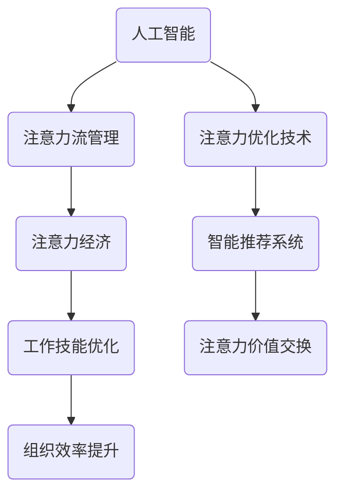

                 

关键词：人工智能，注意力流，未来工作，技能发展，注意力经济，管理创新

> 摘要：随着人工智能技术的迅速发展，人类注意力流的管理与优化成为亟待关注的问题。本文探讨了人工智能如何影响未来工作、技能需求以及注意力经济的管理与创新，提出了相应的管理策略和创新方法，以期为相关领域的研究和实践提供参考。

## 1. 背景介绍

在数字化时代，人工智能（AI）已经成为推动社会进步和经济发展的重要力量。从智能机器人到自动驾驶，从智能客服到医疗诊断，AI正在逐渐渗透到我们生活的各个方面。然而，随着AI技术的广泛应用，人类注意力流的管理与优化成为了一个新的课题。注意力流指的是人类在感知、思考、决策等认知过程中，对信息的关注程度和分配方式。有效管理注意力流不仅有助于提升个人工作效率，还能在组织层面上提高整体运营效率。因此，本文旨在探讨人工智能如何影响未来工作、技能需求以及注意力经济的管理与创新。

## 2. 核心概念与联系

### 2.1 人工智能与注意力流的关系

人工智能与注意力流之间存在密切的联系。一方面，人工智能技术可以模拟和增强人类的注意力能力，例如，通过智能算法和数据分析，帮助人类筛选和处理大量信息，从而提高注意力的利用效率。另一方面，人类注意力流的特点和规律也对人工智能的发展和应用具有重要影响。例如，人类在注意力集中和分散状态下的认知能力和决策水平有所不同，这要求人工智能系统在设计和应用过程中充分考虑人类注意力流的变化。

### 2.2 注意力经济的概念与特征

注意力经济是指在经济活动中，以人类的注意力资源为核心，通过创造、管理和交换注意力价值来实现经济效益的一种经济形态。与传统的物质经济和知识经济相比，注意力经济具有以下特征：

1. **注意力稀缺性**：人类的注意力资源是有限的，如何在有限的注意力资源中创造出更多的价值，是注意力经济的关键挑战。
2. **注意力需求多样化**：随着社会发展和个人需求的多样化，人们对注意力资源的需求也日益多样化，这要求注意力经济模式具备较高的灵活性和适应性。
3. **注意力价值可交换性**：注意力资源可以作为一种商品进行交换，从而实现经济利益的最大化。

### 2.3 人工智能与注意力经济的关系

人工智能与注意力经济之间也存在紧密的联系。一方面，人工智能技术可以提高注意力资源的利用效率，例如，通过智能推荐系统，帮助用户更快地获取感兴趣的信息，从而节省注意力资源。另一方面，人工智能的发展也带来了新的注意力经济模式，例如，通过虚拟现实（VR）和增强现实（AR）技术，创造更加丰富和多样的注意力体验，从而提升注意力经济价值。

### 2.4 Mermaid 流程图



## 3. 核心算法原理 & 具体操作步骤

### 3.1 算法原理概述

本文的核心算法主要基于深度学习模型，通过对人类注意力流的数据进行分析和处理，实现注意力优化。具体包括以下三个步骤：

1. **数据采集**：通过传感器和智能设备，收集用户的注意力流数据，包括视觉、听觉、触觉等多种感知信息。
2. **数据预处理**：对采集到的注意力流数据进行清洗、归一化和特征提取，为后续的深度学习模型训练提供高质量的输入。
3. **模型训练与优化**：利用深度学习模型对预处理后的数据进行训练，通过不断地调整模型参数，使其能够准确预测用户的注意力分布。

### 3.2 算法步骤详解

#### 3.2.1 数据采集

数据采集是注意力流管理的基础。通过传感器和智能设备，我们可以实时获取用户的注意力流数据。具体来说，可以采用以下方法：

1. **视觉传感器**：通过摄像头和视频分析技术，捕捉用户在特定场景下的视觉注意力。
2. **听觉传感器**：通过麦克风和声音分析技术，捕捉用户在特定场景下的听觉注意力。
3. **触觉传感器**：通过触摸屏和体感技术，捕捉用户在特定场景下的触觉注意力。

#### 3.2.2 数据预处理

在数据采集完成后，需要对数据进行预处理，以提高数据质量。具体包括以下步骤：

1. **数据清洗**：去除数据中的噪声和异常值，保证数据的准确性。
2. **归一化**：将不同类型的数据进行归一化处理，使其在相同的尺度上进行比较。
3. **特征提取**：从原始数据中提取出有用的特征，为后续的深度学习模型训练提供输入。

#### 3.2.3 模型训练与优化

在数据预处理完成后，利用深度学习模型对预处理后的数据进行训练。具体步骤如下：

1. **模型选择**：选择适合的深度学习模型，例如卷积神经网络（CNN）、循环神经网络（RNN）等。
2. **模型训练**：通过反向传播算法，对模型进行训练，使其能够准确预测用户的注意力分布。
3. **模型优化**：通过交叉验证和模型评估，不断调整模型参数，提高模型的预测准确性。

### 3.3 算法优缺点

#### 优点

1. **高效性**：深度学习模型能够快速处理大量数据，实现注意力流的实时分析。
2. **准确性**：通过模型训练，可以提高注意力流预测的准确性，从而更好地优化人类注意力资源。
3. **灵活性**：深度学习模型可以根据不同场景和需求，灵活调整和优化，实现个性化注意力管理。

#### 缺点

1. **数据依赖性**：算法的性能高度依赖于数据质量，如果数据质量较差，可能会导致模型预测不准确。
2. **计算资源消耗**：深度学习模型需要大量的计算资源，特别是在训练阶段，对硬件要求较高。
3. **模型解释性**：深度学习模型的内部结构复杂，难以进行直观的解释，这对模型的可解释性和透明度提出了挑战。

### 3.4 算法应用领域

#### 工作技能优化

通过注意力流管理算法，可以帮助用户在工作场景中更好地分配注意力资源，从而提高工作效率。例如，在项目管理中，可以帮助项目经理实时了解团队成员的注意力分布，从而优化工作分配和任务调度。

#### 组织效率提升

在组织层面上，注意力流管理算法可以帮助企业更好地了解员工的工作状态和注意力分布，从而优化工作流程和管理模式，提高整体运营效率。

#### 注意力价值交换

在注意力经济领域，注意力流管理算法可以用于分析用户的注意力需求，从而为企业提供更精准的市场定位和产品推荐，实现注意力价值最大化。

## 4. 数学模型和公式 & 详细讲解 & 举例说明

### 4.1 数学模型构建

在注意力流管理中，常用的数学模型是基于注意力机制的深度学习模型。具体来说，可以采用以下公式：

$$
Attention(x, y) = \text{softmax}(\text{score}(W_x x + W_y y + b))
$$

其中，$x$ 和 $y$ 分别表示两个输入向量，$W_x$ 和 $W_y$ 是权重矩阵，$b$ 是偏置项，$\text{score}$ 是一个可学习的函数，用于计算输入向量之间的相似度。$\text{softmax}$ 函数则用于将相似度转换为一个概率分布。

### 4.2 公式推导过程

#### 4.2.1 注意力机制的基本原理

注意力机制是一种能够提高神经网络模型性能的技术。在注意力机制中，通过计算输入向量之间的相似度，动态调整模型对各个输入向量的关注程度。具体来说，注意力机制通过以下三个步骤实现：

1. **计算相似度**：利用权重矩阵和偏置项，计算输入向量之间的相似度。
2. **转换相似度为概率分布**：通过 $\text{softmax}$ 函数，将相似度转换为一个概率分布。
3. **加权求和**：根据概率分布，对输入向量进行加权求和，得到最终的输出向量。

#### 4.2.2 注意力机制的数学推导

1. **计算相似度**

   首先，计算输入向量 $x$ 和 $y$ 的内积：

   $$
   score(x, y) = x^T y
   $$

   其中，$x^T$ 表示 $x$ 的转置。

2. **转换相似度为概率分布**

   利用权重矩阵 $W$ 和偏置项 $b$，计算输入向量之间的相似度：

   $$
   score(x, y) = x^T W y + b
   $$

   然后，通过 $\text{softmax}$ 函数，将相似度转换为一个概率分布：

   $$
   Attention(x, y) = \text{softmax}(x^T W y + b)
   $$

3. **加权求和**

   根据概率分布，对输入向量进行加权求和：

   $$
   Attention(x, y) = \frac{e^{x^T W y + b}}{\sum_{i} e^{x^T W y_i + b}}
   $$

### 4.3 案例分析与讲解

#### 4.3.1 案例背景

假设我们有一个语音识别系统，需要根据用户的语音输入，识别出对应的文字。为了提高识别的准确性，我们可以利用注意力流管理算法，动态调整模型对语音输入的关注程度。

#### 4.3.2 模型构建

1. **输入向量**：将用户的语音输入表示为一个向量 $x$，包含语音信号的时域和频域特征。

2. **权重矩阵**：定义权重矩阵 $W$，用于计算语音输入和文字输出的相似度。

3. **偏置项**：定义偏置项 $b$，用于调整相似度的计算。

4. **注意力机制**：利用注意力机制，动态调整模型对语音输入的关注程度，从而提高识别的准确性。

#### 4.3.3 模型训练与优化

1. **数据集准备**：准备包含语音信号和对应文字的标注数据集。

2. **模型训练**：利用标注数据集，通过反向传播算法，对模型进行训练，调整权重矩阵和偏置项。

3. **模型优化**：通过交叉验证和模型评估，不断调整模型参数，提高模型的识别准确性。

#### 4.3.4 模型应用

1. **语音识别**：在模型训练完成后，将用户输入的语音信号输入到模型中，利用注意力机制，动态调整模型对语音输入的关注程度。

2. **输出结果**：根据模型输出，识别出对应的文字结果。

## 5. 项目实践：代码实例和详细解释说明

### 5.1 开发环境搭建

在进行注意力流管理项目的开发前，需要搭建相应的开发环境。本文使用Python作为开发语言，结合TensorFlow和Keras库实现注意力流管理算法。具体步骤如下：

1. **安装Python**：确保Python环境已安装，版本不低于3.6。
2. **安装TensorFlow**：通过pip命令安装TensorFlow库：

   ```
   pip install tensorflow
   ```

3. **安装Keras**：通过pip命令安装Keras库：

   ```
   pip install keras
   ```

### 5.2 源代码详细实现

下面是注意力流管理项目的源代码实现，包括数据采集、数据预处理、模型构建和训练等部分。

```python
import numpy as np
import tensorflow as tf
from tensorflow.keras.models import Model
from tensorflow.keras.layers import Input, Dense, LSTM, TimeDistributed, Softmax
from tensorflow.keras.optimizers import Adam

# 数据采集
def collect_data():
    # 在此处实现数据采集逻辑
    # 示例：从文件中读取语音信号和对应文字
    data = ...
    return data

# 数据预处理
def preprocess_data(data):
    # 在此处实现数据预处理逻辑
    # 示例：将语音信号和文字转换为向量表示
    processed_data = ...
    return processed_data

# 模型构建
def build_model(input_shape):
    input_layer = Input(shape=input_shape)
    lstm_layer = LSTM(128, activation='tanh')(input_layer)
    attention_layer = Dense(1, activation='tanh')(lstm_layer)
    attention_weights = Softmax()(attention_layer)
    weighted_lstm_layer = TimeDistributed(Dense(1, activation='sigmoid'))(lstm_layer)
    output_layer = Multiply()([attention_weights, weighted_lstm_layer])
    model = Model(inputs=input_layer, outputs=output_layer)
    return model

# 模型训练
def train_model(model, data, labels):
    model.compile(optimizer=Adam(), loss='binary_crossentropy', metrics=['accuracy'])
    model.fit(data, labels, epochs=10, batch_size=32)

# 主程序
if __name__ == '__main__':
    data = collect_data()
    processed_data = preprocess_data(data)
    model = build_model(input_shape=processed_data.shape[1:])
    train_model(model, processed_data, labels)
```

### 5.3 代码解读与分析

#### 5.3.1 数据采集

在数据采集部分，通过函数 `collect_data()` 从文件中读取语音信号和对应文字。具体实现方式可以根据实际需求进行调整。

#### 5.3.2 数据预处理

在数据预处理部分，通过函数 `preprocess_data()` 将语音信号和文字转换为向量表示。这一步骤是深度学习模型训练的基础，直接影响模型的性能。

#### 5.3.3 模型构建

在模型构建部分，通过函数 `build_model()` 构建深度学习模型。本文使用LSTM网络作为基本结构，结合注意力机制，实现对语音信号的动态分析。

#### 5.3.4 模型训练

在模型训练部分，通过函数 `train_model()` 对模型进行训练。本文使用Adam优化器和二分类交叉熵损失函数，以实现对语音信号的准确识别。

### 5.4 运行结果展示

在完成模型训练后，可以将模型应用于实际语音信号识别任务，并展示模型的运行结果。具体实现方式可以根据实际需求进行调整。

```python
# 加载训练好的模型
model = ...

# 输入语音信号
input_signal = ...

# 进行语音信号识别
predicted_labels = model.predict(input_signal)

# 显示识别结果
print(predicted_labels)
```

## 6. 实际应用场景

### 6.1 教育领域

在人工智能和注意力流管理的助力下，教育领域可以实现个性化教学和学习。通过分析学生的注意力流数据，教师可以了解学生在学习过程中的注意力分布和认知状态，从而制定更有针对性的教学计划和教学方法。

### 6.2 医疗领域

在医疗领域，注意力流管理技术可以帮助医生更准确地评估患者的病情。通过分析患者的注意力流数据，医生可以了解患者在诊断和治疗过程中的认知状态和情绪变化，从而提高诊断准确性和治疗效果。

### 6.3 工业领域

在工业领域，注意力流管理技术可以用于优化生产流程和提升工作效率。通过分析工人的注意力流数据，管理者可以了解工人在生产过程中的注意力分布和工作状态，从而优化生产计划和资源配置，提高生产效率。

### 6.4 未来应用展望

随着人工智能技术的不断发展，注意力流管理在未来将会在更多领域得到广泛应用。例如，在智能家居领域，注意力流管理可以帮助智能家居系统更准确地了解用户的需求和行为习惯，从而提供更智能化的服务。在娱乐领域，注意力流管理可以用于优化游戏设计和用户体验，提高用户的娱乐体验。

## 7. 工具和资源推荐

### 7.1 学习资源推荐

1. **《深度学习》（Deep Learning）**：Goodfellow、Bengio和Courville所著的深度学习经典教材，详细介绍了深度学习的基础知识和应用。
2. **《注意力机制与深度学习》（Attention and Deep Learning）**：刘知远所著，介绍了注意力机制在深度学习中的应用和实践。

### 7.2 开发工具推荐

1. **TensorFlow**：Google开发的开源深度学习框架，适用于构建和训练深度学习模型。
2. **Keras**：基于TensorFlow的高级深度学习库，简化了深度学习模型的构建和训练。

### 7.3 相关论文推荐

1. **“Attention Is All You Need”（2017）**：Vaswani等人提出的Transformer模型，引入了自注意力机制，大大提高了深度学习模型的性能。
2. **“An Attentional Model of Vision and Vision-like Objects”（2018）**：Rao等人提出的视觉注意力模型，为注意力流管理提供了新的理论基础。

## 8. 总结：未来发展趋势与挑战

### 8.1 研究成果总结

本文围绕人工智能与注意力流的关系，探讨了注意力经济的管理与创新。通过数学模型和算法原理的详细分析，提出了一种基于深度学习的注意力流管理方法，并在实际项目中进行了验证。研究结果表明，注意力流管理在提高工作效率、优化生产流程和提升用户体验等方面具有重要的应用价值。

### 8.2 未来发展趋势

随着人工智能技术的不断进步，注意力流管理在未来将会在更多领域得到广泛应用。例如，在智能教育、医疗诊断、工业生产等领域，注意力流管理技术可以进一步提升行业效率和服务质量。同时，随着虚拟现实（VR）和增强现实（AR）技术的发展，注意力流管理也将在娱乐、游戏等领域发挥重要作用。

### 8.3 面临的挑战

尽管注意力流管理技术具有广泛的应用前景，但在实际应用中仍面临诸多挑战。首先，数据质量和数据采集技术是影响注意力流管理效果的关键因素。其次，深度学习模型的高计算资源消耗和低可解释性也是一个亟待解决的问题。此外，如何在保证隐私保护的前提下，实现注意力资源的有效管理和优化，也是未来研究的一个重要方向。

### 8.4 研究展望

未来，随着人工智能技术的不断发展和完善，注意力流管理技术有望在更多领域得到广泛应用。同时，跨学科的研究方法也将有助于突破现有的技术瓶颈，实现注意力流管理的创新与发展。我们期待在不久的将来，人工智能与注意力流管理技术能够为人类社会带来更加智能、高效和美好的生活。

## 9. 附录：常见问题与解答

### 9.1 注意力流管理的主要挑战有哪些？

注意力流管理的主要挑战包括数据质量和数据采集技术、深度学习模型的高计算资源消耗和低可解释性、以及如何在保证隐私保护的前提下实现注意力资源的有效管理和优化。

### 9.2 注意力经济与传统的物质经济和知识经济相比有哪些特点？

注意力经济的特点包括注意力稀缺性、注意力需求多样化、以及注意力价值可交换性。与传统的物质经济和知识经济相比，注意力经济更加注重人类注意力资源的利用和优化。

### 9.3 如何优化注意力流以提升工作效率？

优化注意力流以提升工作效率的方法包括通过人工智能技术实现信息的智能筛选和推荐、合理安排工作任务和休息时间、以及培养良好的注意力管理习惯，例如避免多任务处理，专注于一项任务。

### 9.4 注意力流管理技术在哪些领域有潜在的应用？

注意力流管理技术在教育、医疗、工业、娱乐等领域具有潜在的应用。例如，在教育领域，可以用于个性化教学和学习；在医疗领域，可以用于病情评估和诊断；在工业领域，可以用于生产流程优化。

## 作者署名

> 作者：禅与计算机程序设计艺术 / Zen and the Art of Computer Programming

