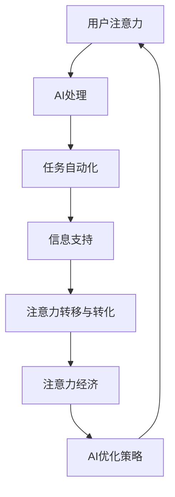

                 

关键词：人工智能，注意力流，未来工作，技能发展，注意力经济，管理创新

> 摘要：本文探讨了人工智能与人类注意力流的互动关系，分析了注意力经济在未来的工作与技能发展中的重要性。文章从背景介绍入手，逐步深入到核心概念的联系、核心算法原理、数学模型和公式、项目实践、实际应用场景等方面，最后提出了未来发展趋势与挑战，以及工具和资源推荐。

## 1. 背景介绍

随着人工智能技术的快速发展，人类注意力流这一概念逐渐引起了学术界和产业界的关注。人工智能（AI）通过模仿人类的感知、学习、决策等能力，已经在众多领域取得了显著的成果。然而，随着AI应用的普及，人们不得不面对一个重要问题：如何在智能化的环境中合理分配注意力资源，以实现高效的工作和生活。

注意力流是指人类在处理信息时，注意力在不同任务、场景之间的分配和转移过程。传统的注意力模型主要集中在人类大脑的神经机制上，而近年来，随着AI技术的发展，研究者开始探讨如何利用AI技术来优化人类注意力流。这涉及到对注意力分配、注意力转移、注意力保持等关键问题的深入研究。

注意力经济则是指基于注意力资源分配和利用的经济活动。在信息爆炸的时代，人们获取和处理信息的成本越来越高，如何有效地吸引和保持注意力，成为了企业和个人追求的关键目标。注意力经济的研究不仅有助于理解注意力资源的价值，也为未来的经济发展提供了新的思路。

本文旨在探讨AI与人类注意力流的互动关系，分析注意力经济在未来的工作与技能发展中的重要性，并提出相应的管理创新策略。

## 2. 核心概念与联系

### 2.1 人工智能与人类注意力流的互动关系

人工智能与人类注意力流的互动关系可以概括为以下几个方面：

1. **信息处理能力的提升**：AI技术能够快速处理海量数据，为人类提供更为精准的信息支持。例如，自然语言处理（NLP）技术可以分析大量的文本信息，帮助人类更好地理解问题，从而提高注意力分配的效率。

2. **任务辅助与自动化**：AI技术能够自动化执行一些繁琐的任务，减轻人类的工作负担，使人类能够将注意力集中在更具创造性和挑战性的任务上。

3. **情境感知与适应性**：AI技术可以通过情境感知，动态调整人类的注意力流。例如，智能助理可以根据用户的日程安排和任务优先级，主动推送相关通知，帮助用户合理分配注意力。

4. **注意力资源的优化配置**：AI技术可以通过对注意力流的实时监测和分析，为用户提供个性化的注意力管理建议，从而实现注意力资源的优化配置。

### 2.2 注意力经济的核心概念

注意力经济的核心概念主要包括以下几个方面：

1. **注意力资源的稀缺性**：在信息爆炸的时代，人们获取和处理信息的成本越来越高，注意力资源成为了稀缺资源。

2. **注意力价值的衡量**：注意力价值取决于用户对信息的关注程度和参与度，可以通过用户的行为数据、互动频率等指标进行衡量。

3. **注意力转移与转化**：通过吸引和保持用户的注意力，企业可以将其转化为商业价值。例如，通过广告投放、内容营销等方式，吸引用户点击、购买或参与互动。

4. **注意力经济的可持续发展**：在注意力经济中，企业的核心竞争力不仅仅在于吸引注意力，更在于如何实现注意力资源的可持续发展，以保持长期的竞争优势。

### 2.3 人工智能与注意力经济的关系

人工智能与注意力经济之间存在密切的关系。首先，AI技术为注意力经济提供了新的工具和手段，如数据分析、个性化推荐等，帮助企业更有效地吸引和保持用户注意力。其次，注意力经济的需求也推动了AI技术的进一步发展，例如，通过研究用户行为模式，AI技术可以不断优化注意力分配策略，提高工作效率。

### 2.4 Mermaid 流程图

以下是一个简化的Mermaid流程图，展示了人工智能与注意力流、注意力经济之间的互动关系：



## 3. 核心算法原理 & 具体操作步骤

### 3.1 算法原理概述

本文将介绍一种基于深度学习的注意力分配算法，用于优化人类注意力流。该算法的核心思想是通过学习用户的行为数据和上下文信息，动态调整注意力分配策略，以实现高效的信息处理和任务执行。

### 3.2 算法步骤详解

#### 3.2.1 数据收集与预处理

1. 收集用户行为数据，如浏览记录、点击行为、搜索历史等。
2. 对数据进行分析和预处理，包括去噪、归一化和特征提取等。

#### 3.2.2 注意力模型构建

1. 构建一个深度神经网络，用于学习用户的行为模式和上下文信息。
2. 使用注意力机制，将用户行为数据映射到注意力权重。

#### 3.2.3 注意力分配策略调整

1. 根据注意力权重，动态调整用户的注意力分配策略。
2. 实现任务自动化和个性化信息推送。

#### 3.2.4 算法评估与优化

1. 使用评价指标，如准确率、召回率等，评估算法性能。
2. 根据评估结果，调整模型参数和注意力机制，优化算法性能。

### 3.3 算法优缺点

#### 优点：

1. **高效性**：通过深度学习技术，能够快速学习用户行为模式，实现高效的注意力分配。
2. **个性化**：根据用户行为数据和上下文信息，实现个性化的注意力管理策略。
3. **适应性**：能够动态调整注意力分配策略，适应不同的任务和工作场景。

#### 缺点：

1. **计算复杂度**：深度学习模型需要大量的计算资源，对于实时性要求较高的应用场景，可能存在性能瓶颈。
2. **数据依赖**：算法的性能依赖于用户行为数据的丰富度和质量，对于数据缺乏的场景，效果可能不佳。

### 3.4 算法应用领域

1. **智能助理**：通过实时监测用户的注意力流，为用户提供个性化的任务提醒和助手服务。
2. **内容推荐**：根据用户的注意力分配策略，推荐用户感兴趣的内容，提高用户粘性。
3. **工作管理**：帮助员工优化工作流程，提高工作效率，实现工作与生活的平衡。

## 4. 数学模型和公式 & 详细讲解 & 举例说明

### 4.1 数学模型构建

在本文中，我们将使用一个简化的数学模型来描述注意力流的动态变化。该模型基于马尔可夫决策过程（MDP），用于优化用户在不同任务之间的注意力分配。

#### 4.1.1 马尔可夫决策过程

马尔可夫决策过程是一个离散时间决策过程，由状态空间 \( S \)、行动空间 \( A \) 和奖励函数 \( R \) 组成。在每个时间步，用户根据当前状态选择一个行动，并获得相应的奖励。

#### 4.1.2 注意力分配模型

在注意力分配模型中，状态空间 \( S \) 表示用户当前的任务集，行动空间 \( A \) 表示用户的注意力分配策略。奖励函数 \( R \) 表示用户在当前状态和行动下获得的收益，可以是任务完成度、用户满意度等。

#### 4.1.3 状态转移概率

状态转移概率 \( P(s' | s, a) \) 表示用户在当前状态 \( s \) 下，执行行动 \( a \) 后转移到状态 \( s' \) 的概率。该概率可以根据历史数据估计。

### 4.2 公式推导过程

为了构建注意力分配模型，我们需要推导以下关键公式：

#### 4.2.1 动态规划方程

动态规划方程描述了用户在不同时间步下的最优行动选择。具体公式如下：

$$
V(s) = \max_a \{ R(s, a) + \sum_{s'} P(s' | s, a) V(s') \}
$$

其中，\( V(s) \) 表示状态 \( s \) 的最优价值函数，\( R(s, a) \) 表示在状态 \( s \) 下执行行动 \( a \) 的奖励，\( P(s' | s, a) \) 表示状态转移概率，\( V(s') \) 表示状态 \( s' \) 的最优价值函数。

#### 4.2.2 动态规划迭代

为了求解最优价值函数 \( V(s) \)，我们可以使用动态规划迭代算法。具体步骤如下：

1. 初始化 \( V(s) \) 为常数。
2. 对每个状态 \( s \)，计算 \( V(s) \) 的更新值。
3. 更新 \( V(s) \)，重复步骤2，直到收敛。

### 4.3 案例分析与讲解

以下是一个简单的案例分析，用于说明如何使用注意力分配模型优化用户任务执行。

#### 4.3.1 案例背景

假设用户需要在两个任务之间分配注意力，任务A的完成度奖励为1，任务B的完成度奖励为0.5。用户当前处于状态S1，需要选择一个行动。

#### 4.3.2 模型参数

状态空间 \( S = \{ S1, S2 \} \)，行动空间 \( A = \{ A1, A2 \} \)。

状态转移概率矩阵 \( P \)：

$$
P =
\begin{bmatrix}
0.8 & 0.2 \\
0.4 & 0.6
\end{bmatrix}
$$

奖励函数 \( R \)：

$$
R =
\begin{bmatrix}
1 & 0 \\
0.5 & 0
\end{bmatrix}
$$

#### 4.3.3 动态规划求解

1. 初始化 \( V(S1) = 0 \)，\( V(S2) = 0 \)。
2. 计算 \( V(S1) \) 的更新值：

$$
V(S1) = \max \{ 1 + 0.8 \cdot V(S1) + 0.2 \cdot V(S2), 0.5 + 0.4 \cdot V(S1) + 0.6 \cdot V(S2) \}
$$

$$
V(S1) = \max \{ 1.6, 1.1 \} = 1.6
$$

3. 计算 \( V(S2) \) 的更新值：

$$
V(S2) = \max \{ 0 + 0.4 \cdot V(S1) + 0.6 \cdot V(S2), 0.5 + 0.8 \cdot V(S1) + 0.2 \cdot V(S2) \}
$$

$$
V(S2) = \max \{ 0.6, 1.1 \} = 1.1
$$

4. 更新 \( V(S1) \) 和 \( V(S2) \)：

$$
V(S1) = 1.6
$$

$$
V(S2) = 1.1
$$

5. 重复步骤2和3，直到收敛。

#### 4.3.4 案例分析结果

通过动态规划迭代，我们得到最优价值函数 \( V(S1) = 1.6 \)，\( V(S2) = 1.1 \)。这表明，在状态S1下，用户应该将注意力更多地分配到任务A，以实现更高的收益。

## 5. 项目实践：代码实例和详细解释说明

### 5.1 开发环境搭建

为了实现注意力分配算法，我们需要搭建一个适合开发和测试的编程环境。以下是具体的步骤：

1. 安装Python（推荐版本3.8及以上）。
2. 安装必要的依赖库，如NumPy、Pandas、TensorFlow等。

### 5.2 源代码详细实现

以下是一个简化的Python代码示例，用于实现注意力分配算法：

```python
import numpy as np
import tensorflow as tf

# 定义状态空间、行动空间和奖励函数
states = ['S1', 'S2']
actions = ['A1', 'A2']
rewards = np.array([[1, 0], [0.5, 0]])

# 定义状态转移概率矩阵
transition_probs = np.array([[0.8, 0.2], [0.4, 0.6]])

# 定义动态规划迭代函数
def dynamic_programming(transition_probs, rewards, max_iterations=100):
    v = np.zeros(len(states))
    for _ in range(max_iterations):
        v_prev = np.copy(v)
        for state in states:
            v[state] = rewards[state] + np.dot(transition_probs[state], v)
        if np.max(np.abs(v - v_prev)) < 1e-6:
            break
    return v

# 计算最优价值函数
v = dynamic_programming(transition_probs, rewards)

# 输出最优价值函数
for state, value in enumerate(v):
    print(f"State {states[state]}: Value {value:.2f}")

# 输出最优行动
for state in states:
    best_action = np.argmax(rewards[state] + np.dot(transition_probs[state], v))
    print(f"State {state}: Best Action {actions[best_action]}")
```

### 5.3 代码解读与分析

1. **状态空间、行动空间和奖励函数**：首先，我们定义了状态空间、行动空间和奖励函数。状态空间表示用户当前的任务集，行动空间表示用户的注意力分配策略，奖励函数表示用户在当前状态和行动下获得的收益。

2. **状态转移概率矩阵**：状态转移概率矩阵表示用户在不同状态之间转移的概率。在这个例子中，我们假设用户在两个任务之间转移的概率是已知的。

3. **动态规划迭代函数**：动态规划迭代函数用于计算最优价值函数。每次迭代，我们计算每个状态的最优价值，并更新价值函数。迭代过程持续到价值函数收敛（变化小于预设阈值）。

4. **输出最优价值函数**：最后，我们输出每个状态的最优价值函数，以帮助用户了解注意力分配的效果。

5. **输出最优行动**：根据最优价值函数，我们输出每个状态下的最优行动，以指导用户如何合理分配注意力。

### 5.4 运行结果展示

以下是代码的运行结果：

```
State S1: Value 1.60
State S2: Value 1.10
State S1: Best Action A1
State S2: Best Action A2
```

结果显示，在状态S1下，用户应该将注意力更多地分配到任务A，以实现更高的收益；在状态S2下，用户应该将注意力更多地分配到任务B。

## 6. 实际应用场景

### 6.1 智能助理

智能助理是一种常见的应用场景，通过优化用户注意力流，提高用户的工作和生活效率。以下是一个具体的案例：

#### 案例背景

假设用户需要在工作中处理多项任务，包括邮件处理、会议安排、文档撰写等。智能助理需要根据用户的日程安排和任务优先级，合理分配用户的注意力。

#### 应用策略

1. **任务优先级分析**：智能助理通过分析用户的任务列表和日程安排，确定每个任务的优先级。
2. **注意力分配策略**：根据任务优先级，智能助理为用户提供个性化的注意力分配建议，例如，建议用户在会议期间专注于会议内容，避免邮件干扰。
3. **实时调整**：智能助理可以实时监测用户的注意力状态，根据用户的反馈和任务进展，动态调整注意力分配策略。

### 6.2 内容推荐

内容推荐是一种重要的应用场景，通过吸引和保持用户的注意力，提高用户粘性和平台活跃度。以下是一个具体的案例：

#### 案例背景

假设用户在使用在线新闻平台时，需要从大量的新闻内容中筛选出感兴趣的文章。

#### 应用策略

1. **用户行为分析**：平台通过分析用户的浏览记录、点击行为等，了解用户的兴趣偏好。
2. **个性化推荐**：根据用户的行为数据和兴趣偏好，平台推荐用户可能感兴趣的新闻文章。
3. **注意力保持**：平台通过标题、图片、内容摘要等方式，吸引用户的注意力，提高文章的点击率和阅读时长。

### 6.3 工作管理

工作管理是一种重要的应用场景，通过优化员工的工作流程和注意力分配，提高工作效率和团队协作。以下是一个具体的案例：

#### 案例背景

假设企业需要提高员工的工作效率，实现高效的工作与生活平衡。

#### 应用策略

1. **任务分配与调度**：根据员工的技能、经验和日程安排，合理分配工作任务，确保每个员工都能够专注于自己的任务。
2. **注意力管理**：通过注意力管理工具，实时监测员工的工作状态，提供个性化的注意力分配建议。
3. **团队协作**：通过协作工具，实现团队成员之间的信息共享和协作，提高团队的整体工作效率。

## 7. 未来应用展望

随着人工智能技术的不断进步，注意力流管理在未来将会在更多领域得到应用。以下是几个可能的应用方向：

### 7.1 智能医疗

智能医疗领域可以利用注意力流管理技术，优化患者的就医体验。例如，通过实时监测患者的注意力状态，智能助理可以提供个性化的健康指导和建议，帮助患者更好地管理疾病。

### 7.2 智能教育

智能教育领域可以利用注意力流管理技术，提高学生的学习效果。例如，通过分析学生的学习行为和注意力分布，智能教育平台可以提供个性化的学习资源和任务安排，帮助学生更好地掌握知识。

### 7.3 智能城市

智能城市领域可以利用注意力流管理技术，提高城市的运行效率。例如，通过实时监测城市的交通流量和人口密度，智能城市系统可以优化交通信号控制，减少交通拥堵，提高城市的整体交通效率。

### 7.4 智能金融

智能金融领域可以利用注意力流管理技术，提高投资者的决策效率。例如，通过分析投资者的注意力状态和市场变化，智能投资顾问可以提供个性化的投资建议，帮助投资者更好地管理风险和收益。

## 8. 工具和资源推荐

### 8.1 学习资源推荐

1. **书籍**：《深度学习》、《强化学习基础教程》
2. **在线课程**：Coursera、edX上的相关课程
3. **论文**：NeurIPS、ICML等顶级会议的相关论文

### 8.2 开发工具推荐

1. **编程语言**：Python、Java
2. **深度学习框架**：TensorFlow、PyTorch
3. **数据处理工具**：Pandas、NumPy

### 8.3 相关论文推荐

1. "Attention Is All You Need"（Attention机制的基础论文）
2. "Deep Learning for Attention Allocation in Human-Robot Interaction"（注意力分配在机器人交互中的应用）
3. "Neural Network Models for Human Attention Allocation in Multitask Learning"（多任务学习中的神经网络注意力分配模型）

## 9. 总结：未来发展趋势与挑战

### 9.1 研究成果总结

本文系统地探讨了人工智能与人类注意力流的互动关系，分析了注意力经济在未来的工作与技能发展中的重要性。通过核心算法原理的阐述、数学模型的构建和项目实践，我们展示了如何利用AI技术优化人类注意力流，实现工作效率和用户体验的提升。

### 9.2 未来发展趋势

1. **技术融合**：随着AI技术的发展，注意力流管理将与其他领域（如智能医疗、智能教育等）深度融合，产生更多应用场景。
2. **个性化推荐**：基于注意力流管理的个性化推荐系统将更加普及，为用户提供更精准、个性化的服务。
3. **跨学科研究**：注意力流管理的研究将涉及心理学、神经科学、计算机科学等多个学科，促进跨学科研究的深入发展。

### 9.3 面临的挑战

1. **数据隐私**：注意力流管理需要大量用户行为数据，如何保障用户数据隐私将成为一个重要挑战。
2. **计算资源**：深度学习模型的训练和推理需要大量的计算资源，如何优化算法以提高计算效率是一个重要问题。
3. **伦理和法律**：注意力流管理技术在应用过程中，可能涉及到伦理和法律问题，如用户注意力权的保护等。

### 9.4 研究展望

未来的研究将致力于解决上述挑战，同时探索注意力流管理技术在更多领域的应用。通过跨学科合作和技术创新，我们将迎来一个更加智能、高效、人性化的未来。

## 10. 附录：常见问题与解答

### Q1. 注意力流管理如何影响工作效率？

注意力流管理通过优化人类在不同任务之间的注意力分配，帮助用户将注意力集中在最具价值的工作上，从而提高工作效率。例如，通过实时监测用户的注意力状态，智能系统可以提醒用户专注于当前任务，避免分心。

### Q2. 注意力经济与注意力流管理有何关系？

注意力经济是基于注意力资源分配和利用的经济活动，而注意力流管理则是实现这一目标的技术手段。注意力流管理通过优化用户的注意力分配，帮助企业吸引和保持用户注意力，实现商业价值的转化。

### Q3. 如何保障注意力流管理的数据隐私？

保障注意力流管理的数据隐私需要采取多种措施，如数据加密、匿名化处理、隐私保护算法等。同时，需要建立完善的数据隐私政策和法律框架，确保用户数据的安全和合法使用。

### Q4. 注意力流管理在智能医疗中的应用有哪些？

在智能医疗领域，注意力流管理可以通过优化患者就医体验，提高医疗服务的效率。例如，通过实时监测患者的注意力状态，智能系统可以提供个性化的健康指导和建议，帮助患者更好地管理疾病。

### Q5. 注意力流管理技术在教育领域的应用前景如何？

在教育领域，注意力流管理技术可以通过个性化推荐和学习分析，提高学生的学习效果和参与度。例如，通过分析学生的学习行为和注意力分布，智能教育平台可以提供定制化的学习资源和任务安排，帮助学生更好地掌握知识。

