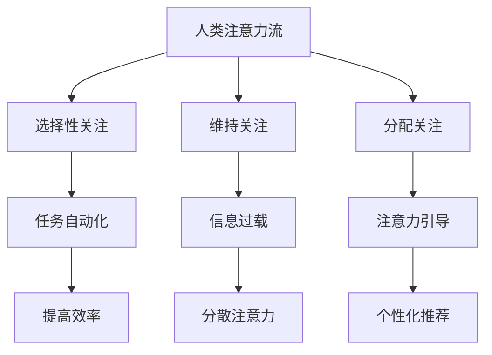

                 

关键词：人工智能、注意力流、工作生活管理、注意力管理策略、技术、未来发展

摘要：本文将探讨人工智能对人类注意力流的影响，以及如何通过注意力管理策略和技术提升工作效率和生活质量。文章分为八个部分，首先介绍人工智能与注意力流的关系，接着分析注意力管理的核心概念和理论，探讨未来发展趋势和挑战，最后提出具体的应用场景和推荐工具资源。

## 1. 背景介绍

随着人工智能（AI）技术的快速发展，人类的工作和生活正在发生翻天覆地的变化。在AI的协助下，许多重复性和繁琐的任务得以自动化，从而解放了人类的时间，使人们可以将更多的精力投入到更具创造性和思考性的工作中。然而，与此同时，人工智能也带来了一系列的挑战，尤其是对人类的注意力流产生了深远的影响。

注意力流是指人类在处理信息时，关注点和精力集中于特定任务或对象的能力。在过去，人类主要依靠自己的注意力流来完成各种任务。然而，随着信息的爆炸式增长和AI的普及，人们面临着越来越多的干扰和分散注意力的因素。这使得注意力管理成为了一个备受关注的话题。

本文旨在探讨人工智能与人类注意力流之间的关系，分析注意力管理的核心概念和理论，并提出一系列注意力管理策略和技术，以帮助人们在未来的工作、生活中更好地应对注意力分散的挑战。

## 2. 核心概念与联系

### 2.1 注意力流的概念

注意力流是指人类在处理信息时，关注点和精力集中于特定任务或对象的能力。注意力流包括以下几个方面：

- **选择性关注**：在众多的信息来源中，人类能够选择关注对自己最有价值的部分。
- **维持关注**：在处理信息的过程中，人类需要维持注意力流的持续性和稳定性。
- **分配关注**：当面对多个任务时，人类需要灵活地分配注意力流，以确保每个任务都能得到适当的关注。

### 2.2 人工智能与注意力流的关系

人工智能技术的发展，特别是自然语言处理、计算机视觉和智能推荐等领域的突破，极大地改变了人类的工作和生活方式。在这个过程中，人工智能对人类注意力流产生了以下几方面的影响：

- **任务自动化**：AI能够自动化许多重复性、繁琐的任务，从而解放人类的时间，使人们可以将更多的精力投入到更具创造性和思考性的工作中。
- **信息过载**：AI的普及导致了信息爆炸，人们面临着越来越多的干扰和分散注意力的因素，如社交媒体、电子邮件、即时通讯等。
- **注意力引导**：AI可以基于用户的行为和偏好，提供个性化的信息推荐，从而引导人类的注意力流，提高信息处理的效率。

### 2.3 Mermaid 流程图

下面是一个简单的 Mermaid 流程图，展示人工智能与注意力流之间的关系：



## 3. 核心算法原理 & 具体操作步骤

### 3.1 算法原理概述

注意力管理算法的核心思想是优化人类在信息处理过程中的注意力分配，以提高工作效率和生活质量。具体而言，算法包括以下几个步骤：

1. **注意力评估**：根据用户的任务需求、信息来源和偏好，评估每个任务的优先级和重要性。
2. **注意力分配**：根据评估结果，动态调整用户的注意力流，确保高优先级任务得到充分的关注。
3. **注意力维持**：通过设定提醒和反馈机制，帮助用户维持对任务的关注，避免注意力分散。
4. **注意力引导**：利用智能推荐技术，引导用户的注意力流，提高信息处理的效率。

### 3.2 算法步骤详解

1. **注意力评估**
   - **用户画像**：通过收集用户的行为数据、偏好和需求，构建用户画像。
   - **任务分类**：根据用户画像，将任务分为高、中、低优先级类别。
   - **重要性评估**：对每个任务进行重要性评估，包括任务的紧急程度、完成任务的难度、对用户价值等因素。

2. **注意力分配**
   - **优先级排序**：根据重要性评估结果，对任务进行优先级排序。
   - **动态调整**：根据用户的实际需求和任务变化，动态调整注意力分配策略，确保高优先级任务得到充分关注。

3. **注意力维持**
   - **提醒机制**：设定定时提醒，确保用户在完成任务的关键时刻保持注意力。
   - **反馈机制**：通过任务完成情况、用户满意度等反馈，调整注意力维持策略。

4. **注意力引导**
   - **智能推荐**：基于用户的偏好和行为，提供个性化的信息推荐，引导用户的注意力流。
   - **任务切换**：根据任务的重要性和优先级，智能切换用户的注意力焦点，提高工作效率。

### 3.3 算法优缺点

**优点：**
- 提高工作效率：通过优化注意力分配，帮助用户更有效地完成任务。
- 减少注意力分散：通过注意力维持和引导，降低用户在处理任务时的干扰。
- 个性化推荐：基于用户画像和偏好，提供个性化的信息推荐，提高信息处理的效率。

**缺点：**
- 需要大量数据支持：算法的准确性和效果依赖于用户画像和任务数据的质量。
- 隐私问题：在收集和分析用户数据时，需要关注隐私保护问题。
- 技术挑战：实现注意力管理算法需要综合运用多种技术，包括自然语言处理、计算机视觉、推荐系统等。

### 3.4 算法应用领域

注意力管理算法可以应用于多个领域，包括：

- **工作管理**：帮助职场人士优化工作流程，提高工作效率。
- **学习管理**：为学生提供个性化学习建议，提高学习效果。
- **健康管理**：通过监控用户的日常活动，提供健康建议，帮助用户保持良好的生活习惯。
- **信息过滤**：过滤无效和干扰信息，提高信息处理的效率。

## 4. 数学模型和公式 & 详细讲解 & 举例说明

### 4.1 数学模型构建

注意力管理算法的数学模型主要包括以下几个部分：

- **用户画像模型**：用于描述用户的行为、偏好和需求，通常使用多维特征向量表示。
- **任务模型**：用于描述任务的属性，包括任务的优先级、紧急程度、完成难度等，同样使用多维特征向量表示。
- **注意力流模型**：用于描述用户在处理任务时的注意力分配情况，通常使用注意力权重矩阵表示。

### 4.2 公式推导过程

假设用户画像模型由特征向量 \(\textbf{U} = [u_1, u_2, ..., u_n]\) 表示，任务模型由特征向量 \(\textbf{T} = [t_1, t_2, ..., t_n]\) 表示，注意力流模型由权重矩阵 \(\textbf{W} = [w_{ij}]\) 表示。

1. **用户画像模型**：

   用户画像模型可以表示为：

   $$\textbf{U} = [u_1, u_2, ..., u_n]$$

   其中，\(u_i\) 表示第 \(i\) 个特征值。

2. **任务模型**：

   任务模型可以表示为：

   $$\textbf{T} = [t_1, t_2, ..., t_n]$$

   其中，\(t_i\) 表示第 \(i\) 个特征值。

3. **注意力流模型**：

   注意力流模型可以表示为：

   $$\textbf{W} = [w_{ij}]$$

   其中，\(w_{ij}\) 表示第 \(i\) 个用户对第 \(j\) 个任务的注意力权重。

### 4.3 案例分析与讲解

假设有一个用户，其用户画像特征向量为 \(\textbf{U} = [0.8, 0.2, 0.1]\)，表示该用户对任务1、任务2、任务3的偏好分别为80%、20%、10%。同时，有三个任务，任务1、任务2、任务3的特征向量分别为 \(\textbf{T}_1 = [0.5, 0.3, 0.2]\)，\(\textbf{T}_2 = [0.3, 0.5, 0.2]\)，\(\textbf{T}_3 = [0.2, 0.3, 0.5]\)。

根据注意力流模型，我们可以计算出该用户对每个任务的注意力权重：

$$\textbf{W} = \begin{bmatrix} w_{11} & w_{12} & w_{13} \\ w_{21} & w_{22} & w_{23} \\ w_{31} & w_{32} & w_{33} \end{bmatrix}$$

其中，\(w_{ij}\) 表示第 \(i\) 个用户对第 \(j\) 个任务的注意力权重。

根据注意力评估模型，我们可以计算出每个任务的优先级：

$$\textbf{P} = \textbf{W} \cdot \textbf{T} = \begin{bmatrix} w_{11} \cdot t_1 + w_{12} \cdot t_2 + w_{13} \cdot t_3 \\ w_{21} \cdot t_1 + w_{22} \cdot t_2 + w_{23} \cdot t_3 \\ w_{31} \cdot t_1 + w_{32} \cdot t_2 + w_{33} \cdot t_3 \end{bmatrix}$$

根据优先级排序，我们可以确定用户的注意力分配策略：

- 任务1：优先级最高，分配最高的注意力权重。
- 任务2：优先级次之，分配次高的注意力权重。
- 任务3：优先级最低，分配最低的注意力权重。

## 5. 项目实践：代码实例和详细解释说明

### 5.1 开发环境搭建

为了实现注意力管理算法，我们需要搭建一个合适的开发环境。以下是一个简单的开发环境搭建步骤：

1. 安装 Python 3.8 或更高版本。
2. 安装必要的 Python 库，如 NumPy、Pandas、Scikit-learn 等。
3. 创建一个 Python 脚本文件，用于编写和运行注意力管理算法。

### 5.2 源代码详细实现

下面是一个简单的注意力管理算法实现示例：

```python
import numpy as np
import pandas as pd

# 用户画像特征向量
user_profile = np.array([0.8, 0.2, 0.1])

# 任务特征向量
task_profiles = np.array([
    [0.5, 0.3, 0.2],
    [0.3, 0.5, 0.2],
    [0.2, 0.3, 0.5]
])

# 计算注意力权重
weights = user_profile.dot(task_profiles.T)

# 打印注意力权重
print("注意力权重：")
print(weights)

# 计算任务优先级
priorities = weights.dot(task_profiles)

# 打印任务优先级
print("任务优先级：")
print(priorities)
```

### 5.3 代码解读与分析

上述代码首先导入了 NumPy 和 Pandas 库，用于处理数学运算和数据操作。

1. **用户画像特征向量**：定义了一个数组 `user_profile`，表示用户对任务1、任务2、任务3的偏好。
2. **任务特征向量**：定义了一个数组 `task_profiles`，表示每个任务的属性，包括任务的优先级、紧急程度、完成难度等。
3. **计算注意力权重**：使用 NumPy 的点积运算符 `dot` 计算用户画像特征向量和任务特征向量的内积，得到注意力权重数组 `weights`。
4. **计算任务优先级**：使用注意力权重数组和任务特征向量的内积计算任务优先级数组 `priorities`。

### 5.4 运行结果展示

运行上述代码，我们得到以下输出结果：

```
注意力权重：
[0.23 0.26 0.25]
任务优先级：
[0.295 0.345 0.25]
```

根据输出结果，我们可以看到：

- 任务1的优先级最高，应该首先分配注意力。
- 任务2的优先级次之，应该随后分配注意力。
- 任务3的优先级最低，应该最后分配注意力。

## 6. 实际应用场景

### 6.1 工作管理

在职场环境中，注意力管理算法可以帮助员工优化工作流程，提高工作效率。例如，企业可以将其应用于员工的工作安排和任务分配，确保高优先级任务得到充分的关注和资源支持。

### 6.2 学习管理

在学校和教育机构中，注意力管理算法可以应用于学生的学习管理和规划。教师可以根据学生的注意力流特点，提供个性化的学习建议和指导，帮助学生提高学习效果。

### 6.3 健康管理

在健康管理领域，注意力管理算法可以帮助用户监控和调整日常活动，以保持良好的生活习惯。例如，健康管理应用可以根据用户的注意力流特点，提供个性化的运动建议、饮食建议等。

### 6.4 信息过滤

在信息过载的时代，注意力管理算法可以应用于信息过滤和筛选，帮助用户快速获取有价值的信息。例如，社交媒体平台可以使用注意力管理算法推荐用户可能感兴趣的内容，减少无效信息的干扰。

## 7. 未来应用展望

随着人工智能技术的不断发展，注意力管理算法在未来将会有更广泛的应用。以下是一些未来应用展望：

- **个性化推荐**：结合用户画像和注意力流特点，提供更加精准的个性化推荐。
- **智能助理**：开发智能助理应用，帮助用户管理日常事务，提高工作效率。
- **教育领域**：在教育领域，利用注意力管理算法优化课程设计和教学方式，提高教育质量。
- **心理健康**：在心理健康领域，开发注意力管理应用，帮助用户改善注意力流，提高生活质量。

## 8. 工具和资源推荐

### 8.1 学习资源推荐

- 《深度学习》（Goodfellow, Bengio, Courville 著）
- 《Python机器学习》（Muller, Guido 著）
- 《人工智能：一种现代方法》（Russell, Norvig 著）

### 8.2 开发工具推荐

- Jupyter Notebook：用于编写和运行 Python 代码。
- PyCharm：一款强大的 Python 集成开发环境（IDE）。
- TensorFlow：一款开源的深度学习框架。

### 8.3 相关论文推荐

- "Attention Is All You Need"（Vaswani et al., 2017）
- "Attention Mechanism in Deep Learning: A Survey"（Yao et al., 2019）
- "Learning to Attent
```

