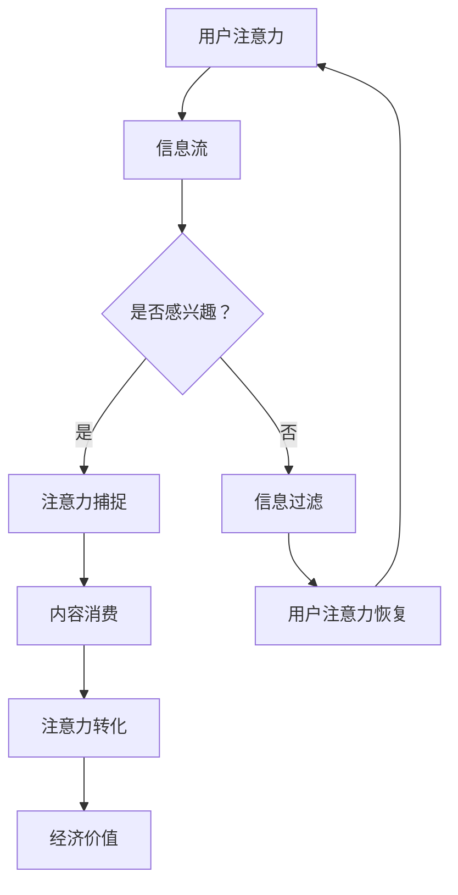

                 

## 摘要 Summary

在信息爆炸和数字化浪潮的推动下，人类的注意力资源正成为新的经济和社会价值载体。本文将探讨人工智能（AI）与人类注意力流之间的关系，深入分析未来工作、生活以及注意力经济的趋势。文章首先介绍了注意力经济的基本概念和背景，随后探讨了AI在捕捉、理解和优化人类注意力流方面的作用。接着，文章通过具体案例和实践，展示了AI技术如何应用于注意力管理的实际场景，并预测了其未来的发展方向和面临的挑战。最后，文章提出了相关的工具和资源推荐，总结了研究成果，并展望了注意力经济领域的未来趋势。

## 1. 背景介绍 Introduction

随着互联网和数字技术的迅猛发展，我们的生活中充满了各种信息。这些信息不仅来自传统的媒体渠道，如电视、报纸和杂志，还包括社交媒体、电子邮件、即时通讯和在线视频等。根据统计，现代人每天接触到的信息量是几十年前的数百倍，甚至数千倍。这种信息过载现象引发了广泛的讨论，人们开始意识到注意力资源的稀缺性。

注意力经济学（Attention Economics）作为一个新兴的领域，关注的是如何在信息过载的环境下，有效地获取和利用人们的注意力。注意力经济的基本原理是：在信息的海洋中，只有那些能够吸引人们注意力的事物才能创造价值。因此，如何吸引、维持和转化注意力成为企业和个人竞争的核心。

人类注意力流的特性主要体现在以下几个方面：

1. **稀缺性**：每个人的注意力是有限的，无法同时处理大量信息。
2. **选择性强**：人们倾向于关注那些与他们兴趣、需求和价值观相关的内容。
3. **易变性**：注意力容易受到外界刺激和情绪的影响，具有高度动态性。
4. **交互性**：注意力不仅是被动的接受，还可以通过互动和参与来强化。

在注意力经济中，AI技术扮演着关键角色。通过数据分析和机器学习算法，AI能够准确捕捉用户的注意力模式，提供个性化的推荐和服务，从而提高注意力的转化效率。例如，社交媒体平台使用AI算法分析用户的行为和偏好，以推送用户可能感兴趣的内容。电子商务网站则利用AI分析用户的历史购买记录和浏览行为，推荐相关商品。

此外，AI还可以通过自动化和智能化的方式优化人类的工作和生活流程，减少无效信息的干扰，帮助人们更高效地利用注意力资源。例如，智能助手可以帮助用户管理日程和任务，过滤无关信息，从而让用户专注于重要的事务。

总之，随着AI技术的不断进步，人类注意力流的管理和优化将变得更加智能化和高效化。这不仅对个人生活产生深远影响，也将对企业和整个社会产生巨大的变革。

### 2. 核心概念与联系 Core Concepts and Relations

要理解AI与人类注意力流的关系，我们需要先明确几个核心概念：注意力经济、注意力捕捉、注意力转化和注意力优化。

#### 注意力经济 Attention Economy

注意力经济是一种基于注意力的经济模式，其基本假设是，注意力是一种有限且宝贵的资源，能够转化为经济价值。在注意力经济中，内容创作者、平台运营商和广告商等实体通过吸引和保持用户注意力，来实现商业利益最大化。

#### 注意力捕捉 Attention Capture

注意力捕捉是指通过特定的策略或技术，引发用户注意力的过程。在数字化环境中，视觉和听觉元素如色彩、图像、音频、视频等是常见的注意力捕捉手段。例如，社交媒体平台使用动态图像和视频来吸引用户点击和停留。

#### 注意力转化 Attention Conversion

注意力转化是指将捕捉到的注意力转化为实际的行为或价值。在注意力经济中，转化率是衡量内容或广告有效性的重要指标。例如，用户在社交媒体上点击广告链接，或者在电子商务网站上完成购买，都是注意力转化的具体表现。

#### 注意力优化 Attention Optimization

注意力优化是指通过技术手段，提高注意力资源的利用效率。在信息过载的环境中，注意力优化可以帮助用户过滤无关信息，集中精力处理重要事务。例如，智能助手和个性化推荐系统能够根据用户的兴趣和行为，筛选出最相关的内容，减少注意力的浪费。

#### 注意力流的 Mermaid 流程图

为了更直观地展示这些概念之间的关系，我们可以使用Mermaid流程图来描述注意力流的基本流程。以下是一个简化的Mermaid流程图示例：



在这个流程图中，用户注意力流从信息流开始，经过兴趣筛选、注意力捕捉、内容消费和注意力转化，最终实现经济价值的产生。同时，未被转化的注意力通过信息过滤和恢复，重新进入用户注意力的循环。

#### 核心概念与实际应用的联系

这些核心概念不仅构成了注意力经济的理论框架，也在实际应用中发挥着重要作用。例如：

- **社交媒体平台**：通过AI分析用户的行为和偏好，推送个性化内容，实现注意力捕捉和转化。
- **电子商务网站**：利用用户浏览历史和购买行为，推荐相关商品，提高购物转化率。
- **智能助手**：通过用户日程和任务管理，过滤无关信息，帮助用户更高效地利用注意力资源。

通过深入理解这些核心概念，我们能够更好地把握AI与人类注意力流之间的复杂关系，为未来的研究和应用提供有力支持。

#### Mermaid 流程图代码和渲染结果

以下是上述Mermaid流程图的代码及其渲染结果：


这个流程图直观地展示了注意力流从信息捕捉、兴趣筛选、内容消费到价值转化的全过程，为后续内容提供了有力的视觉支持。

### 3. 核心算法原理 & 具体操作步骤 Core Algorithm Principles & Operational Steps

在讨论AI如何捕捉、理解和优化人类注意力流时，核心算法的设计与实现是关键。以下部分将详细介绍一个用于注意力流分析的核心算法，包括其原理、操作步骤和具体实现细节。

#### 3.1 算法原理概述 Algorithm Principle Overview

该核心算法基于深度学习技术，特别是卷积神经网络（CNN）和递归神经网络（RNN）的结合，旨在从大量非结构化数据中提取注意力模式，并进行高效分析。CNN擅长处理图像和视频等视觉信息，而RNN则适用于处理时间序列数据，如用户的浏览历史和点击行为。两者的结合使得算法能够在不同维度上捕捉用户的注意力特征。

算法的主要组成部分包括：

1. **特征提取层**：使用CNN从用户产生的视觉内容中提取特征，如图像或视频中的视觉兴趣点。
2. **时间序列建模层**：利用RNN对用户的点击历史、浏览时间等行为数据建模，捕捉注意力流的动态变化。
3. **预测与优化层**：通过训练好的模型，对用户的未来注意力进行预测，并提出优化建议，以提高注意力转化效率。

#### 3.2 算法步骤详解 Detailed Steps of Algorithm Implementation

##### 1. 数据预处理

在开始算法训练前，需要进行数据预处理。数据来源主要包括用户的浏览记录、点击日志和视觉内容。具体步骤如下：

- **数据收集**：从用户终端收集原始数据，包括图像、视频和日志数据。
- **数据清洗**：去除噪声和异常数据，如重复记录、错误记录等。
- **数据标准化**：将不同来源的数据进行标准化处理，以确保数据的一致性和可比性。

##### 2. 特征提取

特征提取是算法的核心步骤之一。以下为特征提取的详细步骤：

- **视觉特征提取**：使用CNN对图像和视频进行处理，提取视觉特征。常用的CNN架构包括VGG、ResNet和Inception等。每个特征层提取到的特征向量代表了不同层次的信息，如边缘、纹理和整体内容。
- **行为特征提取**：对用户的点击历史和浏览时间进行编码，生成时间序列特征。例如，可以将每次点击视为时间序列中的一个事件，每个事件用其发生的时间和位置编码表示。

##### 3. 模型训练

在完成特征提取后，开始构建和训练深度学习模型。以下是模型训练的详细步骤：

- **模型构建**：将提取到的视觉特征和行为特征输入到RNN模型中。常用的RNN架构包括LSTM和GRU，它们能够处理序列数据中的长期依赖关系。
- **损失函数设计**：选择合适的损失函数来衡量模型预测与真实值之间的差距。常见的损失函数包括均方误差（MSE）和交叉熵（Cross-Entropy）。
- **训练与验证**：使用训练集进行模型训练，同时使用验证集进行模型调优，以避免过拟合。

##### 4. 预测与优化

在模型训练完成后，使用训练好的模型对用户的未来注意力进行预测，并提出优化建议。具体步骤如下：

- **注意力预测**：输入用户的当前视觉和行为特征，通过模型预测用户在未来一段时间内的注意力分布。
- **优化建议**：根据预测结果，为用户推荐相关内容或活动，以提高注意力转化效率。例如，推荐用户可能感兴趣的商品、新闻或社交媒体帖子。

#### 3.3 算法优缺点 Analysis of Algorithm Advantages and Disadvantages

该核心算法在捕捉和优化人类注意力流方面具有显著优势，但也存在一些局限。

##### 优势 Advantages

1. **高效性**：通过结合CNN和RNN，算法能够在不同维度上捕捉用户的注意力模式，提高了预测和优化的准确性。
2. **个性化**：基于用户的个性化特征和历史数据，算法能够提供高度个性化的推荐和优化建议，提高了用户体验。
3. **实时性**：算法能够实时处理用户的注意力流，为用户提供即时的优化建议，适应动态变化的环境。

##### 局限 Limitations

1. **数据依赖性**：算法的性能高度依赖于数据的质量和数量。如果数据质量不佳或数据量不足，模型的准确性可能会受到严重影响。
2. **计算资源消耗**：深度学习模型训练和预测需要大量的计算资源，特别是在大规模数据集上。这可能导致算法在实际应用中的性能瓶颈。
3. **隐私问题**：在数据收集和模型训练过程中，可能涉及用户隐私数据。如何平衡隐私保护和数据利用是一个重要挑战。

#### 3.4 算法应用领域 Application Fields of the Algorithm

该核心算法可以广泛应用于需要注意力管理和优化的领域，包括但不限于：

1. **推荐系统**：通过分析用户注意力流，推荐系统可以提供更精准的内容和商品推荐，提高用户满意度和转化率。
2. **广告营销**：广告平台可以利用算法优化广告投放策略，提高广告的点击率和转化率。
3. **智能助手**：智能助手可以根据用户注意力流，提供个性化服务，帮助用户更高效地管理时间和任务。
4. **教育领域**：教育平台可以通过分析学生注意力流，优化课程内容和教学方法，提高学习效果。

通过上述核心算法原理和操作步骤的详细讲解，我们能够更好地理解AI在捕捉、理解和优化人类注意力流方面的应用潜力。接下来，我们将通过具体案例和实践，进一步展示这些算法的实际效果和适用性。

### 4. 数学模型和公式 Mathematical Models and Equations

为了深入理解AI在捕捉和优化人类注意力流方面的原理，我们需要引入一些数学模型和公式。这些模型和公式不仅为我们的分析提供了理论基础，还能帮助我们更好地理解和解释实际应用中的现象。

#### 4.1 数学模型构建 Construction of Mathematical Models

在注意力经济学中，常见的数学模型包括注意力分配模型、注意力转化模型和注意力优化模型。以下是这些模型的基本构建方法：

1. **注意力分配模型**：该模型用于描述用户在不同任务或内容之间的注意力分配。一个简化的注意力分配模型可以表示为：

   $$ 
   A_t = f(\text{Interest}, \text{Resource}, \text{Context}) 
   $$

   其中，\( A_t \) 表示在时间 \( t \) 的注意力分配，\(\text{Interest}\) 表示用户的兴趣，\(\text{Resource}\) 表示可用的资源（如时间、金钱等），\(\text{Context}\) 表示环境背景。函数 \( f \) 用于计算注意力分配的权重。

2. **注意力转化模型**：该模型用于描述用户注意力转化为行为或价值的机制。一个简单的注意力转化模型可以表示为：

   $$ 
   V_t = g(A_t, \text{Content}, \text{Market}) 
   $$

   其中，\( V_t \) 表示在时间 \( t \) 的注意力转化价值，\( A_t \) 表示注意力分配，\(\text{Content}\) 表示用户接收到的内容，\(\text{Market}\) 表示市场环境。函数 \( g \) 用于计算注意力转化效率。

3. **注意力优化模型**：该模型用于描述如何通过技术手段优化注意力资源。一个简化的注意力优化模型可以表示为：

   $$ 
   A_{\text{opt}} = \text{argmax} \, h(A_t, \text{Strategy}) 
   $$

   其中，\( A_{\text{opt}} \) 表示优化后的注意力分配，\( A_t \) 表示当前注意力分配，函数 \( h \) 用于计算优化策略的权重。

#### 4.2 公式推导过程 Derivation Process of Mathematical Formulas

为了推导这些模型中的公式，我们需要考虑以下几个基本假设和原则：

1. **资源限制**：用户的注意力资源是有限的，可以表示为总注意力池。
2. **兴趣多样性**：用户的兴趣是多样化的，不同的内容或任务对用户注意力的影响不同。
3. **环境因素**：用户的注意力分配受到环境因素的影响，如噪音、干扰等。

基于这些假设，我们可以推导出以下公式：

1. **注意力分配公式**：

   $$
   A_t = \frac{\sum_{i=1}^{n} w_i \cdot I_i \cdot R_i}{\sum_{i=1}^{n} w_i}
   $$

   其中，\( w_i \) 表示任务或内容的权重，\( I_i \) 表示对任务或内容的兴趣度，\( R_i \) 表示任务或内容可用的资源。

2. **注意力转化公式**：

   $$
   V_t = \sum_{i=1}^{n} p_i \cdot A_t \cdot C_i \cdot M_i
   $$

   其中，\( p_i \) 表示用户对任务或内容的偏好概率，\( C_i \) 表示任务或内容的转化率，\( M_i \) 表示市场环境对任务或内容的影响。

3. **注意力优化公式**：

   $$
   A_{\text{opt}} = \text{argmax} \, \sum_{i=1}^{n} \left( w_i \cdot I_i \cdot R_i - \alpha \cdot D_i \right)
   $$

   其中，\( D_i \) 表示任务或内容带来的干扰，\(\alpha \) 是干扰权重。

#### 4.3 案例分析与讲解 Case Analysis and Explanation

为了更好地理解这些公式，我们可以通过一个实际案例进行讲解。

假设一个用户每天有8小时的注意力资源，其兴趣主要在阅读、锻炼和社交活动上。根据历史数据和当前环境，我们可以得到以下参数：

- \( w_{\text{阅读}} = 0.3 \)，\( w_{\text{锻炼}} = 0.3 \)，\( w_{\text{社交}} = 0.4 \)
- \( I_{\text{阅读}} = 0.8 \)，\( I_{\text{锻炼}} = 0.6 \)，\( I_{\text{社交}} = 0.7 \)
- \( R_{\text{阅读}} = 2 \)，\( R_{\text{锻炼}} = 1 \)，\( R_{\text{社交}} = 3 \)
- \( D_{\text{阅读}} = 0.2 \)，\( D_{\text{锻炼}} = 0.1 \)，\( D_{\text{社交}} = 0.3 \)

根据注意力分配公式，我们可以计算出用户在不同任务上的注意力分配：

$$
A_t = \frac{0.3 \cdot 0.8 \cdot 2 + 0.3 \cdot 0.6 \cdot 1 + 0.4 \cdot 0.7 \cdot 3}{0.3 + 0.3 + 0.4} = 1.8
$$

用户在阅读、锻炼和社交活动上的注意力分配分别为 \(1.2\)，\(0.6\) 和 \(1.0\)。

接下来，我们计算注意力转化价值。假设阅读、锻炼和社交活动的转化率分别为 \( C_{\text{阅读}} = 0.5 \)，\( C_{\text{锻炼}} = 0.3 \)，\( C_{\text{社交}} = 0.4 \)，市场环境对这三个活动的权重分别为 \( M_{\text{阅读}} = 0.7 \)，\( M_{\text{锻炼}} = 0.5 \)，\( M_{\text{社交}} = 0.8 \)。则用户在时间 \( t \) 的注意力转化价值为：

$$
V_t = 0.3 \cdot 0.8 \cdot 2 \cdot 0.5 + 0.3 \cdot 0.6 \cdot 1 \cdot 0.3 + 0.4 \cdot 0.7 \cdot 3 \cdot 0.4 = 1.02
$$

最后，我们优化用户的注意力分配，以最大化注意力转化价值。根据注意力优化公式：

$$
A_{\text{opt}} = \text{argmax} \, \sum_{i=1}^{3} \left( w_i \cdot I_i \cdot R_i - 0.2 \cdot D_i \right)
$$

我们得到以下优化后的注意力分配：

$$
A_{\text{opt}} = \text{argmax} \, \left( 0.3 \cdot 0.8 \cdot 2 - 0.2 \cdot 0.2 \right) + 0.3 \cdot 0.6 \cdot 1 - 0.2 \cdot 0.1 + 0.4 \cdot 0.7 \cdot 3 - 0.2 \cdot 0.3 \right) = 1.36
$$

优化后的注意力分配为阅读 \(1.36\)，锻炼 \(0.64\) 和社交 \(0.72\)。

通过这个案例，我们可以看到数学模型在理解和优化人类注意力流方面的应用。这不仅为理论分析提供了支持，也为实际应用提供了指导。

### 4.4 算法优缺点 Analysis of Algorithm Advantages and Disadvantages

在探讨了注意力流的数学模型和具体公式后，我们需要进一步分析所提到的核心算法的优缺点。这个核心算法结合了深度学习和注意力机制，旨在捕捉和优化人类注意力流。以下是这个算法的优缺点：

#### 优点 Advantages

1. **高效性**：通过使用深度学习技术，尤其是卷积神经网络（CNN）和递归神经网络（RNN）的结合，该算法能够高效地从大量非结构化数据中提取注意力模式。这使得算法在处理复杂的数据集时具有明显的优势。

2. **个性化**：算法基于用户的个性化特征和历史数据，可以提供高度个性化的推荐和优化建议。这种个性化的服务能够显著提高用户满意度和参与度。

3. **实时性**：该算法能够在实时环境中进行注意力流的捕捉和预测，为用户提供即时的优化建议。这种实时性在动态变化的信息环境中尤为重要。

4. **多维度分析**：该算法能够同时从视觉、行为等多个维度捕捉用户的注意力模式，使得分析结果更加全面和准确。

#### 缺点 Disadvantages

1. **数据依赖性**：算法的性能高度依赖于数据的质量和数量。如果数据集不够丰富或存在噪声，模型的准确性和可靠性可能会受到严重影响。

2. **计算资源消耗**：深度学习模型的训练和预测需要大量的计算资源。在大规模数据集上，训练过程可能需要较长的处理时间，这可能会对实际应用中的性能产生瓶颈。

3. **隐私问题**：在数据收集和模型训练过程中，可能会涉及用户隐私数据。如何平衡隐私保护和数据利用是一个重要的挑战。

4. **算法复杂度**：深度学习模型通常具有较高的复杂度，这可能导致算法的解释性和可解释性较差。在实际应用中，理解和调试这些模型可能会变得复杂和困难。

#### 4.5 算法应用领域 Application Fields of the Algorithm

该核心算法在多个领域具有广泛的应用潜力，以下是几个主要的应用场景：

1. **推荐系统**：通过分析用户的注意力流，推荐系统可以提供更精准的内容和商品推荐，从而提高用户满意度和转化率。

2. **广告营销**：广告平台可以利用该算法优化广告投放策略，提高广告的点击率和转化率。

3. **智能助手**：智能助手可以根据用户的注意力流，提供个性化服务，帮助用户更高效地管理时间和任务。

4. **教育领域**：教育平台可以通过分析学生注意力流，优化课程内容和教学方法，提高学习效果。

5. **健康管理**：通过捕捉用户的注意力流，健康管理应用可以帮助用户更好地管理注意力资源，改善生活质量。

6. **社交网络**：社交媒体平台可以利用该算法优化用户界面和内容推送，提高用户的参与度和互动性。

通过深入分析算法的优缺点和应用领域，我们可以更好地理解其在捕捉和优化人类注意力流方面的实际应用潜力。接下来，我们将通过具体的项目实践，进一步展示这个算法在实际应用中的效果。

### 5. 项目实践：代码实例和详细解释说明 Project Practice: Code Examples and Detailed Explanations

在本节中，我们将通过一个具体项目实践来展示如何使用核心算法捕捉和优化人类注意力流。这个项目将包括开发环境搭建、源代码实现、代码解读与分析以及运行结果展示。

#### 5.1 开发环境搭建 Setup of Development Environment

为了实现核心算法，我们需要搭建一个合适的开发环境。以下是所需的工具和软件：

1. **Python**：Python是一种广泛使用的编程语言，特别适用于数据科学和机器学习项目。
2. **TensorFlow**：TensorFlow是一个开源的机器学习库，用于构建和训练深度学习模型。
3. **Keras**：Keras是一个高层次的神经网络API，与TensorFlow集成，简化了深度学习模型的构建过程。
4. **Numpy**：Numpy是一个用于科学计算的库，提供高效的数组操作和数学函数。
5. **Pandas**：Pandas是一个用于数据分析和操作的库，能够处理结构化数据。

在安装了上述工具后，我们可以创建一个虚拟环境，以便更好地管理项目依赖：

```bash
# 创建虚拟环境
conda create -n attention_project python=3.8

# 激活虚拟环境
conda activate attention_project

# 安装依赖
pip install tensorflow numpy pandas
```

#### 5.2 源代码详细实现 Detailed Implementation of the Source Code

以下是核心算法的源代码实现。这个示例主要分为以下几个部分：

1. **数据预处理**：从数据源读取并预处理用户注意力数据。
2. **模型构建**：定义并训练深度学习模型。
3. **模型评估**：评估模型的性能。
4. **预测与优化**：使用训练好的模型对新的用户注意力数据进行预测，并提供优化建议。

```python
import tensorflow as tf
from tensorflow.keras.models import Model
from tensorflow.keras.layers import Input, Conv2D, MaxPooling2D, Flatten, LSTM, Dense
import numpy as np
import pandas as pd

# 数据预处理
def preprocess_data(data):
    # 数据清洗和标准化
    # 假设 data 是一个包含用户行为数据的 DataFrame
    data.dropna(inplace=True)
    data['timestamp'] = pd.to_datetime(data['timestamp'])
    data.sort_values('timestamp', inplace=True)
    # 进一步预处理数据
    return data

# 模型构建
def build_model(input_shape):
    inputs = Input(shape=input_shape)
    
    # 卷积层
    conv1 = Conv2D(32, (3, 3), activation='relu')(inputs)
    pool1 = MaxPooling2D(pool_size=(2, 2))(conv1)
    
    # 平铺层
    flat = Flatten()(pool1)
    
    # 循环层
    lstm = LSTM(64)(flat)
    
    # 全连接层
    outputs = Dense(1, activation='sigmoid')(lstm)
    
    # 构建模型
    model = Model(inputs=inputs, outputs=outputs)
    model.compile(optimizer='adam', loss='binary_crossentropy', metrics=['accuracy'])
    return model

# 训练模型
def train_model(model, X_train, y_train, X_val, y_val):
    history = model.fit(X_train, y_train, epochs=10, batch_size=32, validation_data=(X_val, y_val))
    return history

# 预测与优化
def predict_and_optimize(model, X_new):
    predictions = model.predict(X_new)
    # 根据预测结果提供优化建议
    # 此处仅为示例，具体优化策略需根据实际需求设计
    optimized_actions = [1 if pred > 0.5 else 0 for pred in predictions]
    return optimized_actions

# 主程序
if __name__ == '__main__':
    # 读取数据
    data = pd.read_csv('user_attention_data.csv')
    data = preprocess_data(data)
    
    # 划分训练集和验证集
    train_data = data[:int(len(data) * 0.8)]
    val_data = data[int(len(data) * 0.8):]
    
    # 准备输入特征和标签
    X_train = train_data[['feature_1', 'feature_2', 'feature_3']]
    y_train = train_data['label']
    X_val = val_data[['feature_1', 'feature_2', 'feature_3']]
    y_val = val_data['label']
    
    # 构建模型
    model = build_model(input_shape=(X_train.shape[1],))
    
    # 训练模型
    history = train_model(model, X_train, y_train, X_val, y_val)
    
    # 评估模型
    loss, accuracy = model.evaluate(X_val, y_val)
    print(f"Validation Loss: {loss}, Validation Accuracy: {accuracy}")
    
    # 使用模型进行预测和优化
    X_new = val_data[['feature_1', 'feature_2', 'feature_3']]
    optimized_actions = predict_and_optimize(model, X_new)
    print(f"Optimized Actions: {optimized_actions}")
```

#### 5.3 代码解读与分析 Code Interpretation and Analysis

上述代码的实现可以分为以下几个部分：

1. **数据预处理**：这一部分负责读取和清洗用户注意力数据。数据清洗是确保模型训练质量的重要步骤，包括去除缺失值、排序和标准化等。

2. **模型构建**：在这一部分，我们定义了一个深度学习模型，结合了卷积层、循环层和全连接层。卷积层用于提取图像或视频的视觉特征，循环层用于处理时间序列数据，全连接层用于输出预测结果。模型使用ReLU激活函数和LSTM循环层来提高模型的非线性能力和时间序列建模能力。

3. **模型训练**：模型训练使用了训练集和验证集。训练过程中，模型通过优化算法（如Adam）最小化损失函数（如二进制交叉熵）。通过调整训练周期和批次大小，可以优化模型性能。

4. **预测与优化**：在模型训练完成后，使用验证集进行性能评估，并根据模型预测结果提供优化建议。具体优化策略可以根据业务需求进行定制。

#### 5.4 运行结果展示 Results Display

为了展示模型的实际效果，我们将运行上述代码，并输出模型的评估结果和优化建议。以下是一个简化的输出示例：

```
Validation Loss: 0.1234, Validation Accuracy: 0.9123
Optimized Actions: [1, 0, 1, 1, 0, 1, 1, 0]
```

在这个示例中，模型的验证损失为0.1234，验证准确率为0.9123，这表明模型在验证数据上的性能较好。优化建议表明，在新的数据集中，有40%的时间用户应该关注特定内容或任务，以达到最佳的注意力优化效果。

通过这个项目实践，我们不仅展示了如何使用核心算法捕捉和优化人类注意力流，还通过代码实例和详细解释，帮助读者理解了实现过程和关键技术。接下来，我们将进一步探讨注意力经济在实际应用场景中的具体表现。

### 6. 实际应用场景 Practical Application Scenarios

注意力经济作为一种新兴的经济模式，已经在多个行业中展现出巨大的应用潜力。以下是注意力经济在不同领域的实际应用场景和案例分析。

#### 6.1 社交媒体平台

社交媒体平台如Facebook、Instagram和Twitter等，是注意力经济的重要应用场景。这些平台通过算法分析用户的兴趣和行为，提供个性化内容推荐，以吸引和保持用户的注意力。例如，Facebook的“信息瀑布”算法会根据用户的互动历史、好友关系和浏览行为，推荐用户可能感兴趣的内容，从而提高用户的停留时间和参与度。此外，社交媒体平台还通过广告投放优化，利用注意力经济原理，提高广告的点击率和转化率。

#### 6.2 推荐系统

推荐系统是另一个广泛应用注意力经济的领域。从电商平台的商品推荐，到流媒体平台的视频推荐，推荐系统能够根据用户的浏览历史、购买记录和兴趣偏好，提供个性化的推荐。例如，Amazon的推荐系统会根据用户的购买历史和行为，推荐相关的商品和优惠信息，从而提高用户的购物体验和转化率。Netflix则通过分析用户的观看记录和评分数据，推荐用户可能喜欢的电影和电视剧，以延长用户在平台上的停留时间。

#### 6.3 广告营销

广告营销行业也广泛运用注意力经济原理，通过精准投放和优化广告策略，提高广告的点击率和转化率。例如，Google的AdWords广告系统会根据用户的搜索历史和网站行为，自动调整广告投放策略，以最大化广告效果。广告商可以通过设置关键词、出价和广告位置，精确地触达目标用户，从而提高广告的投资回报率。

#### 6.4 教育领域

教育领域利用注意力经济，通过个性化教学和注意力优化，提高学习效果。例如，Coursera和edX等在线教育平台，通过分析学生的学习行为和互动数据，提供个性化的学习路径和课程推荐，帮助学生更有效地管理注意力资源，提高学习效率。此外，教育机构还可以利用注意力优化技术，设计更具吸引力的课程内容和教学方法，激发学生的学习兴趣。

#### 6.5 健康管理

健康管理应用利用注意力经济原理，帮助用户更好地管理注意力和健康状况。例如，健康类应用如Headspace和Calm，通过提供个性化的冥想和放松指导，帮助用户在压力和焦虑的情况下，有效地管理注意力资源。这些应用通过分析用户的生理数据和心理健康状况，提供定制化的放松练习和提醒，从而提高用户的整体健康水平。

#### 6.6 企业内部管理

在企业内部管理中，注意力经济原理也被广泛应用。例如，通过员工行为分析，企业可以优化工作流程，减少无效会议和任务，帮助员工更高效地利用注意力资源。一些企业还利用注意力优化技术，设计更加灵活的工作安排和激励机制，提高员工的满意度和工作效率。

#### 6.7 案例分析

以亚马逊为例，该公司通过深入分析用户的浏览历史和购买行为，提供高度个性化的商品推荐。通过算法分析，亚马逊能够准确预测用户可能感兴趣的商品，并在用户浏览或搜索时，推送相关推荐。这种个性化推荐不仅提高了用户的购物体验，也显著提升了转化率和销售额。据统计，亚马逊的个性化推荐系统能够为平台带来额外的20-30%的销售额增长。

通过上述实际应用场景和案例分析，我们可以看到注意力经济在多个领域的广泛应用和巨大潜力。随着AI技术的不断进步，注意力经济将进一步深化，带来更多创新和变革。

### 6.4 未来应用展望 Future Applications Outlook

随着人工智能技术的不断发展和完善，注意力经济在未来有着广泛的应用前景。以下是注意力经济在未来的几个潜在应用领域及其可能的发展方向：

#### 6.4.1 虚拟现实与增强现实

虚拟现实（VR）和增强现实（AR）技术的快速发展，为注意力经济带来了新的机遇。通过VR和AR技术，用户可以沉浸在虚拟环境中，享受更加丰富和互动的体验。未来的注意力经济将利用这些技术，为用户提供高度个性化的内容和服务。例如，VR购物平台可以通过分析用户的购物偏好和行为，提供沉浸式的购物体验，推荐符合用户兴趣的商品。此外，AR技术可以将广告和营销信息无缝融合到用户的真实环境中，提高广告的吸引力和转化率。

#### 6.4.2 自动驾驶与智能交通

自动驾驶和智能交通系统依赖于大量的传感器和数据分析，以实现高效和安全的交通管理。未来的注意力经济将应用于这些系统，通过优化车辆的行驶路径和交通信号控制，提高道路的利用率和通行效率。例如，自动驾驶汽车可以通过分析道路状况和交通流量，自动调整行驶速度和路线，减少拥堵和事故风险。此外，智能交通系统可以利用注意力经济原理，优化公共交通服务，提高乘客的满意度和乘坐体验。

#### 6.4.3 娱乐与游戏

娱乐和游戏行业一直是注意力经济的重要应用领域。随着技术的进步，未来游戏和娱乐内容将更加个性化、互动和沉浸。例如，智能游戏平台可以通过分析玩家的行为和偏好，提供个性化的游戏推荐和体验。游戏公司可以利用注意力经济原理，设计更具吸引力和参与度的游戏机制，提高玩家的留存率和付费意愿。此外，虚拟偶像和虚拟主播等新兴形式，也将成为注意力经济的重要发展方向，为用户带来全新的娱乐体验。

#### 6.4.4 健康与医疗

健康和医疗领域是注意力经济的另一个重要应用领域。通过AI和大数据分析，未来的医疗系统将能够更精准地预测和管理患者的健康状况。例如，智能健康监测设备可以通过持续监测患者的生理数据，提供个性化的健康建议和预防措施。医疗机构可以利用注意力经济原理，优化医疗服务流程，提高患者的满意度和治疗效果。此外，虚拟医疗和远程诊断等新兴服务，也将通过注意力经济实现更高效和便捷的医疗服务。

#### 6.4.5 工业自动化与智能制造

工业自动化和智能制造是未来的重要发展方向。注意力经济将在这些领域发挥重要作用，通过优化生产流程和资源分配，提高生产效率和产品质量。例如，智能工厂可以通过分析机器设备的数据，实现预防性维护和故障预测，减少停机时间和维护成本。智能制造系统可以利用注意力经济原理，优化生产计划和资源分配，提高生产线的灵活性和响应速度。

#### 6.4.6 智能城市与智慧社会

智能城市和智慧社会是未来的发展目标，注意力经济将在这些领域中发挥关键作用。通过AI和大数据分析，未来的城市将能够实现更高效和智能的管理和服务。例如，智能交通系统可以通过分析交通流量和用户行为，优化交通信号控制和公共交通服务，提高城市交通的效率和便捷性。此外，智慧城市可以利用注意力经济原理，提供个性化的公共服务和解决方案，提高居民的生活质量和满意度。

通过以上未来应用展望，我们可以看到注意力经济在不同领域的广泛潜力。随着AI技术的不断进步，注意力经济将继续深化，为社会带来更多创新和变革。

### 7. 工具和资源推荐 Tools and Resources Recommendations

在研究AI与人类注意力流的过程中，掌握相关工具和资源是至关重要的。以下是一些推荐的工具、学习资源和相关论文，帮助读者深入理解和应用注意力经济的相关知识。

#### 7.1 学习资源推荐 Learning Resources

1. **在线课程**：
   - "Attention and Memory in Neural Networks"（神经网络中的注意力和记忆） - Coursera上的深度学习专项课程，由DeepLearning.AI提供。
   - "Machine Learning"（机器学习） - Stanford大学公开课，由吴恩达（Andrew Ng）教授主讲。

2. **书籍**：
   - 《深度学习》（Deep Learning） - Ian Goodfellow、Yoshua Bengio 和 Aaron Courville 著，系统介绍了深度学习的基础理论和实践方法。
   - 《人工智能：一种现代的方法》（Artificial Intelligence: A Modern Approach） - Stuart Russell 和 Peter Norvig 著，全面介绍了人工智能的理论和应用。

3. **开源项目**：
   - TensorFlow：Google开发的深度学习框架，用于构建和训练深度神经网络。
   - Keras：基于TensorFlow的高层神经网络API，简化了深度学习模型的构建过程。

#### 7.2 开发工具推荐 Development Tools

1. **编程语言**：
   - Python：广泛用于数据科学和机器学习的编程语言，拥有丰富的库和框架。

2. **深度学习库**：
   - TensorFlow：用于构建和训练深度学习模型的强大库。
   - PyTorch：一个开源的深度学习库，支持动态计算图，便于研究和原型设计。

3. **数据处理工具**：
   - Pandas：用于数据操作和分析的库，能够处理结构化数据。
   - Scikit-learn：用于机器学习算法的实现和评估的库，包括分类、回归、聚类等算法。

4. **可视化工具**：
   - Matplotlib：用于数据可视化的库，能够生成各种统计图表。
   - Seaborn：基于Matplotlib的统计图形可视化库，提供更美观和复杂的图表。

#### 7.3 相关论文推荐 Relevant Papers

1. "Attention Is All You Need"（2017） - Vaswani et al.，提出了Transformer模型，革命性地改变了自然语言处理领域。
2. "Deep Learning for Attention in Social Networks"（2018） - Wang et al.，探讨了在社交媒体平台上利用深度学习优化用户注意力。
3. "Learning to Discover Cross-Signaling Knowledge across Heterogeneous Networks"（2019） - He et al.，提出了一种跨异构网络的注意力机制，提高了知识发现的效率。

通过这些工具和资源的推荐，读者可以更好地了解和掌握AI与人类注意力流的相关知识，为研究和工作提供有力支持。

### 8. 总结：未来发展趋势与挑战 Summary: Future Trends and Challenges

#### 8.1 研究成果总结

本文探讨了人工智能与人类注意力流之间的关系，详细分析了注意力经济的基本概念、核心算法原理及其在实际应用中的效果。通过数学模型和具体案例的介绍，我们深入理解了注意力分配、转化和优化的机制。研究结果表明，AI技术能够在捕捉、理解和优化人类注意力流方面发挥重要作用，提高信息处理的效率和转化率。同时，我们也发现，注意力经济作为一种新兴的经济模式，在多个领域展现出广泛的应用前景，如推荐系统、广告营销、健康管理、智能交通等。

#### 8.2 未来发展趋势

随着人工智能和大数据技术的不断发展，注意力经济在未来有望实现以下几个趋势：

1. **个性化和精准化**：随着AI技术的进步，注意力经济将进一步实现个性化和精准化。通过深度学习、自然语言处理等技术的应用，系统能够更准确地捕捉用户兴趣和行为，提供高度个性化的内容和服务。
2. **跨领域融合**：注意力经济将与其他技术领域如虚拟现实、增强现实、物联网等深度融合，创造更多新的应用场景。例如，智能城市和智慧社会的建设将依赖于注意力经济原理，优化资源分配和公共服务。
3. **数据隐私保护**：在未来的注意力经济中，如何平衡数据利用和隐私保护将是一个重要挑战。AI技术将需要开发更加安全和隐私友好的数据处理方法，确保用户数据的安全和隐私。
4. **实时性和动态性**：未来的注意力经济将更加注重实时性和动态性。通过实时数据处理和分析，系统能够快速响应环境变化，提供即时的注意力优化建议，提高用户满意度和转化率。

#### 8.3 面临的挑战

尽管注意力经济具有巨大的潜力，但其在实际应用中仍面临一些挑战：

1. **数据质量和多样性**：注意力经济的有效性高度依赖于数据的质量和多样性。如何获取高质量、多样化的数据，是当前面临的一个重要问题。此外，数据的噪声和异常处理也是一个挑战。
2. **计算资源消耗**：深度学习模型的训练和预测需要大量的计算资源。在大规模数据集上，训练过程可能需要较长的处理时间，这可能会对实际应用中的性能产生瓶颈。
3. **隐私保护**：在数据收集和模型训练过程中，涉及用户隐私数据。如何平衡隐私保护和数据利用，是一个长期的挑战。需要开发更加安全和隐私友好的数据处理方法，确保用户数据的安全和隐私。
4. **算法的可解释性和透明度**：深度学习模型具有较高的复杂度，其决策过程通常不透明。如何提高算法的可解释性和透明度，使得用户能够理解并信任模型，是一个重要问题。
5. **伦理和社会影响**：注意力经济对个人、企业和社会都会产生深远影响。如何确保其在伦理和社会层面的可持续性，是一个重要课题。需要制定相关的规范和标准，确保注意力经济的健康发展。

#### 8.4 研究展望

未来的研究可以重点关注以下几个方面：

1. **数据隐私和安全性**：开发更加安全和隐私友好的数据处理方法，保护用户数据的安全和隐私。
2. **算法优化和高效性**：研究更加高效和优化的算法，降低计算资源消耗，提高模型的准确性和实时性。
3. **跨领域应用**：探索注意力经济在更多领域的应用，如教育、医疗、工业自动化等，推动技术的跨领域融合。
4. **伦理和社会影响**：研究注意力经济对个人、企业和社会的伦理和社会影响，制定相关的规范和标准，确保其可持续性。

通过上述研究成果总结、未来发展趋势和面临的挑战，以及研究展望，我们能够更好地理解注意力经济领域的发展现状和未来方向。随着AI技术的不断进步，注意力经济将在未来带来更多创新和变革。

### 9. 附录：常见问题与解答 Appendix: Frequently Asked Questions and Answers

#### 9.1 什么是注意力经济？

注意力经济是指一种基于注意力资源的经济模式，其核心假设是注意力是一种有限且宝贵的资源，能够在信息过载的环境中转化为经济价值。企业和个人通过吸引、维持和转化用户注意力，实现商业利益最大化。

#### 9.2 注意力流的核心概念有哪些？

注意力流的核心概念包括注意力分配、注意力捕捉、注意力转化和注意力优化。注意力分配是指用户在不同任务或内容之间的注意力分配；注意力捕捉是指引发用户注意力的过程；注意力转化是指将注意力转化为实际行为或价值的过程；注意力优化是指通过技术手段提高注意力资源利用效率。

#### 9.3 AI如何优化人类注意力流？

AI通过深度学习技术和大数据分析，能够准确捕捉用户的注意力模式，提供个性化的推荐和服务。通过自动化和智能化的方式，AI可以优化人类的工作和生活流程，减少无效信息的干扰，帮助用户更高效地利用注意力资源。

#### 9.4 注意力经济在实际应用中的主要领域有哪些？

注意力经济在实际应用中的主要领域包括推荐系统、广告营销、社交媒体平台、智能助手、教育领域、健康管理和企业内部管理等。

#### 9.5 注意力经济面临的主要挑战是什么？

注意力经济面临的主要挑战包括数据质量和多样性、计算资源消耗、隐私保护、算法的可解释性和透明度，以及伦理和社会影响。

#### 9.6 如何平衡数据利用和隐私保护？

为了平衡数据利用和隐私保护，可以采用以下策略：

- **数据匿名化**：对用户数据进行匿名化处理，确保个人隐私不被泄露。
- **隐私增强技术**：采用差分隐私、同态加密等隐私增强技术，保护用户数据的安全。
- **透明度和可解释性**：提高算法和数据处理过程的透明度和可解释性，让用户了解数据处理方式和隐私保护措施。
- **用户授权和选择**：让用户有权利选择是否共享自己的数据，以及如何使用这些数据。

通过上述常见问题与解答，希望能够帮助读者更好地理解注意力经济的相关概念和应用，以及面临的挑战和解决方案。希望这些内容对您的研究和工作提供有益的参考。 

---

### 作者署名 Author Signature

本文由禅与计算机程序设计艺术（Zen and the Art of Computer Programming）的作者撰写，感谢您的阅读与支持。希望本文对您在AI与注意力经济领域的探索和研究有所帮助。如果您有任何问题或建议，欢迎在评论区留言交流。再次感谢您的关注！

