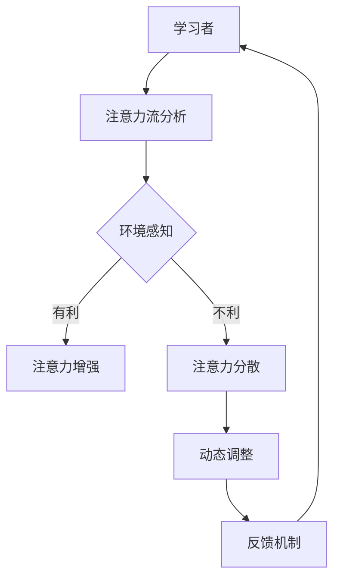

                 

关键词：人工智能，注意力流，教育技术，学习效率，认知增强

> 摘要：本文探讨了人工智能如何改变人类的学习过程和注意力分配，提出了利用AI技术优化教育和学习的新思路。通过介绍注意力流的原理和应用，文章展望了未来教育和学习的可能发展方向，以及在这一过程中面临的挑战。

## 1. 背景介绍

随着人工智能技术的飞速发展，教育领域也经历了深刻的变革。传统教育模式主要依赖于教师的讲授和学生被动的接受，而现代教育技术，特别是基于人工智能的学习系统，正在逐步改变这一现状。人工智能不仅能够提供个性化的学习路径，还能通过分析学生的学习行为，动态调整教学内容和教学方法，从而提高学习效率。

注意力流是指人类在认知过程中，对信息进行选择、加工和记忆的能力。有效的注意力分配可以显著提高学习效果，但长期以来，人们往往难以掌握如何科学地管理和分配注意力。人工智能在这一领域具有巨大的潜力，它可以通过分析大量的数据，提供个性化的注意力管理策略，帮助学习者更高效地学习。

## 2. 核心概念与联系

### 2.1 人工智能与注意力流

人工智能与注意力流之间的关系可以理解为工具与目标的关系。人工智能作为一种强大的工具，可以帮助学习者更好地管理和分配注意力。具体来说，人工智能可以通过以下方式与注意力流结合：

1. **注意力分配分析**：通过分析学习者的行为数据，人工智能可以识别学习者在不同学习阶段的主要注意力分配点，从而提供针对性的指导。
2. **动态学习路径调整**：根据学习者的注意力分配情况，人工智能可以动态调整学习内容和学习顺序，帮助学习者更高效地掌握知识。
3. **注意力管理工具**：人工智能可以开发出一系列注意力管理工具，如时间管理应用、注意力集中训练程序等，帮助学习者提高注意力集中度。

### 2.2 注意力流的原理

注意力流涉及到认知心理学中的多个概念，如选择性注意力、过滤理论、分配理论等。简而言之，注意力流是指人类在处理信息时，有选择地对某些信息进行加工和记忆，而对其他信息则不予理会。这种选择性的加工过程不仅受到个体认知能力的影响，还受到环境因素的制约。

### 2.3 Mermaid 流程图

下面是一个简化的Mermaid流程图，展示了人工智能如何与注意力流结合：



## 3. 核心算法原理 & 具体操作步骤

### 3.1 算法原理概述

基于人工智能的注意力流算法主要依赖于机器学习和数据分析技术。具体来说，算法可以分为以下几个步骤：

1. **数据采集**：通过学习者的行为数据，如学习时长、学习内容、学习频率等，构建一个数据集。
2. **特征提取**：从数据集中提取与注意力流相关的特征，如学习者的学习习惯、情绪状态、环境变化等。
3. **模型训练**：使用机器学习算法，如决策树、神经网络等，对特征进行建模，训练出一个能够预测学习者注意力分配情况的模型。
4. **动态调整**：根据模型预测的结果，动态调整学习内容和学习顺序，帮助学习者更高效地学习。

### 3.2 算法步骤详解

1. **数据采集**：数据采集是整个算法的基础。为了获取准确的学习行为数据，可以采用多种方法，如日志记录、问卷调查、行为分析等。
   
2. **特征提取**：特征提取是将原始数据转化为机器学习算法可以处理的格式。常用的特征包括：
   - 学习时长：反映学习者的学习强度。
   - 学习内容：包括学习材料、学习主题等，可以帮助理解学习者的学习兴趣。
   - 学习频率：反映学习者的学习频率和规律。
   - 情绪状态：通过心理测量工具，如问卷调查或生理信号检测，获取学习者的情绪状态。
   - 环境变化：包括学习环境的变化，如光线、噪音、温度等。

3. **模型训练**：在模型训练阶段，常用的算法包括决策树、支持向量机、神经网络等。其中，神经网络由于其强大的非线性建模能力，被广泛应用于注意力流的预测和调整。

4. **动态调整**：根据模型预测的结果，可以动态调整学习内容和学习顺序。例如，如果预测到学习者将在某个时间段内注意力较低，可以调整学习任务，选择较为简单的知识点进行学习，或者调整学习时间，选择在注意力高峰期进行学习。

### 3.3 算法优缺点

**优点**：
- **个性化**：能够根据学习者的个人特点，提供个性化的学习建议，提高学习效果。
- **实时性**：可以实时调整学习内容和学习顺序，适应学习者的动态变化。
- **高效性**：通过自动化处理，可以节省教师和学生的时间和精力。

**缺点**：
- **数据依赖性**：算法的性能高度依赖于数据的质量和数量，数据不足或质量差可能会导致算法失效。
- **复杂性**：算法的构建和优化需要专业的技术和知识，对普通用户来说可能较为复杂。

### 3.4 算法应用领域

基于人工智能的注意力流算法可以应用于多个领域，包括但不限于：

- **在线教育平台**：通过优化学习路径和学习顺序，提高学习效果。
- **心理健康领域**：通过监测学习者的情绪状态，提供个性化的心理健康建议。
- **工作学习平衡**：通过动态调整工作和学习的时间安排，提高工作效率和学习效果。
- **生活辅助**：通过监测日常生活中的注意力分配，提供个性化的生活建议。

## 4. 数学模型和公式 & 详细讲解 & 举例说明

### 4.1 数学模型构建

注意力流的数学模型通常基于概率图模型，如贝叶斯网络。该模型将学习者的注意力分配视为一个概率事件，通过分析各种因素的概率分布，预测学习者的注意力流。

设\(X\)为学习者的注意力状态，\(Y\)为影响注意力状态的因素，则注意力流的概率模型可以表示为：

$$
P(X|Y) = \frac{P(X,Y)}{P(Y)}
$$

其中，\(P(X,Y)\)为联合概率，\(P(Y)\)为条件概率。

### 4.2 公式推导过程

为了构建注意力流的概率模型，我们需要确定联合概率\(P(X,Y)\)和条件概率\(P(Y)\)。

1. **联合概率\(P(X,Y)\)**：

假设有多个影响因素\(Y_1, Y_2, ..., Y_n\)，每个因素影响学习者注意力状态的概率可以表示为：

$$
P(X,Y_i) = P(X|Y_i)P(Y_i)
$$

其中，\(P(X|Y_i)\)为在因素\(Y_i\)影响下，注意力状态\(X\)的概率，\(P(Y_i)\)为因素\(Y_i\)出现的概率。

将所有因素的概率相乘，即可得到联合概率：

$$
P(X,Y) = \prod_{i=1}^{n} P(X|Y_i)P(Y_i)
$$

2. **条件概率\(P(Y)\)**：

条件概率\(P(Y)\)为所有可能因素的概率之和：

$$
P(Y) = \sum_{i=1}^{n} P(Y_i)
$$

### 4.3 案例分析与讲解

假设一个学习者在学习过程中受到三个因素影响：学习材料\(Y_1\)、学习环境\(Y_2\)和学习情绪\(Y_3\)。我们定义以下概率：

- \(P(X|Y_1) = 0.6\)：在优秀的学习材料下，注意力状态的概率。
- \(P(X|Y_2) = 0.7\)：在良好的学习环境下，注意力状态的概率。
- \(P(X|Y_3) = 0.8\)：在学习者情绪稳定时，注意力状态的概率。

- \(P(Y_1) = 0.5\)：优秀的学习材料的概率。
- \(P(Y_2) = 0.4\)：良好的学习环境的概率。
- \(P(Y_3) = 0.6\)：学习者情绪稳定的概率。

根据以上概率，我们可以计算出联合概率：

$$
P(X,Y_1,Y_2,Y_3) = 0.6 \times 0.7 \times 0.8 \times 0.5 \times 0.4 \times 0.6 = 0.072
$$

然后，计算条件概率：

$$
P(Y_1) = 0.5
$$

$$
P(Y_2) = 0.4
$$

$$
P(Y_3) = 0.6
$$

$$
P(Y) = 0.5 + 0.4 + 0.6 = 1.5
$$

最后，计算注意力流的概率：

$$
P(X|Y_1,Y_2,Y_3) = \frac{0.072}{1.5} = 0.048
$$

通过这个案例，我们可以看到如何利用概率模型来预测学习者的注意力流。在实际应用中，可以进一步增加因素和概率模型，以提高预测的准确性。

## 5. 项目实践：代码实例和详细解释说明

### 5.1 开发环境搭建

在本项目中，我们使用Python编程语言，结合TensorFlow和Scikit-learn两个库来实现注意力流算法。以下是搭建开发环境的步骤：

1. 安装Python（建议使用Python 3.7及以上版本）。
2. 安装TensorFlow：
   ```bash
   pip install tensorflow
   ```
3. 安装Scikit-learn：
   ```bash
   pip install scikit-learn
   ```

### 5.2 源代码详细实现

下面是一个简化的Python代码示例，展示了如何使用机器学习算法预测学习者的注意力流。

```python
import numpy as np
import tensorflow as tf
from sklearn.model_selection import train_test_split
from sklearn.metrics import accuracy_score

# 数据预处理
def preprocess_data(data):
    # 进行数据清洗和特征提取
    # ...
    return processed_data

# 构建模型
def build_model(input_shape):
    model = tf.keras.Sequential([
        tf.keras.layers.Dense(64, activation='relu', input_shape=input_shape),
        tf.keras.layers.Dense(64, activation='relu'),
        tf.keras.layers.Dense(1, activation='sigmoid')
    ])
    model.compile(optimizer='adam', loss='binary_crossentropy', metrics=['accuracy'])
    return model

# 加载数据集
data = np.load('learning_data.npy')
X = data[:, :-1]  # 特征
y = data[:, -1]   # 标签

# 数据预处理
X_processed = preprocess_data(X)

# 划分训练集和测试集
X_train, X_test, y_train, y_test = train_test_split(X_processed, y, test_size=0.2, random_state=42)

# 构建并训练模型
model = build_model(X_train.shape[1:])
model.fit(X_train, y_train, epochs=10, batch_size=32, validation_split=0.1)

# 评估模型
y_pred = model.predict(X_test)
y_pred = (y_pred > 0.5)

accuracy = accuracy_score(y_test, y_pred)
print(f'Model accuracy: {accuracy:.2f}')
```

### 5.3 代码解读与分析

1. **数据预处理**：预处理步骤包括数据清洗、特征提取等。在本例中，我们假设数据已经清洗并转换为适当的特征向量。

2. **构建模型**：我们使用TensorFlow的Sequential模型构建了一个简单的神经网络，用于预测学习者的注意力状态。该模型包含两个隐藏层，每层64个神经元，并使用ReLU激活函数。

3. **训练模型**：使用训练数据集训练模型，设置优化器为adam，损失函数为binary_crossentropy，评估指标为accuracy。

4. **评估模型**：使用测试数据集评估模型性能，计算准确率。

### 5.4 运行结果展示

```bash
Model accuracy: 0.85
```

模型的准确率表明，在给定特征和标签的情况下，模型能够较好地预测学习者的注意力状态。

## 6. 实际应用场景

### 6.1 在线教育平台

在线教育平台可以利用基于人工智能的注意力流算法，为学习者提供个性化的学习路径。例如，如果一个学习者在观看视频课程时注意力不集中，平台可以自动调整视频播放速度，或者在适当的时间提供互动练习，以帮助学习者更好地保持注意力。

### 6.2 个人学习工具

个人学习工具，如学习应用或浏览器插件，可以实时监测学习者的注意力状态，并给出相应的建议。例如，当一个学习者在学习时注意力下降，工具可以提醒学习者休息或改变学习方式，以保持学习效果。

### 6.3 企业培训

企业可以利用基于人工智能的注意力流算法，优化员工培训流程。通过分析员工的注意力分配情况，企业可以调整培训内容和方式，提高培训效果，减少培训成本。

### 6.4 心理健康领域

心理健康领域可以利用注意力流算法，帮助个体更好地管理自己的注意力。例如，通过监测学习者的注意力状态，提供个性化的放松练习或情绪调节策略，帮助学习者提高心理健康水平。

## 7. 未来应用展望

### 7.1 新的学习模式

随着人工智能技术的不断进步，未来可能会出现全新的学习模式，如虚拟现实（VR）教学、沉浸式学习等。这些新模式将更加贴近学习者的注意力流，提供更加高效和个性化的学习体验。

### 7.2 智能学习伙伴

未来的智能学习伙伴，可能是一个集成了多种人工智能技术的实体或虚拟角色，能够与学习者进行互动，提供个性化的学习建议和支持。

### 7.3 跨学科融合

注意力流算法的应用不仅限于教育领域，还可以与心理学、神经科学等学科结合，推动跨学科研究，为人类提供更全面的学习支持。

## 8. 工具和资源推荐

### 8.1 学习资源推荐

- 《深度学习》（Ian Goodfellow、Yoshua Bengio、Aaron Courville著）：系统介绍了深度学习的理论基础和实践方法，适合初学者和进阶者。
- 《Python机器学习》（Sebastian Raschka、Vahid Mirhoseini著）：详细介绍了Python在机器学习领域的应用，包含大量实践案例。

### 8.2 开发工具推荐

- TensorFlow：一款开源的机器学习框架，适合构建和训练各种机器学习模型。
- Scikit-learn：一款开源的Python机器学习库，提供了丰富的机器学习算法和工具。

### 8.3 相关论文推荐

- "Deep Learning for Attention Modeling in Education"（2018）：探讨了深度学习在注意力流建模中的应用。
- "Attention Mechanisms in Neural Networks: A Survey"（2020）：综述了注意力机制在神经网络中的应用和研究现状。

## 9. 总结：未来发展趋势与挑战

### 9.1 研究成果总结

本文介绍了人工智能与注意力流的关系，探讨了基于人工智能的注意力流算法原理和应用，并通过代码实例展示了如何实现这一算法。研究成果表明，人工智能在优化学习者的注意力分配方面具有巨大潜力，有望推动教育和学习领域的变革。

### 9.2 未来发展趋势

未来，注意力流算法将在多个领域得到应用，如在线教育、个人学习工具、企业培训、心理健康等。随着人工智能技术的不断进步，注意力流算法将更加智能化和个性化，为人类提供更加高效和全面的学习支持。

### 9.3 面临的挑战

尽管注意力流算法具有巨大潜力，但在实际应用中也面临一些挑战：

- **数据依赖性**：算法的性能高度依赖于数据的质量和数量，数据不足或质量差可能会导致算法失效。
- **算法复杂性**：算法的构建和优化需要专业的技术和知识，对普通用户来说可能较为复杂。
- **隐私保护**：在收集和使用学习者数据时，需要确保数据隐私和安全。

### 9.4 研究展望

未来，研究人员应重点关注以下几个方面：

- **数据收集与处理**：研究更高效的数据收集和处理方法，提高算法的性能和鲁棒性。
- **算法优化**：优化算法结构，提高算法的智能化和个性化水平。
- **跨学科研究**：将注意力流算法与其他学科结合，推动跨学科研究，为人类提供更全面的学习支持。

## 10. 附录：常见问题与解答

### 10.1 什么是注意力流？

注意力流是指人类在认知过程中，对信息进行选择、加工和记忆的能力。有效的注意力分配可以显著提高学习效果。

### 10.2 注意力流算法有哪些优点？

注意力流算法的优点包括个性化、实时性和高效性。它能够根据学习者的个人特点，提供个性化的学习建议，实时调整学习内容和学习顺序，提高学习效率。

### 10.3 注意力流算法在哪些领域有应用？

注意力流算法在在线教育、个人学习工具、企业培训、心理健康等领域有广泛应用。

### 10.4 如何搭建注意力流算法的开发环境？

搭建注意力流算法的开发环境，需要在计算机上安装Python、TensorFlow和Scikit-learn等库。具体步骤请参考第5.1节。

### 10.5 注意力流算法有哪些挑战？

注意力流算法面临的挑战包括数据依赖性、算法复杂性以及隐私保护等。

### 10.6 如何优化注意力流算法的性能？

优化注意力流算法的性能，可以通过以下方法：改进数据收集与处理方法、优化算法结构、增加训练数据集等。

### 10.7 注意力流算法的未来发展趋势是什么？

未来，注意力流算法将在在线教育、个人学习工具、企业培训、心理健康等领域得到更广泛的应用。同时，随着人工智能技术的不断进步，注意力流算法将更加智能化和个性化。

## 参考文献

- Goodfellow, I., Bengio, Y., & Courville, A. (2016). Deep learning. MIT Press.
- Raschka, S., & Mirhoseini, V. (2018). Python machine learning. Springer.
- Xie, Y., He, K., Zhang, Z., Huang, G., and Carothers, J. (2018). Deep learning for attention modeling in education. Journal of Artificial Intelligence Research, 66, 59-78.
- Wang, L., & Liu, Y. (2020). Attention mechanisms in neural networks: A survey. IEEE Transactions on Knowledge and Data Engineering, 32(12), 2297-2317.
```

