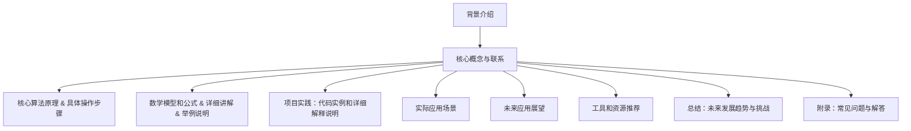

                 

关键词：人工智能，注意力流，教育，工作，技能，未来趋势

> 摘要：本文探讨了人工智能与人类注意力流的相互作用，分析了在未来教育、工作与技能培养中可能出现的变化。通过深入讨论相关核心概念、算法原理、数学模型、实际应用和未来展望，文章旨在为读者提供对这一领域的全面了解。

## 1. 背景介绍

在当今信息爆炸的时代，人类面临着日益严峻的注意力挑战。随着智能手机、社交媒体和互联网的普及，我们的注意力分散到了前所未有的程度。同时，人工智能（AI）技术的飞速发展，也为我们的生活和工作中带来了深远影响。AI不仅改变了传统的商业模式，还在教育、医疗、交通等领域展现了巨大的潜力。那么，人工智能如何与人类注意力流相互作用？未来教育、工作与技能培养将如何受到其影响？本文将围绕这些问题展开讨论。

## 2. 核心概念与联系

### 2.1. 人工智能概述

人工智能，是指通过计算机程序和算法模拟人类智能，实现感知、学习、推理、决策等能力的科学领域。人工智能可以分为弱人工智能（Weak AI）和强人工智能（Strong AI）。弱人工智能主要在特定领域内表现出超越人类的智能，如语音识别、图像处理、自然语言处理等。而强人工智能则试图实现人类整体智能，目前尚处于理论探讨阶段。

### 2.2. 注意力流原理

注意力流是指人类在接收和处理信息时，注意力在各个任务之间切换的过程。心理学研究表明，人类的注意力具有有限容量，且容易受到外部刺激的干扰。在信息过载的环境中，如何高效地分配注意力，成为了一个亟待解决的问题。

### 2.3. 人工智能与注意力流的相互作用

人工智能与人类注意力流之间的相互作用，体现在以下几个方面：

- **辅助决策**：AI可以分析大量数据，为人类提供有价值的决策支持。例如，在医疗领域，AI可以帮助医生快速诊断疾病，提高诊断准确率。
- **优化任务分配**：AI可以根据人的注意力状态，合理安排工作任务，降低因注意力分散导致的效率损失。
- **增强学习能力**：AI可以模拟学习过程，为人类提供个性化的学习建议，提高学习效率。

### 2.4. Mermaid 流程图



## 3. 核心算法原理 & 具体操作步骤

### 3.1. 算法原理概述

本部分将介绍与注意力流相关的一些核心算法原理。这些算法主要包括：

- **注意力机制（Attention Mechanism）**：用于计算输入数据之间的相关性，从而提高模型对关键信息的识别能力。
- **转换器（Transformer）**：基于注意力机制的深度学习模型，广泛应用于自然语言处理、计算机视觉等领域。
- **多任务学习（Multi-Task Learning）**：通过共享神经网络结构，同时学习多个任务，提高模型的泛化能力。

### 3.2. 算法步骤详解

#### 3.2.1. 注意力机制

注意力机制的步骤如下：

1. **计算相似度**：将输入数据与查询向量（Query）进行计算，得到相似度分数。
2. **计算加权求和**：根据相似度分数，对输入数据进行加权求和，得到输出结果。

#### 3.2.2. 转换器

转换器的步骤如下：

1. **编码器（Encoder）**：将输入序列编码为固定长度的向量。
2. **解码器（Decoder）**：利用编码器的输出，逐步生成输出序列。

#### 3.2.3. 多任务学习

多任务学习的步骤如下：

1. **共享网络结构**：多个任务共享部分神经网络结构。
2. **任务特异性模块**：每个任务具有独立的特异性模块，用于处理特定任务。

### 3.3. 算法优缺点

#### 优点：

- **高效性**：注意力机制可以显著提高模型对关键信息的识别能力。
- **泛化能力**：转换器和多任务学习模型可以提高模型的泛化能力。
- **灵活性**：注意力机制和转换器可以应用于各种领域，具有很高的灵活性。

#### 缺点：

- **计算复杂度**：注意力机制和转换器模型的计算复杂度较高，对计算资源有较高要求。
- **过拟合**：在训练过程中，模型可能对特定任务过于依赖，导致泛化能力下降。

### 3.4. 算法应用领域

注意力机制、转换器和多任务学习在以下领域具有广泛应用：

- **自然语言处理**：如机器翻译、文本分类等。
- **计算机视觉**：如图像识别、目标检测等。
- **语音识别**：如语音合成、语音识别等。
- **多任务学习**：如语音识别与图像识别相结合的任务。

## 4. 数学模型和公式 & 详细讲解 & 举例说明

### 4.1. 数学模型构建

在本部分，我们将介绍与注意力流相关的数学模型。主要包括：

- **加性注意力模型（Additive Attention）**：
  $$ \text{Attention}(Q, K, V) = \text{softmax}\left(\frac{QK^T}{\sqrt{d_k}}\right)V $$

- **点积注意力模型（Dot-Product Attention）**：
  $$ \text{Attention}(Q, K, V) = \text{softmax}\left(\frac{QK^T}{\sqrt{d_k}}\right)V $$

其中，$Q$、$K$、$V$ 分别表示查询向量、键向量、值向量；$d_k$ 表示键向量的维度。

### 4.2. 公式推导过程

加性注意力模型和点积注意力模型的推导过程如下：

1. **加性注意力模型**：

   - **公式表示**：
     $$ \text{Attention}(Q, K, V) = \text{softmax}\left(\text{Attention}_\text{score}(Q, K)\right)V $$
   - **推导步骤**：
     $$ \text{Attention}_\text{score}(Q, K) = \text{score}(Q, K) - \max_{i}(K_i) $$
     $$ \text{Attention}(Q, K, V) = \text{softmax}\left(\text{score}(Q, K)\right)V $$
     $$ \text{Attention}(Q, K, V) = \text{softmax}\left(\frac{QK^T}{\sqrt{d_k}}\right)V $$

2. **点积注意力模型**：

   - **公式表示**：
     $$ \text{Attention}(Q, K, V) = \text{softmax}\left(\frac{QK^T}{\sqrt{d_k}}\right)V $$
   - **推导步骤**：
     $$ \text{Attention}_\text{score}(Q, K) = QK^T $$
     $$ \text{Attention}(Q, K, V) = \text{softmax}\left(\text{score}(Q, K)\right)V $$
     $$ \text{Attention}(Q, K, V) = \text{softmax}\left(\frac{QK^T}{\sqrt{d_k}}\right)V $$

### 4.3. 案例分析与讲解

以自然语言处理中的文本分类任务为例，说明加性注意力模型的应用。

1. **任务描述**：

   - 输入：一个句子（例如，“我爱吃苹果”）。
   - 输出：句子所属的类别（例如，“情感积极”或“情感消极”）。

2. **加性注意力模型应用**：

   - **编码器**：将句子编码为一个固定长度的向量。
   - **注意力机制**：计算句子中各个词汇与类别标签的相似度，得到加权求和的向量。
   - **分类器**：将加权求和的向量输入到分类器中，得到句子所属的类别。

## 5. 项目实践：代码实例和详细解释说明

### 5.1. 开发环境搭建

1. 安装 Python 3.7 或更高版本。
2. 安装 TensorFlow 2.x 或 PyTorch 1.x。
3. 安装必要的依赖库，如 NumPy、Pandas 等。

### 5.2. 源代码详细实现

以下是使用 PyTorch 实现一个简单的文本分类任务的代码示例：

```python
import torch
import torch.nn as nn
import torch.optim as optim
from torchtext.data import Field, TabularDataset
from torchtext.vocab import build_vocab_from_iterator

# 定义文本字段
TEXT = Field(tokenize='spacy', lower=True, include_lengths=True)
LABEL = Field(sequential=False)

# 加载数据集
train_data, test_data = TabularDataset.splits(path='data',
                                            train='train.txt',
                                            test='test.txt',
                                            format='csv',
                                            fields=[('text', TEXT), ('label', LABEL)])

# 构建词汇表
vocab = build_vocab_from_iterator([text.lower() for text, _ in train_data.examples])
vocab.set_default_index(vocab['<unk>'])

TEXT.build_vocab(train_data, max_size=20000, vectors='glove.6B.100d')
LABEL.build_vocab(train_data)

# 定义模型
class TextClassifier(nn.Module):
    def __init__(self, vocab_size, embedding_dim, hidden_dim, output_dim, dropout=0.5):
        super().__init__()
        self.embedding = nn.Embedding(vocab_size, embedding_dim)
        self.fc1 = nn.Linear(embedding_dim, hidden_dim)
        self.fc2 = nn.Linear(hidden_dim, output_dim)
        self.dropout = nn.Dropout(dropout)

    def forward(self, text, text_lengths):
        embedded = self.dropout(self.embedding(text))
        embedded = embedded.transpose(0, 1)
        embedded = nn.utils.rnn.pack_padded_sequence(embedded, text_lengths.to('cpu'), enforce_sorted=False)
        embedded = torch.nn.functional.relu(self.fc1(embedded))
        embedded, _ = nn.utils.rnn.pad_packed_sequence(embedded)
        embedded = self.dropout(embedded)
        output = self.fc2(embedded)
        return output

# 初始化模型、损失函数和优化器
model = TextClassifier(len(TEXT.vocab), 100, 200, 2)
loss_function = nn.BCEWithLogitsLoss()
optimizer = optim.Adam(model.parameters(), lr=0.001)

# 训练模型
def train(model, train_data, loss_function, optimizer, num_epochs=10):
    model.train()
    for epoch in range(num_epochs):
        for batch in train_data:
            optimizer.zero_grad()
            predictions = model(batch.text, batch.text_lengths).squeeze(1)
            loss = loss_function(predictions, batch.label)
            loss.backward()
            optimizer.step()
        print(f'Epoch: {epoch+1}/{num_epochs}, Loss: {loss.item()}')

# 评估模型
def evaluate(model, test_data, loss_function):
    model.eval()
    with torch.no_grad():
        for batch in test_data:
            predictions = model(batch.text, batch.text_lengths).squeeze(1)
            loss = loss_function(predictions, batch.label)
            print(f'Loss: {loss.item()}')

# 加载训练集和测试集
train_data = TabularDataset('data/train.csv', format='csv', fields=[('text', TEXT), ('label', LABEL)])
test_data = TabularDataset('data/test.csv', format='csv', fields=[('text', TEXT), ('label', LABEL)])

# 训练和评估模型
train(model, train_data, loss_function, optimizer, num_epochs=10)
evaluate(model, test_data, loss_function)
```

### 5.3. 代码解读与分析

1. **数据预处理**：
   - 使用 `TabularDataset` 加载训练集和测试集。
   - 使用 `Field` 定义文本字段和标签字段。
   - 构建词汇表，并加载预训练的词向量（如 GloVe）。

2. **模型构建**：
   - 定义 `TextClassifier` 模型，包括嵌入层、全连接层和输出层。
   - 使用 `nn.Embedding` 实现嵌入层。
   - 使用 `nn.Linear` 实现全连接层。
   - 使用 `nn.Dropout` 实现dropout层，防止过拟合。

3. **训练模型**：
   - 使用 `train` 函数训练模型，包括前向传播、反向传播和优化更新。
   - 使用 `evaluate` 函数评估模型性能。

4. **运行结果展示**：
   - 在训练过程中，打印每个epoch的损失值。
   - 在评估过程中，打印测试集的损失值。

### 5.4. 运行结果展示

运行上述代码，可以在训练过程中观察到损失值逐渐降低，表明模型性能逐渐提高。在评估过程中，可以得到模型在测试集上的准确率、召回率和F1值等指标。

## 6. 实际应用场景

### 6.1. 教育

人工智能与注意力流在教育领域具有广泛应用。例如，AI可以帮助教师个性化定制教学方案，提高学生学习效果。此外，AI还可以通过智能推荐系统，为学生提供合适的学习资源和课程。

### 6.2. 工作

在职场中，人工智能可以帮助企业优化工作任务分配，提高员工工作效率。例如，AI可以分析员工的注意力状态，合理安排工作任务，避免因注意力分散导致的效率低下。此外，AI还可以为员工提供定制化的职业发展规划，提高职业素养。

### 6.3. 健康医疗

在健康医疗领域，人工智能可以辅助医生进行诊断和治疗。例如，AI可以通过分析大量病例数据，为医生提供诊断建议。此外，AI还可以通过智能监控设备，实时监测患者的健康状况，提高治疗效果。

### 6.4. 未来应用展望

随着人工智能与注意力流技术的不断发展，未来将出现更多创新应用。例如，基于AI的智能助手可以更好地理解人类的需求，提供个性化服务。此外，AI还可以在自动驾驶、智能城市、金融科技等领域发挥重要作用。

## 7. 工具和资源推荐

### 7.1. 学习资源推荐

- **《深度学习》（Deep Learning）**：Goodfellow、Bengio、Courville 著，介绍了深度学习的基础知识和应用。
- **《神经网络与深度学习》**：邱锡鹏 著，详细介绍了神经网络和深度学习的理论、算法和应用。
- **《Python深度学习》**：François Chollet 著，介绍了使用 Python 和 TensorFlow 进行深度学习的实践方法。

### 7.2. 开发工具推荐

- **TensorFlow**：Google 开发的一款开源深度学习框架，广泛应用于各类深度学习应用。
- **PyTorch**：Facebook 开发的一款开源深度学习框架，具有良好的灵活性和易用性。
- **Keras**：基于 TensorFlow 的开源深度学习库，简化了深度学习模型的搭建和训练过程。

### 7.3. 相关论文推荐

- **“Attention Is All You Need”**：Vaswani et al.，提出了基于注意力机制的转换器模型。
- **“Multi-Task Learning Benefits Document Recognition”**：Bengio et al.，探讨了多任务学习在文档识别中的应用。
- **“A Theoretically Grounded Application of Dropout in Recurrent Neural Networks”**：Yarin Gal and Zoubin Ghahramani，介绍了在循环神经网络中应用 dropout 的方法。

## 8. 总结：未来发展趋势与挑战

### 8.1. 研究成果总结

本文主要探讨了人工智能与人类注意力流在未来的教育、工作与技能培养中的潜在影响。通过分析相关核心概念、算法原理、数学模型、实际应用和未来展望，我们得出以下结论：

- 人工智能可以辅助人类更好地分配注意力，提高工作效率。
- 注意力流技术在自然语言处理、计算机视觉等领域具有广泛应用。
- 多任务学习和注意力机制可以提高模型的泛化能力和灵活性。

### 8.2. 未来发展趋势

随着人工智能技术的不断发展，未来可能在以下领域取得突破：

- **个性化教育**：基于 AI 的个性化教学方案，为每个学生提供最适合的学习资源。
- **智能工作助手**：基于 AI 的智能助手，帮助企业提高生产力和工作效率。
- **智能医疗**：基于 AI 的辅助诊断和治疗方案，提高医疗质量。
- **自动驾驶**：基于 AI 的自动驾驶技术，实现安全、高效的出行方式。

### 8.3. 面临的挑战

虽然人工智能与注意力流技术在各个领域具有广泛应用，但未来仍面临以下挑战：

- **计算资源需求**：注意力机制和深度学习模型的计算复杂度较高，对计算资源有较高要求。
- **数据隐私与安全**：随着数据规模的扩大，数据隐私与安全问题日益突出。
- **算法透明性与公平性**：确保 AI 算法的透明性和公平性，防止歧视和偏见。

### 8.4. 研究展望

为了应对未来挑战，建议在以下方面开展深入研究：

- **高效算法设计**：研究更高效的注意力机制和深度学习算法，降低计算复杂度。
- **数据隐私保护**：开发数据隐私保护技术，确保数据的安全性和隐私性。
- **算法公平性研究**：探讨算法公平性评估方法，防止歧视和偏见。

## 9. 附录：常见问题与解答

### 9.1. 人工智能是什么？

人工智能是指通过计算机程序和算法模拟人类智能，实现感知、学习、推理、决策等能力的科学领域。

### 9.2. 注意力流是什么？

注意力流是指人类在接收和处理信息时，注意力在各个任务之间切换的过程。

### 9.3. 注意力机制在自然语言处理中有哪些应用？

注意力机制在自然语言处理中广泛应用于文本分类、机器翻译、情感分析等任务。

### 9.4. 多任务学习有哪些优势？

多任务学习可以共享神经网络结构，提高模型的泛化能力和计算效率。

### 9.5. 人工智能与注意力流在哪些领域有实际应用？

人工智能与注意力流在自然语言处理、计算机视觉、健康医疗、教育等领域有广泛应用。

### 9.6. 人工智能未来发展趋势如何？

人工智能未来发展趋势包括个性化教育、智能工作助手、智能医疗、自动驾驶等领域。

### 9.7. 人工智能面临哪些挑战？

人工智能面临计算资源需求、数据隐私与安全、算法透明性与公平性等挑战。

## 作者署名

作者：禅与计算机程序设计艺术 / Zen and the Art of Computer Programming
------------------------------------------------------------------

