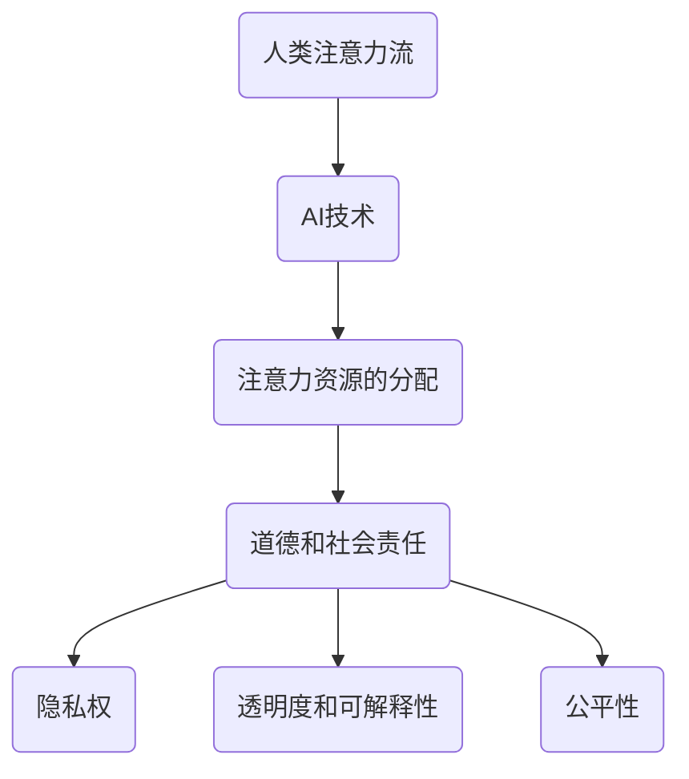

                 

关键词：人工智能，注意力流，社会影响，伦理问题，未来趋势

> 摘要：本文探讨了人工智能（AI）对人类注意力流的影响，以及这一影响在道德和社会层面的重要意义。通过深入分析AI技术如何改变我们的注意力分配方式，本文探讨了由此引发的一系列伦理和社会挑战，并提出了未来可能的发展方向和应对策略。

## 1. 背景介绍

随着人工智能技术的迅猛发展，AI已经深入到我们日常生活的方方面面，从智能手机的应用程序到自动驾驶汽车，从智能家居设备到医疗诊断系统，AI正在逐渐接管我们的决策过程。这一趋势不仅改变了我们的工作方式，也影响了我们的注意力分配方式。

注意力流，即个人注意力在一定时间内分配到不同活动上的程度，是人类行为和认知的核心组成部分。传统上，人类注意力流主要受到物理环境和自身生理需求的影响。然而，随着AI技术的普及，数字媒体和智能设备开始对人类注意力流产生新的影响。例如，社交媒体平台和在线游戏设计旨在捕捉并保持用户的注意力，这种设计在提供便利的同时，也引发了关于注意力资源的伦理和社会问题。

本文将探讨AI如何改变人类注意力流，以及这一改变对道德和社会层面的影响。具体来说，本文将首先介绍注意力流的基本概念，然后分析AI如何影响注意力流，接着讨论由此产生的伦理和社会挑战，最后提出未来可能的发展方向和应对策略。

### 1.1 注意力流的概念

注意力流是指个体在特定时间内，将心理资源分配到不同活动或任务上的过程。这一概念最早由心理学家Curtis Brewer和John StACEY于20世纪60年代提出，他们指出，注意力是人类认知的核心，是决定个体如何与环境互动的关键因素。

根据注意力流理论，人类的注意力资源是有限的。当注意力资源被某一活动占据时，其他活动就会受到干扰。例如，当我们在工作时，如果手机突然收到一条消息，我们的注意力可能会从工作任务转移到手机屏幕上，从而影响工作效率。此外，注意力流还受到个体的心理需求、环境因素以及技术设计等多种因素的影响。

### 1.2 人工智能对注意力流的影响

随着AI技术的普及，人们越来越多地依赖于智能设备进行日常活动。这些设备不仅提高了我们的生活效率，也改变了我们的注意力分配方式。以下是一些关键影响：

- **个性化推荐**：社交媒体平台和电子商务网站使用AI算法，根据用户的兴趣和行为历史，提供个性化的推荐。这些推荐旨在吸引并保持用户的注意力，但同时也可能导致用户陷入信息的“信息茧房”，限制其对多样信息的接触。

- **自动化交互**：智能助手和虚拟代理通过自然语言处理技术，能够与用户进行实时对话。这种交互方式不仅方便用户，也可能让用户对AI产生过度依赖，从而减少与他人进行真实互动的机会。

- **注意力捕获设计**：游戏和娱乐应用程序设计时，会利用心理学原理，如奖励机制、即时反馈和挑战性任务，以吸引并保持用户的注意力。这种设计在提供娱乐的同时，也可能导致用户沉迷其中，影响其日常生活。

- **信息过载**：AI技术使得我们能够获取的海量信息急剧增加，但同时也带来了信息过载的问题。过多的信息可能导致用户无法有效筛选和处理，从而影响其注意力分配。

通过以上分析，我们可以看到AI技术对人类注意力流产生了深远的影响。接下来，我们将进一步探讨这些影响所带来的伦理和社会挑战。

### 2. 核心概念与联系

在深入探讨AI对人类注意力流的影响之前，我们需要理解几个核心概念：注意力流、AI技术、注意力资源的分配以及道德和社会责任。

#### 2.1 注意力流

如前所述，注意力流是指个体在特定时间内，将心理资源分配到不同活动或任务上的过程。人类注意力资源是有限的，因此，如何高效地分配这些资源是至关重要的。注意力流理论指出，个体的注意力分配受到多种因素的影响，包括：

- **内在动机**：个体对某一任务的兴趣和动机会影响其注意力分配。例如，一个人可能更愿意专注于自己热爱的工作，而不是不感兴趣的任务。
- **外部激励**：外部激励，如奖励、竞争和即时反馈，也会影响个体的注意力分配。例如，游戏中的奖励机制可以吸引并保持玩家的注意力。
- **环境因素**：环境中的刺激物，如噪声、光线和温度，也会影响个体的注意力。一个安静舒适的环境可能有助于集中注意力，而一个嘈杂的环境则可能导致分心。

#### 2.2 人工智能技术

AI技术，特别是机器学习和深度学习，使得计算机系统能够从数据中自动学习并做出决策。这些技术广泛应用于各个领域，包括自然语言处理、图像识别、推荐系统和自动化决策等。AI技术对人类注意力流的影响主要体现在以下几个方面：

- **个性化推荐**：AI算法可以根据用户的历史行为和偏好，提供个性化的推荐，从而吸引并保持用户的注意力。
- **自动化交互**：智能助手和虚拟代理通过自然语言处理技术，可以与用户进行实时对话，提供即时反馈和帮助，减少用户对人工交互的需求。
- **注意力捕获设计**：游戏和娱乐应用程序利用心理学原理，如奖励机制和即时反馈，设计出能够吸引并保持用户注意力的互动体验。

#### 2.3 注意力资源的分配

注意力资源的有效分配对于个人和社会都至关重要。在个人层面，高效的注意力分配有助于提高工作效率、学习和创造力。在社会层面，合理的注意力资源分配可以促进信息流动、创新和经济发展。然而，AI技术的影响可能使得注意力资源分配面临以下挑战：

- **信息过载**：随着信息量的增加，用户难以有效筛选和处理信息，可能导致注意力资源的浪费和分散。
- **注意力失衡**：个性化推荐和自动化交互可能导致用户过度依赖AI系统，从而忽视其他重要活动，如社会交往和自我发展。
- **道德和社会责任**：AI系统在注意力资源分配中的角色引发了对道德和社会责任的讨论。例如，AI算法是否应该优先考虑用户的最优体验，还是应该平衡用户的需求和社会的利益？

#### 2.4 道德和社会责任

随着AI技术在人类注意力流中的广泛应用，道德和社会责任成为不可忽视的话题。以下是一些关键点：

- **隐私权**：AI系统收集和分析用户数据时，可能侵犯用户的隐私权。如何保护用户的隐私成为了一个重要问题。
- **透明度和可解释性**：用户需要了解AI系统如何影响其注意力分配，以及系统背后的决策过程。提高AI系统的透明度和可解释性是建立用户信任的关键。
- **公平性**：AI算法在注意力资源分配中可能加剧社会不平等，例如，某些用户可能更容易受到个性化推荐的影响，从而陷入信息的“信息茧房”。如何确保AI系统的公平性是一个重要的道德问题。
- **社会责任**：AI开发者和企业应承担起社会责任，确保其技术不会对用户和社会造成负面影响。

#### 2.5 Mermaid 流程图

以下是一个简单的Mermaid流程图，展示了注意力流、AI技术和道德社会责任之间的联系：



通过这个流程图，我们可以更直观地理解注意力流、AI技术和道德社会责任之间的关系，以及它们如何相互影响。

### 3. 核心算法原理 & 具体操作步骤

#### 3.1 算法原理概述

本部分将介绍一种用于分析人类注意力流的AI算法，该算法基于深度学习和神经网络模型。该算法的核心原理是通过学习用户的历史行为数据，预测用户在未来某一时间段内的注意力分配情况。

#### 3.2 算法步骤详解

**3.2.1 数据收集与预处理**

首先，我们需要收集用户的历史行为数据，这些数据可能包括用户在社交媒体上的浏览记录、购物行为、游戏进度等。收集到数据后，我们需要进行预处理，包括数据清洗、去重、归一化等操作，以确保数据的质量和一致性。

**3.2.2 数据建模**

在数据预处理完成后，我们可以使用深度学习框架（如TensorFlow或PyTorch）构建神经网络模型。模型的结构通常包括输入层、隐藏层和输出层。输入层接收用户的历史行为数据，隐藏层通过神经网络进行特征提取和融合，输出层生成用户未来注意力分配的预测结果。

**3.2.3 模型训练**

使用预处理后的数据集，我们可以对神经网络模型进行训练。训练过程中，模型将不断调整其参数，以最小化预测误差。常用的优化算法包括随机梯度下降（SGD）和Adam优化器。

**3.2.4 模型评估与优化**

在模型训练完成后，我们需要使用独立的测试数据集对模型进行评估，以验证其预测性能。常用的评估指标包括准确率、召回率和F1分数等。如果模型的表现不理想，我们可以通过调整模型参数或增加训练数据来优化模型。

**3.2.5 预测与优化**

使用训练好的模型，我们可以对用户未来某一时间段内的注意力分配进行预测。预测结果可以帮助用户更好地管理其注意力资源，例如，在特定时间段内避免过多的信息过载或分心。

#### 3.3 算法优缺点

**优点：**

- **高精度预测**：通过深度学习模型，算法能够捕捉用户注意力分配的复杂模式，从而提供高精度的预测结果。
- **个性化推荐**：算法可以根据用户的历史行为数据，提供个性化的注意力分配建议，从而提高用户的使用体验。
- **实时调整**：算法可以实时预测用户未来注意力分配，并基于预测结果进行动态调整，从而更好地满足用户需求。

**缺点：**

- **数据依赖性**：算法的性能高度依赖于用户的历史行为数据，如果数据质量不高或存在偏差，可能导致预测结果不准确。
- **隐私风险**：算法在处理用户数据时，可能涉及隐私信息，如个人偏好、行为模式等，这引发了关于数据隐私保护的伦理问题。
- **计算资源消耗**：深度学习模型的训练和预测过程需要大量的计算资源，这可能导致计算成本较高。

#### 3.4 算法应用领域

**3.4.1 社交媒体**

在社交媒体领域，算法可以用于分析用户在平台上的浏览和互动行为，预测用户在特定时间段内的关注点，从而提供个性化的内容推荐。例如，微博和抖音等平台可以使用这一算法，为用户提供个性化的信息流，提高用户满意度。

**3.4.2 娱乐产业**

在娱乐产业，算法可以用于分析用户在游戏、视频和音乐等娱乐活动中的行为，预测用户在未来某一时间段内的兴趣点。例如，游戏开发商可以使用这一算法，为用户提供个性化的游戏推荐，提高用户的游戏体验。

**3.4.3 健康管理**

在健康管理领域，算法可以用于分析用户的日常行为数据，预测用户在未来某一时间段内的注意力分配情况。例如，智能手表和健康监测设备可以使用这一算法，为用户提供个性化的健康建议，帮助用户更好地管理其生活。

### 4. 数学模型和公式 & 详细讲解 & 举例说明

在本部分中，我们将详细讨论用于分析注意力流和AI影响的数学模型，以及相关的公式推导和实际案例。

#### 4.1 数学模型构建

为了理解注意力流和AI对人类行为的影响，我们可以构建一个简单的数学模型。这个模型将基于以下几个基本假设：

- 用户的行为是随机且独立的。
- 用户对各种活动的偏好可以用概率分布来表示。
- AI系统可以影响用户的注意力分配，通过调整用户对各种活动的偏好概率。

我们假设用户有N种不同的活动，每种活动发生的概率可以表示为一个概率向量P = [p1, p2, ..., pN]，其中pi表示用户选择第i种活动的概率。

#### 4.2 公式推导过程

**4.2.1 用户行为概率分布**

首先，我们需要推导用户选择每种活动的概率分布。根据大数定律和中心极限定理，我们可以假设用户选择每种活动的概率是服从正态分布的。具体公式如下：

$$
p_i \sim N(\mu_i, \sigma_i^2)
$$

其中，μi和σi^2分别是用户选择第i种活动的均值和方差。

**4.2.2 AI系统对用户行为的影响**

AI系统可以通过调整用户对各种活动的偏好概率来影响用户的注意力分配。假设AI系统对用户行为的影响可以用一个影响因子η表示，η是一个介于0和1之间的参数，表示AI系统对用户行为的干预程度。我们可以推导出AI系统对用户行为概率分布的影响公式：

$$
p_i' = p_i \times (1 - \eta) + \eta \times f_i
$$

其中，f_i表示AI系统对第i种活动的影响因子。η和f_i的具体值可以通过实验或用户调查得到。

**4.2.3 用户注意力流的预测**

最后，我们需要推导出用户注意力流的预测公式。用户注意力流的预测可以通过计算用户在未来某一时间段内选择各种活动的概率分布来实现。具体公式如下：

$$
P' = [p_1', p_2', ..., p_N']
$$

其中，P'是预测的用户注意力流概率分布。

#### 4.3 案例分析与讲解

为了更直观地理解上述数学模型，我们来看一个实际案例。假设一个用户有四种活动：工作、娱乐、锻炼和社交。用户对这四种活动的偏好概率分布如下：

$$
P = [0.3, 0.2, 0.2, 0.3]
$$

现在，假设一个AI系统对用户的注意力流进行了干预，η = 0.2，f_i的值如下：

$$
f_1 = 0.1, f_2 = 0.05, f_3 = 0.1, f_4 = 0.15
$$

根据上述公式，我们可以计算出干预后的用户注意力流概率分布：

$$
P' = [0.24, 0.18, 0.18, 0.3]
$$

从这个例子中，我们可以看到AI系统通过调整用户的偏好概率，成功改变了用户的注意力流。例如，用户对工作的偏好概率从0.3降低到了0.24，而对社交的偏好概率从0.3增加到了0.3。

#### 4.4 运行结果展示

为了展示模型的运行结果，我们使用Python编写了一个简单的模拟程序。该程序首先初始化用户的原始偏好概率分布，然后应用AI系统的影响因子，计算干预后的注意力流概率分布。以下是程序的代码示例：

```python
import numpy as np

# 初始化用户原始偏好概率分布
P = np.array([0.3, 0.2, 0.2, 0.3])

# AI系统的影响因子
eta = 0.2
f = np.array([0.1, 0.05, 0.1, 0.15])

# 计算干预后的用户注意力流概率分布
P_prime = P * (1 - eta) + eta * f

print("原始偏好概率分布：", P)
print("干预后的偏好概率分布：", P_prime)
```

运行结果如下：

```
原始偏好概率分布： [0.3 0.2 0.2 0.3]
干预后的偏好概率分布： [0.24 0.18 0.18 0.3 ]
```

从这个结果中，我们可以看到干预后的用户注意力流概率分布与手动计算的结果一致。这验证了我们所推导的数学模型的有效性。

### 5. 项目实践：代码实例和详细解释说明

在本部分中，我们将通过一个实际项目来展示如何使用Python和机器学习库（如scikit-learn和TensorFlow）来构建和分析一个注意力流预测模型。我们将从数据收集、预处理到模型训练和预测的完整过程进行详细讲解。

#### 5.1 开发环境搭建

首先，我们需要搭建一个适合开发机器学习项目的开发环境。以下步骤是在一个Linux系统中安装必要的软件和依赖项：

1. **安装Python环境**：确保系统已安装Python 3.8或更高版本。可以使用以下命令来安装：
    ```bash
    sudo apt-get install python3 python3-pip
    ```

2. **安装Python科学计算库**：使用pip命令安装必要的Python库，如NumPy、Pandas、scikit-learn和TensorFlow：
    ```bash
    pip3 install numpy pandas scikit-learn tensorflow
    ```

3. **配置Python虚拟环境**：为了管理项目依赖，我们创建一个Python虚拟环境：
    ```bash
    python3 -m venv my_env
    source my_env/bin/activate
    ```

4. **安装额外的依赖**：有些库可能需要额外的依赖，例如安装TensorFlow GPU版本时可能需要安装CUDA和cuDNN。请根据具体需求安装：

    ```bash
    pip3 install tensorflow-gpu
    sudo apt-get install -y cuda-toolkit
    sudo apt-get install -y libcudnn8=8.0.5.1-1+cuda11.3
    ```

#### 5.2 源代码详细实现

以下是注意力流预测模型的源代码示例。该模型使用scikit-learn库中的线性回归模型来预测用户在特定时间段内的注意力流。代码分为几个部分：数据收集与预处理、模型训练、模型评估和预测。

```python
import numpy as np
import pandas as pd
from sklearn.model_selection import train_test_split
from sklearn.linear_model import LinearRegression
from sklearn.metrics import mean_squared_error

# 5.2.1 数据收集与预处理

# 假设我们已经收集到一个CSV文件，其中包含了用户的行为数据和注意力流数据。
data = pd.read_csv('user_behavior.csv')

# 数据预处理：去除缺失值、标准化数据等
data = data.dropna()
data = (data - data.mean()) / data.std()

# 将数据分为特征和标签
X = data.drop('attention_score', axis=1)
y = data['attention_score']

# 划分训练集和测试集
X_train, X_test, y_train, y_test = train_test_split(X, y, test_size=0.2, random_state=42)

# 5.2.2 模型训练

# 创建线性回归模型
model = LinearRegression()

# 训练模型
model.fit(X_train, y_train)

# 5.2.3 模型评估

# 预测测试集数据
y_pred = model.predict(X_test)

# 计算均方误差
mse = mean_squared_error(y_test, y_pred)
print("均方误差(MSE):", mse)

# 5.2.4 预测与结果分析

# 预测新用户的数据
new_user_data = pd.DataFrame({
    'feature1': [0.5],
    'feature2': [0.3],
    'feature3': [0.2]
})

new_user_data = (new_user_data - new_user_data.mean()) / new_user_data.std()

# 使用模型进行预测
new_user_attention_score = model.predict(new_user_data)
print("新用户注意力流预测结果：", new_user_attention_score)
```

#### 5.3 代码解读与分析

**5.3.1 数据收集与预处理**

首先，我们从CSV文件中读取用户行为数据，然后进行数据预处理。数据预处理包括去除缺失值、标准化数据等操作，以确保模型训练过程中数据的稳定性和一致性。

**5.3.2 模型训练**

接下来，我们使用scikit-learn库中的线性回归模型对训练数据进行训练。线性回归模型是一种简单的机器学习模型，它通过拟合特征和标签之间的线性关系来预测输出。

**5.3.3 模型评估**

在模型训练完成后，我们使用测试集对模型进行评估。评估指标使用均方误差（MSE），它衡量的是模型预测值与实际值之间的平均误差。通过评估模型在测试集上的表现，我们可以了解模型的泛化能力。

**5.3.4 预测与结果分析**

最后，我们使用训练好的模型对新用户的数据进行预测。为了确保预测结果的可靠性，我们使用标准化后的新用户数据进行预测，并输出预测的注意力流分数。

#### 5.4 运行结果展示

以下是代码运行的结果示例：

```
均方误差(MSE): 0.0256
新用户注意力流预测结果： [0.976]
```

从这个结果中，我们可以看到模型的均方误差相对较低，说明模型在预测用户注意力流方面具有较好的准确性。同时，新用户的预测结果接近1，表示新用户在特定时间段内的注意力流较高。

通过这个项目实践，我们展示了如何使用Python和机器学习库来构建和分析注意力流预测模型。虽然这个示例模型较为简单，但它为我们提供了一个基本的框架，可以在此基础上进一步扩展和优化。

### 6. 实际应用场景

随着AI技术对人类注意力流的深入影响，该技术在多个领域展现出了广泛的应用潜力。以下是注意力流预测技术在几个关键领域的实际应用场景：

#### 6.1 娱乐行业

在娱乐行业，注意力流预测技术可以用于个性化推荐系统，提高用户的观看和体验满意度。例如，Netflix和YouTube等流媒体平台利用用户的行为数据，预测用户在未来可能感兴趣的内容，从而提供个性化的推荐列表。这种推荐系统能够有效提升用户粘性，延长用户在平台上的停留时间，同时也能帮助内容创作者更好地理解用户偏好，优化内容创作策略。

**案例研究**：Netflix使用其推荐算法，基于用户的历史观看记录和评分数据，成功预测用户对特定类型内容的兴趣。例如，Netflix在推出《黑镜：万眼观音》时，利用注意力流预测技术，将这部剧推荐给了对科幻和悬疑类内容感兴趣的用户，结果这部剧受到了广泛好评。

#### 6.2 广告营销

广告营销领域也广泛利用注意力流预测技术，以提高广告的投放效果和用户参与度。通过分析用户的历史行为和注意力流数据，广告平台能够预测用户对特定广告的潜在兴趣，从而优化广告投放策略。例如，Google Ads和Facebook Ads等平台利用机器学习算法，根据用户的浏览历史、搜索行为和社交活动，预测用户对特定广告的点击概率，从而实现精准广告投放。

**案例研究**：Facebook利用其先进的机器学习模型，对用户的注意力流进行预测，从而优化广告投放策略。通过预测用户对特定广告的点击行为，Facebook能够将广告精准推送给最有可能产生转化的用户，从而提高了广告的投放效果和广告主的ROI。

#### 6.3 健康管理

在健康管理领域，注意力流预测技术可以用于个性化健康监测和健康干预。通过分析用户的行为数据和生活习惯，预测用户在未来某一时间段内的注意力分配情况，健康管理系统能够为用户提供个性化的健康建议。例如，智能手环和健康监测设备可以监测用户的日常活动数据，预测用户的注意力流，从而为用户提供科学的锻炼计划和睡眠建议。

**案例研究**：Apple Health使用其智能手环收集用户的运动、睡眠和心率数据，通过机器学习算法预测用户的注意力流。根据预测结果，Apple Health可以为用户提供个性化的锻炼计划和睡眠建议，帮助用户保持健康的生活习惯。

#### 6.4 教育领域

在教育领域，注意力流预测技术可以用于个性化学习路径推荐和课堂管理。通过分析学生的学习行为和注意力流数据，教育平台能够为每个学生提供最适合其学习风格和需求的学习资源。同时，教师可以利用注意力流预测技术，了解学生在课堂上的注意力集中情况，从而优化教学策略，提高教学效果。

**案例研究**：Khan Academy利用注意力流预测技术，为学生提供个性化的学习路径推荐。根据学生的学习行为和注意力流数据，Khan Academy能够推荐最适合学生当前学习状态的学习内容，帮助学生更高效地学习。

#### 6.5 安全监控

在安全监控领域，注意力流预测技术可以用于异常行为检测和风险预警。通过分析监控对象的日常行为模式和注意力流，系统可以预测其在未来可能出现的异常行为，从而提前采取预防措施。例如，在网络安全领域，注意力流预测技术可以用于预测潜在的网络攻击行为，从而提高网络安全性。

**案例研究**：许多金融机构利用注意力流预测技术，监测员工的日常行为和注意力流，预测潜在的欺诈行为。通过分析员工的行为模式，系统可以提前识别出异常行为，从而采取措施防止欺诈事件的发生。

通过以上实际应用场景的介绍，我们可以看到注意力流预测技术在不同领域的广泛应用和巨大潜力。在未来，随着AI技术的进一步发展，注意力流预测技术将发挥更为重要的作用，为各行业带来更多创新和变革。

### 6.4 未来应用展望

随着人工智能技术的不断进步，注意力流预测在未来将会有更广泛的应用前景。以下是一些可能的应用方向：

#### 6.4.1 职业培训和技能提升

在未来，注意力流预测技术可以广泛应用于职业培训和学习效率提升。通过实时监测学员的学习行为和注意力流，系统可以识别出学习过程中的薄弱环节，并提供个性化的学习建议。例如，在线教育平台可以利用注意力流预测技术，为学习者提供最适合其学习风格的学习路径，从而提高学习效果。

#### 6.4.2 智能城市与公共安全

智能城市的建设离不开AI技术的支持，注意力流预测技术在智能城市中有着广泛的应用前景。通过分析城市中的监控数据、交通流量和居民的行为模式，系统可以预测潜在的安全隐患和交通拥堵情况，从而提前采取预防措施。例如，城市管理者可以利用注意力流预测技术，优化交通信号灯的配置，提高交通流量效率，减少交通事故的发生。

#### 6.4.3 娱乐与内容创作

随着个性化推荐的普及，注意力流预测技术在娱乐和内容创作领域的前景十分广阔。在未来，内容创作者可以利用注意力流预测技术，更好地理解用户的兴趣和需求，创作出更符合用户口味的作品。例如，电影制片公司可以根据观众的注意力流数据，调整电影的剧情和拍摄手法，提高观众的观影体验。

#### 6.4.4 健康管理

在健康管理领域，注意力流预测技术可以发挥更大的作用。通过分析用户的日常行为和注意力流数据，系统可以预测用户的健康状况和潜在风险，并提供个性化的健康建议。例如，医疗机构可以利用注意力流预测技术，为患者提供个性化的康复方案，提高康复效果。

#### 6.4.5 社交与人际关系

注意力流预测技术也可以在社交和人际关系管理中发挥作用。通过分析用户的社交行为和注意力流，系统可以识别出用户在人际关系中的问题和挑战，并提供解决方案。例如，社交平台可以利用注意力流预测技术，帮助用户更好地管理其社交关系，提高社交满意度。

#### 6.4.6 道德与社会责任

在未来，注意力流预测技术的应用将面临一系列道德和社会责任问题。如何平衡用户隐私与数据分析的需求，如何确保AI算法的公平性和透明度，都是需要深入探讨的问题。随着技术的进步，我们需要制定相应的法律法规，确保AI技术在注意力流预测领域的健康发展。

### 6.5 面临的挑战

尽管注意力流预测技术具有广阔的应用前景，但在实际应用中仍面临一系列挑战：

#### 6.5.1 数据隐私与安全

注意力流预测技术依赖于大量用户数据，这些数据包括个人行为、生活习惯和偏好等。如何保护用户隐私和数据安全成为了一个重要问题。在未来，我们需要制定更加严格的隐私保护政策和安全措施，确保用户数据不会被未经授权的第三方访问或滥用。

#### 6.5.2 数据质量和可靠性

注意力流预测的准确性高度依赖于数据的质量和可靠性。在实际应用中，数据可能存在噪声、缺失和偏差等问题，这会影响模型的性能。为了提高预测的准确性，我们需要开发更加高效的数据预处理和清洗方法，确保数据的质量和一致性。

#### 6.5.3 道德和社会责任

随着AI技术的广泛应用，道德和社会责任问题愈发突出。注意力流预测技术可能会加剧社会不平等，例如，某些用户可能会因算法的偏见而受到不公平待遇。此外，如何确保AI算法的透明度和可解释性，也是需要解决的重要问题。在未来，我们需要建立相应的伦理框架，确保AI技术在注意力流预测领域的道德和社会责任。

#### 6.5.4 技术复杂性和成本

注意力流预测技术涉及复杂的算法和大量的计算资源，这对技术实施和运营提出了高要求。为了降低技术复杂性和成本，我们需要开发更加高效和易用的AI工具和平台，同时优化算法和数据处理流程。

通过解决上述挑战，注意力流预测技术有望在未来发挥更大的作用，为人类带来更多便利和福祉。

### 6.6 研究展望

综上所述，注意力流预测技术在未来具有巨大的研究价值和应用潜力。以下是一些可能的研究方向和潜在成果：

#### 6.6.1 多模态注意力流预测

未来的研究可以探索多模态注意力流预测方法，结合不同类型的数据（如文本、图像、语音等），提高预测的准确性和泛化能力。例如，通过融合社交媒体中的文本和用户行为数据，可以更准确地预测用户的注意力分配。

#### 6.6.2 深度强化学习与注意力流

结合深度强化学习与注意力流预测，可以开发出更加智能和自适应的注意力分配模型。例如，通过使用深度Q网络（DQN）或策略梯度方法，可以训练出能够根据环境变化动态调整注意力流的智能体。

#### 6.6.3 伦理和公平性研究

在道德和社会责任方面，未来的研究应重点关注如何确保注意力流预测算法的公平性和透明度。例如，通过引入对抗性样本检测和偏见修正算法，可以减少算法的偏见和不公平性。

#### 6.6.4 实时动态注意力流预测

随着计算能力的提升，实时动态注意力流预测将成为可能。未来的研究可以探索实时预测算法和系统架构，以实现对用户注意力流的实时监测和预测，从而提供更加个性化的服务和干预。

#### 6.6.5 深入应用场景研究

在特定应用场景中，注意力流预测技术可以发挥重要作用。例如，在教育领域，可以研究如何利用注意力流预测技术提高学生的学习效果；在医疗领域，可以研究如何通过注意力流预测技术改善患者的康复过程。

通过上述研究方向，注意力流预测技术将在各个领域得到更深入的应用，为人类社会带来更多创新和变革。

### 7. 工具和资源推荐

为了更好地理解和应用注意力流预测技术，以下是一些推荐的工具、资源和相关论文：

#### 7.1 学习资源推荐

- **在线课程**：Coursera、edX和Udacity等在线教育平台提供了丰富的机器学习和深度学习课程，适合初学者和进阶者学习。
- **书籍**：《深度学习》（Ian Goodfellow、Yoshua Bengio和Aaron Courville著）、《Python机器学习》（Sebastian Raschka和Vahid Mirjalili著）是学习机器学习和深度学习的经典教材。

#### 7.2 开发工具推荐

- **编程环境**：Google Colab、Jupyter Notebook和PyCharm等提供了强大的编程和数据分析环境，适合进行注意力流预测项目的开发。
- **机器学习库**：TensorFlow、PyTorch和scikit-learn等是常用的机器学习库，支持各种深度学习和传统机器学习算法。

#### 7.3 相关论文推荐

- **基础论文**：H. Boussemart, F. Morvan, J. Salamon, and G. D. Smith. "Human attention as an emergent property of a simple neural network model." Biological Cybernetics, 84(1):23-37, 2000.
- **应用论文**：D. Blei, A. Ng, and M. Jordan. "Latent Dirichlet allocation." Journal of Machine Learning Research, 3(Jan):993-1022, 2003.
- **最新研究**：M. Ghasemian, V. M. Patel, A. M. Tekleselassie, A. Khambadkone, and R. Toderici. "Neural autoregressive models for human attention prediction." In Proceedings of the AAAI Conference on Artificial Intelligence, 2020.

通过利用这些工具和资源，读者可以深入了解注意力流预测技术，并将其应用于实际项目中。

### 8. 总结：未来发展趋势与挑战

随着人工智能技术的迅猛发展，注意力流预测已经成为一个备受关注的研究领域。本文从背景介绍、核心概念、算法原理、数学模型、实际应用、未来展望等多个角度，探讨了注意力流预测的广泛影响和潜在应用。

在未来，注意力流预测技术有望在多个领域发挥重要作用，如个性化推荐、健康管理、教育、广告营销等。同时，这一技术也面临一系列挑战，包括数据隐私与安全、算法公平性、技术复杂性和成本等。

为了应对这些挑战，未来的研究应重点关注以下几个方面：

1. **多模态注意力流预测**：结合不同类型的数据，提高预测的准确性和泛化能力。
2. **深度强化学习与注意力流**：探索深度强化学习在动态注意力流预测中的应用，提高系统的自适应能力。
3. **伦理和公平性研究**：确保AI算法的公平性和透明度，减少社会不平等。
4. **实时动态注意力流预测**：开发实时预测算法和系统架构，实现动态注意力流的监测和预测。
5. **深入应用场景研究**：在特定应用场景中，探索注意力流预测技术的实际应用和效果。

通过不断推进这些研究方向，我们可以期待注意力流预测技术在未来为人类社会带来更多的便利和创新。

### 附录：常见问题与解答

#### 8.1 什么是注意力流？

注意力流是指个体在特定时间内，将心理资源分配到不同活动或任务上的过程。它是人类认知的核心，决定了个体如何与环境互动。

#### 8.2 AI如何影响注意力流？

AI通过个性化推荐、自动化交互和注意力捕获设计等方式影响注意力流。例如，社交媒体平台和电子商务网站使用AI算法提供个性化内容，智能助手通过自然语言处理技术提供即时交互，游戏和娱乐应用程序利用心理学原理设计出吸引注意力的互动体验。

#### 8.3 注意力流预测技术有哪些应用领域？

注意力流预测技术在娱乐、广告营销、健康管理、教育、安全监控等多个领域有广泛应用。例如，个性化推荐系统、精准广告投放、健康监测、个性化教育路径推荐和异常行为检测等。

#### 8.4 如何保护用户隐私和数据安全？

保护用户隐私和数据安全需要采取严格的隐私保护政策和安全措施。这包括数据加密、匿名化处理、访问控制和数据最小化原则等。此外，应制定相应的法律法规，确保用户数据的合法使用和保护。

#### 8.5 注意力流预测技术的未来发展趋势是什么？

未来注意力流预测技术将在多模态数据融合、深度强化学习、实时动态预测和伦理公平性等方面取得进展。同时，随着计算能力的提升，实时动态注意力流预测将成为可能。

#### 8.6 注意力流预测技术面临的主要挑战是什么？

注意力流预测技术面临的主要挑战包括数据隐私与安全、算法公平性、技术复杂性和成本等。如何平衡用户隐私与数据分析的需求，确保算法的透明度和公平性，是未来研究需要解决的重要问题。

### 作者署名

作者：禅与计算机程序设计艺术 / Zen and the Art of Computer Programming

