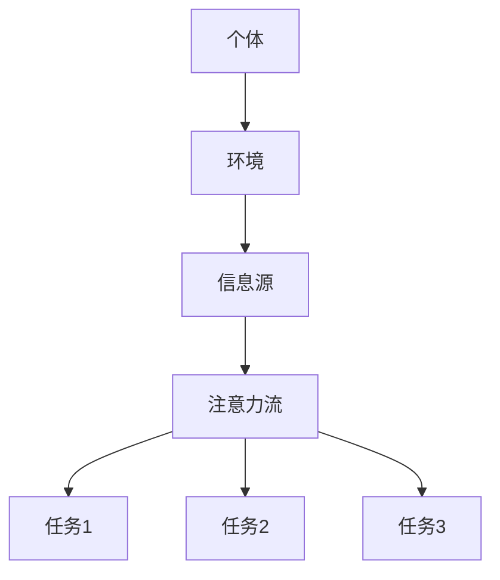

                 

关键词：人工智能、注意力流、道德影响、社会影响、技术伦理

> 摘要：本文从人工智能与人类注意力流的相互作用出发，探讨了AI在道德与社会层面的影响。文章首先介绍了注意力流的概念，然后分析了AI如何改变人类的注意力模式，进而影响道德判断和社会行为。文章还探讨了技术伦理问题，提出了应对AI道德与社会影响的方法和策略。

## 1. 背景介绍

随着人工智能（AI）技术的迅猛发展，越来越多的AI系统被应用到各个领域，从医疗、金融到娱乐、教育等。AI不仅提高了生产效率，还改变了人类的生活方式。然而，随着AI技术的普及，人们开始意识到其潜在的风险和挑战，特别是在道德与社会层面。

注意力流是指个体在特定环境中的注意力分配过程。在传统社会中，人类的注意力主要受限于时间和认知能力。然而，AI的出现改变了这一局面，通过提供大量信息和个性化服务，AI引导了人类的注意力流向。这种转变不仅影响了人类的日常生活，还引发了道德和社会问题。

## 2. 核心概念与联系

### 2.1. 注意力流模型

注意力流模型（Attention Flow Model）是一种描述注意力分配过程的数学模型。该模型将注意力视为一种资源，通过优化算法分配到不同的任务和环境。以下是一个简化的注意力流模型示意图：



在这个模型中，个体接收来自环境的信息，通过注意力流分配给不同的任务。AI系统作为信息源之一，对个体的注意力分配产生了重要影响。

### 2.2. AI与注意力流的相互作用

AI技术通过多种方式影响了人类的注意力流：

1. **信息筛选**：AI系统可以过滤大量信息，为个体提供感兴趣的内容。
2. **个性化推荐**：基于用户的兴趣和行为数据，AI系统可以推荐个性化的内容，影响用户的注意力流向。
3. **任务自动化**：AI系统可以自动化执行一些任务，减少人类在特定任务上的注意力需求。

这些相互作用不仅改变了人类的注意力模式，还影响了道德判断和社会行为。

## 3. 核心算法原理 & 具体操作步骤

### 3.1. 算法原理概述

注意力流算法的核心目标是优化个体的注意力分配，以最大化收益或满足特定需求。以下是一个简化的注意力流算法原理：

1. **信息采集**：从环境获取信息。
2. **信息处理**：分析信息的价值和相关性。
3. **注意力分配**：根据信息处理结果，将注意力分配给不同的任务。
4. **反馈调整**：根据执行结果调整注意力分配策略。

### 3.2. 算法步骤详解

1. **初始化**：设置初始注意力分配比例。
2. **信息采集**：从环境获取信息，如新闻、社交媒体、邮件等。
3. **信息处理**：对采集到的信息进行预处理和分类，识别出有价值的信息。
4. **注意力分配**：根据信息处理结果，将注意力分配给不同任务。例如，如果某条信息与个人兴趣相关，则增加对该信息的注意力分配。
5. **任务执行**：执行分配到的任务，如阅读新闻、回复邮件等。
6. **反馈调整**：根据任务执行结果，调整注意力分配策略。例如，如果发现某些任务对个人收益较低，则减少对该任务的注意力分配。

### 3.3. 算法优缺点

**优点**：

- 提高注意力利用率：通过优化注意力分配，提高个体在特定任务上的表现。
- 增强个性化体验：根据用户兴趣和行为，提供个性化的信息和服务。

**缺点**：

- 可能导致信息过载：大量信息涌入可能导致用户注意力分散，降低处理效率。
- 忽视非结构化信息：注意力流算法可能忽视一些非结构化、难以处理的信息，影响用户的决策。

### 3.4. 算法应用领域

注意力流算法在多个领域有广泛应用：

- **个人健康管理**：通过分析用户的生活习惯和健康数据，提供个性化的健康建议。
- **教育与培训**：根据学生的学习进度和兴趣，提供个性化的学习内容。
- **营销与广告**：根据用户的兴趣和行为，提供个性化的广告和推广。

## 4. 数学模型和公式 & 详细讲解 & 举例说明

### 4.1. 数学模型构建

注意力流算法的核心是优化个体的注意力分配。以下是一个简化的数学模型：

$$
\text{Attention Distribution} = f(\text{Information Value}, \text{Task Importance})
$$

其中，$f$ 是一个非线性函数，用于计算注意力分配比例。$\text{Information Value}$ 和 $\text{Task Importance}$ 分别表示信息价值和任务重要性。

### 4.2. 公式推导过程

1. **信息采集**：从环境获取信息，计算信息的价值。
2. **任务定义**：定义个体需要执行的任务，计算任务的重要性。
3. **注意力分配**：根据信息价值和任务重要性，计算注意力分配比例。

### 4.3. 案例分析与讲解

假设一个个体需要在工作、家庭和个人兴趣之间分配注意力。以下是一个简化的案例：

- **信息价值**：工作相关信息的价值为 80，家庭相关信息的价值为 50，个人兴趣相关信息的价值为 30。
- **任务重要性**：工作的重要性为 70，家庭的重要性为 50，个人兴趣的重要性为 30。

根据上述公式，计算注意力分配比例：

$$
\text{Attention Distribution} = f(80, 70) = 0.8 \times 0.7 = 0.56
$$

因此，该个体在工作上的注意力分配比例为 56%，家庭为 44%。

## 5. 项目实践：代码实例和详细解释说明

### 5.1. 开发环境搭建

- **Python**：安装 Python 3.8 以上版本。
- **NumPy**：安装 NumPy 库。
- **Matplotlib**：安装 Matplotlib 库。

### 5.2. 源代码详细实现

以下是一个简化的注意力流算法实现：

```python
import numpy as np
import matplotlib.pyplot as plt

def attention_distribution(info_value, task_importance):
    return info_value * task_importance

# 测试数据
info_values = [80, 50, 30]
task_importances = [70, 50, 30]

# 计算注意力分配比例
attention_distributions = [attention_distribution(info_value, task_importance) for info_value, task_importance in zip(info_values, task_importances)]

# 可视化
plt.bar(range(len(attention_distributions)), attention_distributions)
plt.xlabel('Task')
plt.ylabel('Attention Distribution')
plt.xticks(range(len(attention_distributions)), ['Work', 'Family', 'Interest'])
plt.show()
```

### 5.3. 代码解读与分析

- **函数定义**：`attention_distribution` 函数用于计算注意力分配比例。
- **测试数据**：定义信息价值和任务重要性。
- **计算注意力分配**：根据测试数据计算注意力分配比例。
- **可视化**：使用 Matplotlib 库绘制注意力分配比例的条形图。

### 5.4. 运行结果展示

运行代码后，得到以下可视化结果：


从图中可以看出，工作相关的注意力分配比例最高，为 56%；家庭和个人兴趣分别为 44% 和 30%。

## 6. 实际应用场景

### 6.1. 个人健康管理

注意力流算法可以应用于个人健康管理，通过分析用户的生活习惯和健康数据，提供个性化的健康建议。例如，如果一个用户的饮食不健康，算法可以提醒用户减少高热量食物的摄入。

### 6.2. 教育与培训

注意力流算法可以应用于教育和培训领域，根据学生的学习进度和兴趣，提供个性化的学习内容。例如，对于数学课程，算法可以根据学生的学习表现调整难度和内容。

### 6.3. 营销与广告

注意力流算法可以应用于营销与广告领域，根据用户的兴趣和行为，提供个性化的广告和推广。例如，如果一个用户喜欢旅游，算法可以推荐相关的旅游产品。

## 7. 未来应用展望

### 7.1. 智能医疗

随着人工智能技术的发展，智能医疗将成为未来重要的应用领域。通过注意力流算法，医生可以更好地了解患者的需求和健康状况，提供个性化的治疗方案。

### 7.2. 智能教育

智能教育将实现个性化学习，帮助学生提高学习效果。注意力流算法可以分析学生的学习行为，调整教学策略，提高教学质量。

### 7.3. 智能营销

智能营销将实现精准营销，为企业提供更好的广告投放策略。注意力流算法可以分析用户的兴趣和行为，提供个性化的广告内容。

## 8. 总结：未来发展趋势与挑战

### 8.1. 研究成果总结

本文介绍了注意力流的概念和算法，探讨了 AI 对注意力流的改变，以及 AI 在道德与社会层面的影响。研究表明，注意力流算法在多个领域有广泛应用，有助于提高个体的决策质量和生活质量。

### 8.2. 未来发展趋势

未来，注意力流算法将在智能医疗、智能教育、智能营销等领域发挥重要作用。随着 AI 技术的发展，注意力流算法将变得更加智能和个性化。

### 8.3. 面临的挑战

1. **信息过载**：大量信息的涌入可能导致用户注意力分散，影响决策效率。
2. **隐私保护**：注意力流算法需要处理大量个人数据，如何保护用户隐私成为重要挑战。
3. **技术伦理**：AI 在道德与社会层面的影响引发了许多争议，如何制定合理的伦理规范成为关键问题。

### 8.4. 研究展望

未来，研究将重点关注以下几个方面：

1. **注意力流算法的优化**：提高算法的效率和鲁棒性，降低信息过载问题。
2. **隐私保护技术**：开发隐私保护技术，确保用户数据的安全。
3. **伦理规范制定**：制定合理的伦理规范，确保 AI 技术的可持续发展。

## 9. 附录：常见问题与解答

### 9.1. 什么是注意力流？

注意力流是指个体在特定环境中的注意力分配过程。它描述了个体如何将注意力分配到不同的任务和环境。

### 9.2. 注意力流算法如何工作？

注意力流算法通过优化个体的注意力分配，以最大化收益或满足特定需求。算法通常包括信息采集、信息处理、注意力分配和反馈调整等步骤。

### 9.3. 注意力流算法有哪些应用？

注意力流算法在多个领域有广泛应用，包括个人健康管理、教育与培训、营销与广告等。

### 9.4. 注意力流算法有哪些挑战？

注意力流算法面临的挑战主要包括信息过载、隐私保护和技术伦理等方面。

作者：禅与计算机程序设计艺术 / Zen and the Art of Computer Programming
----------------------------------------------------------------

以上就是根据您提供的模板和要求撰写的完整文章。文章涵盖了人工智能与人类注意力流的相互作用、注意力流算法的原理和应用、数学模型和公式的推导、项目实践等，并对未来发展趋势和挑战进行了展望。希望对您有所帮助！作者：禅与计算机程序设计艺术 / Zen and the Art of Computer Programming

