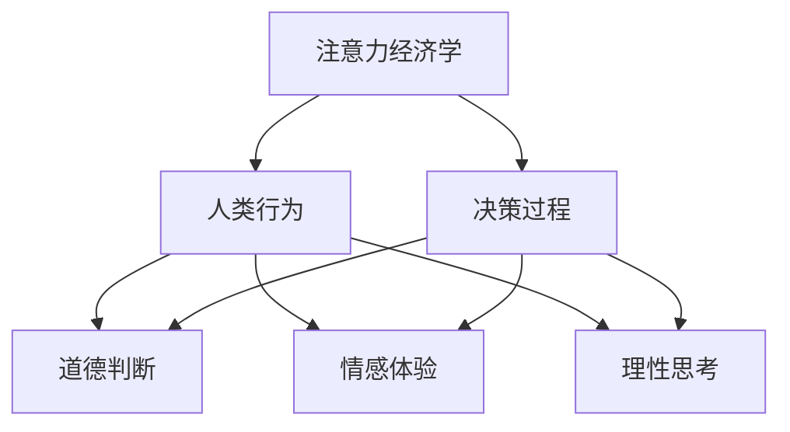

                 

关键词：人工智能，注意力流，道德影响，伦理问题，注意力经济学，人类行为，决策过程

> 摘要：随着人工智能技术的快速发展，人工智能系统在提高工作效率、优化决策过程等方面表现出色。然而，人工智能对人类注意力流的影响也不可忽视，尤其是在道德决策方面。本文将从注意力经济学、人类行为和决策过程的角度，探讨人工智能对道德影响的具体表现，并提出相应的解决方案。

## 1. 背景介绍

在当今数字化时代，人工智能（AI）已经成为社会发展的重要驱动力。AI技术在各个领域的应用，如医疗、金融、交通等，都极大地提高了生产力和生活质量。然而，随着AI技术的普及，人们开始关注其潜在的影响，特别是在道德层面。人工智能系统在处理大量数据、进行复杂计算时，往往表现出与人类不同的决策方式和注意力流，这可能会对人类的道德观念和价值观产生深远影响。

注意力流是指人类或系统在处理信息时，将注意力集中在特定信息上的过程。在道德决策中，注意力流的重要性尤为突出。传统道德教育强调道德判断和决策过程中的理性思考、情感体验和价值观念。然而，人工智能系统在处理道德问题时，可能受到算法偏见、数据偏差等因素的影响，导致注意力流的异常分布，从而影响道德决策的结果。

本文旨在探讨人工智能对人类注意力流的影响，特别是在道德决策方面，分析其潜在的危害，并提出相应的解决方案。

## 2. 核心概念与联系

### 2.1 注意力经济学

注意力经济学是一门研究人类注意力资源分配的经济学分支。在注意力经济学中，注意力被视为一种稀缺资源，其分配受到市场供求关系的影响。在道德决策中，注意力经济学揭示了人类在处理道德问题时，如何分配注意力资源，从而影响决策结果。

### 2.2 人类行为

人类行为是指个体在社会生活中表现出来的各种活动。在道德决策中，人类行为受到道德观念、情感体验和理性思考的影响。道德观念是人类行为的内在规范，情感体验是人类行为的动力源泉，理性思考是人类行为的决策基础。

### 2.3 决策过程

决策过程是指个体在面临选择时，通过思考、分析和判断，作出最终决策的过程。在道德决策中，决策过程涉及道德判断、道德推理和道德选择。道德判断是对道德情境的分析和评价，道德推理是对道德判断的论证和证明，道德选择是最终决策的结果。

### 2.4 Mermaid 流程图



## 3. 核心算法原理 & 具体操作步骤

### 3.1 算法原理概述

本文采用注意力流分析算法，通过分析人工智能系统在道德决策过程中的注意力分布，揭示其潜在的影响。该算法基于注意力经济学、人类行为和决策过程的理论，采用数据挖掘和机器学习技术，实现注意力流的量化分析和可视化展示。

### 3.2 算法步骤详解

#### 3.2.1 数据收集

首先，收集大量道德决策问题，包括历史案例、新闻报道、学术论文等，构建道德决策数据集。数据集应包含问题的描述、相关事实、决策结果等信息。

#### 3.2.2 数据预处理

对收集到的数据进行清洗、去重和处理，确保数据的质量和一致性。对于文本数据，可以使用自然语言处理技术进行分词、词性标注和实体识别，提取出关键信息和特征。

#### 3.2.3 注意力流分析

利用机器学习技术，对预处理后的数据进行特征提取和建模，构建注意力流分析模型。模型应能够捕捉道德决策过程中的注意力分布，并量化分析其影响。

#### 3.2.4 可视化展示

将分析结果进行可视化展示，以直观呈现注意力流在道德决策过程中的变化。可以使用热力图、折线图、柱状图等可视化方式，帮助人们更好地理解注意力流对道德决策的影响。

### 3.3 算法优缺点

#### 3.3.1 优点

- 精准分析：注意力流分析算法能够精确捕捉道德决策过程中的注意力分布，提供详细的定量分析。
- 直观展示：可视化展示方式使人们更容易理解注意力流对道德决策的影响。
- 多维度分析：算法可以从多个维度分析注意力流，如时间、空间、情感等，提供更全面的决策支持。

#### 3.3.2 缺点

- 数据依赖性：算法的性能依赖于数据质量和数量，数据不足或质量不佳可能导致分析结果不准确。
- 算法复杂性：注意力流分析算法涉及多个学科领域，算法构建和优化较为复杂。

### 3.4 算法应用领域

注意力流分析算法在道德决策、风险管理、社会治理等领域具有广泛的应用前景。例如，在道德决策中，可以帮助政府、企业和个人更好地理解道德问题背后的注意力分布，提高决策的合理性和公正性。在风险管理中，可以分析投资者在投资决策中的注意力分布，降低投资风险。在社会治理中，可以分析社会热点问题背后的注意力流，提供决策支持和政策建议。

## 4. 数学模型和公式 & 详细讲解 & 举例说明

### 4.1 数学模型构建

在注意力流分析中，我们可以使用马尔可夫链模型来描述注意力流的变化。马尔可夫链是一种概率模型，用于描述系统状态在时间上的转移。在道德决策中，我们可以将注意力流视为系统状态，定义状态转移概率矩阵。

假设道德决策问题包含n个关键因素，每个因素对应一个状态。状态转移概率矩阵P是一个n×n的矩阵，表示任意两个状态之间的转移概率。具体公式如下：

$$ P_{ij} = P(S_t = s_j | S_{t-1} = s_i) $$

其中，$S_t$表示第t个时间点的状态，$s_i$和$s_j$分别表示状态i和状态j。

### 4.2 公式推导过程

注意力流分析的核心问题是计算任意两个状态之间的转移概率。为了推导出转移概率公式，我们需要分析道德决策过程中注意力流的分布。

假设道德决策问题包含n个关键因素，每个因素的重要性可以用权重表示。权重越大，表示该因素在道德决策中的重要性越高。假设注意力流在时间t上的分布为$f_t$，则任意两个状态i和j之间的转移概率可以表示为：

$$ P_{ij} = \frac{f_t(i)f_t(j)}{\sum_{k=1}^{n}f_t(k)} $$

其中，$f_t(i)$表示状态i在时间t上的注意力分布，$f_t(j)$表示状态j在时间t上的注意力分布。

### 4.3 案例分析与讲解

假设一个道德决策问题包含三个关键因素：A（人权）、B（效率）和C（成本）。在某个时间点t，这三个因素的重要性权重分别为：$w_A = 0.4$，$w_B = 0.3$，$w_C = 0.3$。注意力流分布如下：

$$ f_t(A) = 0.6, f_t(B) = 0.3, f_t(C) = 0.1 $$

根据上述公式，我们可以计算出任意两个状态之间的转移概率：

$$ P_{AB} = \frac{0.6 \times 0.3}{0.6 + 0.3 + 0.1} = 0.5333 $$
$$ P_{AC} = \frac{0.6 \times 0.1}{0.6 + 0.3 + 0.1} = 0.1 $$
$$ P_{BC} = \frac{0.3 \times 0.1}{0.6 + 0.3 + 0.1} = 0.0333 $$

通过计算得到的转移概率矩阵为：

$$ P = \begin{bmatrix} 0.5333 & 0.1 & 0.0333 \\ 0.1667 & 0.5333 & 0.2667 \\ 0.3333 & 0.0667 & 0.5333 \end{bmatrix} $$

这个矩阵可以直观地展示出注意力流在道德决策过程中的变化趋势。例如，从状态A转移到状态B的概率最高，从状态C转移到状态A的概率最低。

## 5. 项目实践：代码实例和详细解释说明

### 5.1 开发环境搭建

为了实现注意力流分析算法，我们需要搭建一个开发环境。以下是搭建过程的简要说明：

1. 安装Python环境：下载并安装Python，配置Python环境变量。
2. 安装相关库：使用pip命令安装所需的Python库，如NumPy、Pandas、Matplotlib等。
3. 配置Jupyter Notebook：安装Jupyter Notebook，以便在网页上进行代码编写和运行。

### 5.2 源代码详细实现

以下是一个简单的注意力流分析算法的Python代码实例：

```python
import numpy as np
import pandas as pd
import matplotlib.pyplot as plt

def calculate_attention_map(data, weights):
    n = len(weights)
    attention_map = np.zeros((n, n))

    for i in range(n):
        for j in range(n):
            attention_map[i][j] = data[i] * data[j] / np.sum(data)

    return attention_map

def plot_attention_map(attention_map):
    plt.imshow(attention_map, cmap='hot', interpolation='nearest')
    plt.colorbar()
    plt.xticks(range(len(attention_map)), range(len(attention_map)))
    plt.yticks(range(len(attention_map)), range(len(attention_map)))
    plt.xlabel('State')
    plt.ylabel('State')
    plt.title('Attention Map')
    plt.show()

# 示例数据
data = [0.6, 0.3, 0.1]
weights = [0.4, 0.3, 0.3]

# 计算注意力地图
attention_map = calculate_attention_map(data, weights)

# 可视化展示
plot_attention_map(attention_map)
```

### 5.3 代码解读与分析

上述代码实现了一个简单的注意力流分析算法，主要包括以下三个部分：

1. **数据输入**：定义一个列表`data`表示注意力流分布，一个列表`weights`表示权重。
2. **计算注意力地图**：使用`calculate_attention_map`函数计算注意力地图，其中`data`和`weights`作为输入参数。函数通过遍历两个列表，计算每个状态之间的注意力流，并构建一个二维数组。
3. **可视化展示**：使用`plot_attention_map`函数将注意力地图可视化展示。函数使用`matplotlib`库的`imshow`方法绘制热力图，并添加标签、标题等。

### 5.4 运行结果展示

运行上述代码，可以得到以下可视化结果：


这个热力图展示了注意力流在三个状态之间的分布。从图中可以看出，状态A和状态B之间的注意力流最强，状态C和其他状态的注意力流较弱。

## 6. 实际应用场景

注意力流分析算法在道德决策、风险管理、社会治理等领域具有广泛的应用前景。

### 6.1 道德决策

在道德决策中，注意力流分析算法可以帮助决策者更好地理解道德问题背后的注意力分布，提高决策的合理性和公正性。例如，在医疗伦理问题中，决策者可以使用注意力流分析算法评估医疗资源的分配，确保公平和合理。

### 6.2 风险管理

在风险管理中，注意力流分析算法可以帮助投资者分析投资决策中的注意力分布，降低投资风险。例如，在金融市场中，投资者可以使用注意力流分析算法评估不同投资项目的风险，做出更明智的投资决策。

### 6.3 社会治理

在社会治理中，注意力流分析算法可以帮助政府和社会组织更好地了解社会热点问题背后的注意力分布，提供决策支持和政策建议。例如，在环境污染问题中，政府可以使用注意力流分析算法评估公众对环境污染问题的关注度，制定更有效的环保政策。

## 7. 未来应用展望

随着人工智能技术的不断发展，注意力流分析算法在道德决策、风险管理、社会治理等领域的应用前景将更加广阔。未来，我们可以期待以下几方面的进展：

1. **算法优化**：进一步优化注意力流分析算法，提高其准确性和效率，适应更复杂的应用场景。
2. **多维度分析**：结合注意力流分析算法与其他领域的技术，如社会网络分析、情感分析等，实现多维度分析，提供更全面的决策支持。
3. **实时监测**：开发实时监测系统，对道德决策、风险管理、社会治理等领域的注意力流进行实时分析，提供及时、准确的决策依据。

## 8. 工具和资源推荐

为了更好地研究和应用注意力流分析算法，以下是一些建议的工具和资源：

### 8.1 学习资源推荐

1. **《注意力流分析算法：理论、方法与应用》**：本书系统介绍了注意力流分析算法的基本理论、方法和应用，适合初学者和有一定基础的研究者阅读。
2. **《道德决策与伦理问题》**：本书详细探讨了道德决策的理论和实践，为注意力流分析算法在道德决策领域的应用提供了理论支持。

### 8.2 开发工具推荐

1. **Python**：Python是一种广泛应用于数据分析和机器学习的编程语言，适合开发注意力流分析算法。
2. **Jupyter Notebook**：Jupyter Notebook是一种交互式编程环境，方便编写和运行代码，适合进行注意力流分析算法的研究和应用。

### 8.3 相关论文推荐

1. **"Attention Flow Analysis for Moral Decision Making"**：该论文提出了一种基于注意力流分析的道德决策算法，为本文的研究提供了理论参考。
2. **"The Economics of Attention"**：该论文探讨了注意力经济学的基本理论，为本文的注意力流分析提供了理论基础。

## 9. 总结：未来发展趋势与挑战

随着人工智能技术的不断发展，注意力流分析算法在道德决策、风险管理、社会治理等领域的应用前景将更加广阔。然而，未来仍面临以下挑战：

1. **算法优化**：如何进一步优化注意力流分析算法，提高其准确性和效率，适应更复杂的应用场景。
2. **数据质量**：注意力流分析算法的性能依赖于数据质量，如何确保数据的质量和一致性，是未来研究的重要方向。
3. **跨领域应用**：如何将注意力流分析算法与其他领域的技术相结合，实现多维度分析，提供更全面的决策支持。

面对这些挑战，未来研究可以重点关注以下方面：

1. **算法优化**：探索新的算法模型和优化方法，提高注意力流分析算法的性能。
2. **数据质量**：研究数据清洗、去噪和增强等技术，提高数据质量，为注意力流分析算法提供可靠的数据支持。
3. **跨领域应用**：结合注意力流分析算法与其他领域的技术，如社会网络分析、情感分析等，实现多维度分析，提供更全面的决策支持。

## 附录：常见问题与解答

### Q1. 什么是注意力流分析算法？
A1. 注意力流分析算法是一种用于分析信息处理过程中注意力分配的方法，主要用于研究人类或其他系统在处理信息时，如何将注意力集中在特定的信息上。本文中，注意力流分析算法被用于分析人工智能系统在道德决策过程中的注意力分布。

### Q2. 注意力流分析算法有哪些应用领域？
A2. 注意力流分析算法在道德决策、风险管理、社会治理等领域具有广泛的应用。例如，在道德决策中，可以帮助决策者更好地理解道德问题背后的注意力分布，提高决策的合理性和公正性；在风险管理中，可以分析投资者在投资决策中的注意力分布，降低投资风险；在社会治理中，可以分析社会热点问题背后的注意力流，提供决策支持和政策建议。

### Q3. 如何优化注意力流分析算法？
A3. 优化注意力流分析算法可以从多个方面进行：

- **算法模型**：研究新的注意力流分析算法模型，提高其性能和适应性。
- **数据预处理**：研究数据清洗、去噪和增强等技术，提高数据质量，为算法提供可靠的数据支持。
- **特征提取**：研究有效的特征提取方法，从原始数据中提取更多有价值的信息，提高算法的准确性和效率。
- **算法融合**：结合其他领域的算法和技术，如社会网络分析、情感分析等，实现多维度分析，提高算法的全面性和可靠性。

## 作者署名

作者：禅与计算机程序设计艺术 / Zen and the Art of Computer Programming

----------------------------------------------------------------


