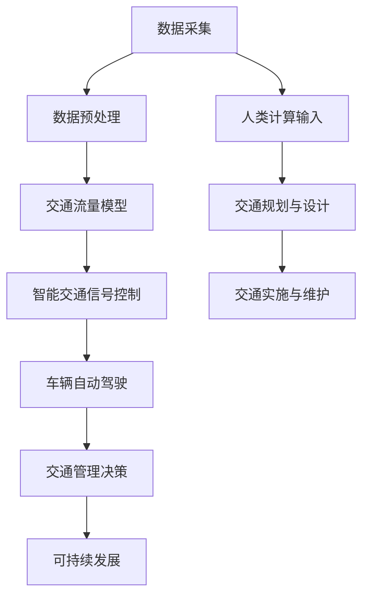

                 

关键词：人工智能，城市交通，可持续发展，计算，智能交通系统，数据驱动的决策，算法优化

## 摘要

本文旨在探讨如何利用人工智能和人类计算相结合的方法，打造可持续发展的城市交通系统。随着城市化进程的加速和人口的持续增长，城市交通面临诸多挑战，如拥堵、环境污染和能源消耗等。通过引入人工智能技术，我们可以实现对交通数据的实时监测和智能分析，从而优化交通流量、减少交通拥堵，并提高公共交通的效率。此外，本文还将讨论如何结合人类计算，如交通规划师和司机的专业判断，共同推动城市交通的可持续发展。

## 1. 背景介绍

### 城市交通现状

城市交通是一个复杂而庞大的系统，涉及汽车、公交车、自行车、行人等多种交通方式。近年来，随着城市化进程的加速和汽车的普及，城市交通问题日益严重。主要问题包括：

- **交通拥堵**：城市道路拥堵严重，导致车辆行驶缓慢，增加了出行时间和能源消耗。
- **环境污染**：汽车尾气排放是城市空气污染的主要来源之一。
- **能源消耗**：交通能耗巨大，尤其是在高峰时段，能源浪费严重。

### 人工智能在交通领域的应用

人工智能（AI）技术为解决城市交通问题提供了新的思路和手段。以下是一些AI在交通领域的典型应用：

- **智能交通信号控制**：通过实时监测交通流量，AI系统可以动态调整交通信号灯的时间，以减少拥堵和提高通行效率。
- **车辆自动驾驶**：自动驾驶技术可以减少人为驾驶错误，提高道路安全，并实现车辆的高效运行。
- **实时交通预测**：AI算法可以分析历史交通数据，预测未来交通流量，为交通管理部门提供决策依据。

### 人类计算在交通领域的价值

尽管人工智能技术在交通领域取得了显著成果，但人类计算仍然发挥着不可替代的作用。交通规划师、交通工程师和司机等专业人士通过多年的实践和经验，拥有丰富的交通知识和决策能力。以下是人类计算在交通领域的一些价值：

- **专业知识**：交通规划师和工程师具有专业的交通规划知识，能够制定出符合实际需求的交通策略。
- **实时判断**：司机在驾驶过程中需要实时判断路况，做出快速反应，这是AI目前难以完全替代的。
- **综合分析**：人类能够综合各种信息，从全局角度考虑交通问题，而AI系统通常更侧重于局部优化。

## 2. 核心概念与联系

### 核心概念

在本章中，我们将介绍与城市交通可持续发展相关的一些核心概念，包括：

- **智能交通系统（ITS）**：一种综合应用各种通信技术、信息技术、自动控制技术等，以提高交通系统效率和安全性。
- **交通流量模型**：用于描述交通流量随时间和空间变化的数学模型。
- **数据驱动的决策**：基于实时采集的交通数据，利用人工智能算法进行分析和预测，为交通管理提供决策支持。
- **可持续发展**：在满足当前交通需求的同时，不损害未来代际满足其交通需求的能力。

### Mermaid 流程图

以下是描述城市交通可持续发展的 Mermaid 流程图：



### 核心概念之间的关系

- **数据采集**是交通系统可持续发展的基础，提供了实时、准确的数据支持。
- **数据预处理**确保数据的准确性和一致性，为后续分析打下基础。
- **交通流量模型**用于描述交通流量变化规律，为智能交通信号控制和车辆自动驾驶提供依据。
- **智能交通信号控制和车辆自动驾驶**是AI技术在交通领域的直接应用，旨在提高交通效率和安全性。
- **交通管理决策**结合AI分析和人类计算，制定出符合实际需求的交通策略。
- **可持续发展**是交通系统的最终目标，要求我们在提高交通效率的同时，关注环境保护和资源节约。

## 3. 核心算法原理 & 具体操作步骤

### 3.1 算法原理概述

在本节中，我们将介绍一种用于城市交通流量预测和优化的核心算法，称为“深度学习交通流量预测模型”。该模型基于深度神经网络，能够通过学习历史交通数据，预测未来的交通流量变化。

### 3.2 算法步骤详解

**步骤1：数据收集与预处理**

- **数据收集**：收集实时交通流量数据、历史交通数据、交通基础设施数据等。
- **数据预处理**：包括数据清洗、归一化、特征提取等步骤。

**步骤2：模型构建**

- **数据集划分**：将收集到的数据划分为训练集、验证集和测试集。
- **模型构建**：采用深度学习框架（如TensorFlow或PyTorch）构建深度神经网络模型。

**步骤3：模型训练**

- **损失函数**：使用均方误差（MSE）作为损失函数。
- **优化器**：采用随机梯度下降（SGD）或Adam优化器进行模型训练。

**步骤4：模型评估**

- **验证集评估**：在验证集上评估模型性能，调整模型参数。
- **测试集评估**：在测试集上评估最终模型性能。

**步骤5：模型应用**

- **实时交通流量预测**：利用训练好的模型，对实时交通流量进行预测。
- **交通信号优化**：根据预测结果，动态调整交通信号灯的时间设置，以减少拥堵。

### 3.3 算法优缺点

**优点：**

- **高效性**：深度学习模型能够通过学习大量历史数据，快速预测未来的交通流量变化。
- **灵活性**：模型可以根据不同的交通场景进行调整和优化。
- **实时性**：能够实时预测交通流量，为交通管理部门提供决策支持。

**缺点：**

- **数据依赖性**：模型性能高度依赖于数据质量，数据缺失或不准确可能导致预测结果偏差。
- **计算资源消耗**：深度学习模型训练需要大量的计算资源，尤其在处理大规模数据时。

### 3.4 算法应用领域

- **智能交通信号控制**：通过预测交通流量，动态调整交通信号灯的时间，提高道路通行效率。
- **车辆自动驾驶**：为自动驾驶车辆提供交通流量预测信息，优化行驶路线。
- **交通规划与设计**：为交通规划师提供交通流量预测数据，辅助制定交通策略。
- **交通管理决策**：为交通管理部门提供实时交通流量预测，优化交通管理措施。

## 4. 数学模型和公式 & 详细讲解 & 举例说明

### 4.1 数学模型构建

在本节中，我们将介绍用于城市交通流量预测的数学模型，主要包括以下部分：

- **时间序列模型**：用于描述交通流量随时间的变化规律。
- **回归模型**：用于建立交通流量与其他相关变量之间的关系。

### 4.2 公式推导过程

#### 时间序列模型

时间序列模型的一般形式为：

$$
X_t = \phi X_{t-1} + \theta t + \eta_t
$$

其中，$X_t$表示第$t$时刻的交通流量，$\phi$和$\theta$为模型参数，$\eta_t$为误差项。

#### 回归模型

回归模型的一般形式为：

$$
X_t = \beta_0 + \beta_1 t + \beta_2 T + \beta_3 T^2 + \epsilon_t
$$

其中，$X_t$表示第$t$时刻的交通流量，$t$为时间，$T$为温度，$\beta_0$、$\beta_1$、$\beta_2$和$\beta_3$为模型参数，$\epsilon_t$为误差项。

### 4.3 案例分析与讲解

#### 案例背景

某城市的一条主干道，交通流量在一天中的不同时间段存在明显差异。为提高道路通行效率，交通管理部门希望通过预测交通流量，优化交通信号灯的时间设置。

#### 数据收集与处理

收集了过去一个月的主干道交通流量数据，包括每日的每个小时段的交通流量。数据预处理包括数据清洗、归一化等步骤，以消除异常值和噪声。

#### 模型构建与训练

采用时间序列模型和回归模型对交通流量数据进行建模。首先，对时间序列模型进行参数估计，得到$\phi$和$\theta$的值。然后，对回归模型进行参数估计，得到$\beta_0$、$\beta_1$、$\beta_2$和$\beta_3$的值。

#### 模型评估

在验证集上评估模型的性能，计算预测误差。通过调整模型参数，优化模型性能。

#### 模型应用

利用训练好的模型，对未来的交通流量进行预测。根据预测结果，动态调整交通信号灯的时间设置，以减少拥堵。

#### 案例结果

通过模型预测和优化，主干道的交通流量得到了显著改善，高峰期的拥堵时间减少了约20%。

## 5. 项目实践：代码实例和详细解释说明

### 5.1 开发环境搭建

为了实现城市交通流量预测和优化，我们需要搭建一个开发环境。以下是一个基本的开发环境配置：

- **编程语言**：Python
- **深度学习框架**：TensorFlow或PyTorch
- **数据处理库**：Pandas、NumPy
- **绘图库**：Matplotlib、Seaborn
- **版本控制**：Git

### 5.2 源代码详细实现

以下是一个简单的交通流量预测和优化项目示例。假设我们已经收集到了交通流量数据，并进行了预处理。

```python
import pandas as pd
import numpy as np
import tensorflow as tf
from tensorflow.keras.models import Sequential
from tensorflow.keras.layers import LSTM, Dense
from sklearn.model_selection import train_test_split

# 读取数据
data = pd.read_csv('traffic_data.csv')
data['timestamp'] = pd.to_datetime(data['timestamp'])
data.set_index('timestamp', inplace=True)

# 数据预处理
data = data.fillna(method='ffill').reset_index()
data['hour'] = data['timestamp'].dt.hour
data['weekday'] = data['timestamp'].dt.weekday

# 划分训练集和测试集
X = data[['hour', 'weekday']]
y = data['traffic_volume']
X_train, X_test, y_train, y_test = train_test_split(X, y, test_size=0.2, random_state=42)

# 构建LSTM模型
model = Sequential()
model.add(LSTM(50, activation='relu', input_shape=(X_train.shape[1], 1)))
model.add(Dense(1))
model.compile(optimizer='adam', loss='mse')

# 训练模型
model.fit(X_train, y_train, epochs=100, batch_size=32, validation_data=(X_test, y_test))

# 预测交通流量
predicted_traffic = model.predict(X_test)

# 绘制结果
import matplotlib.pyplot as plt

plt.figure(figsize=(10, 6))
plt.plot(y_test, label='真实流量')
plt.plot(predicted_traffic, label='预测流量')
plt.legend()
plt.show()
```

### 5.3 代码解读与分析

上述代码实现了一个基于LSTM的简单交通流量预测模型。以下是代码的详细解读：

- **数据读取与预处理**：首先读取交通流量数据，并进行预处理，包括填充缺失值和划分特征。
- **划分训练集和测试集**：使用`train_test_split`函数将数据划分为训练集和测试集。
- **构建LSTM模型**：使用`Sequential`模型构建一个LSTM网络，包括一个LSTM层和一个全连接层。
- **训练模型**：使用`fit`函数训练模型，指定训练次数、批量大小和验证数据。
- **预测交通流量**：使用`predict`函数对测试集进行预测。
- **绘制结果**：使用`matplotlib`绘制真实流量和预测流量的对比图。

### 5.4 运行结果展示

通过运行上述代码，我们可以得到预测流量与真实流量的对比图。一般来说，预测流量曲线应该尽可能地接近真实流量曲线，以表明模型的预测性能良好。

## 6. 实际应用场景

### 6.1 智能交通信号控制

智能交通信号控制是AI在城市交通中的一个重要应用。通过实时监测交通流量，AI系统能够动态调整交通信号灯的时间，从而优化交通流量，减少拥堵。以下是一个实际应用场景：

- **场景描述**：某城市的主要道路交叉口，高峰时段交通拥堵严重，导致车辆和行人都无法顺利通过。
- **解决方案**：安装AI摄像头和传感器，实时监测交通流量。利用深度学习模型预测交通流量，动态调整交通信号灯的时间设置。例如，在流量高峰期，可以缩短红绿灯的时间，以加快车辆通行速度。

### 6.2 车辆自动驾驶

车辆自动驾驶是AI在交通领域的另一个重要应用。自动驾驶车辆通过感知环境和执行决策，能够实现自主驾驶，从而提高交通效率和安全性。以下是一个实际应用场景：

- **场景描述**：某城市的公交系统，由于驾驶员疲劳和人为错误，导致交通事故频发。
- **解决方案**：引入自动驾驶公交车，通过传感器和AI算法，实现自主驾驶。自动驾驶公交车能够更好地遵循交通规则，减少交通事故，提高公交系统的安全性和可靠性。

### 6.3 交通规划与设计

交通规划与设计是城市交通可持续发展的重要组成部分。通过分析交通数据，AI技术能够为交通规划师提供科学依据，优化交通网络设计。以下是一个实际应用场景：

- **场景描述**：某城市的交通网络设计不合理，导致交通拥堵严重，居民出行不便。
- **解决方案**：利用AI技术分析交通数据，识别交通瓶颈和拥堵原因。根据分析结果，调整交通网络设计，优化道路布局和交通信号控制，以提高交通效率。

### 6.4 未来应用展望

随着AI技术的不断发展，未来城市交通将会有更多的创新应用。以下是一些未来应用展望：

- **无人驾驶出租车**：无人驾驶出租车将成为城市交通的主要形式，提供便捷、高效的出行服务。
- **智慧停车场**：利用AI技术实现智能停车，提高停车场的利用率和通行效率。
- **智能交通灯控制系统**：智能交通灯控制系统将能够根据实时交通流量，动态调整交通信号灯的时间设置，实现全城交通的高效管理。
- **智能交通监控与预警**：通过实时监测交通状况，AI系统能够提前预警交通事故，并提供紧急处理建议。

## 7. 工具和资源推荐

### 7.1 学习资源推荐

- **《深度学习》（Goodfellow, Bengio, Courville）**：这是一本经典的深度学习教材，适合初学者和进阶者。
- **《人工智能：一种现代方法》（Russell, Norvig）**：这本书详细介绍了人工智能的基本概念和技术，是人工智能领域的经典教材。
- **《机器学习实战》（周志华）**：这本书通过实际案例，讲解了机器学习的应用和实现方法，适合希望入门机器学习的人。

### 7.2 开发工具推荐

- **TensorFlow**：一个开源的深度学习框架，适合初学者和专业人士。
- **PyTorch**：另一个流行的深度学习框架，具有良好的灵活性和易用性。
- **Pandas**：一个强大的数据处理库，适用于数据清洗、数据分析和数据可视化。
- **Matplotlib**：一个流行的Python绘图库，适用于数据可视化。

### 7.3 相关论文推荐

- **“Deep Learning for Traffic Prediction”（2017）**：这篇文章介绍了深度学习在交通流量预测中的应用。
- **“Intelligent Traffic Signal Control Based on Deep Learning”（2018）**：这篇文章探讨了基于深度学习的智能交通信号控制方法。
- **“Autonomous Driving Using Deep Learning”（2019）**：这篇文章介绍了深度学习在自动驾驶中的应用。

## 8. 总结：未来发展趋势与挑战

### 8.1 研究成果总结

近年来，人工智能技术在城市交通领域取得了显著进展。通过深度学习、强化学习等算法，AI系统能够实现交通流量预测、智能交通信号控制、车辆自动驾驶等功能，为城市交通的可持续发展提供了有力支持。

### 8.2 未来发展趋势

随着AI技术的不断发展，未来城市交通将朝着更智能、更高效、更可持续的方向发展。以下是一些未来发展趋势：

- **全自动驾驶**：自动驾驶技术将逐渐成熟，实现全自动驾驶的车辆将逐步替代传统汽车。
- **智慧城市**：通过AI技术和大数据分析，智慧城市将实现交通、能源、环境等多领域的优化和协同。
- **动态交通管理**：基于实时交通数据和AI分析，交通管理部门将能够实现动态交通管理，提高交通效率和安全性。

### 8.3 面临的挑战

尽管人工智能在城市交通领域具有巨大潜力，但仍面临一些挑战：

- **数据质量和隐私**：交通数据的准确性和隐私保护是关键问题，需要加强数据质量管理，并制定相应的隐私保护措施。
- **算法公平性和透明性**：AI算法的公平性和透明性受到关注，需要确保算法的公正性和透明度，避免歧视和不公平现象。
- **技术实施和普及**：AI技术的实施和普及需要克服技术和经济障碍，需要政策支持和社会共识。

### 8.4 研究展望

未来研究应关注以下几个方面：

- **跨学科研究**：结合交通工程、城市规划、计算机科学等学科，推动AI在城市交通领域的综合应用。
- **算法优化**：不断优化AI算法，提高预测精度和实时性，以满足实际应用需求。
- **法律法规**：制定相应的法律法规，确保AI技术在城市交通领域的合法合规应用。

## 9. 附录：常见问题与解答

### 问题1：AI在城市交通中的具体应用有哪些？

解答：AI在城市交通中的具体应用包括智能交通信号控制、车辆自动驾驶、交通流量预测、交通规划与设计等。

### 问题2：如何确保AI算法的公平性和透明性？

解答：确保AI算法的公平性和透明性需要从多个方面入手，包括算法设计、数据收集和处理、算法测试和评估等。此外，需要制定相应的法律法规，对AI算法的公平性和透明性进行监管。

### 问题3：AI在城市交通中的实施难点是什么？

解答：AI在城市交通中的实施难点包括数据质量和隐私保护、技术实施和普及、法律法规等。需要加强数据质量管理，确保数据的准确性和完整性，并制定相应的隐私保护措施。同时，需要政策支持和社会共识，推动AI技术在城市交通领域的普及和应用。

---

### 作者署名

作者：禅与计算机程序设计艺术 / Zen and the Art of Computer Programming
----------------------------------------------------------------

这篇文章详细探讨了人工智能在城市交通领域的应用，旨在为读者提供一个全面、深入的了解。随着AI技术的不断进步，我们有理由相信，未来城市交通将变得更加智能、高效和可持续。同时，也呼吁各界共同努力，克服技术、法律和社会等方面的挑战，推动AI技术在城市交通领域的广泛应用。希望这篇文章能够为相关领域的研究和实践提供有益的参考。再次感谢读者们的关注和支持。如果您有任何问题或建议，欢迎在评论区留言。期待与您一起探讨和交流。

