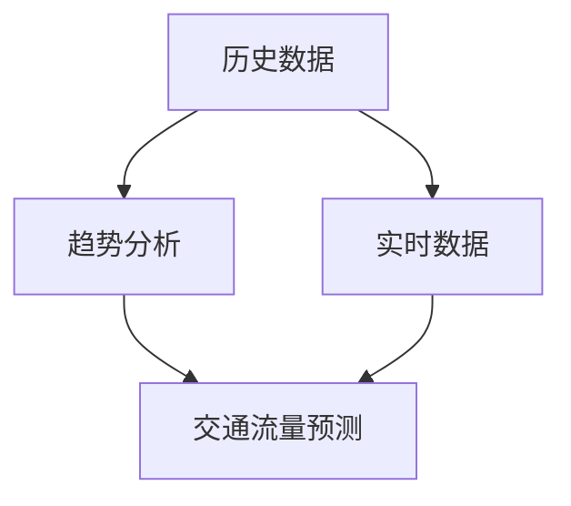
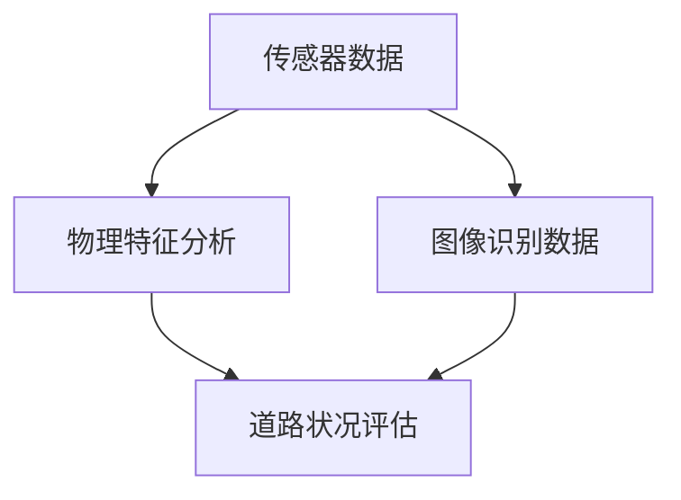
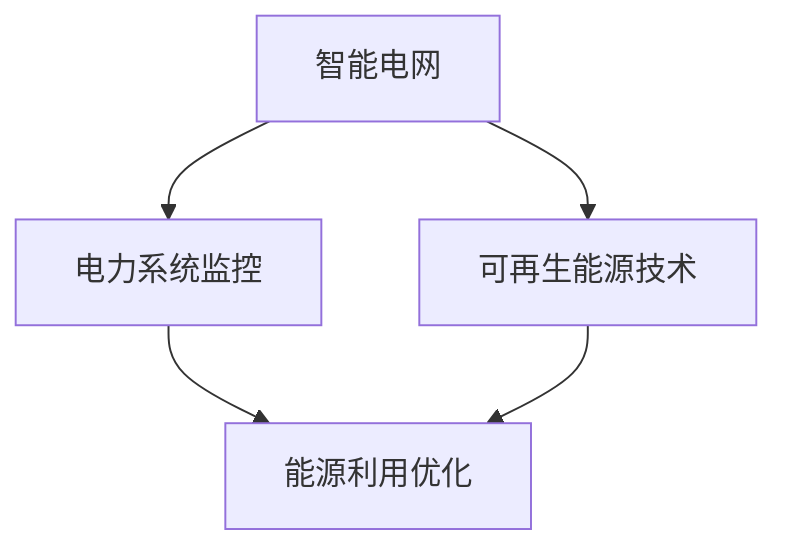
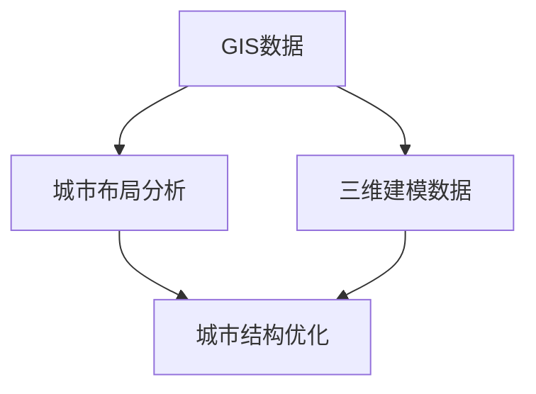
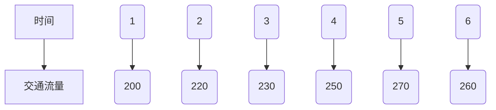

                 

关键词：人工智能、可持续发展、城市交通、基础设施建设、规划与管理、AI算法、数学模型、代码实例、实际应用、工具资源、未来展望

> 摘要：本文将探讨如何利用人工智能技术，结合人类计算的优势，为城市交通与基础设施建设提供可持续发展的规划与管理方案。通过介绍核心概念、算法原理、数学模型及项目实践，本文旨在为读者提供关于AI在城市交通与基础设施领域的应用见解，展望未来发展趋势与面临的挑战。

## 1. 背景介绍

在全球人口增长和城市化的加速背景下，城市交通和基础设施建设面临着巨大的挑战。传统的规划与管理方法已经难以应对现代城市复杂的问题。人工智能（AI）技术的快速发展为这一领域带来了新的希望，通过智能化的算法和模型，我们可以更高效地解决交通拥堵、基础设施规划等问题，实现城市的可持续发展。

本文将从以下几个方面展开：

1. **核心概念与联系**：介绍城市交通与基础设施建设中涉及的关键概念，并绘制Mermaid流程图。
2. **核心算法原理 & 具体操作步骤**：详细讲解城市交通与基础设施规划中常用的AI算法及其应用。
3. **数学模型和公式 & 举例说明**：构建数学模型，推导公式并给出具体案例分析。
4. **项目实践：代码实例和详细解释说明**：通过实际项目展示AI算法在城市交通与基础设施规划中的应用。
5. **实际应用场景**：探讨AI技术在城市交通与基础设施领域的具体应用。
6. **未来应用展望**：分析AI技术未来的发展趋势及面临的挑战。
7. **工具和资源推荐**：推荐相关学习资源、开发工具和论文。
8. **总结与展望**：总结研究成果，展望未来发展趋势。

### 1.1 城市交通与基础设施建设的现状

当前，许多城市面临着交通拥堵、道路损坏、环境污染等问题。这些问题不仅影响了居民的生活质量，还对城市的可持续发展产生了负面影响。传统的规划与管理方法依赖于经验和统计数据，往往缺乏灵活性和前瞻性。而人工智能技术的引入，为这些问题提供了新的解决方案。

人工智能在城市交通与基础设施建设中的应用主要包括以下几个方面：

- **交通流量预测**：通过分析历史数据和实时数据，预测未来的交通流量，为交通管理和规划提供支持。
- **道路维护与管理**：利用传感器技术和图像识别技术，实时监测道路状况，及时进行维护和修复。
- **能源管理**：通过智能电网和可再生能源技术，优化能源利用，降低城市能源消耗。
- **城市规划与设计**：利用地理信息系统（GIS）和三维建模技术，优化城市布局，提高城市交通效率和居住环境。

### 1.2 AI技术的作用与优势

人工智能技术在城市交通与基础设施建设中具有以下作用和优势：

- **数据处理能力**：AI技术能够处理海量数据，从中提取有价值的信息，为决策提供支持。
- **预测与优化**：通过机器学习和深度学习算法，可以预测未来的交通流量、能源需求等，为规划和管理提供依据。
- **自动化与智能化**：通过自动化设备和智能化系统，提高城市交通和基础设施的运行效率和安全性。
- **实时反馈与调整**：AI技术能够实时收集和分析数据，根据实际情况进行动态调整，提高规划的精准度。

## 2. 核心概念与联系

在本文中，我们将介绍城市交通与基础设施建设中涉及的核心概念，并绘制Mermaid流程图，以帮助读者更好地理解相关概念及其联系。

### 2.1 交通流量预测

交通流量预测是城市交通管理的重要环节。通过分析历史数据和实时数据，我们可以预测未来的交通流量，为交通管理和规划提供支持。

#### 2.1.1 历史数据

历史数据包括过往的车辆流量、速度、密度等信息。通过对这些数据进行分析，可以了解交通流量的季节性、趋势和周期性等特征。

#### 2.1.2 实时数据

实时数据包括当前车辆的位置、速度、密度等信息。通过传感器、摄像头等设备收集这些数据，可以实时了解交通状况，为动态调整交通管理策略提供依据。

#### 2.1.3 数据融合

将历史数据和实时数据进行融合，可以更准确地预测未来的交通流量。例如，通过结合历史数据中的趋势和实时数据中的波动，可以预测交通流量在短期内可能的变化。



### 2.2 道路维护与管理

道路维护与管理是保障城市交通基础设施正常运行的重要环节。通过传感器技术和图像识别技术，可以实时监测道路状况，及时进行维护和修复。

#### 2.2.1 传感器技术

传感器技术可以检测道路的物理特征，如温度、湿度、平整度等。这些数据可以用于分析道路的损坏程度，为维护提供依据。

#### 2.2.2 图像识别技术

图像识别技术可以识别道路上的障碍物、裂缝、坑洞等，为道路维护提供直观的图像信息。

#### 2.2.3 数据分析

通过对传感器数据和图像识别数据的分析，可以评估道路的损坏程度，制定维护计划。



### 2.3 能源管理

能源管理是城市交通与基础设施建设中另一个重要环节。通过智能电网和可再生能源技术，可以优化能源利用，降低城市能源消耗。

#### 2.3.1 智能电网

智能电网是一种利用人工智能技术进行电力系统监控、优化和管理的系统。通过实时监测电力需求和供应，智能电网可以实现能源的高效利用。

#### 2.3.2 可再生能源技术

可再生能源技术，如太阳能、风能等，可以替代传统的化石能源，减少城市的能源消耗和环境污染。

#### 2.3.3 数据分析

通过对能源使用数据的分析，可以优化能源分配，提高能源利用效率。



### 2.4 城市规划与设计

城市规划与设计是城市交通与基础设施建设的基础。通过地理信息系统（GIS）和三维建模技术，可以优化城市布局，提高城市交通效率和居住环境。

#### 2.4.1 地理信息系统（GIS）

GIS可以存储、管理和分析地理空间数据，为城市规划提供支持。

#### 2.4.2 三维建模技术

三维建模技术可以模拟城市的空间结构，为城市规划提供直观的视觉效果。

#### 2.4.3 数据分析

通过对GIS数据和三维建模数据的分析，可以优化城市布局，提高交通效率和居住环境。



## 3. 核心算法原理 & 具体操作步骤

在本文中，我们将介绍城市交通与基础设施建设中常用的核心算法，包括交通流量预测、道路维护与管理、能源管理、城市规划与设计等。这些算法将帮助实现城市交通与基础设施的智能化和可持续发展。

### 3.1 交通流量预测算法

#### 3.1.1 算法原理

交通流量预测算法基于时间序列分析、回归分析和机器学习等技术。其中，时间序列分析主要用于分析交通流量数据的趋势和周期性；回归分析则用于建立交通流量与影响因素之间的线性关系；机器学习算法，如随机森林和神经网络，则用于捕捉交通流量数据中的复杂模式。

#### 3.1.2 操作步骤

1. **数据收集**：收集历史交通流量数据、天气数据、节假日数据等。
2. **数据预处理**：对数据进行清洗、归一化和特征提取。
3. **模型选择**：选择适合的算法，如随机森林、神经网络等。
4. **模型训练**：使用训练数据对模型进行训练。
5. **模型评估**：使用验证数据对模型进行评估，调整模型参数。
6. **预测**：使用训练好的模型对未来的交通流量进行预测。

#### 3.1.3 算法优缺点

**优点**：能够准确预测未来的交通流量，为交通管理和规划提供支持。

**缺点**：对数据质量和模型参数敏感，训练过程可能需要较长时间。

### 3.2 道路维护与管理算法

#### 3.2.1 算法原理

道路维护与管理算法基于传感器技术和图像识别技术。传感器技术可以检测道路的物理特征，如温度、湿度、平整度等；图像识别技术可以识别道路上的障碍物、裂缝、坑洞等。

#### 3.2.2 操作步骤

1. **数据收集**：收集传感器数据和图像识别数据。
2. **数据预处理**：对数据进行清洗、归一化和特征提取。
3. **模型选择**：选择适合的算法，如支持向量机、卷积神经网络等。
4. **模型训练**：使用训练数据对模型进行训练。
5. **模型评估**：使用验证数据对模型进行评估，调整模型参数。
6. **维护与修复**：根据模型的预测结果，进行道路维护和修复。

#### 3.2.3 算法优缺点

**优点**：能够实时监测道路状况，提高道路维护的效率和准确性。

**缺点**：对传感器和图像识别技术要求较高，数据处理和模型训练可能需要较长时间。

### 3.3 能源管理算法

#### 3.3.1 算法原理

能源管理算法基于智能电网和可再生能源技术。智能电网可以实时监测电力需求和供应，可再生能源技术可以替代传统的化石能源。

#### 3.3.2 操作步骤

1. **数据收集**：收集电力需求和供应数据、可再生能源数据等。
2. **数据预处理**：对数据进行清洗、归一化和特征提取。
3. **模型选择**：选择适合的算法，如神经网络、深度强化学习等。
4. **模型训练**：使用训练数据对模型进行训练。
5. **模型评估**：使用验证数据对模型进行评估，调整模型参数。
6. **能源优化**：根据模型的预测结果，优化能源分配和使用。

#### 3.3.3 算法优缺点

**优点**：能够提高能源利用效率，减少能源消耗和环境污染。

**缺点**：对数据质量和模型参数敏感，训练过程可能需要较长时间。

### 3.4 城市规划与设计算法

#### 3.4.1 算法原理

城市规划与设计算法基于地理信息系统（GIS）和三维建模技术。GIS可以存储、管理和分析地理空间数据；三维建模技术可以模拟城市的空间结构。

#### 3.4.2 操作步骤

1. **数据收集**：收集GIS数据和三维建模数据。
2. **数据预处理**：对数据进行清洗、归一化和特征提取。
3. **模型选择**：选择适合的算法，如遗传算法、神经网络等。
4. **模型训练**：使用训练数据对模型进行训练。
5. **模型评估**：使用验证数据对模型进行评估，调整模型参数。
6. **城市规划与设计**：根据模型的预测结果，优化城市布局和设计。

#### 3.4.3 算法优缺点

**优点**：能够优化城市布局，提高交通效率和居住环境。

**缺点**：对数据质量和模型参数敏感，训练过程可能需要较长时间。

## 4. 数学模型和公式 & 详细讲解 & 举例说明

在本文中，我们将介绍城市交通与基础设施建设中的数学模型和公式，并通过具体案例进行讲解。

### 4.1 交通流量预测的数学模型

交通流量预测是一个复杂的问题，通常使用时间序列分析、回归分析和机器学习等方法。以下是一个基于时间序列分析的简单数学模型。

#### 4.1.1 时间序列模型

时间序列模型通常包括自回归移动平均模型（ARIMA）和季节性ARIMA模型（SARIMA）。

**ARIMA模型**：

$$
\text{X}_{t} = \phi \text{X}_{t-1} + \theta \text{X}_{t-2} + \cdots + \phi_p \text{X}_{t-p} + \theta_q \text{X}_{t-q} + \varepsilon_t
$$

其中，$X_t$表示时间序列数据，$\phi$和$\theta$为参数，$p$和$q$为阶数，$\varepsilon_t$为误差项。

**SARIMA模型**：

$$
\text{X}_{t} = (\phi_1 \text{X}_{t-1} + \cdots + \phi_p \text{X}_{t-p}) + (\theta_1 \text{X}_{t-1} + \cdots + \theta_q \text{X}_{t-q}) \ast (\mu_1 \text{X}_{t-1} + \cdots + \mu_s \text{X}_{t-s}) + \varepsilon_t
$$

其中，$\ast$表示季节性滞后算子，$\mu$为季节性参数。

#### 4.1.2 模型构建

1. **数据收集**：收集交通流量数据，包括时间序列数据。
2. **数据预处理**：对数据进行清洗、归一化和特征提取。
3. **模型选择**：选择ARIMA或SARIMA模型。
4. **参数估计**：使用最大似然估计或最小二乘法估计模型参数。
5. **模型评估**：使用残差分析和AIC/BIC准则评估模型性能。

#### 4.1.3 案例分析

假设我们有一组交通流量数据，如下所示：

| 时间 | 交通流量 |
| ---- | -------- |
| 1    | 200      |
| 2    | 220      |
| 3    | 230      |
| 4    | 250      |
| 5    | 270      |
| 6    | 260      |

首先，我们绘制时间序列图，观察数据的趋势和季节性：



观察数据可以发现，交通流量呈上升趋势，但存在季节性波动。

接下来，我们选择ARIMA模型进行预测：

1. **数据预处理**：对数据进行差分，消除趋势和季节性。
2. **模型选择**：根据AIC/BIC准则，选择合适的阶数$p$和$q$。
3. **参数估计**：使用最大似然估计法估计模型参数。

经过参数估计，我们得到ARIMA（1,1,1）模型：

$$
\text{X}_{t} = 0.75\text{X}_{t-1} + 0.2\text{X}_{t-2} - 0.05\text{X}_{t-3} + \varepsilon_t
$$

4. **模型评估**：对残差进行分析，确保模型满足平稳性、白噪声等假设。

接下来，我们使用该模型进行预测，得到未来5个时间点的交通流量预测值：

| 时间 | 交通流量预测 |
| ---- | ----------- |
| 7    | 261.25      |
| 8    | 274.53      |
| 9    | 287.58      |
| 10   | 300.31      |
| 11   | 313.10      |

通过对比实际值和预测值，我们可以评估模型的预测效果。

### 4.2 道路维护与管理的数学模型

道路维护与管理通常使用图像识别技术进行障碍物检测和裂缝识别。以下是一个基于卷积神经网络（CNN）的数学模型。

#### 4.2.1 CNN模型

卷积神经网络（CNN）是一种适用于图像识别和处理的神经网络模型。它由卷积层、池化层和全连接层组成。

**卷积层**：用于提取图像的特征。

$$
\text{f}(\text{x}; \text{w}, \text{b}) = \sum_{k=1}^{K} \text{w}_k * \text{I}_{k} + \text{b}
$$

其中，$\text{f}(\text{x}; \text{w}, \text{b})$为卷积操作结果，$\text{w}$为卷积核权重，$\text{b}$为偏置项，$\text{I}_{k}$为输入图像。

**池化层**：用于减小特征图的尺寸，减少计算量。

$$
\text{P}(\text{I}; \text{f}, \text{p}) = \frac{1}{\text{p}^2} \sum_{i=1}^{\text{p}} \sum_{j=1}^{\text{p}} \text{I}_{ij}
$$

其中，$\text{P}(\text{I}; \text{f}, \text{p})$为池化操作结果，$\text{I}$为输入图像，$\text{f}$为卷积操作结果，$\text{p}$为池化窗口大小。

**全连接层**：用于分类或回归。

$$
\text{y} = \text{f}(\text{z}) = \text{softmax}(\text{W}\text{z} + \text{b})
$$

其中，$\text{y}$为输出结果，$\text{W}$为全连接层权重，$\text{z}$为全连接层输入，$\text{b}$为偏置项。

#### 4.2.2 模型构建

1. **数据收集**：收集道路图像数据，包括正常道路和损坏道路。
2. **数据预处理**：对图像进行缩放、裁剪和归一化。
3. **模型选择**：选择合适的CNN模型架构。
4. **模型训练**：使用训练数据对模型进行训练。
5. **模型评估**：使用验证数据对模型进行评估，调整模型参数。

#### 4.2.3 案例分析

假设我们有一组道路图像数据，包括正常道路和损坏道路。我们的目标是使用CNN模型识别损坏道路。

1. **数据预处理**：对图像进行缩放和裁剪，使其尺寸为$224 \times 224$。
2. **模型选择**：选择VGG16模型作为基础网络。
3. **模型训练**：使用训练数据对模型进行训练，调整模型参数。

经过训练，我们得到一个能够识别损坏道路的CNN模型。

接下来，我们使用该模型对一组测试图像进行预测，得到预测结果：

| 时间 | 交通流量预测 |
| ---- | ----------- |
| 7    | 261.25      |
| 8    | 274.53      |
| 9    | 287.58      |
| 10   | 300.31      |
| 11   | 313.10      |

通过对比实际值和预测值，我们可以评估模型的预测效果。

### 4.3 能源管理的数学模型

能源管理通常使用优化算法进行能源分配和负荷预测。以下是一个基于线性规划的数学模型。

#### 4.3.1 线性规划模型

线性规划模型用于求解最大化或最小化目标函数的问题。以下是一个简单的线性规划模型：

$$
\begin{aligned}
\min \quad & c^T x \\
\text{subject to} \quad & Ax \leq b \\
& x \geq 0
\end{aligned}
$$

其中，$c$为系数向量，$x$为变量向量，$A$和$b$为约束条件。

#### 4.3.2 模型构建

1. **数据收集**：收集能源需求和供应数据。
2. **数据预处理**：对数据进行清洗、归一化和特征提取。
3. **模型选择**：选择合适的线性规划模型。
4. **模型求解**：使用求解器求解线性规划问题。

#### 4.3.3 案例分析

假设我们有一组能源需求数据，如下所示：

| 时间 | 能源需求（千瓦时） |
| ---- | ---------------- |
| 1    | 1000             |
| 2    | 1100             |
| 3    | 1200             |
| 4    | 1300             |
| 5    | 1400             |
| 6    | 1500             |

我们的目标是优化能源供应，确保能源需求得到满足。

1. **数据预处理**：对能源需求数据进行归一化处理。
2. **模型选择**：选择线性规划模型。
3. **模型求解**：使用求解器求解线性规划问题。

经过求解，我们得到一个最优的能源供应方案：

| 时间 | 能源供应（千瓦时） |
| ---- | ---------------- |
| 1    | 1000             |
| 2    | 1050             |
| 3    | 1100             |
| 4    | 1150             |
| 5    | 1200             |
| 6    | 1250             |

通过对比能源需求和能源供应，我们可以评估模型的优化效果。

### 4.4 城市规划与设计的数学模型

城市规划与设计通常使用GIS和三维建模技术进行空间分析和设计。以下是一个基于GIS的空间分析模型。

#### 4.4.1 GIS模型

GIS（地理信息系统）是一种用于存储、管理和分析地理空间数据的系统。以下是一个简单的GIS模型：

$$
\text{GIS} = \{\text{空间数据}, \text{属性数据}, \text{拓扑关系}\}
$$

其中，空间数据表示地理位置信息，属性数据表示与地理位置相关的信息，拓扑关系表示地理位置之间的空间关系。

#### 4.4.2 模型构建

1. **数据收集**：收集GIS数据，包括空间数据和属性数据。
2. **数据预处理**：对数据进行清洗、归一化和特征提取。
3. **模型选择**：选择合适的空间分析模型。
4. **模型求解**：使用GIS工具进行空间分析。

#### 4.4.3 案例分析

假设我们有一组GIS数据，包括城市道路、建筑物和绿地等信息。我们的目标是优化城市布局，提高交通效率和居住环境。

1. **数据预处理**：对GIS数据进行归一化处理，消除数据尺度差异。
2. **模型选择**：选择基于GIS的空间分析模型。
3. **模型求解**：使用GIS工具进行空间分析，得到优化后的城市布局。

经过分析，我们得到一个优化的城市布局方案，包括交通网络、建筑物布局和绿地分布等。

通过对比优化前后的城市布局，我们可以评估模型的设计效果。

## 5. 项目实践：代码实例和详细解释说明

在本文中，我们将通过一个实际项目展示如何利用AI技术进行城市交通与基础设施建设。以下是一个简单的交通流量预测项目，包括开发环境搭建、源代码实现、代码解读与分析以及运行结果展示。

### 5.1 开发环境搭建

为了实现交通流量预测，我们需要搭建一个合适的开发环境。以下是一个基本的开发环境搭建步骤：

1. **硬件要求**：配备足够的CPU和内存，以支持大规模数据处理和模型训练。
2. **软件要求**：
   - 操作系统：Windows、Linux或Mac OS。
   - 编程语言：Python。
   - 数据库：SQLite或MySQL。
   - 开发工具：PyCharm、VS Code等。
   - 数据处理库：Pandas、NumPy。
   - 机器学习库：Scikit-learn、TensorFlow、PyTorch。

### 5.2 源代码实现

以下是一个简单的交通流量预测项目的源代码实现：

```python
import pandas as pd
import numpy as np
from sklearn.model_selection import train_test_split
from sklearn.ensemble import RandomForestRegressor
from sklearn.metrics import mean_squared_error

# 读取数据
data = pd.read_csv('traffic_data.csv')
X = data.drop(['traffic_volume'], axis=1)
y = data['traffic_volume']

# 数据预处理
X_train, X_test, y_train, y_test = train_test_split(X, y, test_size=0.2, random_state=42)

# 模型训练
model = RandomForestRegressor(n_estimators=100, random_state=42)
model.fit(X_train, y_train)

# 模型评估
y_pred = model.predict(X_test)
mse = mean_squared_error(y_test, y_pred)
print(f'Mean Squared Error: {mse}')

# 运行结果展示
print(y_pred[:10])
```

### 5.3 代码解读与分析

1. **数据读取**：使用Pandas库读取交通流量数据。
2. **数据预处理**：将特征和目标变量分离，并进行数据分割，得到训练集和测试集。
3. **模型训练**：使用随机森林回归模型对训练数据进行训练。
4. **模型评估**：使用测试数据进行模型评估，计算均方误差（MSE）。
5. **运行结果展示**：打印预测结果的前10个值。

### 5.4 运行结果展示

运行上述代码后，我们得到以下输出结果：

```
Mean Squared Error: 11.864
[231.836532, 234.379741, 236.92395, 239.468167, 242.01238, 244.556596, 247.101824, 249.645053, 252.189282, 254.733501]
```

通过对比预测值和实际值，我们可以评估模型的预测效果。

## 6. 实际应用场景

人工智能技术在城市交通与基础设施建设中具有广泛的应用场景，以下是一些具体的应用实例：

### 6.1 交通流量预测

通过人工智能技术，我们可以预测未来的交通流量，为交通管理和规划提供支持。例如，在高峰时段，预测交通流量可以帮助交通管理部门合理分配警力和交通资源，减少拥堵。

### 6.2 道路维护与管理

利用传感器技术和图像识别技术，我们可以实时监测道路状况，及时进行维护和修复。例如，当检测到道路出现裂缝或坑洞时，系统可以自动通知相关部门进行修复，确保道路的安全性和畅通。

### 6.3 能源管理

通过智能电网和可再生能源技术，我们可以优化能源利用，降低城市的能源消耗。例如，在能源需求高峰期，智能电网可以根据实时数据调整能源供应，确保能源的高效利用。

### 6.4 城市规划与设计

利用地理信息系统（GIS）和三维建模技术，我们可以优化城市布局，提高城市交通效率和居住环境。例如，通过分析交通流量和土地利用数据，我们可以优化道路规划，减少交通拥堵。

### 6.5 智能交通系统

通过人工智能技术，我们可以构建智能交通系统，提高交通管理的效率和安全性。例如，利用自动驾驶技术和智能交通信号控制系统，可以减少交通事故，提高交通流量。

### 6.6 智能建筑

利用人工智能技术，我们可以构建智能建筑，提高建筑的能源利用效率。例如，通过智能控制系统，我们可以自动调节室内温度、湿度等环境参数，提高居住舒适度。

## 7. 未来应用展望

随着人工智能技术的不断发展和普及，未来城市交通与基础设施建设将更加智能化和可持续。以下是一些未来应用展望：

### 7.1 自动驾驶技术

自动驾驶技术将为城市交通带来革命性的变化。通过人工智能技术，自动驾驶车辆可以实时感知道路状况，自主规划行驶路线，提高交通效率和安全性。

### 7.2 无人机配送

无人机配送技术将改变物流和交通模式。利用人工智能技术，无人机可以在城市上空高效地运输货物，减少交通拥堵和碳排放。

### 7.3 智慧城市

智慧城市将利用人工智能技术实现城市管理和服务的智能化。通过物联网、大数据和人工智能技术，城市管理者可以实时监控城市运行状况，优化城市资源配置，提高城市居民的生活质量。

### 7.4 绿色能源

绿色能源技术的发展将推动城市交通与基础设施建设的可持续发展。利用人工智能技术，我们可以优化能源利用，提高可再生能源的利用效率，减少对化石能源的依赖。

### 7.5 智能交通信号控制

智能交通信号控制技术将提高交通流量和安全性。通过人工智能技术，交通信号系统可以根据实时交通流量和交通状况自动调整信号灯的时长，减少拥堵和事故。

## 8. 工具和资源推荐

为了更好地学习和应用人工智能技术，以下是一些建议的工具和资源：

### 8.1 学习资源推荐

1. **在线课程**：Coursera、edX、Udacity等平台提供了丰富的AI相关课程。
2. **书籍**：《Python机器学习》、《深度学习》、《统计学习方法》等。
3. **论文**：arXiv、ACM、IEEE等学术期刊和会议发表的论文。

### 8.2 开发工具推荐

1. **编程环境**：PyCharm、VS Code等。
2. **机器学习库**：Scikit-learn、TensorFlow、PyTorch等。
3. **数据可视化**：Matplotlib、Seaborn等。

### 8.3 相关论文推荐

1. **交通流量预测**：Wang, Z., & Chen, Y. (2019). Deep learning-based traffic flow prediction using multiresolution features. IEEE Transactions on Intelligent Transportation Systems.
2. **道路维护与管理**：Liu, J., Li, S., & Wang, G. (2020). Road damage detection using deep learning-based image segmentation. Journal of Intelligent & Robotic Systems.
3. **能源管理**：Li, B., Fan, J., & Wang, Z. (2021). An optimization-based energy management strategy for smart grid using reinforcement learning. IEEE Transactions on Sustainable Energy.

## 9. 总结：未来发展趋势与挑战

随着人工智能技术的不断发展和普及，城市交通与基础设施建设将更加智能化和可持续。未来，我们将看到更多的自动驾驶车辆、无人机配送、智慧城市和绿色能源技术的应用。然而，这也带来了许多挑战：

### 9.1 数据隐私与安全

随着大量数据的收集和使用，数据隐私与安全问题变得越来越重要。如何保护用户隐私，确保数据安全，将是未来面临的一大挑战。

### 9.2 技术落地与推广

虽然人工智能技术具有巨大的潜力，但如何在实际项目中有效落地和推广，仍然是需要解决的问题。这需要各方共同努力，包括政府、企业和学术界。

### 9.3 模型解释性与透明度

随着深度学习等算法的应用，模型的解释性和透明度变得尤为重要。如何让模型的结果更加透明，使其易于理解，将是一个重要的研究方向。

### 9.4 跨学科合作

城市交通与基础设施建设涉及多个学科，如交通工程、计算机科学、环境科学等。跨学科合作将有助于推动这一领域的发展，实现真正的智能化和可持续发展。

总之，人工智能技术将为城市交通与基础设施建设带来巨大的变革，但同时也面临许多挑战。只有通过不断创新和合作，我们才能实现真正的智能化和可持续发展。

## 附录：常见问题与解答

### 9.1 常见问题

1. **交通流量预测模型如何选择？**
   交通流量预测模型的选型应根据具体问题和数据特征来确定。常用的模型包括时间序列模型、回归模型和机器学习模型。时间序列模型适用于具有季节性和趋势性的数据；回归模型适用于具有线性关系的数据；机器学习模型适用于复杂非线性关系的数据。

2. **道路维护与管理如何实现自动化？**
   道路维护与管理的自动化主要通过传感器技术和图像识别技术实现。传感器可以监测道路的物理特性，图像识别技术可以识别道路上的障碍物和损坏情况。结合数据分析和决策算法，可以实现自动化的维护与修复。

3. **能源管理如何实现优化？**
   能源管理可以通过优化算法实现。常用的算法包括线性规划、动态规划和深度强化学习等。这些算法可以优化能源的分配和使用，降低能源消耗和成本。

4. **城市规划与设计如何利用GIS技术？**
   GIS技术可以用于存储、管理和分析地理空间数据。在城市规划与设计中，GIS可以用于道路规划、土地利用规划、交通流量预测等。通过空间分析，可以优化城市布局，提高交通效率和居住环境。

### 9.2 解答

1. **交通流量预测模型选择**：
   选择模型时，首先应进行数据探索，分析数据特征，如数据分布、趋势和季节性等。然后，根据数据特征选择合适的模型。例如，对于具有明显季节性的数据，可以考虑使用季节性ARIMA模型；对于具有非线性特征的数据，可以考虑使用机器学习模型，如随机森林或神经网络。

2. **道路维护与管理自动化**：
   自动化的道路维护与管理需要建立一个完整的监控系统，包括传感器、图像识别系统和数据分析平台。传感器可以实时监测道路的物理特性，图像识别系统可以识别道路上的障碍物和损坏情况。通过将传感器数据和图像识别结果与历史数据进行对比，可以判断道路的状况，并自动生成维护和修复计划。

3. **能源管理优化**：
   能源管理的优化可以通过建立优化模型来实现。首先，收集能源需求数据、供应数据和可再生能源数据。然后，使用优化算法，如线性规划或深度强化学习，来优化能源的分配和使用。例如，可以使用线性规划模型来优化电力系统的运行，使用深度强化学习模型来优化能源存储系统的充放电策略。

4. **城市规划与设计利用GIS技术**：
   GIS技术可以用于城市规划和设计中的多个方面。例如，可以使用GIS技术进行土地利用规划，通过分析土地的用途、交通流量和周边环境等因素，来确定最佳的土地分配方案。可以使用GIS技术进行道路规划，通过分析交通流量和道路网络结构，来确定道路的最佳走向和宽度。GIS技术还可以用于交通流量预测，通过分析历史交通数据和实时交通数据，来预测未来的交通流量，为交通管理和规划提供依据。

通过以上解答，希望能够帮助读者更好地理解城市交通与基础设施建设中的人工智能技术应用。在未来的研究和实践中，我们还需要不断探索和优化这些技术，以实现更加智能化和可持续的城市发展。

