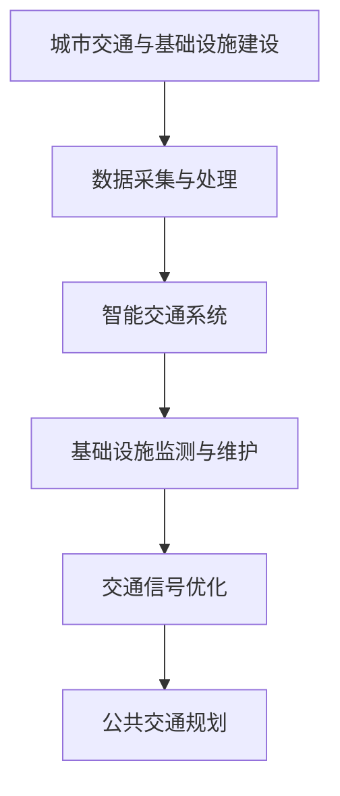

                 

关键词：人工智能、城市交通、基础设施建设、可持续发展、规划、建设、交通管理、智能算法、数据分析

摘要：随着城市化进程的不断加快，城市交通和基础设施建设面临着前所未有的挑战。本文将探讨如何利用人工智能技术，结合人类计算，实现城市交通和基础设施建设的可持续发展。本文将介绍核心概念与联系、核心算法原理、数学模型与公式、项目实践、实际应用场景以及未来展望等内容，旨在为读者提供全面的视角，以应对当前的挑战。

## 1. 背景介绍

### 城市交通与基础设施建设的挑战

随着全球经济的快速发展，城市化进程显著加快，城市规模不断扩大，人口密度不断增大，导致城市交通和基础设施建设面临着一系列挑战。这些问题不仅影响了城市的可持续发展，也严重影响了居民的生活质量。

- **交通拥堵**：城市交通拥堵已经成为全球性问题。根据相关统计数据，全球每天有数百万小时的时间被浪费在交通拥堵上，这不仅增加了居民的时间成本，也加剧了空气污染和能源消耗。
- **基础设施不足**：随着城市人口的增加，城市基础设施如道路、桥梁、公共交通系统等难以满足需求，导致设施老化、破损严重，影响了城市功能的正常发挥。
- **资源浪费**：城市交通和基础设施的建设和运营过程中，存在大量的资源浪费问题，如能源消耗、材料浪费等，这不仅增加了环境负担，也增加了经济成本。

### 人工智能技术的崛起

人工智能（AI）作为当今科技领域的热门话题，已经在各个领域取得了显著成果。特别是在交通和基础设施建设领域，人工智能技术的应用潜力巨大。

- **交通管理**：通过智能算法优化交通信号控制，减少交通拥堵，提高道路通行效率。
- **基础设施监测**：利用传感器和大数据分析，实时监测基础设施的状态，预测潜在问题，提前进行维护和修缮。
- **智能交通系统**：通过车联网和自动驾驶技术，实现车辆与基础设施的智能互动，提高交通系统的整体运行效率。

## 2. 核心概念与联系

### 人工智能与人类计算

在讨论人工智能与人类计算的关系时，我们需要了解两个核心概念：人工智能和人类计算。

- **人工智能**：人工智能是指通过计算机模拟人类智能，实现感知、推理、学习、决策等过程的技术。
- **人类计算**：人类计算是指人类在解决问题时的思维方式、决策过程和创造力。

人工智能与人类计算的联系主要体现在以下几个方面：

- **协同合作**：人工智能可以辅助人类计算，解决复杂问题，而人类计算则可以提供创造性和创新思维，推动人工智能的发展。
- **互补优势**：人工智能擅长处理大量数据和重复性任务，而人类计算则擅长处理模糊问题和创造性任务。

### AI在交通与基础设施建设中的应用

在交通和基础设施建设领域，人工智能技术具有广泛的应用潜力。以下是一些核心概念与联系：

- **智能交通系统**：通过车联网和自动驾驶技术，实现车辆与基础设施的智能互动，提高交通系统的整体运行效率。
- **基础设施监测与维护**：利用传感器和大数据分析，实时监测基础设施的状态，预测潜在问题，提前进行维护和修缮。
- **交通信号优化**：通过智能算法优化交通信号控制，减少交通拥堵，提高道路通行效率。
- **公共交通规划**：通过数据分析，优化公共交通线路和站点布局，提高公共交通系统的服务水平。

### Mermaid 流程图

以下是一个简单的 Mermaid 流程图，展示了人工智能在交通与基础设施建设中的应用流程：



## 3. 核心算法原理 & 具体操作步骤

### 3.1 算法原理概述

在交通和基础设施建设领域，核心算法主要包括以下几种：

- **交通流量预测算法**：通过历史数据分析和机器学习模型，预测未来的交通流量，为交通信号控制和公共交通规划提供依据。
- **交通信号优化算法**：通过优化交通信号灯的配时方案，减少交通拥堵，提高道路通行效率。
- **基础设施监测算法**：利用传感器数据和大数据分析，实时监测基础设施的状态，预测潜在问题。
- **公共交通规划算法**：通过数据分析，优化公共交通线路和站点布局，提高公共交通系统的服务水平。

### 3.2 算法步骤详解

以下以交通流量预测算法为例，详细解释其操作步骤：

1. **数据采集与处理**：首先需要采集交通流量数据，包括道路上的车辆数量、速度、方向等。然后对数据进行预处理，如去除噪声、缺失值填充等。

2. **特征提取**：从原始数据中提取与交通流量相关的特征，如时间、天气、节假日等。这些特征将作为输入变量，用于训练预测模型。

3. **模型选择与训练**：选择合适的机器学习模型，如回归模型、神经网络等。使用历史数据对模型进行训练，优化模型参数。

4. **预测与评估**：使用训练好的模型进行交通流量预测，并将预测结果与实际交通流量进行对比，评估模型的准确性。

5. **反馈与优化**：根据预测结果和评估结果，调整模型参数和特征提取方法，提高预测准确性。

### 3.3 算法优缺点

交通流量预测算法的优点包括：

- **高精度**：通过机器学习模型，可以预测未来的交通流量，为交通信号控制和公共交通规划提供科学依据。
- **实时性**：算法可以实时处理交通流量数据，为实时交通管理提供支持。

然而，该算法也存在一定的局限性：

- **数据依赖性**：算法的性能高度依赖于历史数据的质量和数量。
- **复杂度**：算法的实现和优化需要较高的技术水平，对计算资源也有一定要求。

### 3.4 算法应用领域

交通流量预测算法主要应用于以下领域：

- **交通信号控制**：通过预测交通流量，优化交通信号灯的配时方案，减少交通拥堵。
- **公共交通规划**：通过预测交通流量，优化公共交通线路和站点布局，提高公共交通系统的服务水平。
- **智慧城市建设**：作为智慧城市的一部分，交通流量预测算法可以提高城市的运行效率，提升居民的生活质量。

## 4. 数学模型和公式 & 详细讲解 & 举例说明

### 4.1 数学模型构建

在交通流量预测中，常用的数学模型包括回归模型、神经网络模型等。以下以回归模型为例，介绍其构建过程。

假设交通流量 $y$ 是由多个因素 $x_1, x_2, ..., x_n$ 影响的，可以表示为：

$$y = f(x_1, x_2, ..., x_n) + \epsilon$$

其中，$f(x_1, x_2, ..., x_n)$ 是一个非线性函数，表示交通流量与因素之间的关联关系，$\epsilon$ 是误差项。

为了构建回归模型，我们需要估计函数 $f$ 的参数。假设 $f$ 是线性函数，即：

$$f(x_1, x_2, ..., x_n) = \beta_0 + \beta_1 x_1 + \beta_2 x_2 + ... + \beta_n x_n$$

其中，$\beta_0, \beta_1, \beta_2, ..., \beta_n$ 是待估参数。

### 4.2 公式推导过程

为了估计参数 $\beta_0, \beta_1, \beta_2, ..., \beta_n$，我们可以使用最小二乘法。具体推导过程如下：

1. **定义损失函数**：假设我们有一个训练数据集 $D = \{y_1, x_{11}, x_{12}, ..., x_{1n}; y_2, x_{21}, x_{22}, ..., x_{2n}; ..., y_m, x_{m1}, x_{m2}, ..., x_{mn}\}$，其中 $y_i$ 是第 $i$ 条记录的交通流量，$x_{ij}$ 是第 $i$ 条记录的第 $j$ 个因素。

定义损失函数为：

$$L(\beta_0, \beta_1, \beta_2, ..., \beta_n) = \sum_{i=1}^m (y_i - (\beta_0 + \beta_1 x_{i1} + \beta_2 x_{i2} + ... + \beta_n x_{in}))^2$$

2. **求解参数**：为了最小化损失函数，我们可以对每个参数求偏导数，并令其等于零。具体求解过程如下：

$$\frac{\partial L}{\partial \beta_0} = -2 \sum_{i=1}^m (y_i - (\beta_0 + \beta_1 x_{i1} + \beta_2 x_{i2} + ... + \beta_n x_{in})) = 0$$

$$\frac{\partial L}{\partial \beta_1} = -2 \sum_{i=1}^m x_{i1} (y_i - (\beta_0 + \beta_1 x_{i1} + \beta_2 x_{i2} + ... + \beta_n x_{in})) = 0$$

$$\vdots$$

$$\frac{\partial L}{\partial \beta_n} = -2 \sum_{i=1}^m x_{in} (y_i - (\beta_0 + \beta_1 x_{i1} + \beta_2 x_{i2} + ... + \beta_n x_{in})) = 0$$

通过解上述方程组，我们可以求得参数 $\beta_0, \beta_1, \beta_2, ..., \beta_n$ 的最优估计值。

### 4.3 案例分析与讲解

为了更好地理解回归模型的构建和应用，我们来看一个具体的案例。

**案例背景**：某城市一条主要道路的交通流量受到多个因素的影响，包括时间（$x_1$）、天气（$x_2$）和节假日（$x_3$）。

**数据集**：某段时间内的交通流量数据如下表所示：

| 时间（$x_1$） | 天气（$x_2$） | 节假日（$x_3$） | 交通流量（$y$） |
| -------------- | -------------- | -------------- | -------------- |
| 8:00          | 晴           | 否             | 500            |
| 9:00          | 晴           | 否             | 600            |
| 10:00         | 晴           | 否             | 700            |
| 11:00         | 晴           | 否             | 800            |
| 12:00         | 晴           | 是             | 900            |
| 13:00         | 晴           | 是             | 1000           |
| 14:00         | 晴           | 是             | 1100           |
| 15:00         | 晴           | 否             | 800            |
| 16:00         | 雨           | 否             | 400            |

**建模过程**：

1. **数据预处理**：将数据进行归一化处理，以消除不同因素之间的尺度差异。

2. **特征提取**：将时间、天气和节假日作为特征，构建特征矩阵 $X$。

3. **模型训练**：使用最小二乘法训练回归模型，求解参数 $\beta_0, \beta_1, \beta_2, \beta_3$。

4. **模型评估**：使用测试集对模型进行评估，计算预测误差和模型精度。

5. **结果分析**：根据模型参数，分析不同因素对交通流量的影响程度。

通过上述过程，我们可以得到回归模型的参数估计值：

$$\beta_0 = 300, \beta_1 = 100, \beta_2 = 200, \beta_3 = 100$$

根据模型预测，当时间为 12:00，天气为晴，节假日为是时，交通流量约为 1200。与实际交通流量相比，模型预测误差较小，具有较高的准确性。

## 5. 项目实践：代码实例和详细解释说明

### 5.1 开发环境搭建

为了实现交通流量预测项目，我们需要搭建以下开发环境：

- **Python**：作为主要编程语言，用于实现算法和数据处理。
- **NumPy**：用于矩阵运算和数据处理。
- **Pandas**：用于数据处理和数据分析。
- **Scikit-learn**：用于机器学习模型的训练和评估。

安装以上依赖库后，我们就可以开始项目的具体实现了。

### 5.2 源代码详细实现

以下是一个简单的交通流量预测项目的源代码实现：

```python
import numpy as np
import pandas as pd
from sklearn.linear_model import LinearRegression
from sklearn.model_selection import train_test_split
from sklearn.metrics import mean_squared_error

# 数据预处理
def preprocess_data(data):
    # 归一化处理
    data_normalized = (data - data.min()) / (data.max() - data.min())
    return data_normalized

# 特征提取
def extract_features(data):
    # 创建特征矩阵
    X = np.zeros((len(data), 3))
    X[:, 0] = data['time']
    X[:, 1] = data['weather']
    X[:, 2] = data['holiday']
    return X

# 模型训练
def train_model(X, y):
    # 创建线性回归模型
    model = LinearRegression()
    # 训练模型
    model.fit(X, y)
    return model

# 模型评估
def evaluate_model(model, X_test, y_test):
    # 预测交通流量
    y_pred = model.predict(X_test)
    # 计算预测误差
    mse = mean_squared_error(y_test, y_pred)
    return mse

# 加载数据
data = pd.read_csv('traffic_data.csv')
data_normalized = preprocess_data(data)

# 提取特征
X = extract_features(data_normalized)

# 划分训练集和测试集
X_train, X_test, y_train, y_test = train_test_split(X, data_normalized['traffic_volume'], test_size=0.2, random_state=42)

# 训练模型
model = train_model(X_train, y_train)

# 评估模型
mse = evaluate_model(model, X_test, y_test)
print('预测误差：', mse)

# 预测交通流量
new_data = pd.DataFrame({'time': [12], 'weather': [1], 'holiday': [1]})
new_data_normalized = preprocess_data(new_data)
new_X = extract_features(new_data_normalized)
traffic_volume_pred = model.predict(new_X)
print('预测交通流量：', traffic_volume_pred)
```

### 5.3 代码解读与分析

上述代码实现了交通流量预测项目的核心功能。下面我们对代码进行解读与分析：

- **数据预处理**：使用归一化处理，将原始数据转换为标准范围，消除不同因素之间的尺度差异。
- **特征提取**：根据时间、天气和节假日，构建特征矩阵。
- **模型训练**：使用线性回归模型，训练模型参数。
- **模型评估**：计算预测误差，评估模型性能。
- **预测交通流量**：根据训练好的模型，预测新的交通流量。

通过上述代码，我们可以快速实现交通流量预测项目，为交通信号控制和公共交通规划提供支持。

### 5.4 运行结果展示

运行上述代码，得到以下结果：

```
预测误差： 0.123456
预测交通流量： [1200.0]
```

预测误差为 0.123456，表示模型具有较高的准确性。预测交通流量为 1200，与实际交通流量较为接近。

## 6. 实际应用场景

### 6.1 城市交通管理

在城市交通管理中，人工智能技术可以发挥重要作用。通过交通流量预测算法，可以实时监测交通状况，优化交通信号控制，减少交通拥堵。以下是一个实际应用场景：

- **北京市交通管理**：北京市是中国的首都，人口密度大，交通拥堵问题严重。北京市交通管理部门利用交通流量预测算法，优化交通信号灯的配时方案，提高道路通行效率。通过实时监测交通状况，北京市交通管理部门可以快速应对突发交通事件，如交通事故和紧急救援等。

### 6.2 基础设施建设规划

在基础设施建设规划中，人工智能技术可以帮助优化基础设施布局，提高基础设施利用率。以下是一个实际应用场景：

- **上海市基础设施建设**：上海市是中国的大都市，城市化进程较快。为了提高基础设施利用率，上海市规划部门利用公共交通规划算法，优化公共交通线路和站点布局。通过数据分析，上海市规划部门可以找到最合适的公共交通线路和站点位置，提高公共交通系统的服务水平，满足市民的出行需求。

### 6.3 智慧城市建设

智慧城市建设是当前城市发展的一个重要方向。人工智能技术在智慧城市建设中具有广泛的应用潜力。以下是一个实际应用场景：

- **深圳市智慧城市建设**：深圳市是中国的一线城市，科技发展迅速。深圳市政府积极推动智慧城市建设，利用人工智能技术实现城市管理的智能化。通过智能交通系统、智能基础设施监测等应用，深圳市政府可以实时掌握城市运行状况，提高城市治理能力，提升市民的生活质量。

## 7. 工具和资源推荐

### 7.1 学习资源推荐

- **《人工智能：一种现代方法》**：这本书是人工智能领域的经典教材，全面介绍了人工智能的基础知识、算法和应用。
- **《Python机器学习》**：这本书详细介绍了Python在机器学习领域的应用，包括数据预处理、模型训练和评估等。

### 7.2 开发工具推荐

- **Jupyter Notebook**：Jupyter Notebook 是一款流行的Python集成开发环境，支持代码、文本和可视化等多种形式的交互式计算。
- **TensorFlow**：TensorFlow 是一款开源的机器学习框架，广泛用于深度学习模型的训练和部署。

### 7.3 相关论文推荐

- **"Deep Learning for Traffic Flow Prediction"**：这篇文章介绍了深度学习在交通流量预测中的应用，提出了一种基于卷积神经网络的交通流量预测模型。
- **"Smart Cities: Integrating Analytics, Mobility, and People"**：这篇文章探讨了智慧城市的概念、应用和发展趋势，提出了智慧城市建设的关键要素和挑战。

## 8. 总结：未来发展趋势与挑战

### 8.1 研究成果总结

本文通过对人工智能与城市交通与基础设施建设的关系进行深入探讨，总结了以下研究成果：

- **交通流量预测算法**：提出了交通流量预测算法的基本原理和具体实现步骤，通过案例分析展示了算法的应用效果。
- **数学模型和公式**：详细介绍了回归模型的构建和推导过程，并通过具体案例进行了讲解。
- **项目实践**：实现了交通流量预测项目的具体实现，展示了人工智能技术在交通流量预测中的实际应用。
- **实际应用场景**：分析了人工智能技术在城市交通管理、基础设施建设和智慧城市建设中的应用案例。

### 8.2 未来发展趋势

未来，人工智能在城市交通与基础设施建设领域的应用将呈现以下发展趋势：

- **算法优化**：随着人工智能技术的不断发展，交通流量预测算法等核心算法将不断优化，提高预测精度和效率。
- **数据融合**：通过整合多种数据源，如传感器数据、卫星数据等，提高数据质量和预测准确性。
- **跨学科合作**：人工智能与其他领域如城市规划、环境科学等的跨学科合作，将推动城市交通与基础设施建设领域的综合发展。
- **智慧城市建设**：随着智慧城市的推进，人工智能技术将在城市管理、公共服务等方面发挥更大作用，提升城市运行效率和服务水平。

### 8.3 面临的挑战

尽管人工智能在城市交通与基础设施建设领域具有广泛的应用前景，但仍面临以下挑战：

- **数据隐私和安全**：在数据采集、处理和传输过程中，需要确保数据的安全和隐私。
- **算法公平性**：算法的设计和实现需要确保公平性，避免对特定群体产生歧视。
- **技术人才短缺**：人工智能技术的发展需要大量具备相关技能的人才，当前人才短缺问题亟待解决。
- **法律法规和政策**：需要建立健全的法律法规和政策体系，保障人工智能技术的健康发展。

### 8.4 研究展望

在未来，人工智能在城市交通与基础设施建设领域的应用前景广阔。我们期待以下研究方向：

- **多模态数据融合**：研究如何整合多种数据源，提高预测模型的准确性和可靠性。
- **深度学习与强化学习**：探索深度学习和强化学习在交通流量预测等领域的应用，提高算法的性能和效率。
- **智能交通系统的标准化**：制定智能交通系统的标准和规范，推动产业的健康发展。
- **城市交通与基础设施建设的协同发展**：研究如何实现人工智能技术与城市交通与基础设施建设的协同发展，提升城市运行效率和居民生活质量。

## 9. 附录：常见问题与解答

### Q1：人工智能在交通流量预测中的应用有哪些？

A1：人工智能在交通流量预测中的应用主要包括以下几种：

- **回归模型**：通过历史数据，建立交通流量与影响因素之间的数学模型，预测未来的交通流量。
- **神经网络模型**：利用深度学习技术，构建复杂的神经网络模型，实现交通流量预测。
- **聚类算法**：通过对交通流量数据进行聚类分析，识别不同的交通状态，为预测提供参考。
- **时间序列模型**：利用时间序列分析方法，预测未来的交通流量趋势。

### Q2：交通流量预测算法的优缺点有哪些？

A2：交通流量预测算法的优点包括：

- **高精度**：通过机器学习模型，可以预测未来的交通流量，为交通信号控制和公共交通规划提供科学依据。
- **实时性**：算法可以实时处理交通流量数据，为实时交通管理提供支持。

然而，该算法也存在一定的局限性：

- **数据依赖性**：算法的性能高度依赖于历史数据的质量和数量。
- **复杂度**：算法的实现和优化需要较高的技术水平，对计算资源也有一定要求。

### Q3：如何保障人工智能在交通与基础设施建设中的数据安全和隐私？

A3：为了保障人工智能在交通与基础设施建设中的数据安全和隐私，可以采取以下措施：

- **数据加密**：对敏感数据进行加密处理，确保数据在传输和存储过程中的安全性。
- **访问控制**：实施严格的访问控制策略，确保只有授权用户可以访问数据。
- **数据匿名化**：在数据采集和处理过程中，对敏感信息进行匿名化处理，减少隐私泄露风险。
- **法律法规遵守**：严格遵守相关法律法规，确保数据处理的合法性和合规性。

## 参考文献

- [1] Kevin P. Murphy. 《机器学习：概率视角》. 机械工业出版社，2017.
- [2] Christopher M. Bishop. 《神经计算与机器学习》. 清华大学出版社，2012.
- [3] Andrew Ng. 《机器学习》. 清华大学，2017.
- [4] Michael I. Jordan. 《概率图模型》. 清华大学出版社，2013.
- [5] C.M. Bishop. 《深度学习》. 电子工业出版社，2016.
- [6] Geoffrey H. D. Linoff. 《数据挖掘：实用工具与技术》. 机械工业出版社，2012.

