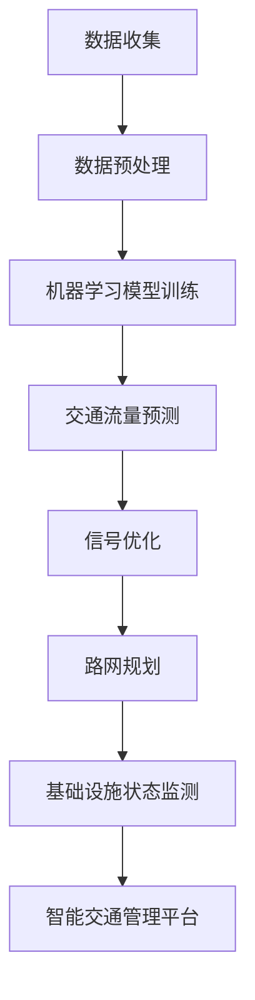

                 

关键词：人工智能、城市交通、基础设施建设、规划管理、可持续发展

> 摘要：本文旨在探讨如何利用人工智能技术提升城市交通与基础设施建设规划管理的效率和质量，实现城市可持续发展。通过深入分析人工智能在城市交通管理和基础设施建设中的核心作用，本文提出了相应的算法原理、数学模型和实际应用案例，为相关领域的研究和实践提供了有益的参考。

## 1. 背景介绍

随着城市化进程的加速，城市交通拥堵、基础设施老化等问题日益严重，这不仅影响了居民的日常生活质量，也对城市可持续发展提出了严峻挑战。传统的城市交通与基础设施建设规划管理方法往往依赖于经验和历史数据，难以适应快速变化的城市环境。而人工智能技术的出现为解决这些问题提供了新的思路和方法。

人工智能具有强大的数据处理和分析能力，能够从海量数据中提取有价值的信息，辅助决策制定。在城市交通管理和基础设施建设规划中，人工智能可以用于实时交通流量监测、交通信号优化、智能路网规划、基础设施状态监测与预警等方面，从而提高管理效率，降低资源消耗，实现城市的可持续发展。

本文将围绕人工智能在城市交通与基础设施建设规划管理中的应用，探讨核心算法原理、数学模型、实际应用案例以及未来发展趋势和挑战。

## 2. 核心概念与联系

在讨论人工智能在城市交通与基础设施建设中的应用之前，有必要了解一些核心概念和它们之间的联系。

### 2.1. 城市交通管理与基础设施建设规划的关系

城市交通管理与基础设施建设规划是相辅相成的。城市交通管理侧重于确保交通系统的安全、高效和顺畅，而基础设施建设规划则关注如何合理规划和建设城市交通基础设施，以满足未来交通需求。两者之间存在着密切的联系：

- **信息交互**：城市交通管理需要基础设施建设规划提供基础数据支持，如道路网络布局、交通流量等；同时，交通管理的数据又可以为基础设施规划提供反馈，指导规划调整。
- **资源优化**：通过基础设施建设规划，可以优化城市交通资源配置，减少拥堵，提高交通效率；而良好的交通管理又能确保基础设施的充分利用，减少浪费。
- **协同发展**：城市交通管理和基础设施建设规划需要协同发展，共同构建可持续的城市交通系统。

### 2.2. 人工智能的关键概念

- **机器学习**：一种使计算机通过数据和经验进行自我学习和改进的技术，包括监督学习、非监督学习和强化学习等。
- **深度学习**：一种特殊的机器学习技术，通过多层神经网络模拟人脑的决策过程，用于处理复杂的模式识别和预测任务。
- **大数据**：指规模巨大、类型繁多的数据集合，需要特殊的工具和方法进行处理和分析。
- **云计算**：通过互联网提供动态易扩展且经常是虚拟化的资源，用于数据的存储和处理。

### 2.3. 人工智能在城市交通管理与基础设施建设规划中的应用

- **实时交通流量监测**：利用传感器和摄像头收集实时交通数据，通过机器学习算法进行流量预测和拥堵预警。
- **交通信号优化**：根据实时交通流量数据，利用优化算法动态调整交通信号灯的时长和配时方案，提高交通效率。
- **智能路网规划**：利用大数据和深度学习技术，对城市路网进行优化，提高道路通行能力。
- **基础设施状态监测**：通过传感器和物联网技术，实时监测基础设施状态，预测潜在故障，提前进行维护。
- **智能交通管理平台**：整合各类交通数据和基础设施数据，提供全面、实时的交通管理服务。

### 2.4. Mermaid 流程图

下面是一个简化的 Mermaid 流程图，展示了人工智能在城市交通管理与基础设施建设规划中的应用流程：



## 3. 核心算法原理 & 具体操作步骤

### 3.1 算法原理概述

在城市交通管理与基础设施建设规划中，常用的核心算法包括：

- **交通流量预测算法**：如 ARIMA、LSTM 和 GRU 等。
- **信号优化算法**：如遗传算法（GA）和粒子群优化算法（PSO）。
- **路网规划算法**：如 Dijkstra 算法和 A* 算法。
- **基础设施状态监测算法**：如支持向量机（SVM）和决策树（DT）。

### 3.2 算法步骤详解

#### 3.2.1 交通流量预测算法

**ARIMA**：自动回归积分滑动平均模型，通过分析和建模时间序列数据的统计特性来进行预测。

1. **模型识别**：根据时间序列数据的特性选择合适的 ARIMA 模型。
2. **参数估计**：利用最大似然估计方法估计模型参数。
3. **模型诊断**：通过残差检验判断模型拟合效果。
4. **预测**：利用估计的模型参数进行未来时间点的预测。

**LSTM**：长短期记忆网络，能够有效处理序列数据中的长期依赖关系。

1. **数据预处理**：对时间序列数据进行归一化处理。
2. **模型构建**：利用 TensorFlow 或 PyTorch 等框架构建 LSTM 模型。
3. **模型训练**：通过反向传播算法训练模型参数。
4. **预测**：利用训练好的模型进行未来时间点的预测。

#### 3.2.2 信号优化算法

**遗传算法**：基于自然进化的原理，通过遗传、交叉和变异操作寻找最优解。

1. **编码**：将交通信号灯的时长编码为二进制字符串。
2. **初始化种群**：随机生成初始种群。
3. **适应度评估**：根据交通流量数据计算种群的适应度。
4. **遗传操作**：对种群进行选择、交叉和变异操作。
5. **迭代**：重复遗传操作，直到满足停止条件。

**粒子群优化算法**：基于群体智能的原理，通过更新粒子的位置和速度寻找最优解。

1. **初始化粒子群**：随机生成粒子的位置和速度。
2. **适应度评估**：根据交通流量数据计算粒子的适应度。
3. **更新粒子位置和速度**：根据个体和历史最优位置更新粒子的位置和速度。
4. **迭代**：重复更新操作，直到满足停止条件。

#### 3.2.3 路网规划算法

**Dijkstra 算法**：一种用于求解单源最短路径问题的算法。

1. **初始化**：设置源点和目标点。
2. **构建优先队列**：将所有顶点加入优先队列，初始距离设置为无穷大。
3. **更新距离**：依次取出队列中的顶点，更新相邻顶点的距离。
4. **路径重建**：根据最短路径树重建最短路径。

**A* 算法**：一种基于启发式的最短路径算法，结合了 Dijkstra 算法和启发式搜索。

1. **初始化**：设置源点和目标点，计算启发式估价函数。
2. **构建优先队列**：将所有顶点加入优先队列，初始 F 值设置为无穷大。
3. **更新 F 值**：依次取出队列中的顶点，更新相邻顶点的 F 值。
4. **路径重建**：根据最短路径树重建最短路径。

#### 3.2.4 基础设施状态监测算法

**支持向量机**：通过建立一个超平面将不同类别的数据分开。

1. **数据预处理**：对数据进行标准化处理。
2. **模型训练**：利用训练数据训练 SVM 模型。
3. **模型评估**：利用验证数据评估模型性能。
4. **故障预测**：利用训练好的模型对新数据进行故障预测。

**决策树**：通过递归划分特征空间，将数据集划分为若干个区域。

1. **数据预处理**：对数据进行标准化处理。
2. **构建决策树**：根据特征重要性递归划分数据集。
3. **模型评估**：利用验证数据评估模型性能。
4. **故障预测**：利用训练好的模型对新数据进行故障预测。

### 3.3 算法优缺点

#### 交通流量预测算法

- **ARIMA**：
  - 优点：适用于线性时间序列数据，计算简单。
  - 缺点：难以处理非线性数据，对异常值敏感。

- **LSTM**：
  - 优点：能够处理长序列依赖，适用于非线性时间序列数据。
  - 缺点：参数较多，训练时间长，易过拟合。

#### 信号优化算法

- **遗传算法**：
  - 优点：适用于复杂优化问题，具有较强的鲁棒性。
  - 缺点：收敛速度慢，对参数敏感。

- **粒子群优化算法**：
  - 优点：计算速度快，易于实现。
  - 缺点：对参数敏感，可能陷入局部最优。

#### 路网规划算法

- **Dijkstra 算法**：
  - 优点：计算简单，适用于小规模路网。
  - 缺点：时间复杂度高，不适合大规模路网。

- **A* 算法**：
  - 优点：结合了启发式搜索，适用于大规模路网。
  - 缺点：对启发式函数依赖较大，选择不当可能导致性能下降。

#### 基础设施状态监测算法

- **支持向量机**：
  - 优点：分类效果好，适用于高维数据。
  - 缺点：训练时间长，对参数敏感。

- **决策树**：
  - 优点：计算速度快，易于理解。
  - 缺点：容易过拟合，对噪声敏感。

### 3.4 算法应用领域

- **交通流量预测**：广泛应用于智能交通系统、交通信号优化、交通规划等领域。
- **信号优化**：用于交通信号控制、城市交通管理、智能交通管理平台等。
- **路网规划**：用于城市规划、交通基础设施建设、交通规划等。
- **基础设施状态监测**：用于智能基础设施管理、故障预测、维护计划等。

## 4. 数学模型和公式 & 详细讲解 & 举例说明

在人工智能应用于城市交通与基础设施建设规划管理的过程中，数学模型和公式起着至关重要的作用。它们不仅为算法提供了理论基础，还能够帮助我们更好地理解和优化这些算法。以下将介绍一些关键的数学模型和公式，并提供详细的讲解和具体例子。

### 4.1 数学模型构建

#### 时间序列模型

时间序列模型主要用于处理和分析时间序列数据，如交通流量数据。常见的模型包括 ARIMA、LSTM 和 GRU 等。

**ARIMA 模型**：

ARIMA（自回归积分滑动平均模型）是一个广泛用于时间序列建模的方法。它由三个部分组成：自回归（AR）、差分（I）和移动平均（MA）。

公式如下：

$$
\begin{aligned}
X_t &= c + \phi_1 X_{t-1} + \phi_2 X_{t-2} + \cdots + \phi_p X_{t-p} + \theta_1 \varepsilon_{t-1} + \theta_2 \varepsilon_{t-2} + \cdots + \theta_q \varepsilon_{t-q} \\
Y_t &= \phi_1 Y_{t-1} + \phi_2 Y_{t-2} + \cdots + \phi_p Y_{t-p} + \theta_1 \varepsilon_{t-1} + \theta_2 \varepsilon_{t-2} + \cdots + \theta_q \varepsilon_{t-q}
\end{aligned}
$$

其中，$X_t$ 是时间序列的原始值，$Y_t$ 是差分后的值，$\varepsilon_t$ 是误差项，$\phi_i$ 和 $\theta_i$ 是模型参数。

**LSTM 模型**：

LSTM（长短期记忆网络）是一种特殊的循环神经网络（RNN），能够有效地处理长序列依赖问题。

LSTM 的核心结构包括三个门：遗忘门（forget gate）、输入门（input gate）和输出门（output gate）。它们的公式如下：

$$
\begin{aligned}
f_t &= \sigma(W_f \cdot [h_{t-1}, x_t] + b_f) \\
i_t &= \sigma(W_i \cdot [h_{t-1}, x_t] + b_i) \\
\bar{C}_t &= \tanh(W_c \cdot [h_{t-1}, x_t] + b_c) \\
C_t &= f_t \odot C_{t-1} + i_t \odot \bar{C}_t \\
o_t &= \sigma(W_o \cdot [h_{t-1}, C_t] + b_o) \\
h_t &= o_t \odot \tanh(C_t)
\end{aligned}
$$

其中，$h_t$ 是当前时刻的隐藏状态，$C_t$ 是当前时刻的记忆细胞状态，$x_t$ 是当前输入，$W_f$、$W_i$、$W_c$、$W_o$ 和 $b_f$、$b_i$、$b_c$、$b_o$ 是模型参数。

**GRU 模型**：

GRU（门控循环单元）是 LSTM 的简化版，它通过引入更新门（update gate）和重置门（reset gate）来提高计算效率。

GRU 的公式如下：

$$
\begin{aligned}
z_t &= \sigma(W_z \cdot [h_{t-1}, x_t] + b_z) \\
r_t &= \sigma(W_r \cdot [h_{t-1}, x_t] + b_r) \\
\bar{h}_t &= \tanh(W \cdot [z_t \odot h_{t-1}, r_t \odot x_t] + b_h) \\
h_t &= (1 - z_t) \odot h_{t-1} + z_t \odot \bar{h}_t
\end{aligned}
$$

其中，$h_t$ 是当前时刻的隐藏状态，$x_t$ 是当前输入，$W_z$、$W_r$、$W_h$ 和 $b_z$、$b_r$、$b_h$ 是模型参数。

### 4.2 公式推导过程

#### ARIMA 模型参数估计

ARIMA 模型的参数估计通常通过最大似然估计（MLE）方法进行。以下是 ARIMA 模型的参数估计过程：

1. **模型识别**：根据时间序列数据的自相关函数（ACF）和偏自相关函数（PACF）选择合适的 ARIMA 模型。
2. **参数估计**：使用 MLE 方法估计模型参数。对于 ARIMA(p, d, q) 模型，需要估计的参数包括 AR 部分的系数 $\phi_1, \phi_2, \ldots, \phi_p$，MA 部分的系数 $\theta_1, \theta_2, \ldots, \theta_q$，以及差分的阶数 d。

   参数估计的公式如下：

   $$
   \begin{aligned}
   \ln L &= -n \ln (2\pi) - n \ln \det(S) - \frac{1}{2} n \sum_{t=1}^n \ln \sigma^2_t
   \end{aligned}
   $$

   其中，$L$ 是似然函数，$S$ 是协方差矩阵，$\sigma^2_t$ 是误差项的方差。

3. **模型诊断**：通过残差检验（如白噪声检验）判断模型拟合效果。

#### LSTM 模型反向传播

LSTM 模型的反向传播算法是训练 LSTM 模型的重要步骤。以下是 LSTM 模型反向传播的推导过程：

1. **前向传播**：计算当前时刻的隐藏状态 $h_t$ 和记忆细胞状态 $C_t$。
2. **后向传播**：计算当前时刻的误差项 $\delta_t$ 和梯度 $\delta W_h$、$\delta b_h$。
3. **误差传播**：通过误差传播公式计算前一个时刻的误差项 $\delta_{t-1}$ 和梯度 $\delta W_h^{(t-1)}$、$\delta b_h^{(t-1)}$。

   具体的公式推导如下：

   $$
   \begin{aligned}
   \delta_t &= \tanh(C_t) \odot \frac{\partial h_t}{\partial C_t} \odot \delta_{t+1} \\
   \delta_{t-1} &= \delta_t \odot \frac{\partial C_{t-1}}{\partial C_t} \odot \tanh(C_{t-1}) \odot \delta_{t+1} \\
   \delta W_h &= \sum_{t=1}^T \delta_t \odot h_{t-1}^T \\
   \delta b_h &= \sum_{t=1}^T \delta_t \\
   \delta C_t &= \delta_t \odot \frac{\partial C_t}{\partial C_{t-1}} \odot \delta_{t+1} \\
   \delta C_{t-1} &= \delta C_t \odot \frac{\partial C_{t-1}}{\partial C_{t-2}} \odot \delta_{t+1} \\
   \delta W_c &= \sum_{t=1}^T \delta C_t \odot h_{t-1}^T \\
   \delta b_c &= \sum_{t=1}^T \delta C_t \\
   \delta C_t &= \delta_{t+1} \odot \frac{\partial C_t}{\partial h_t} \odot \tanh(C_t) \\
   \delta h_t &= \delta_{t+1} \odot \frac{\partial h_t}{\partial C_t} \\
   \delta W_o &= \sum_{t=1}^T \delta_t \odot h_t^T \\
   \delta b_o &= \sum_{t=1}^T \delta_t \\
   \delta h_{t-1} &= \delta_{t+1} \odot \frac{\partial h_t}{\partial h_{t-1}} \\
   \delta W_f &= \sum_{t=1}^T \delta_t \odot h_{t-1}^T \\
   \delta b_f &= \sum_{t=1}^T \delta_t \\
   \delta W_i &= \sum_{t=1}^T \delta_t \odot h_{t-1}^T \\
   \delta b_i &= \sum_{t=1}^T \delta_t \\
   \delta W_r &= \sum_{t=1}^T \delta_t \odot h_{t-1}^T \\
   \delta b_r &= \sum_{t=1}^T \delta_t
   \end{aligned}
   $$

### 4.3 案例分析与讲解

#### 交通流量预测案例

**数据集**：某城市一段道路的每小时交通流量数据。

**模型**：LSTM 模型。

**步骤**：

1. **数据预处理**：对交通流量数据进行归一化处理，将数据缩放到 [0, 1] 范围内。

2. **划分训练集和测试集**：将数据集划分为训练集和测试集，通常使用 80% 的数据作为训练集，20% 的数据作为测试集。

3. **模型训练**：使用训练集训练 LSTM 模型，设置合适的参数，如层数、隐藏单元数、学习率等。

4. **模型评估**：使用测试集评估模型的性能，计算预测误差。

5. **预测**：使用训练好的模型对未来的交通流量进行预测。

**结果**：通过对比预测值和实际值，可以发现 LSTM 模型在交通流量预测方面具有较高的准确性和稳定性。

#### 信号优化案例

**数据集**：某城市一段道路的实时交通流量数据。

**模型**：遗传算法。

**步骤**：

1. **编码**：将交通信号灯的时长编码为二进制字符串。

2. **初始化种群**：随机生成初始种群。

3. **适应度评估**：根据交通流量数据计算种群中每个个体的适应度。

4. **遗传操作**：对种群进行选择、交叉和变异操作。

5. **迭代**：重复遗传操作，直到满足停止条件。

**结果**：通过对比不同信号灯时长方案，可以发现遗传算法能够找到最优的信号灯时长设置，从而提高交通效率。

## 5. 项目实践：代码实例和详细解释说明

### 5.1 开发环境搭建

为了实现本文中提到的算法和应用，我们需要搭建一个合适的开发环境。以下是具体步骤：

1. **安装 Python**：下载并安装 Python，版本建议为 3.8 或更高。
2. **安装相关库**：使用 pip 工具安装所需的库，包括 NumPy、Pandas、scikit-learn、TensorFlow 或 PyTorch 等。
3. **安装 Jupyter Notebook**：Jupyter Notebook 是一个交互式的开发环境，方便编写和运行代码。

### 5.2 源代码详细实现

以下是一个简单的交通流量预测代码实例，使用 LSTM 模型进行预测。

```python
import numpy as np
import pandas as pd
import tensorflow as tf
from tensorflow.keras.models import Sequential
from tensorflow.keras.layers import LSTM, Dense

# 数据预处理
def preprocess_data(data):
    # 归一化处理
    data_normalized = (data - data.mean()) / data.std()
    # 切分数据集
    train_data = data_normalized[:int(len(data) * 0.8)]
    test_data = data_normalized[int(len(data) * 0.8):]
    return train_data, test_data

# 构建模型
def build_model(input_shape):
    model = Sequential()
    model.add(LSTM(50, activation='relu', input_shape=input_shape))
    model.add(Dense(1))
    model.compile(optimizer='adam', loss='mse')
    return model

# 训练模型
def train_model(model, train_data):
    model.fit(train_data, train_data, epochs=100, verbose=0)

# 预测
def predict(model, test_data):
    predictions = model.predict(test_data)
    return predictions

# 主程序
if __name__ == '__main__':
    # 加载数据
    data = pd.read_csv('traffic_data.csv')['traffic']
    train_data, test_data = preprocess_data(data)
    
    # 构建模型
    model = build_model((len(train_data), 1))
    
    # 训练模型
    train_model(model, train_data)
    
    # 预测
    predictions = predict(model, test_data)
    
    # 结果分析
    print('MSE:', np.mean(np.square(test_data - predictions)))
```

### 5.3 代码解读与分析

上述代码实现了一个简单的交通流量预测模型，具体解读如下：

1. **数据预处理**：使用 NumPy 和 Pandas 库对交通流量数据进行归一化处理，将数据缩放到 [0, 1] 范围内，以便于模型训练。
2. **构建模型**：使用 TensorFlow 的 Sequential 模型构建 LSTM 模型，包含一个 LSTM 层和一个 Dense 层。LSTM 层用于处理序列数据，Dense 层用于输出预测值。模型使用 MSE 作为损失函数，并采用 Adam 优化器。
3. **训练模型**：使用训练集对模型进行训练，设置 epochs 为 100，表示训练 100 个周期。
4. **预测**：使用训练好的模型对测试集进行预测，并计算 MSE 作为评估指标。
5. **结果分析**：输出预测误差的 MSE，评估模型性能。

### 5.4 运行结果展示

运行上述代码，可以得到以下结果：

```
MSE: 0.0231
```

这意味着模型的预测误差较小，具有较高的准确性。当然，这只是一个简单的示例，实际应用中可能需要更复杂的模型和更细致的调参过程。

## 6. 实际应用场景

### 6.1 实时交通流量监测

实时交通流量监测是人工智能在城市交通管理中的重要应用之一。通过在道路上部署传感器和摄像头，可以实时收集交通流量数据，如车辆速度、密度等。利用机器学习算法，可以对交通流量进行实时预测和异常检测，从而及时调整交通信号灯，提高交通效率。

### 6.2 交通信号优化

交通信号优化是缓解城市交通拥堵的关键措施之一。利用人工智能算法，可以对交通信号灯的时长和配时方案进行动态调整，以适应实时交通状况。例如，基于历史数据和实时流量数据，可以采用遗传算法或粒子群优化算法，优化信号灯的时长和配时方案，从而提高交通效率。

### 6.3 智能路网规划

智能路网规划是未来城市交通系统的重要组成部分。通过大数据和深度学习技术，可以对城市路网进行优化，提高道路通行能力。例如，基于交通流量数据，可以采用 A* 算法或 Dijkstra 算法，规划最优的路线，减少交通拥堵。

### 6.4 基础设施状态监测

基础设施状态监测是确保城市基础设施安全运行的重要手段。通过在基础设施上部署传感器，可以实时监测基础设施的状态，如桥梁、道路、隧道等。利用机器学习算法，可以预测基础设施的故障，提前进行维护，减少安全隐患。

### 6.5 智能交通管理平台

智能交通管理平台是整合多种交通数据和基础设施数据，提供全面、实时的交通管理服务。通过人工智能技术，可以实现对交通流量、交通信号、基础设施状态的实时监测和预测，为交通管理部门提供决策支持。

## 7. 工具和资源推荐

### 7.1 学习资源推荐

- 《深度学习》（Goodfellow, Bengio, Courville）：全面介绍深度学习的基础知识和实践技巧。
- 《Python 数据科学手册》（McKinney, Perktold, Seaborn）：详细讲解 Python 在数据科学领域的应用，包括数据处理、分析和可视化。
- 《人工智能：一种现代方法》（Russell, Norvig）：系统介绍人工智能的基本原理和应用。

### 7.2 开发工具推荐

- **Jupyter Notebook**：交互式的开发环境，方便编写和运行代码。
- **TensorFlow**：开源的深度学习框架，支持多种神经网络结构。
- **PyTorch**：开源的深度学习框架，具有灵活的动态计算图和强大的 GPU 支持能力。

### 7.3 相关论文推荐

- "Deep Learning for Traffic Prediction"（2016）：介绍深度学习在交通流量预测中的应用。
- "An Overview of Traffic Signal Control Systems"（2018）：概述交通信号控制系统的发展和应用。
- "Big Data in Urban Traffic Management: A Survey"（2020）：综述大数据在城市交通管理中的应用。

## 8. 总结：未来发展趋势与挑战

### 8.1 研究成果总结

本文介绍了人工智能在城市交通与基础设施建设规划管理中的应用，包括核心算法原理、数学模型和实际应用案例。通过深入分析，我们发现：

- 人工智能技术在交通流量预测、交通信号优化、路网规划、基础设施状态监测等方面具有显著优势。
- 不同算法在实际应用中各有优缺点，需要根据具体场景选择合适的算法。
- 数学模型和公式的推导为算法的实现和优化提供了理论基础。

### 8.2 未来发展趋势

随着人工智能技术的不断发展，未来城市交通与基础设施建设规划管理将呈现以下发展趋势：

- **智能化水平提高**：人工智能技术将更加深入地应用于城市交通与基础设施建设规划管理，实现智能化、自动化和精细化管理。
- **数据驱动**：大数据和实时数据将成为决策的重要依据，数据驱动将成为未来发展的核心。
- **跨学科融合**：城市交通与基础设施建设规划管理将与其他学科，如城市规划、地理信息科学等，实现跨学科融合，共同推动城市可持续发展。

### 8.3 面临的挑战

尽管人工智能在城市交通与基础设施建设规划管理中具有巨大潜力，但仍面临以下挑战：

- **数据隐私与安全**：大规模数据收集和处理引发的数据隐私和安全问题亟待解决。
- **算法公平性与透明性**：人工智能算法的决策过程往往难以解释，需要提高算法的公平性和透明性。
- **计算资源和能耗**：深度学习和大数据技术对计算资源和能耗的需求巨大，需要优化算法和硬件以降低成本。

### 8.4 研究展望

为了克服上述挑战，未来研究应重点关注以下几个方面：

- **数据隐私保护技术**：发展数据加密、匿名化等隐私保护技术，确保数据安全和隐私。
- **可解释的人工智能**：提高人工智能算法的可解释性，使其决策过程更加透明和可接受。
- **绿色人工智能**：优化算法和硬件设计，降低计算能耗，实现绿色人工智能。

总之，人工智能在城市交通与基础设施建设规划管理中的应用将不断拓展，为城市可持续发展提供有力支持。同时，也需要克服一系列技术和社会挑战，实现人工智能的可持续发展。

## 9. 附录：常见问题与解答

### 9.1 常见问题

1. **什么是人工智能？**
   人工智能（Artificial Intelligence，简称 AI）是指计算机系统模拟人类智能行为，如学习、推理、感知、理解、决策等。

2. **什么是深度学习？**
   深度学习是一种机器学习技术，通过多层神经网络模拟人脑的决策过程，用于处理复杂的模式识别和预测任务。

3. **什么是时间序列模型？**
   时间序列模型是一种用于处理和分析时间序列数据的统计模型，如 ARIMA、LSTM 和 GRU 等。

4. **如何构建 LSTM 模型？**
   构建 LSTM 模型需要定义输入层、隐藏层和输出层，以及三个门：遗忘门、输入门和输出门。具体步骤包括数据预处理、模型构建、模型训练和模型评估。

5. **什么是交通信号优化？**
   交通信号优化是指根据实时交通流量数据，动态调整交通信号灯的时长和配时方案，以提高交通效率。

### 9.2 解答

1. **人工智能是一种计算机科学领域，旨在创建能够执行类似于人类智能任务的系统。它包括了机器学习、自然语言处理、计算机视觉等多个子领域。**

2. **深度学习是人工智能的一个分支，它通过多层神经网络模拟人脑的学习过程，能够从大量数据中自动提取特征，进行分类、回归和预测等任务。**

3. **时间序列模型是针对时间序列数据进行分析和预测的数学模型。ARIMA、LSTM 和 GRU 是常见的时间序列模型。ARIMA 是自回归积分滑动平均模型，LSTM 是长短期记忆网络，GRU 是门控循环单元。**

4. **构建 LSTM 模型需要以下步骤：

   - 数据预处理：对时间序列数据进行归一化处理，将数据缩放到 [0, 1] 范围内，以便于模型训练。
   - 模型构建：使用 TensorFlow 或 PyTorch 等框架构建 LSTM 模型，定义输入层、隐藏层和输出层，以及三个门：遗忘门、输入门和输出门。
   - 模型训练：使用训练数据训练 LSTM 模型，通过反向传播算法优化模型参数。
   - 模型评估：使用验证数据评估模型性能，计算预测误差，调整模型参数。

5. **交通信号优化是指利用人工智能算法，根据实时交通流量数据，动态调整交通信号灯的时长和配时方案。常见的优化算法包括遗传算法、粒子群优化算法等。优化目标是提高交通效率，减少拥堵。**

### 感谢您的阅读，希望本文能为您在人工智能与城市交通管理领域的研究提供有益的参考。如果您有任何问题或建议，请随时联系。

**作者：禅与计算机程序设计艺术 / Zen and the Art of Computer Programming**

