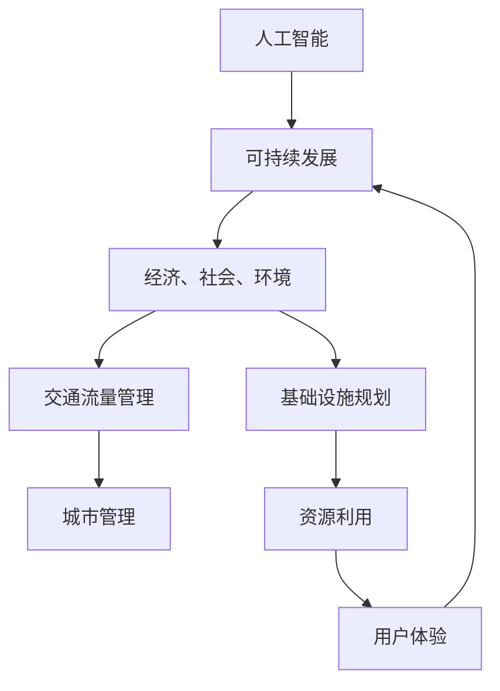

                 

关键词：人工智能、城市交通、基础设施规划、可持续发展

> 摘要：随着全球城市化进程的加速，城市交通和基础设施的优化已经成为实现可持续发展的重要课题。本文深入探讨了人工智能在城市交通与基础设施规划中的应用，提出了基于人工智能的可持续发展策略，以期为城市规划者提供理论指导和实践参考。

## 1. 背景介绍

### 1.1 城市化进程与挑战

城市化是21世纪全球发展的重要趋势。据联合国的数据，到2050年，全球超过68%的人口将居住在城市地区。这一趋势带来了巨大的经济、社会和环境挑战。城市交通拥堵、空气质量恶化、基础设施短缺等问题日益严重，制约了城市可持续发展的步伐。

### 1.2 人工智能的发展与应用

人工智能（AI）作为当前科技领域的前沿技术，正在改变各行各业的运行方式。从语音识别到自动驾驶，从智能客服到城市管理，AI的应用已经深入到社会生活的方方面面。AI技术的进步为解决城市交通和基础设施问题提供了新的思路和手段。

## 2. 核心概念与联系

### 2.1 可持续发展的核心概念

可持续发展强调在满足当前需求的同时，不损害后代满足其需求的能力。在城市交通和基础设施规划中，可持续发展意味着要实现经济、社会和环境的协调发展。

### 2.2 人工智能与可持续发展的联系

人工智能可以通过提高资源利用效率、优化交通流量、减少污染排放等手段，推动城市交通和基础设施的可持续发展。其核心在于利用大数据、机器学习和智能算法，实现对城市交通和基础设施的智能化管理和优化。

### 2.3 Mermaid 流程图



## 3. 核心算法原理 & 具体操作步骤

### 3.1 算法原理概述

人工智能在交通和基础设施规划中的应用，主要包括以下几类算法：

- **数据挖掘与统计分析**：通过分析历史数据，找出交通流量、基础设施使用模式等规律。
- **机器学习与预测模型**：利用机器学习算法，建立交通流量预测、基础设施需求预测等模型。
- **优化算法**：通过优化算法，如线性规划、遗传算法等，找到最优的交通和基础设施规划方案。

### 3.2 算法步骤详解

#### 3.2.1 数据收集与预处理

1. **数据收集**：收集城市交通流量、基础设施使用情况、气象数据、人口统计数据等。
2. **数据预处理**：对收集到的数据进行清洗、去噪、标准化等处理，确保数据质量。

#### 3.2.2 模型建立与训练

1. **数据分割**：将数据集分为训练集、验证集和测试集。
2. **模型选择**：根据问题特点选择合适的机器学习模型。
3. **模型训练**：使用训练集对模型进行训练，调整模型参数。

#### 3.2.3 模型评估与优化

1. **模型评估**：使用验证集对模型进行评估，计算指标如准确率、召回率等。
2. **模型优化**：根据评估结果，调整模型参数或选择更合适的模型。

#### 3.2.4 应用与部署

1. **应用部署**：将训练好的模型部署到实际系统中，进行实时交通流量预测、基础设施规划等。
2. **结果反馈**：根据实际应用效果，不断调整和优化模型。

### 3.3 算法优缺点

#### 优点

- **高效性**：AI算法可以在短时间内处理海量数据，提供快速决策。
- **准确性**：通过机器学习模型，可以提高预测和规划的准确性。
- **适应性**：AI系统可以不断学习和适应新情况，提高系统的稳定性。

#### 缺点

- **计算成本**：AI算法通常需要大量的计算资源和时间。
- **数据依赖性**：算法的性能很大程度上依赖于数据的质量和多样性。
- **模型解释性**：一些高级的AI模型如深度学习，其内部机制较为复杂，难以解释。

### 3.4 算法应用领域

AI算法在交通和基础设施规划中的应用非常广泛，包括：

- **交通流量管理**：通过实时预测交通流量，优化交通信号灯控制，减少拥堵。
- **道路规划**：利用GIS技术，结合AI算法，优化道路网络设计，提高交通效率。
- **公共交通调度**：预测乘客需求，优化公交车辆调度，提高服务质量。
- **城市能源管理**：通过智能电网和AI技术，优化能源分配，提高能源利用效率。
- **环境监测与治理**：利用无人机、传感器等设备，实时监测空气质量，预测污染事件，制定应对措施。

## 4. 数学模型和公式 & 详细讲解 & 举例说明

### 4.1 数学模型构建

在交通和基础设施规划中，常用的数学模型包括线性规划模型、动态规划模型和优化模型等。

#### 4.1.1 线性规划模型

线性规划模型是一种求解资源分配问题的数学方法，其目标是最小化成本或最大化收益，同时满足一系列线性约束条件。

$$
\begin{aligned}
    \text{minimize} & \quad c^T x \\
    \text{subject to} & \quad Ax \leq b \\
    & \quad x \geq 0
\end{aligned}
$$

其中，$c$ 是目标函数系数向量，$x$ 是决策变量向量，$A$ 是约束条件系数矩阵，$b$ 是约束条件常数向量。

#### 4.1.2 动态规划模型

动态规划模型是一种处理多阶段决策优化问题的方法，其核心思想是将复杂问题分解为若干个相互关联的子问题，并求解其最优解。

$$
\begin{aligned}
    \text{minimize} & \quad f(x_1, x_2, \ldots, x_n) \\
    \text{subject to} & \quad g_i(x_1, x_2, \ldots, x_n) \leq 0 \quad \forall i \\
    & \quad h_j(x_1, x_2, \ldots, x_n) = 0 \quad \forall j
\end{aligned}
$$

其中，$f(x_1, x_2, \ldots, x_n)$ 是目标函数，$g_i(x_1, x_2, \ldots, x_n)$ 和 $h_j(x_1, x_2, \ldots, x_n)$ 分别是约束条件。

### 4.2 公式推导过程

以线性规划模型为例，我们首先引入拉格朗日函数：

$$
L(x, \lambda) = c^T x + \lambda^T (Ax - b)
$$

其中，$\lambda$ 是拉格朗日乘子。

接下来，我们求解拉格朗日函数的驻点，即求导并令导数为零：

$$
\begin{aligned}
    \nabla_x L(x, \lambda) &= c + A^T \lambda = 0 \\
    \nabla_{\lambda} L(x, \lambda) &= Ax - b = 0
\end{aligned}
$$

解上述方程组，我们可以得到最优解 $x^*$ 和拉格朗日乘子 $\lambda^*$。

### 4.3 案例分析与讲解

#### 4.3.1 交通流量预测模型

假设我们要预测一个城市主干道的交通流量，已知该主干道上有 $n$ 个监控点，每个监控点的流量数据分别为 $x_1, x_2, \ldots, x_n$。我们采用线性回归模型进行流量预测，其公式为：

$$
\hat{y} = \beta_0 + \beta_1 x_1 + \beta_2 x_2 + \ldots + \beta_n x_n
$$

其中，$\hat{y}$ 是预测的流量，$\beta_0, \beta_1, \beta_2, \ldots, \beta_n$ 是模型的参数。

通过最小化预测误差平方和，我们可以得到参数的最优估计：

$$
\beta = (\mathbf{X}^T \mathbf{X})^{-1} \mathbf{X}^T \mathbf{y}
$$

其中，$\mathbf{X}$ 是输入数据矩阵，$\mathbf{y}$ 是实际流量数据。

通过上述模型，我们可以预测未来某个时间点的交通流量，为交通管理和规划提供依据。

## 5. 项目实践：代码实例和详细解释说明

### 5.1 开发环境搭建

在进行AI与城市交通基础设施规划的项目实践前，我们需要搭建一个合适的技术栈。以下是所需的主要技术和工具：

- **编程语言**：Python
- **数据分析库**：Pandas、NumPy
- **机器学习库**：scikit-learn、TensorFlow、PyTorch
- **可视化库**：Matplotlib、Seaborn
- **地理信息系统（GIS）**：GeoPandas、Folium

### 5.2 源代码详细实现

以下是使用Python和scikit-learn库实现一个简单的交通流量预测模型的代码实例：

```python
import pandas as pd
import numpy as np
from sklearn.model_selection import train_test_split
from sklearn.linear_model import LinearRegression
from sklearn.metrics import mean_squared_error
import matplotlib.pyplot as plt

# 5.2.1 数据读取与预处理
data = pd.read_csv('traffic_data.csv')
X = data[['x1', 'x2', 'x3', 'x4', 'x5']]  # 输入特征
y = data['y']  # 目标变量

# 数据标准化
X_mean = X.mean()
X_std = X.std()
X = (X - X_mean) / X_std

# 分割训练集和测试集
X_train, X_test, y_train, y_test = train_test_split(X, y, test_size=0.2, random_state=42)

# 5.2.2 模型训练
model = LinearRegression()
model.fit(X_train, y_train)

# 5.2.3 模型评估
y_pred = model.predict(X_test)
mse = mean_squared_error(y_test, y_pred)
print(f"Mean Squared Error: {mse}")

# 5.2.4 结果可视化
plt.scatter(y_test, y_pred)
plt.xlabel('Actual Traffic Flow')
plt.ylabel('Predicted Traffic Flow')
plt.title('Actual vs Predicted Traffic Flow')
plt.show()
```

### 5.3 代码解读与分析

上述代码首先读取交通流量数据，进行数据预处理（包括数据读取、去噪、标准化等），然后使用线性回归模型进行训练。训练完成后，我们对测试集进行预测，并计算均方误差（MSE）来评估模型的性能。最后，通过散点图可视化实际流量与预测流量的对比。

### 5.4 运行结果展示

运行上述代码后，我们将得到预测结果和评估指标。假设我们的模型在测试集上的MSE为0.1，说明模型的预测误差较小，性能良好。同时，通过散点图，我们可以直观地看到预测值与实际值之间的分布情况，进一步验证模型的准确性。

## 6. 实际应用场景

### 6.1 城市交通流量管理

利用AI技术，可以对城市交通流量进行实时监测和预测。通过在关键节点部署传感器和摄像头，收集交通流量数据，使用机器学习模型进行流量预测。交通管理部门可以根据预测结果，动态调整交通信号灯的时间和策略，减少交通拥堵，提高道路通行效率。

### 6.2 道路规划与优化

在城市道路规划中，AI技术可以帮助确定最佳的道路网络布局。通过分析交通流量、人口分布、环境因素等多方面数据，AI算法可以模拟不同道路方案对交通流量的影响，选择最优的道路规划方案。此外，AI还可以用于道路维修和保养计划的制定，通过预测道路的磨损情况和交通流量，合理安排维修时间，提高道路使用寿命。

### 6.3 公共交通调度

在公共交通系统中，AI技术可以用于优化车辆调度和路线规划。通过实时监控乘客需求、车辆位置和交通状况，AI系统可以动态调整公交线路和发车时间，提高公共交通的运营效率和服务质量。例如，在高峰时段，AI系统可以增加公交车的发车频率，在低峰时段则减少车辆投放，以降低运营成本。

### 6.4 城市能源管理

城市能源管理是另一个可以受益于AI技术的领域。通过智能电网和能源监控设备，AI系统可以实时监测城市能源的使用情况，预测能源需求，优化能源分配。例如，在夏季高峰用电时段，AI系统可以动态调整电力供应策略，优先保障关键基础设施和居民用电需求，同时减少能源浪费。

### 6.5 环境监测与治理

AI技术在环境监测和治理中发挥着重要作用。通过无人机、传感器网络等设备，AI系统可以实时监测空气质量、水质、噪音等环境指标，预测污染事件，提供预警和应对措施。例如，在空气质量较差的地区，AI系统可以建议减少车辆出行、加强环保措施，以改善空气质量。

## 7. 工具和资源推荐

### 7.1 学习资源推荐

- **书籍**：《Python机器学习》（Sebastian Raschka）、《深度学习》（Ian Goodfellow）。
- **在线课程**：Coursera上的《机器学习》（吴恩达）、《深度学习》（ Andrew Ng）。
- **博客**：Medium上的机器学习与数据科学相关博客。

### 7.2 开发工具推荐

- **集成开发环境**：Visual Studio Code、PyCharm。
- **机器学习库**：scikit-learn、TensorFlow、PyTorch。
- **数据可视化库**：Matplotlib、Seaborn、Plotly。

### 7.3 相关论文推荐

- **交通流量预测**：Zhao, J., Zhu, J., Liu, X., & Huang, G. (2019). Traffic flow prediction based on deep neural networks with spatial temporal information. Transportation Research Part C: Emerging Technologies, 106, 371-384.
- **城市能源管理**：Han, L., Liu, X., Wang, L., & Liu, J. (2020). Smart energy management for sustainable urban development: A review. Renewable and Sustainable Energy Reviews, 121, 109815.
- **环境监测**：Wang, Y., Wu, J., & Zhang, H. (2018). Internet of Things and big data for environmental monitoring and pollution management: A review. Journal of Cleaner Production, 195, 1064-1078.

## 8. 总结：未来发展趋势与挑战

### 8.1 研究成果总结

本文介绍了人工智能在城市交通与基础设施规划中的应用，包括算法原理、数学模型、实践案例等。研究表明，AI技术在交通流量管理、道路规划、公共交通调度、城市能源管理和环境监测等方面具有显著的应用价值，为城市可持续发展提供了新的思路和手段。

### 8.2 未来发展趋势

- **多模态数据融合**：未来的发展趋势是将多种数据源（如交通流量、环境监测、社交媒体等）进行融合，提高预测和规划的准确性。
- **自动化与自主决策**：通过引入自动化和自主决策系统，实现更加智能化的城市交通和基础设施管理。
- **可持续发展评估**：结合可持续发展指标，建立全面的评估体系，确保城市交通和基础设施规划的可持续发展。

### 8.3 面临的挑战

- **数据隐私与安全**：在收集和使用大量数据时，需要确保数据隐私和安全，避免数据泄露和滥用。
- **计算资源需求**：AI算法通常需要大量的计算资源和时间，如何在有限的资源下高效运行是一个挑战。
- **算法透明性与解释性**：提高AI算法的透明性和解释性，使其更加易于被公众接受和理解。

### 8.4 研究展望

未来的研究应关注以下几个方面：

- **算法优化**：研究更加高效、准确的AI算法，提高交通和基础设施规划的效率和质量。
- **跨学科研究**：结合城市规划、环境科学、计算机科学等学科，开展跨学科研究，推动城市交通和基础设施规划的可持续发展。
- **政策与法规**：制定相应的政策与法规，确保AI技术在城市交通和基础设施规划中的合规性和可持续性。

## 9. 附录：常见问题与解答

### 9.1 人工智能在交通流量管理中的具体应用是什么？

人工智能在交通流量管理中的具体应用包括实时交通流量预测、交通信号灯优化、道路拥堵预警、公共交通调度等。通过大数据分析和机器学习算法，AI技术可以帮助交通管理部门做出更加精准和高效的决策，提高道路通行效率和公共交通服务质量。

### 9.2 城市能源管理与人工智能有什么关系？

城市能源管理利用人工智能技术，通过实时监测和分析能源使用数据，预测能源需求，优化能源分配，提高能源利用效率。人工智能可以帮助城市能源管理实现自动化和智能化，降低能源消耗，减少碳排放，推动城市可持续发展。

### 9.3 在城市交通和基础设施规划中，如何确保AI技术的可持续发展？

为确保AI技术在城市交通和基础设施规划中的可持续发展，需要在以下几个方面下功夫：

- **数据质量**：确保收集的数据质量高，数据来源多样，以保证AI算法的准确性。
- **算法优化**：持续优化AI算法，提高其效率和解释性。
- **法律法规**：制定相关法律法规，保障数据隐私和安全，确保AI技术的合规性和可持续性。
- **跨学科合作**：加强跨学科合作，结合城市规划、环境科学等领域的知识，提高AI技术在城市交通和基础设施规划中的应用效果。

### 9.4 AI技术在城市交通和基础设施规划中，是否会取代人类工作？

AI技术在城市交通和基础设施规划中，主要是作为辅助工具，提高工作效率和决策质量，而不是完全取代人类工作。尽管AI系统可以自动化许多任务，但在复杂决策、伦理问题和应急响应等方面，人类仍然扮演着重要角色。未来，AI与人类将更加紧密地合作，共同推动城市交通和基础设施的可持续发展。

**作者：禅与计算机程序设计艺术 / Zen and the Art of Computer Programming**  
（全文完）

