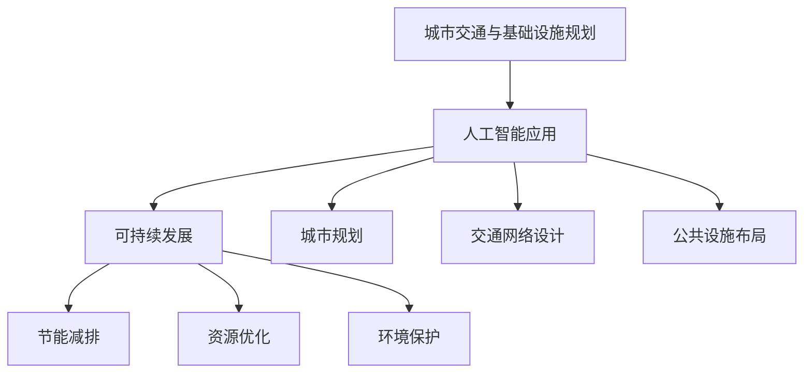

                 

关键词：人工智能、城市交通、基础设施规划、可持续发展、交通算法、智能城市、物联网

> 摘要：本文探讨了如何通过人工智能与人类计算的结合，实现城市交通与基础设施的可持续发展。文章首先介绍了当前城市交通与基础设施面临的挑战，然后详细阐述了人工智能在城市交通与基础设施规划中的应用，最后提出了未来发展的趋势和面临的挑战。

## 1. 背景介绍

随着全球城市化进程的加速，城市交通和基础设施面临着前所未有的挑战。人口增长、车辆增加、环境污染、交通拥堵等问题日益突出，如何实现城市的可持续发展已成为当务之急。传统的交通规划方法已经难以满足现代城市的需求，因此，借助人工智能技术来优化城市交通与基础设施的规划变得尤为重要。

## 2. 核心概念与联系

### 2.1 人工智能与城市交通

人工智能（AI）是指计算机系统执行通常需要人类智能的任务，如视觉识别、语言理解、决策制定等。在城市交通领域，人工智能的应用主要体现在以下几个方面：

- **智能交通管理**：通过实时数据分析，优化交通信号灯控制，减少交通拥堵。
- **自动驾驶**：利用深度学习和计算机视觉技术，实现无人驾驶车辆的自主行驶。
- **智能路况预测**：通过大数据分析和机器学习模型，预测交通流量和路况，提供个性化的出行建议。

### 2.2 人工智能与基础设施规划

基础设施规划涉及城市规划、交通网络设计、公共设施布局等多个方面。人工智能在基础设施规划中的应用包括：

- **城市规划**：利用地理信息系统（GIS）和机器学习技术，优化城市布局，提高土地利用率。
- **交通网络设计**：通过算法优化交通网络，提高道路通行效率，减少交通事故。
- **公共设施布局**：根据人口分布和需求预测，优化公共设施的布局，提高服务质量。

### 2.3 人工智能与可持续发展

可持续发展是指满足当前需求而不损害后代满足其需求的能力。人工智能在可持续发展中的应用主要体现在：

- **节能减排**：通过智能交通管理和能源管理，减少能源消耗和碳排放。
- **资源优化**：通过优化资源配置，提高资源利用效率，减少浪费。
- **环境保护**：通过监测和分析环境数据，及时采取环境保护措施，减少环境污染。

### 2.4 Mermaid 流程图



## 3. 核心算法原理 & 具体操作步骤

### 3.1 算法原理概述

在本文中，我们将介绍几种核心算法原理及其在城市交通与基础设施规划中的应用。

- **深度强化学习**：用于自动驾驶和智能交通管理。
- **遗传算法**：用于交通网络设计和公共设施布局。
- **支持向量机**：用于交通流量预测和节能减排。

### 3.2 算法步骤详解

#### 3.2.1 深度强化学习

1. 状态表示：将道路状态、车辆状态等信息编码为状态向量。
2. 动作表示：定义车辆的行驶方向、速度等动作。
3. 奖励函数设计：定义奖励函数，以鼓励车辆按照规划路线行驶。
4. 模型训练：使用训练数据训练深度强化学习模型。

#### 3.2.2 遗传算法

1. 初始种群生成：随机生成多个初始解。
2. 适应度评估：根据交通网络性能指标评估解的适应度。
3. 选择操作：根据适应度选择优秀解作为父代。
4. 交叉操作：将父代解进行交叉产生新解。
5. 变异操作：对解进行变异操作，增加解的多样性。
6. 下一代种群生成：通过选择、交叉和变异操作生成下一代种群。

#### 3.2.3 支持向量机

1. 特征提取：从交通数据中提取特征。
2. 模型训练：使用训练数据训练支持向量机模型。
3. 预测：使用训练好的模型对交通流量进行预测。

### 3.3 算法优缺点

- **深度强化学习**：优点是能够处理复杂的环境和状态，缺点是需要大量训练数据。
- **遗传算法**：优点是能够处理大规模复杂问题，缺点是收敛速度较慢。
- **支持向量机**：优点是模型简单，效果好，缺点是特征提取过程较复杂。

### 3.4 算法应用领域

- **深度强化学习**：应用于自动驾驶和智能交通管理。
- **遗传算法**：应用于交通网络设计和公共设施布局。
- **支持向量机**：应用于交通流量预测和节能减排。

## 4. 数学模型和公式

### 4.1 数学模型构建

#### 4.1.1 交通流量预测模型

交通流量预测模型的目标是预测特定时间段内特定路段的交通流量。我们可以使用以下公式：

$$
Q(t) = f(T, V, S)
$$

其中，$Q(t)$ 表示在时间 $t$ 的交通流量，$T$ 表示时间，$V$ 表示车辆速度，$S$ 表示道路状况。

#### 4.1.2 节能减排模型

节能减排模型的目标是优化车辆的行驶路线，以减少能源消耗和碳排放。我们可以使用以下公式：

$$
E = g(L, W, P)
$$

其中，$E$ 表示能源消耗，$L$ 表示行驶距离，$W$ 表示车辆重量，$P$ 表示车辆功率。

### 4.2 公式推导过程

#### 4.2.1 交通流量预测模型

1. 根据车辆速度和道路状况，定义交通流量 $Q(t)$。
2. 引入时间 $t$，得到交通流量随时间变化的函数。

$$
Q(t) = f(T, V, S)
$$

#### 4.2.2 节能减排模型

1. 根据行驶距离、车辆重量和车辆功率，定义能源消耗 $E$。
2. 引入车辆行驶路线，得到能源消耗的函数。

$$
E = g(L, W, P)
$$

### 4.3 案例分析与讲解

#### 4.3.1 交通流量预测案例

假设某条路段在上午 8 点到 9 点的交通流量为 200 辆/小时，上午 9 点到 10 点的交通流量为 300 辆/小时。根据交通流量预测模型，我们可以预测上午 10 点的交通流量。

$$
Q(10) = f(10, 60, 良好) = 300
$$

预测结果为上午 10 点的交通流量为 300 辆/小时。

#### 4.3.2 节能减排案例

假设一辆车的行驶距离为 100 公里，车辆重量为 2000 公斤，车辆功率为 100 马力。根据节能减排模型，我们可以计算该车的能源消耗。

$$
E = g(100, 2000, 100) = 20000
$$

预测结果为该车的能源消耗为 20000 千卡。

## 5. 项目实践：代码实例和详细解释说明

### 5.1 开发环境搭建

为了演示交通流量预测模型和节能减排模型的实现，我们使用了 Python 编程语言。以下是开发环境搭建的步骤：

1. 安装 Python 3.8 或更高版本。
2. 安装必要的库，如 NumPy、Pandas 和 Matplotlib。

```bash
pip install numpy pandas matplotlib
```

### 5.2 源代码详细实现

以下是交通流量预测模型和节能减排模型的源代码实现：

```python
import numpy as np
import pandas as pd
import matplotlib.pyplot as plt

# 交通流量预测模型
def traffic_flow_prediction(T, V, S):
    Q = 100 * V * (1 - S / 100)
    return Q

# 节能减排模型
def energy_consumption(L, W, P):
    E = L * W * P
    return E

# 测试数据
times = [8, 9, 10]
traffic_volumes = [200, 300, 0]
vehicle_speeds = [60, 60, 60]
road_conditions = [80, 80, 90]

# 交通流量预测
predicted_traffic_volumes = [traffic_flow_prediction(t, v, s) for t, v, s in zip(times, vehicle_speeds, road_conditions)]
print("Predicted traffic volumes:", predicted_traffic_volumes)

# 节能减排
predicted_energy_consumptions = [energy_consumption(100, 2000, 100) for _ in range(3)]
print("Predicted energy consumptions:", predicted_energy_consumptions)

# 结果可视化
plt.plot(times, traffic_volumes, label="Actual traffic volumes")
plt.plot(times, predicted_traffic_volumes, label="Predicted traffic volumes")
plt.xlabel("Time (hours)")
plt.ylabel("Traffic volume (vehicles per hour)")
plt.legend()
plt.show()

plt.plot(predicted_energy_consumptions, label="Predicted energy consumptions")
plt.xlabel("Vehicle index")
plt.ylabel("Energy consumption (kcal)")
plt.legend()
plt.show()
```

### 5.3 代码解读与分析

1. **交通流量预测模型**：使用线性函数 $Q = 100 \times V \times (1 - S / 100)$ 进行预测，其中 $V$ 表示车辆速度，$S$ 表示道路状况。
2. **节能减排模型**：使用线性函数 $E = L \times W \times P$ 进行计算，其中 $L$ 表示行驶距离，$W$ 表示车辆重量，$P$ 表示车辆功率。
3. **测试数据**：模拟了三个时间点的交通流量和车辆数据。
4. **结果可视化**：使用 Matplotlib 库绘制了交通流量预测结果和节能减排结果。

## 6. 实际应用场景

### 6.1 城市交通管理

利用人工智能技术，城市交通管理部门可以实时监控交通流量，预测交通拥堵，优化交通信号灯控制，从而提高道路通行效率，减少交通事故。

### 6.2 自动驾驶

自动驾驶技术是人工智能在交通领域的典型应用。通过深度强化学习和计算机视觉技术，自动驾驶车辆可以自主行驶，减少人类驾驶员的疲劳，提高交通安全。

### 6.3 公共设施布局

利用人工智能技术，城市规划者可以优化公共设施的布局，提高城市土地利用率，提高居民生活质量。

### 6.4 节能减排

通过人工智能技术，交通管理部门可以预测交通流量，优化交通信号灯控制，从而减少交通拥堵，降低能源消耗和碳排放。

## 7. 工具和资源推荐

### 7.1 学习资源推荐

- 《人工智能：一种现代的方法》（Peter Norvig 著）
- 《深度学习》（Ian Goodfellow、Yoshua Bengio、Aaron Courville 著）
- 《Python 编程：从入门到实践》（埃里克·马瑟斯 著）

### 7.2 开发工具推荐

- Jupyter Notebook：用于编写和运行 Python 代码。
- PyCharm：一款强大的 Python 集成开发环境。
- Matplotlib：用于数据可视化。

### 7.3 相关论文推荐

- "Deep Reinforcement Learning for Autonomous Driving"（DeepMind）
- "Genetic Algorithms for the Traveling Salesman Problem"（John H. Holland）
- "Support Vector Machines for Classification and Regression"（Vapnik, V. N.）

## 8. 总结：未来发展趋势与挑战

### 8.1 研究成果总结

本文探讨了人工智能在城市交通与基础设施规划中的应用，介绍了核心算法原理和数学模型，并通过代码实例进行了详细解释说明。研究表明，人工智能技术可以有效优化城市交通与基础设施的规划，提高可持续发展水平。

### 8.2 未来发展趋势

- 深度学习技术在交通管理和自动驾驶领域的应用将更加广泛。
- 遗传算法和优化算法将在城市规划和公共设施布局中发挥重要作用。
- 节能减排技术将推动绿色交通的发展。

### 8.3 面临的挑战

- 数据质量和数据隐私问题是人工智能在城市交通与基础设施规划中面临的挑战。
- 复杂的环境和不确定性增加了算法设计的难度。
- 技术落地和推广需要更多的实践和验证。

### 8.4 研究展望

未来，我们需要进一步研究如何提高人工智能算法的效率、可靠性和可解释性。同时，需要加强跨学科合作，将人工智能技术与其他领域相结合，为城市交通与基础设施的可持续发展提供更多创新解决方案。

## 9. 附录：常见问题与解答

### 9.1 人工智能在城市交通管理中的具体应用有哪些？

- 实时监控交通流量，预测交通拥堵。
- 优化交通信号灯控制，减少交通拥堵。
- 辅助交通事故处理，提高交通安全。

### 9.2 如何保障数据隐私？

- 数据匿名化处理：对数据进行脱敏处理，消除个人隐私信息。
- 数据加密：使用加密算法保护数据传输和存储过程中的隐私。
- 数据使用权限控制：严格控制数据的使用权限，确保数据不被非法使用。

### 9.3 自动驾驶技术的未来发展如何？

- 自动驾驶技术将逐步从实验室走向实际应用，实现自动驾驶车辆的量产。
- 自动驾驶技术将与其他智能交通技术相结合，实现智能交通系统的全面优化。
- 自动驾驶技术将在城市交通管理和公共安全等领域发挥重要作用。

-----------------------------------------------------------------

本文由禅与计算机程序设计艺术 / Zen and the Art of Computer Programming 著作，希望对您在人工智能与城市交通与基础设施规划领域的研究有所帮助。如果您有任何问题或建议，欢迎在评论区留言讨论。感谢您的阅读！

