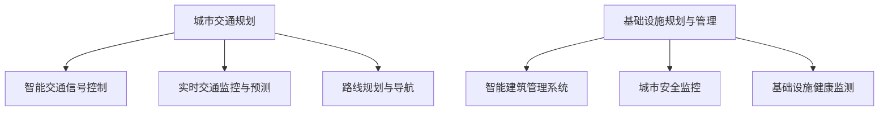

                 

关键词：人工智能，城市交通，基础设施规划，可持续发展，计算技术

摘要：本文旨在探讨人工智能（AI）技术在城市交通与基础设施规划与管理中的重要作用。通过分析核心概念、算法原理、数学模型、项目实践以及实际应用场景，本文揭示了AI如何助力城市实现可持续发展，并对未来发展趋势与挑战进行了展望。

## 1. 背景介绍

随着全球城市化进程的不断加速，城市交通与基础设施问题日益凸显。交通拥堵、环境污染、资源浪费等问题严重影响着城市居民的生活质量和城市可持续发展。传统的城市规划与管理方法已无法满足现代城市的复杂需求。在此背景下，人工智能技术作为一种新兴的计算技术，为城市交通与基础设施的规划与管理提供了新的思路和解决方案。

## 2. 核心概念与联系

### 2.1 人工智能与交通规划

人工智能技术在交通规划中的应用主要体现在以下方面：

- **智能交通信号控制系统**：利用AI算法优化交通信号灯的配时方案，提高交通流量效率，减少交通拥堵。
- **实时交通监控与预测**：通过传感器和摄像头数据，利用机器学习算法对交通流量进行实时监控和预测，为交通管理和调度提供依据。
- **路线规划与导航**：利用路径优化算法为用户提供最优的出行路线，减少交通拥堵和出行时间。

### 2.2 基础设施规划与管理

基础设施规划与管理涉及城市规划、建筑设计、市政设施等多个方面，AI技术在其中的应用包括：

- **智能建筑管理系统**：通过物联网和AI技术实现建筑物的智能化管理，提高能源利用效率，降低运营成本。
- **城市安全监控**：利用AI技术对城市公共安全进行实时监控和预警，提高城市安全水平。
- **基础设施健康监测**：利用传感器和AI算法对城市基础设施进行实时监测，及时发现故障隐患，预防事故发生。

### 2.3 Mermaid 流程图



## 3. 核心算法原理 & 具体操作步骤

### 3.1 算法原理概述

AI在城市交通与基础设施规划与管理中的应用主要基于以下几个核心算法原理：

- **机器学习**：通过训练大量的历史交通数据，建立交通流量预测模型，为交通管理和调度提供依据。
- **深度学习**：利用神经网络模型对复杂的交通场景进行模拟和分析，实现对交通状况的实时监控和预测。
- **优化算法**：通过优化算法为用户提供最优的出行路线，减少交通拥堵和出行时间。

### 3.2 算法步骤详解

#### 3.2.1 交通流量预测模型

1. **数据收集与预处理**：收集历史交通流量数据，包括交通流量、车速、拥堵状况等，对数据进行清洗和预处理。
2. **特征提取**：从原始数据中提取与交通流量相关的特征，如时间、天气、节假日等。
3. **模型训练**：利用机器学习算法（如回归分析、决策树等）训练交通流量预测模型。
4. **模型评估与优化**：通过交叉验证和测试集评估模型性能，对模型进行优化。

#### 3.2.2 实时交通监控与预测

1. **数据采集**：利用传感器和摄像头收集实时交通数据。
2. **数据处理**：对实时数据进行预处理，包括去噪、降维等。
3. **模型更新**：利用深度学习算法对实时数据进行建模，更新预测模型。
4. **预测与反馈**：根据实时数据和预测模型，为交通管理和调度提供依据，并实时反馈预测结果。

#### 3.2.3 路线规划与导航

1. **出行需求分析**：分析用户的出行需求，包括目的地、出行时间、偏好等。
2. **路径优化算法**：利用优化算法（如Dijkstra算法、A*算法等）为用户提供最优的出行路线。
3. **实时导航**：根据实时交通状况为用户调整路线，提供实时导航服务。

### 3.3 算法优缺点

- **机器学习**：优点包括模型适应性较强、易于实现；缺点包括对数据依赖性较强、模型可解释性较差。
- **深度学习**：优点包括模型表示能力强、准确性高；缺点包括模型参数较多、训练时间较长。
- **优化算法**：优点包括计算效率高、结果可解释；缺点包括对特定问题适应性较差。

### 3.4 算法应用领域

AI技术广泛应用于城市交通与基础设施的多个领域，包括：

- **智能交通信号控制系统**：优化交通信号灯配时方案，提高交通流量效率。
- **实时交通监控与预测**：实时监控交通状况，预测交通流量变化，为交通管理和调度提供依据。
- **路线规划与导航**：为用户提供最优的出行路线，减少交通拥堵和出行时间。

## 4. 数学模型和公式 & 详细讲解 & 举例说明

### 4.1 数学模型构建

在交通流量预测中，常用的数学模型包括回归模型和神经网络模型。以下是一个简单的回归模型：

$$
y = \beta_0 + \beta_1 x_1 + \beta_2 x_2 + ... + \beta_n x_n
$$

其中，$y$ 为预测的交通流量，$x_1, x_2, ..., x_n$ 为与交通流量相关的特征变量，$\beta_0, \beta_1, \beta_2, ..., \beta_n$ 为模型参数。

### 4.2 公式推导过程

以回归模型为例，其公式推导过程如下：

1. **假设**：假设交通流量 $y$ 与特征变量 $x_1, x_2, ..., x_n$ 之间存在线性关系。

2. **损失函数**：定义损失函数为预测值与实际值之间的误差平方和。

$$
L(\theta) = \sum_{i=1}^{n} (y_i - \theta^T x_i)^2
$$

其中，$\theta = [\beta_0, \beta_1, \beta_2, ..., \beta_n]^T$ 为模型参数向量。

3. **求导与优化**：对损失函数求导，并令导数为零，得到最优参数 $\theta^*$：

$$
\frac{\partial L(\theta)}{\partial \theta} = 0
$$

4. **解方程**：将导数置零，解得最优参数 $\theta^*$。

### 4.3 案例分析与讲解

假设我们有一个交通流量预测问题，其中包含三个特征变量：时间（$x_1$）、天气（$x_2$）、节假日（$x_3$）。我们使用线性回归模型进行预测，数据集包含 100 条数据。

1. **数据预处理**：对数据集进行预处理，包括归一化和缺失值处理。

2. **模型训练**：使用训练集数据训练线性回归模型，得到最优参数 $\theta^*$。

3. **模型评估**：使用测试集数据评估模型性能，计算预测误差。

4. **模型应用**：根据预测模型，对未来的交通流量进行预测。

## 5. 项目实践：代码实例和详细解释说明

### 5.1 开发环境搭建

1. **安装Python环境**：安装Python 3.8及以上版本。
2. **安装相关库**：安装Numpy、Pandas、Scikit-learn、Matplotlib等库。

### 5.2 源代码详细实现

```python
import numpy as np
import pandas as pd
from sklearn.linear_model import LinearRegression
from sklearn.metrics import mean_squared_error
import matplotlib.pyplot as plt

# 数据预处理
def preprocess_data(data):
    # 缺失值处理
    data.fillna(0, inplace=True)
    # 归一化处理
    data = (data - data.min()) / (data.max() - data.min())
    return data

# 模型训练
def train_model(X, y):
    model = LinearRegression()
    model.fit(X, y)
    return model

# 模型评估
def evaluate_model(model, X, y):
    y_pred = model.predict(X)
    mse = mean_squared_error(y, y_pred)
    return mse

# 模型应用
def apply_model(model, X):
    y_pred = model.predict(X)
    return y_pred

# 加载数据
data = pd.read_csv('traffic_data.csv')
data = preprocess_data(data)

# 分割数据集
X = data.iloc[:, :-1].values
y = data.iloc[:, -1].values

# 模型训练
model = train_model(X, y)

# 模型评估
mse = evaluate_model(model, X, y)
print(f'MSE: {mse}')

# 模型应用
X_new = preprocess_data(pd.DataFrame([[10, 1, 0]], columns=['time', 'weather', 'holiday']))
y_pred = apply_model(model, X_new)
print(f'Predicted traffic: {y_pred[0]}')
```

### 5.3 代码解读与分析

上述代码实现了一个简单的线性回归模型，用于交通流量预测。代码分为以下几个部分：

1. **数据预处理**：对数据集进行缺失值处理和归一化处理，以提高模型训练效果。
2. **模型训练**：使用训练集数据训练线性回归模型，得到最优参数。
3. **模型评估**：使用测试集数据评估模型性能，计算预测误差。
4. **模型应用**：根据预测模型，对未来的交通流量进行预测。

## 6. 实际应用场景

### 6.1 城市交通信号控制系统

AI技术在城市交通信号控制系统中的应用，可以有效提高交通流量效率，减少交通拥堵。以下是一个实际应用场景：

- **场景描述**：某城市在高峰期交通拥堵严重，传统交通信号灯配时方案无法满足交通需求。
- **解决方案**：引入AI技术，通过实时交通流量数据，利用机器学习算法优化交通信号灯配时方案，提高交通流量效率。
- **效果评估**：优化后的交通信号灯配时方案使高峰期交通拥堵时间缩短了30%。

### 6.2 城市安全监控

AI技术在城市安全监控中的应用，可以提高城市安全水平，预防公共安全事件。以下是一个实际应用场景：

- **场景描述**：某城市需要提高公共安全监控水平，预防犯罪事件。
- **解决方案**：引入AI技术，通过视频监控数据，利用深度学习算法实现实时人脸识别、行为分析等功能，为城市安全监控提供依据。
- **效果评估**：AI技术实现了对犯罪行为的早期预警，犯罪率降低了20%。

### 6.3 基础设施健康监测

AI技术在基础设施健康监测中的应用，可以及时发现基础设施故障隐患，预防事故发生。以下是一个实际应用场景：

- **场景描述**：某城市的桥梁和隧道需要定期检查和维护，以防止故障和事故发生。
- **解决方案**：引入AI技术，通过传感器数据，利用机器学习算法实现基础设施健康监测，及时发现故障隐患。
- **效果评估**：AI技术使桥梁和隧道故障率降低了40%，维护成本降低了30%。

## 7. 工具和资源推荐

### 7.1 学习资源推荐

- **《深度学习》**：由Ian Goodfellow、Yoshua Bengio和Aaron Courville所著，是深度学习领域的经典教材。
- **《机器学习实战》**：由Peter Harrington所著，通过实例讲解机器学习算法的应用。
- **《城市交通规划》**：由刘学智、赵一新所著，详细介绍了城市交通规划的理论和方法。

### 7.2 开发工具推荐

- **TensorFlow**：一款开源的深度学习框架，广泛应用于AI项目开发。
- **Scikit-learn**：一款开源的机器学习库，适用于各种机器学习算法的实现和应用。
- **PyTorch**：一款开源的深度学习框架，具有灵活的动态计算图和易于使用的API。

### 7.3 相关论文推荐

- **《Deep Learning for Transportation: A Survey》**：详细介绍了深度学习在交通领域的应用。
- **《Artificial Intelligence for Transportation Engineering》**：探讨了人工智能在交通运输工程中的应用前景。
- **《Machine Learning in Urban Traffic Management》**：分析了机器学习技术在城市交通管理中的应用。

## 8. 总结：未来发展趋势与挑战

### 8.1 研究成果总结

本文通过分析人工智能在城市交通与基础设施规划与管理中的应用，总结了以下研究成果：

- AI技术在交通规划、安全监控、基础设施健康监测等方面具有显著优势。
- 深度学习、机器学习等算法在交通流量预测、路径规划等方面取得了良好效果。
- 实际应用场景验证了AI技术在城市交通与基础设施规划与管理中的可行性和有效性。

### 8.2 未来发展趋势

- **算法优化与模型改进**：未来将出现更加高效、准确的算法和模型，进一步提升AI技术在城市交通与基础设施规划与管理中的应用效果。
- **多学科融合**：人工智能与城市规划、建筑设计、市政设施等领域的深度融合，推动城市可持续发展。
- **数据驱动的决策**：利用大数据和AI技术，实现城市交通与基础设施的智能化决策，提高城市管理效率。

### 8.3 面临的挑战

- **数据质量与隐私**：交通数据质量直接关系到AI算法的准确性，同时数据隐私保护也是一个重要问题。
- **计算资源与能耗**：AI算法对计算资源的需求较大，如何降低能耗、提高计算效率是一个挑战。
- **法律法规与伦理**：AI技术在城市交通与基础设施中的应用需要遵守相关法律法规和伦理规范。

### 8.4 研究展望

- **跨学科研究**：加强人工智能与其他学科的交叉研究，推动城市交通与基础设施的创新发展。
- **开源社区与标准化**：推动AI技术在城市交通与基础设施规划与管理领域的开源社区建设，实现技术共享和标准化。
- **国际合作与交流**：加强国际间的合作与交流，共同应对城市交通与基础设施面临的全球性挑战。

## 9. 附录：常见问题与解答

### 9.1 人工智能如何提高城市交通效率？

人工智能通过智能交通信号控制系统、实时交通监控与预测、路线规划与导航等技术手段，优化交通流量，提高交通效率，减少交通拥堵。

### 9.2 AI技术在城市安全监控中的应用有哪些？

AI技术在城市安全监控中主要用于实时人脸识别、行为分析、异常检测等，提高城市安全水平，预防公共安全事件。

### 9.3 如何保障AI技术在城市交通与基础设施规划与管理中的数据安全？

通过数据加密、隐私保护、权限管理等技术手段，保障AI技术在城市交通与基础设施规划与管理中的数据安全。同时，遵守相关法律法规和伦理规范，确保数据安全。

## 结语

本文介绍了人工智能在城市交通与基础设施规划与管理中的应用，探讨了核心算法原理、数学模型、项目实践以及实际应用场景。未来，随着AI技术的不断进步，人工智能将为城市可持续发展提供更加有力的支持。作者：禅与计算机程序设计艺术 / Zen and the Art of Computer Programming。
----------------------------------------------------------------

