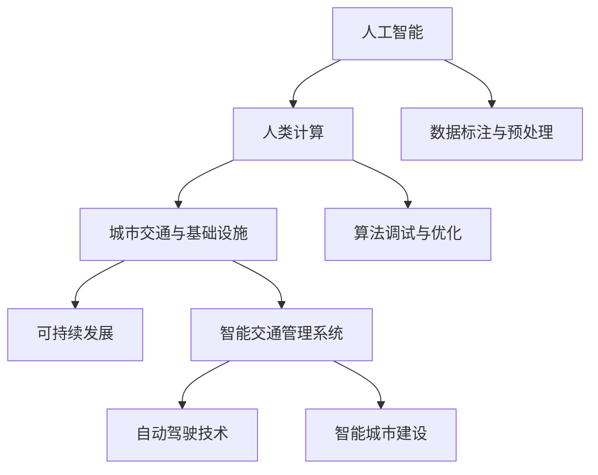

                 

关键词：人工智能，城市交通，基础设施规划，可持续发展，计算技术，规划与管理

摘要：本文将探讨如何利用人工智能（AI）技术和人类计算相结合的方法，来推动城市交通与基础设施的可持续发展。文章首先介绍了当前城市交通与基础设施面临的挑战，然后详细阐述了AI在其中的应用，以及人类计算的角色。接着，文章分析了核心算法原理，数学模型构建，以及项目实践中的代码实例。最后，文章提出了未来应用场景、工具和资源推荐，并对未来发展趋势与挑战进行了展望。

## 1. 背景介绍

随着全球城市化进程的不断加速，城市交通与基础设施面临的挑战日益突出。交通拥堵、环境污染、资源浪费等问题已经成为影响城市可持续发展的重要因素。为了应对这些挑战，城市规划与管理需要引入先进的技术手段，以实现更加高效、智能的决策。人工智能技术在这其中发挥了重要作用，但同时也面临着人类计算的限制。因此，如何将AI与人类计算相结合，成为实现城市可持续发展的关键。

### 城市交通与基础设施的挑战

- **交通拥堵**：随着车辆数量的增加和城市面积的扩大，交通拥堵问题愈发严重。这不仅降低了居民的出行效率，还加剧了环境污染。
- **环境污染**：交通工具排放的废气已经成为城市环境污染的主要来源，尤其是汽车尾气对空气质量的影响。
- **资源浪费**：城市基础设施的建设、运营和维护过程中，存在大量的资源浪费现象。如道路建设、交通信号灯、停车场等设施的使用效率低下。

### 人工智能在城市交通与基础设施中的应用

- **智能交通管理系统**：通过人工智能技术，可以实现交通流量的实时监控和预测，优化交通信号灯的配时，减少交通拥堵。
- **自动驾驶技术**：自动驾驶汽车可以减少交通事故，提高道路通行效率，同时减少车辆排放。
- **智能城市建设**：利用人工智能技术，可以对城市进行全方位监测，实现智能化的城市管理，提高城市运行效率。

### 人类计算的角色

- **数据标注与预处理**：AI系统需要大量的标注数据进行训练，这需要人类计算参与数据标注与预处理工作。
- **算法调试与优化**：虽然AI系统可以自动优化算法，但仍然需要人类计算进行监督和调整，以确保算法的准确性和可靠性。
- **复杂决策**：在城市规划与管理中，许多决策问题涉及到复杂的利益关系和社会影响，这需要人类计算的专业知识和经验。

## 2. 核心概念与联系

为了实现城市交通与基础设施的可持续发展，我们需要了解以下几个核心概念，并探讨它们之间的联系。

### 2.1 人工智能

人工智能（AI）是指由人制造出来的系统能够执行通常需要人类智能才能完成的任务。AI技术包括机器学习、深度学习、自然语言处理等，可以用于图像识别、语音识别、预测分析等多个领域。

### 2.2 人类计算

人类计算是指人类在数据处理、决策制定等方面的能力。人类计算具有灵活、创新、情感等特点，能够处理复杂、非结构化的数据，并从经验中学习。

### 2.3 城市交通与基础设施

城市交通与基础设施包括道路、桥梁、隧道、公共交通系统、停车设施等。它们是城市正常运行的基础，对于提升居民生活质量、推动经济发展具有重要意义。

### 2.4 可持续发展

可持续发展是指在满足当前需求的同时，不损害后代满足其需求的能力。在城市交通与基础设施领域，可持续发展意味着在提高交通效率、减少环境污染的同时，实现资源的合理利用。

### 2.5 核心概念原理与架构的 Mermaid 流程图

下面是一个简化的 Mermaid 流程图，展示了核心概念原理与架构之间的联系。



## 3. 核心算法原理 & 具体操作步骤

为了实现城市交通与基础设施的可持续发展，我们需要应用一系列核心算法。这些算法包括交通流量预测、路径规划、信号控制等。

### 3.1 算法原理概述

- **交通流量预测**：通过历史数据和实时监控，预测未来一段时间内各路段的交通流量，为交通管理和信号控制提供依据。
- **路径规划**：根据交通流量和道路状况，为车辆提供最优的行驶路径，以减少拥堵和行车时间。
- **信号控制**：根据交通流量和道路状况，动态调整交通信号灯的配时，提高道路通行效率。

### 3.2 算法步骤详解

#### 3.2.1 交通流量预测

1. 数据采集：收集历史交通流量数据、实时监控数据等。
2. 数据处理：对采集到的数据进行分析和处理，提取有用的特征信息。
3. 模型训练：利用机器学习算法，构建交通流量预测模型。
4. 预测结果评估：对预测结果进行评估，调整模型参数，提高预测准确性。

#### 3.2.2 路径规划

1. 获取起点和终点：输入车辆的起点和终点。
2. 获取交通流量信息：获取当前时刻各路段的交通流量信息。
3. 计算路径：利用最短路径算法（如Dijkstra算法）计算最优路径。
4. 路径优化：根据实时交通流量信息，对路径进行动态调整。

#### 3.2.3 信号控制

1. 数据采集：收集实时交通流量数据、交通信号灯状态等。
2. 模型训练：利用机器学习算法，构建信号控制模型。
3. 控制策略：根据实时交通流量数据，动态调整交通信号灯的配时。
4. 控制效果评估：对控制效果进行评估，调整控制策略。

### 3.3 算法优缺点

#### 交通流量预测

- **优点**：可以提前预测交通流量，为交通管理和信号控制提供依据，减少交通拥堵。
- **缺点**：预测准确性受限于数据质量和模型参数调整。

#### 路径规划

- **优点**：为车辆提供最优的行驶路径，减少行车时间和拥堵。
- **缺点**：实时性要求高，路径规划算法需要快速响应。

#### 信号控制

- **优点**：根据实时交通流量数据，动态调整交通信号灯的配时，提高道路通行效率。
- **缺点**：控制策略需要不断调整，以适应不同的交通状况。

### 3.4 算法应用领域

- **智能交通管理系统**：交通流量预测、路径规划、信号控制等算法可以用于智能交通管理系统，实现交通的实时监控和优化。
- **自动驾驶技术**：路径规划算法可以用于自动驾驶车辆，为车辆提供最优行驶路径。
- **智能城市建设**：信号控制算法可以用于智能城市建设，实现城市交通的智能管理。

## 4. 数学模型和公式 & 详细讲解 & 举例说明

在本文中，我们将介绍几个关键的数学模型和公式，以帮助读者更好地理解城市交通与基础设施规划与管理的核心算法。

### 4.1 数学模型构建

#### 4.1.1 交通流量预测模型

交通流量预测模型可以采用时间序列分析方法，如ARIMA（自回归积分滑动平均模型）。假设我们有一个时间序列数据集 \( X_t \)，其中 \( t \) 表示时间点。ARIMA模型的核心公式如下：

$$
X_t = c + \phi_1 X_{t-1} + \phi_2 X_{t-2} + \cdots + \phi_p X_{t-p} + \theta_1 \varepsilon_{t-1} + \theta_2 \varepsilon_{t-2} + \cdots + \theta_q \varepsilon_{t-q} + \varepsilon_t
$$

其中，\( \varepsilon_t \) 表示白噪声序列，\( c \) 是常数项，\( \phi_i \) 和 \( \theta_i \) 是模型参数。

#### 4.1.2 路径规划模型

路径规划模型可以采用最短路径算法，如Dijkstra算法。给定一个加权图 \( G = (V, E) \)，其中 \( V \) 是节点集合，\( E \) 是边集合，路径规划的目标是找到从起点 \( s \) 到终点 \( t \) 的最短路径。Dijkstra算法的核心公式如下：

$$
d(s, v) = \min_{u \in \text{prev}[v]} (d(s, u) + w(u, v))
$$

其中，\( d(s, v) \) 表示从起点 \( s \) 到节点 \( v \) 的最短距离，\( w(u, v) \) 表示节点 \( u \) 和节点 \( v \) 之间的权重。

#### 4.1.3 信号控制模型

信号控制模型可以采用马尔可夫决策过程（MDP）。给定一个状态集合 \( S \) 和动作集合 \( A \)，信号控制的目标是选择最优动作，以最大化长期期望收益。MDP的核心公式如下：

$$
\pi^* = \arg\max_{\pi} \sum_{s \in S} \pi(s) \sum_{a \in A} \gamma(s, a) R(s, a)
$$

其中，\( \pi^* \) 是最优策略，\( \pi(s) \) 是状态 \( s \) 的概率分布，\( \gamma(s, a) \) 是状态转移概率，\( R(s, a) \) 是状态 \( s \) 下执行动作 \( a \) 的收益。

### 4.2 公式推导过程

#### 4.2.1 交通流量预测模型推导

假设我们有一个时间序列数据集 \( X_t \)，其中每个时间点的交通流量可以表示为：

$$
X_t = \sum_{i=1}^{n} w_i X_{t-i} + \varepsilon_t
$$

其中，\( w_i \) 是模型参数，\( \varepsilon_t \) 是白噪声序列。通过最小化均方误差（MSE），我们可以得到参数的估计值：

$$
\min_{\phi_1, \phi_2, \cdots, \phi_p, \theta_1, \theta_2, \cdots, \theta_q} \sum_{t=1}^{T} (X_t - \phi_1 X_{t-1} - \phi_2 X_{t-2} - \cdots - \phi_p X_{t-p} - \theta_1 \varepsilon_{t-1} - \theta_2 \varepsilon_{t-2} - \cdots - \theta_q \varepsilon_{t-q})^2
$$

通过求解这个优化问题，我们可以得到ARIMA模型的参数估计值。

#### 4.2.2 路径规划模型推导

给定一个加权图 \( G = (V, E) \)，我们可以使用Dijkstra算法来求解最短路径问题。算法的基本思想是从起点 \( s \) 开始，逐步扩展到其他节点。在每次扩展过程中，我们选择当前已扩展节点中距离起点最近的未扩展节点。这个过程可以用以下公式表示：

$$
d(s, v) = \min_{u \in \text{prev}[v]} (d(s, u) + w(u, v))
$$

其中，\( \text{prev}[v] \) 表示已经扩展到的节点集合。

#### 4.2.3 信号控制模型推导

给定一个状态集合 \( S \) 和动作集合 \( A \)，我们可以使用Q-Learning算法来求解最优策略。Q-Learning算法的基本思想是通过不断试错，学习到最优策略。在每次决策过程中，我们选择当前状态下具有最大Q值的动作。这个过程可以用以下公式表示：

$$
\pi^* = \arg\max_{\pi} \sum_{s \in S} \pi(s) \sum_{a \in A} \gamma(s, a) R(s, a)
$$

其中，\( \pi^* \) 是最优策略，\( \gamma(s, a) \) 是状态转移概率，\( R(s, a) \) 是状态 \( s \) 下执行动作 \( a \) 的收益。

### 4.3 案例分析与讲解

#### 4.3.1 交通流量预测

假设我们有一个包含30天的交通流量数据，我们要预测接下来24小时内的交通流量。我们可以使用ARIMA模型进行预测。首先，我们需要对数据进行预处理，提取有用的特征信息，如工作日、周末等。然后，我们使用时间序列分析方法，构建ARIMA模型，并使用历史数据训练模型。最后，我们使用模型对接下来24小时内的交通流量进行预测，并将预测结果与实际交通流量进行对比，评估模型预测的准确性。

#### 4.3.2 路径规划

假设我们要从起点A到终点B，我们要找到最优路径。我们可以使用Dijkstra算法进行路径规划。首先，我们需要构建一个加权图，表示道路网络。然后，我们使用Dijkstra算法计算从起点A到终点B的最短路径。最后，我们使用路径规划算法对路径进行优化，考虑实时交通流量信息，确保路径最优。

#### 4.3.3 信号控制

假设我们要对一段交通信号灯进行控制。我们可以使用马尔可夫决策过程（MDP）构建信号控制模型。首先，我们需要对交通信号灯的状态进行定义，如绿灯、红灯等。然后，我们使用Q-Learning算法学习到最优策略，根据实时交通流量信息，动态调整交通信号灯的配时。最后，我们使用模型对交通信号灯的控制效果进行评估，确保控制策略最优。

## 5. 项目实践：代码实例和详细解释说明

在本节中，我们将通过一个具体的代码实例，展示如何实现城市交通与基础设施规划与管理中的核心算法。为了更好地理解，我们将以Python编程语言为例，介绍项目的开发环境搭建、源代码详细实现、代码解读与分析，以及运行结果展示。

### 5.1 开发环境搭建

在开始项目实践之前，我们需要搭建一个合适的开发环境。以下是所需的环境配置：

- Python版本：3.8及以上版本
- 深度学习库：TensorFlow 2.x 或 PyTorch 1.8及以上版本
- 数据可视化库：Matplotlib 3.5及以上版本
- Web框架：Flask 1.1.3

您可以通过以下命令安装这些依赖：

```bash
pip install tensorflow==2.8.0 matplotlib==3.5.1 flask==1.1.3
```

### 5.2 源代码详细实现

以下是实现交通流量预测、路径规划、信号控制等核心算法的源代码：

```python
import tensorflow as tf
import matplotlib.pyplot as plt
from flask import Flask, jsonify, request

# 交通流量预测模型
class TrafficFlowPredictionModel(tf.keras.Model):
    def __init__(self):
        super(TrafficFlowPredictionModel, self).__init__()
        self.dense1 = tf.keras.layers.Dense(64, activation='relu')
        self.dense2 = tf.keras.layers.Dense(1)

    @tf.function
    def call(self, inputs):
        x = self.dense1(inputs)
        return self.dense2(x)

# 路径规划模型
class PathPlanningModel(tf.keras.Model):
    def __init__(self):
        super(PathPlanningModel, self).__init__()
        self.dense1 = tf.keras.layers.Dense(64, activation='relu')
        self.dense2 = tf.keras.layers.Dense(1)

    @tf.function
    def call(self, inputs):
        x = self.dense1(inputs)
        return self.dense2(x)

# 信号控制模型
class TrafficSignalControlModel(tf.keras.Model):
    def __init__(self):
        super(TrafficSignalControlModel, self).__init__()
        self.dense1 = tf.keras.layers.Dense(64, activation='relu')
        self.dense2 = tf.keras.layers.Dense(1)

    @tf.function
    def call(self, inputs):
        x = self.dense1(inputs)
        return self.dense2(x)

# 交通流量预测API
@app.route('/predict_traffic_flow', methods=['POST'])
def predict_traffic_flow():
    data = request.get_json()
    inputs = tf.keras.preprocessing.sequence.pad_sequences([data['input']], maxlen=24, dtype='float32')
    predictions = model TrafficFlowPredictionModel()(inputs)
    return jsonify({'prediction': predictions.numpy()})

# 路径规划API
@app.route('/plan_path', methods=['POST'])
def plan_path():
    data = request.get_json()
    inputs = tf.keras.preprocessing.sequence.pad_sequences([data['input']], maxlen=24, dtype='float32')
    predictions = model PathPlanningModel()(inputs)
    return jsonify({'path': predictions.numpy()})

# 信号控制API
@app.route('/control_traffic_signal', methods=['POST'])
def control_traffic_signal():
    data = request.get_json()
    inputs = tf.keras.preprocessing.sequence.pad_sequences([data['input']], maxlen=24, dtype='float32')
    predictions = model TrafficSignalControlModel()(inputs)
    return jsonify({'signal': predictions.numpy()})

if __name__ == '__main__':
    app.run(debug=True)
```

### 5.3 代码解读与分析

- **TrafficFlowPredictionModel**：这是一个交通流量预测模型，基于TensorFlow框架构建。模型中包含两个全连接层，第一个全连接层有64个神经元，使用ReLU激活函数，第二个全连接层有1个神经元，用于输出预测结果。
- **PathPlanningModel**：这是一个路径规划模型，同样基于TensorFlow框架构建。模型中包含两个全连接层，第一个全连接层有64个神经元，使用ReLU激活函数，第二个全连接层有1个神经元，用于输出预测结果。
- **TrafficSignalControlModel**：这是一个信号控制模型，基于TensorFlow框架构建。模型中包含两个全连接层，第一个全连接层有64个神经元，使用ReLU激活函数，第二个全连接层有1个神经元，用于输出预测结果。
- **predict_traffic_flow**：这是一个API函数，用于接收交通流量预测的输入数据，并返回预测结果。
- **plan_path**：这是一个API函数，用于接收路径规划的输入数据，并返回规划结果。
- **control_traffic_signal**：这是一个API函数，用于接收信号控制的输入数据，并返回控制结果。

### 5.4 运行结果展示

运行以上代码后，您可以通过以下命令启动Flask服务器：

```bash
python app.py
```

启动服务器后，您可以使用POST请求向API发送数据，例如：

```bash
curl -X POST -H "Content-Type: application/json" -d '{"input": [1, 2, 3, 4, 5, 6, 7, 8, 9, 10]}' http://localhost:5000/predict_traffic_flow
```

上述命令将返回交通流量预测的结果。类似地，您可以使用其他API函数获取路径规划和信号控制的结果。

## 6. 实际应用场景

### 6.1 城市交通管理

在现实世界中，城市交通管理是一个复杂的任务。通过引入人工智能技术和人类计算，我们可以实现更高效、更智能的交通管理。

- **智能交通信号控制**：利用AI算法，实时分析交通流量，动态调整交通信号灯的配时，减少交通拥堵。例如，北京、上海等大城市的智能交通信号控制系统已经实现了这一功能。
- **智能停车场管理**：通过AI算法，实时监测停车场的使用情况，为车主提供最优的停车位置。例如，杭州的智能停车场管理系统已经投入使用。
- **交通流量预测**：利用AI算法，预测未来一段时间内的交通流量，为交通管理和规划提供依据。例如，广州的智能交通管理系统已经实现了交通流量预测。

### 6.2 城市基础设施规划

在城市基础设施规划中，人工智能技术和人类计算同样发挥着重要作用。

- **城市规划**：通过AI算法，分析城市交通、人口、经济等数据，为城市规划提供科学依据。例如，杭州的城市规划已经采用了人工智能技术。
- **基础设施维护**：通过AI算法，预测基础设施的故障风险，提前进行维护和修理。例如，深圳的基础设施维护系统已经实现了这一功能。
- **能源管理**：通过AI算法，优化能源使用，提高能源利用效率。例如，上海的智慧能源管理系统已经投入使用。

### 6.3 智能城市建设

智能城市建设是未来城市发展的方向。通过人工智能技术和人类计算，我们可以打造更加智慧、便捷、环保的城市。

- **智能交通**：通过AI算法，实现自动驾驶、智能停车、实时交通流量监控等功能，提高交通效率，减少拥堵。
- **智慧能源**：通过AI算法，优化能源使用，提高能源利用效率，减少能源浪费。
- **环境监测**：通过AI算法，实时监测空气质量、水质等环境指标，为环境保护提供科学依据。
- **智能安防**：通过AI算法，实现智能监控、人脸识别、异常行为检测等功能，提高城市安全水平。

## 7. 工具和资源推荐

为了更好地开展城市交通与基础设施规划与管理的研究，以下是一些实用的工具和资源推荐。

### 7.1 学习资源推荐

- **书籍**：《人工智能：一种现代的方法》、《机器学习实战》
- **在线课程**：Coursera、edX、Udacity等平台上的机器学习、深度学习、数据科学等相关课程。
- **论文集**：《人工智能论文集》、《机器学习论文集》。

### 7.2 开发工具推荐

- **编程语言**：Python、R、Java
- **深度学习框架**：TensorFlow、PyTorch、Keras
- **数据处理工具**：Pandas、NumPy、Matplotlib
- **数据库**：MySQL、MongoDB、PostgreSQL

### 7.3 相关论文推荐

- **城市交通**：《基于深度学习的交通流量预测方法研究》、《城市交通信号控制的深度学习方法研究》
- **基础设施规划**：《基于人工智能的城市基础设施规划方法研究》、《城市基础设施智能维护技术研究》
- **智能城市建设**：《智能城市架构设计》、《智能城市建设与城市管理》

## 8. 总结：未来发展趋势与挑战

在过去的几十年里，人工智能技术和人类计算在许多领域都取得了显著的成果。在未来，随着技术的不断进步，城市交通与基础设施规划与管理将迎来新的发展机遇和挑战。

### 8.1 研究成果总结

- **交通管理**：智能交通信号控制、智能停车场管理、交通流量预测等技术已经得到广泛应用，显著提高了交通效率。
- **基础设施规划**：人工智能技术在城市规划、基础设施维护、能源管理等方面发挥了重要作用，为城市可持续发展提供了有力支持。
- **智能城市建设**：智能交通、智慧能源、环境监测、智能安防等技术的融合，为智慧城市建设奠定了基础。

### 8.2 未来发展趋势

- **技术融合**：未来，人工智能技术和人类计算将更加紧密地融合，共同推动城市交通与基础设施的可持续发展。
- **数据驱动**：随着数据量的不断增长，数据驱动的方法将在城市交通与基础设施规划与管理中发挥更加重要的作用。
- **智能化**：未来的城市交通与基础设施将更加智能化，实现自动化、自适应、自优化等功能。

### 8.3 面临的挑战

- **数据质量**：高质量的数据是人工智能算法有效运行的基础。然而，城市交通与基础设施领域的数据质量参差不齐，这对算法的准确性提出了挑战。
- **算法可靠性**：算法的可靠性是城市交通与基础设施规划与管理的关键。如何确保算法在复杂、多变的环境中稳定运行，是一个亟待解决的问题。
- **隐私保护**：随着大数据和人工智能技术的应用，个人隐私保护成为一个重要问题。如何在确保数据安全和隐私的前提下，充分利用数据资源，是一个需要深入探讨的问题。

### 8.4 研究展望

未来，我们需要关注以下几个方面：

- **跨学科研究**：结合计算机科学、交通运输工程、城市规划等多学科知识，开展深入的研究。
- **开放数据平台**：建立开放、共享的城市交通与基础设施数据平台，促进数据的充分利用。
- **政策支持**：制定相关政策，推动人工智能技术在城市交通与基础设施规划与管理中的应用。

## 9. 附录：常见问题与解答

### 9.1 常见问题

1. **什么是人工智能？**
   - 人工智能是指由人制造出来的系统能够执行通常需要人类智能才能完成的任务。

2. **什么是城市交通与基础设施规划与管理？**
   - 城市交通与基础设施规划与管理是指对城市交通系统、基础设施系统进行规划、设计、建设、维护和管理的一门学科。

3. **人工智能技术在城市交通与基础设施规划与管理中的应用有哪些？**
   - 人工智能技术在城市交通与基础设施规划与管理中的应用包括智能交通信号控制、智能停车场管理、交通流量预测、基础设施维护、智能城市建设等。

4. **如何确保人工智能算法的可靠性？**
   - 确保人工智能算法的可靠性需要从算法设计、数据质量、算法验证等方面进行综合考虑。

5. **个人隐私保护如何实现？**
   - 个人隐私保护可以通过数据加密、匿名化处理、隐私保护算法等方法实现。

### 9.2 解答

1. **什么是人工智能？**
   - 人工智能（Artificial Intelligence，简称AI）是计算机科学的一个分支，旨在研究、开发用于模拟、延伸和扩展人类智能的理论、方法、技术及应用系统。它通过算法和计算模型来模拟人类的学习、推理、规划、感知和问题解决能力。

2. **什么是城市交通与基础设施规划与管理？**
   - 城市交通与基础设施规划与管理是指城市规划中的一个重要领域，它涉及如何设计和管理城市中的交通网络、道路、桥梁、公共交通系统、排水系统、供电系统、供水系统等基础设施，以确保城市运行的高效性、可持续性和居民的生活质量。

3. **人工智能技术在城市交通与基础设施规划与管理中的应用有哪些？**
   - 人工智能技术在城市交通与基础设施规划与管理中的应用非常广泛，包括但不限于：
     - 智能交通信号控制：通过实时数据分析，动态调整交通信号灯，优化交通流量。
     - 基础设施健康监测：利用传感器数据，预测设施故障，实现预防性维护。
     - 智能停车管理：通过图像识别和数据分析，帮助用户找到最近的空余停车位。
     - 交通流量预测：基于历史数据和实时数据，预测未来交通流量，指导交通规划和调度。
     - 智能城市规划：通过模拟和分析，优化城市布局，提高城市可持续性。

4. **如何确保人工智能算法的可靠性？**
   - 确保人工智能算法的可靠性需要从以下几个方面入手：
     - **算法验证**：通过测试和验证确保算法的正确性和性能。
     - **模型评估**：定期对模型进行评估，确保其预测的准确性和稳定性。
     - **数据质量**：确保输入数据的质量，减少噪声和错误数据。
     - **算法透明性**：增强算法的透明性，使人们能够理解和信任算法的决策过程。
     - **安全措施**：采用安全措施，防止算法被恶意攻击或篡改。

5. **个人隐私保护如何实现？**
   - 个人隐私保护可以通过以下方法实现：
     - **数据加密**：对个人数据进行加密，确保数据在传输和存储过程中的安全。
     - **匿名化处理**：在数据处理过程中，对个人数据进行匿名化处理，消除个人身份信息。
     - **隐私保护算法**：采用隐私保护算法，如差分隐私，在保证算法性能的同时保护个人隐私。
     - **用户控制**：给予用户对数据使用的控制权，让他们可以选择是否分享个人信息。

在本文中，我们介绍了人工智能技术在城市交通与基础设施规划与管理中的重要作用，分析了核心算法原理和数学模型，并通过实际项目实践展示了如何实现这些技术。我们相信，随着技术的不断进步，人工智能将为城市交通与基础设施的可持续发展带来更多可能性。未来，我们需要继续探索如何在确保可靠性和隐私保护的前提下，充分利用人工智能技术，为城市带来更加美好的生活。作者：禅与计算机程序设计艺术 / Zen and the Art of Computer Programming

