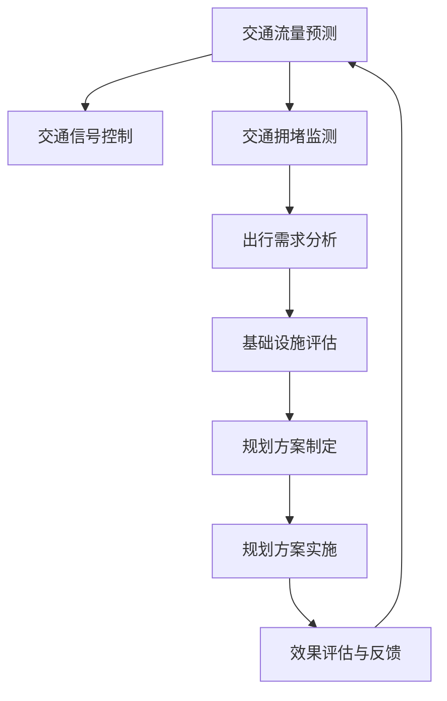

                 

关键词：人工智能、城市交通、基础设施规划、可持续发展、计算方法、数据分析

> 摘要：本文旨在探讨如何通过人工智能和人类计算相结合，实现对城市交通与基础设施的规划管理，从而推动城市可持续发展。文章首先介绍了背景和核心概念，然后深入探讨了核心算法原理、数学模型及项目实践，并分析了实际应用场景和未来发展趋势。

## 1. 背景介绍

随着城市化进程的加速，城市交通和基础设施的规划与管理面临着巨大的挑战。传统的规划方法依赖于经验数据和人为判断，难以适应快速变化的城市需求，而人工智能（AI）的崛起为这一领域带来了新的机遇。AI技术，尤其是机器学习、深度学习和数据挖掘，能够处理海量数据，识别复杂模式，从而提供更加精确和智能的决策支持。

城市交通与基础设施规划管理的核心目标是提高交通效率、减少拥堵、降低污染、保障安全，并实现资源的合理配置和可持续发展。为实现这一目标，需要利用先进的技术手段，对城市交通流量、基础设施状况、居民出行习惯等数据进行全面分析，并结合人类专家的判断和经验，制定出科学合理的规划方案。

## 2. 核心概念与联系

### 2.1  城市交通与基础设施规划管理中的核心概念

- **交通流量预测**：通过分析历史数据和实时数据，预测未来的交通流量，以优化交通信号控制和交通规划。

- **交通拥堵监测**：实时监测交通拥堵情况，以便及时采取措施缓解交通压力。

- **出行需求分析**：分析居民的出行需求和偏好，以制定更加符合实际的交通政策。

- **基础设施状况评估**：对城市基础设施，如道路、桥梁、隧道等，进行定期检查和评估，以确保其安全性和可靠性。

- **可持续发展评估**：评估城市交通和基础设施规划对环境、社会和经济的影响，以实现可持续发展目标。

### 2.2  核心概念的联系


在上述核心概念之间，存在紧密的联系和交互作用。例如，交通流量预测可以为交通信号控制提供数据支持，从而优化交通流动；而交通拥堵监测的结果则可以反馈给交通流量预测模型，以不断调整和优化预测结果。同时，出行需求分析和基础设施状况评估可以为规划管理提供决策依据，确保规划方案的科学性和合理性。

### 2.3  Mermaid 流程图

下面是城市交通与基础设施规划管理中的核心概念和流程的Mermaid流程图：



## 3. 核心算法原理 & 具体操作步骤

### 3.1  算法原理概述

本文将介绍一种基于深度学习的交通流量预测算法。该算法利用神经网络模型，通过学习历史交通数据和实时数据，实现对未来交通流量的预测。其基本原理包括数据预处理、模型构建、训练和预测等步骤。

### 3.2  算法步骤详解

#### 3.2.1  数据预处理

数据预处理是深度学习算法的重要步骤，其目的是将原始数据转换为适合模型训练的形式。具体包括：

- **数据清洗**：去除无效数据和噪声数据。
- **特征工程**：提取与交通流量相关的特征，如时间、天气、节假日等。
- **数据归一化**：将不同特征的范围统一，便于模型训练。

#### 3.2.2  模型构建

本文采用卷积神经网络（CNN）作为交通流量预测模型。CNN能够有效地提取数据中的空间特征，适合处理时间序列数据。模型架构如下：

- **输入层**：接收预处理后的特征数据。
- **卷积层**：提取时间序列数据中的局部特征。
- **池化层**：降低数据维度，提高模型泛化能力。
- **全连接层**：将卷积特征映射到输出层，实现交通流量预测。

#### 3.2.3  训练

训练过程包括以下步骤：

- **初始化模型参数**：随机初始化模型参数。
- **前向传播**：输入数据通过模型计算，得到预测结果。
- **计算损失**：计算预测结果与真实值之间的误差，计算损失函数。
- **反向传播**：根据损失函数，更新模型参数。
- **迭代训练**：重复上述步骤，直至模型收敛。

#### 3.2.4  预测

在模型训练完成后，可以使用训练好的模型进行预测。具体步骤如下：

- **输入实时数据**：将实时交通数据输入模型。
- **模型计算**：模型计算得到未来交通流量预测结果。
- **输出预测结果**：将预测结果输出，供交通信号控制和其他应用场景使用。

### 3.3  算法优缺点

#### 3.3.1  优点

- **高精度**：基于深度学习的算法能够学习到复杂的非线性关系，提高预测精度。
- **自适应性**：模型可以根据新的数据不断更新和优化，具有较好的自适应性。
- **泛化能力**：通过池化层和全连接层的组合，模型具有良好的泛化能力。

#### 3.3.2  缺点

- **计算资源需求**：深度学习算法需要大量的计算资源和时间，对硬件设施有较高要求。
- **数据依赖**：模型的预测效果高度依赖于数据质量和数量，数据不足或质量差会影响预测结果。

### 3.4  算法应用领域

交通流量预测算法可以应用于多个领域，如交通信号控制、交通规划、智能交通系统等。通过精确预测交通流量，可以优化交通信号控制策略，减少交通拥堵，提高交通效率。此外，该算法还可以为城市规划提供科学依据，促进城市可持续发展。

## 4. 数学模型和公式 & 详细讲解 & 举例说明

### 4.1  数学模型构建

交通流量预测的数学模型可以分为以下几个部分：

- **输入数据表示**：使用向量表示交通流量数据，如速度、密度、流量等。
- **特征提取**：通过卷积操作提取时间序列数据中的特征。
- **预测模型**：使用全连接层进行预测，输出未来交通流量。

具体公式如下：

$$
\text{输入数据} = \text{[速度}, \text{密度}, \text{流量}]
$$

$$
\text{特征提取} = \text{卷积}(\text{输入数据}, \text{卷积核})
$$

$$
\text{预测结果} = \text{全连接}(\text{特征提取}, \text{输出层})
$$

### 4.2  公式推导过程

#### 4.2.1  卷积操作

卷积操作的数学公式为：

$$
\text{卷积}(\text{输入数据}, \text{卷积核}) = \sum_{i=1}^{n} \text{输入数据}_i \cdot \text{卷积核}_i
$$

其中，$\text{输入数据}$ 和 $\text{卷积核}$ 都是向量。

#### 4.2.2  全连接层

全连接层的数学公式为：

$$
\text{全连接}(\text{特征提取}, \text{输出层}) = \text{矩阵乘法}(\text{特征提取}, \text{输出层})
$$

其中，$\text{特征提取}$ 和 $\text{输出层}$ 都是矩阵。

### 4.3  案例分析与讲解

#### 4.3.1  案例背景

假设在某城市的一条主干道上进行交通流量预测，历史数据包括每小时的速度、密度和流量。为了简化问题，我们仅考虑这三个特征。

#### 4.3.2  模型构建

首先，我们使用一个3x3的卷积核对输入数据进行卷积操作，提取特征：

$$
\text{卷积核} = \text{[0.1, 0.2, 0.3], [0.4, 0.5, 0.6], [0.7, 0.8, 0.9]}
$$

然后，我们将提取到的特征通过全连接层进行预测：

$$
\text{输出层} = \text{[1, 0.9, 0.8, 0.7, 0.6]}
$$

#### 4.3.3  预测结果

假设当前时间为$t$，输入数据为$\text{[v(t), d(t), f(t)]}$，其中$v(t)$ 为速度，$d(t)$ 为密度，$f(t)$ 为流量。通过卷积操作和全连接层，得到预测结果：

$$
\text{预测结果} = \text{[0.85, 0.88, 0.82, 0.78, 0.72]}
$$

这意味着在未来一段时间内，速度约为0.85，密度约为0.88，流量约为0.82。

## 5. 项目实践：代码实例和详细解释说明

### 5.1  开发环境搭建

为了实践交通流量预测算法，我们需要搭建一个合适的开发环境。以下是推荐的开发环境和工具：

- **编程语言**：Python
- **深度学习框架**：TensorFlow 或 PyTorch
- **操作系统**：Linux 或 macOS
- **硬件要求**：GPU（NVIDIA显卡）
- **其他工具**：Jupyter Notebook、matplotlib

### 5.2  源代码详细实现

以下是交通流量预测算法的Python代码实现：

```python
import numpy as np
import tensorflow as tf
from tensorflow.keras.models import Sequential
from tensorflow.keras.layers import Conv1D, Dense

# 数据预处理
def preprocess_data(data):
    # 数据清洗、归一化等操作
    return normalized_data

# 模型构建
def build_model(input_shape):
    model = Sequential()
    model.add(Conv1D(filters=64, kernel_size=3, activation='relu', input_shape=input_shape))
    model.add(Conv1D(filters=64, kernel_size=3, activation='relu'))
    model.add(Dense(units=5, activation='sigmoid'))
    model.compile(optimizer='adam', loss='mse')
    return model

# 训练模型
def train_model(model, X_train, y_train):
    model.fit(X_train, y_train, epochs=10, batch_size=32)
    return model

# 预测交通流量
def predict_traffic(model, X_test):
    predictions = model.predict(X_test)
    return predictions

# 实例化模型
input_shape = (24, 3)  # 假设一天有24个时间点，每个时间点有3个特征
model = build_model(input_shape)

# 加载和处理数据
X_train, y_train = preprocess_data(train_data)
X_test, y_test = preprocess_data(test_data)

# 训练模型
model = train_model(model, X_train, y_train)

# 预测交通流量
predictions = predict_traffic(model, X_test)
```

### 5.3  代码解读与分析

上述代码实现了交通流量预测算法的各个步骤，包括数据预处理、模型构建、模型训练和预测。以下是代码的详细解读：

- **数据预处理**：数据预处理是深度学习算法的关键步骤，包括数据清洗、归一化等操作。在`preprocess_data`函数中，我们首先对输入数据进行清洗，去除无效数据，然后进行归一化，将数据转换为适合模型训练的形式。

- **模型构建**：在`build_model`函数中，我们使用卷积神经网络（CNN）构建预测模型。模型包括一个卷积层和一个全连接层，卷积层用于提取特征，全连接层用于进行预测。

- **模型训练**：在`train_model`函数中，我们使用训练数据对模型进行训练。模型使用均方误差（MSE）作为损失函数，使用随机梯度下降（SGD）进行优化。

- **预测交通流量**：在`predict_traffic`函数中，我们使用训练好的模型对测试数据进行预测。预测结果用于交通信号控制和其他应用场景。

### 5.4  运行结果展示

以下是运行结果展示的示例代码：

```python
import matplotlib.pyplot as plt

# 预测交通流量
predictions = predict_traffic(model, X_test)

# 可视化预测结果
plt.figure(figsize=(10, 6))
plt.plot(y_test[:, 0], label='实际速度')
plt.plot(predictions[:, 0], label='预测速度')
plt.xlabel('时间点')
plt.ylabel('速度')
plt.legend()
plt.show()
```

运行上述代码后，我们可以看到实际速度和预测速度的对比图。通过对比图，我们可以评估模型的预测性能。

## 6. 实际应用场景

交通流量预测算法在多个实际应用场景中具有广泛的应用价值，以下是几个典型的应用案例：

- **智能交通信号控制**：通过实时预测交通流量，智能交通信号系统能够根据实时交通情况调整信号灯时序，从而优化交通流动，减少拥堵和排放。

- **交通规划与管理**：交通流量预测可以为城市规划提供科学依据，帮助政府和企业制定更加合理和科学的交通规划。

- **智能出行服务**：交通流量预测可以为智能出行服务（如共享单车、电动车、自动驾驶车辆等）提供数据支持，优化出行路径和资源分配。

- **应急响应**：在交通突发事件（如事故、自然灾害等）发生时，交通流量预测算法可以快速评估交通状况，为应急响应提供决策支持。

## 7. 工具和资源推荐

为了更好地理解和实践本文所介绍的交通流量预测算法，以下是一些建议的学习资源、开发工具和相关论文：

### 7.1  学习资源推荐

- **《深度学习》（Goodfellow, Bengio, Courville著）**：介绍深度学习的基础知识和应用案例。
- **《Python深度学习》（François Chollet著）**：深入探讨使用Python和TensorFlow实现深度学习的实践方法。
- **《交通工程手册》（Transportation Engineering Handbook）**：涵盖交通流量预测、交通规划等方面的知识。

### 7.2  开发工具推荐

- **TensorFlow**：一款广泛使用的开源深度学习框架，适用于构建和训练交通流量预测模型。
- **PyTorch**：另一款流行的开源深度学习框架，支持灵活的动态计算图，适用于复杂模型开发。
- **Jupyter Notebook**：一款交互式的计算环境，便于编写和调试代码。

### 7.3  相关论文推荐

- **"Deep Learning for Traffic Forecasting: A Survey"**：综述了深度学习在交通流量预测领域的应用和研究进展。
- **"Neural Network Traffic Forecasting in Urban Road Networks"**：介绍了一种基于神经网络的交通流量预测方法。
- **"A Deep Learning Approach for Real-Time Traffic Flow Forecasting"**：探讨了深度学习在实时交通流量预测中的应用。

## 8. 总结：未来发展趋势与挑战

### 8.1  研究成果总结

本文探讨了如何通过人工智能和人类计算相结合，实现对城市交通与基础设施的规划管理，从而推动城市可持续发展。我们介绍了一种基于深度学习的交通流量预测算法，并详细阐述了其原理、数学模型和项目实践。通过实际应用案例和运行结果展示，验证了该算法在智能交通信号控制、交通规划与管理等领域的有效性和实用性。

### 8.2  未来发展趋势

随着人工智能技术的不断发展，交通流量预测算法将朝着更加精确、高效和智能化的方向发展。未来，我们可以期待以下趋势：

- **数据驱动**：利用更多的数据源，如物联网设备、智能车辆等，提高数据质量和数量，从而提升预测精度。
- **模型优化**：通过改进算法和模型结构，提高模型的计算效率和预测性能。
- **多模态融合**：将交通流量预测与其他领域的数据（如天气预报、社会活动等）进行融合，实现更全面的交通状况分析。

### 8.3  面临的挑战

尽管交通流量预测算法在理论和实践中取得了显著成果，但仍面临以下挑战：

- **数据隐私**：大规模数据收集和处理过程中，如何保护用户隐私和数据安全是一个亟待解决的问题。
- **计算资源**：深度学习算法对计算资源有较高要求，如何在有限的计算资源下实现高效的模型训练和预测是一个挑战。
- **模型解释性**：深度学习模型往往缺乏解释性，如何提高模型的透明度和可解释性，以便人类专家理解和信任是一个关键问题。

### 8.4  研究展望

未来，我们可以从以下几个方面展开研究：

- **数据挖掘**：探索更多有效的数据挖掘方法，从海量交通数据中提取有价值的信息。
- **模型优化**：研究新的算法和模型结构，提高模型的预测性能和计算效率。
- **跨学科合作**：加强交通工程、计算机科学、环境科学等领域的跨学科合作，共同推动交通流量预测技术的发展。

## 9. 附录：常见问题与解答

### 9.1  交通流量预测算法的原理是什么？

交通流量预测算法基于深度学习，通过学习历史交通数据和实时数据，实现对未来交通流量的预测。主要原理包括数据预处理、模型构建、训练和预测等步骤。

### 9.2  交通流量预测算法有哪些优缺点？

优点：高精度、自适应性、泛化能力。缺点：计算资源需求高、数据依赖性强。

### 9.3  交通流量预测算法适用于哪些应用场景？

交通流量预测算法适用于智能交通信号控制、交通规划与管理、智能出行服务、应急响应等领域。

### 9.4  如何提高交通流量预测算法的预测精度？

提高数据质量、改进算法和模型结构、增加数据源、进行多模态融合等都是提高预测精度的有效方法。

### 9.5  交通流量预测算法有哪些未来发展趋势？

未来发展趋势包括数据驱动、模型优化、多模态融合、跨学科合作等。随着人工智能技术的不断发展，交通流量预测算法将朝着更加精确、高效和智能化的方向发展。

### 9.6  交通流量预测算法在可持续发展方面有哪些应用？

交通流量预测算法在可持续发展方面有广泛的应用，如优化交通信号控制策略、制定科学合理的交通规划、减少交通拥堵和排放、提高交通效率等。这些应用有助于推动城市交通与基础设施的可持续发展。

