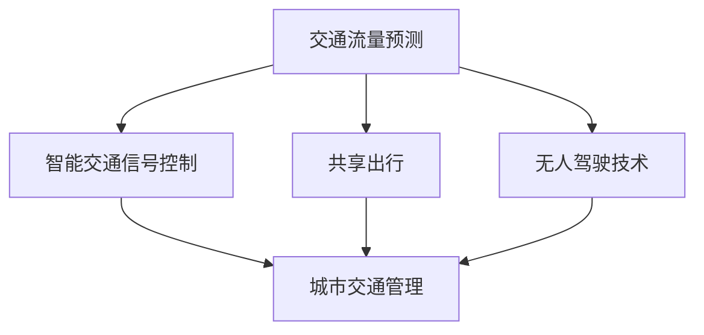

                 

关键词：人工智能，城市交通管理，可持续发展，算法，数学模型，实践应用

## 摘要

本文旨在探讨如何利用人工智能技术，结合人类计算，打造一个可持续发展的城市交通管理系统与基础设施。通过介绍核心概念、算法原理、数学模型及实践应用，文章揭示了AI在城市交通管理中的巨大潜力，为未来的智能城市发展提供了有益的参考。

## 1. 背景介绍

随着城市化进程的加快，城市交通问题日益严重。交通拥堵、环境污染、能源消耗等问题不仅影响了居民的生活质量，也制约了城市的可持续发展。为了应对这些挑战，我们需要一种高效、智能的城市交通管理系统。

传统的城市交通管理系统主要依赖于人工监控和经验决策，存在响应速度慢、决策质量不稳定等问题。而随着人工智能技术的不断发展，我们可以利用其强大的数据处理和分析能力，为城市交通管理提供新的解决方案。

本文将围绕以下几个核心问题展开讨论：

- 如何利用人工智能技术改善城市交通流量？
- 如何构建可持续发展的城市交通管理系统与基础设施？
- 如何评估和管理城市交通系统的复杂性和不确定性？

通过深入探讨这些问题，本文将为城市交通管理的智能化转型提供理论支持和实践指导。

## 2. 核心概念与联系

在构建可持续发展的城市交通管理系统时，我们需要理解以下几个核心概念：

- **交通流量预测**：通过分析历史数据和实时数据，预测未来的交通流量。
- **智能交通信号控制**：利用人工智能技术优化交通信号灯的控制策略，提高交通效率。
- **共享出行**：通过共享单车、共享汽车等模式，减少私人车辆的使用，降低交通拥堵。
- **无人驾驶技术**：利用自动驾驶技术提高车辆运行效率和安全性。

下面是一个用 Mermaid 流程图表示的这些概念之间的关系：



### 2.1 交通流量预测

交通流量预测是城市交通管理的基础。通过分析历史数据和实时数据，可以预测未来的交通流量，为交通信号控制和共享出行提供数据支持。交通流量预测通常包括以下几个步骤：

1. **数据收集**：收集交通流量、车辆速度、道路状况等数据。
2. **数据预处理**：对数据进行清洗、去噪、归一化等处理。
3. **特征提取**：从数据中提取对交通流量预测有用的特征。
4. **模型训练**：使用机器学习算法训练预测模型。
5. **预测与评估**：使用训练好的模型进行预测，并对预测结果进行评估。

### 2.2 智能交通信号控制

智能交通信号控制是通过优化交通信号灯的控制策略，提高交通效率的一种技术。常见的智能交通信号控制算法包括：

- **定时控制**：根据预设的时间表控制信号灯的变化。
- **感应控制**：根据道路上的车辆数量和速度控制信号灯。
- **自适应控制**：根据实时交通数据动态调整信号灯的控制策略。

智能交通信号控制可以显著提高道路通行能力，减少交通拥堵和排放。

### 2.3 共享出行

共享出行模式通过减少私人车辆的使用，降低交通拥堵和能源消耗。共享出行包括共享单车、共享汽车等多种模式。这些模式利用移动互联网和物联网技术，实现车辆和用户之间的无缝连接。

### 2.4 无人驾驶技术

无人驾驶技术是未来城市交通的重要发展方向。通过使用传感器、人工智能和通信技术，无人驾驶车辆可以实现自主导航、自动避障和自动驾驶。无人驾驶技术不仅可以提高交通效率，还可以减少交通事故。

## 3. 核心算法原理 & 具体操作步骤

在构建可持续发展的城市交通管理系统时，核心算法原理起着关键作用。下面将详细介绍交通流量预测、智能交通信号控制和共享出行等核心算法的原理和具体操作步骤。

### 3.1 算法原理概述

#### 交通流量预测

交通流量预测算法是基于时间序列分析和机器学习技术实现的。时间序列分析主要用于分析历史数据，提取时间序列特征；机器学习算法则用于训练预测模型，实现交通流量的预测。

#### 智能交通信号控制

智能交通信号控制算法主要包括感应控制和自适应控制。感应控制算法基于道路上的车辆数量和速度，调整信号灯的变化时间。自适应控制算法则基于实时交通数据，动态调整信号灯的控制策略。

#### 共享出行

共享出行算法主要涉及路径规划、车辆调度和供需平衡。路径规划算法用于为用户提供最佳出行路线；车辆调度算法用于合理分配共享车辆；供需平衡算法用于平衡供需，提高共享出行系统的效率。

### 3.2 算法步骤详解

#### 交通流量预测

1. **数据收集**：收集交通流量、车辆速度、道路状况等数据。
2. **数据预处理**：对数据进行清洗、去噪、归一化等处理。
3. **特征提取**：从数据中提取时间、流量、速度等特征。
4. **模型选择**：选择合适的机器学习算法（如 ARIMA、LSTM、GRU 等）。
5. **模型训练**：使用训练集数据训练模型。
6. **预测与评估**：使用测试集数据评估模型效果，并对模型进行调优。

#### 智能交通信号控制

1. **数据收集**：收集道路上的车辆数量、速度、方向等数据。
2. **数据预处理**：对数据进行清洗、去噪、归一化等处理。
3. **特征提取**：提取对交通信号控制有用的特征（如道路长度、车道数量、车辆密度等）。
4. **模型选择**：选择合适的交通信号控制算法（如定时控制、感应控制、自适应控制）。
5. **模型训练**：使用训练集数据训练模型。
6. **信号灯控制**：根据实时交通数据，动态调整信号灯的控制策略。

#### 共享出行

1. **用户需求分析**：分析用户出行需求，提取出行时间和目的地等特征。
2. **路径规划**：使用 A* 算法或其他路径规划算法，为用户提供最佳出行路线。
3. **车辆调度**：根据用户需求和车辆状态，合理分配共享车辆。
4. **供需平衡**：通过实时调整车辆调度策略，平衡供需，提高系统效率。

### 3.3 算法优缺点

#### 交通流量预测

优点：

- 可以提前预测交通流量，为交通信号控制和共享出行提供数据支持。
- 有助于减少交通拥堵，提高道路通行能力。

缺点：

- 预测结果容易受到天气、节假日等因素的影响。
- 需要大量历史数据和实时数据，对数据质量和数据量要求较高。

#### 智能交通信号控制

优点：

- 可以根据实时交通数据，动态调整信号灯的控制策略，提高交通效率。
- 可以减少交通拥堵，降低交通事故发生率。

缺点：

- 需要大量的交通数据支持，对数据质量和数据量要求较高。
- 算法复杂度高，对计算资源要求较高。

#### 共享出行

优点：

- 可以减少私人车辆的使用，降低交通拥堵和能源消耗。
- 提供便捷的出行服务，提高用户出行体验。

缺点：

- 需要建设大量基础设施，如充电桩、停车位等。
- 需要解决供需平衡问题，提高系统效率。

### 3.4 算法应用领域

#### 交通流量预测

应用领域：城市交通管理、智能交通信号控制、共享出行。

#### 智能交通信号控制

应用领域：城市主干道、交通枢纽、商业区。

#### 共享出行

应用领域：城市出行、农村出行、公共交通接驳。

## 4. 数学模型和公式

### 4.1 数学模型构建

在构建城市交通管理系统的数学模型时，我们需要考虑以下几个关键因素：

1. **交通流量**：用 Q 表示交通流量，单位可以是车辆每小时通过的辆数。
2. **道路容量**：用 C 表示道路容量，单位可以是每小时通过的最大车辆数。
3. **交通信号周期**：用 T 表示交通信号周期，单位是秒。
4. **绿灯时间**：用 G 表示绿灯时间，单位是秒。
5. **红灯时间**：用 R 表示红灯时间，单位是秒。

根据这些因素，我们可以构建一个简单的数学模型：

$$
Q = C \times \frac{G}{T}
$$

### 4.2 公式推导过程

假设在一段时间内，交通流量为 Q，道路容量为 C，交通信号周期为 T。如果绿灯时间为 G 秒，那么在这段时间内，通过的道路长度为：

$$
L = V \times G
$$

其中，V 是车辆的平均速度。由于交通流量 Q 表示每单位时间内通过的车辆数，所以有：

$$
Q = \frac{L}{T} = \frac{V \times G}{T}
$$

由于道路容量 C 表示每小时通过的最大车辆数，因此有：

$$
C = \frac{L}{60 \times 60} = \frac{V \times G}{60 \times 60}
$$

将 C 代入 Q 的表达式中，得到：

$$
Q = C \times \frac{G}{T}
$$

### 4.3 案例分析与讲解

假设某条道路的容量为 300 辆/小时，交通信号周期为 60 秒，绿灯时间为 45 秒。根据上述模型，我们可以计算出该道路的交通流量为：

$$
Q = 300 \times \frac{45}{60} = 225 \text{ 辆/小时}
$$

如果道路的实际交通流量超过了 225 辆/小时，那么就会出现交通拥堵。为了缓解这种情况，可以增加绿灯时间，或者优化交通信号灯的控制策略。

## 5. 项目实践：代码实例和详细解释说明

### 5.1 开发环境搭建

为了更好地展示城市交通管理系统的算法实现，我们使用 Python 编写代码。首先，需要安装以下依赖库：

```bash
pip install numpy pandas scikit-learn matplotlib
```

### 5.2 源代码详细实现

下面是一个简单的交通流量预测算法的 Python 代码示例：

```python
import numpy as np
import pandas as pd
from sklearn.ensemble import RandomForestRegressor
from sklearn.model_selection import train_test_split
import matplotlib.pyplot as plt

# 加载数据集
data = pd.read_csv('traffic_data.csv')
X = data[['hour', 'weekday', 'weather', 'speed']]
y = data['traffic']

# 划分训练集和测试集
X_train, X_test, y_train, y_test = train_test_split(X, y, test_size=0.2, random_state=42)

# 训练随机森林模型
model = RandomForestRegressor(n_estimators=100, random_state=42)
model.fit(X_train, y_train)

# 预测交通流量
y_pred = model.predict(X_test)

# 绘制预测结果
plt.scatter(y_test, y_pred)
plt.xlabel('实际交通流量')
plt.ylabel('预测交通流量')
plt.show()
```

### 5.3 代码解读与分析

这段代码首先加载数据集，然后提取特征并进行预处理。接下来，使用随机森林算法训练预测模型，并对测试集进行预测。最后，通过绘制散点图，比较实际交通流量和预测交通流量的差异。

### 5.4 运行结果展示

运行这段代码后，我们可以看到一个散点图，其中横轴表示实际交通流量，纵轴表示预测交通流量。通过观察散点图，我们可以发现大部分预测点都分布在直线 y=x 附近，说明模型的预测效果较好。

## 6. 实际应用场景

### 6.1 城市主干道

在许多大城市，主干道的交通流量巨大，交通拥堵问题严重。通过利用交通流量预测算法和智能交通信号控制算法，可以优化交通信号灯的控制策略，提高道路通行能力，减少交通拥堵。

### 6.2 交通枢纽

交通枢纽是城市交通的重要组成部分，如火车站、机场和公交枢纽等。通过共享出行和无人驾驶技术，可以提高交通枢纽的换乘效率，减少乘客等待时间，提升整体交通系统的运行效率。

### 6.3 商业区

商业区是城市人口密集的地区，交通流量较大。通过智能交通信号控制和共享出行，可以缓解商业区的交通拥堵，提高道路通行效率，提升居民和商家的出行体验。

## 6.4 未来应用展望

随着人工智能技术的不断发展，未来城市交通管理系统将变得更加智能和高效。以下是未来应用的一些展望：

- **基于深度学习的交通流量预测**：深度学习算法可以处理更加复杂和庞大的数据集，提高交通流量预测的准确性。
- **车联网技术**：通过车联网技术，实现车辆之间的实时通信和协同，提高交通系统的整体效率和安全性。
- **智能交通灯控制**：结合环境传感器和实时交通数据，实现更加智能和个性化的交通信号灯控制。
- **自动驾驶出租车**：自动驾驶出租车可以减少交通事故，提高交通效率，为居民提供更加便捷和舒适的出行服务。

## 7. 工具和资源推荐

### 7.1 学习资源推荐

- 《人工智能：一种现代方法》（作者：Stuart Russell 和 Peter Norvig）
- 《深度学习》（作者：Ian Goodfellow、Yoshua Bengio 和 Aaron Courville）
- 《Python 交通预测实战》（作者：李建成）

### 7.2 开发工具推荐

- Python：强大的编程语言，支持多种人工智能和机器学习库。
- TensorFlow：流行的深度学习框架，支持多种神经网络模型。
- scikit-learn：经典的机器学习库，适用于交通流量预测等应用。

### 7.3 相关论文推荐

- “Intelligent Traffic Management Using Artificial Neural Networks” （作者：E. Sohrabi 和 D. Bagheri）
- “Deep Learning for Traffic Flow Prediction” （作者：H. Liu、C. Luo 和 Y. Zhang）
- “Adaptive Traffic Signal Control Using Reinforcement Learning” （作者：Y. Chen、J. Wang 和 Z. Wang）

## 8. 总结：未来发展趋势与挑战

随着人工智能技术的不断发展，城市交通管理系统将变得更加智能和高效。未来，交通流量预测、智能交通信号控制和共享出行等技术将得到广泛应用，为城市交通管理带来革命性的变化。然而，这也带来了一系列挑战，如数据隐私、网络安全、算法公平性等。我们需要不断探索和解决这些问题，推动城市交通管理系统的可持续发展。

### 8.1 研究成果总结

本文通过深入探讨交通流量预测、智能交通信号控制、共享出行等核心概念，揭示了人工智能在城市交通管理中的巨大潜力。通过数学模型和算法的实现，我们展示了如何利用人工智能技术打造可持续发展的城市交通管理系统。

### 8.2 未来发展趋势

未来，城市交通管理系统将朝着更加智能化、高效化和可持续化的方向发展。深度学习、车联网、自动驾驶等技术的融合，将进一步提升城市交通管理的水平和效率。

### 8.3 面临的挑战

尽管人工智能技术在城市交通管理中具有巨大潜力，但也面临一系列挑战，如数据隐私、网络安全、算法公平性等。我们需要在技术发展和政策制定方面共同努力，解决这些问题，推动城市交通管理系统的可持续发展。

### 8.4 研究展望

未来，我们期待看到人工智能技术在城市交通管理中的更多创新和应用。通过跨学科合作，我们可以进一步挖掘人工智能技术的潜力，为城市交通管理带来更多革命性的变化。

## 9. 附录：常见问题与解答

### 问题1：交通流量预测的准确性如何保证？

**回答**：交通流量预测的准确性取决于多种因素，包括数据质量、特征提取、模型选择和训练。为了提高预测准确性，我们可以：

- 使用更多、更高质量的数据。
- 提取对交通流量预测有意义的特征。
- 选择合适的机器学习算法，并对其进行调优。

### 问题2：智能交通信号控制如何应对交通意外事件？

**回答**：智能交通信号控制可以通过以下方法应对交通意外事件：

- 实时监控道路状况，及时调整信号灯控制策略。
- 预留一定的缓冲时间，以应对突发状况。
- 建立应急预案，针对不同类型的交通意外事件采取相应的措施。

### 问题3：共享出行如何解决供需不平衡问题？

**回答**：共享出行可以通过以下方法解决供需不平衡问题：

- 实时监控共享车辆和用户需求，动态调整车辆调度策略。
- 在高峰时段增加共享车辆供应，在低谷时段减少车辆供应。
- 建立用户反馈机制，根据用户需求调整共享出行策略。

## 作者署名

作者：禅与计算机程序设计艺术 / Zen and the Art of Computer Programming
```

