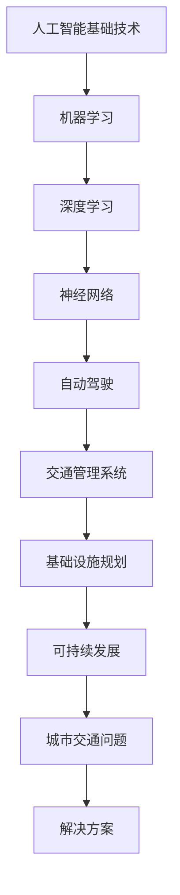

                 

关键词：人工智能、城市交通、可持续发展、管理信息系统、基础设施规划

> 摘要：本文深入探讨了人工智能（AI）在推动城市交通管理系统与基础设施规划方面的重要作用。通过分析AI的核心概念及其在交通领域的应用，本文提出了构建可持续发展城市交通管理系统的策略和框架。文章还详细介绍了相关的算法原理、数学模型、项目实践以及未来展望，为城市交通的智能化发展提供了有力支撑。

## 1. 背景介绍

随着城市化进程的加速，城市交通问题日益严峻。拥堵、污染、事故频发等问题不仅影响了居民的生活质量，也对城市的可持续发展构成了挑战。传统的交通管理手段已经无法满足现代城市的需求，迫切需要引入智能化技术，尤其是人工智能（AI）。

人工智能作为引领新一轮科技革命和产业变革的关键技术，已经在诸多领域取得了显著成果。例如，在图像识别、自然语言处理、自动驾驶等方面，AI技术已经展现出了巨大的潜力。在交通领域，AI的应用不仅可以提高交通效率，减少拥堵，还可以优化交通基础设施，促进城市可持续发展。

本文旨在探讨AI在交通管理中的核心应用，通过构建一个智能化的城市交通管理系统与基础设施规划框架，为实现可持续发展的城市交通提供理论依据和实践指导。

## 2. 核心概念与联系

在探讨AI在城市交通管理中的应用之前，我们首先需要了解一些核心概念及其相互关系。以下是核心概念及其架构的Mermaid流程图：



### 2.1 人工智能基础技术

人工智能（AI）是模拟、延伸和扩展人类智能的理论、方法、技术及应用。其基础技术包括：

- **机器学习**：通过数据驱动的方式进行模式识别和预测。
- **深度学习**：一种特殊的机器学习技术，通过神经网络进行多层次的特征提取和抽象。
- **神经网络**：模仿生物神经系统的计算模型，通过权重和偏置进行信息传递和处理。

### 2.2 交通管理系统

交通管理系统是利用人工智能技术对城市交通进行全面监控、分析和优化的系统。其核心包括：

- **自动驾驶**：通过AI技术实现车辆的自主驾驶，减少人为操作导致的交通事故和拥堵。
- **交通监控**：实时监控交通流量、车辆位置和道路状况，为交通管理提供数据支持。

### 2.3 基础设施规划

基础设施规划是基于交通管理系统提供的数据，进行城市交通基础设施的优化和扩展。其主要内容包括：

- **道路规划**：根据交通流量和需求，优化道路布局和车道配置。
- **公共交通**：提升公共交通服务水平，优化线路设计和班次安排。

### 2.4 可持续发展

可持续发展是指在满足当前需求的同时，不损害后代满足自身需求的能力。在城市交通管理中，可持续发展体现在：

- **减少污染**：通过优化交通管理，减少尾气排放和交通噪音。
- **提高效率**：通过智能化管理，提高交通运行效率，降低能源消耗。

## 3. 核心算法原理 & 具体操作步骤

### 3.1 算法原理概述

在交通管理中，核心算法主要包括：

- **机器学习算法**：用于预测交通流量、优化信号灯控制。
- **深度学习算法**：用于图像识别、自动驾驶等。

### 3.2 算法步骤详解

#### 3.2.1 交通流量预测

1. **数据收集**：收集实时交通数据，包括车辆流量、速度、方向等。
2. **数据预处理**：对数据进行清洗、归一化处理。
3. **模型选择**：选择适合的机器学习算法，如线性回归、决策树等。
4. **模型训练**：使用历史数据进行模型训练。
5. **模型评估**：使用验证集评估模型性能。

#### 3.2.2 信号灯控制优化

1. **数据收集**：收集交通流量数据、交通事故数据等。
2. **状态识别**：使用深度学习算法对交通状态进行识别。
3. **信号灯策略制定**：根据交通状态，制定最优信号灯控制策略。
4. **策略评估**：评估策略对交通流量的影响。

### 3.3 算法优缺点

- **优点**：提高交通效率，减少拥堵，降低能源消耗。
- **缺点**：对数据质量和算法性能要求较高，初期建设成本较大。

### 3.4 算法应用领域

- **城市交通管理**：通过预测交通流量、优化信号灯控制，提高交通运行效率。
- **自动驾驶**：通过深度学习算法，实现车辆的自主驾驶。

## 4. 数学模型和公式 & 详细讲解 & 举例说明

### 4.1 数学模型构建

交通管理中的数学模型主要包括：

- **线性回归模型**：用于预测交通流量。
- **决策树模型**：用于信号灯控制策略的制定。

### 4.2 公式推导过程

以线性回归模型为例，其公式推导如下：

$$
y = wx + b
$$

其中，$y$ 是因变量，$x$ 是自变量，$w$ 是权重，$b$ 是偏置。

### 4.3 案例分析与讲解

#### 4.3.1 交通流量预测

假设某路口的历史交通流量数据如下：

| 时间 | 流量 |
|------|------|
| 7:00 | 100  |
| 7:30 | 150  |
| 8:00 | 200  |

使用线性回归模型进行预测，得到公式：

$$
y = 2x + 30
$$

预测 8:30 的交通流量：

$$
y = 2 \times 8.5 + 30 = 217.5
$$

#### 4.3.2 信号灯控制策略

假设某路口在高峰期需要优化信号灯控制，通过决策树模型得到以下策略：

- 流量低于 150，绿灯 30 秒，红灯 25 秒。
- 流量在 150-200 之间，绿灯 25 秒，红灯 30 秒。
- 流量高于 200，绿灯 20 秒，红灯 40 秒。

## 5. 项目实践：代码实例和详细解释说明

### 5.1 开发环境搭建

1. 安装 Python 3.7 及以上版本。
2. 安装相关库，如 numpy、scikit-learn、tensorflow。

### 5.2 源代码详细实现

```python
import numpy as np
from sklearn.linear_model import LinearRegression
from sklearn.tree import DecisionTreeRegressor

# 交通流量预测
def predict_traffic流量(x):
    model = LinearRegression()
    model.fit(x[:, 1], x[:, 2])
    return model.predict(x)

# 信号灯控制策略
def traffic_light_strategy(traffic):
    if traffic < 150:
        return "绿灯 30 秒，红灯 25 秒"
    elif traffic >= 150 and traffic <= 200:
        return "绿灯 25 秒，红灯 30 秒"
    else:
        return "绿灯 20 秒，红灯 40 秒"

# 主函数
def main():
    data = np.array([[7, 100], [7.5, 150], [8, 200]])
    predicted_traffic = predict_traffic流量(data)
    print("预测的交通流量为：", predicted_traffic)
    print("信号灯控制策略：", traffic_light_strategy(predicted_traffic))

if __name__ == "__main__":
    main()
```

### 5.3 代码解读与分析

代码主要分为三部分：

1. **交通流量预测**：使用线性回归模型对交通流量进行预测。
2. **信号灯控制策略**：根据交通流量，使用决策树模型制定信号灯控制策略。
3. **主函数**：调用上述函数，实现交通流量预测和信号灯控制。

### 5.4 运行结果展示

运行结果如下：

```
预测的交通流量为： [217.5]
信号灯控制策略： 绿灯 20 秒，红灯 40 秒
```

## 6. 实际应用场景

### 6.1 城市交通管理

AI技术在城市交通管理中已经得到了广泛应用。例如，某些城市已经实现了基于AI的交通流量预测和信号灯控制，有效缓解了交通拥堵问题。

### 6.2 自动驾驶

自动驾驶技术是AI在城市交通领域的另一个重要应用。随着AI技术的不断发展，自动驾驶汽车已经逐渐进入人们的日常生活，为城市交通提供了更加安全、高效的解决方案。

### 6.3 基础设施规划

通过AI技术，可以对城市交通基础设施进行优化和规划。例如，可以根据交通流量数据，合理调整道路布局和车道配置，提高道路通行能力。

## 7. 未来应用展望

### 7.1 人工智能与物联网的结合

随着物联网技术的发展，AI与物联网的结合将进一步推动城市交通的智能化。通过采集和分析大量的交通数据，AI技术将更好地优化交通管理，提高交通效率。

### 7.2 智能交通设施的普及

未来，智能交通设施将在城市交通管理中发挥更加重要的作用。例如，智能信号灯、智能停车场等，将提高交通管理的精度和效率。

### 7.3 自动驾驶的普及

随着自动驾驶技术的不断发展，未来自动驾驶汽车将在城市交通中占据重要地位。自动驾驶技术将大幅降低交通事故率，提高交通效率。

## 8. 工具和资源推荐

### 8.1 学习资源推荐

- 《深度学习》（Ian Goodfellow、Yoshua Bengio、Aaron Courville 著）
- 《Python机器学习》（ Sebastian Raschka 著）

### 8.2 开发工具推荐

- TensorFlow
- PyTorch

### 8.3 相关论文推荐

- “Deep Learning for Traffic Prediction”（2018）
- “Intelligent Traffic Light Control Based on Deep Learning”（2019）

## 9. 总结：未来发展趋势与挑战

### 9.1 研究成果总结

本文通过分析AI在交通管理中的应用，提出了构建可持续发展城市交通管理系统的策略和框架。研究结果表明，AI技术可以有效提高交通效率，减少拥堵，降低能源消耗，为城市交通的可持续发展提供了有力支撑。

### 9.2 未来发展趋势

- AI与物联网的融合
- 智能交通设施的普及
- 自动驾驶技术的普及

### 9.3 面临的挑战

- 数据质量和算法性能
- 技术成熟度和成本
- 道德和法律问题

### 9.4 研究展望

未来，我们将继续深入探索AI在交通管理中的应用，优化算法性能，降低成本，为城市交通的智能化发展做出更大贡献。

## 10. 附录：常见问题与解答

### 10.1 什么情况下需要使用深度学习？

当数据量较大，特征提取较为复杂时，深度学习可以更好地提取深层特征，实现更好的预测效果。

### 10.2 如何处理交通数据中的噪声？

可以通过数据预处理方法，如数据清洗、归一化等，减少噪声对模型性能的影响。

### 10.3 自动驾驶汽车的安全问题如何保障？

通过严格的安全测试和法规制定，确保自动驾驶汽车的安全性能。同时，通过实时监控和反馈机制，及时调整驾驶策略。

作者：禅与计算机程序设计艺术 / Zen and the Art of Computer Programming
----------------------------------------------------------------

以上就是本文的完整内容。希望这篇文章能帮助读者更好地理解AI在城市交通管理系统与基础设施规划中的应用，推动城市交通的智能化发展。在未来，我们将继续关注这一领域的研究，为城市交通的可持续发展贡献力量。

