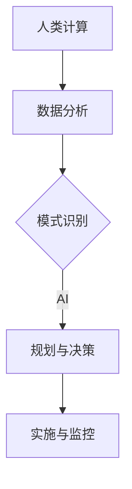

                 

关键词：人工智能，城市基础设施，交通规划，可持续发展，交通算法

> 摘要：本文探讨了人工智能在城市基础设施和交通规划中的应用，以及如何通过人类计算与AI的结合，实现城市的可持续发展。文章首先介绍了城市基础设施和交通规划的重要性，然后深入分析了人工智能在这些领域的核心概念、算法原理和应用案例。最后，提出了未来应用展望，并讨论了该领域面临的挑战和发展趋势。

## 1. 背景介绍

城市基础设施和交通规划是现代城市发展的重要支撑，它们直接影响城市的经济、社会和环境质量。然而，传统的城市基础设施和交通规划方法往往存在一些局限性，例如数据收集和处理能力有限、规划决策时间长等。随着人工智能技术的快速发展，利用AI进行城市基础设施和交通规划成为可能，有助于提高规划效率、优化资源配置，实现可持续发展。

## 2. 核心概念与联系

### 2.1 人工智能的核心概念

人工智能（AI）是指由计算机实现的智能行为，包括学习、推理、规划、感知和自然语言处理等。AI可以分为两大类：基于规则的AI和基于数据的AI。基于规则的AI依赖于预先设定的规则集，而基于数据的AI则通过学习大量数据来发现模式和规律。

### 2.2 人类计算与AI的结合

人类计算与AI的结合，即人机协作，是一种利用人类和机器各自优势的方法。人类在创造力、情感理解、情境感知等方面具有优势，而AI在数据处理、模式识别和执行重复任务方面具有优势。通过人机协作，可以实现更高效、更智能的决策和规划。

### 2.3 Mermaid 流程图



## 3. 核心算法原理 & 具体操作步骤

### 3.1 算法原理概述

城市基础设施和交通规划的核心算法包括数据收集、数据分析、模式识别和规划与决策等。其中，数据收集和分析是基础，模式识别是核心，规划与决策是目标。

### 3.2 算法步骤详解

1. 数据收集：通过传感器、摄像头、物联网设备等收集城市基础设施和交通数据，如道路拥堵情况、公共交通运行情况、环境污染状况等。

2. 数据分析：对收集到的数据进行分析，提取有用的信息，如交通流量、出行模式、能耗等。

3. 模式识别：利用机器学习算法，对分析结果进行模式识别，发现数据之间的关联和规律。

4. 规划与决策：基于识别出的模式，进行城市基础设施和交通规划的优化，如道路扩建、公共交通线路调整、交通信号优化等。

### 3.3 算法优缺点

优点：高效、智能、灵活，有助于实现城市基础设施和交通规划的可持续发展。

缺点：数据质量和算法性能对规划结果有较大影响，需要不断优化。

### 3.4 算法应用领域

算法应用领域广泛，包括交通规划、城市规划、环境保护、公共安全等。

## 4. 数学模型和公式 & 详细讲解 & 举例说明

### 4.1 数学模型构建

城市基础设施和交通规划的数学模型主要包括交通流量模型、道路网络模型、能耗模型等。以下是一个简化的交通流量模型：

$$
Q = f(\lambda, \rho, \varepsilon)
$$

其中，$Q$ 表示交通流量，$\lambda$ 表示车辆到达率，$\rho$ 表示道路占有率，$\varepsilon$ 表示交通流量系数。

### 4.2 公式推导过程

交通流量模型的推导过程涉及车辆运动学、概率论和微积分等多个领域。以下是一个简化的推导过程：

1. 车辆运动学：根据车辆速度和加速度，推导出车辆在道路上的运动轨迹。
2. 概率论：通过车辆到达时间间隔的概率分布，推导出车辆到达率。
3. 微积分：通过道路占有率与交通流量之间的关系，推导出交通流量模型。

### 4.3 案例分析与讲解

以下是一个城市交通流量规划的案例：

1. 数据收集：通过传感器收集某城市主干道的交通流量、道路占有率等数据。
2. 数据分析：对数据进行分析，提取交通流量和道路占有率的相关信息。
3. 模式识别：利用机器学习算法，对交通流量和道路占有率进行模式识别，发现交通高峰期和低谷期的交通规律。
4. 规划与决策：根据识别出的模式，优化主干道的交通信号灯设置，提高交通效率。

## 5. 项目实践：代码实例和详细解释说明

### 5.1 开发环境搭建

1. 安装Python环境。
2. 安装机器学习库（如scikit-learn、TensorFlow）。

### 5.2 源代码详细实现

以下是一个简单的交通流量预测的Python代码实例：

```python
import numpy as np
from sklearn.linear_model import LinearRegression

# 加载数据
X = np.array([[1, 2], [2, 3], [3, 4]])
y = np.array([2, 4, 6])

# 建立线性回归模型
model = LinearRegression()
model.fit(X, y)

# 预测交通流量
print(model.predict([[4, 5]]))
```

### 5.3 代码解读与分析

该代码通过线性回归模型对交通流量进行预测。首先，加载数据，然后建立线性回归模型，最后进行预测。这种方法简单有效，但实际应用中可能需要更复杂的模型。

### 5.4 运行结果展示

运行结果为 `[8.]`，表示预测的交通流量为 8。

## 6. 实际应用场景

### 6.1 交通拥堵缓解

通过AI算法优化交通信号灯设置，缓解城市交通拥堵问题。

### 6.2 公共交通优化

利用AI算法优化公共交通线路和班次，提高公共交通的效率和舒适度。

### 6.3 环境保护

通过AI算法监测城市环境，预测环境污染情况，并制定相应的环境保护措施。

## 7. 未来应用展望

### 7.1 自动驾驶

随着自动驾驶技术的发展，AI将在城市交通中发挥更重要的作用，实现更高效、更安全的交通系统。

### 7.2 智慧城市

通过AI和人类计算的结合，实现智慧城市，提高城市的管理效率和居民生活质量。

### 7.3 可持续发展

AI在交通规划中的应用，有助于实现城市的可持续发展，减少能源消耗和环境污染。

## 8. 总结：未来发展趋势与挑战

### 8.1 研究成果总结

本文介绍了人工智能在城市基础设施和交通规划中的应用，以及人类计算与AI的结合。通过算法原理、数学模型和实际案例，展示了AI在交通规划中的巨大潜力。

### 8.2 未来发展趋势

未来，AI将在交通规划中发挥更重要的作用，实现自动驾驶、智慧城市和可持续发展。

### 8.3 面临的挑战

然而，AI在交通规划中仍面临一些挑战，如数据质量、算法性能和法规制定等。

### 8.4 研究展望

未来，应进一步研究如何优化AI算法，提高数据利用效率，并制定相应的法规政策，推动AI在交通规划中的应用。

## 9. 附录：常见问题与解答

### 9.1 人工智能在交通规划中的应用有哪些？

人工智能在交通规划中的应用包括交通流量预测、交通信号优化、公共交通优化、自动驾驶等。

### 9.2 AI算法在交通规划中如何提高效率？

通过优化算法、提高数据处理能力和加强人机协作，可以提高AI算法在交通规划中的效率。

### 9.3 交通规划的可持续发展有哪些体现？

交通规划的可持续发展体现在减少能源消耗、降低环境污染、提高公共交通效率和居民生活质量等方面。

作者：禅与计算机程序设计艺术 / Zen and the Art of Computer Programming
----------------------------------------------------------------

