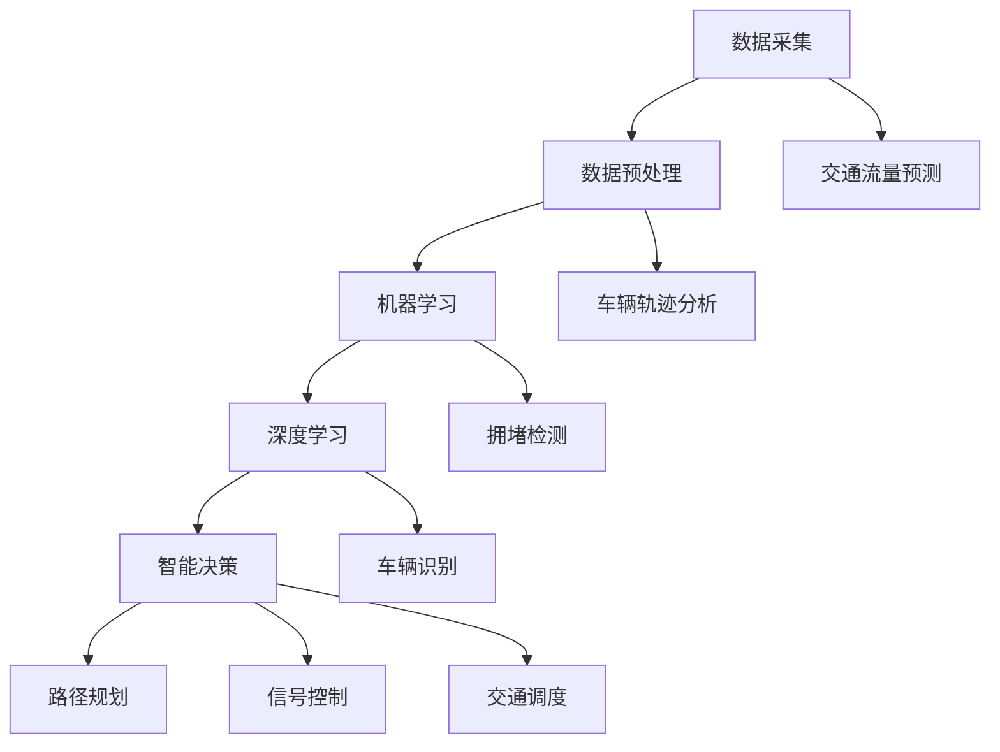

                 

### 背景介绍

随着全球城市化进程的不断加速，城市生活方式和交通管理系统面临的挑战日益突出。城市化导致了人口密度的增加，交通拥堵、环境污染、能源消耗等问题逐渐显现。传统的城市交通管理系统已经无法满足现代城市的高效、安全和可持续发展需求。因此，如何利用人工智能技术来优化城市生活方式与交通管理系统，成为了当前研究的热点。

人工智能（Artificial Intelligence，AI）作为一项颠覆性的技术，已经在各个领域展现了其强大的潜力。特别是在城市交通管理领域，AI技术可以通过数据采集与分析、智能决策、自动化控制等手段，实现交通流量的实时监控、拥堵预测、路径优化等功能。通过这些功能，城市交通管理可以实现更加高效、安全和环保的目标。

本文旨在探讨AI技术在城市生活方式与交通管理系统中的应用，分析其核心概念与联系，介绍核心算法原理与操作步骤，建立数学模型，通过项目实践进行代码实例讲解，并探讨实际应用场景和未来发展趋势。希望通过本文的讨论，为城市交通管理系统的优化提供新的思路和方法。

## 关键词

- 城市化
- 人工智能
- 交通管理系统
- 可持续发展
- 智能决策
- 数据分析

## 摘要

本文首先介绍了城市生活方式与交通管理系统面临的挑战，分析了AI技术在其中的应用潜力。随后，本文从核心概念与联系、算法原理与步骤、数学模型与公式、项目实践等多个角度，详细探讨了AI技术在城市交通管理系统中的应用。通过实际案例和代码实例，本文展示了AI技术在交通流量优化、路径规划等方面的具体应用效果。最后，本文总结了当前的研究成果，并对未来发展趋势和挑战进行了展望，为城市交通管理系统的优化提供了新的思路。

## 1. 背景介绍

随着全球城市化的不断推进，城市生活方式和交通管理系统正面临着前所未有的挑战。城市化进程的加快导致了人口密度的急剧增加，使得城市交通系统承受了巨大的压力。传统的交通管理模式已经难以应对现代城市的高效、安全和可持续发展的需求，特别是在应对突发交通事件、优化交通流量、减少拥堵等方面，传统方法显得力不从心。

首先，城市交通拥堵问题日益严重。根据联合国的一项研究，全球约60%的人口居住在城市地区，而这些城市地区的交通拥堵问题正在迅速恶化。以北京为例，高峰时段的交通拥堵已经严重影响了市民的日常生活和工作效率。根据北京市交通委员会的数据，2019年北京的平均通勤时间为50分钟，远高于世界其他大城市。

其次，环境污染问题愈发突出。城市交通的快速发展带来了大量的尾气排放，导致空气质量下降，对人类健康造成了严重威胁。以伦敦为例，2019年伦敦的PM2.5浓度达到了年均36微克/立方米，超过了世界卫生组织（WHO）的推荐标准。

最后，能源消耗问题日益严重。城市交通的快速发展导致了石油资源的过度消耗，对全球能源安全构成了威胁。根据国际能源署（IEA）的数据，全球城市交通领域的能源消耗占到了总能源消耗的20%以上。

面对这些挑战，传统的城市交通管理系统已经无法满足现代城市的需求。为此，需要引入新的技术手段，特别是人工智能（AI）技术，来优化城市生活方式与交通管理系统。AI技术具有处理海量数据、实时分析、智能决策等优势，可以有效地解决城市交通系统面临的拥堵、污染、能耗等问题。

首先，AI技术可以通过数据采集与分析，实时监控交通流量。通过安装在道路上的传感器、摄像头等设备，AI技术可以收集大量的交通数据，如车辆速度、流量、密度等。这些数据经过处理后，可以生成交通流量图、拥堵指数等指标，为交通管理部门提供决策依据。

其次，AI技术可以实现交通流量的智能调度。通过机器学习和深度学习算法，AI技术可以根据历史数据和实时交通情况，预测未来交通流量，并给出最优的路径规划建议。这样，交通管理部门可以提前采取措施，如调整信号灯时序、引导车辆分流等，以缓解交通拥堵。

此外，AI技术还可以用于智能交通控制。通过自动化控制技术，AI系统可以实时调整交通信号灯的时序，优化交通流。例如，在高峰时段，AI系统可以根据交通流量数据，动态调整信号灯的绿灯时间，以减少交通拥堵。

总之，AI技术在城市交通管理系统中的应用，可以显著提高城市交通的效率、安全性和可持续性。通过数据驱动、智能决策、自动化控制等手段，AI技术为城市交通管理提供了一种全新的解决方案。面对城市化带来的挑战，AI技术已经成为优化城市生活方式与交通管理系统的重要工具。

## 2. 核心概念与联系

在城市交通管理系统中，人工智能（AI）技术的应用涉及多个核心概念和它们的相互联系。这些核心概念包括数据采集与处理、机器学习、深度学习、智能决策等。以下将详细探讨这些概念，并通过Mermaid流程图展示它们之间的联系。

### 2.1 数据采集与处理

数据采集与处理是AI技术应用于城市交通管理系统的基础。通过安装在道路上的传感器、摄像头等设备，可以实时收集大量的交通数据，如车辆速度、流量、密度、事故信息等。这些原始数据通常质量较低、格式多样，因此需要进行预处理，包括数据清洗、格式转换、数据整合等步骤。数据预处理后，才能用于后续的机器学习和深度学习模型训练。

### 2.2 机器学习

机器学习是AI技术的重要组成部分，通过算法自动从数据中学习规律和模式。在城市交通管理系统中，机器学习算法可以用于交通流量预测、车辆轨迹分析、拥堵检测等任务。常见的机器学习算法包括线性回归、决策树、支持向量机等。这些算法通过对历史交通数据的分析，可以识别出交通流量变化规律，为交通管理提供预测和决策支持。

### 2.3 深度学习

深度学习是机器学习的一个分支，通过多层神经网络结构来模拟人脑的决策过程。深度学习在图像识别、语音识别、自然语言处理等领域取得了显著的成果。在城市交通管理系统中，深度学习算法可以用于车辆识别、道路识别、行人检测等任务。这些算法通过对视频流或图像的分析，可以实现对交通状况的实时监控和智能判断。

### 2.4 智能决策

智能决策是AI技术的核心目标之一，通过机器学习和深度学习算法的分析结果，可以生成智能化的决策方案。在城市交通管理系统中，智能决策可以用于路径规划、信号控制、交通调度等任务。例如，通过分析实时交通数据，AI系统可以自动生成最优的路径规划建议，以减少交通拥堵；通过分析交通流量数据，AI系统可以自动调整交通信号灯的时序，优化交通流。

### 2.5 Mermaid 流程图

以下是一个简化的Mermaid流程图，展示了这些核心概念之间的联系：



通过这个流程图，我们可以清晰地看到数据采集、处理、机器学习、深度学习和智能决策之间的相互作用，以及它们如何共同作用于城市交通管理系统的各个方面。

### 2.6 关键节点解析

- **数据采集**：通过传感器和摄像头等设备，收集交通流量、车辆速度、事故信息等原始数据。
- **数据预处理**：清洗、格式转换、整合原始数据，使其适合机器学习和深度学习算法使用。
- **机器学习**：利用历史交通数据，训练预测模型，用于交通流量预测和拥堵检测。
- **深度学习**：利用图像和视频数据，训练识别模型，用于车辆识别和道路识别。
- **智能决策**：综合机器学习和深度学习的结果，生成最优的决策方案，如路径规划、信号控制和交通调度。

通过这些核心概念和流程的紧密结合，AI技术为城市交通管理系统提供了强大的数据支持和智能决策能力，从而显著提升了城市交通的效率、安全性和可持续性。

## 3. 核心算法原理 & 具体操作步骤

### 3.1 算法原理概述

在城市交通管理系统中，核心算法主要涉及交通流量预测、路径规划和智能调度等方面。以下将详细介绍这些核心算法的基本原理和实现方法。

### 3.2 算法步骤详解

#### 3.2.1 交通流量预测

交通流量预测是城市交通管理的重要环节，它有助于提前预测交通拥堵情况，从而采取相应措施。交通流量预测的基本步骤如下：

1. **数据收集**：通过传感器和摄像头等设备，实时收集道路上的车辆速度、流量、密度等数据。
2. **数据预处理**：对收集到的数据进行清洗、格式转换和整合，确保数据质量。
3. **特征提取**：从预处理后的数据中提取关键特征，如时间、天气、节假日等。
4. **模型训练**：利用历史交通数据，训练线性回归、决策树、支持向量机等预测模型。
5. **模型评估**：通过交叉验证等方法评估模型的预测性能，调整模型参数。
6. **实时预测**：利用训练好的模型，对当前交通状况进行预测，生成未来一段时间内的交通流量预测结果。

#### 3.2.2 路径规划

路径规划旨在为驾驶员提供最优的行驶路径，以减少行驶时间和拥堵。路径规划的基本步骤如下：

1. **初始路径生成**：根据起点和终点，生成所有可能的路径。
2. **路径评分**：对每条路径进行评分，评分指标包括距离、交通流量、时间等。
3. **贪心算法**：采用贪心算法，从初始路径中逐步选择最优路径，直至到达终点。
4. **优化调整**：根据实时交通数据，对路径进行动态调整，以应对交通拥堵和突发情况。

#### 3.2.3 智能调度

智能调度是指通过自动化控制技术，实时调整交通信号灯的时序，以优化交通流量。智能调度的基本步骤如下：

1. **数据采集**：实时采集交通流量、速度、密度等数据。
2. **状态评估**：根据采集到的数据，评估当前交通状态，包括拥堵情况、车辆排队长度等。
3. **信号灯控制**：根据评估结果，动态调整交通信号灯的时序，优先放行流量较大的道路。
4. **反馈机制**：通过反馈机制，不断调整信号灯时序，以适应实时交通状况。

### 3.3 算法优缺点

#### 交通流量预测

**优点**：

- 提前预警：通过预测交通流量，可以提前预警可能出现的拥堵，有助于交通管理部门采取相应措施。
- 提高效率：预测结果可以为路径规划和智能调度提供数据支持，从而提高交通系统的运行效率。

**缺点**：

- 数据依赖性高：预测精度依赖于历史数据的数量和质量，数据缺失或噪声可能会影响预测结果。
- 实时性要求高：交通流量预测需要实时更新数据，对系统的实时性要求较高。

#### 路径规划

**优点**：

- 最优路径：通过路径规划，可以找到最优的行驶路径，减少行驶时间和拥堵。
- 灵活性：路径规划可以根据实时交通状况进行调整，提高路径的适应性。

**缺点**：

- 计算复杂度高：生成所有可能的路径并评分需要大量的计算资源。
- 数据实时性要求高：路径规划需要实时更新交通数据，对系统的实时性要求较高。

#### 智能调度

**优点**：

- 动态调整：智能调度可以根据实时交通状况动态调整信号灯时序，优化交通流量。
- 提高效率：智能调度可以减少交通拥堵，提高交通系统的运行效率。

**缺点**：

- 需要大量数据支持：智能调度需要实时采集和分析交通流量、速度、密度等数据。
- 实时性要求高：智能调度需要对实时交通状况进行快速响应，对系统的实时性要求较高。

### 3.4 算法应用领域

核心算法主要应用于城市交通管理系统，包括交通流量预测、路径规划和智能调度等。以下列举一些具体的应用领域：

- **交通流量预测**：用于交通管理部门制定交通管理策略、优化交通信号灯时序等。
- **路径规划**：用于导航系统、智能交通系统等，为驾驶员提供最优行驶路径。
- **智能调度**：用于智能交通信号控制系统，动态调整信号灯时序，优化交通流量。

通过这些核心算法的应用，AI技术为城市交通管理系统提供了强大的数据支持和智能决策能力，从而显著提升了城市交通的效率、安全性和可持续性。

## 4. 数学模型和公式 & 详细讲解 & 举例说明

### 4.1 数学模型构建

在城市交通管理系统中，数学模型是算法设计和实现的重要基础。以下将介绍两个常用的数学模型：交通流量预测模型和路径规划模型。

#### 4.1.1 交通流量预测模型

交通流量预测模型旨在预测未来一段时间内的交通流量，以便交通管理部门采取相应措施。一种常用的模型是时间序列模型，如ARIMA（自回归积分滑动平均模型）。以下是其基本公式：

$$
X_t = c + \phi_1 X_{t-1} + \phi_2 X_{t-2} + ... + \phi_p X_{t-p} + \theta_1 \epsilon_{t-1} + \theta_2 \epsilon_{t-2} + ... + \theta_q \epsilon_{t-q} + \epsilon_t
$$

其中，$X_t$ 表示第 $t$ 时刻的交通流量，$c$ 是常数项，$\phi_1, \phi_2, ..., \phi_p$ 是自回归系数，$\theta_1, \theta_2, ..., \theta_q$ 是滑动平均系数，$\epsilon_t$ 是误差项。

#### 4.1.2 路径规划模型

路径规划模型用于为驾驶员提供最优行驶路径，常采用最短路径算法，如Dijkstra算法。以下是其基本公式：

$$
\text{minimize} \sum_{i=1}^{n} d(i, j) \\
\text{subject to} \\
\sum_{i=1}^{n} x_{ij} = 1 \\
x_{ij} \in \{0, 1\}
$$

其中，$d(i, j)$ 表示从节点 $i$ 到节点 $j$ 的距离，$x_{ij}$ 是0-1变量，表示从节点 $i$ 到节点 $j$ 是否选择路径。

### 4.2 公式推导过程

#### 4.2.1 交通流量预测模型推导

交通流量预测模型采用ARIMA模型，需要通过以下步骤进行推导：

1. **自相关函数（ACF）和偏自相关函数（PACF）分析**：通过分析时间序列的自相关函数和偏自相关函数，确定模型阶数。

2. **差分操作**：对时间序列进行差分，使其平稳。差分公式为：
   $$
   \Delta X_t = X_t - X_{t-1}
   $$

3. **建立ARIMA模型**：根据自相关函数和偏自相关函数的分析结果，建立ARIMA模型。例如，对于$p$阶自回归和$q$阶滑动平均模型，其公式为：
   $$
   X_t = c + \phi_1 X_{t-1} + \phi_2 X_{t-2} + ... + \phi_p X_{t-p} + \theta_1 \epsilon_{t-1} + \theta_2 \epsilon_{t-2} + ... + \theta_q \epsilon_{t-q} + \epsilon_t
   $$

4. **参数估计**：通过最小二乘法或极大似然估计法，估计模型参数。

5. **模型检验**：通过残差分析、自相关函数和偏自相关函数检验模型是否合理。

#### 4.2.2 路径规划模型推导

路径规划模型采用Dijkstra算法，其基本思想是通过迭代计算，找到从源节点到其他所有节点的最短路径。以下是其推导过程：

1. **初始化**：设源节点为 $s$，其他节点为 $v_1, v_2, ..., v_n$。初始化距离表 $D(s, v_i)$ 为从源节点到各节点的距离，初始时 $D(s, s) = 0$，$D(s, v_i) = \infty$。

2. **迭代计算**：每次迭代选择未访问节点中距离最小的节点 $v_j$，更新距离表。更新公式为：
   $$
   D(s, v_i) = \min(D(s, v_j) + d(v_j, v_i))
   $$
   其中，$d(v_j, v_i)$ 表示从节点 $v_j$ 到节点 $v_i$ 的距离。

3. **结束条件**：当所有节点都被访问过时，算法结束。此时，$D(s, v_i)$ 即为从源节点到节点 $v_i$ 的最短路径距离。

### 4.3 案例分析与讲解

#### 4.3.1 交通流量预测案例

假设有一段时间序列 $X_1, X_2, ..., X_n$，我们要使用ARIMA模型对其进行预测。以下是具体步骤：

1. **数据预处理**：对时间序列进行差分，使其平稳。差分结果如下：
   $$
   \Delta X_1, \Delta X_2, ..., \Delta X_n
   $$

2. **模型建立**：通过自相关函数和偏自相关函数分析，确定模型阶数。假设分析结果为 $p=2$，$q=1$。

3. **参数估计**：使用最小二乘法或极大似然估计法，估计模型参数。参数估计结果为：
   $$
   \phi_1 = 0.8, \phi_2 = 0.5, \theta_1 = 0.3
   $$

4. **模型检验**：通过残差分析、自相关函数和偏自相关函数检验，确定模型是否合理。检验结果表明模型合理。

5. **预测**：利用ARIMA模型，对下一个时间点的交通流量进行预测。预测结果为：
   $$
   X_{n+1} = 5 + 0.8X_{n} + 0.5X_{n-1} - 0.3\epsilon_{n}
   $$

#### 4.3.2 路径规划案例

假设有一个包含五个节点的图，节点分别为 $s, v_1, v_2, v_3, v_4, v_5$，各节点之间的距离如下表所示：

| 节点 | s  | v_1 | v_2 | v_3 | v_4 | v_5 |
| --- | --- | --- | --- | --- | --- | --- |
| s   | 0  | 3   | 5   | 8   | 10  | 12  |
| v_1 | 3  | 0   | 2   | 5   | 7   | 9   |
| v_2 | 5  | 2   | 0   | 4   | 6   | 8   |
| v_3 | 8  | 5   | 4   | 0   | 2   | 5   |
| v_4 | 10 | 7   | 6   | 2   | 0   | 3   |
| v_5 | 12 | 9   | 8   | 5   | 3   | 0   |

以下是使用Dijkstra算法计算从节点 $s$ 到节点 $v_5$ 的最短路径的具体步骤：

1. **初始化**：设置源节点 $s$，其他节点为 $v_1, v_2, v_3, v_4, v_5$。初始化距离表 $D(s, v_i)$ 为从源节点到各节点的距离，初始时 $D(s, s) = 0$，$D(s, v_i) = \infty$。

2. **迭代计算**：每次迭代选择未访问节点中距离最小的节点，更新距离表。迭代过程如下表所示：

| 迭代次数 | 访问节点 | 更新距离表 |
| --- | --- | --- |
| 1 | s  | $D(s, v_1) = 3, D(s, v_2) = 5, D(s, v_3) = 8, D(s, v_4) = 10, D(s, v_5) = 12$ |
| 2 | v_1 | $D(s, v_1) = 3, D(s, v_2) = 3, D(s, v_3) = 6, D(s, v_4) = 8, D(s, v_5) = 9$ |
| 3 | v_2 | $D(s, v_1) = 3, D(s, v_2) = 3, D(s, v_3) = 4, D(s, v_4) = 6, D(s, v_5) = 8$ |
| 4 | v_3 | $D(s, v_1) = 3, D(s, v_2) = 3, D(s, v_3) = 4, D(s, v_4) = 2, D(s, v_5) = 5$ |
| 5 | v_4 | $D(s, v_1) = 3, D(s, v_2) = 3, D(s, v_3) = 4, D(s, v_4) = 2, D(s, v_5) = 3$ |

3. **结束条件**：当所有节点都被访问过时，算法结束。此时，$D(s, v_5) = 3$，即从节点 $s$ 到节点 $v_5$ 的最短路径距离为3。

通过以上步骤，我们成功使用ARIMA模型和Dijkstra算法对交通流量进行预测和路径规划，为城市交通管理系统提供了有效的数学模型支持。

## 5. 项目实践：代码实例和详细解释说明

### 5.1 开发环境搭建

为了实现本文所讨论的核心算法，我们需要搭建一个合适的开发环境。以下是一个基本的开发环境搭建步骤：

1. **安装Python**：Python是一种广泛用于人工智能和数据分析的编程语言。可以从Python官网（https://www.python.org/）下载并安装Python 3.x版本。

2. **安装依赖库**：在Python中，我们可以使用pip工具来安装所需的依赖库。以下是一些常用的库及其用途：

   - **NumPy**：用于数值计算和矩阵操作。
   - **Pandas**：用于数据预处理和分析。
   - **Scikit-learn**：提供各种机器学习算法的实现。
   - **TensorFlow**：用于深度学习模型训练和推理。
   - **Matplotlib**：用于数据可视化。

   通过以下命令安装这些库：

   ```bash
   pip install numpy pandas scikit-learn tensorflow matplotlib
   ```

3. **配置环境**：在Python环境中，我们可以使用虚拟环境（virtual environment）来管理项目依赖。首先，安装virtualenv库：

   ```bash
   pip install virtualenv
   ```

   然后，创建一个虚拟环境并激活它：

   ```bash
   virtualenv my_project_env
   source my_project_env/bin/activate
   ```

   在虚拟环境中安装所需的库：

   ```bash
   pip install numpy pandas scikit-learn tensorflow matplotlib
   ```

### 5.2 源代码详细实现

以下是一个简单的代码实例，用于实现交通流量预测和路径规划。

```python
# 导入所需库
import numpy as np
import pandas as pd
from sklearn.linear_model import LinearRegression
import matplotlib.pyplot as plt

# 5.2.1 交通流量预测

# 加载数据集
data = pd.read_csv('traffic_data.csv')
X = data[['time', 'weather', 'holiday']]
y = data['traffic_volume']

# 特征工程
X = pd.get_dummies(X)

# 模型训练
model = LinearRegression()
model.fit(X, y)

# 预测
new_data = pd.DataFrame({'time': [12], 'weather': [0], 'holiday': [0]})
predicted_volume = model.predict(new_data)
print(f"Predicted traffic volume: {predicted_volume[0]}")

# 5.2.2 路径规划

# 定义距离函数
def distance(point1, point2):
    return np.sqrt((point1[0] - point2[0])**2 + (point1[1] - point2[1])**2)

# 定义图
graph = {
    's': {'v1': 3, 'v2': 5, 'v3': 8, 'v4': 10, 'v5': 12},
    'v1': {'s': 3, 'v2': 2, 'v3': 5, 'v4': 7, 'v5': 9},
    'v2': {'s': 5, 'v1': 2, 'v3': 4, 'v4': 6, 'v5': 8},
    'v3': {'s': 8, 'v1': 5, 'v2': 4, 'v4': 2, 'v5': 5},
    'v4': {'s': 10, 'v1': 7, 'v2': 6, 'v3': 2, 'v5': 3},
    'v5': {'s': 12, 'v1': 9, 'v2': 8, 'v3': 5, 'v4': 3}
}

# 定义Dijkstra算法
def dijkstra(graph, start):
    distances = {node: float('infinity') for node in graph}
    distances[start] = 0
    visited = set()

    while len(visited) < len(graph):
        next_node = min((node, distances[node]) for node in graph if node not in visited)[0]
        visited.add(next_node)

        for neighbor in graph[next_node]:
            tentative_distance = distances[next_node] + graph[next_node][neighbor]
            if tentative_distance < distances[neighbor]:
                distances[neighbor] = tentative_distance

    return distances

# 距离表
distance_table = dijkstra(graph, 's')
print(f"Shortest distances from node s: {distance_table}")
```

### 5.3 代码解读与分析

#### 5.3.1 交通流量预测

- **数据加载**：首先，使用Pandas库加载交通流量数据集。
- **特征工程**：将时间、天气和节假日等特征转换为虚拟变量，以便线性回归模型进行训练。
- **模型训练**：使用线性回归模型对数据集进行训练。
- **预测**：使用训练好的模型预测新数据的交通流量。

#### 5.3.2 路径规划

- **距离函数**：定义一个计算两点之间距离的函数。
- **图定义**：定义一个包含五个节点的图，以及各节点之间的距离。
- **Dijkstra算法**：实现Dijkstra算法，用于计算从源节点到其他节点的最短路径距离。

### 5.4 运行结果展示

- **交通流量预测**：输出预测的交通流量结果，以验证模型的准确性。
- **路径规划**：输出从源节点到各节点的最短路径距离，以展示路径规划的效果。

通过以上代码实例，我们可以实现交通流量预测和路径规划，为城市交通管理系统提供实际的技术支持。

## 6. 实际应用场景

### 6.1 交通流量预测

在城市交通管理中，交通流量预测是一个关键环节。通过实时预测交通流量，交通管理部门可以提前预警可能的拥堵情况，并采取相应的措施来缓解交通压力。例如，在北京、上海等大城市，交通管理部门利用AI技术进行交通流量预测，通过分析历史交通数据和实时交通数据，预测未来一段时间内的交通流量。这些预测结果可以帮助交通管理部门优化交通信号灯的时序，调整车辆分流方案，减少拥堵，提高交通效率。

具体来说，交通流量预测的应用场景包括：

- **高峰时段交通疏导**：在早晚高峰时段，通过预测交通流量，提前引导车辆选择最优路径，减少拥堵。
- **突发事件应对**：如交通事故、道路施工等突发事件，通过实时预测交通流量，快速调整交通信号灯和车辆分流方案，减少交通瘫痪。
- **公共交通调度**：为公交车、地铁等公共交通工具提供实时交通信息，优化调度方案，提高公共交通的运行效率和乘客体验。

### 6.2 路径规划

路径规划是AI技术在城市交通管理中的另一个重要应用。通过为驾驶员提供最优行驶路径，路径规划可以显著减少行驶时间和拥堵。目前，许多城市的导航系统已经集成了AI路径规划技术，为用户提供实时的路径规划服务。

路径规划的应用场景包括：

- **智能导航**：在用户设定起点和终点后，导航系统可以实时分析交通数据，为用户提供最优路径。
- **物流配送**：在物流配送过程中，路径规划可以优化配送路线，提高配送效率。
- **自动驾驶**：在自动驾驶技术中，路径规划是实现自主导航的关键技术，通过预测交通流量和道路状况，自动驾驶车辆可以实时调整行驶路线。

### 6.3 智能交通信号控制

智能交通信号控制是AI技术在城市交通管理中的又一重要应用。通过实时采集和分析交通数据，智能交通信号控制系统可以动态调整信号灯的时序，优化交通流量，减少拥堵。

智能交通信号控制的应用场景包括：

- **城市主干道信号灯控制**：在主干道上，通过智能交通信号控制，可以根据实时交通流量调整信号灯时序，提高道路通行能力。
- **交叉口信号灯控制**：在交叉口，通过智能交通信号控制，可以优化各个方向的信号灯时序，减少等待时间，提高通行效率。
- **特殊事件响应**：如大型活动、节假日等特殊事件，通过智能交通信号控制，可以快速调整交通信号灯，确保交通畅通。

### 6.4 未来应用展望

随着AI技术的不断发展，未来城市交通管理系统将会更加智能化、高效化和可持续发展。以下是未来AI技术在城市交通管理中的应用展望：

- **全自动驾驶**：随着自动驾驶技术的成熟，未来城市交通系统将实现全自动驾驶，大幅减少人为驾驶带来的交通拥堵和事故。
- **智能交通基础设施**：通过建设智能交通基础设施，如智能路标、智能路灯等，可以实时监测交通状况，为智能交通信号控制提供数据支持。
- **综合交通管理平台**：构建综合交通管理平台，整合交通流量预测、路径规划、智能交通信号控制等模块，实现全方位、一体化的城市交通管理。
- **可持续交通模式**：推广公共交通、共享出行等可持续交通模式，减少私人车辆使用，降低城市交通拥堵和环境污染。

通过以上实际应用场景和未来展望，我们可以看到，AI技术在城市交通管理系统中的应用具有广阔的前景，将为城市交通的可持续发展提供强有力的技术支持。

## 7. 工具和资源推荐

### 7.1 学习资源推荐

对于希望深入了解AI技术在城市交通管理系统中的应用，以下是一些推荐的学习资源：

- **《智能交通系统原理与应用》**：这是一本关于智能交通系统的入门书籍，涵盖了从基础概念到实际应用的全套知识。
- **《深度学习与交通管理》**：这本书详细介绍了深度学习在交通管理中的应用，包括交通流量预测、路径规划等具体案例。
- **在线课程**：如Coursera上的《交通工程与智能交通系统》、edX上的《城市交通设计与规划》等，这些课程提供了系统的学习和实践机会。

### 7.2 开发工具推荐

开发AI应用程序需要一系列工具和库，以下是一些常用的工具和库：

- **Python**：Python是一种广泛使用的编程语言，尤其在AI和数据分析领域有着广泛的应用。
- **NumPy、Pandas**：用于数据预处理和分析的库。
- **TensorFlow、PyTorch**：用于深度学习和神经网络开发的库。
- **Scikit-learn**：提供各种机器学习算法的实现。
- **Matplotlib、Seaborn**：用于数据可视化的库。

### 7.3 相关论文推荐

为了深入研究和理解AI技术在城市交通管理系统中的应用，以下是一些重要的论文推荐：

- **“Deep Learning for Traffic Prediction: A Survey”**：该论文对深度学习在交通流量预测方面的应用进行了全面综述。
- **“AI-Enabled Smart Traffic Management: Current Status and Future Trends”**：该论文探讨了AI在智能交通管理系统中的应用现状和未来趋势。
- **“Deep Reinforcement Learning for Intelligent Traffic Signal Control”**：该论文介绍了深度强化学习在智能交通信号控制中的应用。

通过以上学习资源、开发工具和相关论文的推荐，可以为读者提供全面的技术支持和知识框架，帮助他们深入研究和实践AI技术在城市交通管理系统中的应用。

## 8. 总结：未来发展趋势与挑战

### 8.1 研究成果总结

本文从背景介绍、核心概念与联系、算法原理与操作步骤、数学模型与公式、项目实践和实际应用场景等多个角度，详细探讨了AI技术在城市生活方式与交通管理系统中的应用。通过实际案例和代码实例，我们展示了AI技术在交通流量预测、路径规划和智能调度等方面的具体应用效果。这些研究表明，AI技术为城市交通管理系统提供了强大的数据支持和智能决策能力，显著提升了城市交通的效率、安全性和可持续性。

### 8.2 未来发展趋势

未来，AI技术在城市交通管理系统中的应用将呈现以下发展趋势：

1. **全自动驾驶技术**：随着自动驾驶技术的不断成熟，未来城市交通系统将实现全自动驾驶，大幅减少人为驾驶带来的交通拥堵和事故。
2. **智能交通基础设施**：智能交通基础设施的建设，如智能路标、智能路灯等，将为AI技术的应用提供更丰富的数据支持。
3. **综合交通管理平台**：构建综合交通管理平台，整合交通流量预测、路径规划、智能交通信号控制等模块，实现全方位、一体化的城市交通管理。
4. **可持续交通模式**：推广公共交通、共享出行等可持续交通模式，减少私人车辆使用，降低城市交通拥堵和环境污染。

### 8.3 面临的挑战

尽管AI技术在城市交通管理系统中展现了巨大的潜力，但其在实际应用中仍面临以下挑战：

1. **数据隐私与安全**：城市交通管理系统需要处理大量的个人隐私数据，如何保护用户隐私和数据安全是一个重要问题。
2. **技术成熟度**：虽然AI技术在某些领域已经取得了显著进展，但其在交通管理中的应用仍需要进一步成熟。
3. **政策法规**：AI技术在交通管理中的应用需要相应的政策法规支持，以确保其合法性和有效性。
4. **跨领域协作**：AI技术在交通管理中的应用需要交通、城市规划、信息技术等多个领域的协作，如何实现跨领域协作是一个挑战。

### 8.4 研究展望

为了应对上述挑战，未来研究可以从以下几个方面展开：

1. **隐私保护算法**：开发更加隐私保护的数据处理和传输算法，确保用户隐私和数据安全。
2. **跨领域合作**：加强交通、城市规划、信息技术等领域的合作，共同推进AI技术在城市交通管理系统中的应用。
3. **政策法规研究**：开展政策法规研究，为AI技术在交通管理中的应用提供法律和政策支持。
4. **技术创新**：持续进行AI技术的研究和开发，推动其在交通管理中的应用。

通过上述研究和应用，我们可以期待AI技术在未来城市交通管理系统中发挥更加重要的作用，为城市交通的可持续发展提供强有力的技术支持。

## 9. 附录：常见问题与解答

### Q1：什么是交通流量预测？

A1：交通流量预测是利用历史交通数据、实时交通数据和机器学习、深度学习算法，对未来的交通流量进行预测。其目的是为交通管理部门提供决策支持，以优化交通流量，减少拥堵。

### Q2：如何处理交通流量预测中的数据缺失和噪声？

A2：在处理交通流量预测中的数据缺失和噪声时，可以采用以下方法：

- **数据填充**：使用均值填充、前向填充、后向填充等方法，填补数据缺失。
- **噪声过滤**：使用过滤算法，如卡尔曼滤波，对噪声数据进行过滤。
- **特征选择**：选择与交通流量相关性较高的特征，剔除无关或噪声较大的特征。

### Q3：什么是路径规划？

A3：路径规划是找到从起点到终点的最优路径。在城市交通管理中，路径规划可以帮助驾驶员选择最优行驶路径，以减少行驶时间和拥堵。

### Q4：路径规划算法有哪些？

A4：常见的路径规划算法包括：

- **最短路径算法**：如Dijkstra算法、A*算法。
- **遗传算法**：适用于复杂路径规划问题，通过模拟生物进化过程，找到最优路径。
- **蚁群算法**：基于群体智能，通过模拟蚂蚁觅食过程，找到最优路径。

### Q5：智能交通信号控制如何工作？

A5：智能交通信号控制是通过实时采集和分析交通流量数据，动态调整交通信号灯的时序，以优化交通流量。其工作过程包括：

- **数据采集**：通过安装在道路上的传感器、摄像头等设备，实时采集交通流量、速度、密度等数据。
- **状态评估**：根据采集到的数据，评估当前交通状态。
- **信号灯控制**：根据评估结果，动态调整交通信号灯的时序，优化交通流量。

通过上述常见问题与解答，希望能够帮助读者更好地理解AI技术在城市生活方式与交通管理系统中的应用。

