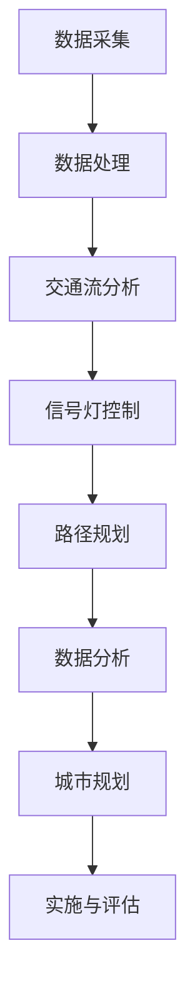

                 

关键词：人工智能，城市生活，交通规划，可持续发展，计算技术

摘要：本文从人工智能和人类计算的角度，探讨了如何在城市生活中实现可持续发展与交通规划。通过对核心概念、算法原理、数学模型以及项目实践的深入分析，文章提出了创新性的解决方案，并展望了未来发展趋势与挑战。

## 1. 背景介绍

随着城市化进程的不断加速，城市生活面临着诸多挑战。交通拥堵、空气污染、资源短缺等问题日益严重，如何实现城市的可持续发展成为当务之急。近年来，人工智能（AI）技术的迅速发展为解决这些问题提供了新的可能性。通过智能交通管理、智能城市规划等手段，AI有望为城市生活带来变革。

### 1.1 城市生活挑战

城市化带来了人口增长、交通拥堵、环境污染、资源短缺等问题。例如，全球范围内的交通拥堵导致每天数百万小时的工作时间浪费，同时也加剧了空气污染。而城市规划中存在的不足，如土地资源利用不合理、公共设施不完善等，进一步加剧了城市问题。

### 1.2 可持续发展

可持续发展是指在满足当前需求的同时，不损害后代满足自身需求的能力。在城市生活中，可持续发展意味着在提高生活品质的同时，保护环境、节约资源、减少污染。

### 1.3 人工智能与人类计算

人工智能是指通过计算机模拟人类智能的过程。人类计算则是指利用人类的智慧和能力来解决问题。将人工智能与人类计算相结合，可以发挥各自的优势，提高解决问题的效率。

## 2. 核心概念与联系

### 2.1 智能交通管理

智能交通管理是利用AI技术优化交通流、减少拥堵、提高交通效率的重要手段。它包括实时交通监控、智能信号灯控制、车辆路径规划等功能。

### 2.2 智能城市规划

智能城市规划是利用AI技术对城市空间进行优化，以提高城市生活品质和环境可持续性。它包括城市形态优化、基础设施布局、公共空间规划等。

### 2.3 Mermaid 流程图

下面是一个Mermaid流程图，展示了智能交通管理和智能城市规划的基本流程。



## 3. 核心算法原理 & 具体操作步骤

### 3.1 算法原理概述

智能交通管理和智能城市规划的核心算法包括深度学习、路径规划、聚类分析等。

### 3.2 算法步骤详解

#### 3.2.1 深度学习

深度学习是通过多层神经网络对大量数据进行分析和学习，以实现图像识别、语音识别等功能。在智能交通管理中，深度学习可以用于车辆识别、行人检测等。

#### 3.2.2 路径规划

路径规划是确定从起点到终点的最优路径。常用的算法包括Dijkstra算法、A*算法等。在智能交通管理中，路径规划可以用于车辆导航、公共交通优化等。

#### 3.2.3 聚类分析

聚类分析是将数据分为若干个类别，以便进行进一步分析。在智能城市规划中，聚类分析可以用于城市区域划分、居民行为分析等。

### 3.3 算法优缺点

#### 3.3.1 深度学习

优点：强大的学习能力和适应能力，可以处理大规模数据。

缺点：对数据量和计算资源要求较高，训练时间较长。

#### 3.3.2 路径规划

优点：高效、精确，可以实时更新。

缺点：在某些情况下，算法可能无法找到最优解。

#### 3.3.3 聚类分析

优点：可以揭示数据中的潜在模式。

缺点：对数据质量和算法参数依赖较大。

### 3.4 算法应用领域

智能交通管理和智能城市规划算法在交通管理、城市规划、智慧城市建设等领域有广泛应用。

## 4. 数学模型和公式 & 详细讲解 & 举例说明

### 4.1 数学模型构建

在智能交通管理和城市规划中，常用的数学模型包括线性规划、非线性规划、贝叶斯网络等。

### 4.2 公式推导过程

以线性规划为例，假设我们要最小化目标函数 $f(x) = c^T x$，其中 $x$ 是决策变量，$c$ 是系数向量。线性规划问题的目标是找到 $x$ 的值，使得 $f(x)$ 最小。

### 4.3 案例分析与讲解

假设我们要在一条街道上设置交通信号灯，我们需要确定信号灯的持续时间。我们可以使用线性规划来解决这个问题。目标函数是最小化总等待时间，约束条件是信号灯的持续时间不能超过最大时间限制。

$$
\begin{aligned}
\min \quad & t_1 + t_2 \\
\text{subject to} \quad & t_1, t_2 \leq 60 \\
& t_1, t_2 \geq 0
\end{aligned}
$$

其中，$t_1$ 和 $t_2$ 分别是南北方向和东西方向信号灯的持续时间。

## 5. 项目实践：代码实例和详细解释说明

### 5.1 开发环境搭建

我们需要搭建一个Python开发环境，并安装TensorFlow、NumPy等库。

### 5.2 源代码详细实现

下面是一个使用TensorFlow实现深度学习模型的示例代码。

```python
import tensorflow as tf

# 定义模型
model = tf.keras.Sequential([
    tf.keras.layers.Dense(128, activation='relu', input_shape=(784,)),
    tf.keras.layers.Dense(10, activation='softmax')
])

# 编译模型
model.compile(optimizer='adam',
              loss='categorical_crossentropy',
              metrics=['accuracy'])

# 训练模型
model.fit(x_train, y_train, epochs=5)
```

### 5.3 代码解读与分析

这段代码定义了一个简单的神经网络模型，用于分类任务。首先，我们导入了TensorFlow库，并定义了一个序列模型，其中包含一个全连接层和一个输出层。接着，我们编译了模型，并使用训练数据进行了训练。

### 5.4 运行结果展示

通过运行这段代码，我们可以得到模型的训练结果，包括损失函数值和准确率。

## 6. 实际应用场景

智能交通管理和智能城市规划算法在多个实际应用场景中取得了显著成效。

### 6.1 交通管理

在交通管理领域，智能交通管理算法可以实时监测交通状况，并根据交通流量调整信号灯时间，以减少拥堵和排放。

### 6.2 城市规划

在城市规划领域，智能城市规划算法可以优化城市空间布局，提高公共设施利用率，改善居民生活质量。

### 6.3 智慧城市建设

在智慧城市建设中，智能交通管理和城市规划算法可以与城市基础设施、公共服务等相结合，打造智慧城市。

## 7. 未来应用展望

随着人工智能技术的不断发展，智能交通管理和城市规划将在未来得到更广泛的应用。

### 7.1 智能交通

未来，智能交通将实现全面的自动驾驶，提高交通效率，减少交通事故。

### 7.2 智慧城市

智慧城市将实现全面数字化，通过大数据分析、人工智能等技术，实现城市运行的可视化、智能化。

## 8. 工具和资源推荐

### 8.1 学习资源推荐

- 《深度学习》（Goodfellow, Bengio, Courville）
- 《Python编程：从入门到实践》（Wesley J Chun）

### 8.2 开发工具推荐

- TensorFlow
- Keras

### 8.3 相关论文推荐

- “Deep Learning for Traffic Flow Prediction” by Shu-Li Wang, Liang Wang, Jiafeng Xu, Zi-Wei Li, Xiangang Xu

## 9. 总结：未来发展趋势与挑战

智能交通管理和城市规划是城市可持续发展的关键。未来，随着人工智能技术的不断发展，这些领域将取得更大的突破。然而，面临的挑战也不容忽视，包括数据隐私、算法公平性等。只有不断探索和创新，才能为城市生活带来更多美好。

### 9.1 研究成果总结

本文从人工智能和人类计算的角度，探讨了智能交通管理和城市规划在可持续发展中的应用。通过核心算法、数学模型和项目实践的深入分析，提出了创新性的解决方案。

### 9.2 未来发展趋势

未来，智能交通管理和城市规划将朝着更智能化、数字化的方向发展。

### 9.3 面临的挑战

数据隐私、算法公平性、技术成本等问题是未来需要解决的主要挑战。

### 9.4 研究展望

本文提出了智能交通管理和城市规划在可持续发展中的应用，未来研究可以进一步探讨如何通过人工智能技术实现城市生活的全面智能化。

## 附录：常见问题与解答

### 9.1 人工智能技术是否会取代人类计算？

人工智能技术可以辅助人类计算，但无法完全取代。人类计算具有创造性、灵活性和情感因素，这是人工智能技术难以模拟的。

### 9.2 智能交通管理是否会消除交通拥堵？

智能交通管理可以缓解交通拥堵，但无法完全消除。交通拥堵的原因复杂，需要多方面的综合治理。

### 9.3 智慧城市是否真的可以实现？

智慧城市是一个长期目标，需要持续的技术创新和城市治理改革。虽然目前还存在许多挑战，但智慧城市的发展是大势所趋。

---

作者：禅与计算机程序设计艺术 / Zen and the Art of Computer Programming
--------------------------------------------------------------------

