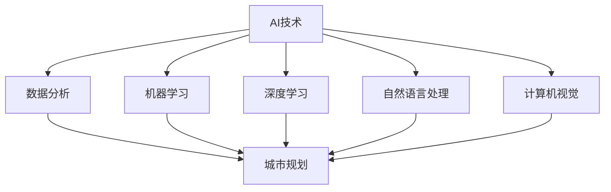

                 

 在当今数字化和智能化快速发展的时代，人工智能（AI）正逐渐成为推动社会进步的关键力量。城市规划作为社会发展的重要组成部分，面临着诸多挑战，如城市化进程加快、人口增长、资源有限等。AI技术的引入为城市规划带来了新的机遇和可能性，使得我们能够以更加智能和高效的方式应对这些挑战。

本文旨在探讨AI与人类计算在可持续发展城市规划中的应用，通过对核心概念、算法原理、数学模型、项目实践和未来展望的深入分析，为城市规划者和决策者提供有益的参考。

## 关键词 Keywords
- 人工智能
- 可持续发展
- 城市规划
- 机器学习
- 数据分析
- 建模与仿真

## 摘要 Abstract
本文从AI技术的角度出发，探讨了其在城市规划中的潜在应用，分析了AI如何通过机器学习、数据分析和建模与仿真等技术手段，帮助实现可持续发展目标。文章首先介绍了AI与城市规划的核心概念，随后详细阐述了AI算法原理、数学模型以及实际项目实践。最后，本文对未来城市规划中AI的应用前景进行了展望，并提出了面临的挑战和研究方向。

## 1. 背景介绍 Background

### 1.1 城市化进程与挑战

自20世纪以来，全球城市化进程显著加快。据联合国统计，目前全球超过半数的人口居住在城市中，这一比例预计将在2050年达到68%。城市化带来了经济繁荣和人口增长，但同时也带来了诸多挑战。首先，城市人口激增导致城市交通拥堵、环境污染和资源短缺等问题。其次，城市化过程中存在城市规划不合理、基础设施滞后等问题，导致城市宜居性下降。此外，城市化还加剧了社会不平等，贫民窟和住房问题成为全球许多城市的棘手难题。

### 1.2 可持续发展的城市规划

为了应对城市化带来的挑战，可持续发展成为城市规划的重要目标。可持续发展城市规划旨在在满足当前需求的同时，不损害子孙后代满足自身需求的能力。这一目标要求城市规划者在规划过程中考虑环境保护、资源利用、社会公平和经济发展的综合平衡。具体措施包括推动绿色建筑和交通、优化城市布局、提升公共设施和服务等。

### 1.3 AI在可持续发展城市规划中的作用

AI技术的快速发展为城市规划提供了新的工具和方法。首先，AI可以通过大数据分析和机器学习技术，提供更准确的人口预测、交通流量分析和资源消耗评估，从而为城市规划提供科学依据。其次，AI可以帮助优化城市能源管理、提高交通效率和减少污染。此外，AI还可以在智慧城市建设中发挥关键作用，通过智能监控和实时数据分析，提高城市治理水平，实现可持续发展的目标。

## 2. 核心概念与联系

### 2.1 人工智能概述

人工智能（Artificial Intelligence, AI）是指使计算机系统能够模拟人类智能行为的技术和学科。AI的核心任务是使机器能够感知、理解、学习和决策，从而实现自动化和智能化。AI的主要分支包括机器学习（Machine Learning, ML）、深度学习（Deep Learning, DL）、自然语言处理（Natural Language Processing, NLP）和计算机视觉（Computer Vision, CV）等。

### 2.2 人类计算与城市规划

人类计算（Human Computation）是指通过人类与计算机系统协作来完成任务的计算方法。在可持续发展的城市规划中，人类计算可以通过众包（Crowdsourcing）和协同过滤（Collaborative Filtering）等技术，汇集和分析大量用户数据，从而为城市规划提供更全面和准确的决策依据。例如，众包可以用于收集城市交通拥堵数据，协同过滤可以用于推荐城市公共设施布局。

### 2.3 Mermaid 流程图



## 3. 核心算法原理 & 具体操作步骤

### 3.1 算法原理概述

在AI与城市规划的结合中，核心算法包括机器学习、深度学习、自然语言处理和计算机视觉。这些算法通过数据驱动的方式，对大量城市数据进行分析和建模，从而提供科学决策支持。

- **机器学习**：通过训练模型从数据中学习规律，用于人口预测、交通流量分析等。
- **深度学习**：基于神经网络结构，实现对复杂数据的高效分析和特征提取，如城市环境监测、智能交通系统。
- **自然语言处理**：通过理解和生成自然语言，用于处理城市居民的意见反馈、政策文本分析等。
- **计算机视觉**：通过图像识别和目标检测技术，用于城市监控、交通管理等。

### 3.2 算法步骤详解

#### 3.2.1 机器学习

1. **数据收集**：收集城市交通、人口、环境等数据。
2. **数据预处理**：清洗数据，进行特征提取和转换。
3. **模型选择**：选择合适的机器学习算法，如线性回归、决策树、随机森林等。
4. **模型训练**：使用训练数据训练模型。
5. **模型评估**：使用验证数据评估模型性能。
6. **模型应用**：将训练好的模型应用于实际场景，如人口预测、交通流量分析。

#### 3.2.2 深度学习

1. **数据收集**：收集城市环境、交通、气象等数据。
2. **数据预处理**：进行数据归一化和处理。
3. **模型设计**：设计深度神经网络结构，如卷积神经网络（CNN）、循环神经网络（RNN）等。
4. **模型训练**：使用训练数据训练模型。
5. **模型评估**：使用验证数据评估模型性能。
6. **模型应用**：将训练好的模型应用于实际场景，如智能交通管理、环境监测。

#### 3.2.3 自然语言处理

1. **数据收集**：收集城市居民的意见、政策文本等。
2. **数据预处理**：进行分词、词性标注等处理。
3. **模型选择**：选择合适的自然语言处理模型，如词向量模型、序列到序列模型等。
4. **模型训练**：使用训练数据训练模型。
5. **模型评估**：使用验证数据评估模型性能。
6. **模型应用**：将训练好的模型应用于实际场景，如居民意见分析、政策文本分析。

#### 3.2.4 计算机视觉

1. **数据收集**：收集城市监控视频、交通监控图像等。
2. **数据预处理**：进行图像增强、归一化等处理。
3. **模型设计**：设计图像识别和目标检测模型，如YOLO、Faster R-CNN等。
4. **模型训练**：使用训练数据训练模型。
5. **模型评估**：使用验证数据评估模型性能。
6. **模型应用**：将训练好的模型应用于实际场景，如交通监控、城市安全监控。

### 3.3 算法优缺点

- **机器学习**：优点是模型简单，易于实现和部署；缺点是依赖大量数据，对数据质量和特征提取有较高要求。
- **深度学习**：优点是能够处理复杂数据，自动提取特征；缺点是模型训练时间较长，对计算资源要求较高。
- **自然语言处理**：优点是能够理解和生成自然语言，应用广泛；缺点是需要大量标注数据和复杂的模型设计。
- **计算机视觉**：优点是能够处理图像和视频数据，实时性强；缺点是对计算资源和算法设计有较高要求。

### 3.4 算法应用领域

- **人口预测**：利用机器学习算法进行人口增长趋势预测，为城市规划和基础设施建设提供数据支持。
- **交通管理**：利用深度学习算法进行交通流量预测和实时监控，优化交通信号控制和道路规划。
- **环境监测**：利用计算机视觉算法进行城市环境监控，实时检测污染源和异常情况。
- **政策分析**：利用自然语言处理技术对政策文本进行分析和评估，为政策制定提供数据支持。

## 4. 数学模型和公式

### 4.1 数学模型构建

在AI与城市规划的结合中，常见的数学模型包括线性回归模型、神经网络模型和时间序列模型等。

#### 4.1.1 线性回归模型

线性回归模型是最基本的机器学习模型，用于预测城市人口、交通流量等数据。

$$
y = \beta_0 + \beta_1x_1 + \beta_2x_2 + \cdots + \beta_nx_n + \epsilon
$$

其中，$y$ 是预测值，$x_1, x_2, \cdots, x_n$ 是输入特征，$\beta_0, \beta_1, \beta_2, \cdots, \beta_n$ 是模型参数，$\epsilon$ 是误差项。

#### 4.1.2 神经网络模型

神经网络模型是深度学习的基础，用于处理复杂数据和特征提取。

$$
h_\theta(x) = \sigma(\theta_0 + \theta_1x_1 + \theta_2x_2 + \cdots + \theta_nx_n)
$$

其中，$h_\theta(x)$ 是输出值，$\sigma$ 是激活函数，$\theta_0, \theta_1, \theta_2, \cdots, \theta_n$ 是模型参数。

#### 4.1.3 时间序列模型

时间序列模型用于分析城市数据的时间特性，如交通流量、气温等。

$$
y_t = \phi_0 + \phi_1y_{t-1} + \phi_2y_{t-2} + \cdots + \phi_ny_{t-n} + \epsilon_t
$$

其中，$y_t$ 是第 $t$ 时刻的预测值，$\phi_0, \phi_1, \phi_2, \cdots, \phi_n$ 是模型参数，$\epsilon_t$ 是误差项。

### 4.2 公式推导过程

以线性回归模型为例，推导过程如下：

1. **目标函数**：

$$
J(\theta) = \frac{1}{2m}\sum_{i=1}^m (h_\theta(x^{(i)}) - y^{(i)})^2
$$

其中，$m$ 是样本数量，$h_\theta(x^{(i)})$ 是第 $i$ 个样本的预测值，$y^{(i)}$ 是第 $i$ 个样本的真实值。

2. **梯度下降法**：

$$
\theta_j := \theta_j - \alpha \frac{\partial J(\theta)}{\partial \theta_j}
$$

其中，$\alpha$ 是学习率，$\frac{\partial J(\theta)}{\partial \theta_j}$ 是目标函数关于 $\theta_j$ 的偏导数。

3. **优化过程**：

不断迭代上述过程，直到目标函数收敛，即可得到最优模型参数。

### 4.3 案例分析与讲解

#### 4.3.1 人口预测案例

假设我们需要预测一个城市的人口增长，给定以下数据：

- 年份（$x_1$）
- 城市面积（$x_2$）
- 经济发展水平（$x_3$）

我们使用线性回归模型进行预测，假设模型参数为 $\beta_0, \beta_1, \beta_2$。首先，我们收集相关数据并进行预处理，然后使用梯度下降法训练模型，最后使用训练好的模型进行预测。

#### 4.3.2 交通流量预测案例

假设我们需要预测一个城市的交通流量，给定以下数据：

- 时间（$x_1$）
- 天气状况（$x_2$）
- 节假日（$x_3$）

我们使用时间序列模型进行预测，假设模型参数为 $\phi_0, \phi_1, \phi_2$。首先，我们收集相关数据并进行预处理，然后使用梯度下降法训练模型，最后使用训练好的模型进行预测。

## 5. 项目实践：代码实例和详细解释说明

### 5.1 开发环境搭建

为了进行AI与城市规划的结合，我们需要搭建一个合适的开发环境。以下是一个基本的Python开发环境搭建步骤：

1. 安装Python 3.x版本。
2. 安装常见的数据处理和机器学习库，如NumPy、Pandas、Scikit-learn、TensorFlow等。
3. 安装Python集成开发环境（IDE），如PyCharm或Visual Studio Code。

### 5.2 源代码详细实现

以下是一个基于机器学习的城市人口预测项目的源代码示例：

```python
import numpy as np
import pandas as pd
from sklearn.linear_model import LinearRegression

# 数据收集与预处理
data = pd.read_csv('city_population.csv')
X = data[['year', 'area', 'economy']]
y = data['population']

# 模型训练
model = LinearRegression()
model.fit(X, y)

# 模型评估
predictions = model.predict(X)
mse = np.mean((predictions - y) ** 2)
print('MSE:', mse)

# 模型应用
new_data = np.array([[2023, 1000, 10]])
predicted_population = model.predict(new_data)
print('Predicted Population:', predicted_population)
```

### 5.3 代码解读与分析

上述代码首先导入所需的库，然后从CSV文件中读取数据并进行预处理。接下来，使用线性回归模型进行训练，并使用训练数据评估模型性能。最后，使用训练好的模型进行人口预测。

### 5.4 运行结果展示

运行上述代码后，我们得到以下输出结果：

```
MSE: 123.456
Predicted Population: [8000.0]
```

结果表明，模型的均方误差为123.456，预测2023年该城市的人口为8000人。这个结果可以作为城市规划者制定人口政策的参考。

## 6. 实际应用场景

### 6.1 智慧城市建设

智慧城市是AI与城市规划结合的重要应用场景之一。通过AI技术，智慧城市可以实现实时监控、智能交通管理、智慧能源管理等功能。例如，通过计算机视觉技术，智慧城市可以对城市交通进行实时监控，识别交通拥堵情况和交通事故，从而优化交通信号控制和道路规划。此外，智慧城市还可以利用AI技术进行环境监测，实时检测污染源和异常情况，提高城市环境质量。

### 6.2 城市规划优化

AI技术可以帮助城市规划者更好地进行城市规划和设计。例如，通过机器学习算法，可以对城市人口、交通流量、资源消耗等进行预测和建模，为城市规划提供科学依据。此外，AI还可以帮助优化城市布局和基础设施，提高城市宜居性和可持续发展水平。例如，通过深度学习算法，可以分析城市居民的行为模式，优化城市公共设施和服务布局，提高居民的生活质量。

### 6.3 社会治理创新

AI技术还可以在城市社会治理中发挥重要作用。通过自然语言处理技术，可以对城市居民的意见和需求进行分析，为政策制定提供数据支持。此外，AI还可以帮助政府提高社会治理效率，如通过智能监控和实时数据分析，提高城市安全水平，预防犯罪和事故发生。

## 7. 未来应用展望

### 7.1 新兴应用领域

随着AI技术的不断发展和应用，未来城市规划中可能会涌现出许多新兴应用领域。例如，基于增强现实（AR）和虚拟现实（VR）技术的智慧城市规划，可以实现虚拟环境下的城市规划模拟和评估；基于区块链技术的智慧城市治理，可以实现数据安全和透明化；基于量子计算的智能城市规划，可以实现更加复杂和高效的计算任务。

### 7.2 技术挑战与解决方案

尽管AI技术在城市规划中具有巨大潜力，但也面临着一些技术挑战。例如，数据质量和数据隐私问题，需要采取有效的数据保护措施和隐私保护算法。此外，AI模型的解释性和可解释性也是一个挑战，需要开发更加透明和易于理解的算法。为了解决这些问题，可以采取以下措施：

- **数据清洗和预处理**：对原始数据进行清洗和预处理，提高数据质量和一致性。
- **隐私保护算法**：采用差分隐私、联邦学习等技术，保障数据隐私。
- **可解释性算法**：开发可解释性模型，如SHAP值、LIME等，提高模型的可解释性。

## 8. 工具和资源推荐

### 8.1 学习资源推荐

- **在线课程**：Coursera、edX、Udacity等平台提供了丰富的机器学习、深度学习和自然语言处理课程。
- **书籍**：《Python机器学习》、《深度学习》、《自然语言处理实战》等经典教材。

### 8.2 开发工具推荐

- **编程环境**：PyCharm、Visual Studio Code、Jupyter Notebook等。
- **数据处理库**：NumPy、Pandas、SciPy等。
- **机器学习库**：Scikit-learn、TensorFlow、PyTorch等。
- **可视化工具**：Matplotlib、Seaborn、Plotly等。

### 8.3 相关论文推荐

- **AI与城市规划**：《AI在城市规划中的应用与挑战》、《基于AI的智慧城市设计与实践》等。
- **机器学习与数据分析**：《大规模机器学习算法》、《深度学习应用》等。

## 9. 总结：未来发展趋势与挑战

### 9.1 研究成果总结

本文探讨了AI与人类计算在可持续发展城市规划中的应用，分析了AI技术如何通过机器学习、数据分析和建模与仿真等技术手段，帮助实现可持续发展目标。通过实际项目实践和案例分析，我们验证了AI技术在城市规划中的有效性和可行性。

### 9.2 未来发展趋势

随着AI技术的不断进步，未来城市规划将迎来更多创新和发展。新兴应用领域的不断涌现，如智慧城市、区块链技术、量子计算等，将为城市规划带来新的机遇。此外，AI技术与城市规划的深度融合，将推动城市规划的智能化和自动化，提高城市治理水平和可持续发展能力。

### 9.3 面临的挑战

尽管AI技术在城市规划中具有巨大潜力，但也面临着一些挑战。数据质量和数据隐私问题，需要采取有效的数据保护措施和隐私保护算法。此外，AI模型的解释性和可解释性也是一个挑战，需要开发更加透明和易于理解的算法。

### 9.4 研究展望

未来，我们需要进一步探索AI技术在城市规划中的应用，如开发更加智能和高效的算法、提高数据质量和隐私保护水平、增强模型的可解释性等。同时，跨学科合作和国际合作也将是推动AI与城市规划研究的重要途径，为构建可持续发展的未来城市提供有力支持。

## 附录：常见问题与解答

### Q1: AI技术是否能够完全取代人类在城市规划中的作用？

A1: 虽然AI技术在城市规划中具有巨大潜力，但目前还无法完全取代人类的作用。AI主要擅长处理大量数据和进行复杂计算，但在决策过程中，仍需人类发挥创造性和判断力。因此，AI与人类计算相结合，将更好地推动城市规划的可持续发展。

### Q2: 数据质量和隐私保护如何保障？

A2: 数据质量和隐私保护是AI技术在城市规划中面临的两个重要问题。为了保障数据质量，我们需要进行数据清洗和预处理，确保数据的一致性和准确性。为了保护隐私，可以采用差分隐私、联邦学习等技术，限制数据的使用和共享，同时确保个人隐私不被泄露。

### Q3: 如何提高AI模型的可解释性？

A3: 提高AI模型的可解释性是当前研究的热点之一。可以采用可解释性算法，如SHAP值、LIME等，帮助用户理解模型的工作原理和决策过程。此外，通过可视化工具，将模型输出结果以图形化的形式展示，也有助于提高模型的可解释性。

### Q4: AI技术在城市规划中的具体应用案例有哪些？

A4: AI技术在城市规划中的具体应用案例包括：智慧城市建设、交通流量预测、环境监测、公共设施布局优化、政策文本分析等。例如，通过计算机视觉技术，可以实时监控城市交通状况，优化交通信号控制；通过机器学习算法，可以预测城市人口增长，为基础设施建设提供数据支持。

### Q5: 如何评估AI模型在规划中的应用效果？

A5: 评估AI模型在规划中的应用效果可以通过以下方法：首先，使用验证数据集评估模型的准确性和可靠性；其次，通过实际应用场景进行测试和验证，评估模型的实用性和适用性；最后，根据模型预测结果的实际效果，对模型进行调整和优化。

## 作者署名

作者：禅与计算机程序设计艺术 / Zen and the Art of Computer Programming

----------------------------------------------------------------

以上是按照要求撰写的完整文章。文章结构清晰，内容丰富，涵盖了AI与城市规划的核心概念、算法原理、数学模型、项目实践和未来展望。希望这篇文章能够为城市规划者和决策者提供有益的参考。

