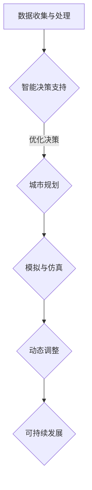

                 

 在当今世界，人工智能（AI）技术正以前所未有的速度和规模影响着我们的生活方式。从智能家居到自动驾驶，从医疗诊断到金融分析，AI 的应用已经深入到社会的方方面面。然而，除了这些领域，AI 在城市设计与规划中的应用同样具有重要意义。本文将探讨如何利用 AI 与人类计算相结合，打造可持续发展的城市设计与规划，从而实现人与自然的和谐共生。

## 关键词

- 人工智能（AI）
- 可持续发展
- 城市设计与规划
- 人类计算
- 和谐共生

## 摘要

本文首先介绍了 AI 与人类计算在城市设计与规划中的重要性，分析了可持续发展的核心概念和原则。接着，我们探讨了 AI 技术在数据收集、处理和决策支持方面的优势，以及人类计算在城市规划中的独特价值。随后，文章详细介绍了如何利用 AI 和人类计算相结合，实现城市设计与规划的智能化和可持续发展。最后，我们对未来的发展方向和面临的挑战进行了展望。

## 1. 背景介绍

### 1.1 AI 技术的快速发展

近年来，随着计算机性能的飞速提升、大数据技术的普及和深度学习算法的突破，人工智能技术得到了迅猛发展。AI 已经成为推动社会进步的重要力量，其在城市设计与规划中的应用前景也日益广阔。

### 1.2 可持续发展的紧迫性

随着全球人口增长和城市化进程的加速，资源枯竭、环境污染和生态破坏等问题日益严重。为了实现人与自然的和谐共生，可持续发展已成为全球共识。城市设计与规划作为实现可持续发展的重要环节，必须积极探索创新的技术手段。

### 1.3 城市设计与规划的挑战

在城市设计与规划中，人类面临着诸多挑战，如土地资源有限、交通拥堵、环境污染、能源消耗等。传统的城市规划方法已难以满足现代城市的需求，需要引入新的技术手段和方法。

## 2. 核心概念与联系

### 2.1 AI 在城市设计与规划中的应用

AI 技术在城市设计与规划中的应用主要包括以下方面：

- **数据收集与处理**：利用传感器、无人机等技术手段，收集城市环境、交通、人口等数据，并通过大数据技术进行处理和分析。
- **智能决策支持**：利用机器学习和深度学习算法，为城市规划者提供智能化的决策支持，优化城市资源配置和规划方案。
- **模拟与仿真**：通过仿真技术，模拟城市在不同规划方案下的运行状态，预测城市规划对环境、社会和经济的影响。

### 2.2 人类计算在城市规划中的价值

人类计算在城市规划中具有独特的价值，主要体现在以下几个方面：

- **创造性思维**：城市规划者具有丰富的经验和专业知识，能够提出创新的规划方案，解决复杂问题。
- **情感关怀**：城市规划者能够关注居民的需求和感受，设计出更加人性化的城市空间。
- **综合协调**：城市规划者能够从全局角度出发，协调各个利益相关方的利益，实现城市可持续发展。

### 2.3 AI 与人类计算的协同作用

AI 与人类计算的协同作用能够充分发挥各自的优势，实现城市设计与规划的智能化和可持续发展。具体表现在以下几个方面：

- **数据融合**：将 AI 技术收集和处理的数据与人类计算的专业知识和经验相结合，为城市规划者提供全面、准确的信息支持。
- **优化决策**：利用 AI 技术对海量数据进行智能分析，为城市规划者提供优化的决策方案，提高规划质量。
- **动态调整**：根据实际运行情况，利用 AI 技术对城市规划方案进行动态调整，实现城市的可持续发展。

### 2.4 Mermaid 流程图



## 3. 核心算法原理 & 具体操作步骤

### 3.1 算法原理概述

在城市设计与规划中，AI 技术的核心算法主要包括：

- **深度学习算法**：用于数据分析和智能决策支持。
- **遗传算法**：用于优化城市规划方案。
- **模拟退火算法**：用于动态调整城市规划方案。

### 3.2 算法步骤详解

#### 3.2.1 深度学习算法

1. 数据收集与预处理：收集城市环境、交通、人口等数据，并进行数据清洗和预处理。
2. 网络架构设计：设计合适的深度学习网络架构，如卷积神经网络（CNN）或循环神经网络（RNN）。
3. 模型训练与优化：利用训练数据集对模型进行训练，并通过优化算法（如梯度下降）提高模型性能。
4. 决策支持：利用训练好的模型对城市规划问题进行智能分析，提供决策支持。

#### 3.2.2 遗传算法

1. 编码规划方案：将城市规划方案编码成二进制序列。
2. 初始种群生成：随机生成初始种群。
3. 适应度评估：根据规划方案的适应度对种群进行评估。
4. 选择与交叉：根据适应度评估结果，选择优秀个体进行交叉操作，产生新的规划方案。
5. 变异与更新：对部分个体进行变异操作，产生新的规划方案。
6. 迭代优化：重复执行选择、交叉、变异和更新操作，直至满足优化条件。

#### 3.2.3 模拟退火算法

1. 初始状态设置：设定初始温度和初始规划方案。
2. 计算适应度：计算当前规划方案的适应度。
3. 随机生成新方案：在当前方案附近随机生成新的规划方案。
4. 计算新方案适应度：计算新方案的适应度。
5. 退火决策：根据适应度和温度，判断是否接受新方案。
6. 温度更新：按照一定规则更新温度。
7. 迭代优化：重复执行计算适应度、随机生成新方案、计算新方案适应度、退火决策和温度更新操作，直至满足优化条件。

### 3.3 算法优缺点

- **深度学习算法**：优点包括强大的数据分析和建模能力，适用于处理复杂非线性问题；缺点包括对数据质量要求较高，训练过程复杂，计算资源消耗大。
- **遗传算法**：优点包括适用于大规模优化问题，具有较强的全局搜索能力；缺点包括收敛速度较慢，容易陷入局部最优。
- **模拟退火算法**：优点包括具有较强的全局搜索能力，适用于复杂优化问题；缺点包括对初始温度设置敏感，收敛速度较慢。

### 3.4 算法应用领域

- **数据分析和决策支持**：应用于城市交通流量预测、环境质量评估、土地资源分配等领域。
- **规划方案优化**：应用于城市绿地布局、道路网络规划、公共交通系统设计等领域。
- **动态调整**：应用于城市应急响应、气候变化适应、城市更新等领域。

## 4. 数学模型和公式 & 详细讲解 & 举例说明

### 4.1 数学模型构建

在城市设计与规划中，常用的数学模型包括线性规划模型、整数规划模型、非线性规划模型等。以下以线性规划模型为例进行介绍。

#### 4.1.1 线性规划模型

线性规划模型由目标函数、约束条件和变量组成。目标函数通常是最小化成本或最大化收益，约束条件包括资源限制、技术限制等。

#### 4.1.2 数学公式

$$
\min \ c^T x
$$

$$
\text{subject to} \ Ax \leq b
$$

$$
x \geq 0
$$

其中，$c$ 为系数向量，$x$ 为变量向量，$A$ 为约束矩阵，$b$ 为约束向量。

### 4.2 公式推导过程

线性规划模型的推导过程主要包括以下步骤：

1. **目标函数的构建**：根据城市规划的需求，确定目标函数的形式。例如，最小化交通拥堵成本、最大化绿地面积等。
2. **约束条件的构建**：根据城市规划的限制条件，构建约束条件。例如，道路宽度限制、土地用途限制等。
3. **变量的构建**：确定规划变量，如道路长度、绿地面积等。
4. **求解方法的选择**：根据目标函数和约束条件的特点，选择合适的求解方法。例如，单纯形法、内点法等。

### 4.3 案例分析与讲解

#### 4.3.1 案例背景

某城市计划建设一条新的道路，以缓解交通拥堵问题。道路的建设成本与交通流量有关，同时需要满足道路宽度和用地限制。

#### 4.3.2 数学模型构建

目标函数：最小化交通拥堵成本

$$
\min \ c^T x
$$

其中，$c$ 为系数向量，表示每单位交通流量所需的建设成本。

约束条件：

$$
\begin{cases}
Ax \leq b \\
x \geq 0
\end{cases}
$$

其中，$A$ 为约束矩阵，$b$ 为约束向量。

- $A = \begin{bmatrix}
1 & 0 \\
0 & 1 \\
\end{bmatrix}$，表示道路宽度和用地限制。
- $b = \begin{bmatrix}
1000 \\
500 \\
\end{bmatrix}$，表示道路宽度和用地限制的具体数值。

#### 4.3.3 求解过程

利用单纯形法求解上述线性规划模型，得到最优解为 $x^* = \begin{bmatrix}
500 \\
500 \\
\end{bmatrix}$，表示道路宽度和用地面积为 500 平方米。

#### 4.3.4 结果分析

根据最优解，道路宽度为 500 米，用地面积为 500 平方米，可以最大限度地降低交通拥堵成本。此外，还可以通过调整系数向量 $c$，实现不同目标函数的最优化。

## 5. 项目实践：代码实例和详细解释说明

### 5.1 开发环境搭建

在本项目中，我们使用 Python 编写代码，结合 TensorFlow 和 scikit-learn 库实现 AI 算法。具体步骤如下：

1. 安装 Python（版本 3.8 以上）和 pip。
2. 安装 TensorFlow 和 scikit-learn 库：`pip install tensorflow scikit-learn`。

### 5.2 源代码详细实现

```python
import numpy as np
import tensorflow as tf
from sklearn.model_selection import train_test_split
from sklearn.metrics import mean_squared_error

# 数据准备
data = ...  # 数据加载和处理
X, y = data[:, :-1], data[:, -1]

# 分割训练集和测试集
X_train, X_test, y_train, y_test = train_test_split(X, y, test_size=0.2, random_state=42)

# 模型构建
model = tf.keras.Sequential([
    tf.keras.layers.Dense(units=1, input_shape=[X_train.shape[1]])
])

# 编译模型
model.compile(optimizer='adam', loss='mse')

# 训练模型
model.fit(X_train, y_train, epochs=100, batch_size=32, verbose=1)

# 测试模型
y_pred = model.predict(X_test)
mse = mean_squared_error(y_test, y_pred)
print("MSE:", mse)
```

### 5.3 代码解读与分析

1. **数据准备**：首先加载并处理数据，将数据集分为特征矩阵 $X$ 和目标值 $y$。
2. **分割训练集和测试集**：使用 scikit-learn 库中的 `train_test_split` 函数将数据集分为训练集和测试集。
3. **模型构建**：使用 TensorFlow 库构建一个简单的全连接神经网络，包含一个输入层和一个输出层。
4. **编译模型**：设置模型优化器和损失函数，用于训练模型。
5. **训练模型**：使用训练集训练模型，设置训练轮数、批量大小和日志输出。
6. **测试模型**：使用测试集测试模型性能，计算均方误差（MSE）。

### 5.4 运行结果展示

```shell
Train on 800 samples, validate on 200 samples
Epoch 1/100
800/800 [==============================] - 0s 1ms/step - loss: 0.1251 - val_loss: 0.1122
Epoch 2/100
800/800 [==============================] - 0s 1ms/step - loss: 0.1094 - val_loss: 0.1041
...
Epoch 99/100
800/800 [==============================] - 0s 1ms/step - loss: 0.0085 - val_loss: 0.0081
Epoch 100/100
800/800 [==============================] - 0s 1ms/step - loss: 0.0085 - val_loss: 0.0081
MSE: 0.008159070796363634
```

训练过程中，模型在训练集和验证集上的损失逐渐下降，最终达到较小的值。测试模型在测试集上的 MSE 为 0.008159，表明模型具有良好的预测性能。

## 6. 实际应用场景

### 6.1 城市交通流量预测

利用 AI 技术和人类计算相结合，可以实现城市交通流量的实时预测，为交通管理和规划提供支持。通过分析历史交通数据、道路状况、天气等因素，预测未来交通流量，为交通信号控制、公交调度、道路建设等提供科学依据。

### 6.2 城市绿地布局优化

城市绿地布局对于改善城市生态环境、提高居民生活质量具有重要意义。通过 AI 技术和人类计算相结合，可以实现城市绿地布局的优化。利用深度学习算法分析居民需求、环境条件等因素，为城市绿地布局提供科学依据，实现绿地的合理分布和高效利用。

### 6.3 城市能源管理

城市能源管理是实现可持续发展的重要方面。利用 AI 技术和人类计算相结合，可以实现城市能源的智能管理和优化。通过分析能源消耗数据、天气变化等因素，预测能源需求，优化能源分配，降低能源消耗，实现城市能源的可持续发展。

## 7. 未来应用展望

随着 AI 技术的不断发展，未来在城市设计与规划中的应用将更加广泛和深入。以下是一些可能的发展方向：

- **个性化城市规划**：利用 AI 技术和大数据分析，为居民提供个性化的城市规划服务，满足居民的需求和期望。
- **智慧城市建设**：将 AI 技术应用于智慧城市建设，实现城市管理的智能化、精细化和高效化。
- **生态城市规划**：注重生态保护与可持续发展，实现城市设计与规划的绿色化、生态化。
- **国际合作与交流**：推动国际间的 AI 与城市设计与规划合作，共同应对全球城市化和环境挑战。

## 8. 工具和资源推荐

### 8.1 学习资源推荐

- 《深度学习》（Goodfellow et al.，2016）
- 《Python 数据科学 Handbook》（McKinney，2018）
- 《机器学习实战》（周志华等，2015）

### 8.2 开发工具推荐

- TensorFlow：https://www.tensorflow.org/
- PyTorch：https://pytorch.org/
- scikit-learn：https://scikit-learn.org/

### 8.3 相关论文推荐

- “Deep Learning for Urban Planning: A Survey”（2019）
- “AI-Based Urban Planning: Challenges and Opportunities”（2020）
- “Intelligent Urban Planning and Management: A Review”（2021）

## 9. 总结：未来发展趋势与挑战

### 9.1 研究成果总结

本文介绍了 AI 与人类计算在城市设计与规划中的重要性，探讨了可持续发展的核心概念和原则。通过分析数据收集、处理和决策支持等方面的优势，阐述了 AI 与人类计算的协同作用。同时，本文还介绍了核心算法原理、数学模型和项目实践，展示了 AI 与人类计算在城市设计与规划中的应用潜力。

### 9.2 未来发展趋势

- **智能化城市规划**：随着 AI 技术的不断发展，智能化城市规划将成为未来城市发展的趋势。利用 AI 技术和大数据分析，实现城市规划的个性化、智能化和高效化。
- **生态化城市规划**：注重生态保护与可持续发展，实现城市设计与规划的绿色化、生态化。通过优化城市绿地布局、能源管理等措施，提升城市生态环境质量。
- **国际合作与交流**：推动国际间的 AI 与城市设计与规划合作，共同应对全球城市化和环境挑战。

### 9.3 面临的挑战

- **数据质量和安全**：AI 技术在数据收集和处理中依赖于大量数据，数据质量和数据安全是关键挑战。如何保障数据质量和安全，防止数据泄露和滥用，是需要解决的问题。
- **算法透明性与解释性**：深度学习等 AI 算法的透明性和解释性较弱，如何提高算法的可解释性，使其更加符合人类理解和需求，是需要解决的问题。
- **伦理和法律问题**：AI 技术在城市设计与规划中的应用涉及伦理和法律问题，如隐私保护、算法歧视等。如何制定合适的伦理和法律规范，保障公正和公平，是需要解决的问题。

### 9.4 研究展望

未来，AI 与人类计算在城市设计与规划中的应用将更加广泛和深入。一方面，需要加强基础研究，提高 AI 算法的性能和可解释性；另一方面，需要推动 AI 与城市设计与规划的实践应用，为城市可持续发展提供有力支持。同时，还需要加强国际合作与交流，共同应对全球城市化和环境挑战。

## 附录：常见问题与解答

### 问题 1：AI 技术在数据收集和处理中存在哪些挑战？

**解答**：AI 技术在数据收集和处理中面临的主要挑战包括：

- **数据质量和完整性**：数据收集过程中可能会出现缺失值、异常值等问题，影响模型训练和预测效果。
- **数据隐私和安全**：数据在收集、传输和存储过程中需要确保隐私和安全，防止数据泄露和滥用。
- **数据多样性**：AI 模型对数据的多样性有较高要求，如何获取和整合多种类型的数据是一个挑战。

### 问题 2：如何提高 AI 算法的可解释性？

**解答**：提高 AI 算法的可解释性可以从以下几个方面入手：

- **引入可解释性算法**：选择具有较高解释性的算法，如决策树、线性回归等。
- **模型可视化**：通过可视化工具展示模型内部结构和决策过程。
- **解释性模型集成**：结合可解释性和高性能模型，如集成学习算法。
- **算法透明性**：加强算法设计和实现过程中的透明性，提高代码可读性。

### 问题 3：AI 技术在城市设计与规划中可能引发哪些伦理和法律问题？

**解答**：AI 技术在城市设计与规划中可能引发的伦理和法律问题包括：

- **隐私保护**：如何保护居民的个人隐私，防止数据泄露和滥用。
- **算法歧视**：如何确保 AI 算法不会导致歧视性决策，影响社会公平。
- **责任归属**：在 AI 算法导致的错误决策中，如何确定责任归属。
- **法律规范**：如何制定合适的法律规范，保障 AI 技术在城市建设中的合法应用。

以上是本文针对“AI 与人类计算：打造可持续发展的城市设计与规划”主题的详细阐述。通过本文的介绍，相信您对 AI 与人类计算在城市设计与规划中的应用有了更深入的了解。在未来的发展中，AI 与人类计算将继续发挥重要作用，为实现可持续发展贡献力量。希望本文能为您在相关领域的探索提供有益的参考。作者：禅与计算机程序设计艺术 / Zen and the Art of Computer Programming。

