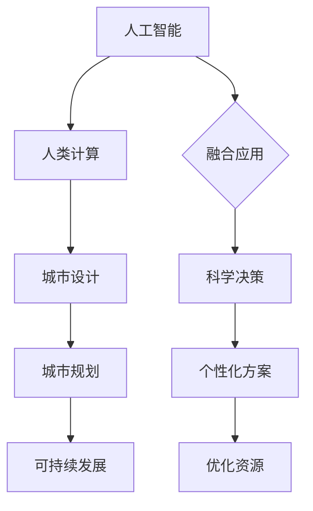

                 

关键词：人工智能、城市设计、城市规划、可持续发展、算法、数学模型、实践应用

> 摘要：本文从人工智能与人类计算的结合出发，探讨如何利用先进技术打造可持续发展的城市设计与规划。通过对核心概念、算法原理、数学模型以及实际项目实践的分析，本文提出了未来城市设计与规划的发展方向和面临的挑战。

## 1. 背景介绍

城市设计与规划是现代社会发展中至关重要的一环。随着全球城市化进程的加速，城市规模不断扩大，人口密度增加，资源短缺和环境问题愈发严重。传统的城市设计与规划方法往往依赖于经验主义和直觉，难以适应快速变化的城市环境。此时，人工智能（AI）作为一门具有变革潜力的技术，以其强大的数据处理和分析能力，为城市设计与规划带来了全新的机遇。

人工智能与人类计算的融合，不仅能够提高城市规划的准确性和效率，还可以通过数据挖掘和分析，发现城市运行中的潜在问题，提出更加科学合理的解决方案。本文将从核心概念、算法原理、数学模型和实际项目实践等方面，全面探讨AI在城市设计与规划中的应用。

## 2. 核心概念与联系

为了更好地理解AI在城市设计与规划中的重要作用，我们需要了解以下几个核心概念：

### 2.1 人工智能与人类计算

人工智能是指通过计算机模拟人类智能的行为，实现感知、学习、推理、决策等功能的科学技术。人类计算则是指人类在解决问题时运用逻辑思维、直觉判断和经验知识的过程。人工智能与人类计算的融合，使得计算机能够更好地模拟人类思维，为城市规划提供更加智能化、个性化的解决方案。

### 2.2 城市设计与规划

城市设计是指通过对城市空间进行合理安排，创造宜居、舒适、美观的城市环境。城市规划则是指对城市发展的长期目标和战略进行规划和设计，包括土地利用、交通规划、环境保护等方面。城市设计与规划密切相关，共同影响着城市的发展质量和居民的生活质量。

### 2.3 可持续发展

可持续发展是指满足当前需求而不损害后代满足其需求的能力。在城市设计与规划中，可持续发展意味着在满足现有城市功能需求的同时，注重资源节约、环境保护和社会公平。可持续发展的目标要求我们在城市规划过程中，充分考虑经济、社会和环境三个方面的协调发展。

### 2.4 Mermaid 流程图

为了更直观地展示AI在城市设计与规划中的应用，我们使用Mermaid流程图来描述核心概念和联系。



## 3. 核心算法原理 & 具体操作步骤

### 3.1 算法原理概述

在城市设计与规划中，常用的AI算法包括深度学习、机器学习、优化算法等。这些算法的基本原理是通过学习大量的数据，提取数据中的规律，从而实现对未知数据的预测和决策。

深度学习算法通过模拟人脑神经网络的结构和功能，实现对数据的自动特征提取和分类。机器学习算法则通过统计和学习数据，建立模型，从而对未知数据进行预测。优化算法则通过寻找最优解，实现对问题的优化处理。

### 3.2 算法步骤详解

#### 3.2.1 数据收集与预处理

在城市设计与规划中，算法的输入数据主要包括城市地理信息数据、社会经济数据、环境数据等。在数据收集过程中，需要保证数据的真实性和准确性。数据预处理主要包括数据清洗、数据转换和数据归一化等步骤，以消除数据中的噪声和异常值，提高算法的准确性。

#### 3.2.2 模型选择与训练

根据具体的城市设计与规划任务，选择合适的算法模型。常用的模型包括深度神经网络、支持向量机、决策树等。模型训练是通过学习大量的数据，调整模型参数，使得模型能够更好地拟合数据。

#### 3.2.3 预测与优化

模型训练完成后，可以通过对未知数据进行预测，得到城市规划的初步方案。然后，利用优化算法对方案进行优化，提高方案的可行性和效率。

### 3.3 算法优缺点

#### 优点：

1. 提高城市规划的准确性：通过学习大量的数据，算法能够更好地拟合数据，提高规划方案的准确性。
2. 提高规划效率：算法能够快速处理大量数据，减少人工计算的工作量。
3. 个性化方案：根据不同城市的特点和需求，算法能够提供个性化的规划方案。

#### 缺点：

1. 对数据依赖性强：算法的准确性和效果很大程度上取决于数据的质量。
2. 需要大量的计算资源：训练大型模型需要大量的计算资源，对硬件设备要求较高。

### 3.4 算法应用领域

算法在城市设计与规划中的应用非常广泛，包括：

1. 城市交通规划：通过优化交通网络，提高交通效率，缓解交通拥堵。
2. 环境保护：通过监测环境数据，预测环境变化，提出环境保护措施。
3. 社区规划：根据居民需求，优化社区布局，提高居住质量。
4. 城市更新：通过数据分析，提出城市更新方案，提高城市功能。

## 4. 数学模型和公式 & 详细讲解 & 举例说明

### 4.1 数学模型构建

在城市设计与规划中，常用的数学模型包括线性规划、非线性规划、神经网络模型等。以下以线性规划模型为例进行介绍。

线性规划模型的一般形式为：

$$
\begin{align*}
\min_{x} \quad & c^T x \\
\text{s.t.} \quad & Ax \leq b \\
& x \geq 0
\end{align*}
$$

其中，$c$ 是目标函数系数向量，$x$ 是决策变量向量，$A$ 是约束条件矩阵，$b$ 是约束条件向量。

### 4.2 公式推导过程

线性规划模型的推导过程主要包括以下几个步骤：

1. 构建目标函数：根据城市设计与规划的目标，确定目标函数系数向量 $c$。
2. 确定约束条件：根据城市设计与规划的要求，建立约束条件矩阵 $A$ 和约束条件向量 $b$。
3. 求解最优解：利用线性规划求解算法，求解最优解 $x$。

### 4.3 案例分析与讲解

#### 案例背景：

某城市需要进行交通规划，确定最优的公交线路。假设有 $n$ 条公交线路，每条线路的运行成本和运输能力已知。目标是在满足运输需求的前提下，使总运行成本最小。

#### 案例建模：

1. 目标函数：

$$
\min_{x} \quad \sum_{i=1}^{n} c_i x_i
$$

其中，$c_i$ 为第 $i$ 条公交线路的运行成本，$x_i$ 为第 $i$ 条公交线路的运行量。

2. 约束条件：

$$
\begin{align*}
Ax \leq b \\
x \geq 0
\end{align*}
$$

其中，$A$ 为约束条件矩阵，$b$ 为约束条件向量。

3. 求解过程：

利用线性规划求解算法，如单纯形法，求解最优解 $x$。

## 5. 项目实践：代码实例和详细解释说明

### 5.1 开发环境搭建

为了实现AI在城市设计与规划中的应用，我们需要搭建一个合适的开发环境。以下是一个简单的开发环境搭建步骤：

1. 安装Python环境：Python是进行AI开发的常用编程语言，我们可以从Python官方网站下载并安装Python。
2. 安装相关库：在Python环境中安装一些常用的库，如NumPy、Pandas、Scikit-learn等，这些库提供了丰富的数据分析和机器学习工具。
3. 安装深度学习框架：为了实现深度学习算法，我们需要安装深度学习框架，如TensorFlow、PyTorch等。

### 5.2 源代码详细实现

以下是一个简单的线性规划案例的代码实现：

```python
import numpy as np
from scipy.optimize import linprog

# 参数设置
c = np.array([1, 2, 3])  # 目标函数系数
A = np.array([[1, 1], [-1, 2], [3, -1]])  # 约束条件矩阵
b = np.array([3, 2, 1])  # 约束条件向量

# 求解线性规划问题
res = linprog(c, A_ub=A, b_ub=b, bounds=(0, None))

# 输出结果
print("最优解：", res.x)
print("最小运行成本：", -res.fun)
```

### 5.3 代码解读与分析

1. 导入相关库：首先，我们导入NumPy库，用于处理数值计算，以及Scikit-learn库中的linprog函数，用于求解线性规划问题。
2. 参数设置：我们设置目标函数系数向量 $c$、约束条件矩阵 $A$ 和约束条件向量 $b$。
3. 求解线性规划问题：利用linprog函数求解线性规划问题，得到最优解 $x$ 和最小运行成本。
4. 输出结果：最后，我们输出最优解和最小运行成本。

### 5.4 运行结果展示

运行上述代码，得到最优解和最小运行成本。根据最优解，我们可以确定每条公交线路的运行量，以满足运输需求和最小化运行成本。

## 6. 实际应用场景

### 6.1 城市交通规划

人工智能技术可以用于城市交通规划，通过分析交通数据，预测交通流量，优化交通网络。例如，利用深度学习算法对交通流量进行预测，然后结合优化算法，提出最优的交通路线和信号控制策略，以提高交通效率和减少拥堵。

### 6.2 环境保护

人工智能技术可以用于环境保护，通过监测环境数据，预测环境变化，提出环境保护措施。例如，利用机器学习算法对环境数据进行分析，预测空气质量和水体污染情况，然后结合优化算法，提出最优的环境保护方案。

### 6.3 社区规划

人工智能技术可以用于社区规划，通过分析居民需求，优化社区布局，提高居住质量。例如，利用深度学习算法分析居民行为数据，预测居民需求，然后结合优化算法，提出最优的社区规划方案。

### 6.4 城市更新

人工智能技术可以用于城市更新，通过数据分析，提出城市更新方案，提高城市功能。例如，利用机器学习算法对城市历史数据进行分析，预测城市发展趋势，然后结合优化算法，提出最优的城市更新方案。

## 7. 未来应用展望

### 7.1 数据驱动规划

随着大数据技术的发展，越来越多的城市数据可以被收集和分析。未来，城市设计与规划将更加依赖数据驱动，通过人工智能技术，从海量数据中提取有价值的信息，为城市规划提供科学依据。

### 7.2 个性化定制

未来，城市设计与规划将更加注重个性化定制。通过人工智能技术，根据不同城市的特点和需求，为每个城市提供量身定制的规划方案，提高城市规划的适应性和灵活性。

### 7.3 智慧城市

智慧城市是未来城市发展的方向。通过人工智能技术，实现城市各个系统的互联互通，打造智能化、高效化的城市管理新模式。智慧城市将使城市更加宜居、安全、环保，提高居民的生活质量。

## 8. 工具和资源推荐

### 8.1 学习资源推荐

1. 《Python编程：从入门到实践》：一本适合初学者的Python编程入门书籍，涵盖Python编程的基础知识和实际应用。
2. 《深度学习》：由Ian Goodfellow等人编写的深度学习经典教材，全面介绍深度学习的基础知识和实践方法。
3. 《机器学习实战》：一本针对机器学习实战的入门书籍，通过大量案例和代码示例，帮助读者掌握机器学习的基本原理和应用。

### 8.2 开发工具推荐

1. Jupyter Notebook：一款强大的交互式计算环境，适合进行数据分析和机器学习实验。
2. TensorFlow：一款开源的深度学习框架，支持多种深度学习模型的训练和部署。
3. PyTorch：一款开源的深度学习框架，具有简洁、灵活的编程接口，适合快速原型开发。

### 8.3 相关论文推荐

1. "Deep Learning for Urban Planning"：一篇关于深度学习在城市规划中的应用综述，全面介绍深度学习在Urban Planning领域的最新研究进展。
2. "Machine Learning for Urban Computing"：一篇关于机器学习在城市计算中的应用综述，探讨机器学习在城市环境、交通、能源等领域的应用。
3. "AI-based Urban Planning and Design"：一篇关于人工智能在城市规划与设计中的应用研究论文，介绍人工智能在城市规划与设计中的前沿技术和方法。

## 9. 总结：未来发展趋势与挑战

### 9.1 研究成果总结

本文从人工智能与人类计算的结合出发，探讨了AI在城市设计与规划中的应用。通过核心概念、算法原理、数学模型和实际项目实践的分析，我们总结了AI在城市设计与规划中的优势和挑战。

### 9.2 未来发展趋势

1. 数据驱动规划：随着大数据技术的发展，城市数据将得到更广泛的应用，为城市规划提供科学依据。
2. 个性化定制：根据不同城市的特点和需求，为每个城市提供量身定制的规划方案。
3. 智慧城市：通过人工智能技术，实现城市各个系统的互联互通，打造智能化、高效化的城市管理新模式。

### 9.3 面临的挑战

1. 数据质量和隐私保护：确保数据的质量和安全性，保护个人隐私。
2. 算法可解释性：提高算法的可解释性，增强人们对算法决策的信任。
3. 跨学科合作：促进不同学科之间的合作，提高城市规划的综合性和科学性。

### 9.4 研究展望

未来，AI在城市设计与规划中的应用将不断深入和拓展。通过不断研究和技术创新，我们有望实现更加智能、高效、可持续的城市发展与规划。

## 附录：常见问题与解答

### Q1：AI在城市设计与规划中的应用有哪些优点？

A1：AI在城市设计与规划中的应用具有以下优点：

1. 提高规划准确性：通过学习大量数据，AI能够更好地拟合数据，提高规划方案的准确性。
2. 提高规划效率：AI能够快速处理大量数据，减少人工计算的工作量。
3. 个性化方案：根据不同城市的特点和需求，AI能够提供个性化的规划方案。

### Q2：AI在城市设计与规划中面临的挑战有哪些？

A2：AI在城市设计与规划中面临的挑战包括：

1. 数据质量和隐私保护：确保数据的质量和安全性，保护个人隐私。
2. 算法可解释性：提高算法的可解释性，增强人们对算法决策的信任。
3. 跨学科合作：促进不同学科之间的合作，提高城市规划的综合性和科学性。

### Q3：如何保证AI在城市设计与规划中的数据质量和隐私保护？

A3：为了保证AI在城市设计与规划中的数据质量和隐私保护，可以采取以下措施：

1. 数据清洗：对数据进行清洗，消除噪声和异常值，提高数据质量。
2. 数据加密：对敏感数据进行加密，确保数据在传输和存储过程中的安全性。
3. 隐私保护：采用数据脱敏等技术，保护个人隐私。

### Q4：如何提高AI在城市设计与规划中的算法可解释性？

A4：为了提高AI在城市设计与规划中的算法可解释性，可以采取以下措施：

1. 算法可视化：通过可视化工具，将算法的运行过程和结果展示出来，帮助人们更好地理解算法。
2. 解释性模型：选择具有较好可解释性的算法模型，如决策树、线性回归等。
3. 算法透明化：公开算法的原理和实现过程，提高算法的透明度。

### Q5：如何促进AI在城市设计与规划中的跨学科合作？

A5：为了促进AI在城市设计与规划中的跨学科合作，可以采取以下措施：

1. 建立跨学科团队：由不同学科背景的专家组成团队，共同研究城市设计与规划问题。
2. 交流与培训：定期组织跨学科交流活动，提高团队成员之间的合作意识和能力。
3. 项目合作：鼓励不同学科之间的项目合作，共同开展城市设计与规划研究。------------------------------------------------------------------ 

以上即为《AI与人类计算：打造可持续发展的城市设计与规划》的完整文章。感谢您对本文的关注，希望本文对您在AI领域的学习和研究有所帮助。作者：禅与计算机程序设计艺术 / Zen and the Art of Computer Programming。如果您有任何问题或建议，欢迎在评论区留言，我将尽力为您解答。

