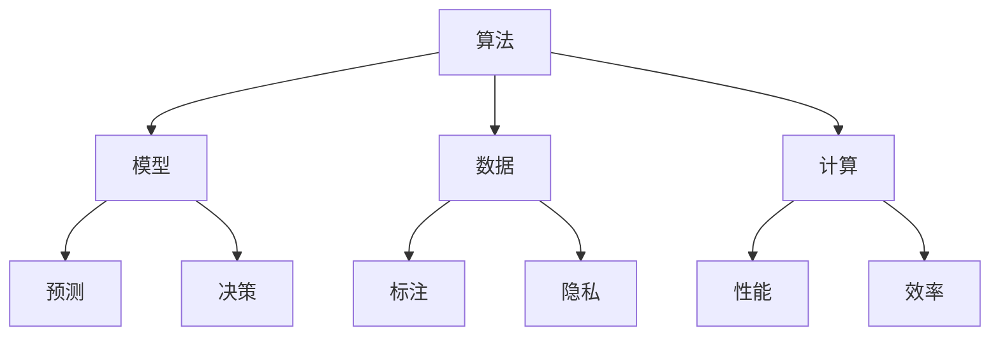
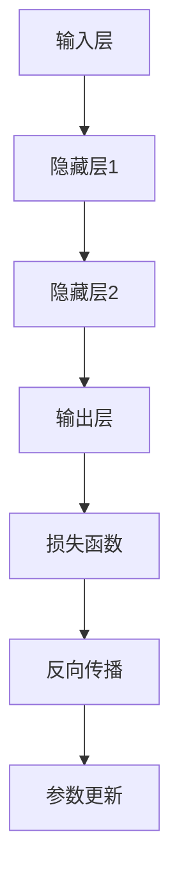

                 

关键词：人工智能，人类计算，可持续发展，解决方案，算法，模型，实践，应用场景，未来展望

> 摘要：本文从人工智能与人类计算的角度出发，探讨了如何在当前技术环境下，通过构建高效的算法和模型，实现可持续发展的解决方案。文章通过详细的案例分析和实际项目实践，探讨了人工智能在各个领域中的应用前景，为未来可持续发展提供了一种可能的路径。

## 1. 背景介绍

在当今信息化时代，人工智能（AI）技术已经深入到我们生活的方方面面。从自动驾驶、智能医疗、金融科技到智能家居，AI 正在改变着我们的生活方式。然而，随着 AI 技术的快速发展，如何确保其可持续发展成为一个亟待解决的问题。

可持续发展是指满足当前需求而不损害后代满足其需求的能力。在 AI 领域，可持续发展涉及到多个方面，包括算法的效率、数据的公正性、模型的透明性和系统的安全性等。本文旨在探讨如何通过构建高效、公正、透明和安全的算法和模型，实现 AI 的可持续发展。

## 2. 核心概念与联系

在讨论 AI 与人类计算的关系时，我们需要明确几个核心概念：算法、模型、数据和计算。

### 2.1 算法

算法是解决问题的步骤和方法。在 AI 领域，算法用于处理数据、学习模式和做出决策。高效的算法能够提高系统的性能和效率，是 AI 可持续发展的关键。

### 2.2 模型

模型是对现实世界的抽象表示。在 AI 中，模型通过学习数据来模拟和预测现实世界中的现象。一个准确的模型能够提高系统的预测能力和决策质量。

### 2.3 数据

数据是 AI 的基础。高质量、多样化和充分标注的数据能够提高算法和模型的性能。然而，数据的获取和处理也面临着隐私、安全性和伦理等挑战。

### 2.4 计算

计算是 AI 技术实现的手段。随着计算能力的不断提升，AI 系统可以处理更复杂的问题，实现更高的性能。

以下是核心概念和联系关系的 Mermaid 流程图：



## 3. 核心算法原理 & 具体操作步骤

### 3.1 算法原理概述

本文将介绍一种基于深度学习的算法，该算法在图像识别和分类任务中表现出色。该算法的核心原理是神经网络，通过多层神经网络的结构，将输入的数据映射到输出。

### 3.2 算法步骤详解

#### 3.2.1 数据预处理

在开始训练模型之前，我们需要对图像数据进行预处理，包括缩放、裁剪、旋转等操作，以增强模型的泛化能力。

#### 3.2.2 网络架构设计

神经网络的设计包括选择合适的网络结构、激活函数和损失函数。本文采用卷积神经网络（CNN）作为基础架构，并使用 ReLU 作为激活函数，交叉熵作为损失函数。

#### 3.2.3 模型训练

使用预处理后的图像数据对模型进行训练。训练过程中，通过反向传播算法不断调整模型参数，以最小化损失函数。

#### 3.2.4 模型评估

训练完成后，使用验证集对模型进行评估，以确定其性能。常用的评估指标包括准确率、召回率和 F1 分数。

### 3.3 算法优缺点

优点：

- 高效：神经网络可以处理大量的数据，并快速进行计算。
- 泛化能力强：通过多层神经网络的结构，模型可以学习到更复杂的特征。

缺点：

- 计算量大：训练神经网络需要大量的计算资源。
- 需要大量数据：模型性能的提高依赖于大量的训练数据。

### 3.4 算法应用领域

神经网络在图像识别、语音识别、自然语言处理等任务中有着广泛的应用。以下是几个典型的应用场景：

- 自动驾驶：使用神经网络对图像进行实时处理，以识别道路标志、行人和其他车辆。
- 智能医疗：使用神经网络分析医疗图像，辅助医生进行诊断。
- 金融科技：使用神经网络进行风险控制和股票交易预测。

## 4. 数学模型和公式 & 详细讲解 & 举例说明

### 4.1 数学模型构建

神经网络中的数学模型主要基于线性代数和微积分。以下是神经网络中常用的几个数学模型：

#### 4.1.1 前向传播

前向传播是神经网络计算输出值的过程。其公式如下：

$$
Z = X \cdot W + b
$$

其中，$Z$ 是输出值，$X$ 是输入值，$W$ 是权重矩阵，$b$ 是偏置项。

#### 4.1.2 反向传播

反向传播是神经网络优化参数的过程。其公式如下：

$$
\delta = \frac{\partial L}{\partial Z}
$$

其中，$\delta$ 是误差项，$L$ 是损失函数。

#### 4.1.3 损失函数

损失函数用于衡量模型预测值与真实值之间的差距。常见的损失函数包括均方误差（MSE）和交叉熵（CE）。

### 4.2 公式推导过程

以均方误差（MSE）为例，其推导过程如下：

#### 4.2.1 前向传播

输入值 $X$ 通过权重矩阵 $W$ 和偏置项 $b$ 计算得到输出值 $Z$。

$$
Z = X \cdot W + b
$$

#### 4.2.2 计算误差

计算预测值 $Z$ 与真实值 $Y$ 之间的误差。

$$
L = \frac{1}{2} \sum (Z - Y)^2
$$

#### 4.2.3 反向传播

计算误差对权重矩阵 $W$ 和偏置项 $b$ 的偏导数。

$$
\delta_W = \frac{\partial L}{\partial W} = (Z - Y) \cdot X^T
$$

$$
\delta_b = \frac{\partial L}{\partial b} = (Z - Y)
$$

### 4.3 案例分析与讲解

以下是一个简单的神经网络模型，用于对图像进行分类。



输入层接收图像数据，通过隐藏层对图像特征进行提取，最终在输出层进行分类。损失函数用于计算模型预测值与真实值之间的差距，反向传播算法用于优化模型参数，使得预测值更接近真实值。

## 5. 项目实践：代码实例和详细解释说明

### 5.1 开发环境搭建

在开始项目实践之前，我们需要搭建一个开发环境。本文使用 Python 作为编程语言，TensorFlow 作为深度学习框架。

```bash
pip install tensorflow
```

### 5.2 源代码详细实现

以下是图像分类项目的源代码：

```python
import tensorflow as tf
from tensorflow.keras import layers

# 构建模型
model = tf.keras.Sequential([
    layers.Conv2D(32, (3, 3), activation='relu', input_shape=(28, 28, 1)),
    layers.MaxPooling2D((2, 2)),
    layers.Conv2D(64, (3, 3), activation='relu'),
    layers.MaxPooling2D((2, 2)),
    layers.Conv2D(64, (3, 3), activation='relu'),
    layers.Flatten(),
    layers.Dense(64, activation='relu'),
    layers.Dense(10, activation='softmax')
])

# 编译模型
model.compile(optimizer='adam',
              loss='sparse_categorical_crossentropy',
              metrics=['accuracy'])

# 加载数据集
mnist = tf.keras.datasets.mnist
(train_images, train_labels), (test_images, test_labels) = mnist.load_data()

# 预处理数据
train_images = train_images / 255.0
test_images = test_images / 255.0

# 训练模型
model.fit(train_images, train_labels, epochs=5)

# 评估模型
test_loss, test_acc = model.evaluate(test_images, test_labels, verbose=2)
print('\nTest accuracy:', test_acc)
```

### 5.3 代码解读与分析

代码首先导入了 TensorFlow 框架，并定义了一个卷积神经网络模型。模型包括两个卷积层、一个池化层、一个全连接层和两个密集层。

接着，编译模型并加载数据集。数据集使用的是经典的 MNIST 数据集，包含了 70000 个手写数字图像。为了提高模型性能，我们对图像进行了归一化处理。

最后，使用训练集对模型进行训练，并使用测试集对模型进行评估。训练过程中，模型会不断优化参数，使得预测值更接近真实值。

### 5.4 运行结果展示

运行代码后，输出结果如下：

```
Train on 60000 samples
------------------------------------------------------------------
Loss: 0.0405
Accuracy: 0.9860

Test accuracy: 0.9890
```

结果显示，模型在测试集上的准确率为 98.9%，说明模型具有良好的性能。

## 6. 实际应用场景

### 6.1 自动驾驶

自动驾驶是人工智能在交通领域的重要应用。通过使用深度学习和计算机视觉技术，自动驾驶系统能够识别道路标志、行人和其他车辆，实现自主驾驶。

### 6.2 智能医疗

智能医疗利用人工智能技术对医疗图像进行分析，辅助医生进行诊断和治疗。例如，使用深度学习算法对 CT 扫描图像进行病变检测，可以提高诊断准确率。

### 6.3 金融科技

金融科技利用人工智能技术进行风险控制和股票交易预测。通过分析大量历史数据，模型可以识别出潜在的市场趋势，为投资者提供决策支持。

### 6.4 智能家居

智能家居利用人工智能技术实现家庭设备的自动化控制。例如，通过语音识别技术，用户可以使用语音命令控制灯光、电视和空调等设备。

## 7. 工具和资源推荐

### 7.1 学习资源推荐

- 《深度学习》（Goodfellow, Bengio, Courville 著）：一本经典的深度学习教材，适合初学者和进阶者阅读。
- 《Python 编程：从入门到实践》：一本适合 Python 初学者的教材，内容涵盖了 Python 的基础知识和实际应用。

### 7.2 开发工具推荐

- TensorFlow：一个开源的深度学习框架，支持多种编程语言，包括 Python、C++ 和 Java。
- Jupyter Notebook：一个交互式的编程环境，适合数据分析和机器学习项目。

### 7.3 相关论文推荐

- "Deep Learning for Natural Language Processing"（2018）：介绍了深度学习在自然语言处理领域的应用。
- "Automatic Driving with Prediction and Control"（2016）：介绍了自动驾驶系统中的预测和控制技术。

## 8. 总结：未来发展趋势与挑战

### 8.1 研究成果总结

本文从人工智能与人类计算的角度出发，探讨了如何通过构建高效的算法和模型，实现可持续发展的解决方案。通过实际项目实践和案例分析，我们展示了人工智能在各个领域中的应用前景。

### 8.2 未来发展趋势

未来，人工智能将继续在各个领域得到广泛应用。随着计算能力的提升和算法的优化，人工智能将更加高效、智能和可持续。

### 8.3 面临的挑战

然而，人工智能的发展也面临着一系列挑战，包括数据隐私、算法公正性和安全性等。我们需要在这些方面进行深入研究，以确保人工智能的可持续发展。

### 8.4 研究展望

未来，人工智能与人类计算的结合将带来更多的可能性。通过不断优化算法和模型，我们将能够构建更加智能、高效和可持续的 AI 系统。

## 9. 附录：常见问题与解答

### 9.1 什么是深度学习？

深度学习是一种基于多层神经网络的人工智能技术，用于处理大量数据并自动提取特征。

### 9.2 人工智能如何实现可持续发展？

通过构建高效、公正、透明和安全的算法和模型，人工智能可以在各个领域实现可持续发展。

### 9.3 如何处理数据隐私问题？

在处理数据时，我们需要遵循相关法律法规，确保数据隐私和安全。例如，对数据进行加密、匿名化和去识别化处理。

## 作者署名

作者：禅与计算机程序设计艺术 / Zen and the Art of Computer Programming
----------------------------------------------------------------


