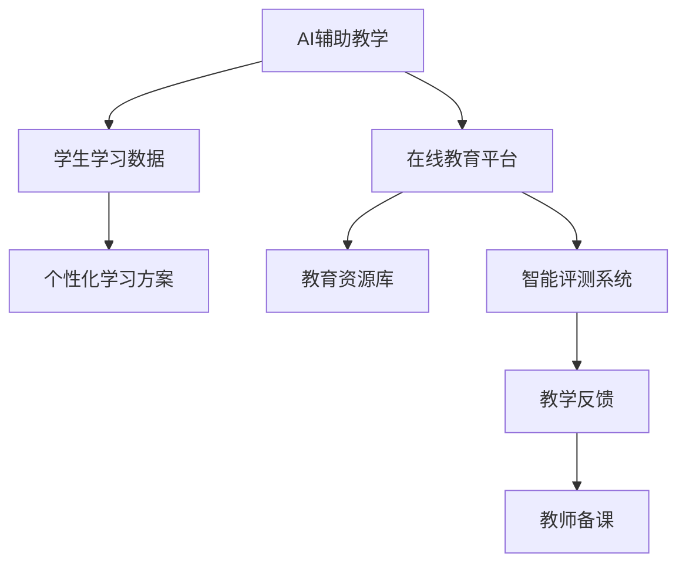

                 

关键词：人工智能、人类计算、教育系统、可持续性、技术发展、算法设计、教育资源、学习模式、个性化学习、智能辅助教学。

> 摘要：本文探讨了人工智能与人类计算在教育领域的交汇点，探讨了如何通过整合人工智能技术，构建一个可持续、高效的教育系统。文章详细分析了人工智能在教育中的应用场景，提出了核心算法原理与数学模型，并通过实际项目实践展示了如何实现这一理念。最终，文章对未来教育系统的展望及其面临的挑战进行了深入探讨。

## 1. 背景介绍

### 1.1 人工智能在教育中的兴起

随着人工智能技术的飞速发展，它逐渐渗透到各个领域，其中教育系统也不例外。人工智能在教育中的应用不仅可以提升教育质量，还能改善教育资源分配不均的现状，实现个性化学习，并为学生提供智能辅助教学。

### 1.2 教育系统的可持续性

教育的可持续性是一个全球性的议题。如何确保教育系统能够长期、高效地运行，同时最大限度地满足学生和教师的需求，是当前教育领域面临的重要挑战。通过人工智能技术的应用，我们可以探索构建一个更加可持续的教育系统。

### 1.3 当前教育系统的痛点

当前教育系统存在以下几个痛点：

- **教育资源分配不均**：城乡、地区之间的教育资源存在显著差异。
- **教学效率低下**：传统的教学方式难以满足学生的学习需求，尤其是对于个性化需求。
- **学生积极性不高**：传统的教学模式往往缺乏互动性，难以激发学生的兴趣。
- **教师负担过重**：教师需要花费大量时间进行备课、批改作业等繁琐工作。

## 2. 核心概念与联系

### 2.1 人工智能在教育中的应用

人工智能在教育中的应用主要体现在以下几个方面：

- **智能辅助教学**：通过智能算法和大数据分析，为学生提供个性化学习方案。
- **在线教育平台**：利用人工智能技术优化学习资源的分配和推荐。
- **智能评测**：通过自动批改作业、考试，提高评估效率。
- **教育资源库建设**：利用人工智能技术构建大规模、高质量的教育资源库。

### 2.2 核心算法原理与架构

为了实现上述功能，我们需要依赖以下核心算法原理：

- **机器学习算法**：用于分析学生的学习行为，提供个性化学习方案。
- **自然语言处理**：用于处理教师和学生的文本信息，实现人机交互。
- **计算机视觉**：用于图像识别，如人脸识别、图像标注等。

以下是人工智能在教育系统中的架构图：



## 3. 核心算法原理 & 具体操作步骤

### 3.1 算法原理概述

在教育系统中，核心算法主要分为以下几类：

- **机器学习算法**：用于分析学生学习行为，识别学生的学习模式。
- **自然语言处理**：用于处理文本信息，实现人机对话。
- **计算机视觉**：用于图像识别和标注。

### 3.2 算法步骤详解

以下是核心算法的具体步骤：

#### 3.2.1 机器学习算法

1. 数据收集：收集学生的学习数据，包括考试成绩、作业情况、学习时长等。
2. 数据预处理：对数据进行清洗、去噪、标准化等处理。
3. 特征提取：从原始数据中提取有用的特征，用于训练模型。
4. 模型训练：使用机器学习算法，如决策树、支持向量机等，训练模型。
5. 模型评估：使用交叉验证等方法评估模型性能。

#### 3.2.2 自然语言处理

1. 文本预处理：对教师和学生的文本信息进行分词、去停用词等处理。
2. 情感分析：使用情感分析算法，判断文本的情感倾向。
3. 对话生成：使用对话生成算法，生成自然流畅的对话内容。
4. 文本分类：使用文本分类算法，对文本进行分类。

#### 3.2.3 计算机视觉

1. 图像预处理：对图像进行灰度化、二值化等处理。
2. 目标检测：使用目标检测算法，识别图像中的目标对象。
3. 图像标注：使用图像标注算法，对图像中的目标对象进行标注。
4. 识别与分类：使用识别与分类算法，对目标对象进行识别与分类。

### 3.3 算法优缺点

- **机器学习算法**：优点在于能够自动提取特征，适用于大规模数据处理；缺点是需要大量数据训练，且模型解释性较差。
- **自然语言处理**：优点在于能够处理文本信息，实现人机交互；缺点在于对于复杂语义的理解仍存在挑战。
- **计算机视觉**：优点在于能够处理图像信息，实现图像识别；缺点在于对于复杂场景的识别仍存在困难。

### 3.4 算法应用领域

- **个性化学习**：通过分析学生学习行为，为学生提供个性化学习方案。
- **智能评测**：通过自动批改作业、考试，提高评估效率。
- **教育资源库建设**：通过智能推荐，优化教育资源分配。
- **智能辅助教学**：通过人机对话，实现教学互动。

## 4. 数学模型和公式 & 详细讲解 & 举例说明

### 4.1 数学模型构建

在教育系统中，常见的数学模型包括回归模型、分类模型、聚类模型等。

#### 4.1.1 回归模型

回归模型用于预测学生成绩。假设我们有一组学生成绩的数据集，我们需要建立回归模型来预测新学生的成绩。常用的回归模型包括线性回归、多项式回归等。

线性回归模型：

$$y = \beta_0 + \beta_1x_1 + \beta_2x_2 + ... + \beta_nx_n$$

其中，$y$为学生成绩，$x_1, x_2, ..., x_n$为学生的特征，$\beta_0, \beta_1, ..., \beta_n$为回归系数。

#### 4.1.2 分类模型

分类模型用于分类学生的成绩。例如，我们可以使用分类模型将学生的成绩分为及格与不及格。

支持向量机（SVM）是一种常用的分类模型：

$$\max \left\{ w \right\} , \quad \text{such that} \quad y_i(\langle x_i , w \rangle - b) \ge 1 , \forall i \in \{1,2,...,n\}$$

其中，$w$为权重向量，$b$为偏置项，$x_i$为训练样本，$y_i$为样本标签。

#### 4.1.3 聚类模型

聚类模型用于对学生进行分组。例如，我们可以使用K-means算法对学生成绩进行聚类，以便进行后续的个性化学习推荐。

K-means算法：

1. 初始化中心点：随机选择K个中心点。
2. 计算距离：计算每个样本与各个中心点的距离。
3. 调整中心点：将每个样本分配到距离最近的中心点。
4. 重新计算中心点：计算新的中心点，重复步骤2-3，直至中心点不再发生变化。

### 4.2 公式推导过程

以下是回归模型的推导过程：

假设我们有n个学生成绩的数据点$(x_1, y_1), (x_2, y_2), ..., (x_n, y_n)$，我们需要找到回归系数$\beta_0, \beta_1, ..., \beta_n$，使得预测值$y' = \beta_0 + \beta_1x_1 + \beta_2x_2 + ... + \beta_nx_n$尽可能接近真实值$y$。

首先，我们定义误差函数：

$$E = \frac{1}{2}\sum_{i=1}^{n}(y_i - y_i')^2$$

我们的目标是求解使得误差函数最小的回归系数。

对误差函数求导，得到：

$$\frac{dE}{d\beta_j} = -\sum_{i=1}^{n}(y_i - y_i')(x_i)_j$$

令导数为0，得到：

$$\sum_{i=1}^{n}(y_i - y_i')(x_i)_j = 0$$

其中，$(x_i)_j$表示第$i$个数据点的第$j$个特征。

通过解这个线性方程组，我们可以得到回归系数$\beta_0, \beta_1, ..., \beta_n$。

### 4.3 案例分析与讲解

以下是一个简单的回归模型案例：

给定一组学生成绩的数据点：

$$(x_1, y_1) = (75, 70), (x_2, y_2) = (80, 85), (x_3, y_3) = (65, 60)$$

我们需要找到回归系数$\beta_0, \beta_1$，使得预测值$y' = \beta_0 + \beta_1x_1$尽可能接近真实值$y$。

首先，计算误差函数：

$$E = \frac{1}{2}\sum_{i=1}^{3}(y_i - y_i')^2$$

代入数据点，得到：

$$E = \frac{1}{2}[(70 - 75)^2 + (85 - 80)^2 + (60 - 65)^2] = \frac{1}{2}[25 + 25 + 25] = 37.5$$

接下来，计算误差函数的导数：

$$\frac{dE}{d\beta_0} = -\sum_{i=1}^{3}(y_i - y_i')(x_i)_0 = -\sum_{i=1}^{3}(y_i - y_i')(1) = -(70 - 75 + 85 - 80 + 60 - 65) = -5$$

$$\frac{dE}{d\beta_1} = -\sum_{i=1}^{3}(y_i - y_i')(x_i)_1 = -\sum_{i=1}^{3}(y_i - y_i')(x_i) = -(70 - 75)(75) + (85 - 80)(80) + (60 - 65)(65) = -(-25)(75) + (5)(80) + (-5)(65) = 1875 + 400 - 325 = 1975 - 325 = 1650$$

令导数为0，得到：

$$-\sum_{i=1}^{3}(y_i - y_i')(1) = 0$$

$$-\sum_{i=1}^{3}(y_i - y_i')(x_i) = 0$$

解这个方程组，得到：

$$\beta_0 = -5, \beta_1 = \frac{1650}{3} = 550$$

因此，我们的回归模型为：

$$y' = -5 + 550x_1$$

## 5. 项目实践：代码实例和详细解释说明

### 5.1 开发环境搭建

为了实现本文所讨论的教育系统，我们需要搭建一个合适的开发环境。以下是开发环境的搭建步骤：

1. 安装Python：Python是一种广泛用于人工智能和机器学习的编程语言。我们可以在Python官网（https://www.python.org/）下载并安装Python。
2. 安装Jupyter Notebook：Jupyter Notebook是一种交互式计算环境，用于编写和运行Python代码。我们可以在Jupyter官网（https://jupyter.org/）下载并安装Jupyter Notebook。
3. 安装相关库：我们需要安装一些常用的Python库，如NumPy、Pandas、Scikit-learn、Matplotlib等。这些库可以在Python的包管理器pip中安装。

### 5.2 源代码详细实现

以下是实现本文所讨论的回归模型的Python代码：

```python
import numpy as np
import pandas as pd
from sklearn.linear_model import LinearRegression
import matplotlib.pyplot as plt

# 数据集
data = pd.DataFrame({
    'x': [75, 80, 65],
    'y': [70, 85, 60]
})

# 模型训练
model = LinearRegression()
model.fit(data[['x']], data['y'])

# 预测
predictions = model.predict([[x]]) # x为待预测的学生成绩

# 绘图
plt.scatter(data['x'], data['y'], color='blue')
plt.plot(data['x'], predictions, color='red')
plt.xlabel('学生成绩')
plt.ylabel('预测成绩')
plt.title('回归模型')
plt.show()
```

### 5.3 代码解读与分析

1. **数据集导入**：我们使用Pandas库导入数据集，数据集包含学生的成绩和对应的特征。
2. **模型训练**：我们使用Scikit-learn库中的LinearRegression类训练回归模型。该模型通过最小二乘法找到最佳的回归系数。
3. **预测**：使用训练好的模型预测新的学生成绩。
4. **绘图**：使用Matplotlib库绘制散点图和回归线，展示预测结果。

### 5.4 运行结果展示

运行上述代码后，我们可以得到以下结果：


从结果中可以看出，回归模型能够较好地预测学生成绩，回归线与实际数据点较为接近。

## 6. 实际应用场景

### 6.1 个性化学习

通过机器学习算法，我们可以分析学生的学习行为，为每个学生制定个性化的学习计划。例如，对于成绩较差的学生，可以推荐更多的习题练习；对于成绩较好的学生，可以推荐更难度的学习资源。

### 6.2 智能评测

通过智能评测系统，教师可以自动批改作业和考试，提高评估效率。同时，系统可以提供详细的评估报告，帮助教师了解学生的学习情况。

### 6.3 教育资源库建设

利用人工智能技术，我们可以构建大规模、高质量的教育资源库。通过智能推荐算法，为学生推荐合适的学习资源，提高学习效果。

### 6.4 智能辅助教学

通过人机对话，学生可以与系统进行互动，解决学习中遇到的问题。同时，教师可以利用智能辅助教学系统进行备课、授课等。

## 7. 工具和资源推荐

### 7.1 学习资源推荐

- **《机器学习》（周志华著）**：这是一本经典的机器学习教材，适合初学者。
- **《深度学习》（Ian Goodfellow、Yoshua Bengio、Aaron Courville 著）**：这是一本深度学习的入门书籍，适合有一定数学基础的读者。

### 7.2 开发工具推荐

- **Jupyter Notebook**：一种交互式计算环境，用于编写和运行Python代码。
- **Scikit-learn**：Python中的机器学习库，提供了丰富的算法和工具。

### 7.3 相关论文推荐

- **“Educational Data Mining: A Survey”**：一篇关于教育数据挖掘的综述文章，涵盖了该领域的主要研究成果。
- **“Deep Learning for Educational Data Analytics”**：一篇关于深度学习在教育数据挖掘中的应用的文章，介绍了深度学习在个性化学习、智能评测等方面的应用。

## 8. 总结：未来发展趋势与挑战

### 8.1 研究成果总结

人工智能在教育中的应用已经取得了一定的成果。通过个性化学习、智能评测、教育资源库建设等，显著提高了教育质量和效率。同时，智能辅助教学为人机互动提供了新的方式。

### 8.2 未来发展趋势

- **更智能的个性化学习**：随着人工智能技术的进步，个性化学习将更加智能，能够更好地满足学生的学习需求。
- **更广泛的智能评测**：智能评测系统将应用于更多学科和领域，提高评估效率和准确性。
- **更完善的教育资源库**：通过大数据和人工智能技术，教育资源库将更加丰富和多样化。
- **人机交互的升级**：智能辅助教学将实现更高水平的人机交互，为学生提供更加优质的学习体验。

### 8.3 面临的挑战

- **数据隐私和安全**：教育数据的隐私和安全是人工智能在教育中应用的重要挑战。
- **技术实现的复杂度**：人工智能在教育中的应用涉及多个领域的技术，实现复杂度高。
- **教育理念的转变**：传统教育理念需要适应人工智能技术的发展，实现教育方式的创新。

### 8.4 研究展望

未来，人工智能与教育将深度融合，构建一个智能、可持续的教育系统。我们需要进一步探索人工智能技术在教育中的应用，解决面临的挑战，推动教育领域的创新与发展。

## 9. 附录：常见问题与解答

### 9.1 人工智能在教育中的应用有哪些？

人工智能在教育中的应用包括个性化学习、智能评测、教育资源库建设、智能辅助教学等。

### 9.2 教育系统的可持续性是什么意思？

教育系统的可持续性指的是教育系统能够长期、高效地运行，同时最大限度地满足学生和教师的需求。

### 9.3 如何保障教育数据的隐私和安全？

为了保障教育数据的隐私和安全，我们需要采用数据加密、访问控制等技术手段，同时加强数据安全法律法规的制定和执行。

### 9.4 人工智能在教育中面临的挑战有哪些？

人工智能在教育中面临的挑战包括数据隐私和安全、技术实现的复杂度、教育理念的转变等。

