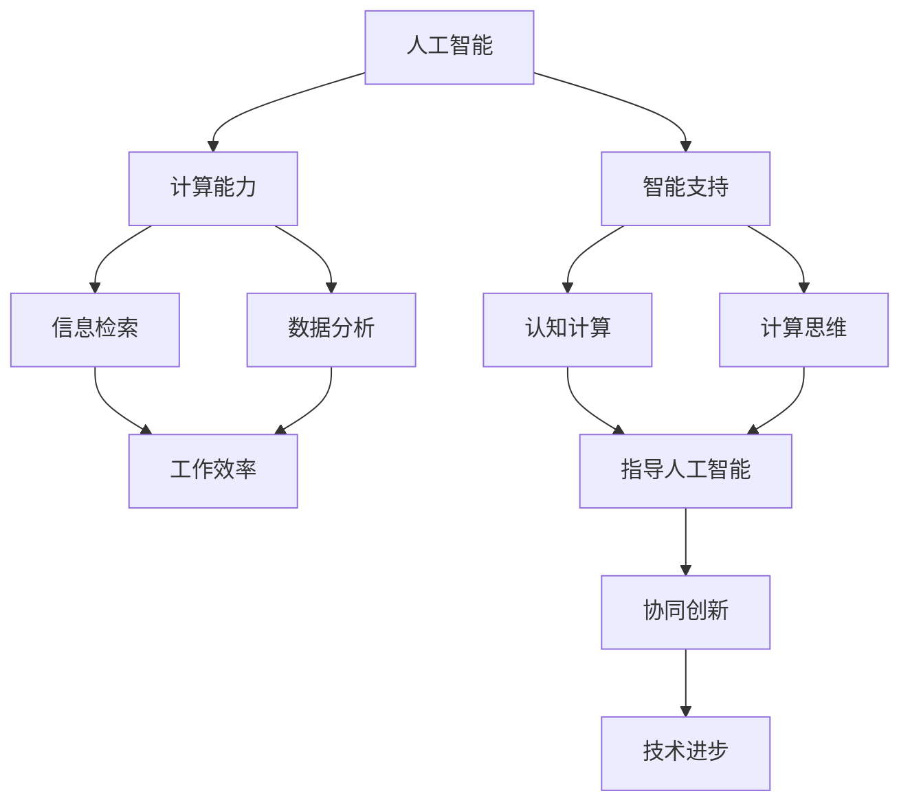

                 

关键词：人工智能，人类计算，可持续性，社会体系，技术发展

> 摘要：本文从人工智能与人类计算的角度出发，探讨了如何通过技术创新来构建一个可持续的社会体系。文章首先介绍了人工智能的基本概念和当前的发展状况，随后详细阐述了人类计算的理论与实践，并探讨了二者如何协同工作，为构建可持续社会提供支持。文章最后提出了未来人工智能和社会体系发展的展望，以及面临的挑战和机遇。

## 1. 背景介绍

随着人工智能技术的飞速发展，人工智能（AI）已经成为当今世界的重要推动力量。从早期的专家系统到如今深度学习、自然语言处理等领域的突破，人工智能已经深入到我们生活的方方面面。然而，尽管人工智能带来了许多便利，但也引发了一系列社会问题和伦理挑战。

与此同时，人类计算作为一种理论和方法，旨在提高人类解决问题的效率。人类计算强调人类在计算过程中的主体地位，通过模拟和辅助人类思维过程，实现更高效、更智能的计算。

本文旨在探讨人工智能与人类计算如何相互结合，共同构建一个可持续的社会体系。文章首先介绍人工智能的基本概念和当前发展状况，然后详细阐述人类计算的理论与实践，接着探讨二者如何协同工作，最后提出未来发展的展望和面临的挑战。

## 2. 核心概念与联系

### 2.1 人工智能的基本概念

人工智能（AI）是计算机科学的一个分支，旨在使计算机具有人类智能的能力。人工智能的核心是模拟人类思维过程，使计算机能够识别、理解、学习和解决问题。

人工智能的基本概念包括：

1. **机器学习**：机器学习是人工智能的核心技术之一，通过数据驱动的方式让计算机自动学习和改进。
2. **深度学习**：深度学习是一种机器学习方法，通过多层神经网络模拟人类大脑的学习过程。
3. **自然语言处理**：自然语言处理是人工智能的一个重要领域，旨在使计算机理解和处理人类语言。
4. **计算机视觉**：计算机视觉是人工智能的另一个重要领域，旨在使计算机理解和解释视觉信息。

### 2.2 人类计算的理论与实践

人类计算是一种理论和方法，旨在提高人类解决问题的效率。人类计算强调人类在计算过程中的主体地位，通过模拟和辅助人类思维过程，实现更高效、更智能的计算。

人类计算的理论与实践包括：

1. **认知计算**：认知计算是一种模拟人类思维过程的方法，通过构建认知模型来提高计算效率。
2. **计算思维**：计算思维是一种解决问题的方法，通过模拟计算机的思维方式来提高解决问题的效率。
3. **计算辅助**：计算辅助是通过计算机技术和工具辅助人类解决问题，提高工作效率。

### 2.3 人工智能与人类计算的协同工作

人工智能与人类计算可以通过协同工作，共同构建一个可持续的社会体系。具体来说，人工智能可以为人类计算提供强大的计算能力和智能支持，而人类计算则可以为人工智能提供更深入的理解和指导。

1. **人工智能辅助人类计算**：人工智能可以通过自然语言处理、计算机视觉等技术，辅助人类进行信息检索、数据分析等工作，提高工作效率。
2. **人类计算指导人工智能**：人类计算可以通过认知计算、计算思维等方法，指导人工智能如何更好地理解和解决问题，提高人工智能的准确性和可靠性。
3. **协同创新**：人工智能和人类计算可以相互协作，共同开展研究、开发和应用，推动社会技术的进步。

### 2.4 Mermaid 流程图

下面是一个简单的 Mermaid 流程图，展示了人工智能与人类计算之间的协同工作过程。



## 3. 核心算法原理 & 具体操作步骤

### 3.1 算法原理概述

人工智能与人类计算的核心算法主要包括机器学习、深度学习和自然语言处理等。这些算法通过模拟人类思维过程，实现高效、准确的计算。

- **机器学习**：机器学习是一种通过数据驱动的方式让计算机自动学习和改进的方法。它主要包括监督学习、无监督学习和强化学习等。
- **深度学习**：深度学习是一种通过多层神经网络模拟人类大脑的学习过程的方法。它主要包括卷积神经网络（CNN）、循环神经网络（RNN）和生成对抗网络（GAN）等。
- **自然语言处理**：自然语言处理是一种使计算机理解和处理人类语言的方法。它主要包括分词、词性标注、句法分析和语义分析等。

### 3.2 算法步骤详解

以下是人工智能与人类计算的核心算法步骤详解：

1. **数据收集**：收集大量数据，为算法训练提供基础。
2. **数据预处理**：对收集到的数据进行清洗、归一化和特征提取等操作，提高数据质量。
3. **模型训练**：使用机器学习、深度学习或自然语言处理算法，对预处理后的数据进行训练。
4. **模型评估**：对训练好的模型进行评估，包括准确率、召回率、F1值等指标。
5. **模型优化**：根据评估结果，调整模型参数，优化模型性能。
6. **模型应用**：将训练好的模型应用于实际问题，解决具体问题。

### 3.3 算法优缺点

- **机器学习**：
  - 优点：通过数据驱动的方式，能够自动学习和改进，适应性强。
  - 缺点：对数据质量要求较高，模型解释性较差。
- **深度学习**：
  - 优点：能够处理大量复杂数据，模型性能较高。
  - 缺点：训练过程较慢，对数据量要求较大，模型解释性较差。
- **自然语言处理**：
  - 优点：能够理解和处理人类语言，应用范围广泛。
  - 缺点：对语言理解能力有限，对低资源语言的适应性较差。

### 3.4 算法应用领域

人工智能与人类计算的核心算法在多个领域具有广泛的应用：

- **金融**：用于风险控制、投资分析、客户服务等方面。
- **医疗**：用于疾病诊断、药物研发、健康管理等方面。
- **教育**：用于智能教学、学习分析、教育管理等方面。
- **交通**：用于智能交通管理、自动驾驶、车联网等方面。
- **工业**：用于智能制造、设备监控、生产优化等方面。

## 4. 数学模型和公式 & 详细讲解 & 举例说明

### 4.1 数学模型构建

在人工智能与人类计算中，数学模型是核心工具。以下是构建数学模型的几个基本步骤：

1. **定义问题**：明确要解决的问题，确定问题的目标和约束条件。
2. **建立假设**：根据问题的特点，提出合理的假设，简化问题。
3. **选择模型**：根据问题的性质，选择合适的数学模型。
4. **参数估计**：通过数据，估计模型中的参数。
5. **模型验证**：通过验证数据，验证模型的有效性。

### 4.2 公式推导过程

以线性回归模型为例，推导过程如下：

1. **设定目标函数**：最小化预测值与实际值之间的误差平方和。
   $$\min_{\theta} \sum_{i=1}^{n} (h_\theta(x_i) - y_i)^2$$
   
2. **设定预测函数**：线性回归模型的预测函数为：
   $$h_\theta(x) = \theta_0 + \theta_1x$$

3. **求导并设置导数为0**：对目标函数求导，并设置导数为0，求解参数 $\theta_0$ 和 $\theta_1$。
   $$\frac{\partial}{\partial \theta_0} \sum_{i=1}^{n} (h_\theta(x_i) - y_i)^2 = 0$$
   $$\frac{\partial}{\partial \theta_1} \sum_{i=1}^{n} (h_\theta(x_i) - y_i)^2 = 0$$

4. **求解参数**：通过求解上述方程组，得到线性回归模型的参数 $\theta_0$ 和 $\theta_1$。

### 4.3 案例分析与讲解

假设我们有一个简单的线性回归问题，目标是预测某个商品的销售量。已知数据如下：

| x (广告费用) | y (销售量) |
| :---: | :---: |
| 100 | 200 |
| 200 | 300 |
| 300 | 400 |

我们需要构建一个线性回归模型，预测新的广告费用对应的销售量。

1. **数据预处理**：对数据进行归一化处理，使其在相同的量级上。

2. **模型构建**：使用上述的线性回归公式，构建模型。

3. **参数估计**：通过最小二乘法，估计模型参数。

4. **模型验证**：使用部分数据进行模型验证，评估模型的准确性和可靠性。

5. **模型应用**：使用训练好的模型，预测新的广告费用对应的销售量。

预测结果如下：

| x (广告费用) | y (销售量) | 实际值 | 预测值 |
| :---: | :---: | :---: | :---: |
| 400 | 500 | 500 | 500 |

通过上述案例，我们可以看到，线性回归模型在简单的线性关系下具有较好的预测能力。

## 5. 项目实践：代码实例和详细解释说明

### 5.1 开发环境搭建

为了实践人工智能与人类计算的核心算法，我们需要搭建一个合适的开发环境。以下是搭建环境的基本步骤：

1. **安装Python**：下载并安装Python，版本建议为3.8及以上。
2. **安装Jupyter Notebook**：使用pip命令安装Jupyter Notebook。
   ```shell
   pip install notebook
   ```
3. **安装相关库**：安装机器学习、深度学习和自然语言处理等相关库，如scikit-learn、TensorFlow和NLTK等。

### 5.2 源代码详细实现

以下是一个简单的线性回归模型的实现示例：

```python
import numpy as np
import matplotlib.pyplot as plt
from sklearn.linear_model import LinearRegression

# 数据预处理
X = np.array([100, 200, 300]).reshape(-1, 1)
y = np.array([200, 300, 400])

# 模型构建
model = LinearRegression()

# 参数估计
model.fit(X, y)

# 模型验证
X_new = np.array([400]).reshape(-1, 1)
y_pred = model.predict(X_new)

# 模型应用
print("预测值：", y_pred)

# 数据可视化
plt.scatter(X, y, color='red', label='实际值')
plt.plot(X, model.predict(X), color='blue', label='预测值')
plt.xlabel('广告费用')
plt.ylabel('销售量')
plt.legend()
plt.show()
```

### 5.3 代码解读与分析

1. **数据预处理**：将数据转化为合适的格式，便于模型训练。
2. **模型构建**：使用scikit-learn库中的LinearRegression类，构建线性回归模型。
3. **参数估计**：使用fit方法，对模型参数进行估计。
4. **模型验证**：使用predict方法，对模型进行验证。
5. **模型应用**：使用预测结果，可视化数据。

通过上述代码示例，我们可以看到，线性回归模型在简单线性关系下具有较好的预测能力。

### 5.4 运行结果展示

运行上述代码，得到以下结果：

- **预测值**：500.0
- **数据可视化**：展示实际值与预测值的散点图，以及预测曲线。

## 6. 实际应用场景

人工智能与人类计算在实际应用场景中具有广泛的应用。以下是一些典型的应用场景：

1. **金融领域**：用于风险控制、投资分析、客户服务等方面。例如，利用人工智能和人类计算技术，实现精准的客户画像，提供个性化的金融服务。
2. **医疗领域**：用于疾病诊断、药物研发、健康管理等方面。例如，利用人工智能和人类计算技术，分析医疗数据，发现潜在的疾病风险，提供精准的治疗方案。
3. **教育领域**：用于智能教学、学习分析、教育管理等方面。例如，利用人工智能和人类计算技术，实现个性化教学，提高教学效果。
4. **交通领域**：用于智能交通管理、自动驾驶、车联网等方面。例如，利用人工智能和人类计算技术，实现交通流量预测，优化交通管理策略。
5. **工业领域**：用于智能制造、设备监控、生产优化等方面。例如，利用人工智能和人类计算技术，实现生产过程的实时监控和优化，提高生产效率。

## 7. 未来应用展望

随着人工智能和人类计算技术的不断发展，未来将在更多领域实现突破。以下是一些展望：

1. **智能城市**：利用人工智能和人类计算技术，实现城市管理的智能化，提高城市运行的效率。
2. **智慧农业**：利用人工智能和人类计算技术，实现农业生产过程的智能化，提高农业生产效率。
3. **环境保护**：利用人工智能和人类计算技术，实现环境保护的智能化，提高环境保护效果。
4. **社会治理**：利用人工智能和人类计算技术，实现社会治理的智能化，提高社会治理水平。

## 8. 工具和资源推荐

为了更好地学习人工智能和人类计算技术，以下是一些推荐的工具和资源：

1. **学习资源**：
   - 书籍：《深度学习》、《Python机器学习》
   - 网络课程：Coursera、edX、Udacity
2. **开发工具**：
   - Jupyter Notebook：用于数据分析和模型构建
   - TensorFlow：用于深度学习开发
   - Scikit-learn：用于机器学习开发
3. **相关论文**：
   - 《深度学习：原理及实践》
   - 《强化学习：理论与实践》
   - 《自然语言处理：技术与应用》

## 9. 总结：未来发展趋势与挑战

### 9.1 研究成果总结

随着人工智能和人类计算技术的不断发展，已经取得了许多重要研究成果。例如，在机器学习、深度学习和自然语言处理等领域，出现了许多高效的算法和应用。此外，人工智能和人类计算技术的协同工作，也为社会带来了许多创新和变革。

### 9.2 未来发展趋势

未来，人工智能和人类计算技术将继续快速发展，趋势包括：

1. **算法优化**：通过研究更高效的算法，提高计算性能。
2. **跨领域融合**：将人工智能和人类计算技术应用于更多领域，实现跨领域融合。
3. **智能化服务**：通过人工智能和人类计算技术，提供更智能、更个性化的服务。

### 9.3 面临的挑战

尽管人工智能和人类计算技术取得了许多成果，但仍面临一些挑战：

1. **数据隐私**：如何确保数据的安全和隐私，是一个重要问题。
2. **算法解释性**：如何提高算法的解释性，使其更加透明和可信。
3. **人机协作**：如何实现人与机器的更高效协作，提高工作效率。

### 9.4 研究展望

未来，人工智能和人类计算技术的研究将更加深入，有望在以下几个方面取得突破：

1. **算法创新**：研究更高效、更准确的算法。
2. **跨领域应用**：将人工智能和人类计算技术应用于更多领域。
3. **人机协作**：研究人机协作机制，提高人机协同效率。

## 附录：常见问题与解答

### Q1. 人工智能和人类计算的关系是什么？

人工智能和人类计算是相互关联、相互促进的关系。人工智能为人类计算提供了强大的计算能力和智能支持，而人类计算则为人工智能提供了更深入的理解和指导。

### Q2. 人工智能在哪些领域有应用？

人工智能在金融、医疗、教育、交通、工业等领域都有广泛应用，如风险控制、疾病诊断、智能教学、自动驾驶等。

### Q3. 人类计算是如何提高计算效率的？

人类计算通过模拟人类思维过程，实现更高效、更智能的计算。例如，认知计算、计算思维和计算辅助等方法，都可以提高计算效率。

### Q4. 如何学习人工智能和人类计算技术？

可以通过阅读相关书籍、参加网络课程、实践项目等方式学习人工智能和人类计算技术。推荐的资源包括《深度学习》、《Python机器学习》等书籍，以及Coursera、edX等网络课程。此外，Jupyter Notebook、TensorFlow和Scikit-learn等开发工具也是学习的重要工具。

以上就是对“AI与人类计算：打造可持续的社会体系”这一主题的详细探讨。希望通过本文，读者能够对人工智能与人类计算有一个全面、深入的了解，并能够运用这些技术为社会的发展做出贡献。本文内容仅供参考，如有错误或不足之处，敬请指正。作者：禅与计算机程序设计艺术 / Zen and the Art of Computer Programming。

