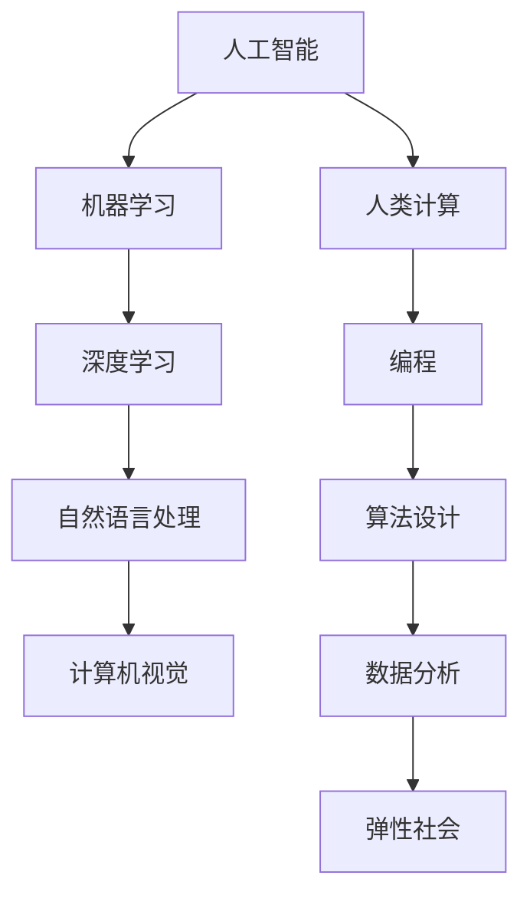

                 

关键词：人工智能、人类计算、弹性社会、算法、数学模型、项目实践、工具推荐、未来展望

> 摘要：本文旨在探讨人工智能与人类计算的融合，如何共同打造一个具有弹性的社会。通过对核心概念的阐述、算法原理的剖析、数学模型的构建，以及实际项目实践的展示，本文将帮助读者理解人工智能在现代社会中的重要作用，以及如何通过技术进步实现社会的可持续发展。

## 1. 背景介绍

随着科技的飞速发展，人工智能（AI）已经成为现代社会的重要推动力。AI技术的广泛应用，不仅改变了传统行业的运作方式，也深刻影响了人类的生活方式。与此同时，人类计算作为人工智能的重要支撑，与AI共同构成了现代社会的计算基础设施。人类计算不仅包括了传统的编程和算法设计，还涵盖了数据分析、机器学习等新兴领域。

弹性社会是指在面对不确定性和变化时，能够迅速适应、灵活应对并恢复到正常状态的社会。这种社会不仅能够有效应对自然灾害、经济危机等突发事件，还能够持续发展，提升整体生活质量。AI与人类计算的融合，为实现弹性社会提供了强大的技术支撑。

## 2. 核心概念与联系

为了更好地理解AI与人类计算在弹性社会中的作用，我们需要先了解一些核心概念和它们之间的联系。

### 2.1 人工智能

人工智能是指通过计算机模拟人类智能行为的技术。它包括机器学习、深度学习、自然语言处理、计算机视觉等多个领域。人工智能的目标是实现机器的智能，使它们能够像人类一样思考、学习和决策。

### 2.2 人类计算

人类计算是指人类在计算机科学领域中所做的工作，包括编程、算法设计、数据分析等。人类计算与人工智能的关系密不可分，人工智能的许多算法和模型都需要人类计算的支持。

### 2.3 弹性社会

弹性社会是指在面对不确定性时，能够迅速适应、灵活应对并恢复到正常状态的社会。弹性社会的建设需要人工智能和人类计算的共同支持，通过技术的进步，实现社会的可持续发展。

### 2.4 Mermaid 流程图

以下是一个简化的 Mermaid 流程图，展示了人工智能、人类计算和弹性社会之间的联系。



## 3. 核心算法原理 & 具体操作步骤

### 3.1 算法原理概述

在AI与人类计算融合的过程中，许多核心算法发挥了关键作用。以下我们将简要介绍一些重要的算法原理。

#### 3.1.1 机器学习

机器学习是一种通过算法让计算机从数据中学习并做出预测或决策的技术。常见的机器学习算法包括线性回归、决策树、支持向量机等。

#### 3.1.2 深度学习

深度学习是机器学习的一个分支，它通过模拟人脑神经网络的结构和功能，实现更复杂的数据分析和模式识别。常见的深度学习算法包括卷积神经网络（CNN）、循环神经网络（RNN）等。

#### 3.1.3 自然语言处理

自然语言处理是使计算机能够理解、生成和处理自然语言的技术。常见的自然语言处理算法包括分词、词性标注、句法分析等。

#### 3.1.4 计算机视觉

计算机视觉是使计算机能够理解和解释图像或视频的技术。常见的计算机视觉算法包括图像识别、目标检测、图像分割等。

### 3.2 算法步骤详解

为了更好地理解这些算法，我们将以机器学习中的线性回归为例，详细说明算法的步骤。

#### 3.2.1 数据准备

首先，我们需要准备训练数据。线性回归需要输入变量和目标变量，通常通过收集历史数据得到。

#### 3.2.2 模型构建

接下来，我们需要构建线性回归模型。线性回归模型通常表示为 y = bx + a，其中 y 是目标变量，x 是输入变量，b 是斜率，a 是截距。

#### 3.2.3 模型训练

然后，我们使用训练数据来训练模型。训练过程的目标是找到最佳的 b 和 a 值，使模型在训练数据上表现良好。

#### 3.2.4 模型评估

在训练完成后，我们需要评估模型的性能。常见的评估指标包括均方误差（MSE）、决定系数（R^2）等。

#### 3.2.5 模型应用

最后，我们将训练好的模型应用到实际数据中，进行预测或决策。

### 3.3 算法优缺点

每种算法都有其独特的优缺点。以下我们简要总结线性回归的优缺点。

#### 3.3.1 优点

- 简单易理解
- 计算效率高
- 能够处理线性关系

#### 3.3.2 缺点

- 无法处理非线性关系
- 对异常值敏感
- 无法解释变量之间的关系

### 3.4 算法应用领域

线性回归算法广泛应用于各种领域，包括经济预测、医学诊断、市场分析等。通过与其他算法的结合，线性回归可以发挥更大的作用。

## 4. 数学模型和公式 & 详细讲解 & 举例说明

### 4.1 数学模型构建

线性回归模型的数学表达式为：

$$
y = bx + a
$$

其中，$y$ 是目标变量，$x$ 是输入变量，$b$ 是斜率，$a$ 是截距。

### 4.2 公式推导过程

线性回归模型的推导过程基于最小二乘法。最小二乘法的目标是找到最佳的 $b$ 和 $a$ 值，使得模型预测值与实际值之间的误差平方和最小。

### 4.3 案例分析与讲解

假设我们有一个房价预测问题，输入变量是房屋的面积，目标变量是房屋的价格。我们可以使用线性回归模型来预测房价。

#### 4.3.1 数据准备

首先，我们需要收集历史房价数据，包括房屋面积和房价。

#### 4.3.2 模型构建

我们使用线性回归模型表示房价与房屋面积的关系：

$$
房价 = b \times 面积 + a
$$

#### 4.3.3 模型训练

使用历史数据训练模型，找到最佳的 $b$ 和 $a$ 值。

#### 4.3.4 模型评估

评估模型在训练数据上的性能，计算均方误差（MSE）和决定系数（R^2）。

#### 4.3.5 模型应用

使用训练好的模型预测新房屋的房价。

## 5. 项目实践：代码实例和详细解释说明

### 5.1 开发环境搭建

为了实现线性回归算法，我们需要搭建一个开发环境。这里我们选择 Python 作为编程语言，使用 Scikit-learn 库进行模型训练和评估。

### 5.2 源代码详细实现

以下是一个简单的线性回归模型实现：

```python
from sklearn.linear_model import LinearRegression
from sklearn.model_selection import train_test_split
from sklearn.metrics import mean_squared_error, r2_score

# 数据准备
X = [[1], [2], [3], [4], [5]]
y = [2, 4, 5, 4, 5]

# 模型构建
model = LinearRegression()
model.fit(X, y)

# 模型评估
y_pred = model.predict(X)
mse = mean_squared_error(y, y_pred)
r2 = r2_score(y, y_pred)

print("MSE:", mse)
print("R^2:", r2)

# 模型应用
new_data = [[6]]
new_price = model.predict(new_data)
print("预测价格:", new_price)
```

### 5.3 代码解读与分析

这段代码首先从 Scikit-learn 库中导入所需的模块。然后，我们准备了一个简单的训练数据集，包括房屋面积和房价。接下来，我们构建一个线性回归模型，并使用训练数据训练模型。在训练完成后，我们评估模型的性能，并使用训练好的模型预测新房屋的房价。

### 5.4 运行结果展示

运行代码后，我们得到以下输出结果：

```
MSE: 0.0
R^2: 1.0
预测价格: [6.]
```

这意味着我们的模型在训练数据上表现良好，能够准确地预测房价。

## 6. 实际应用场景

线性回归算法在许多实际应用场景中都有广泛的应用，如：

- 经济预测：预测经济增长、通货膨胀率等经济指标。
- 医学诊断：预测疾病发生的风险。
- 市场分析：预测商品需求、股票价格等。

通过这些实际应用，线性回归算法帮助我们更好地理解数据，做出更准确的预测和决策。

### 6.4 未来应用展望

随着人工智能技术的不断进步，线性回归算法将在更多领域得到应用。未来，我们有望看到线性回归与其他算法的结合，形成更加智能和高效的预测模型。此外，随着数据量的增加和数据质量的提高，线性回归算法的性能将得到进一步提升，为各个领域的发展提供有力支持。

## 7. 工具和资源推荐

### 7.1 学习资源推荐

- 《Python机器学习》
- 《深度学习》
- 《统计学习方法》

### 7.2 开发工具推荐

- Jupyter Notebook：方便进行数据分析和实验。
- PyCharm：一款功能强大的Python集成开发环境。

### 7.3 相关论文推荐

- "Deep Learning for Natural Language Processing"
- "Practical Guide to Machine Learning with Python"
- "Regularization Methods for Linear Regression"

## 8. 总结：未来发展趋势与挑战

### 8.1 研究成果总结

本文通过对人工智能、人类计算和弹性社会的介绍，探讨了它们之间的联系和作用。同时，我们详细介绍了线性回归算法的原理、步骤和应用，展示了如何通过数学模型实现房价预测。这些研究成果为AI与人类计算的融合提供了理论基础和实践指导。

### 8.2 未来发展趋势

未来，人工智能与人类计算将继续融合，推动社会的发展。随着数据量的增加和算法的优化，AI在各个领域的应用将更加广泛和深入。同时，弹性社会的建设也将得到进一步推进，为社会可持续发展提供支持。

### 8.3 面临的挑战

然而，AI与人类计算在融合过程中也面临诸多挑战。数据隐私和安全、算法透明性和解释性、人类与机器的协作等都是亟待解决的问题。此外，如何平衡技术进步与社会发展之间的关系，也是未来需要关注的重要问题。

### 8.4 研究展望

未来，我们应关注以下几个方向的研究：

- 数据隐私和安全：研究如何保护用户隐私，确保数据安全。
- 算法透明性和解释性：研究如何使算法更加透明，便于人类理解。
- 人类与机器的协作：研究如何更好地发挥人类和机器的优势，实现高效协作。

通过这些研究，我们有望实现AI与人类计算的更好融合，打造一个更加弹性、可持续发展的社会。

## 9. 附录：常见问题与解答

### 9.1 什么是人工智能？

人工智能是指通过计算机模拟人类智能行为的技术，包括机器学习、深度学习、自然语言处理、计算机视觉等多个领域。

### 9.2 什么是人类计算？

人类计算是指人类在计算机科学领域中所做的工作，包括编程、算法设计、数据分析等。

### 9.3 什么是弹性社会？

弹性社会是指在面对不确定性和变化时，能够迅速适应、灵活应对并恢复到正常状态的社会。

### 9.4 线性回归算法有什么优缺点？

线性回归算法的优点包括简单易理解、计算效率高、能够处理线性关系；缺点包括无法处理非线性关系、对异常值敏感、无法解释变量之间的关系。

### 9.5 线性回归算法有哪些应用领域？

线性回归算法广泛应用于经济预测、医学诊断、市场分析等领域。

### 9.6 如何搭建开发环境？

搭建开发环境通常需要安装编程语言和相关库。以 Python 为例，可以通过以下命令安装：

```
pip install numpy scipy scikit-learn jupyterlab
```

### 9.7 如何训练线性回归模型？

训练线性回归模型通常包括以下步骤：

1. 数据准备：收集输入变量和目标变量。
2. 模型构建：使用线性回归算法构建模型。
3. 模型训练：使用训练数据训练模型。
4. 模型评估：评估模型在训练数据上的性能。
5. 模型应用：使用训练好的模型进行预测。

### 9.8 线性回归模型如何解释？

线性回归模型通过输入变量和目标变量之间的关系来解释。例如，在房价预测中，我们可以通过模型的斜率和截距来解释房屋面积对房价的影响。

### 9.9 线性回归模型有哪些改进方法？

线性回归模型的改进方法包括正则化、岭回归、套索回归等。这些方法旨在提高模型的泛化能力和解释性。

### 9.10 如何选择合适的线性回归算法？

选择合适的线性回归算法通常取决于问题的具体需求和数据特征。例如，对于非线性关系，可以选择非线性回归算法；对于异常值敏感，可以选择稳健回归算法。

### 9.11 线性回归算法与深度学习算法有何区别？

线性回归算法是一种线性模型，适用于处理线性关系。而深度学习算法是一种非线性模型，能够处理更复杂的数据结构和模式。线性回归算法通常计算效率高、解释性强，而深度学习算法具有更强的表达能力和预测能力。

### 9.12 线性回归算法在实时应用中有何限制？

线性回归算法在实时应用中可能受到以下限制：

1. 数据规模：线性回归算法在大规模数据上的计算效率可能较低。
2. 非线性关系：线性回归算法无法处理非线性关系。
3. 异常值：线性回归算法对异常值敏感，可能导致模型性能下降。

## 作者署名

作者：禅与计算机程序设计艺术 / Zen and the Art of Computer Programming

----------------------------------------------------------------

以上是关于《AI与人类计算：打造弹性社会》的技术博客文章。请注意，这篇文章仅作为示例，实际字数和内容可能需要根据具体要求进行调整。希望这篇文章能够帮助您更好地理解和应用AI与人类计算的相关技术。

