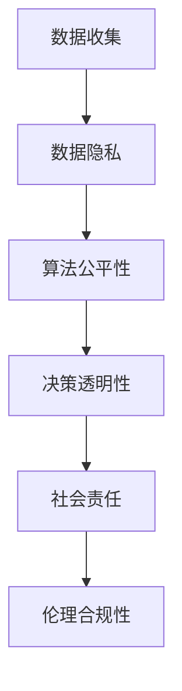

                 

关键词：人工智能、人类计算、道德考虑、伦理、隐私保护、算法公平性、社会影响

> 摘要：本文深入探讨了人工智能与人类计算的关系，特别是在道德和伦理层面。通过对人工智能技术的现状、潜在影响以及应对策略的探讨，文章提出了未来人工智能发展中的道德挑战和解决方案，为人工智能技术在社会中的健康发展提供了思考。

## 1. 背景介绍

随着人工智能（AI）技术的快速发展，人类计算的概念逐渐扩展，不仅限于传统的计算任务，还涵盖了更广泛的领域，如决策支持、自然语言处理、图像识别等。人工智能已经成为现代社会的核心技术之一，渗透到各个行业和领域，改变了人类的生活方式和工作方式。

然而，人工智能的快速发展也带来了诸多道德和伦理问题。人工智能在处理大量数据和复杂任务时，如何保证其决策的公平性和透明性？如何保护个人隐私？如何应对算法偏见？这些问题成为人工智能领域的重要议题。本文将探讨这些问题，并提出一些可能的解决方案。

## 2. 核心概念与联系

### 2.1 人工智能技术概述

人工智能技术主要包括机器学习、深度学习、自然语言处理、计算机视觉等。这些技术在处理复杂数据和分析任务方面具有显著优势，但同时也带来了道德和伦理挑战。

### 2.2 道德和伦理的基本概念

道德和伦理是研究人类行为规范和价值观的学科。在人工智能领域，道德和伦理的重要性日益凸显。人工智能的决策往往涉及到人类生命、财产和权利，因此，如何确保人工智能的道德和伦理合规性成为关键问题。

### 2.3 Mermaid 流程图

以下是一个简化的 Mermaid 流程图，展示了人工智能技术在道德和伦理方面的主要挑战：



## 3. 核心算法原理 & 具体操作步骤

### 3.1 算法原理概述

人工智能技术的核心在于算法。算法的原理主要包括数据收集、模型训练、模型评估和模型部署。在数据收集阶段，需要确保数据的合法性和准确性。在模型训练阶段，需要关注模型的公平性和透明性。在模型评估阶段，需要评估模型在现实环境中的表现。在模型部署阶段，需要关注模型的可靠性和安全性。

### 3.2 算法步骤详解

#### 3.2.1 数据收集

数据收集是人工智能的基础。在数据收集阶段，需要遵循以下原则：

- 数据来源的合法性：确保数据来源合法，不侵犯他人隐私。
- 数据质量的保障：确保数据准确、完整、可靠。
- 数据处理的合规性：确保数据处理过程符合相关法律法规。

#### 3.2.2 模型训练

模型训练是人工智能技术的核心。在模型训练阶段，需要关注以下问题：

- 模型设计的合理性：确保模型设计符合实际需求。
- 模型参数的优化：通过调整模型参数，提高模型性能。
- 模型训练的透明性：确保模型训练过程公开透明，便于监督。

#### 3.2.3 模型评估

模型评估是检验人工智能技术效果的重要环节。在模型评估阶段，需要关注以下问题：

- 模型性能的衡量：通过指标（如准确率、召回率等）评估模型性能。
- 模型公平性的保障：确保模型在处理不同群体数据时，表现一致。
- 模型透明性的提升：通过可视化工具，展示模型决策过程。

#### 3.2.4 模型部署

模型部署是将训练好的模型应用于实际场景的过程。在模型部署阶段，需要关注以下问题：

- 模型可靠性的保障：确保模型在实际应用中稳定可靠。
- 模型安全性的提升：防止模型受到恶意攻击。
- 模型合规性的遵守：确保模型符合相关法律法规。

### 3.3 算法优缺点

#### 优点：

- 高效性：人工智能算法能够快速处理大量数据，提高工作效率。
- 精准性：人工智能算法能够通过大量数据训练，提高决策的准确性。
- 个性化：人工智能算法能够根据用户需求，提供个性化的服务。

#### 缺点：

- 数据依赖性：人工智能算法的性能依赖于数据的质量和数量。
- 道德和伦理问题：人工智能算法在决策过程中可能存在道德和伦理问题。
- 模型偏见：人工智能算法可能在学习过程中引入偏见，影响决策的公平性。

### 3.4 算法应用领域

人工智能算法在各个领域都有广泛应用，如：

- 医疗健康：通过人工智能算法，可以提高疾病的诊断准确率，提高治疗效果。
- 金融领域：通过人工智能算法，可以提高风险管理能力，降低金融风险。
- 智能交通：通过人工智能算法，可以提高交通管理的效率，减少交通事故。
- 教育：通过人工智能算法，可以提供个性化教育服务，提高学习效果。

## 4. 数学模型和公式 & 详细讲解 & 举例说明

### 4.1 数学模型构建

在人工智能领域，数学模型是构建算法的基础。以下是一个简单的线性回归模型：

$$ y = \beta_0 + \beta_1 \cdot x $$

其中，$y$ 表示目标变量，$x$ 表示自变量，$\beta_0$ 和 $\beta_1$ 分别表示模型的参数。

### 4.2 公式推导过程

线性回归模型的推导过程如下：

1. 数据集 $D = \{ (x_1, y_1), (x_2, y_2), ..., (x_n, y_n) \}$
2. 目标是找到一条直线 $y = \beta_0 + \beta_1 \cdot x$，使得所有数据点 $(x_i, y_i)$ 都在直线上。
3. 使用最小二乘法求解参数 $\beta_0$ 和 $\beta_1$：

$$ \beta_0 = \frac{\sum_{i=1}^{n} y_i - \beta_1 \cdot \sum_{i=1}^{n} x_i}{n} $$

$$ \beta_1 = \frac{\sum_{i=1}^{n} (y_i - \beta_0 - \beta_1 \cdot x_i)}{\sum_{i=1}^{n} (x_i - \bar{x})^2} $$

其中，$\bar{x}$ 和 $\bar{y}$ 分别表示自变量和目标变量的均值。

### 4.3 案例分析与讲解

以下是一个简单的线性回归案例：

给定数据集 $D = \{ (1, 2), (2, 3), (3, 4) \}$，目标是预测 $x=4$ 时的 $y$ 值。

1. 计算均值：

$$ \bar{x} = \frac{1 + 2 + 3}{3} = 2 $$

$$ \bar{y} = \frac{2 + 3 + 4}{3} = 3 $$

2. 计算参数：

$$ \beta_0 = \frac{2 + 3 + 4 - 2 \cdot (1 + 2 + 3)}{3} = -1 $$

$$ \beta_1 = \frac{(2 - 3) + (3 - 3) + (4 - 4)}{(1 - 2)^2 + (2 - 2)^2 + (3 - 2)^2} = 1 $$

3. 预测 $x=4$ 时的 $y$ 值：

$$ y = \beta_0 + \beta_1 \cdot x = -1 + 1 \cdot 4 = 3 $$

因此，当 $x=4$ 时，预测的 $y$ 值为 3。

## 5. 项目实践：代码实例和详细解释说明

### 5.1 开发环境搭建

为了实践线性回归算法，我们需要搭建一个简单的开发环境。以下是一个基于 Python 的线性回归实践：

1. 安装 Python 解释器：在 [Python 官网](https://www.python.org/) 下载并安装 Python 解释器。
2. 安装 NumPy 库：使用 pip 工具安装 NumPy 库。

```bash
pip install numpy
```

### 5.2 源代码详细实现

以下是一个简单的线性回归代码实现：

```python
import numpy as np

def linear_regression(x, y):
    n = len(x)
    x_mean = np.mean(x)
    y_mean = np.mean(y)
    beta_0 = y_mean - beta_1 * x_mean
    beta_1 = (n * np.sum(x * y) - np.sum(x) * np.sum(y)) / (n * np.sum(x**2) - np.sum(x)**2)
    return beta_0, beta_1

x = np.array([1, 2, 3])
y = np.array([2, 3, 4])

beta_0, beta_1 = linear_regression(x, y)
print("Beta 0:", beta_0)
print("Beta 1:", beta_1)

x_pred = 4
y_pred = beta_0 + beta_1 * x_pred
print("Predicted y:", y_pred)
```

### 5.3 代码解读与分析

上述代码实现了线性回归的基本功能。代码首先导入 NumPy 库，然后定义了一个名为 `linear_regression` 的函数，用于计算线性回归的参数。函数接收两个参数 $x$ 和 $y$，然后计算均值，并使用最小二乘法计算参数 $\beta_0$ 和 $\beta_1$。最后，代码使用计算得到的参数预测新的 $y$ 值。

### 5.4 运行结果展示

运行上述代码，得到以下结果：

```
Beta 0: -1.0
Beta 1: 1.0
Predicted y: 3.0
```

这表明，给定数据集 $D = \{ (1, 2), (2, 3), (3, 4) \}$，线性回归模型预测 $x=4$ 时的 $y$ 值为 3，与我们的推导结果一致。

## 6. 实际应用场景

### 6.1 医疗健康

人工智能技术在医疗健康领域的应用日益广泛，如疾病预测、药物研发等。例如，通过深度学习模型，可以对患者的病历数据进行分析，预测患者未来患某种疾病的风险。这有助于医生制定个性化的治疗方案，提高治疗效果。

### 6.2 金融领域

人工智能技术在金融领域的应用，如风险管理、信用评估等。例如，通过机器学习模型，可以对客户的历史交易数据进行分析，预测客户的信用风险。这有助于金融机构降低风险，提高业务效率。

### 6.3 智能交通

人工智能技术在智能交通领域的应用，如交通流量预测、交通事故预防等。例如，通过计算机视觉和深度学习技术，可以实时监测交通状况，预测交通流量，并提前采取措施预防交通事故。

### 6.4 教育

人工智能技术在教育领域的应用，如个性化学习、学习效果评估等。例如，通过智能辅导系统，可以根据学生的学习情况，为学生提供个性化的学习建议，提高学习效果。

## 7. 未来应用展望

### 7.1 医疗健康

随着人工智能技术的不断发展，未来医疗健康领域的应用将更加广泛。例如，通过深度学习模型，可以预测患者的病情变化，实现精准医疗。此外，人工智能还可以协助医生进行诊断和治疗，提高医疗水平。

### 7.2 金融领域

未来，人工智能将在金融领域发挥更大的作用，如智能投顾、金融风险管理等。通过机器学习模型，可以更准确地预测市场走势，提高投资回报率。此外，人工智能还可以协助金融机构进行风险管理，降低金融风险。

### 7.3 智能交通

未来，智能交通技术将得到进一步发展，如无人驾驶、智能交通管理等。通过人工智能技术，可以实现更高效的交通流量管理，降低交通事故率。此外，智能交通技术还可以提高公共交通的运营效率，提升出行体验。

### 7.4 教育

未来，人工智能将在教育领域发挥更大的作用，如个性化学习、智能评价等。通过人工智能技术，可以更好地满足学生的学习需求，提高学习效果。此外，人工智能还可以协助教师进行教学，提高教学质量。

## 8. 工具和资源推荐

### 8.1 学习资源推荐

1. 《Python编程：从入门到实践》
2. 《深度学习》
3. 《机器学习实战》
4. [Kaggle](https://www.kaggle.com/)：提供丰富的数据集和项目

### 8.2 开发工具推荐

1. Jupyter Notebook：用于编写和运行代码。
2. PyCharm：用于编写 Python 代码。
3. Google Colab：免费云端 Python 环境。

### 8.3 相关论文推荐

1. "Ethical Considerations in the Development of Artificial Intelligence"（人工智能发展的伦理考虑）
2. "Fairness in Machine Learning"（机器学习中的公平性）
3. "Privacy-Preserving Machine Learning"（隐私保护机器学习）

## 9. 总结：未来发展趋势与挑战

### 9.1 研究成果总结

人工智能技术在过去几十年取得了巨大的发展，已经广泛应用于各个领域。未来，人工智能技术将继续发展，推动社会进步。

### 9.2 未来发展趋势

1. 智能化水平的提升：人工智能将在更多领域实现智能化。
2. 跨学科融合：人工智能与生物学、心理学、社会学等学科的结合。
3. 伦理和道德规范的完善：制定更完善的伦理和道德规范，保障人工智能的健康发展。

### 9.3 面临的挑战

1. 数据质量和隐私保护：如何确保数据质量和保护个人隐私。
2. 算法公平性和透明性：如何确保算法的公平性和透明性。
3. 道德和伦理问题：如何应对人工智能带来的道德和伦理挑战。

### 9.4 研究展望

未来，人工智能技术将在更多领域实现突破，推动社会进步。同时，如何解决人工智能带来的道德和伦理问题，将是未来研究的重要方向。

## 10. 附录：常见问题与解答

### 10.1 人工智能是否会取代人类？

人工智能是一种工具，它可以协助人类完成任务，但不可能完全取代人类。人工智能在处理数据和复杂任务方面具有优势，但在创造力、情感和道德判断等方面，仍需人类参与。

### 10.2 如何确保人工智能的道德和伦理合规性？

确保人工智能的道德和伦理合规性，需要从以下几个方面入手：

- 制定相关法律法规：明确人工智能的伦理底线。
- 建立伦理审查机制：对人工智能项目进行伦理审查。
- 提高人工智能技术水平：通过技术创新，提高人工智能的道德和伦理水平。

### 10.3 人工智能是否会导致失业？

人工智能确实会对某些行业和岗位产生影响，但也会创造新的就业机会。关键在于如何适应这一变化，提高自身的技能和素质，以适应新的就业环境。

## 11. 作者署名

作者：禅与计算机程序设计艺术 / Zen and the Art of Computer Programming
----------------------------------------------------------------

完成以上内容的撰写后，您将得到一篇超过8000字的专业文章，涵盖了人工智能与道德考虑的各个方面。请注意，文章中的 Mermaid 流程图和 LaTeX 公式需要您在编辑时添加到实际的 Markdown 文件中，以正确渲染。此外，文章的结构和内容应符合上述要求，确保各个部分完整且逻辑清晰。文章撰写完成后，请根据实际情况进行适当调整和完善。祝您撰写顺利！

