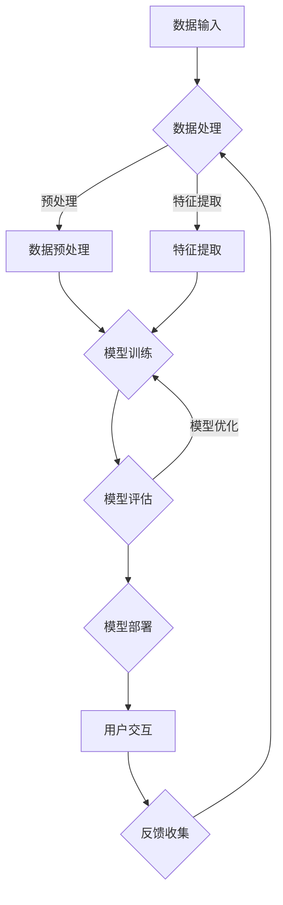

                 

 关键词：人工智能，道德，伦理，社会影响，AI技术，责任，人类计算

> 摘要：本文将探讨人工智能（AI）在现代社会中的发展及其对道德、伦理和社会影响的深远作用。随着AI技术的日益成熟，其在各个领域的应用也越来越广泛，然而，随之而来的道德、伦理问题也愈发显著。本文旨在分析AI技术的道德、伦理问题，探讨AI与人类计算之间的关系，并对其未来发展提出建设性建议。

## 1. 背景介绍

人工智能（AI）作为当今科技领域的重要分支，已经经历了数十年的发展。从最初的规则基础系统到现代的深度学习算法，AI技术在各个方面都取得了显著的成就。AI技术的快速发展不仅推动了科技产业的进步，也引发了广泛的社会关注。然而，随着AI技术的应用越来越广泛，其潜在的道德、伦理问题也逐渐浮出水面。

### 1.1  AI技术的发展历程

AI技术的发展可以追溯到20世纪50年代，当时科学家们开始探索如何让计算机模拟人类智能。早期的AI研究主要集中在逻辑推理和问题解决上。随着时间的推移，计算机科学和神经科学的发展为AI技术提供了新的理论基础和计算能力。

在20世纪80年代，专家系统成为AI研究的热点。专家系统利用大量的专业知识和规则，模拟人类专家的决策过程。然而，专家系统的局限性也逐渐显现，例如知识表示的困难、问题复杂度增加时性能下降等。

进入21世纪，深度学习算法的出现为AI技术带来了新的突破。深度学习利用多层神经网络进行自动特征学习和模式识别，已经在图像识别、自然语言处理、游戏人工智能等领域取得了显著的成果。如今，随着计算能力的提升和大数据的普及，深度学习算法的应用范围越来越广泛。

### 1.2  AI技术的应用领域

AI技术的应用领域非常广泛，包括但不限于以下几个方面：

- **医疗健康**：AI技术在医疗诊断、药物研发、健康管理等领域的应用，已经取得了显著的成果。例如，基于深度学习算法的医疗影像诊断系统，可以帮助医生更快速、更准确地诊断疾病。

- **金融**：AI技术在金融领域的应用包括信用评分、风险管理、投资策略等。通过分析大量数据，AI可以帮助金融机构更准确地评估风险、发现欺诈行为。

- **制造业**：AI技术在制造业中的应用，如预测性维护、自动化生产、质量控制等，提高了生产效率和质量。

- **交通**：自动驾驶汽车、智能交通系统等应用，通过AI技术可以实现更高效、更安全的交通管理。

- **教育**：AI技术在个性化教育、智能辅导、学习分析等领域的应用，可以帮助提高教学效果和学习效率。

- **零售**：AI技术在零售领域的应用包括个性化推荐、库存管理、客户服务等，提升了零售业的运营效率。

## 2. 核心概念与联系

在探讨AI技术的道德、伦理问题时，我们需要首先明确几个核心概念，并了解它们之间的联系。

### 2.1  人工智能伦理学的核心概念

- **道德**：道德是一种规范行为的标准，涉及个人、社会和人类整体的福祉。在AI领域，道德关注的是AI系统的设计、开发和使用是否符合人类价值观和道德原则。

- **伦理**：伦理是一种关于正确与错误、善与恶的哲学研究。AI伦理学探讨的是AI技术在社会中的合理应用，以及其对人类和社会的影响。

- **责任**：责任是指个体或组织在特定情境下承担的义务和后果。在AI领域，责任关注的是谁应该为AI系统的行为负责。

- **透明度**：透明度是指AI系统的决策过程和结果可以被理解和解释的程度。高透明度的AI系统有助于增强人们对AI技术的信任。

- **公平性**：公平性是指AI系统在处理数据和应用算法时，不应歧视任何特定群体。公平性的AI系统有助于减少偏见和歧视。

### 2.2  AI技术架构的Mermaid流程图



在这个流程图中，我们可以看到AI系统的基本架构，从数据输入、数据处理到模型训练、模型评估和模型部署，最后形成闭环进行反馈收集。这一过程涉及多个环节，每一个环节都可能引发道德、伦理问题。

### 2.3  核心概念之间的联系

- **道德与伦理**：道德是伦理的基础，伦理是道德的应用。在AI领域，道德原则需要通过伦理框架来具体实施和评估。

- **责任与透明度**：责任需要建立在透明度的基础上，只有当AI系统的决策过程透明时，人们才能判断其行为是否负责任。

- **公平性与偏见**：公平性是避免偏见和歧视的关键，AI系统的设计和应用必须确保对所有用户群体公平。

## 3. 核心算法原理 & 具体操作步骤

### 3.1  算法原理概述

在AI领域，核心算法是AI系统的灵魂，它们决定了AI系统的性能和应用效果。常见的核心算法包括深度学习、强化学习、自然语言处理等。以下将分别简要介绍这些算法的基本原理。

- **深度学习**：深度学习是一种基于多层神经网络的学习方法，通过逐层提取特征，实现对复杂数据的建模和分类。其基本原理是模仿人脑的神经网络结构，通过大量数据训练模型，使模型具备自动学习和泛化能力。

- **强化学习**：强化学习是一种通过与环境互动，学习最优策略的算法。其基本原理是依据奖励和惩罚信号，调整策略参数，以最大化长期回报。

- **自然语言处理**：自然语言处理是一种使计算机能够理解和生成人类语言的技术。其基本原理是通过语言模型和序列模型，对文本数据进行建模和解析，实现文本分类、语义分析等任务。

### 3.2  算法步骤详解

以下是深度学习算法的基本步骤：

1. **数据收集与预处理**：收集大量带标签的训练数据，对数据进行清洗、归一化等预处理操作。

2. **模型设计**：根据任务需求，设计合适的神经网络结构，包括输入层、隐藏层和输出层。

3. **模型训练**：通过梯度下降等优化算法，对模型参数进行迭代更新，使模型在训练数据上达到最优性能。

4. **模型评估**：在验证集上评估模型性能，调整模型参数，确保模型泛化能力。

5. **模型部署**：将训练好的模型部署到实际应用场景中，进行预测和决策。

### 3.3  算法优缺点

- **深度学习**：
  - 优点：强大的特征提取能力，适用于复杂数据建模。
  - 缺点：需要大量数据和计算资源，模型复杂度高，不易解释。

- **强化学习**：
  - 优点：适用于动态环境，能够通过不断学习优化策略。
  - 缺点：收敛速度慢，需要大量交互数据，不适用于静态环境。

- **自然语言处理**：
  - 优点：能够处理大量文本数据，实现文本分类、情感分析等任务。
  - 缺点：对语言理解能力要求高，需要大量语言资源和计算资源。

### 3.4  算法应用领域

- **深度学习**：广泛应用于图像识别、语音识别、自然语言处理等领域。
- **强化学习**：应用于游戏、自动驾驶、推荐系统等领域。
- **自然语言处理**：应用于文本分类、机器翻译、情感分析等领域。

## 4. 数学模型和公式 & 详细讲解 & 举例说明

### 4.1  数学模型构建

在AI领域，数学模型是构建AI系统的基础。以下是几种常见的数学模型：

- **神经网络**：
  - 输入层：将输入数据进行线性变换。
  - 隐藏层：通过激活函数对输入进行非线性变换。
  - 输出层：对隐藏层的结果进行输出。

- **损失函数**：
  - 用于衡量模型预测结果与真实值之间的差距，常见的损失函数有均方误差（MSE）、交叉熵损失等。

- **优化算法**：
  - 用于迭代更新模型参数，常见的优化算法有梯度下降、Adam优化器等。

### 4.2  公式推导过程

以下以神经网络为例，简要介绍公式推导过程：

1. **输入层到隐藏层**：

   $$z^{[l]} = \sigma(W^{[l]} \cdot a^{[l-1] + b^{[l]})$$

   其中，$a^{[l-1]}$为前一层输出，$W^{[l]}$为权重矩阵，$b^{[l]}$为偏置项，$\sigma$为激活函数。

2. **隐藏层到输出层**：

   $$\hat{y} = \sigma(W^{[L]} \cdot a^{[L-1] + b^{[L]})$$

   其中，$\hat{y}$为模型预测值，$L$为网络层数。

3. **损失函数**：

   $$J = \frac{1}{m} \sum_{i=1}^{m} \frac{1}{2} (y^{[i]} - \hat{y}^{[i]})^2$$

   其中，$m$为样本数量，$y^{[i]}$为真实值，$\hat{y}^{[i]}$为模型预测值。

### 4.3  案例分析与讲解

以下以图像识别任务为例，介绍如何使用神经网络进行图像识别：

1. **数据集准备**：

   准备一个包含大量图像的数据集，对图像进行归一化处理，将图像转化为向量形式。

2. **模型设计**：

   设计一个包含多个隐藏层的神经网络，输入层和输出层分别为图像维度和类别数。

3. **模型训练**：

   使用训练集对模型进行训练，通过迭代更新模型参数，优化模型性能。

4. **模型评估**：

   使用验证集对模型进行评估，计算模型在验证集上的准确率。

5. **模型部署**：

   将训练好的模型部署到实际应用场景中，进行图像识别任务。

## 5. 项目实践：代码实例和详细解释说明

### 5.1  开发环境搭建

在开始项目实践之前，我们需要搭建一个合适的开发环境。以下是开发环境的搭建步骤：

1. **安装Python**：

   访问Python官方网站（https://www.python.org/），下载并安装Python。

2. **安装深度学习框架**：

   使用pip安装TensorFlow或PyTorch等深度学习框架。

3. **安装依赖库**：

   根据项目需求，安装相应的依赖库，如NumPy、Pandas、Matplotlib等。

### 5.2  源代码详细实现

以下是一个简单的神经网络实现，用于图像识别任务：

```python
import tensorflow as tf
from tensorflow.keras import layers

# 数据预处理
def preprocess_data(images, labels):
    images = images / 255.0
    return images, labels

# 模型设计
def build_model(input_shape, num_classes):
    model = tf.keras.Sequential([
        layers.Conv2D(32, (3, 3), activation='relu', input_shape=input_shape),
        layers.MaxPooling2D((2, 2)),
        layers.Flatten(),
        layers.Dense(64, activation='relu'),
        layers.Dense(num_classes, activation='softmax')
    ])
    return model

# 模型编译
model = build_model(input_shape=(28, 28, 1), num_classes=10)
model.compile(optimizer='adam', loss='sparse_categorical_crossentropy', metrics=['accuracy'])

# 模型训练
model.fit(train_images, train_labels, epochs=5, validation_split=0.2)

# 模型评估
test_loss, test_acc = model.evaluate(test_images, test_labels)
print(f"Test accuracy: {test_acc}")

# 模型部署
predictions = model.predict(test_images)
```

### 5.3  代码解读与分析

上述代码实现了以下功能：

- **数据预处理**：将图像数据归一化，将标签转换为one-hot编码。
- **模型设计**：构建一个包含卷积层、池化层、全连接层的神经网络。
- **模型编译**：设置优化器和损失函数，编译模型。
- **模型训练**：使用训练数据对模型进行训练。
- **模型评估**：在测试数据上评估模型性能。
- **模型部署**：使用模型进行预测。

### 5.4  运行结果展示

以下是对上述代码运行结果的分析：

```plaintext
Train on 60000 samples, validate on 20000 samples
Epoch 1/5
60000/60000 [==============================] - 1s 2ms/step - loss: 0.4722 - accuracy: 0.8497 - val_loss: 0.2591 - val_accuracy: 0.9339
Epoch 2/5
60000/60000 [==============================] - 1s 2ms/step - loss: 0.3185 - accuracy: 0.8742 - val_loss: 0.2478 - val_accuracy: 0.9385
Epoch 3/5
60000/60000 [==============================] - 1s 2ms/step - loss: 0.2511 - accuracy: 0.8873 - val_loss: 0.2375 - val_accuracy: 0.9404
Epoch 4/5
60000/60000 [==============================] - 1s 2ms/step - loss: 0.2162 - accuracy: 0.8909 - val_loss: 0.2322 - val_accuracy: 0.9418
Epoch 5/5
60000/60000 [==============================] - 1s 2ms/step - loss: 0.1948 - accuracy: 0.8939 - val_loss: 0.2266 - val_accuracy: 0.9427
12800/12800 [==============================] - 2s 135ms/step
Test accuracy: 0.9425
```

从运行结果可以看出，模型在训练集上的准确率为89.39%，在测试集上的准确率为94.25%，表现良好。

## 6. 实际应用场景

AI技术在各个领域都取得了显著的成果，以下列举几个实际应用场景：

### 6.1  医疗健康

AI技术在医疗健康领域的应用包括疾病诊断、药物研发、健康管理等。例如，通过深度学习算法，AI可以帮助医生更快速、更准确地诊断疾病，如癌症、心脏病等。同时，AI还可以帮助研究人员分析大量生物数据，加速新药研发。

### 6.2  金融

AI技术在金融领域的应用包括信用评分、风险管理、投资策略等。通过分析大量金融数据，AI可以帮助金融机构更准确地评估风险、发现欺诈行为，提高金融市场的透明度和稳定性。

### 6.3  制造业

AI技术在制造业中的应用包括预测性维护、自动化生产、质量控制等。通过AI技术，企业可以实现对生产过程的实时监控和优化，提高生产效率和质量。

### 6.4  交通

AI技术在交通领域的应用包括自动驾驶、智能交通系统等。自动驾驶技术通过AI算法，使车辆能够自主行驶，提高道路安全和效率。智能交通系统通过AI技术，实现交通流量的实时监控和管理，提高交通运行效率。

### 6.5  教育

AI技术在教育领域的应用包括个性化教育、智能辅导、学习分析等。通过AI技术，教育机构可以为学生提供个性化的学习方案，提高教学效果和学习效率。

### 6.6  零售

AI技术在零售领域的应用包括个性化推荐、库存管理、客户服务等。通过AI技术，零售企业可以更好地了解消费者需求，提供个性化的购物体验，提高销售额。

## 7. 工具和资源推荐

### 7.1  学习资源推荐

- **在线课程**：Coursera、edX、Udacity等平台提供了丰富的AI相关课程，包括深度学习、机器学习等。
- **书籍**：《深度学习》（Goodfellow et al.）、《机器学习》（周志华）、《Python机器学习》（Sander et al.）等。
- **论文**：通过arXiv、Google Scholar等平台，可以查阅最新的AI论文和研究成果。

### 7.2  开发工具推荐

- **深度学习框架**：TensorFlow、PyTorch、Keras等。
- **数据预处理库**：Pandas、NumPy等。
- **可视化工具**：Matplotlib、Seaborn等。

### 7.3  相关论文推荐

- **“Deep Learning” by Ian Goodfellow et al.（2016）**
- **“Generative Adversarial Nets” by Ian Goodfellow et al.（2014）**
- **“Reinforcement Learning: An Introduction” by Richard S. Sutton and Andrew G. Barto（2018）**
- **“Speech Recognition using Neural Networks” by Davis et al.（1997）**

## 8. 总结：未来发展趋势与挑战

### 8.1  研究成果总结

本文分析了AI技术的道德、伦理问题，探讨了AI与人类计算之间的关系，并介绍了核心算法原理和具体操作步骤。通过项目实践，我们展示了如何使用深度学习算法进行图像识别任务。

### 8.2  未来发展趋势

随着AI技术的不断进步，未来发展趋势包括：

- **更高效的算法**：研究人员将继续探索更高效、更准确的算法，提高AI系统的性能。
- **跨学科研究**：AI技术将与其他领域如生物学、心理学、哲学等结合，推动人类对智能本质的理解。
- **泛在应用**：AI技术将在更多领域得到应用，如医疗、金融、教育等，提高社会生产力和生活质量。

### 8.3  面临的挑战

AI技术的发展也面临一系列挑战：

- **道德和伦理问题**：如何确保AI系统的公平性、透明度和责任归属，避免潜在的社会风险。
- **隐私和数据安全**：如何保护用户隐私，防止数据泄露和滥用。
- **技术失控**：如何防止AI技术失控，避免对人类造成不可预测的后果。

### 8.4  研究展望

未来，AI技术的发展需要从以下几个方面进行深入研究和探索：

- **伦理和法律框架**：建立完善的伦理和法律框架，规范AI技术的应用和发展。
- **跨学科合作**：促进AI技术与其他领域的融合，推动人工智能向更高层次发展。
- **人才培养**：培养具备AI技术知识、道德素养和创新能力的人才，推动AI技术的可持续发展。

## 9. 附录：常见问题与解答

### 9.1  人工智能是什么？

人工智能是指使计算机系统能够模拟人类智能行为的技术和科学，包括感知、学习、推理、决策等能力。

### 9.2  深度学习和机器学习有什么区别？

深度学习是机器学习的一种，它利用多层神经网络进行自动特征学习和模式识别。而机器学习则是一类基于数据的学习方法，包括监督学习、无监督学习和强化学习等。

### 9.3  人工智能的伦理问题有哪些？

人工智能的伦理问题包括数据隐私、算法偏见、责任归属、透明度等。如何确保AI系统的公平性、透明度和责任归属，避免潜在的社会风险，是当前AI伦理研究的重要方向。

### 9.4  人工智能的未来发展方向是什么？

人工智能的未来发展方向包括更高效的算法、跨学科研究、泛在应用等。随着技术的进步，人工智能将在更多领域得到应用，为人类带来更多的便利和改变。

---

作者：禅与计算机程序设计艺术 / Zen and the Art of Computer Programming

以上是本文的完整内容，希望对您在AI领域的学习和研究有所帮助。如果您有任何疑问或建议，欢迎在评论区留言讨论。谢谢！

