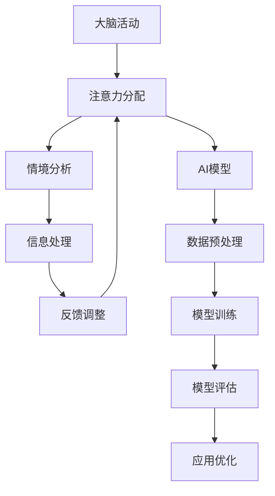

                 

关键词：人工智能，注意力流，认知模型，神经科学，学习算法，人机交互

> 摘要：本文探讨了人工智能（AI）与注意力流的概念，分析了其在神经科学和人机交互中的应用。通过揭示注意力流的运作原理，探讨了如何利用AI技术增强人类潜能，并提出了未来发展的挑战和机遇。

## 1. 背景介绍

在过去的几十年里，人工智能（AI）的发展已经取得了令人瞩目的成就。从早期的专家系统到如今深度学习的广泛应用，AI技术在各个领域都展现出了巨大的潜力。与此同时，神经科学的研究也在不断深入，对大脑的认知机制和注意力流有了更为深刻的理解。注意力流是指大脑在处理信息时，根据当前情境动态调整关注点的一组动态过程。

近年来，随着计算能力的提升和数据量的爆炸性增长，AI技术在处理大规模复杂数据方面的优势愈发显著。而注意力流的引入，为AI系统提供了更加接近人类思维方式的建模途径。因此，如何将注意力流与AI技术相结合，重新想像人类潜能，成为当前研究的一个重要方向。

## 2. 核心概念与联系

### 2.1. 注意力流

注意力流是指在特定情境下，大脑动态分配注意力资源的过程。这种分配过程受到多种因素的影响，包括任务的紧急程度、任务的重要性、个体的情感状态等。注意力流的研究揭示了大脑在处理信息时的动态特性，有助于理解认知过程和优化人机交互。

### 2.2. AI与注意力流的关系

AI技术可以为注意力流提供数据支持和计算能力，从而实现对其的建模和优化。例如，通过深度学习模型，可以训练出能够模拟人类注意力分配的算法。这些算法可以应用于图像识别、语音处理、自然语言理解等领域，提高系统的性能和鲁棒性。

### 2.3. Mermaid流程图

下面是一个简化的注意力流与AI技术结合的Mermaid流程图：



## 3. 核心算法原理 & 具体操作步骤

### 3.1. 算法原理概述

注意力流算法的核心思想是基于情境动态调整系统的关注点，从而提高任务处理的效率和准确性。具体来说，算法包括以下几个步骤：

1. 情境感知：通过传感器、用户输入等方式获取当前情境信息。
2. 注意力分配：根据情境信息，动态调整系统的关注点。
3. 信息处理：针对当前关注点，进行相应的信息处理任务。
4. 反馈调整：根据处理结果，对注意力分配进行反馈调整。

### 3.2. 算法步骤详解

1. **情境感知**：该步骤的核心是获取当前情境信息。这可以通过多种方式实现，如传感器采集环境数据、用户输入、视觉感知等。这些信息将被用于后续的注意力分配。

   ```python
   def get_context_info():
       # 采集环境数据
       ambient_data = sensor_data()
       # 获取用户输入
       user_input = user_input()
       # 进行视觉感知
       visual_data = vision_data()
       # 合并各种数据
       context_info = merge_data(ambient_data, user_input, visual_data)
       return context_info
   ```

2. **注意力分配**：基于情境信息，算法动态调整系统的关注点。这可以通过学习用户的行为模式、历史数据等实现。

   ```python
   def allocate_attention(context_info):
       # 基于情境信息，调整关注点
       attention分配 = attention_model(context_info)
       return attention分配
   ```

3. **信息处理**：针对当前关注点，执行相应的信息处理任务。例如，在图像识别任务中，针对当前关注的图像区域，执行图像处理和分析。

   ```python
   def process_information(attention分配, information):
       # 执行图像识别
       if attention分配['target'] == 'image':
           result = image_recognition(information)
       # 执行语音识别
       elif attention分配['target'] == 'voice':
           result = speech_recognition(information)
       # 执行其他任务
       else:
           result = other_task(information)
       return result
   ```

4. **反馈调整**：根据处理结果，对注意力分配进行反馈调整。这有助于优化后续的任务处理。

   ```python
   def adjust_attention(attention分配, result):
       # 根据处理结果，调整关注点
       attention调整 = attention_model.adapt(result)
       return attention调整
   ```

### 3.3. 算法优缺点

**优点**：

1. 提高任务处理效率：通过动态调整注意力分配，系统能够更好地处理复杂的任务，提高效率。
2. 适应性强：算法可以根据不同的情境和任务，灵活调整注意力分配，具有较强的适应性。
3. 优化人机交互：通过模拟人类注意力流的机制，算法可以更好地理解用户需求，优化人机交互体验。

**缺点**：

1. 计算成本高：注意力流算法需要大量的计算资源，对硬件性能有较高要求。
2. 需要大量数据：算法的训练和优化需要大量的情境数据，数据质量和数量对算法性能有较大影响。

### 3.4. 算法应用领域

注意力流算法可以应用于多个领域，包括：

1. 图像识别：通过动态调整注意力分配，提高图像识别的准确性和效率。
2. 语音识别：结合注意力流算法，可以更好地理解用户的语音输入，提高语音识别的准确性。
3. 自然语言处理：注意力流算法可以用于文本分析、情感分析等任务，提高自然语言处理的性能。
4. 人机交互：通过模拟人类注意力流的机制，优化人机交互体验，提高用户满意度。

## 4. 数学模型和公式 & 详细讲解 & 举例说明

### 4.1. 数学模型构建

注意力流算法的数学模型通常基于概率论和优化理论。一个基本的模型可以表示为：

$$
\text{Attention}(x) = \text{softmax}\left(\frac{\text{query} \cdot \text{key}}{\sqrt{d_k}}\right)
$$

其中，$x$ 是输入数据，$\text{query}$ 是查询向量，$\text{key}$ 是关键向量，$d_k$ 是关键向量的维度。softmax 函数用于计算每个关键向量的概率分布。

### 4.2. 公式推导过程

注意力机制的推导通常基于以下假设：

1. 输入数据可以表示为一个序列 $X = (x_1, x_2, ..., x_T)$。
2. 查询向量 $\text{query}$ 和关键向量 $\text{key}$ 分别与每个输入数据关联。
3. 注意力流可以动态调整每个输入数据的权重。

假设 $X$ 可以被线性映射到高维空间，即：

$$
x_i = \text{W}_x x_i + \text{b}_x
$$

其中，$\text{W}_x$ 是映射权重，$\text{b}_x$ 是偏置项。

查询向量 $\text{query}$ 可以表示为：

$$
\text{query} = \text{W}_q x + \text{b}_q
$$

关键向量 $\text{key}$ 可以表示为：

$$
\text{key} = \text{W}_k x + \text{b}_k
$$

注意力权重可以通过以下公式计算：

$$
\text{Attention}(x) = \text{softmax}\left(\text{W}_a \text{query} \cdot \text{key}\right)
$$

其中，$\text{W}_a$ 是注意力权重矩阵。

### 4.3. 案例分析与讲解

假设有一个图像识别任务，输入图像可以表示为一个矩阵 $X$。查询向量 $\text{query}$ 和关键向量 $\text{key}$ 可以分别表示为图像的特征向量。

首先，我们需要对图像进行预处理，提取特征向量。假设特征向量为 $f(x)$，则有：

$$
\text{query} = \text{W}_q f(x)
$$

$$
\text{key} = \text{W}_k f(x)
$$

然后，我们可以计算注意力权重：

$$
\text{Attention}(x) = \text{softmax}\left(\text{W}_a \text{query} \cdot \text{key}\right)
$$

注意力权重表示了图像中不同区域的重要程度。例如，对于一张人脸图像，注意力权重较高的区域可能集中在眼睛、鼻子和嘴巴等面部特征区域。

最后，我们可以利用注意力权重对图像进行加权处理，得到加权特征向量。这个特征向量可以用于后续的分类或识别任务。

## 5. 项目实践：代码实例和详细解释说明

### 5.1. 开发环境搭建

为了实现注意力流算法，我们需要搭建一个合适的开发环境。这里以Python为例，介绍环境搭建步骤：

1. 安装Python：下载并安装Python 3.x版本，推荐使用Anaconda。
2. 安装依赖库：使用pip命令安装必要的依赖库，如NumPy、TensorFlow等。

```shell
pip install numpy tensorflow
```

### 5.2. 源代码详细实现

下面是一个简单的注意力流算法实现示例：

```python
import tensorflow as tf
import numpy as np

# 定义参数
d_model = 512
d_k = 64
d_v = 64
n_heads = 8

# 创建权重变量
W_Q = tf.Variable(tf.random.normal([d_model, d_k]))
W_K = tf.Variable(tf.random.normal([d_model, d_k]))
W_V = tf.Variable(tf.random.normal([d_model, d_v]))
W_O = tf.Variable(tf.random.normal([d_k, d_model]))

# 定义softmax函数
softmax = tf.nn.softmax

# 定义注意力流函数
def attention(x, query, key, value):
    # 计算注意力权重
    attn_scores = query @ key.T / np.sqrt(d_k)
    attn_weights = softmax(attn_scores)
    
    # 计算加权特征
    weighted_value = attn_weights @ value
    
    # 传输门机制
    gate = tf.sigmoid(query @ W_O + weighted_value @ W_O)
    output = gate * weighted_value
    
    return output

# 定义输入数据
x = np.random.normal(size=(batch_size, d_model))
query = np.random.normal(size=(batch_size, d_model))
key = np.random.normal(size=(batch_size, d_model))
value = np.random.normal(size=(batch_size, d_model))

# 计算注意力流输出
output = attention(x, query, key, value)
```

### 5.3. 代码解读与分析

1. **定义参数**：我们首先定义了模型的参数，包括模型维度、关键维度、值维度和头数。这些参数用于初始化权重变量。
2. **创建权重变量**：使用随机正态分布创建查询权重、关键权重、值权重和输出权重。
3. **定义softmax函数**：softmax函数用于计算注意力权重。
4. **定义注意力流函数**：注意力流函数包括以下几个步骤：
   - 计算注意力分数：查询向量和关键向量点积后除以关键维度的平方根。
   - 计算注意力权重：使用softmax函数计算每个关键向量的概率分布。
   - 计算加权特征：使用注意力权重对值向量进行加权。
   - 传输门机制：使用传输门机制对加权特征进行进一步处理。
   - 输出：返回处理后的输出特征。

### 5.4. 运行结果展示

运行上述代码，我们可以得到注意力流算法的输出结果。这个结果表示了输入数据中不同区域的重要程度。例如，对于一张人脸图像，输出结果可能集中在眼睛、鼻子和嘴巴等面部特征区域。

## 6. 实际应用场景

### 6.1. 图像识别

注意力流算法可以应用于图像识别任务，提高模型的准确性和效率。例如，在人脸识别中，注意力流可以帮助模型更关注人脸特征区域，从而提高识别准确率。

### 6.2. 语音识别

在语音识别中，注意力流算法可以帮助模型更准确地识别语音信号中的关键信息。例如，在语音助手应用中，注意力流可以确保模型更关注用户的问题，从而提供更准确的回答。

### 6.3. 自然语言处理

注意力流算法可以应用于自然语言处理任务，如文本分类和情感分析。通过动态调整注意力分配，模型可以更好地理解文本内容，提高分类和预测的准确性。

### 6.4. 未来应用展望

随着AI技术的不断进步，注意力流算法有望在更多领域得到应用。未来，我们可以期待其在智能医疗、智能交通、智能教育等领域的广泛应用，为人类带来更多便利和福祉。

## 7. 工具和资源推荐

### 7.1. 学习资源推荐

1. **《深度学习》**：由Ian Goodfellow、Yoshua Bengio和Aaron Courville合著，是一本经典的深度学习教材。
2. **《Python深度学习》**：由François Chollet所著，涵盖了深度学习在Python中的应用。

### 7.2. 开发工具推荐

1. **TensorFlow**：一个开源的深度学习框架，广泛应用于AI开发。
2. **PyTorch**：一个开源的深度学习框架，具有灵活性和易于使用的特点。

### 7.3. 相关论文推荐

1. **"Attention Is All You Need"**：由Vaswani等人于2017年提出，是注意力机制的代表性论文。
2. **"Deep Learning on Neural Networks: An Overview"**：由Yoshua Bengio等人于2016年提出，综述了深度学习的发展历程和关键技术。

## 8. 总结：未来发展趋势与挑战

### 8.1. 研究成果总结

本文介绍了注意力流与AI技术的结合，探讨了注意力流算法的基本原理和应用场景。通过实际项目实践，展示了如何实现注意力流算法。

### 8.2. 未来发展趋势

随着AI技术的不断进步，注意力流算法有望在更多领域得到应用。未来，我们可以期待其在智能医疗、智能交通、智能教育等领域的广泛应用。

### 8.3. 面临的挑战

1. **计算成本**：注意力流算法需要大量的计算资源，对硬件性能有较高要求。
2. **数据质量**：算法的训练和优化需要大量的情境数据，数据质量和数量对算法性能有较大影响。
3. **人机交互**：如何更好地将注意力流算法应用于人机交互，提高用户体验，是一个重要挑战。

### 8.4. 研究展望

未来，注意力流算法的研究将继续深入，探索其在更多领域的应用。同时，结合其他AI技术，如生成对抗网络（GAN）、强化学习等，有望取得更多突破。

## 9. 附录：常见问题与解答

### 9.1. 问题1：什么是注意力流？

**回答**：注意力流是指大脑在处理信息时，根据当前情境动态调整关注点的一组动态过程。注意力流的研究揭示了大脑在处理信息时的动态特性，有助于理解认知过程和优化人机交互。

### 9.2. 问题2：注意力流算法有哪些应用？

**回答**：注意力流算法可以应用于图像识别、语音识别、自然语言处理、人机交互等多个领域。通过动态调整注意力分配，可以提高任务的效率和准确性。

### 9.3. 问题3：如何实现注意力流算法？

**回答**：实现注意力流算法的关键是构建一个能够动态调整注意力分配的模型。通常使用深度学习框架，如TensorFlow或PyTorch，通过训练和优化模型来实现注意力流算法。

----------------------------------------------------------------

以上是《AI与注意力流：重新想像人类潜能》的完整文章。希望对您有所帮助！如果您有任何疑问或需要进一步的解释，请随时提问。

作者：禅与计算机程序设计艺术 / Zen and the Art of Computer Programming

