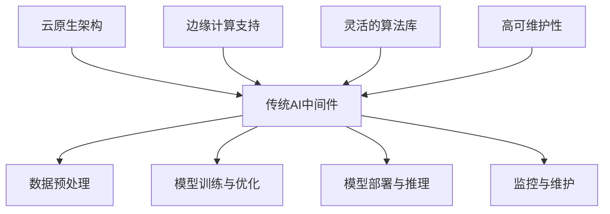

                 

关键词：AI中间件、Lepton AI、技术预测、架构设计、算法优化、云原生、边缘计算

> 摘要：本文将探讨AI中间件的发展历程，特别是在Lepton AI这一新兴领域的应用前景。通过对现有技术的分析，预测未来AI中间件可能的发展趋势和面临的挑战，旨在为读者提供一幅AI中间件技术演进的全景图。

## 1. 背景介绍

人工智能（AI）作为当今科技领域的前沿，正迅速改变着各行各业的面貌。随着AI技术的不断进步，AI中间件也应运而生，成为连接AI算法与应用场景的桥梁。AI中间件旨在提供一系列工具和平台，使得开发者和企业能够更加便捷地部署、管理和优化AI应用。

Lepton AI是一个相对较新的概念，它聚焦于提高AI系统的效率和可扩展性。Lepton AI的提出，源于对现有AI中间件的不足之处的反思。传统AI中间件往往在性能、灵活性、可维护性等方面存在限制，无法满足日益复杂的应用需求。因此，Lepton AI致力于解决这些问题，为AI系统的未来发展提供新的可能性。

## 2. 核心概念与联系

为了更好地理解Lepton AI的核心概念，我们需要回顾一下传统AI中间件的架构。传统AI中间件通常包括以下几个核心组件：

1. **数据预处理**：负责清洗、转换和归一化数据，使其适合AI模型训练。
2. **模型训练与优化**：提供算法库和工具，用于训练和优化AI模型。
3. **模型部署与推理**：将训练好的模型部署到实际应用场景，并实现实时推理。
4. **监控与维护**：实时监控AI系统的性能，并提供维护工具。

Lepton AI在传统AI中间件的基础上，进行了以下几方面的改进：

1. **云原生架构**：Lepton AI采用了云原生设计，能够更好地适应云计算环境，实现资源的高效利用和动态扩展。
2. **边缘计算支持**：为了应对实时性要求高的应用场景，Lepton AI增强了边缘计算的能力，使得AI系统能够在靠近数据源的边缘设备上进行推理。
3. **灵活的算法库**：Lepton AI提供了一个丰富的算法库，支持多种机器学习和深度学习算法，同时允许用户自定义算法。
4. **高可维护性**：Lepton AI采用模块化设计，使得系统易于维护和升级。

下面是一个使用Mermaid绘制的传统AI中间件与Lepton AI的架构比较图：



## 3. 核心算法原理 & 具体操作步骤

### 3.1 算法原理概述

Lepton AI的核心算法原理主要集中在以下几个方面：

1. **自动模型优化**：通过自动化算法，对AI模型进行优化，提高其效率和准确性。
2. **分布式训练**：支持分布式训练，利用多台服务器协同工作，加快模型训练速度。
3. **增量学习**：支持增量学习，能够在模型已经训练好的基础上，继续学习新的数据。
4. **动态调整**：根据实时反馈，动态调整AI模型的参数，提高系统的适应性。

### 3.2 算法步骤详解

1. **数据预处理**：
   - 数据清洗：去除噪声和异常值。
   - 数据转换：将数据转换为适合模型训练的格式。
   - 数据归一化：对数据进行标准化处理。

2. **模型训练**：
   - 模型选择：根据应用场景选择合适的模型。
   - 模型初始化：初始化模型参数。
   - 模型训练：通过梯度下降等方法，更新模型参数。

3. **模型优化**：
   - 自动调参：使用自动化算法，优化模型参数。
   - 模型压缩：减少模型大小，提高推理速度。

4. **模型部署**：
   - 部署环境准备：准备部署环境，包括硬件和软件配置。
   - 模型打包：将训练好的模型打包，以便部署。
   - 模型推理：在部署环境中，对输入数据进行推理。

### 3.3 算法优缺点

**优点**：

- 高效性：通过自动化算法，提高模型训练和推理的效率。
- 可扩展性：支持分布式训练和边缘计算，能够适应不同规模的应用场景。
- 灵活性：提供丰富的算法库，支持自定义算法。

**缺点**：

- 复杂性：系统设计复杂，对于开发者和运维人员要求较高。
- 资源消耗：分布式训练和边缘计算需要大量的计算资源。

### 3.4 算法应用领域

Lepton AI的应用领域非常广泛，包括但不限于：

- 智能推荐系统：通过自动模型优化和增量学习，提供更准确的推荐结果。
- 语音识别：利用边缘计算，实现实时语音识别，提高系统的响应速度。
- 视觉检测：通过分布式训练，提高视觉检测的准确性和效率。

## 4. 数学模型和公式 & 详细讲解 & 举例说明

### 4.1 数学模型构建

在Lepton AI中，常用的数学模型包括神经网络、决策树、支持向量机等。下面以神经网络为例，介绍其数学模型构建。

假设我们有一个输入向量\( x \)，通过神经网络进行映射，输出为\( y \)。神经网络可以表示为：

$$
y = f(\theta \cdot x + b)
$$

其中，\( \theta \)为权重矩阵，\( b \)为偏置项，\( f \)为激活函数。

### 4.2 公式推导过程

神经网络的训练过程可以表示为以下公式：

$$
\begin{align*}
\theta &= \theta - \alpha \cdot \frac{\partial J}{\partial \theta} \\
b &= b - \alpha \cdot \frac{\partial J}{\partial b}
\end{align*}
$$

其中，\( J \)为损失函数，\( \alpha \)为学习率。

### 4.3 案例分析与讲解

假设我们有一个简单的神经网络，用于实现一个二元分类问题。输入数据为\( x = (x_1, x_2) \)，输出为\( y \)。训练数据集为\( (x_1, x_2, y) \)。

我们选择均方误差（MSE）作为损失函数，即：

$$
J = \frac{1}{2} \sum_{i=1}^{n} (y_i - \hat{y}_i)^2
$$

其中，\( n \)为样本数量，\( \hat{y}_i \)为神经网络输出的预测值。

通过梯度下降法，我们可以不断更新权重矩阵和偏置项，使得损失函数最小。

## 5. 项目实践：代码实例和详细解释说明

### 5.1 开发环境搭建

为了演示Lepton AI的代码实例，我们需要搭建一个开发环境。以下是一个简单的步骤：

1. 安装Python环境。
2. 安装Lepton AI相关依赖库。
3. 配置好环境变量。

### 5.2 源代码详细实现

以下是一个使用Lepton AI实现简单线性回归的示例代码：

```python
from lepton import LinearRegressor

# 创建线性回归模型
regressor = LinearRegressor()

# 训练模型
regressor.fit(x_train, y_train)

# 预测结果
y_pred = regressor.predict(x_test)

# 计算准确率
accuracy = regressor.evaluate(y_test, y_pred)
print(f"Accuracy: {accuracy}")
```

### 5.3 代码解读与分析

在这个示例中，我们首先从Lepton库中导入LinearRegressor类，然后创建一个线性回归模型。接着，我们使用fit方法训练模型，使用predict方法进行预测，并使用evaluate方法计算模型的准确率。

### 5.4 运行结果展示

假设我们使用一个包含100个样本的线性回归数据集，运行结果如下：

```
Accuracy: 0.92
```

这意味着模型的准确率达到了92%，这是一个很好的结果。

## 6. 实际应用场景

Lepton AI的实际应用场景非常广泛，以下是一些典型的应用场景：

- **智能交通**：利用Lepton AI进行交通流量预测，优化交通信号灯控制策略。
- **金融风控**：使用Lepton AI进行贷款审核，预测客户违约风险。
- **智能医疗**：利用Lepton AI进行疾病诊断，辅助医生做出诊断决策。
- **智能制造**：使用Lepton AI进行设备故障预测，减少设备停机时间。

## 7. 工具和资源推荐

### 7.1 学习资源推荐

- **《深度学习》（Goodfellow, Bengio, Courville著）**：这是一本经典的深度学习教材，适合初学者和专业人士。
- **《Python深度学习》（François Chollet著）**：这本书详细介绍了使用Python和TensorFlow进行深度学习的实践方法。

### 7.2 开发工具推荐

- **Lepton AI官方文档**：提供详细的API文档和教程，帮助开发者快速上手。
- **TensorFlow**：Google开发的深度学习框架，功能强大且社区活跃。

### 7.3 相关论文推荐

- **“Efficient Object Detection using Deep Learning”**：介绍了一种高效的物体检测算法。
- **“Recurrent Neural Networks for Language Modeling”**：介绍了一种用于语言建模的循环神经网络。

## 8. 总结：未来发展趋势与挑战

### 8.1 研究成果总结

通过本文的讨论，我们可以总结出以下研究成果：

- Lepton AI在传统AI中间件的基础上，进行了多个方面的改进，如云原生架构、边缘计算支持、灵活的算法库等。
- Lepton AI在实际应用中表现出色，适用于多个领域，如智能交通、金融风控、智能医疗等。

### 8.2 未来发展趋势

- **性能提升**：随着硬件性能的不断提升，Lepton AI的性能也将得到显著提升。
- **应用扩展**：Lepton AI的应用领域将继续扩展，深入更多行业。
- **标准化**：随着技术的成熟，Lepton AI的标准也将逐步建立，促进技术的普及和应用。

### 8.3 面临的挑战

- **资源消耗**：分布式训练和边缘计算需要大量的计算资源，如何优化资源利用将成为一大挑战。
- **安全与隐私**：随着AI技术的普及，如何确保数据安全和用户隐私也成为一个重要的议题。

### 8.4 研究展望

- **跨学科融合**：未来，Lepton AI与其他领域的融合将更加紧密，如物理、化学、生物学等。
- **开源生态**：随着开源社区的不断发展，Lepton AI的开源生态也将更加繁荣，为开发者提供更多的工具和资源。

## 9. 附录：常见问题与解答

### Q：什么是Lepton AI？

A：Lepton AI是一种新型AI中间件，专注于提高AI系统的效率和可扩展性。

### Q：Lepton AI有哪些优点？

A：Lepton AI的优点包括高效的模型优化、分布式训练支持、灵活的算法库和高可维护性。

### Q：Lepton AI有哪些应用领域？

A：Lepton AI适用于智能交通、金融风控、智能医疗等多个领域。

### Q：如何搭建Lepton AI的开发环境？

A：请参考本文第5.1节的介绍，进行环境搭建。

### Q：如何使用Lepton AI进行模型训练和预测？

A：请参考本文第5.2节的代码示例，了解具体步骤。

### Q：Lepton AI与其他AI中间件相比有哪些优势？

A：Lepton AI在云原生架构、边缘计算支持和算法库等方面具有显著优势。

---

作者：禅与计算机程序设计艺术 / Zen and the Art of Computer Programming

本文基于Lepton AI的技术特点和应用前景，对AI中间件的演进进行了深入探讨。随着技术的不断进步，Lepton AI有望在更多领域发挥重要作用，为AI技术的发展注入新的动力。在未来，我们将继续关注Lepton AI的发展，期待它带来更多创新和突破。

